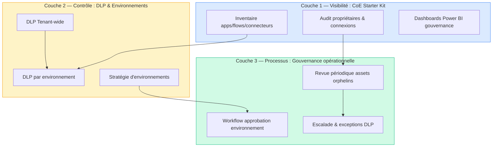
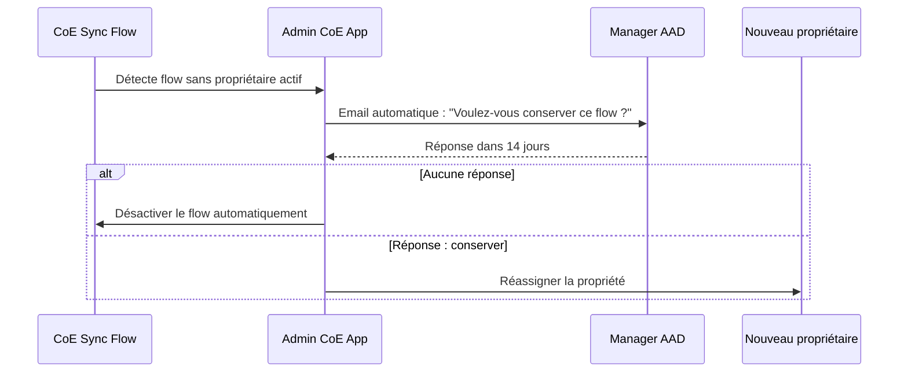
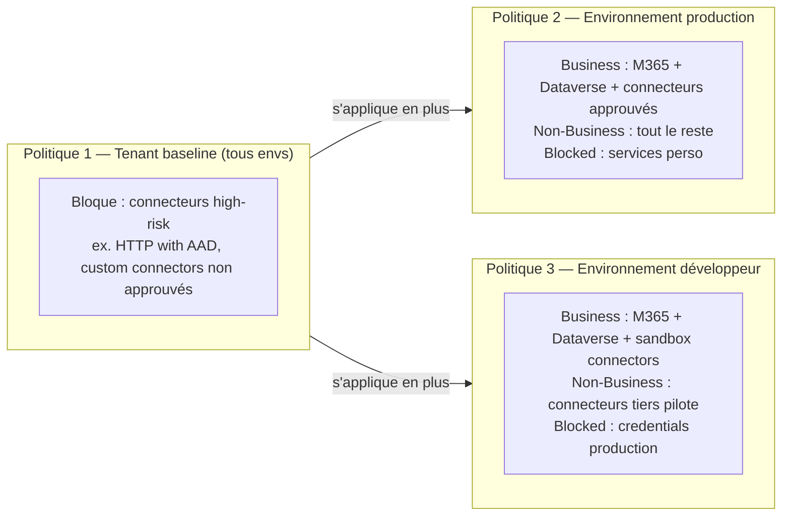
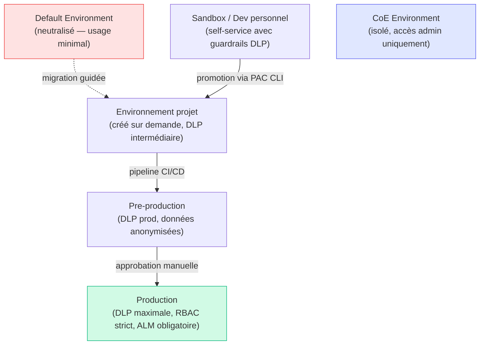

# Scénario F — Architecture CoE : inventaire, DLP et gouvernance

## Objectifs pédagogiques

À l'issue de ce module, vous serez capable de :

1. **Cartographier** l'exposition réelle d'un tenant Power Platform en termes de connecteurs, flows et applications non gouvernés
2. **Concevoir** une architecture DLP multi-couches adaptée à des contextes d'usage hétérogènes (équipes métier, projets IT, production)
3. **Déployer** le CoE Starter Kit et interpréter ses inventaires pour prioriser les actions de gouvernance
4. **Configurer** des politiques DLP cohérentes entre environnements en évitant les angles morts classiques
5. **Définir** une stratégie d'environnements qui réduit la surface d'exposition sans bloquer l'adoption métier

---

## Mise en situation

En mars 2023, une entreprise pharmaceutique européenne découvre lors d'un audit que 140 flows Power Automate actifs dans son tenant utilisent des connecteurs vers des services tiers non approuvés — dont OneDrive personnel, Slack, et plusieurs services webhook anonymes. Aucune DLP n'était en place sur l'environnement par défaut. Des données de planning de production avaient été routées vers des comptes personnels depuis 18 mois.

Ce n'est pas un cas isolé. La dynamique de Power Platform est précisément celle qui crée ce risque : les utilisateurs métier créent sans friction, les admins découvrent après coup. Le problème n'est pas que les utilisateurs font des bêtises — c'est que **rien dans l'architecture n'était en place pour rendre les mauvaises configurations visibles ou impossibles**.

La réponse naïve — "bloquer tous les connecteurs non Microsoft" — génère une résistance utilisateur massive et détruit l'adoption. La bonne réponse est une architecture de gouvernance qui distingue ce qui doit être impossible, ce qui doit être audité, et ce qui peut être laissé libre dans un périmètre maîtrisé.

C'est l'objet de ce module.

---

## Ce qu'un tenant non gouverné expose réellement

Avant de concevoir une défense, cartographier ce qui est réellement exposé.

### Surface d'exposition d'un tenant Power Platform sans gouvernance

| Vecteur | Exposition | Impact potentiel |
|---|---|---|
| Environnement par défaut ouvert | Tout utilisateur M365 peut créer apps et flows | Exfiltration de données Dataverse ou SharePoint vers l'extérieur |
| Connecteurs non classifiés en DLP | Aucune restriction sur les combos de connecteurs | Flux de données entre systèmes métier critiques et services tiers |
| Flows sans propriétaire actif | Le créateur a quitté l'entreprise, le flow tourne toujours | Credentials intégrés toujours valides, aucune surveillance |
| Apps partagées sans AAD group | Partagées avec "Tout le monde dans l'organisation" | Accès non contrôlé aux données sous-jacentes |
| Connexions avec credentials personnels | OAuth personnel ou clé API codée | Révocation impossible sans intervention manuelle |
| Environnements trial créés par les utilisateurs | Hors périmètre des DLP d'admin | Bac à sable non surveillé avec accès aux mêmes connecteurs |

🔴 **Vecteur d'attaque** — Un attaquant interne (ou un utilisateur négligent) qui a accès à Power Automate peut créer en 10 minutes un flow qui copie toute une table Dataverse vers un Google Sheet externe, sans déclencher aucune alerte si aucune DLP n'est configurée sur l'environnement par défaut.

---

## Modèle de menace CoE

### Acteurs et scénarios prioritaires

Le modèle STRIDE appliqué à Power Platform donne :

| Catégorie STRIDE | Scénario concret | Probabilité |
|---|---|---|
| **S**poofing | Flow utilisant une connexion partagée avec les credentials d'un compte de service | Moyenne |
| **T**ampering | Modification d'un flow de production sans historique de version (hors ALM) | Haute |
| **R**epudiation | Aucun log d'exécution conservé > 28 jours (limite native) | Haute |
| **I**nformation Disclosure | Connecteur HTTP envoyant des données métier vers un endpoint webhook non validé | Haute |
| **D**enial of Service | Flow en boucle infinie consommant tous les run quotas d'un tenant | Faible |
| **E**levation of Privilege | App Canvas utilisant un service account avec rôle System Admin Dataverse | Moyenne |

🧠 **Concept clé** — La menace dominante sur Power Platform n'est pas l'intrusion externe : c'est la **fuite de données non intentionnelle par des utilisateurs légitimes** combinée à une **absence totale de traçabilité**. La gouvernance CoE adresse d'abord ce vecteur.

### Actifs à protéger par priorité

```
Tier 1 (critique)     → Données Dataverse de production, credentials de connexion partagés
Tier 2 (sensible)     → Flows connectés aux systèmes ERP/RH/finance, apps partagées à l'organisation
Tier 3 (à surveiller) → Environnements développeur, apps personnelles, flows sans approbation IT
```

---

## Architecture cible : les trois couches du CoE

Une architecture CoE opérationnelle repose sur trois niveaux distincts qui se complètent sans se substituer.



**Principe directeur** : la visibilité doit précéder le contrôle. Déployer des DLP restrictives sans inventaire préalable génère des blocages en production et des demandes d'exception non qualifiées.

---

## Couche 1 — Inventaire avec le CoE Starter Kit

### Ce que le CoE Starter Kit fait réellement

Le CoE Starter Kit n'est pas un outil Microsoft officiel au sens produit — c'est une **solution Power Platform déployée dans votre propre tenant**, maintenue par l'équipe Power CAT. Elle utilise les mêmes API d'administration que vous utiliseriez manuellement.

Elle se compose de :

- **Flux de synchronisation** : interrogent les API Admin Power Platform toutes les 24h et alimentent des tables Dataverse dédiées
- **Apps Canvas d'administration** : UI pour les admins CoE (inventaire, approbations, nettoyage)
- **Dashboards Power BI** : vues analytiques de la gouvernance

⚠️ **Erreur fréquente** — Déployer le CoE Starter Kit dans l'environnement par défaut. Il doit être dans un environnement dédié avec son propre Dataverse, isolé des utilisateurs finaux. Les tables CoE contiennent des métadonnées sensibles sur tous vos flows et applications.

### Déployer le CoE Starter Kit : étapes clés

Le déploiement prend 2 à 4 heures la première fois. Voici la séquence minimale fiable :

**Étape 1 — Préparer l'environnement dédié**

```
Power Platform Admin Center
  → Environments → New
    → Nom : CoE-Governance-Prod
    → Type : Production (pas Sandbox — les flows de sync doivent tourner 24/7)
    → Activer Dataverse : Oui
    → Accès : admins Power Platform uniquement
```

**Étape 2 — Installer la solution CoE Core**

```
Télécharger depuis : aka.ms/CoEStarterKitDownload
  → CenterofExcellenceCoreComponents_x.x.x_managed.zip
  → Admin Center → Solutions → Import → sélectionner le fichier
  → Résoudre les connection references :
      - Admin | Core → compte service admin Power Platform
      - M365 Users → compte service avec droits lecture AAD
```

**Étape 3 — Configurer les environment variables**

```
Solution CoE Core → Environment variables
  → Admin eMail : adresse de l'équipe CoE
  → Also notify this email : backup admin
  → Tenant ID : ID du tenant Azure AD
  → Run Inventory on all environments : Yes
```

**Étape 4 — Activer les flows de synchronisation dans l'ordre**

```
1. Admin | Sync Template v3 (flows) → activer en premier
2. Admin | Sync Template v3 (apps) → activer après le premier cycle
3. Admin | Sync Template v3 (connectors)
4. Admin | Inactivity Notifications
   → Attendre 24-48h avant le premier inventaire complet
```

💡 **Astuce** — Ne pas activer tous les flows simultanément. Les flows de synchronisation consomment des API calls admin. Activer par batch de 2-3, vérifier les exécutions avant le suivant.

### Ce que l'inventaire révèle en priorité

Une fois le premier cycle de synchronisation terminé (24-48h), les indicateurs à regarder immédiatement :

**1. Flows actifs avec connexions partagées**

```
Admin Center → Power Automate → Flows → Filtrer par : "Connexion partagée" + "Actif"
```

Un flow utilisant une connexion partagée s'exécute avec les credentials du créateur original — y compris si cette personne a quitté l'entreprise.

**2. Applications partagées avec "Organisation entière"**

```
CoE App → Inventaire Apps → Filtre : Shared = Everyone
```

Ce partage donne accès à l'app à tous les utilisateurs M365 du tenant, potentiellement y compris des sous-traitants avec licences invitées.

**3. Orphans** — assets sans propriétaire actif dans AAD

🔴 **Vecteur d'attaque** — Un flow orphelin dont le créateur est parti conserve ses connexions OAuth actives. Si le token de refresh n'a pas expiré et que le compte n'a pas été révoqué dans AAD, le flow continue de s'exécuter avec des credentials "fantômes". Le CoE Starter Kit identifie ces cas via la table `Admin - Apps & Flows Orphaned`.

### Workflow de traitement des orphans



💡 **Astuce** — Le CoE Starter Kit inclut le flow `Admin | Inactivity Notifications` qui automatise exactement cette boucle. Configurer le délai de réponse à 14 jours est un compromis raisonnable entre sécurité et friction opérationnelle.

---

## Couche 2 — DLP : concevoir sans bloquer l'adoption

### Mécanique des DLP Power Platform

Une politique DLP Power Platform classe les connecteurs en trois groupes :

- **Business** : connecteurs autorisés à interagir ensemble
- **Non-Business** : connecteurs autorisés mais isolés du groupe Business
- **Blocked** : connecteurs totalement interdits dans les flows

La règle fondamentale : **un flow ne peut pas mélanger un connecteur Business et un connecteur Non-Business**. C'est ce mécanisme qui empêche de faire passer des données de SharePoint (Business) vers Gmail (Non-Business).

🧠 **Concept clé** — Les DLP ne filtrent pas le contenu des données, elles contrôlent les **chemins de données possibles entre connecteurs**. Un flow 100% Business peut quand même envoyer n'importe quelle donnée vers un endpoint HTTP si le connecteur HTTP est classifié Business. La classification doit donc refléter une analyse de risque, pas juste une liste d'approbation de noms de services.

### Choisir la classification d'un connecteur

Avant de placer un connecteur dans Business, Non-Business ou Blocked, trois questions suffisent pour 90% des cas :

| Question | Si oui → | Si non → |
|---|---|---|
| Le service est-il auditable et hébergé dans le périmètre M365/Azure contrôlé ? | Business (candidat) | Non-Business minimum |
| Des données sensibles (RH, finance, production) peuvent-elles transiter via ce connecteur ? | Évaluer Blocked ou Non-Business isolé | Business possible |
| Existe-t-il un usage métier légitime documenté et approuvé ? | Business avec exception enregistrée | Non-Business ou Blocked |

Pour les cas ambigus — un service SaaS tiers utilisé par une équipe métier, par exemple — la bonne pratique est de créer un **custom connector approuvé** pointant vers ce service, classifié Business, et de bloquer le connecteur générique HTTP. Cela permet l'usage légitime sans ouvrir une surface d'attaque générique.

### Architecture DLP recommandée : trois politiques distinctes

Une politique unique pour tout le tenant est une erreur architecturale. Les besoins des environnements de développement, des projets IT et de la production sont incompatibles.



**Règle de cumul** : plusieurs DLP peuvent s'appliquer à un même environnement. La plus restrictive l'emporte connecteur par connecteur. Utiliser cette propriété pour définir un **baseline tenant-wide** sur les connecteurs à risque absolu, puis des politiques affinées par environnement.

⚠️ **Erreur fréquente** — Classifier le connecteur HTTP dans Business au niveau tenant pour "ne pas bloquer les intégrations". Le connecteur HTTP sans authentification peut envoyer n'importe quelle donnée vers n'importe quel endpoint internet. Il doit être en Non-Business ou Blocked selon le contexte, avec une exception documentée pour les cas légitimes via custom connector approuvé.

### Connecteurs à risque élevé — classification recommandée

| Connecteur | Risque | Classification recommandée |
|---|---|---|
| HTTP (sans auth) | Exfiltration vers endpoint arbitraire | Blocked (prod) / Non-Business (dev) |
| OneDrive Personal | Fuite vers stockage personnel | Blocked |
| Gmail | Exfiltration email non tracée | Blocked |
| Slack | Canal non auditable | Non-Business |
| Azure Blob Storage (non managed) | Dépend du compte cible | Non-Business par défaut |
| SharePoint Online | Collaboration interne | Business |
| Dataverse | Données métier M365 | Business |
| Microsoft Teams | Collaboration interne auditée | Business |

💡 **Astuce** — Pour les connecteurs personnalisés (custom connectors), la classification DLP s'applique au **connecteur**, pas à l'endpoint. Créer un custom connector approuvé pour chaque API tierce légitime permet de les mettre en Business tout en bloquant le connecteur HTTP générique.

### Configurer une DLP : chemin opérationnel

```
Power Platform Admin Center
  → Policies
    → Data policies
      → New policy
        → Nom : [ENV]-DLP-[scope]-v[version]  ex: PROD-DLP-M365Only-v1
        → Assign environments : sélectionner les envs cibles
        → Classifier les connecteurs par groupe
        → Activer : "Block new connectors" = On
          (tout nouveau connecteur arrivant sur le tenant est bloqué par défaut)
```

🔒 **Contrôle de sécurité** — L'option "Block new connectors" est désactivée par défaut. Sans elle, chaque nouveau connecteur Microsoft ajouté à la plateforme (il y en a régulièrement) tombe dans Non-Business et peut créer des gaps dans votre DLP sans aucune alerte. L'activer et revoir trimestriellement les nouveaux connecteurs est un contrôle fondamental.

### Registre des exceptions DLP

Toute classification Business attribuée à un connecteur présentant un risque identifié doit être documentée. Structure minimale recommandée :

| Champ | Exemple |
|---|---|
| Connecteur | Azure Blob Storage (compte marketing) |
| Environnement concerné | PROJ-Marketing-Dev |
| Justification | Stockage temporaire assets campagne — compte dédié non production |
| Propriétaire de l'exception | Marie Dupont, IT Marketing |
| Date d'approbation | 2024-03-15 |
| Date de réévaluation | 2024-09-15 |
| Statut | Actif |

Ce registre peut vivre dans une liste SharePoint, une table Dataverse CoE, ou un fichier versionné dans Git selon la maturité de votre organisation. L'important est qu'il soit **la source de vérité lors d'un audit** et qu'il soit effectivement consulté lors des revues trimestrielles.

---

## Couche 3 — Stratégie d'environnements

### Pourquoi l'environnement par défaut est un problème structurel

L'environnement par défaut (`org.crm.dynamics.com`) est l'environnement dans lequel tout utilisateur M365 peut créer des apps et des flows, sans aucune demande préalable. Il est partagé, non isolé, et souvent connecté aux mêmes sources de données que la production via les connexions utilisateur.

Il ne peut pas être supprimé ni renommé de façon significative. La bonne approche est de le neutraliser :

```
Admin Center → Environments → Default environment
  → Settings → Features
    → "Who can create canvas apps" : Désactiver pour tout le monde sauf admins
  → DLP : appliquer la politique la plus restrictive possible
```

🔴 **Vecteur d'attaque** — Sans restriction sur l'environnement par défaut, n'importe quel utilisateur avec une licence Power Platform peut créer un flow qui lit ses emails Outlook (connecteur Business), les formate, et les envoie vers un service tiers si ce connecteur est en Business ou Non-Business. Le tout sans aucune approbation ni traçabilité.

### Modèle de stratégie d'environnements



**Règles de création des environnements** :

- Tout environnement de projet doit être créé via un **processus approuvé** (workflow Power Automate dans le CoE, déclenché par formulaire)
- Les environnements trial créés en self-service doivent être **isolés du tenant de production** — ils ne peuvent pas être gouvernés efficacement autrement
- Chaque environnement doit avoir **un propriétaire nommé** dans AAD, responsable de sa revue périodique

---

## Gouvernance opérationnelle : ce qui se passe sans processus

L'architecture technique (DLP + inventaire) n'est pas suffisante sans les processus qui la font vivre. Voici les deux cycles opérationnels minimaux.

### Cycle mensuel : revue des assets à risque

| Action | Source de données | Seuil d'alerte |
|---|---|---|
| Flows actifs avec connecteurs Non-Business | CoE Inventory | > 20 flows non documentés |
| Apps partagées avec l'organisation entière | CoE Inventory | Toute app non approuvée |
| Connexions expirées ou invalides dans des flows actifs | CoE Sync | Toute connexion invalide active |
| Environnements sans propriétaire actif | CoE Inventory | > 0 |
| Nouveaux connecteurs ajoutés au catalogue | Admin Center | Toute nouveauté à classifier |

### Cycle trimestriel : revue de la politique DLP

La plateforme Power Platform évolue vite — Microsoft ajoute en moyenne 15 à 20 nouveaux connecteurs par mois. Une DLP figée il y a 6 mois a potentiellement des gaps.

```
Revue trimestrielle DLP :
  1. Lister les connecteurs en statut "Non-Business non classifié" depuis la dernière revue
  2. Évaluer chaque connecteur : quel service ? quel type de données ? quel usage légitime ?
  3. Décider : Business / Non-Business / Blocked
  4. Documenter la décision dans le registre DLP
  5. Mettre à jour les politiques et versionner (PROD-DLP-M365Only-v2)
```

### Checklist de déploiement CoE : premiers 90 jours

Le déploiement d'un CoE n'est pas un événement ponctuel — c'est une progression par paliers.

**Jours 1 à 3 — Visibilité immédiate**

- [ ] Créer l'environnement CoE dédié (type Production, Dataverse activé)
- [ ] Installer CoE Core Components (solution managed)
- [ ] Configurer les connection references et environment variables
- [ ] Activer les flows de synchronisation par batch
- [ ] Vérifier le premier cycle d'inventaire (24-48h)

**Semaines 1 à 2 — Contrôles de base**

- [ ] Appliquer une DLP baseline tenant-wide (minima : HTTP + services perso en Blocked)
- [ ] Neutraliser l'environnement par défaut (restriction création apps/flows)
- [ ] Identifier les flows orphelins et connexions invalides — désactiver les critiques
- [ ] Nommer un propriétaire par environnement existant
- [ ] Activer "Block new connectors" sur toutes les politiques DLP

**Mois 1 à 3 — Architecture complète**

- [ ] Définir la stratégie d'environnements cible (sandbox / projet / preprod / prod)
- [ ] Créer les politiques DLP par niveau d'environnement
- [ ] Mettre en place le registre des exceptions DLP
- [ ] Créer le workflow d'approbation de création d'environnement
- [ ] Planifier le premier cycle mensuel de revue (date fixe dans le calendrier)
- [ ] Planifier la première revue trimestrielle DLP

---

## Contrôles de détection

Les DLP empêchent les configurations risquées en aval, mais certains vecteurs passent au-dessus ou à côté. Ces contrôles de détection couvrent les angles morts.

### Logs à surveiller

**1. Power Platform Admin Activity Logs** (via Microsoft Purview / Compliance Portal)

```
Microsoft Purview → Audit → Search
  → Activities : PowerApps App created, Flow created, DLP policy changed
  → Date range : 7 derniers jours
  → Export CSV pour analyse
```

Les événements critiques à alerter :

- `DLP policy deleted` ou `DLP policy modified` — modification non planifiée
- `Environment created` hors processus CoE approuvé
- `Connector added to Business group` — peut indiquer une tentative de contournement

**2. Requête KQL pour audit Power Platform dans Microsoft Sentinel / Log Analytics**

```kql
PowerPlatformAdminActivity
| where TimeGenerated > ago(7d)
| where OperationName in (
    "DeleteDlpPolicy",
    "UpdateDlpPolicy",
    "CreateEnvironment",
    "AddConnectorToBusinessGroup"
)
| project TimeGenerated, OperationName, ActorUPN, EnvironmentName, AdditionalInfo
| order by TimeGenerated desc
```

Cette requête permet de détecter les modifications DLP non planifiées, les créations d'environnement hors processus et les promotions de connecteurs en Business — les trois signaux d'alerte prioritaires pour un CoE.

**3. Connexions avec credentials partagés**

```
Admin Center → Power Automate → Connections
  → Filtrer : Shared connections
  → Identifier les connexions dont le propriétaire est un compte de service
```

🔒 **Contrôle de sécurité** — Configurer une alerte Azure Monitor ou Power Automate trigger sur les événements `DLP policy modified` dans les logs d'audit M365. Toute modification de politique DLP hors fenêtre de maintenance planifiée doit déclencher une notification à l'équipe CoE.

---

## Erreurs fréquentes d'architecture CoE

### 1. Politique DLP unique pour tout le tenant

**Configuration dangereuse** : une seule DLP appliquée à tous les environnements, avec un périmètre "raisonnable" pour ne bloquer personne.  
**Conséquence** : les environnements de production ont les mêmes permissions que les environnements de dev. Le périmètre "raisonnable" est calibré sur le cas le plus permissif, donc insuffisant pour la production.  
**Correction** : politique baseline tenant restrictive + politiques par environnement adaptées au niveau de risque.

### 2. CoE Starter Kit dans l'environnement par défaut

**Configuration dangereuse** : déploiement du CoE dans l'environnement par défaut ou dans un environnement partagé avec des utilisateurs métier.  
**Conséquence** : les tables CoE (qui contiennent tous les métadonnées apps/flows/connexions du tenant) sont accessibles aux utilisateurs ayant des rôles Dataverse dans cet environnement.  
**Correction** : environnement dédié CoE, accès restreint aux admins Power Platform uniquement, DLP maximale sur cet environnement.

### 3. Inventaire sans action de suivi

**Configuration dangereuse** : CoE Starter Kit déployé, dashboards consultés occasionnellement, aucun processus de traitement des anomalies.  
**Conséquence** : faux sentiment de contrôle. L'inventaire montre les risques mais ne les résout pas. Les flows orphelins et les connexions invalides s'accumulent.  
**Correction** : lier chaque indicateur du dashboard CoE à un workflow de traitement avec propriétaire et SLA définis.

### 4. "Block new connectors" désactivé

**Configuration dangereuse** : option par défaut — tout nouveau connecteur tombe dans Non-Business.  
**Conséquence** : un nouveau connecteur Microsoft (ex. Microsoft Loop, nouveau service Azure) arrive sur la plateforme et se retrouve automatiquement en Non-Business, permettant des usages non anticipés.  
**Correction** : activer "Block new connectors" sur toutes les politiques, et ajouter la revue des nouveaux connecteurs bloqués au cycle mensuel CoE.

---

## Cas réel en entreprise

### Scénario : détection d'exfiltration via Power Automate dans un groupe industriel

Un groupe industriel de 8 000 personnes lance un audit Power Platform 12 mois après l'activation des licences Microsoft 365 E3 (qui incluent Power Automate). Le CoE Starter Kit est déployé pour la première fois.

**Résultats du premier inventaire :**
- 312 flows actifs sur l'environnement par défaut
- 47 flows utilisant le connecteur HTTP vers des endpoints externes non documentés
- 23 flows dont le créateur a quitté l'entreprise (orphelins actifs)
- 8 flows env
