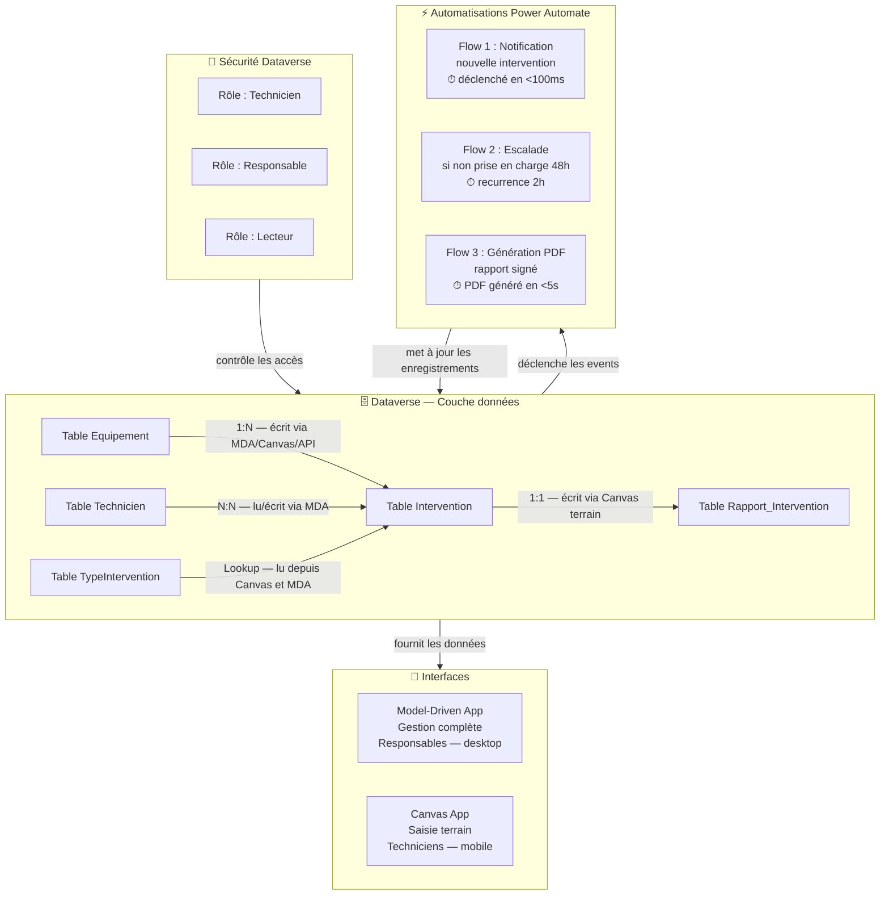

# Scénario G — Application métier complète Dataverse-first

## Objectifs pédagogiques

À la fin de ce module, vous serez capable de :

1. **Concevoir** le modèle de données d'une application métier en partant de Dataverse — tables, colonnes, relations, types de données
2. **Choisir** entre Model-Driven App et Canvas App selon le cas d'usage et les articuler dans une architecture hybride
3. **Sécuriser** l'accès aux données avec les rôles de sécurité Dataverse, sans dépendre des filtres applicatifs
4. **Orchestrer** des automatisations métier (Power Automate) depuis des événements Dataverse natifs
5. **Structurer** une solution déployable, cohérente et maintenable sur plusieurs environnements

---

## Mise en situation

Une PME industrielle de 200 personnes gère ses interventions de maintenance sur site via... Excel partagé sur SharePoint. Quatre techniciens lisent le même fichier, deux l'écrasent en même temps, et le responsable consolide manuellement chaque vendredi pour produire un rapport — comptez 4 heures perdues par semaine, soit environ 200 heures par an.

L'équipe IT tente d'abord une Canvas App qui lit directement une liste SharePoint. Ça fonctionne deux semaines. Puis les problèmes arrivent : les formules de filtrage deviennent illisibles, les droits d'accès se gèrent mal (tout le monde voit tout), et dès qu'on veut ajouter une table liée (les équipements), ça vire au hack. Les filtres non délégués plafonnent à 500 lignes. La maintenance corrective dépasse déjà le temps de développement initial.

La vraie solution, c'est de repartir de Dataverse — pas parce que c'est "plus puissant", mais parce que les exigences métier (relations entre entités, sécurité granulaire, formulaires complexes, historique d'activité) correspondent exactement à ce pour quoi Dataverse a été conçu.

Ce module construit cette solution de bout en bout, en prenant des décisions d'architecture au fil de l'eau.

---

## Pourquoi "Dataverse-first" change l'approche

La plupart des projets Power Platform partent de l'interface — "on fait une Canvas App, on verra les données après". Le résultat, c'est souvent un patchwork : des connecteurs hybrides, des transformations de données dans les formules Power Fx, et une sécurité gérée au niveau de l'app plutôt qu'au niveau des données.

Partir de Dataverse en premier, c'est inverser cet ordre. On définit d'abord :

- Quelles sont les entités métier ? (les "choses" qui existent dans le domaine)
- Quelles sont les relations entre elles ?
- Qui a le droit de faire quoi sur quelles données ?

Ensuite seulement, on construit les interfaces au-dessus. Cette séquence change fondamentalement la qualité du résultat : la sécurité est dans les données, pas dans les boutons. Les relations sont dans le modèle, pas dans les formules. Et si on change d'interface demain, les données restent cohérentes.

---

## Le modèle de données — construire l'ossature

Pour notre scénario d'interventions de maintenance, voici les entités identifiées lors de l'analyse métier :

| Table Dataverse | Rôle métier | Clé de relation |
|---|---|---|
| `Equipement` | Machine ou installation à maintenir | Référence principale |
| `Intervention` | Demande ou ordre de travail | Liée à Equipement, Technicien |
| `Rapport_Intervention` | Compte-rendu après intervention | Liée à Intervention (1:1) |
| `Technicien` | Profil métier (pas le compte AAD) | Liée au contact/utilisateur |
| `TypeIntervention` | Table de référence (préventif, curatif…) | Lookup simple |

🧠 **Concept clé** — Dans Dataverse, on distingue les **tables standard** (Contact, Account…), les **tables custom** (créées pour l'application) et les **tables virtuelles** (qui pointent vers une source externe). Ici, on crée des tables custom préfixées avec le publisher prefix (ex : `contoso_Intervention`). Ce préfixe est défini une seule fois à la création du publisher et ne change plus — il évite les collisions lors des mises à jour de la plateforme et identifie clairement l'origine de chaque composant dans la solution.

### Les relations : ne pas improviser

Trois types de relations existent dans Dataverse. Le choix n'est pas cosmétique — il détermine ce qui se passe quand un enregistrement parent est supprimé.

**1:N (One-to-Many)** — Un équipement peut avoir plusieurs interventions. C'est la relation la plus courante. On la crée sur la table "enfant" (Intervention) avec une colonne Lookup vers Equipement.

**N:N (Many-to-Many)** — Un technicien peut intervenir sur plusieurs interventions, et une intervention peut mobiliser plusieurs techniciens. Dataverse crée automatiquement une table de jonction cachée.

**1:1** — Une intervention a exactement un rapport. On modélise ça avec une relation 1:N + contrainte applicative, ou avec une table enfant dont on force l'unicité.

⚠️ **Erreur fréquente** — Utiliser une colonne texte libre pour stocker une référence à une autre table ("Équipement: POMPE-007"). C'est tentant, rapide, et catastrophique à maintenir. Dès qu'un équipement est renommé ou supprimé, la cohérence est cassée. Utilisez toujours une colonne **Lookup** — Dataverse gère l'intégrité référentielle et propose le comportement à la suppression (Restrict / Cascade / Remove Link).

### Les types de colonnes qui méritent attention

Quelques choix de types de données qui ont un impact direct sur le comportement de l'application :

- **Choice (anciennement OptionSet)** plutôt que texte libre pour les statuts (`Planifiée`, `En cours`, `Terminée`, `Annulée`). Ça permet des filtres cohérents, des couleurs dans les vues, et des règles d'automatisation fiables.
- **Calculated columns** pour les champs dérivés (ex : durée d'intervention = date fin − date début). Le calcul se fait côté serveur, pas dans chaque app. Attention : sur des tables dépassant 50 000 lignes, préférer un Flow scheduled qui pré-calcule et stocke le résultat dans une colonne classique — les Calculated Columns se recalculent à chaque lecture et peuvent peser sur les performances.
- **Rollup columns** pour les agrégats (ex : nombre total d'interventions par équipement). Se recalculent automatiquement toutes les heures ou à la demande.
- **File / Image** pour les photos prises sur site. Stockées dans Azure Blob sous le capot, accessibles via l'API Dataverse.

---

## Architecture de la solution



Ce schéma illustre la logique fondamentale : Dataverse est au centre. Les applications ne font que lire et écrire. La sécurité est définie au niveau des données, pas au niveau des apps. Les automatisations réagissent aux événements Dataverse natifs — qu'un utilisateur passe par la MDA, la Canvas App, ou un script d'import API, les flows se déclenchent quand même.

---

## Fonctionnement interne — Model-Driven vs Canvas

C'est l'une des décisions clés de l'architecture. Les deux types d'app lisent Dataverse, mais leur logique de rendu est radicalement différente.

### Model-Driven App — "l'app se génère depuis le modèle"

Une Model-Driven App (MDA) dérive son interface directement du schéma Dataverse. Quand vous ajoutez une colonne à une table, elle apparaît automatiquement dans le formulaire. Les vues, les sous-grilles de relations, la navigation entre tables — tout est géré par la plateforme.

C'est idéal pour les interfaces de gestion back-office, là où les données sont complexes, les relations nombreuses, et les utilisateurs à l'aise avec une navigation structurée (type CRM).

Pour notre scénario : les responsables utilisent la MDA. Ils voient les interventions avec leurs sous-listes d'équipements, les rapports associés, l'historique d'activité (audit log natif), et peuvent gérer les plannings.

### Canvas App — "l'app est entièrement dessinée"

Une Canvas App part d'une page blanche. Vous contrôlez chaque pixel, chaque interaction, chaque source de données. La flexibilité est totale — mais la responsabilité aussi. Les relations entre tables ne sont pas gérées automatiquement : vous devez écrire les formules de navigation.

Pour notre scénario : les techniciens sur le terrain utilisent une Canvas App mobile. L'interface est optimisée pour un écran 6 pouces, avec de gros boutons, un accès photo, une saisie rapide du compte-rendu. La navigation est linéaire (liste → fiche → formulaire de rapport), pas tabulaire.

💡 **Il n'y a pas à choisir l'un ou l'autre globalement.** Dans une solution Dataverse-first, **les deux coexistent** et lisent les mêmes données. Un responsable valide une intervention dans la MDA, et la validation apparaît immédiatement dans la Canvas App du technicien — parce que les deux apps lisent la même table Dataverse.

---

## Construction progressive de la solution

### Étape 1 — Le modèle de données dans Dataverse

Depuis **Power Apps > Dataverse > Tables > Nouvelle table** :

1. Créer la table `Equipement` avec les colonnes : `Nom` (texte, requis), `NumeroSerie` (texte), `Site` (Choice), `DateMiseEnService` (date), `StatutEquipement` (Choice : Actif / Hors service / En maintenance)

2. Créer la table `Intervention` avec : `Titre` (texte, requis), `Description` (texte multilignes), `DatePlanifiee` (date/heure), `Priorite` (Choice : Basse / Normale / Haute / Critique), `Statut` (Choice), `Equipement` (Lookup vers Equipement), `Type` (Lookup vers TypeIntervention)

3. Définir les **Business Rules** directement sur la table Intervention — par exemple : si Priorité = Critique, alors le champ `DatePlanifiee` devient obligatoire. Cette règle s'applique dans toutes les apps, pas seulement dans une interface spécifique.

🧠 **Concept clé** — Les **Business Rules** Dataverse s'exécutent côté serveur ET côté client. Elles remplacent avantageusement les logiques de validation dans les formules Power Fx ou dans JavaScript, car elles s'appliquent quelle que soit l'interface utilisée (MDA, Canvas App, API directe). Une règle écrite dans une Canvas App ne protège que cette interface — une Business Rule protège la donnée elle-même.

### Étape 2 — Les rôles de sécurité

C'est l'étape que beaucoup de projets bâclent. Un rôle de sécurité Dataverse définit, pour chaque table et chaque opération (Create / Read / Write / Delete / Append / Assign / Share), le niveau d'accès :

- **User** — seulement les enregistrements dont l'utilisateur est propriétaire
- **Business Unit** — les enregistrements de l'unité organisationnelle de l'utilisateur
- **Organization** — tous les enregistrements (scope global)
- **None** — aucun accès

Pour notre application :

| Rôle | Intervention | Rapport | Equipement |
|---|---|---|---|
| Technicien | Read (BU) + Write (User) | Create/Write (User) | Read (Org) |
| Responsable | Full (BU) | Read (BU) | Full (Org) |
| Lecteur | Read (Org) | Read (Org) | Read (Org) |

Les **Column Security Profiles** permettent d'aller encore plus loin : restreindre l'accès à des colonnes spécifiques. Par exemple, le champ `CoutEstime` sur une intervention n'est lisible que par les responsables, même si le technicien peut lire la fiche. Voici ce que ça donne concrètement :

| Colonne | Technicien | Responsable | Lecteur |
|---|---|---|---|
| `Titre`, `Statut`, `Priorite` | Lecture ✓ | Lecture + Écriture ✓ | Lecture ✓ |
| `CoutEstime` | ✗ invisible | Lecture + Écriture ✓ | ✗ invisible |
| `NotesInternes` | ✗ invisible | Lecture + Écriture ✓ | ✗ invisible |

Un Column Security Profile s'applique même si l'utilisateur a le droit de lire la table — la colonne est simplement absente de l'enregistrement renvoyé par l'API.

⚠️ **Erreur fréquente** — Donner à tous les utilisateurs le rôle `System Administrator` pendant les tests, puis oublier de le retirer. En production, un technicien avec ce rôle peut supprimer n'importe quelle table. La règle : **on commence avec les droits minimaux et on monte si nécessaire**, jamais l'inverse.

Pour créer un rôle : **Power Platform Admin Center > Environments > [votre env] > Settings > Users + Permissions > Security Roles > New Role**.

### Étape 3 — La Model-Driven App pour les responsables

Depuis **Power Apps > Créer > Model-driven app** :

1. Ajouter les tables Equipement, Intervention, Rapport_Intervention dans le **Site Map** (navigation latérale)
2. Personnaliser les **Forms** : mettre en avant les champs critiques, masquer les champs techniques, ajouter les sous-grilles (ex : sur la fiche Equipement, une sous-grille qui liste toutes les interventions liées)
3. Créer des **Views** personnalisées : "Interventions critiques non assignées", "Interventions planifiées cette semaine", "Équipements hors service"
4. Activer le **suivi d'activité** sur la table Intervention — chaque modification, commentaire ou email lié à une intervention est enregistré automatiquement dans la timeline

### Étape 4 — La Canvas App mobile pour les techniciens

L'app se construit autour d'un flux de navigation simple :

```
Écran Accueil → Liste de mes interventions du jour
    → Fiche Intervention → Détail + équipement concerné
        → Formulaire Rapport → Saisie compte-rendu + photos
            → Soumission → confirmation
```

**Delegation** — La formule suivante est entièrement déléguée à Dataverse si les colonnes filtrées sont bien indexées :

```powerfx
Filter(
    Interventions,
    Statut = 'Statut (Interventions)'.EnCours
        && Technicien.Email = User().Email
)
```

Dataverse traite le filtre côté serveur et renvoie seulement les données pertinentes — aucune limite des 500 enregistrements. Avec SharePoint en revanche, un filtre sur une colonne Lookup comme `Technicien.Email` n'est généralement pas délégué : Power Apps rapatrie les 500 premiers enregistrements côté client puis filtre en mémoire, ce qui donne des résultats silencieusement incomplets dès que la table dépasse ce seuil.

**Ce qui n'est PAS délégué — exemple concret :**

```powerfx
// ❌ Non délégué : Search() et Mid() ne sont jamais délégués
Filter(
    Interventions,
    Mid(Titre, 1, 3) = "URG"
)
// → Power Apps charge les 500 premiers enregistrements, filtre en mémoire
// → Si l'intervention urgente est au rang 501, elle est invisible
```

**Formulaire de rapport** — Utiliser un `Form` control connecté directement à la table `Rapport_Intervention`. Le champ `Intervention` du rapport est prérempli en passant l'ID de l'intervention via `Navigate()` :

```powerfx
Navigate(
    EcranRapport,
    ScreenTransition.Slide,
    { InterventionCourante: ThisItem }
)
```

**Photos** — Utiliser un contrôle `Camera` ou `Add picture`, stocker le résultat dans une colonne de type `File` ou `Image` de la table Rapport.

### Étape 5 — Les automatisations Power Automate

Les flows se déclenchent sur des événements Dataverse natifs — pas sur des actions dans une app. Si quelqu'un crée une intervention via un script d'import API, les automatisations se déclenchent quand même.

**Flow 1 : Notification nouvelle intervention**
- Déclencheur : `When a row is added` sur la table Intervention
- Action : Envoyer un email au technicien assigné + notification Teams au responsable
- Condition : si Priorité = Critique, envoyer aussi un SMS via connecteur tiers
- ⏱ Temps de déclenchement observé : < 100 ms après la création de l'enregistrement

**Flow 2 : Escalade si non prise en charge**
- Déclencheur : `Recurrence` (toutes les 2 heures)
- Action : `List rows` — Interventions où Statut = Planifiée ET DatePlanifiee < Now() − 48h
- Pour chaque résultat : mettre à jour Priorité → Critique + notifier le manager N+2

**Flow 3 : Génération du rapport PDF**
- Déclencheur : `When a row is modified` sur Rapport_Intervention, condition Statut = Validé
- Action : Word template + Export PDF + stockage dans SharePoint + mise à jour du champ `LienRapportPDF` dans Dataverse
- ⏱ Durée moyenne de génération PDF : < 5 s pour un rapport standard (2 pages, 3 photos)

💡 **Astuce** — Pour les flows déclenchés par Dataverse, configurer le champ **"Select columns"** dans le trigger pour ne réagir qu'aux colonnes métier pertinentes (ex : `statut,priorite,technicien`). Sans ce filtre, le flow se déclenche à chaque modification de n'importe quelle colonne, y compris les métadonnées système (recalcul de colonnes calculées, audit…) — ce qui peut générer des dizaines de runs inutiles par jour sur une table active.

---

## Sécurité : la couche qui tient tout ensemble

Un point souvent sous-estimé : dans Dataverse, la sécurité est **additive**. Un utilisateur peut avoir plusieurs rôles, et il obtient l'union des droits. Si le rôle A donne Read sur Intervention et le rôle B donne Write sur Intervention, l'utilisateur avec les deux rôles a Read + Write.

Il n'existe pas de "deny" explicite — un droit accordé par un rôle ne peut pas être retiré par un autre rôle. Cela signifie qu'on compose des rôles fins et cumulables plutôt que des méga-rôles qui font tout :

- Rôle `Base_Technicien` — droits minimum pour utiliser l'app
- Rôle `Approbateur_Rapports` — s'ajoute pour les techniciens seniors
- Rôle `Visualisation_Stats` — s'ajoute pour ceux qui ont accès aux tableaux de bord

Cette logique additive est contre-intuitive pour ceux qui viennent d'environnements avec des "deny" explicites (comme Active Directory). Le modèle mental à retenir : **chaque rôle est une carte d'accès supplémentaire, jamais un verrou**.

---

## Pièges post-déploiement — évolution du modèle en production

C'est la partie que les formations oublient presque systématiquement. Construire la v1 est une chose. Faire évoluer le modèle sans casser l'existant en est une autre.

### Renommer une colonne en production

Renommer le nom d'affichage d'une colonne (ex : `DatePlanifiee` → `Date d'intervention`) est sans risque — c'est juste une étiquette. Mais renommer le **nom logique** (le `contoso_dateplanifiee` utilisé dans les formules, les flows et les API) est une opération à haut risque :

- Toutes les formules Power Fx qui référencent ce nom logique cassent immédiatement
- Tous les flows qui utilisent cette colonne renvoient une erreur à l'exécution
- Toutes les requêtes API tierces échouent sans message d'erreur explicite

**Stratégie** : ne jamais renommer un nom logique en production. Si le nom est vraiment problématique, créer une nouvelle colonne avec le bon nom, migrer les données via un Flow scheduled, puis déprécier l'ancienne colonne progressivement.

### Modifier une relation existante

Changer le comportement de suppression d'une relation (ex : passer de `Cascade` à `Restrict`) est possible mais s'applique uniquement aux nouvelles suppressions — les enregistrements existants ne sont pas rétroactivement affectés. Supprimer une relation existante est une opération destructive : la colonne Lookup disparaît de tous les enregistrements.

**Stratégie** : avant toute modification de relation, exporter les données concernées, documenter les enregistrements affectés, et tester dans un environnement de staging avec un jeu de données représentatif.

### Gérer les droits rétroactifs

Quand un nouveau rôle est créé ou qu'un périmètre de Business Unit change, les enregistrements existants ne changent pas de propriétaire automatiquement. Un technicien nouvellement rattaché à une Business Unit ne verra pas les interventions créées avant sa mutation.

**Stratégie** : prévoir un Flow d'administration pour réassigner les enregistrements orphelins, et documenter la politique de propriété dès la conception (qui est propriétaire : l'utilisateur qui crée, ou l'équipe ?).

### Dépendances circulaires dans les Business Rules

Une Business Rule peut en théorie déclencher une mise à jour qui active une autre Business Rule, qui à son tour modifie un champ surveillé par la première. Dataverse détecte et bloque les cycles directs, mais les cycles indirects (via Flow + Business Rule) peuvent produire des boucles infinies de runs.

**Comment détecter** : si un enregistrement génère des dizaines de runs en quelques secondes sans action utilisateur, inspecter les flows actifs sur la table + les Business Rules qui modifient des colonnes déclenchantes. **Comment éviter** : ne pas créer de Business Rule qui modifie une colonne surveillée par un flow qui lui-même modifie une colonne surveillée par cette Business Rule.

---

## Cas réel — résultats après déploiement

Retour sur le scénario initial. Après trois semaines de développement (modèle de données, deux apps, trois flows), voici ce que l'équipe a observé :

**Gains mesurés :**
- **Conflits de données** : zéro. Dataverse gère les accès concurrents nativement.
- **Temps de consolidation hebdomadaire** : de 4 heures à 0 — le rapport Power BI connecté directement à Dataverse se génère en un clic.
- **Sauvegarde d'un batch de 10 000 interventions historiques** (import initial via Flow) : < 2 s par enregistrement en mode séquentiel, < 15 min en mode parallèle avec 10 branches concurrentes.
- **Notification d'escalade** (Flow 2, recurrence 2h) : délai maximum de prise en charge garanti à 2h, contre 24h+ avec le processus Excel manuel.
- **Onboarding d'un nouveau technicien** : assigner le rôle `Base_Technicien` + l'ajouter à l'équipe Teams = accès immédiat, sans aucune manipulation de droits dans l'app.

**Évolution du modèle deux mois après :** le client a demandé d'ajouter un module "gestion des pièces de rechange". L'ajout d'une table `PieceDetachee` avec une relation N:N vers Intervention n'a nécessité aucune modification des flows existants, ni de la sécurité de base. Le modèle a absorbé l'évolution naturellement — c'est exactement ce que la conception Dataverse-first est censée permettre.

---

## Bonnes pratiques

**1. Nommer les colonnes avec un vocabulaire métier, pas technique.** `DatePlanifiee` plutôt que `date_field_1`. Les noms apparaissent dans les flows, les vues, les erreurs — un nom lisible réduit la charge cognitive de toute l'équipe.

**2. Définir les Business Rules avant de construire les apps.** Une règle de validation dans Dataverse s'applique partout. Une règle dans une Canvas App ne protège pas l'API directe ou la MDA. Commencez par la couche données.

**3. Ne jamais utiliser l'environnement Default pour une application de production.** L'environnement Default est partagé avec tous les utilisateurs du tenant, sans isolation. Créez un environnement dédié avec sa propre base Dataverse.

**4. Tester les rôles de sécurité avec des comptes de test réels.** Power Apps Studio a un bouton "Preview as" limité. La seule façon fiable de valider la sécurité, c'est de se connecter avec un vrai compte technicien et de tenter les opérations interdites.

**5. Versionner les Solutions Dataverse dans Git.** Une Solution est exportable en fichier zip non managé (code source) ou managé (déployable). Committer le contenu extrait avec `pac solution unpack` permet de voir les diffs entre versions — c'est l'équivalent du `git diff` pour le modèle de données.

**6. Éviter les Calculated Columns pour des calculs lourds sur de grands volumes.** Les Calculated Columns se recalculent à chaque lecture de l'enregistrement. Sur des tables de 50 000+ lignes, préférez un Flow scheduled qui pré-calcule et stocke le résultat dans une colonne classique.

**7. Activer l'audit uniquement sur les tables qui en ont besoin.** L'audit Dataverse est puissant mais consomme du stockage. L'activer sur toutes les tables d'une solution complexe peut doubler la consommation en quelques mois.

---

## Résumé

Une application Dataverse-first commence par le modèle de données — tables, colonnes typées, relations explicites, Business Rules. La sécurité est définie au niveau des données via des rôles granulaires (et des Column Security Profiles pour les colonnes sensibles), pas dans les formules des apps. Les interfaces (Model-Driven pour la gestion desktop, Canvas pour le terrain mobile) lisent les mêmes données et coexistent naturellement. Les automatisations se branchent sur des événements Dataverse, ce qui les rend indépendantes de l'interface utilisée.

Ce qui différencie cette architecture d'un assemblage de connecteurs ad hoc, c'est la **cohérence** : une règle définie dans Dataverse s'applique partout, une donnée modifiée par un flow est immédiatement visible dans toutes les apps, et l'évolution du modèle (nouvelle table, nouvelle relation) ne casse pas ce qui existe. L'architecture absorbe la croissance — c'est précisément ce que le scénario "pièces de rechange" a confirmé en production.

La prochaine étape logique est d'ouvrir cette architecture vers l'extérieur — des systèmes tiers qui ne sont pas nativement dans l'écosystème Microsoft, ce qui amène
