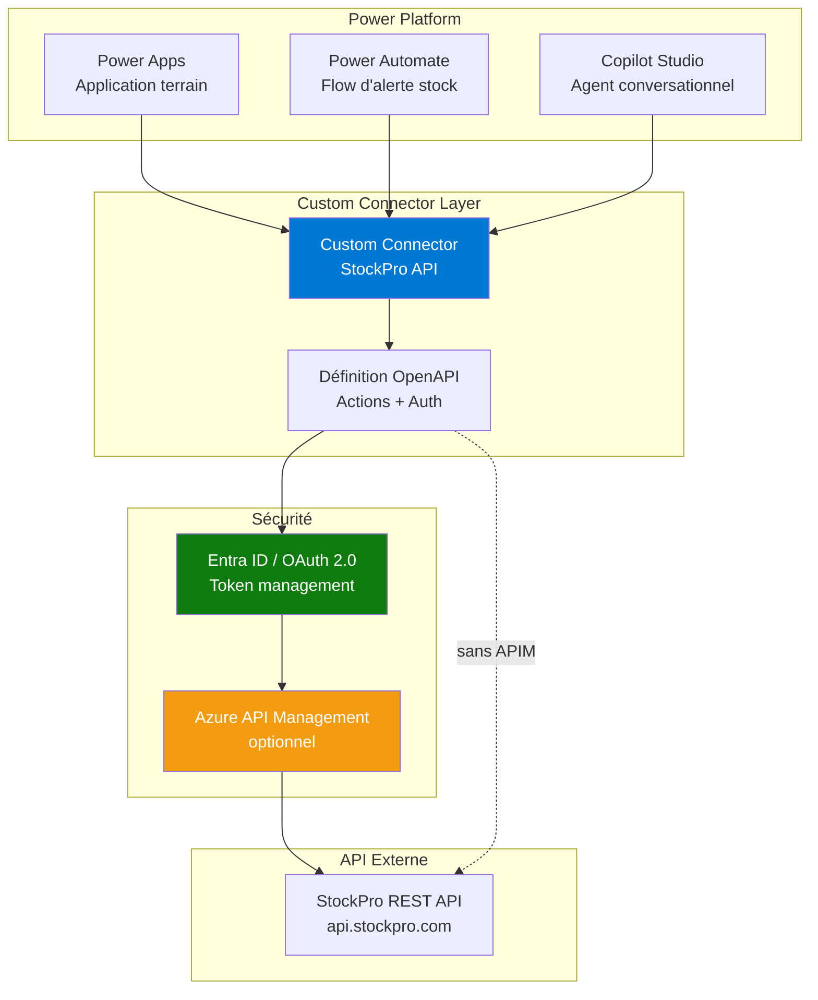

# Scénario H — Intégration API externe via custom connector

## Objectifs pédagogiques

À l'issue de ce module, vous serez capable de :

1. **Expliquer** pourquoi un custom connector est nécessaire et dans quels cas il remplace (ou complète) un connecteur standard ou un appel HTTP brut
2. **Concevoir** l'architecture d'intégration entre une API externe et Power Platform via un connecteur personnalisé
3. **Choisir** le bon mécanisme d'authentification selon une matrice décisionnelle sécurité / licence / gestion des secrets
4. **Structurer** la définition OpenAPI d'un custom connector pour exposer les actions utiles à vos apps et flows
5. **Anticiper** les pièges de production : throttling partiel, erreurs en boucle, debugging silencieux, versionning d'API

---

## Mise en situation

Votre entreprise utilise un logiciel de gestion des stocks d'un éditeur tiers — appelons-le **StockPro**. Cet éditeur expose une API REST documentée, sécurisée par OAuth 2.0, avec une soixantaine d'endpoints. Votre équipe a déjà construit une application Power Apps pour les opérationnels terrain et plusieurs flows Power Automate pour les alertes et approbations.

Le problème : StockPro n'a pas de connecteur officiel dans la galerie Power Platform. Vos flows ne peuvent pas interroger les niveaux de stock en temps réel, et votre app ne peut pas déclencher une commande de réapprovisionnement directement.

La solution ? Un **custom connector** — un pont déclaratif entre Power Platform et l'API externe, réutilisable dans toute la plateforme.

C'est exactement ce scénario que ce module va disséquer — y compris ce qui se passe quand ça déraille en production.

---

## Contexte et problématique

Power Platform dispose de plusieurs centaines de connecteurs certifiés (SharePoint, Salesforce, SAP, etc.). Mais le monde réel ne s'arrête pas là : ERP maison, API partenaire, service SaaS de niche, API interne développée par votre équipe back-end — aucun de ces cas n'est couvert par défaut.

### Trois approches, un choix à faire

| Approche | Quand l'utiliser | Limites réelles |
|---|---|---|
| **Action HTTP** (Power Automate) | API simple, usage ponctuel dans un seul flow | Non réutilisable dans Power Apps, invisible pour les autres makers, zéro découvrabilité |
| **Custom connector** | API récurrente, plusieurs apps/flows, équipe partagée | Nécessite une définition OpenAPI propre, coût en temps de setup initial |
| **Azure API Management (APIM)** | Gouvernance centralisée, transformation de requêtes, multi-cloud | Complexité infrastructure, coût supplémentaire, overkill pour une API métier isolée |

Le custom connector occupe le juste milieu : il encapsule l'API une fois, puis l'expose comme n'importe quel connecteur standard dans Power Apps, Power Automate et Copilot Studio. Un maker qui n'a jamais vu une requête HTTP peut l'utiliser sans friction.

La question "custom connector ou action HTTP brut ?" mérite une réponse honnête, parce que beaucoup de modules l'esquivent :

**Utilisez l'action HTTP brut si :** vous avez un seul flow, un seul appel API, pas de réutilisation prévisible, et vous ne voulez pas gérer le cycle de vie d'un connecteur. C'est parfaitement légitime.

**Utilisez un custom connector si :** vous avez plusieurs consommateurs (apps + flows + agents), vous voulez que les makers voient des actions nommées et typées plutôt que des blocs JSON, et vous êtes prêt à maintenir une définition OpenAPI dans le temps.

💡 **Point clé** — Un custom connector n'est pas un middleware. Il ne transforme pas les données, ne met pas en cache, ne gère pas la logique métier. C'est une définition déclarative qui dit à Power Platform *comment appeler* l'API. La logique reste dans vos flows ou vos apps.

---

## Architecture d'ensemble

Avant d'entrer dans les détails, voici comment les pièces s'assemblent dans un scénario réel.



Ce qui frappe dans ce schéma : le custom connector est un **point unique de définition**. Modifiez-le, et toutes les apps et flows qui l'utilisent bénéficient du changement — sans toucher à chaque artefact individuellement.

---

## Anatomie d'un custom connector

Un custom connector est constitué de quatre couches. Comprendre leur rôle avant de configurer quoi que ce soit évite beaucoup de confusion.

### 1. La définition générale

C'est le socle : URL de base de l'API, icône, couleur d'accent, description. Rien de technique ici, mais cette étape compte pour la gouvernance — un connecteur bien nommé et documenté sera réutilisé, un connecteur "test_v3_final" sera ignoré.

### 2. L'authentification

C'est souvent là que ça coince. Power Platform supporte plusieurs schémas :

| Type | Cas d'usage | Ce que fait le connecteur |
|---|---|---|
| **No auth** | API publique ou IP-whitelistée | Envoie la requête sans header d'auth |
| **API Key** | Clé statique dans un header ou query param | Injecte la clé à chaque appel |
| **Basic Auth** | Login/mot de passe | Encode en Base64 dans Authorization header |
| **OAuth 2.0** | Standard entreprise, Entra ID, etc. | Gère le flux complet : autorisation, token, refresh |
| **OAuth 2.0 + PKCE** | Apps SPA ou mobiles | Flux sans secret client côté serveur |
| **Windows Auth** | APIs on-premise via data gateway | Nécessite l'On-premises Data Gateway |

Pour StockPro avec OAuth 2.0, le connecteur va gérer le flux d'autorisation automatiquement : quand un maker crée une connexion, il est redirigé vers la page de login StockPro, consent, et le token est stocké dans la connexion Power Platform. Le maker ne voit jamais le token.

⚠️ **Comportement contre-intuitif** — Avec OAuth 2.0, chaque utilisateur crée *sa propre connexion* au connecteur. Si vous avez 50 utilisateurs de votre app, vous avez potentiellement 50 connexions distinctes. Cela a des implications de licence (connexions premium) et de gestion. Si vous voulez une connexion centralisée (service account), orientez-vous vers une API Key ou un client credentials flow géré via Azure Key Vault.

### 3. Les actions et triggers

C'est le cœur du connecteur. Chaque action correspond à un endpoint de l'API. Vous définissez :

- La méthode HTTP et le chemin (`GET /stocks/{productId}`)
- Les paramètres attendus (path, query, header, body)
- Le schéma de réponse (pour que Power Platform puisse proposer l'autocomplétion dans les formules)

La qualité de la définition des réponses conditionne directement l'expérience utilisateur en aval. Un schéma de réponse mal défini oblige les makers à utiliser des expressions `json()` complexes plutôt que de sélectionner simplement un champ dans une liste déroulante.

### 4. La définition OpenAPI

Tout ce qui précède se traduit en un fichier OpenAPI 2.0 (Swagger) ou 3.0. Power Platform peut importer ce fichier directement — si votre API est déjà documentée avec Swagger, vous partez avec 80% du travail fait. Le reste consiste à affiner les descriptions, les noms d'affichage et les paramètres par défaut pour l'expérience maker.

---

## Prise de décision — Choisir le bon mécanisme d'authentification

Le choix du mécanisme d'auth n'est pas qu'une question technique : il engage la sécurité, la gestion des secrets, les licences et l'opérabilité à long terme. Voici la matrice pour guider cette décision.

| Critère | **API Key** | **OAuth 2.0 (Authorization Code)** | **Client Credentials** |
|---|---|---|---|
| **Sécurité** | Moyenne — clé statique, risque si exposée | Haute — token court-lived, refresh automatique | Haute — secret géré côté serveur/Key Vault |
| **Gestion des secrets** | Manuelle — rotation = reconfigurer toutes les connexions | Automatique côté Power Platform | Manuelle mais centralisée (Key Vault recommandé) |
| **Connexion par utilisateur** | Non — clé partagée possible | Oui — une connexion par utilisateur | Non — connexion de service unique |
| **Impact licence PP** | Une connexion partagée = un seul premium consommé | 50 utilisateurs = 50 connexions premium | Une connexion service = un seul premium consommé |
| **Facilité de rotation** | Difficile — toutes les connexions existantes tombent | Transparente — refresh géré par le connecteur | Possible via Key Vault sans recréer les connexions |
| **Cas d'usage idéal** | API partenaire simple, faible sensibilité | Accès utilisateur nominatif, droits différenciés | Intégrations back-end, service accounts, flows non interactifs |

**Règle pratique :** si votre cas est un flow planifié qui tourne la nuit sans utilisateur connecté, OAuth 2.0 authorization code n'est pas adapté — le token peut expirer et personne n'est là pour le renouveler via consentement. Utilisez Client Credentials. Si vous avez des droits différenciés par utilisateur (l'utilisateur A voit ses commandes, pas celles de B), OAuth 2.0 avec token nominatif est la seule approche correcte.

---

## Construction progressive du connecteur

### Étape 1 — Définition minimale fonctionnelle

L'objectif ici est d'avoir une première action qui fonctionne, même sans polish. On part de l'import OpenAPI de StockPro.

**Chemin de configuration :**
```
Power Automate → Données → Connecteurs personnalisés → + Nouveau connecteur personnalisé
→ Importer un fichier OpenAPI
```

Une fois importé, vérifiez systématiquement :
- L'URL de base est correcte (pas de trailing slash)
- Le schéma est HTTPS (HTTP est refusé en production)
- Au moins une action est visible dans l'onglet "Définition"

### Étape 2 — Configuration de l'authentification OAuth 2.0

C'est l'étape la plus délicate. Pour OAuth 2.0 avec Entra ID comme fournisseur d'identité :

```
Onglet Sécurité → Type d'authentification : OAuth 2.0
→ Fournisseur d'identité : Azure Active Directory
→ Client ID : <ID_APPLICATION_AZURE>
→ Client secret : <SECRET>
→ URL d'autorisation : https://login.microsoftonline.com/<TENANT_ID>/oauth2/v2.0/authorize
→ URL du jeton : https://login.microsoftonline.com/<TENANT_ID>/oauth2/v2.0/token
→ URL d'actualisation : https://login.microsoftonline.com/<TENANT_ID>/oauth2/v2.0/token
→ Portée (scope) : api://<APP_ID>/StockPro.Read
```

Après avoir sauvegardé, Power Platform génère une **redirect URI** (ex: `https://global.consent.azure-apim.net/redirect`). Vous devez enregistrer cette URI dans les paramètres de votre application Azure.

💡 **Point clé** — Ne confondez pas l'application Azure de votre API (StockPro côté serveur) et l'application Azure de votre custom connector (côté client Power Platform). Vous aurez souvent besoin d'enregistrer deux applications distinctes dans Entra ID, avec des permissions déléguées entre elles.

### Étape 3 — Définition des actions avec schéma de réponse

Prenons l'action "Obtenir le niveau de stock d'un produit" :

```
Onglet Définition → + Nouvelle action
→ Résumé : Obtenir le stock d'un produit
→ Description : Retourne le niveau de stock actuel et les seuils d'alerte pour un produit donné
→ ID de l'opération : GetStockByProduct
→ Visibilité : important

Requête :
→ Méthode : GET
→ URL : /api/v2/stocks/{productId}
→ Paramètre productId : type string, requis, dans path

Réponse :
→ Importer depuis un exemple de réponse JSON réelle de l'API
```

L'import depuis un exemple JSON est la façon la plus rapide d'obtenir un schéma correct. Power Platform analyse la structure et génère automatiquement les types de données.

🧠 **Concept fondamental** — L'`ID de l'opération` (ex: `GetStockByProduct`) est l'identifiant technique que vous verrez dans les expressions Power Fx et dans les corps de flows. Choisissez-le une fois pour toutes : le changer après déploiement casse les apps et flows existants.

### Étape 4 — Test et validation

Avant de partager le connecteur, testez chaque action depuis l'onglet "Test" du connecteur en utilisant une vraie connexion. C'est le seul moyen de valider que l'authentification fonctionne réellement et que les schémas de réponse correspondent à ce que l'API retourne.

---

## Politiques de connecteur (Connector Policies)

C'est une fonctionnalité méconnue qui change beaucoup en production. Les politiques permettent d'injecter des transformations légères *sans modifier l'API ni les flows*.

| Politique | Ce qu'elle fait | Cas d'usage |
|---|---|---|
| **Set query parameter** | Ajoute un paramètre fixe à toutes les requêtes | Injecter `?format=json` automatiquement |
| **Set header** | Ajoute un header HTTP à chaque appel | Injecter un `X-App-Version` sans que le maker s'en préoccupe |
| **Route request** | Redirige vers une autre URL selon des conditions | Switcher entre env de staging et production |
| **Convert array to object** | Transforme une réponse tableau en objet | Simplifier l'accès aux données dans Power Fx |

Ces politiques s'appliquent au niveau du connecteur, donc de manière transparente pour tous les consommateurs.

---

## Optimisation des appels API

Un sujet que les formations oublient systématiquement : Power Platform a ses propres limites d'appels aux connecteurs (API call limits), **indépendantes** des limites de l'API externe. Ces limites varient selon la licence (par utilisateur, par flux). Un connecteur premium consomme des appels API Power Platform même si l'API externe répond en 50 ms.

Concrètement, si un flow parcourt 200 produits dans un `ApplyToEach` et appelle `GetStockByProduct` pour chacun, vous consommez 200 appels API Power Platform par exécution. Si ce flow tourne toutes les heures, vous êtes à 4 800 appels/jour depuis un seul flow.

Trois leviers pour réduire la consommation :

**Batch endpoints** — Si StockPro expose `POST /stocks/batch` qui accepte une liste de 50 IDs en une requête, 200 produits = 4 appels au lieu de 200. C'est le levier le plus efficace quand l'API le supporte.

**Cache Dataverse** — Plutôt que d'appeler l'API à chaque ouverture de formulaire, écrire le résultat dans une table Dataverse lors d'une synchronisation planifiée. L'app lit Dataverse (gratuit), le flow de sync appelle l'API (une fois par cycle). Pertinent pour des données qui changent peu souvent (catalogues produits, configurations).

**Polling intelligent** — Au lieu d'interroger toutes les lignes toutes les heures, filtrer sur `modifiedon > lastSyncDate`. Vous ne tirez que les deltas, pas l'intégralité du jeu de données.

---

## Pièges et mitigation en production

### Throttling — ce qui se passe vraiment

La plupart des APIs ont des rate limits. Ce qui est moins documenté : **certaines APIs throttlent sans renvoyer de 429**. Elles peuvent retourner un 200 avec un corps d'erreur masqué (`{"status": "throttled", "message": "..."}`), un timeout TCP après 30 secondes, ou simplement répondre avec des données vides.

Dans ces cas, la retry policy exponentielle de Power Automate ne se déclenchera pas — elle ne réagit qu'aux codes HTTP d'erreur. Vous devez ajouter une condition explicite dans votre flow pour inspecter le corps de la réponse.

Pour les vrais 429, la configuration dans Power Automate :
```
Action custom connector → ... → Paramètres
→ Retry Policy : Exponentiel
→ Nombre de tentatives : 4
→ Intervalle : PT5S
```

Avec un backoff exponentiel, les délais successifs seront approximativement 5s, 10s, 20s, 40s. Si l'API est throttlée plus de 75 secondes, le flow échouera quand même — prévoir une notification d'alerte dans ce cas.

### Erreurs partielles en boucle — le scénario StockPro

Voici un scénario réel que le connecteur seul ne peut pas résoudre. Votre flow parcourt 80 produits en `ApplyToEach` et crée une commande de réapprovisionnement pour chacun via `CreateReorderRequest`. À la 43ème itération, StockPro retourne un 400 : le produit est en rupture fournisseur et ne peut pas être commandé.

Par défaut, Power Automate continue les itérations suivantes — l'`ApplyToEach` ne s'arrête pas sur erreur. Résultat : vous avez 42 commandes créées dans StockPro, 1 erreur silencieuse, et 37 commandes manquantes. Aucun rollback automatique.

Comment gérer :

1. **Dans le paramètre de l'action** : activer "Configurer le comportement en cas d'exécution après" → permettre la continuation après échec
2. **Après l'action** : condition sur `outputs('CreateReorderRequest')?['statusCode']` — si ≠ 200 ou 201, logger l'erreur dans une table Dataverse d'incidents
3. **Variable compteur** : incrémenter `varErrorCount` à chaque échec, envoyer une alerte Teams si `varErrorCount > 0` à la fin du flow
4. **Idempotence** : si l'API StockPro supporte un `externalReferenceId`, passer l'ID Power Platform — permet de rejouer le flow sans créer des doublons

L'idée n'est pas d'annuler les 42 commandes réussies (c'est souvent impossible sans API dédiée), mais de s'assurer qu'aucune erreur ne passe silencieusement.

### Debugging d'un connecteur silencieux

Un custom connector qui échoue sans message d'erreur clair est l'un des problèmes les plus frustrants. Les pistes dans l'ordre :

1. **Run history du flow** : dans le détail de l'action échouée, vérifier le corps de la requête envoyée et la réponse brute reçue. Souvent suffisant pour identifier un paramètre manquant ou un header incorrect.
2. **Test depuis l'onglet Test du connecteur** : reproduire l'appel directement dans le connecteur avec une connexion active — élimine les variables du flow.
3. **Vérifier la connexion** : une connexion dont le token a expiré et n'a pas pu se rafraîchir retourne souvent une erreur 401 générique. Supprimer et recréer la connexion résout fréquemment le problème.
4. **Inspecter les en-têtes de réponse** : certaines APIs retournent des informations de debugging dans `X-Error-Details` ou `X-Request-Id` — visibles dans le run history si vous avez défini le schéma de réponse en erreur.

---

## Cas réel — Intégration StockPro avec gestion d'erreur

Voici comment l'architecture finale se concrétise, avec la couche de résilience :

**Flow "Alerte réapprovisionnement" :**
1. Déclencheur : planifié toutes les heures
2. Initialiser : `varErrorCount = 0`, `varErrorLog = []`
3. Action : `GetAllProducts` via custom connector StockPro → liste des produits actifs
4. `ApplyToEach` produit :
   - `GetStockByProduct` → niveau actuel
   - Condition : niveau < seuil d'alerte
   - Si oui : `CreateReorderRequest` (configurer "Continuer en cas d'échec")
   - Vérifier statusCode de `CreateReorderRequest` : si erreur → incrémenter `varErrorCount`, ajouter à `varErrorLog`
5. Après la boucle : si `varErrorCount > 0` → notification Teams avec le log des erreurs
6. Si aucune erreur : notification de succès optionnelle

**App Power Apps "Gestion terrain" :**
- Formule dans la galerie : `StockProConnector.GetStockByProduct(Gallery1.Selected.ProductId)`
- Résultat directement accessible : `result.currentLevel`, `result.reorderThreshold`
- La galerie lit Dataverse (cache) — le connecteur est appelé uniquement pour les actions utilisateur, pas au chargement

Ce qui aurait nécessité un développeur back-end pour construire une API intermédiaire est maintenant accessible à un maker via un sélecteur de champs — avec une gestion d'erreur explicite plutôt que silencieuse.

---

## Partage, gouvernance et cycle de vie

Un custom connector créé dans votre environnement personnel n'est visible que par vous. Pour le rendre disponible à l'équipe, plusieurs niveaux de partage existent :

```
Custom connector → ... → Partager
→ Partager avec des utilisateurs spécifiques (collaboration)
→ Ou : intégrer dans une solution pour déploiement ALM
```

🧠 **Concept fondamental** — En production, un custom connector doit **toujours** vivre dans une solution. C'est la seule façon de le déplacer entre environnements (dev → test → prod) via les pipelines ALM. Un connecteur créé hors solution est un connecteur oublié dans un environnement dev.

**Checklist avant partage d'un connecteur :**
- [ ] Schéma de réponse complet pour toutes les actions exposées ?
- [ ] Descriptions lisibles par un maker non-technique sur chaque action et paramètre ?
- [ ] Test validé avec une vraie connexion sur chaque action ?
- [ ] Secret client stocké dans Key Vault ou géré via app registration (jamais en clair) ?
- [ ] Operation IDs figés et documentés ?
- [ ] Plan de versionning défini (que se passe-t-il si l'API externe publie une v3 ?)
- [ ] Connecteur dans une solution non-managée ?

Pour aller plus loin : Microsoft propose un programme de certification qui rend le connecteur visible dans la galerie officielle. Azure API Management peut exposer vos APIs internes comme des custom connectors via une intégration native — approche recommandée quand vous gérez déjà vos APIs dans APIM.

---

## Bonnes pratiques

**Nommage et documentation**
Donnez à chaque action un résumé clair et une description qui explique *ce que retourne* l'action, pas juste ce qu'elle appelle. Les makers verront ces textes dans l'interface — c'est votre documentation utilisateur.

**Versionning**
Quand l'API externe publie une v3 qui casse la v2, ne modifiez pas le connecteur existant directement. Créez un nouveau connecteur `StockPro v3`, migrez les flows progressivement, puis retirez l'ancien. La modification en place d'un connecteur partagé peut casser des dizaines d'artefacts simultanément.

**Secrets et sécurité**
Ne stockez jamais un secret dans la définition du connecteur en clair. Utilisez Azure Key Vault avec un flux de récupération, ou confiez la gestion du secret à l'enregistrement d'application Azure. En cas de rotation de secret, un connecteur mal conçu nécessite une reconfiguration manuelle de toutes les connexions existantes.

**Environnements et connexions**
Une connexion (les credentials d'un utilisateur) n'est pas transférable entre environnements. Quand vous déployez votre solution de dev vers prod, les makers devront recréer leurs connexions dans l'environnement cible. Documentez-le et anticipez-le dans votre plan de déploiement.

---

## Résumé

| Concept | Rôle | Points clés |
|---|---|---|
| **Custom connector vs HTTP** | Choisir selon réutilisabilité et multi-consommateurs | HTTP brut = flow unique ; custom connector = équipe partagée |
| **Définition OpenAPI** | Décrit les endpoints, paramètres et schémas de réponse | Import Swagger = 80% du travail, le reste = polish UX |
| **Authentification** | OAuth 2.0 pour accès nominatif, Client Credentials pour service account, API Key pour simplicité | Voir matrice décisionnelle — pas de réponse universelle |
| **Connector Policies** | Transformations légères sans modifier l'API ni les flows | Injection de headers, paramètres fixes, routing conditionnel |
| **Optimisation appels** | Réduire la consommation de licences PP | Batch endpoints, cache Dataverse, polling delta |
| **Erreurs partielles** | Les boucles ApplyToEach continuent même si une itération échoue | Logger les erreurs, notifier, idempotence avec externalReferenceId |
| **Solution ALM** | Véhicule de déploiement du connecteur entre environnements | Obligatoire pour prod — hors solution = connecteur orphelin |

La grande force du custom connector est sa position dans l'écosystème : définir l'intégration une fois, la consommer partout. La prochaine étape dans ce parcours d'architecture abordera un autre type d'intégration — cette fois vers des systèmes legacy qui n'exposent pas d'API du tout, via le RPA.

---

<!-- snippet
id: powerplatform_customconn_openapi_import
type: tip
tech: power-platform
level: intermediate
importance: high
format: knowledge
tags: custom-connector, openapi, swagger, import, definition
title: Importer un fichier OpenAPI pour créer un custom connector
content: "Si l'API cible dispose déjà d'une documentation Swagger/OpenAPI, importez-la directement : Power Automate → Données → Connecteurs personnalisés → + Nouveau → Importer un fichier OpenAPI. Cela génère automatiquement les actions, paramètres et schémas de réponse. Vous économisez 80% de la saisie manuelle — le reste consiste à affiner les descriptions et noms d'affichage pour les makers."
description: L'import OpenAPI génère actions et schémas automatiquement — ne repartez pas de zéro si une doc Swagger existe.
-->

<!-- snippet
id: powerplatform_customconn_operationid_stable
type: warning
tech: power-platform
level: intermediate
importance: high
format: knowledge
tags: custom-connector, operation-id, versionning, breaking-change
title: Ne jamais changer l'Operation ID d'une action après déploiement
content: "L'Operation ID (ex: GetStockByProduct) est l'identifiant technique référencé dans tous les flows et formules Power Fx qui utilisent l'action. Le modifier après que des apps ou flows ont été créés les rend immédiatement non fonctionnels — sans avertissement. Choisissez cet ID une fois pour toutes avant le premier partage du connecteur."
description: Changer un Operation ID casse silencieusement tous les artefacts qui l'utilisent — à figer dès le départ.
-->

<!-- snippet
id: powerplatform_customconn_oauth2_peruser
type: concept
tech: power-platform
level: intermediate
importance: high
format: knowledge
tags: custom-connector, oauth2, connexion, licence, authentification
title: OAuth 2.0 sur custom connector — une connexion par utilisateur
content:
