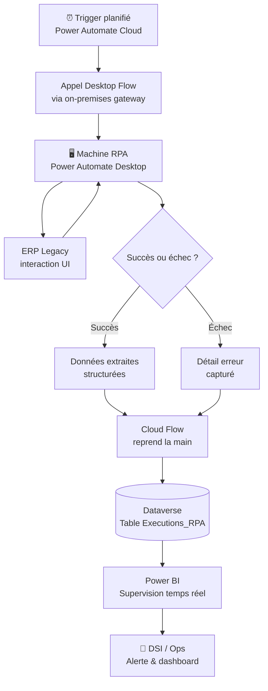

# Scénario I — RPA legacy + supervision Power BI

## Objectifs pédagogiques

À l'issue de ce module, vous serez capable de :

1. **Identifier** les composantes d'une architecture RPA hybride combinant systèmes legacy et Power Platform
2. **Concevoir** un flux d'orchestration Power Automate Desktop pour automatiser des applications sans API
3. **Structurer** la remontée des données d'exécution vers Dataverse pour en assurer la traçabilité
4. **Construire** une supervision opérationnelle dans Power BI à partir des logs de robots
5. **Arbitrer** les compromis propres à ce type d'architecture : fiabilité, maintenabilité, périmètre RPA

---

## Mise en situation

Une entreprise industrielle utilise depuis douze ans un ERP interne développé en Visual Basic. Pas d'API, pas de web service, pas de base de données accessible depuis l'extérieur : tout passe par l'interface graphique. Chaque soir, une équipe de deux personnes passe deux heures à copier des données de commandes depuis cet ERP vers un fichier Excel partagé, qui alimente ensuite les équipes logistique et finance.

Le DSI a entendu parler de RPA. Il sait qu'il n'est pas possible de refaire l'ERP à court terme — le projet de migration est budgété pour dans trois ans. En attendant, il veut automatiser ce transfert quotidien et, surtout, savoir en temps réel si les robots tournent, échouent ou dérivent.

La solution naïve serait d'enregistrer une macro Power Automate Desktop, de la lancer chaque nuit et d'espérer que ça fonctionne. Le problème : sans supervision, le premier incident silencieux peut passer inaperçu pendant plusieurs jours — et c'est précisément ce qui s'est passé avec la tentative précédente basée sur des scripts VBA planifiés.

Ce scénario vous montre comment construire une architecture RPA robuste avec Power Automate Desktop comme exécuteur, Dataverse comme mémoire d'exécution, et Power BI comme tableau de bord de supervision.

---

## Pourquoi ce scénario est différent des flows cloud classiques

Quand vous utilisez Power Automate pour connecter deux APIs, vous travaillez dans le cloud : les connecteurs gèrent l'authentification, les erreurs sont visibles dans l'historique des runs, et si une API change, vous avez un message d'erreur explicite.

Avec du RPA sur système legacy, vous interagissez avec des pixels et du texte affiché à l'écran. Le robot "voit" l'application comme un humain la verrait. Conséquences directes :

- Une mise à jour graphique de l'ERP peut casser le robot sans que personne ne s'en rende compte
- L'exécution se passe sur une machine physique ou une VM, pas dans le cloud
- Il n'y a pas de "réponse API" à analyser — vous devez vous-même définir ce qui constitue un succès ou un échec
- La supervision n'est pas incluse : vous devez la construire

C'est cette fragilité structurelle qui rend la couche de supervision indispensable, pas optionnelle.

---

## Architecture globale

Voici les quatre grandes zones de cette architecture :

| Composant | Rôle | Technologie |
|---|---|---|
| Machine RPA | Exécute les interactions avec l'ERP | PC ou VM Windows avec Power Automate Desktop |
| Orchestrateur | Déclenche, planifie et transmet les résultats | Power Automate cloud (scheduled flow) |
| Mémoire d'exécution | Stocke chaque run : statut, durée, erreurs, données traitées | Dataverse (table personnalisée) |
| Supervision | Visualise l'état des robots, les tendances, les anomalies | Power BI (rapport connecté à Dataverse) |



Le flux circule dans deux sens : le cloud flow pousse vers la machine, la machine renvoie ses résultats au cloud, qui les stocke dans Dataverse, qui alimente Power BI. Chaque maillon est visible.

---

## Construction progressive de la solution

### Étape 1 — Le desktop flow minimal

Avant de penser supervision, il faut un robot qui fonctionne. Un desktop flow dans Power Automate Desktop s'articule autour de trois responsabilités claires :

**Ouvrir et naviguer dans l'ERP.** Power Automate Desktop fournit des actions natives pour interagir avec des fenêtres Windows (`Launch application`, `Click UI element`, `Get text from UI element`). Vous enregistrez les éléments d'interface avec le Recorder, qui génère automatiquement les sélecteurs.

⚠️ **Erreur fréquente** — Les sélecteurs générés par le Recorder sont souvent trop spécifiques. Si votre sélecteur inclut la position exacte d'un élément (`Index:3`) plutôt que son nom ou son rôle (`Name:Bouton Valider`), la moindre modification de l'interface casse le robot. Prenez le temps d'éditer les sélecteurs pour les rendre sémantiques.

**Extraire les données.** Pour chaque ligne de commande à traiter, le robot lit les champs texte et les stocke dans des variables Power Automate Desktop. Ces variables seront les **outputs** du desktop flow — la façon dont il communique ses résultats au cloud flow qui l'a déclenché.

**Gérer les erreurs localement.** Chaque bloc d'actions peut être entouré d'un `On block error` qui capture le message d'erreur et le met dans une variable de sortie dédiée. Ne laissez jamais le desktop flow échouer silencieusement.

```
# Structure type d'un desktop flow robuste
[Variables d'entrée : date_traitement, mode_test]

BEGIN
  Ouvrir ERP
  ON BLOCK ERROR -> stocker erreur dans var_erreur, passer à FIN
  
  Naviguer vers module Commandes
  ON BLOCK ERROR -> stocker erreur dans var_erreur, passer à FIN
  
  LOOP pour chaque commande du jour :
    Lire champs
    Ajouter à liste_commandes
    ON BLOCK ERROR -> loguer ligne en erreur, continuer loop
  
  FIN:
  Retourner : liste_commandes, var_erreur, nb_lignes_traitées
```

🧠 **Concept clé** — Un desktop flow expose des **variables d'entrée** (ce que le cloud flow lui passe) et des **variables de sortie** (ce qu'il renvoie). C'est ce contrat d'interface qui permet au cloud flow de superviser l'exécution sans avoir à "regarder" ce que fait la machine.

### Étape 2 — L'orchestrateur cloud

Le cloud flow joue le rôle de chef d'orchestre. Il se déclenche chaque soir à 22h, appelle le desktop flow via la connexion on-premises (gateway), attend le résultat, puis quel que soit le résultat — succès ou erreur — il écrit une ligne dans Dataverse.

```
Trigger : Récurrence — chaque jour à 22:00

Action 1 : Run a flow built with Power Automate for Desktop
  → Machine : <NOM_MACHINE_RPA>
  → Flow : ERP_Extraction_Commandes
  → Inputs : date_traitement = formatDateTime(utcNow(), 'yyyy-MM-dd')

Action 2 : Créer ligne dans Dataverse (table Executions_RPA)
  → date_execution : outputs['date_traitement']
  → statut : if(empty(outputs['var_erreur']), 'Succès', 'Échec')
  → nb_lignes : outputs['nb_lignes_traitées']
  → message_erreur : outputs['var_erreur']
  → duree_ms : sub(ticks(utcNow()), ticks(triggerOutputs()['startTime']))
```

💡 **Astuce** — Configurez le cloud flow pour que l'action "Run desktop flow" soit en mode `Continue on error` dans les paramètres du run-after. Ainsi, même si le desktop flow plante complètement, le cloud flow continue et peut quand même écrire l'échec dans Dataverse. Sans ça, un crash total du robot ne laisse aucune trace.

### Étape 3 — La table Dataverse

La table `Executions_RPA` est le cœur de la supervision. Voici sa structure minimale :

| Colonne | Type | Utilité |
|---|---|---|
| `date_execution` | Date/Heure | Horodatage du run |
| `nom_robot` | Texte | Permet de gérer plusieurs robots |
| `statut` | Choice (Succès / Échec / Partiel) | Filtrage rapide dans Power BI |
| `nb_lignes_traitees` | Entier | Détection de dérives (0 ligne = suspect) |
| `duree_ms` | Entier | Suivi de la performance dans le temps |
| `message_erreur` | Texte long | Diagnostic sans aller voir les logs machine |
| `machine_executante` | Texte | Utile si plusieurs machines en pool |

Le statut "Partiel" est important : il représente les cas où le robot a traité une partie des commandes mais a rencontré des erreurs sur certaines lignes. C'est différent d'un échec total, et Power BI doit pouvoir les distinguer.

### Étape 4 — Le rapport Power BI de supervision

Le rapport se connecte à Dataverse via le connecteur natif Power BI. Pas besoin de passer par un export Excel ou une passerelle complexe — Dataverse est directement requêtable depuis Power BI Desktop.

La supervision opérationnelle repose sur quatre visuels essentiels :

**Statut du dernier run** — Une carte ou un KPI qui affiche immédiatement si le dernier robot s'est exécuté avec succès. C'est la première chose que regarde un opérateur le matin.

**Historique des statuts sur 30 jours** — Un graphique en barres empilées (Succès / Partiel / Échec) par date. Ce visuel révèle les patterns : les pannes se produisent-elles toujours le lundi ? Après les mises à jour système ?

**Tendance du nombre de lignes traitées** — Un graphique linéaire. Si le robot traite habituellement 150 commandes et qu'un soir il en traite 12, c'est un signal d'alerte même si le statut est "Succès". Ce visuel détecte les anomalies que le statut seul ne voit pas.

**Durée d'exécution dans le temps** — Même logique : une dérive progressive de la durée peut indiquer que l'ERP ralentit, ou que le volume de données croît.

🧠 **Concept clé** — La supervision par statut seul est insuffisante. Un robot peut terminer en "Succès" en ayant traité zéro ligne parce que le filtre de date était mal configuré. Les métriques quantitatives (nb_lignes, durée) permettent de détecter ces faux succès.

---

## Cas réel en entreprise

**Contexte :** Distributeur de pièces industrielles, 200 salariés. Trois ERP coexistent (un central, deux filiales rachetées). Chaque nuit, des données de stock doivent être consolidées depuis les ERP filiales vers le système central.

**Problème initial :** Des scripts VBA planifiés faisaient ce travail depuis 2019. En mars 2023, une mise à jour Windows sur l'une des machines filiales a silencieusement cassé le script. Les données de stock de cette filiale n'ont pas été consolidées pendant 11 jours. L'incident a été découvert par un commercial qui ne trouvait pas un article pourtant en stock.

**Solution déployée :**
- 2 desktop flows (un par filiale) orchestrés par 2 cloud flows scheduled
- Table Dataverse commune `Executions_RPA` avec colonne `nom_robot` pour distinguer les sources
- Rapport Power BI partagé avec le DSI et les responsables logistique
- Alerte Power Automate déclenchée sur les rows Dataverse où `statut = 'Échec'` → email immédiat + message Teams

**Résultats mesurables :**
- Délai de détection d'une panne : passé de plusieurs jours à moins de 30 minutes
- Temps de traitement quotidien humain : de 2h à 0 (supprimé)
- Fiabilité mesurée sur 6 mois : 98,3% de runs en succès complet, 1,4% partiels, 0,3% échecs totaux

---

## Bonnes pratiques

**1. Toujours externaliser la logique de supervision, jamais l'embarquer dans le desktop flow.** Le robot doit faire une chose : extraire et retourner. La décision "est-ce un succès ?" et l'écriture dans Dataverse appartiennent au cloud flow.

**2. Nommer les machines RPA de façon explicite.** `VM-RPA-ERP-FILIALE-NORD` vaut mieux que `DESKTOP-1247`. Quand l'alerte arrive à 3h du matin, vous voulez savoir immédiatement quelle machine est en cause.

**3. Ne pas automatiser l'intégralité du processus dès le départ.** Commencez par un robot qui extrait et logge sans écrire dans le système cible. Laissez-le tourner deux semaines et validez la qualité des données extraites avant d'activer l'écriture automatique.

**4. Prévoir un mode test avec variable d'entrée.** Le cloud flow peut passer un paramètre `mode_test = true` au desktop flow, qui dans ce cas lit les données mais n'effectue aucune action de modification. Indispensable pour rejouer des scénarios en journée sans risquer de créer des doublons.

**5. Piloter les alertes par les données, pas par le statut.** Configurer une alerte quand `nb_lignes_traitees < seuil_attendu` est plus fiable qu'une alerte sur le statut seul. Le seuil peut être calculé dynamiquement (moyenne des 10 derniers runs) via un flow de calcul dédié.

**6. Documenter les sélecteurs d'interface.** Pour chaque élément d'interface clé de l'ERP, notez dans un fichier partagé ce que le sélecteur cible et pourquoi. Quand l'ERP est mis à jour et que le robot casse, cette documentation réduit le temps de correction de plusieurs heures à quelques minutes.

**7. Séparer les machines par environnement.** Ne pas faire tourner les robots de production et de recette sur la même machine. Une erreur de configuration en recette ne doit jamais affecter la production.

---

## Résumé

Ce scénario couvre une architecture que beaucoup d'entreprises rencontrent : des systèmes anciens impossibles à connecter via API, mais dont les données sont indispensables au quotidien. Power Automate Desktop permet d'automatiser les interactions UI là où les connecteurs classiques ne peuvent pas aller. L'astuce centrale est de ne pas traiter ce robot comme une boîte noire — chaque exécution doit laisser une trace structurée dans Dataverse, avec statut, volume traité, durée et message d'erreur. Power BI transforme ces traces en tableau de bord actionnable, capable de détecter non seulement les pannes franches mais aussi les dérives silencieuses. Le module suivant abordera une autre famille d'architectures : les agents conversationnels déployés sur portail client, où la logique n'est plus planifiée mais déclenchée par l'utilisateur.

---

<!-- snippet
id: powerplatform_rpa_selecteur_semantique
type: warning
tech: Power Automate Desktop
level: intermediate
importance: high
format: knowledge
tags: rpa, desktop-flow, selecteur, legacy, fragilite
title: Sélecteurs RPA : éviter les index positionnels
content: Un sélecteur généré automatiquement du type `Index:3` casse dès que l'interface change de mise en page. Préférer des sélecteurs basés sur `Name:` ou `AutomationId:` qui survivent aux changements visuels. Éditer manuellement dans le panneau "Sélecteur d'interface utilisateur" après l'enregistrement.
description: Les sélecteurs positionnels (Index:3) cassent à la moindre mise à jour UI — toujours les remplacer par des attributs sémantiques stables.
-->

<!-- snippet
id: powerplatform_rpa_output_variables
type: concept
tech: Power Automate Desktop
level: intermediate
importance: high
format: knowledge
tags: rpa, desktop-flow, variables, orchestration, cloud-flow
title: Variables de sortie comme contrat d'interface desktop ↔ cloud
content: Un desktop flow expose des variables d'entrée (reçues du cloud flow au déclenchement) et des variables de sortie (renvoyées au cloud flow à la fin). Ce sont ces outputs qui permettent à l'orchestrateur de savoir ce qui s'est passé — statut, nb lignes, message d'erreur — sans accéder à la machine. Sans cette interface explicite, la supervision est impossible.
description: Les variables de sortie du desktop flow sont le seul canal de communication vers le cloud flow — elles doivent inclure statut, volume traité et message d'erreur.
-->

<!-- snippet
id: powerplatform_rpa_continue_on_error
type: tip
tech: Power Automate
level: intermediate
importance: high
format: knowledge
tags: rpa, cloud-flow, orchestration, erreur, supervision
title: Configurer "Run after" pour capturer les crashes desktop
content: Dans le cloud flow, l'action suivant "Run a flow built with Power Automate for Desktop" doit avoir son paramètre Run after configuré sur "is successful" ET "has failed". Sans ça, si le desktop flow crashe complètement, le cloud flow s'arrête sans écrire dans Dataverse — l'échec laisse zéro trace. Se configure via "..." → "Configurer run after" sur l'action Dataverse.
description: Sans "Run after: has failed" sur l'action Dataverse, un crash total du robot ne laisse aucune trace exploitable dans la supervision.
-->

<!-- snippet
id: powerplatform_rpa_faux_succes
type: warning
tech: Power BI
level: intermediate
importance: high
format: knowledge
tags: supervision, rpa, kpi, anomalie, dataverse
title: Détecter les faux succès RPA par le volume, pas le statut
content: Un robot peut renvoyer statut="Succès" avec nb_lignes_traitees=0 si le filtre de date est mal configuré ou si l'ERP retourne une page vide. Superviser uniquement le statut masque ces anomalies. Ajouter dans Power BI une alerte quand nb_lignes est inférieur à un seuil (ex : moyenne des 10 derniers runs × 0.5).
description: Le statut "Succès" ne garantit pas que des données ont bien été traitées — le volume extrait est l'indicateur de fiabilité réel.
-->

<!-- snippet
id: powerplatform_rpa_mode_test
type: tip
tech: Power Automate Desktop
level: intermediate
importance: medium
format: knowledge
tags: rpa, test, variable-entree, recette, securite
title: Variable d'entrée mode_test pour rejouer sans effet de bord
content: Passer une variable d'entrée mode_test (boolean) au desktop flow depuis le cloud flow. En mode test, le robot exécute toute la logique de lecture/extraction mais n'écrit rien dans le système cible. Permet de valider le robot en journée sans créer de doublons ou de modifications intempestives dans l'ERP.
description: Un paramètre mode_test=true permet de rejouer le robot en journée en lecture seule — indispensable pour diagnostiquer sans risque en production.
-->

<!-- snippet
id: powerplatform_rpa_statut_partiel
type: concept
tech: Dataverse
level: intermediate
importance: medium
format: knowledge
tags: rpa, dataverse, statut, supervision, qualite-donnees
title: Statut "Partiel" dans la table Executions_RPA
content: Le statut binaire Succès/Échec ne suffit pas : un robot peut traiter 140 commandes sur 150 et logger 10 erreurs individuelles. Ce cas est différent d'un échec total et d'un succès complet. La valeur Choice "Partiel" dans Dataverse permet à Power BI de filtrer et d'alerter spécifiquement sur ces situations, qui indiquent souvent des données malformées dans l'ERP source.
description: Le statut "Partiel" distingue les runs avec erreurs isolées des succès complets et des crashs totaux — trois situations qui appellent des réactions différentes.
-->

<!-- snippet
id: powerplatform_rpa_duree_derive
type: tip
tech: Power BI
level: intermediate
importance: medium
format: knowledge
tags: supervision, rpa, performance, tendance, power-bi
title: Surveiller la dérive de durée pour anticiper les ralentissements
content: Tracer la durée d'exécution (duree_ms) dans le temps sur un graphique linéaire dans Power BI. Une augmentation progressive de 10-20% sur 2-3 semaines indique souvent un ERP qui ralentit ou un volume de données qui croît. Détecter cette tendance avant qu'elle génère des timeouts évite les incidents en production.
description: La durée d'exécution du robot est un indicateur prédictif — une dérive progressive signale un ERP qui ralentit ou un volume croissant avant que les timeouts surviennent.
-->

<!-- snippet
id: powerplatform_rpa_nommage_machine
type: tip
tech: Power Automate
level: intermediate
importance: low
format: knowledge
tags: rpa, naming, machine, gouvernance, ops
title: Nommer les machines RPA de façon explicite et contextualisée
content: Nommer la machine `VM-RPA-ERP-FILIALE-NORD` plutôt que `DESKTOP-1247`. Quand une alerte arrive en dehors des heures ouvrées, le nom de la machine doit permettre d'identifier immédiatement le périmètre concerné sans consulter une documentation externe. À configurer dans Power Automate → Machines → nom d'affichage.
description: Un nom de machine explicite (contexte + périmètre) réduit le temps de diagnostic lors d'une alerte nocturne en évitant de chercher quelle machine correspond à quel robot.
-->
