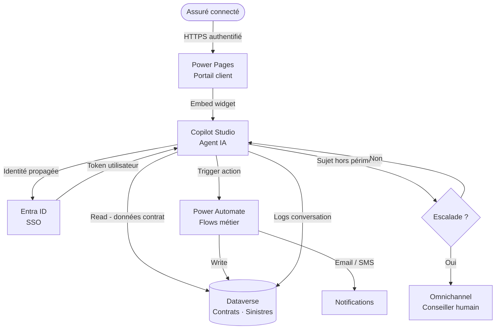

# Scénario J — Agent IA sur portail client

## Objectifs pédagogiques

À l'issue de ce module, vous serez capable de :

1. **Concevoir** l'architecture d'un agent IA intégré à un portail client Power Pages
2. **Identifier** les composants clés et leurs interactions dans un système conversationnel d'entreprise
3. **Distinguer** les responsabilités de Copilot Studio, Power Pages, Dataverse et Power Automate dans ce type de solution
4. **Raisonner** sur les points de décision critiques : escalade humaine, authentification, sécurité des données
5. **Anticiper** les limites et pièges d'architecture spécifiques à ce scénario

---

## Mise en situation

Vous êtes architecte junior chez un intégrateur Microsoft. Un client — disons une société d'assurance — veut moderniser son portail client existant. Aujourd'hui, les assurés doivent appeler le centre de support pour connaître le statut de leur sinistre, modifier leurs coordonnées ou télécharger une attestation. Résultat : 1 200 appels par jour, dont 60 % concernent des demandes simples qui pourraient être traitées en libre-service.

Le client veut un agent conversationnel disponible 24h/24 sur son portail, capable de répondre aux questions fréquentes, d'accéder aux données du contrat de l'assuré, et de router vers un conseiller humain quand la situation dépasse ses capacités. Le tout en respectant des contraintes réglementaires strictes : les données personnelles ne doivent jamais fuiter, l'agent ne doit pas improviser sur des sujets juridiques, et chaque conversation doit être tracée.

C'est exactement le type de scénario où Power Platform brille — à condition de bien architiger.

---

## Contexte

L'intégration d'agents IA dans des portails client n'est plus un projet expérimental. Depuis que Copilot Studio a remplacé Power Virtual Agents et intégré les capacités génératives de Azure OpenAI, Microsoft propose une chaîne complète pour couvrir ce cas d'usage sans sortir de l'écosystème.

Ce qui rend ce scénario particulièrement intéressant architecturalement, c'est la **tension entre trois exigences** qui s'opposent naturellement :

- **Personnalisation** : l'agent doit accéder aux données du client connecté pour être utile
- **Sécurité** : ces mêmes données sont sensibles et ne doivent pas être exposées à tort
- **Expérience conversationnelle** : l'agent doit paraître fluide et intelligent, pas un arbre de décision déguisé

Bien gérer ces trois axes simultanément — c'est l'objet de ce module.

---

## Architecture du système

### Vue d'ensemble des composants

| Composant | Rôle dans ce scénario | Outil Microsoft |
|---|---|---|
| Portail client | Surface d'exposition, authentification de l'utilisateur | Power Pages |
| Agent conversationnel | Traitement du langage, orchestration des topics, réponses génératives | Copilot Studio |
| Données métier | Contrats, sinistres, coordonnées assurés | Dataverse |
| Automatisation | Création de tickets, notifications, mise à jour de données | Power Automate |
| Escalade humaine | Transfert vers conseiller en direct | Omnichannel for Customer Service (Dynamics 365) |
| Identité | Authentification SSO de l'assuré | Microsoft Entra ID (via Power Pages) |

La force de cette stack, c'est que tous ces composants partagent le même plan de données (Dataverse) et le même modèle de sécurité (Entra ID + rôles Dataverse). L'agent ne crée pas une "bulle IA" isolée — il est un participant à part entière de l'écosystème.

### Topologie du système

### Ce que ce diagramme dit vraiment

Regardez le flux d'identité : l'assuré s'authentifie **une seule fois** sur Power Pages, et ce token est propagé jusqu'à Copilot Studio. L'agent sait donc qui parle avant même le premier message. Il peut aller chercher "le contrat de **cet** assuré" et non "les contrats", sans jamais exposer d'autres données.

C'est une décision d'architecture fondamentale. Un agent qui demande "Quel est votre numéro de contrat ?" à un utilisateur déjà authentifié, c'est une régression UX et un risque de sécurité (phishing, erreur de saisie). Le SSO résout les deux problèmes.

---

## Workflow — De la question à la réponse

Voici comment se déroule une conversation typique, de bout en bout.

### Étape 1 — Authentification et chargement du contexte

Quand l'assuré ouvre le widget de chat sur Power Pages, Copilot Studio reçoit le token Entra ID de la session active. Une action de démarrage (`On Conversation Start`) appelle un flow Power Automate qui :

1. Récupère le profil de l'assuré dans Dataverse (nom, numéro client, contrats actifs)
2. Stocke ces données dans des **variables de contexte** de la conversation

À partir de là, l'agent dispose d'un contexte riche sans avoir rien demandé. Chaque réponse peut être personnalisée dès le départ.

### Étape 2 — Traitement du message entrant

Copilot Studio analyse l'intention du message. Deux moteurs coexistent :

- **Topics classiques** : déclenchés sur des phrases-clés ou des intentions configurées manuellement ("statut sinistre", "modifier adresse"...). Ils exécutent un flux déterministe avec des branches conditionnelles.
- **Réponses génératives** : quand aucun topic ne correspond, Copilot Studio peut s'appuyer sur une source de connaissance configurée (SharePoint, site web, FAQ) pour générer une réponse en langage naturel.

🧠 **Concept clé** — La distinction topic/génératif n'est pas anodine. Pour les actions à effet de bord (modifier des données, créer un ticket), il faut toujours passer par un topic structuré avec confirmation explicite. Les réponses génératives sont réservées aux questions informatives. Un agent qui modifierait des données via une réponse générative non contrôlée serait un scénario cauchemardesque.

### Étape 3 — Exécution d'une action métier

Quand l'assuré demande quelque chose qui nécessite une écriture dans Dataverse ("Je veux changer mon adresse"), le topic correspondant :

1. Affiche les données actuelles (lecture Dataverse via connecteur direct ou flow)
2. Demande confirmation explicite à l'utilisateur
3. Appelle un flow Power Automate pour effectuer la modification
4. Confirme le succès et propose une étape suivante

Power Automate est le bon endroit pour la logique métier : il peut faire des validations, envoyer des notifications, écrire un log d'audit, et tout ça sans alourdir la logique de l'agent.

### Étape 4 — Point de décision : escalade ou non ?

C'est l'une des décisions d'architecture les plus importantes. Quand l'agent doit-il transférer vers un humain ?

| Situation | Comportement attendu |
|---|---|
| Question hors périmètre défini | Escalade avec contexte de conversation |
| Demande de résiliation de contrat | Escalade systématique (acte irréversible) |
| Frustration détectée (sentiment négatif) | Proposition d'escalade |
| Échec de compréhension répété (3x) | Escalade automatique |
| Hors horaires d'ouverture | Ticket créé, rappel planifié |

L'escalade vers Omnichannel for Customer Service transfère **la conversation complète** avec son contexte — le conseiller voit ce qui a déjà été dit, les données du client, la raison du transfert. Sans ça, l'assuré doit tout réexpliquer, ce qui annule l'intérêt de l'agent.

### Étape 5 — Logging et traçabilité

Chaque conversation est enregistrée dans Dataverse : messages échangés, topics déclenchés, actions exécutées, issue (résolu / escaladé / abandonné). Ce journal est exploitable en Power BI pour suivre le taux de résolution, les sujets les plus fréquents, les points de friction.

💡 **Astuce** — Ne logguez pas le contenu verbatim des messages si votre secteur est soumis au RGPD ou à des obligations de minimisation des données. Loggez plutôt les intents détectés et les actions déclenchées. C'est suffisant pour l'analytics et plus propre réglementairement.

---

## Prise de décision — Questions d'architecture clés

### Faut-il une IA générative ou des topics structurés ?

La réponse honnête : **les deux, et de façon délibérée**.

Les topics structurés sont non négociables pour tout ce qui touche aux données personnelles, aux transactions, aux actes avec effet légal. Vous savez exactement ce qui se passe, vous pouvez auditer, vous pouvez valider.

Les réponses génératives ajoutent de la valeur pour la FAQ, l'explication de garanties, la guidance sur les démarches — des contenus informatifs qui changent régulièrement et que vous ne pouvez pas transformer en 200 topics différents.

La règle simple : si l'action laisse une trace dans un système de données, c'est un topic structuré avec confirmation. Si c'est de l'information pure, la génération est acceptable avec une source de connaissance maîtrisée (votre SharePoint interne, pas le web ouvert).

### Où mettre la logique métier ?

⚠️ **Erreur fréquente** — Mettre toute la logique dans les topics Copilot Studio. L'agent devient un monolithe impossible à maintenir, à tester et à réutiliser.

La bonne séparation :

- **Copilot Studio** : orchestration conversationnelle, gestion des intentions, UX de l'échange
- **Power Automate** : logique métier, appels vers systèmes tiers, validations, notifications
- **Dataverse** : état, données de référence, logs

Un flow Power Automate peut être réutilisé par d'autres agents, d'autres apps ou d'autres automatisations. Un topic Copilot Studio ne peut pas.

### Comment gérer les données sensibles ?

Plusieurs niveaux de défense à combiner :

1. **Rôles Dataverse** : l'agent accède aux données via un service principal dont les droits sont limités au strict nécessaire (lecture du contrat de l'utilisateur connecté, pas de tous les contrats)
2. **Row-level security** : les règles Dataverse filtrent automatiquement les données en fonction de l'utilisateur authentifié — même si l'agent fait une requête mal ciblée, il ne verra que ce qui lui appartient
3. **PII dans les logs** : audit logging activé dans Dataverse, mais contenu de message non conservé verbatim si réglementairement sensible
4. **Canaux de réponse** : ne jamais afficher de numéro complet de carte, de RIB ou de mot de passe dans le widget. Utiliser des masques (****1234) ou rediriger vers une page sécurisée dédiée

---

## Limites de cette architecture

### Latence des appels chaînés

Chaque action dans Copilot Studio qui déclenche un flow Power Automate ajoute de la latence — typiquement 1 à 3 secondes par appel. Si un topic enchaîne 3 appels de suite (lecture données, vérification éligibilité, écriture log), l'utilisateur attend 5 à 10 secondes entre deux messages. Sur un chat, c'est perceptible.

**Mitigation** : pré-charger le contexte utilisateur au démarrage de la conversation (une seule requête au lieu de plusieurs petites), et regrouper les appels logiquement liés dans un seul flow optimisé.

### Qualité des réponses génératives

La génération basée sur des sources de connaissance dépend directement de la qualité de ces sources. Si votre FAQ SharePoint est mal structurée, contient des doublons ou des informations obsolètes, l'agent va générer des réponses confuses ou incorrectes.

**Mitigation** : traiter les sources de connaissance comme un produit à part entière — révision régulière, structure claire (une page = un sujet), suppression des contenus périmés. Activer la fonctionnalité de citation dans Copilot Studio pour que l'utilisateur puisse vérifier la source.

### Escalade hors horaires

Si Omnichannel n'est pas disponible (nuit, week-end), l'escalade échoue silencieusement si elle n'est pas gérée. L'assuré se retrouve dans un vide.

**Mitigation** : détecter les plages horaires dans le topic d'escalade, créer automatiquement un ticket Dataverse avec priorité, envoyer une confirmation par email à l'assuré avec un délai de rappel estimé.

### Hallucinations sur données métier

Si vous laissez la génération accéder à des données Dataverse de façon non structurée (via une connaissance indexée sur une export), le modèle peut combiner des informations incorrectement et générer une réponse plausible mais fausse.

**Mitigation** : ne jamais utiliser la génération pour des données transactionnelles. Les données de contrat, de sinistre, de paiement passent obligatoirement par des topics structurés avec des appels Dataverse ciblés. La génération ne touche qu'aux contenus statiques validés (FAQ, guides).

---

## Bonnes pratiques

**Tester l'escalade avant tout** — La majorité des projets testent le cas nominal (agent répond correctement) et oublient de tester l'escalade. Le jour où un client frustré est mal transféré, vous avez un problème de confiance qui dépasse la technicité.

**Versionner les topics** — Copilot Studio dispose d'un système de publication (environnements Test / Production). N'itérez jamais directement en production. Chaque modification d'un topic important mérite un test en environnement dédié avant publication.

**Monitorer le taux de non-compréhension** — Le dashboard Analytics de Copilot Studio expose le taux de messages non reconnus par un topic. Un taux élevé sur un sujet révèle soit un topic manquant, soit des phrases de déclenchement insuffisantes. Consultez-le chaque semaine au lancement.

**Ne pas sur-promettre dans l'interface** — Le widget de chat doit indiquer clairement ce que l'agent peut et ne peut pas faire. Un assuré qui pose une question hors périmètre et reçoit une réponse vague perdra confiance. Mieux vaut une escalade propre qu'une réponse approximative.

**Séparer les environnements de connaissance** — Si vous utilisez des sources SharePoint pour la génération, créez un site SharePoint dédié à l'agent, distinct du SharePoint interne de l'entreprise. Vous ne voulez pas que l'agent indexe des notes internes confidentielles par erreur.

---

## Résumé

Ce scénario illustre comment Power Platform peut assembler un système conversationnel d'entreprise cohérent sans orchestrer manuellement des dizaines de services distincts. L'architecture repose sur quatre décisions fondamentales : propager l'identité Entra ID depuis Power Pages jusqu'à l'agent pour personnaliser sans friction ; distinguer rigoureusement les topics structurés (actions à effet de bord) des réponses génératives (information pure) ; déléguer la logique métier à Power Automate pour la réutilisabilité et la maintenabilité ; et dimensionner l'escalade comme un flux de premier plan, pas une sortie de secours.

Les limites à surveiller sont principalement la latence des appels chaînés, la qualité des sources de connaissance, et la gestion des cas hors horaires. Ces trois points sont anticipables dès la phase de conception et n'ont rien de rédhibitoire.

Ce type d'architecture est reproductible dans de nombreux secteurs — retail, RH, collectivités — dès que la combinaison portail authentifié + données métier + besoin de libre-service est présente.

---

<!-- snippet
id: powerplatform_agent_sso_propagation
type: concept
tech: Copilot Studio
level: intermediate
importance: high
format: knowledge
tags: copilot studio, authentification, power pages, entra id, sso
title: Propagation du token SSO vers l'agent Copilot Studio
content: Quand un agent Copilot Studio est embarqué dans Power Pages, le token Entra ID de l'utilisateur connecté est automatiquement transmis à l'agent via la configuration d'authentification du canal. L'agent peut alors récupérer l'identité de l'utilisateur dans la variable système `System.User` dès le démarrage de la conversation — sans demander de login supplémentaire.
description: Le SSO Power Pages → Copilot Studio évite de demander l'identité à l'utilisateur déjà connecté, et restreint l'accès aux seules données qui lui appartiennent.
-->

<!-- snippet
id: powerplatform_agent_topic_vs_generatif
type: concept
tech: Copilot Studio
level: intermediate
importance: high
format: knowledge
tags: copilot studio, topics, generation, architecture, securite
title: Quand utiliser topic structuré vs réponse générative
content: Règle de décision : si l'action laisse une trace dans un système (écriture Dataverse, création ticket, modification données), c'est un topic structuré avec étape de confirmation explicite. Si c'est de l'information pure (FAQ, explication de garantie), la génération est acceptable sur une source de connaissance maîtrisée. Mélanger les deux sans règle expose à des écritures non contrôlées déclenchées par une réponse générative imprécise.
description: Topics structurés pour les actions à effet de bord, génération uniquement pour les réponses informatives sur contenu statique validé.
-->

<!-- snippet
id: powerplatform_agent_logique_metier
type: warning
tech: Copilot Studio
level: intermediate
importance: high
format: knowledge
tags: copilot studio, power automate, architecture, maintenabilite
title: Ne pas mettre la logique métier dans les topics Copilot Studio
content: Piège : concentrer toutes les validations, calculs et appels systèmes dans les branches d'un topic → l'agent devient un monolithe non testable et non réutilisable. Correction : les topics orchestrent la conversation (intention, confirmation, message de retour), Power Automate exécute la logique métier. Un flow Power Automate est réutilisable par d'autres agents, apps ou automatisations. Un topic Copilot Studio, non.
description: Copilot Studio = orchestration conversationnelle. Power Automate = logique métier. Ne pas inverser les responsabilités.
-->

<!-- snippet
id: powerplatform_agent_escalade_horaires
type: warning
tech: Copilot Studio
level: intermediate
importance: high
format: knowledge
tags: copilot studio, escalade, omnichannel, gestion erreur, ux
title: Gérer l'escalade hors horaires d'ouverture
content: Piège : un topic d'escalade qui appelle Omnichannel sans vérifier la disponibilité échoue silencieusement la nuit et le week-end — l'assuré se retrouve sans réponse. Correction : détecter la plage horaire dans le topic (condition sur heure système), créer un ticket Dataverse si hors horaires, envoyer une confirmation email à l'assuré avec délai de rappel estimé. L'escalade doit être traitée comme un flux de premier plan, pas une sortie de secours.
description: Sans gestion des horaires, l'escalade vers Omnichannel échoue silencieusement. Toujours prévoir le chemin alternatif (ticket + confirmation).
-->

<!-- snippet
id: powerplatform_agent_pii_logs
type: tip
tech: Copilot Studio
level: intermediate
importance: medium
format: knowledge
tags: rgpd, logs, dataverse, securite, conformite
title: Logger les intents plutôt que le contenu verbatim des messages
content: Pour les secteurs soumis au RGPD ou à des obligations de minimisation des données, ne pas conserver le texte brut des messages dans les logs de conversation. Logger à la place : l'intent détecté (nom du topic déclenché), les actions exécutées, le résultat (résolu / escaladé / abandonné), et l'horodatage. C'est suffisant pour l'analytics et réduit drastiquement le périmètre de données personnelles stockées.
description: Logger intent + action + résultat, pas les messages bruts — suffisant pour l'analytics, plus propre réglementairement sous RGPD.
-->

<!-- snippet
id: powerplatform_agent_latence_chaines
type: tip
tech: Copilot Studio
level: intermediate
importance: medium
format: knowledge
tags: copilot studio, power automate, performance, latence, optimisation
title: Réduire la latence en pré-chargeant le contexte au démarrage
content: Chaque appel Power Automate depuis un topic ajoute 1 à 3 secondes. Un topic qui enchaîne 3 appels (lecture contrat, vérification éligibilité, log) génère 5 à 10 secondes d'attente perçue. Solution : déclencher un unique flow dans le topic `On Conversation Start` qui récupère toutes les données utiles (profil, contrats, sinistres ouverts) et les stocke dans des variables de contexte. Les topics suivants lisent les variables sans nouvel appel réseau.
description: Pré-charger le contexte utilisateur en une seule requête au démarrage évite d'enchaîner des appels Power Automate pendant la conversation.
-->

<!-- snippet
id: powerplatform_agent_row_level_security
type: concept
tech: Dataverse
level: intermediate
importance: high
format: knowledge
tags: dataverse, securite, row-level security, rls, agent ia
title: La row-level security Dataverse protège même les requêtes mal ciblées
content: Quand l'agent accède à Dataverse via un service principal configuré avec la row-level security (RLS) Dataverse, les règles de sécurité filtrent automatiquement les enregistrements selon l'utilisateur connecté. Même si une requête mal formulée demande "tous les contrats", Dataverse ne retourne que les contrats appartenant à l'utilisateur authentifié — la RLS agit au niveau moteur, avant que le résultat ne remonte à l'agent.
description: La RLS Dataverse filtre les données au niveau moteur : même une requête mal ciblée de l'agent ne peut pas exposer les données d'un autre client.
-->

<!-- snippet
id: powerplatform_agent_sources_connaissance
type: warning
tech: Copilot Studio
level: intermediate
importance: medium
format: knowledge
tags: copilot studio, generation, sharepoint, sources, qualite
title: Isoler les sources de connaissance de l'agent du SharePoint interne
content: Piège : pointer les sources de connaissance génératives directement sur le SharePoint interne de l'entreprise — l'agent peut indexer des notes confidentielles, des brouillons ou des documents internes non destinés aux clients. Correction : créer un site SharePoint dédié à l'agent, alimenté uniquement par des contenus validés et publiés (FAQ, guides, politiques). Traiter ce site comme un produit éditorial avec révision régulière.
description: Ne jamais connecter la génération au SharePoint interne global. Créer un site dédié avec contenu validé pour éviter l'exposition de données confidentielles.
-->
