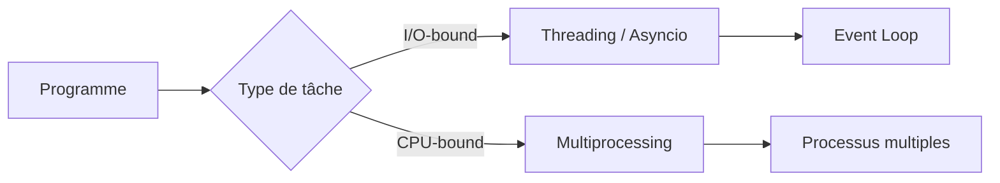
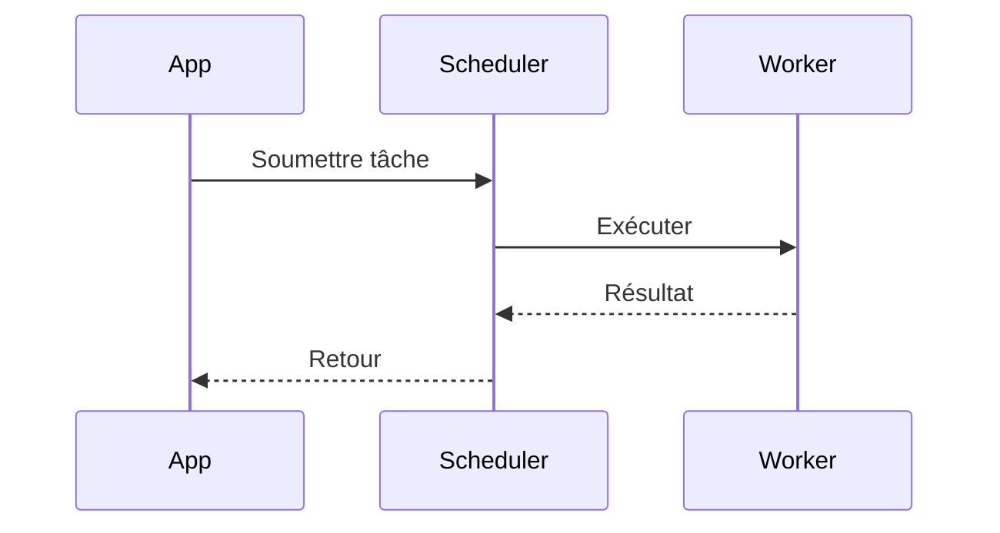

# Concurrence & parallélisme en Python (threads, multiprocessing, asyncio)

## Objectifs pédagogiques
- Distinguer concurrence et parallélisme
- Comprendre l'impact du GIL en Python ⭐
- Choisir le bon modèle (threading / multiprocessing / asyncio)
- Implémenter des tâches concurrentes simples et robustes

## Contexte
Les applications modernes doivent gérer des tâches simultanées (I/O réseau, appels API, traitement CPU). Mal choisir le modèle entraîne des performances médiocres ou des bugs subtils.

## Principe de fonctionnement

🧠 Concept clé — Concurrence vs parallélisme  
- Concurrence : gérer plusieurs tâches "en même temps" (interleaving)  
- Parallélisme : exécuter réellement en même temps (multi-core)

🧠 Concept clé — GIL (Global Interpreter Lock) ⭐  
Le GIL empêche plusieurs threads Python d'exécuter du code Python en parallèle sur plusieurs cœurs.

💡 Astuce — I/O-bound vs CPU-bound  
- I/O-bound → threading / asyncio  
- CPU-bound → multiprocessing

⚠️ Erreur fréquente — utiliser threading pour du CPU-bound  
→ pas de gain (à cause du GIL) → utiliser multiprocessing

---

## Architecture

| Composant | Rôle | Exemple |
|-----------|------|---------|
| Thread | Concurrence légère | appels HTTP parallèles |
| Process | Parallélisme réel | calcul CPU intensif |
| Event loop | Orchestration async | asyncio |
| Task/Future | Unité de travail async | coroutine |



---

## Syntaxe ou utilisation

### Threading (I/O-bound)

```python
import threading

def task():
    print("Task exécutée")

t = threading.Thread(target=task)
t.start()
t.join()
```

Résultat : exécution concurrente simple (utile pour I/O).

---

### Multiprocessing (CPU-bound) ⭐

```python
from multiprocessing import Process

def task():
    print("Calcul lourd")

p = Process(target=task)
p.start()
p.join()
```

Résultat : exécution sur un autre cœur CPU.

---

### Asyncio (I/O asynchrone) ⭐

```python
import asyncio

async def task():
    print("Start")
    await asyncio.sleep(1)
    print("End")

asyncio.run(task())
```

Résultat : gestion non bloquante des tâches I/O.

---

## Workflow du système

1. Le programme identifie le type de tâche (I/O ou CPU)
2. Choix du modèle (thread / process / async)
3. Planification des tâches
4. Exécution concurrente/parallèle
5. Synchronisation (join / await)



En cas d'erreur :
- Thread : exception silencieuse possible ⚠️
- Async : exception dans coroutine
- Process : crash isolé (plus sûr)

---

## Cas d'utilisation

### Cas simple
Télécharger plusieurs URLs en parallèle (I/O-bound)

### Cas réel
Service backend :
- appels API externes (asyncio)
- traitement batch (multiprocessing)
- scraping concurrent (threading)

---

## Erreurs fréquentes

⚠️ Mauvais modèle de concurrence  
Symptôme : performances nulles  
Cause : GIL ignoré  
Correction : choisir multiprocessing pour CPU-bound

⚠️ Conditions de course (race condition)  
Symptôme : résultats incohérents  
Cause : accès concurrent à une ressource  
Correction : locks / design immuable

💡 Astuce : préférer l’immutabilité pour éviter les verrous

---

## Bonnes pratiques

🔧 Identifier I/O vs CPU avant de coder  
🔧 Éviter le partage d’état mutable entre threads  
🔧 Utiliser des pools (ThreadPool / ProcessPool)  
🔧 Gérer les timeouts réseau  
🔧 Logger les erreurs concurrentes  
🔧 Tester sous charge (comportement réel)  
🔧 Préférer asyncio pour I/O massif  

---

## Résumé

| Concept | Définition courte | À retenir |
|--------|-------------------|----------|
| GIL | verrou global Python | limite le multi-thread CPU |
| threading | concurrence | bien pour I/O |
| multiprocessing | parallélisme | bien pour CPU |
| asyncio | async non bloquant | scalable I/O |

Étapes essentielles :
- Identifier le type de tâche
- Choisir le bon modèle
- Implémenter + synchroniser
- Tester sous charge

Phrase clé : **Le bon modèle de concurrence dépend du type de charge (I/O vs CPU), pas de la syntaxe.**

---

## SNIPPETS DE RÉVISION

<!-- snippet
id: python_gil_definition
type: concept
tech: python
level: intermediate
importance: high
format: knowledge
tags: python,gil,concurrency
title: GIL limite le multithread CPU
content: Le GIL empêche l'exécution parallèle du code Python sur plusieurs threads CPU
description: Utiliser multiprocessing pour CPU-bound
-->

<!-- snippet
id: python_io_cpu_choice
type: concept
tech: python
level: intermediate
importance: high
format: knowledge
tags: python,concurrency,design
title: Choisir le bon modèle
content: Le GIL Python permet aux threads de tourner en parallèle pour les opérations I/O (réseau, fichiers) mais pas pour le calcul CPU pur. Pour un scraper ou une API : threading ou asyncio. Pour du traitement d'image ou du ML : multiprocessing contourne le GIL en créant des process séparés.
description: asyncio > threading pour I/O : un seul thread gère des milliers de connexions concurrentes sans le coût de context-switching entre threads.
-->

<!-- snippet
id: python_thread_example
type: command
tech: python
level: intermediate
importance: medium
format: knowledge
tags: python,threading
title: Thread simple Python
command: python -c "import threading; t=threading.Thread(target=lambda:print('ok')); t.start(); t.join()"
description: Démarre un thread et attend sa fin
-->

<!-- snippet
id: python_asyncio_run
type: command
tech: python
level: intermediate
importance: medium
format: knowledge
tags: python,asyncio
title: Exécuter coroutine asyncio
command: python -c "import asyncio; async def f(): await asyncio.sleep(0); print('ok'); asyncio.run(f())"
description: Lance une coroutine avec l'event loop
-->

<!-- snippet
id: python_race_condition_warning
type: warning
tech: python
level: intermediate
importance: high
format: knowledge
tags: python,concurrency,bug
title: Race condition
content: accès concurrent mutable → résultats incohérents → utiliser locks ou immutabilité
description: Bug critique en concurrence
-->

<!-- snippet
id: python_async_tip
type: tip
tech: python
level: intermediate
importance: medium
format: knowledge
tags: python,asyncio,performance
title: Async pour I/O massif
content: beaucoup d'appels réseau → utiliser asyncio pour éviter le blocage
description: Meilleure scalabilité I/O
-->

<!-- snippet
id: python_multiprocessing_tip
type: tip
tech: python
level: intermediate
importance: high
format: knowledge
tags: python,multiprocessing,performance
title: Multiprocessing pour CPU
content: calcul intensif → utiliser multiprocessing pour exploiter plusieurs cœurs
description: Contourne le GIL
-->

<!-- snippet
id: python_thread_warning_cpu
type: warning
tech: python
level: intermediate
importance: high
format: knowledge
tags: python,threading,gil
title: Threading pour CPU inefficace
content: threading pour CPU-bound → pas de gain → utiliser multiprocessing
description: Piège fréquent lié au GIL
-->
