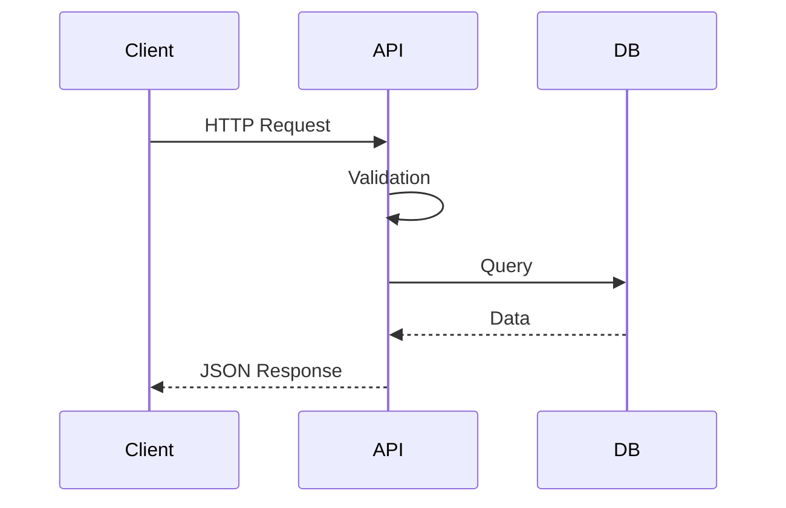

# APIs & backend Python avec FastAPI

## Objectifs pédagogiques
- Comprendre le fonctionnement d'une API HTTP
- Créer une API avec FastAPI
- Gérer les routes, paramètres et validations
- Structurer une API prête pour la production

## Contexte
Les APIs sont au cœur des architectures modernes (microservices, frontend/backend). Python est largement utilisé avec FastAPI pour créer des services rapides et fiables.

## Principe de fonctionnement

🧠 Concept clé — API  
Une interface permettant à des systèmes de communiquer via HTTP.

🧠 Concept clé — Endpoint  
Une URL exposant une fonctionnalité.

💡 Astuce — REST est un standard mais pas une obligation stricte

⚠️ Erreur fréquente — ne pas valider les entrées  
→ faille sécurité

---

## Architecture

| Composant | Rôle | Exemple |
|-----------|------|---------|
| Client | envoie requêtes | navigateur, frontend |
| API | logique métier | FastAPI |
| DB | stockage | PostgreSQL |


---

## Syntaxe ou utilisation

### Installation

```bash
pip install fastapi uvicorn
```

---

### API simple ⭐

```python
from fastapi import FastAPI

app = FastAPI()

@app.get("/")
def read_root():
    return {"message": "Hello World"}
```

---

### Lancer serveur

```bash
uvicorn main:app --reload
```

Résultat : API accessible sur http://127.0.0.1:8000

---

### Paramètres

```python
@app.get("/users/{user_id}")
def get_user(user_id: int):
    return {"user_id": user_id}
```

---

### Validation avec Pydantic ⭐

```python
from pydantic import BaseModel

class User(BaseModel):
    name: str
    age: int

@app.post("/users")
def create_user(user: User):
    return user
```

---

## Workflow du système

1. Client envoie requête HTTP
2. FastAPI reçoit la requête
3. Validation des données
4. Traitement métier
5. Réponse JSON



En cas d’erreur :
- FastAPI renvoie erreur HTTP (400, 500)
- Validation automatique Pydantic

---

## Cas d'utilisation

### Cas simple
Créer une API Hello World

### Cas réel
Backend e-commerce :
- gestion utilisateurs
- gestion commandes
- validation données
- accès base

---

## Erreurs fréquentes

⚠️ Pas de validation  
→ données invalides

⚠️ Mauvaise gestion erreurs  
→ API instable

💡 Astuce : toujours typer les entrées

---

## Bonnes pratiques

🔧 Toujours valider avec Pydantic  
🔧 Séparer routes / services / models  
🔧 Gérer les erreurs HTTP  
🔧 Documenter automatiquement (Swagger)  
🔧 Logger les requêtes  
🔧 Protéger les endpoints (auth)  

---

## Résumé

| Concept | Définition courte | À retenir |
|--------|------------------|----------|
| API | interface HTTP | base backend |
| FastAPI | framework | rapide |
| Pydantic | validation | essentiel |

Étapes :
- définir route
- valider input
- traiter
- répondre

Phrase clé : **Une API fiable repose sur validation + structure + gestion erreurs.**

---

## SNIPPETS DE RÉVISION

<!-- snippet
id: python_fastapi_basic
type: concept
tech: python
level: intermediate
importance: high
format: knowledge
tags: python,fastapi
title: API FastAPI simple
content: FastAPI permet de créer rapidement des APIs HTTP en Python
description: Framework moderne backend
-->

<!-- snippet
id: python_uvicorn_run
type: command
tech: python
level: intermediate
importance: high
format: knowledge
tags: python,fastapi
title: Lancer API FastAPI
command: uvicorn main:app --reload
description: Lance le serveur de développement
-->

<!-- snippet
id: python_pydantic_validation
type: concept
tech: python
level: intermediate
importance: high
format: knowledge
tags: python,pydantic
title: Validation Pydantic
content: Pydantic valide automatiquement les données entrantes dans FastAPI
description: Sécurité et robustesse
-->

<!-- snippet
id: python_api_validation_warning
type: warning
tech: python
level: intermediate
importance: high
format: knowledge
tags: python,api,error
title: Pas de validation API
content: entrée non validée → données corrompues → utiliser Pydantic
description: fail critique backend
-->

