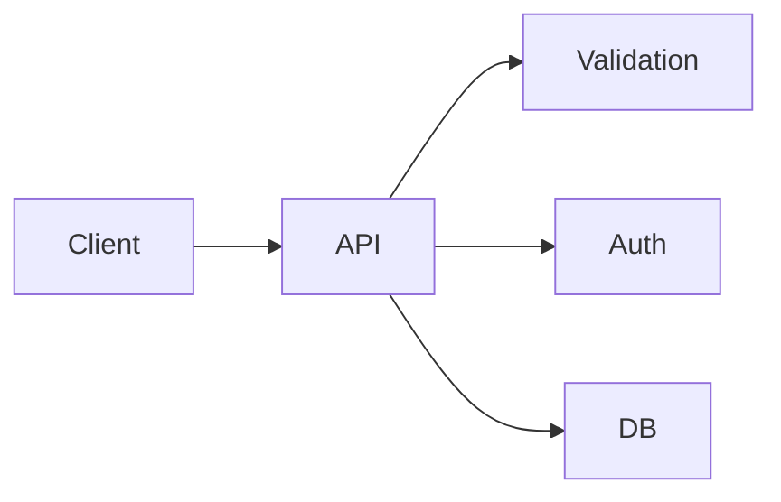
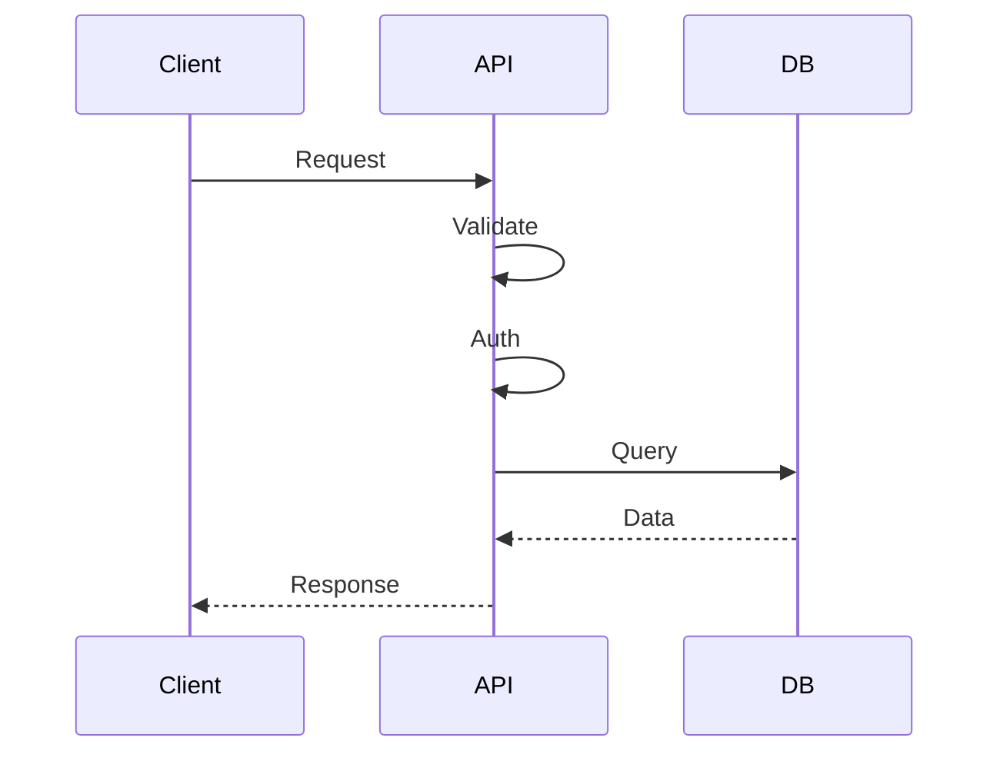

# Sécurité applicative en Python

## Objectifs pédagogiques
- Comprendre les vulnérabilités courantes (OWASP)
- Sécuriser une API Python (auth, validation, secrets)
- Implémenter un hashing sécurisé des mots de passe
- Éviter les failles critiques (injection, exposition données)

## Contexte
La majorité des applications exposées sur internet sont vulnérables à cause de mauvaises pratiques. La sécurité n’est pas un bonus, c’est une exigence.

## Principe de fonctionnement

🧠 Concept clé — Surface d’attaque  
Tout point d’entrée de ton application (API, formulaire, fichier)

🧠 Concept clé — Défense en profondeur  
Multiplier les couches de sécurité

💡 Astuce — Ne jamais faire confiance aux entrées utilisateur

⚠️ Erreur fréquente — sécurité ajoutée après coup  
→ souvent trop tard

---

## Architecture

| Composant | Rôle | Exemple |
|-----------|------|---------|
| Client | envoie données | navigateur |
| API | validation + auth | FastAPI |
| DB | stockage | PostgreSQL |
| Auth | contrôle accès | JWT |



---

## Syntaxe ou utilisation

### Hash mot de passe ⭐

```python
import bcrypt

password = b"secret"
hashed = bcrypt.hashpw(password, bcrypt.gensalt())

bcrypt.checkpw(password, hashed)
```

Résultat : stockage sécurisé (non réversible)

---

### JWT (authentification)

```python
import jwt

token = jwt.encode({"user_id": 1}, "SECRET", algorithm="HS256")
```

---

### Variables d’environnement ⭐

```bash
export SECRET_KEY=mysecret
```

---

## Workflow du système

1. Client envoie données
2. API valide input
3. Authentification
4. Traitement
5. Réponse sécurisée



En cas d’erreur :
- rejet immédiat
- log de sécurité

---

## Cas d'utilisation

### Cas simple
Login utilisateur sécurisé

### Cas réel
Backend SaaS :
- auth JWT
- hashing mots de passe
- protection API
- gestion rôles

---

## Erreurs fréquentes

⚠️ Stocker mot de passe en clair  
→ fail critique

⚠️ Utiliser SHA256 seul  
→ trop rapide → vulnérable

⚠️ Exposer secrets dans code  
→ fuite données

💡 Astuce : toujours utiliser bcrypt + env vars

---

## Bonnes pratiques

🔧 Toujours hasher les mots de passe  
🔧 Valider toutes les entrées  
🔧 Utiliser variables d’environnement  
🔧 Mettre en place authentification  
🔧 Logger les accès sensibles  
🔧 Limiter les permissions  
🔧 Mettre à jour dépendances  

---

## Résumé

| Concept | Définition courte | À retenir |
|--------|------------------|----------|
| hashing | protéger mdp | obligatoire |
| JWT | auth stateless | standard |
| validation | filtrer input | critique |

Étapes clés :
- valider
- authentifier
- sécuriser
- contrôler

Phrase clé : **Une application non sécurisée est une application déjà compromise.**

---

## SNIPPETS DE RÉVISION

<!-- snippet
id: python_bcrypt_hash
tech: python
level: intermediate
importance: high
format: knowledge
tags: python,security
title: Hash mot de passe
content: bcrypt permet de hasher un mot de passe de manière sécurisée
description: standard sécurité
-->

<!-- snippet
id: python_jwt_usage
tech: python
level: intermediate
importance: high
format: knowledge
tags: python,jwt
title: JWT authentification
content: JWT permet d'authentifier un utilisateur sans session serveur
description: auth stateless
-->

<!-- snippet
id: python_password_warning
tech: python
level: intermediate
importance: high
format: knowledge
tags: python,security,error
title: Mot de passe en clair
content: stocker mdp en clair → fail critique → utiliser bcrypt
description: fail majeur
-->

<!-- snippet
id: python_env_secret
tech: python
level: intermediate
importance: high
format: knowledge
tags: python,env
title: Secrets en env
content: les secrets doivent être stockés en variables d'environnement
description: sécurité configuration
-->

