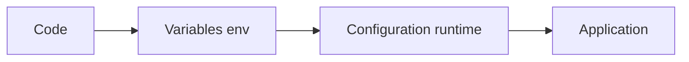
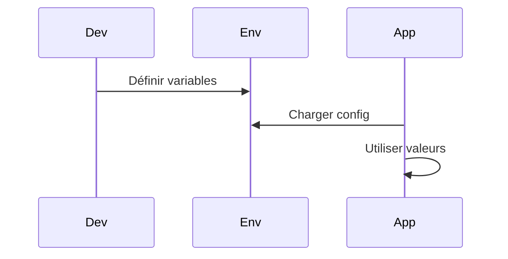

# Multi-environnement & configuration en Python

## Objectifs pédagogiques
- Comprendre les environnements dev / staging / prod
- Gérer la configuration via variables d’environnement
- Structurer une configuration propre et scalable
- Éviter les erreurs critiques liées à la config

## Contexte
Une application ne tourne jamais dans un seul environnement. En production, la configuration doit être adaptable, sécurisée et indépendante du code.

## Principe de fonctionnement

🧠 Concept clé — Environnement  
Un contexte d’exécution (dev, staging, prod)

🧠 Concept clé — Configuration externe ⭐  
La configuration doit être séparée du code

💡 Astuce — “Config ≠ code”

⚠️ Erreur fréquente — hardcoder des valeurs  
→ impossible à déployer correctement

---

## Architecture

| Composant | Rôle | Exemple |
|-----------|------|---------|
| Code | logique métier | app.py |
| Config | paramètres | .env |
| Runtime | environnement | dev/prod |



---

## Syntaxe ou utilisation

### Variables d’environnement

```bash
export DB_HOST=localhost
export SECRET_KEY=mysecret
```

---

### Accès en Python

```python
import os

db_host = os.getenv("DB_HOST")
```

---

### dotenv ⭐

```bash
pip install python-dotenv
```

```python
from dotenv import load_dotenv
load_dotenv()
```

---

## Workflow du système

1. Définir variables (.env ou système)
2. Charger config au démarrage
3. Application utilise config
4. Adapter selon environnement



En cas d’erreur :
- variable absente → crash ou mauvais comportement
- fallback recommandé

---

## Cas d'utilisation

### Cas simple
Changer DB locale vs prod

### Cas réel
Backend SaaS :
- DB_HOST
- API_KEY
- MODE (dev/prod)

---

## Erreurs fréquentes

⚠️ Hardcode config
→ impossible à scaler

⚠️ Secrets dans repo
→ fail sécurité

💡 Astuce : utiliser .env + gitignore

---

## Bonnes pratiques

🔧 Ne jamais hardcoder  
🔧 Utiliser variables d’environnement  
🔧 Valider les configs au démarrage  
🔧 Fournir valeurs par défaut  
🔧 Séparer config par environnement  
🔧 Documenter les variables  

---

## Résumé

| Concept | Définition courte | À retenir |
|--------|------------------|----------|
| env | configuration | standard |
| dotenv | chargement | pratique |
| multi-env | adaptation | essentiel |

Étapes :
- définir config
- charger
- utiliser
- sécuriser

Phrase clé : **Une bonne config rend ton application portable et déployable.**

---

## SNIPPETS DE RÉVISION

<!-- snippet
id: python_env_variable
type: concept
tech: python
level: intermediate
importance: high
format: knowledge
tags: python,env
title: Variable environnement
content: Les variables d’environnement sont des paires clé-valeur injectées dans le processus au démarrage. Elles permettent de changer DATABASE_URL, API_KEY ou LOG_LEVEL entre dev et prod sans toucher au code ni rebuilder une image Docker.
description: C’est le facteur III du manifeste Twelve-Factor App : stocker la config dans l’environnement, jamais dans le code.
-->

<!-- snippet
id: python_os_getenv
type: concept
tech: python
level: intermediate
importance: high
format: knowledge
tags: python,env
title: Accès variable env
content: `os.getenv("MA_VAR")` retourne `None` si la variable n’est pas définie. `os.getenv("MA_VAR", "valeur_défaut")` retourne la valeur par défaut. `os.environ["MA_VAR"]` lève une `KeyError` si absente — utile pour forcer la présence d’une config obligatoire au démarrage.
description: Préférer `os.environ["DB_URL"]` pour les variables critiques : l’app crashe au démarrage avec un message clair plutôt que de tourner silencieusement avec une config invalide.
-->

<!-- snippet
id: python_env_warning
type: warning
tech: python
level: intermediate
importance: high
format: knowledge
tags: python,config,error
title: Hardcode config
content: config dans le code → non portable → utiliser variables env
description: erreur critique
-->

<!-- snippet
id: python_dotenv_usage
type: concept
tech: python
level: intermediate
importance: medium
format: knowledge
tags: python,dotenv
title: dotenv usage
content: dotenv permet de charger un fichier .env en variables d’environnement
description: simplifie config locale
-->
