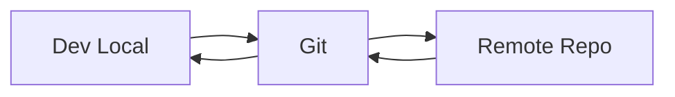

# Git & travail en équipe pour développeur Python

## Objectifs pédagogiques
- Comprendre le fonctionnement de Git
- Gérer un workflow en équipe (branching, PR)
- Éviter les erreurs courantes (merge conflicts, reset)
- Travailler efficacement sur un projet collaboratif

## Contexte
En entreprise, tu ne codes jamais seul. Git est l’outil central pour collaborer, versionner et sécuriser le code.

## Principe de fonctionnement

🧠 Concept clé — Repository  
Un dépôt contenant l’historique du code.

🧠 Concept clé — Commit  
Une sauvegarde versionnée du code.

💡 Astuce — Commits petits et fréquents  
Permet un meilleur suivi.

⚠️ Erreur fréquente — commit trop gros  
→ difficile à relire / corriger

---

## Architecture

| Composant | Rôle | Exemple |
|-----------|------|---------|
| Local repo | travail dev | git init |
| Remote repo | partage | GitHub |
| Branch | isolation travail | feature/login |



---

## Commandes essentielles

### Initialisation

```bash
git init
git clone <URL>
```

---

### Cycle de base ⭐

```bash
git add .
git commit -m "message"
git push
```

---

### Branching

```bash
git checkout -b feature/login
git checkout main
```

---

### Merge

```bash
git merge feature/login
```

---

## Fonctionnement interne

Git fonctionne par snapshots (instantanés), pas par modifications ligne par ligne.

💡 Astuce — HEAD = position actuelle  
⚠️ Erreur fréquente — reset sans comprendre → perte de code

---

## Cas réel en entreprise

- dev crée une branche feature
- code + commits
- push sur remote
- pull request
- review équipe
- merge main

Résultat :
- code validé
- historique propre
- collaboration fluide

---

## Bonnes pratiques

🔧 Commits petits et clairs  
🔧 Utiliser branches par feature  
🔧 Ne jamais travailler directement sur main  
🔧 Faire des pull requests  
🔧 Relire le code (code review)  
🔧 Résoudre les conflits proprement  
🔧 Documenter les changements  

---

## Résumé

Git permet de :
- versionner le code
- collaborer
- sécuriser les modifications

Étapes clés :
- add → commit → push
- branch → PR → merge

Phrase clé : **Git n’est pas un outil, c’est une méthode de travail.**

---

## SNIPPETS DE RÉVISION

<!-- snippet
id: git_commit_basic
type: command
tech: git
level: intermediate
importance: high
format: knowledge
tags: git,commit
title: Commit Git
command: git commit -m "message"
description: Enregistre un snapshot du code
-->

<!-- snippet
id: git_branch_usage
type: concept
tech: git
level: intermediate
importance: high
format: knowledge
tags: git,branch
title: Branch Git
content: Une branche Git est juste un pointeur vers un commit. Créer une branche ne copie aucun fichier — c'est instantané. Travailler directement sur main sans branche signifie que tout commit instable est immédiatement partagé avec l'équipe.
description: Convention : une branche par feature, bug ou PR. Un nom explicite (`feature/auth-jwt`, `fix/login-timeout`) remplace les commentaires dans l'historique.
-->

<!-- snippet
id: git_merge_warning
type: warning
tech: git
level: intermediate
importance: high
format: knowledge
tags: git,merge,error
title: Mauvais merge
content: merge sans review → bugs → utiliser PR + validation
description: erreur fréquente
-->

<!-- snippet
id: git_workflow_tip
type: tip
tech: git
level: intermediate
importance: medium
format: knowledge
tags: git,workflow
title: Workflow Git
content: Chaque étape du flux branch → commit → push → PR → merge a un rôle : la branche isole le travail, le commit documente chaque changement, la PR centralise la revue, le merge intègre après validation. Court-circuiter une étape (ex. push direct sur main) supprime la safety net correspondante.
description: La PR est le point de contrôle clé : c'est là que les bugs sont détectés par les pairs, avant d'atteindre la branche partagée.
-->

