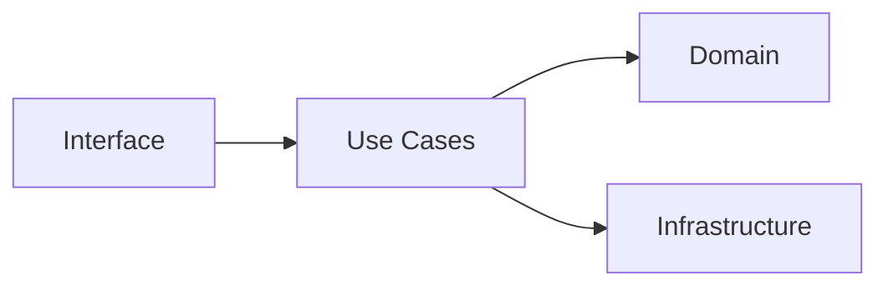

# Architecture Python (Clean Architecture & Hexagonale)

## Objectifs pédagogiques
- Comprendre les principes d’architecture logicielle moderne
- Structurer une application Python scalable
- Distinguer logique métier et infrastructure
- Appliquer Clean Architecture dans un projet réel

## Définition

Une architecture logicielle définit la manière dont les composants d’un système sont organisés et interagissent.

Analogie : comme les fondations d’un bâtiment — invisibles mais essentielles.

## Pourquoi ce concept existe

Sans architecture :
- code spaghetti
- dépendances chaotiques
- impossible à maintenir

Avec architecture :
- modularité
- testabilité
- scalabilité

---

## Fonctionnement

🧠 Concept clé — séparation des responsabilités  
Chaque couche a un rôle précis.

### Structure typique

| Élément | Rôle | Exemple |
|---------|------|--------|
| Domain | logique métier | User, Order |
| Use case | règles applicatives | create_user |
| Infrastructure | DB, API | PostgreSQL |
| Interface | API, CLI | FastAPI |

---

💡 Astuce — Le domaine ne dépend de rien  
C’est le cœur du système.

⚠️ Erreur fréquente — logique métier dans controllers  
→ difficile à tester

---

## Comparaison

| Critère | Clean Architecture | Code classique |
|--------|------------------|---------------|
| modularité | forte | faible |
| testabilité | élevée | faible |
| maintenance | facile | difficile |

---

## Cas réel

Backend SaaS :

- API (FastAPI)
- services (use cases)
- domain (logique métier)
- DB (infra)

Résultat :
- code testable
- évolutif
- robuste

---

## Bonnes pratiques

🔧 Séparer logique métier et technique  
🔧 Éviter dépendances inversées  
🔧 Utiliser interfaces (abstraction)  
🔧 Tester le domaine indépendamment  
🔧 Structurer les dossiers clairement  
🔧 Limiter les couplages  

---

## Résumé

L’architecture permet :
- structurer le code
- faciliter les tests
- améliorer la maintenabilité

Phrase clé : **Un bon code sans architecture devient un mauvais projet.**

---

## SNIPPETS DE RÉVISION

<!-- snippet
id: python_clean_architecture
type: concept
tech: python
level: advanced
importance: high
format: knowledge
tags: python,architecture
title: Clean Architecture
content: Séparer domaine, use cases et infrastructure pour un code maintenable
description: base architecture moderne
-->

<!-- snippet
id: python_domain_logic
type: concept
tech: python
level: advanced
importance: high
format: knowledge
tags: python,architecture
title: Domaine indépendant
content: La logique métier (règles de calcul, validation, workflow) couplée à Flask, SQLAlchemy ou Redis devient impossible à tester unitairement et à migrer. En l'isolant dans des fonctions ou classes pures, on peut la tester sans démarrer une BDD ni un serveur.
description: Principe de la Clean Architecture : les couches internes (domaine) ne connaissent pas les couches externes (frameworks). Les dépendances pointent vers l'intérieur.
-->

<!-- snippet
id: python_architecture_warning
type: warning
tech: python
level: advanced
importance: high
format: knowledge
tags: python,architecture,error
title: Code spaghetti
content: mélange logique et infra → code non maintenable → appliquer architecture
description: problème critique
-->

