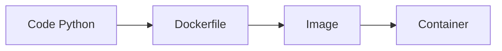

# Conteneurisation & déploiement Python avec Docker

## Objectifs pédagogiques
- Comprendre le principe des conteneurs
- Créer un Dockerfile pour une application Python
- Optimiser une image Docker
- Déployer une application conteneurisée

## Contexte
En production, une application doit être portable, reproductible et isolée. Docker permet d’exécuter ton code de manière identique partout.

## Principe de fonctionnement

🧠 Concept clé — Conteneur  
Un environnement isolé contenant ton application et ses dépendances.

🧠 Concept clé — Image  
Template immuable permettant de lancer des conteneurs.

💡 Astuce — “Build once, run everywhere”

⚠️ Erreur fréquente — image trop lourde  
→ lenteur + coût

---

## Architecture

| Composant | Rôle | Exemple |
|-----------|------|---------|
| Dockerfile | build image | instructions |
| Image | snapshot app | python:3.11 |
| Container | exécution | runtime |



---

## Commandes essentielles

### Dockerfile simple ⭐

```dockerfile
FROM python:3.11

WORKDIR /app

COPY . .

RUN pip install -r requirements.txt

CMD ["python", "app.py"]
```

---

### Build image

```bash
docker build -t myapp .
```

---

### Run container

```bash
docker run -p 8000:8000 myapp
```

---

## Fonctionnement interne

1. Docker lit le Dockerfile
2. Construit une image par couches
3. Lance un conteneur basé sur l’image

💡 Astuce — Chaque ligne = une couche  
⚠️ Mauvais ordre → build lent

---

## Cas réel en entreprise

API FastAPI :

- Dockerfile
- image build
- déploiement sur serveur/cloud

Résultat :
- environnement identique
- déploiement rapide

---

## Bonnes pratiques

🔧 Utiliser images officielles  
🔧 Minimiser les layers  
🔧 Utiliser .dockerignore  
🔧 Éviter les fichiers inutiles  
🔧 Ne pas stocker secrets dans image  
🔧 Utiliser multi-stage build  

---

## Résumé

Docker permet :
- portabilité
- reproductibilité
- isolation

Phrase clé : **Si ton code marche en Docker, il marche partout.**

---

## SNIPPETS DE RÉVISION

<!-- snippet
id: docker_build_command
type: command
tech: docker
level: advanced
importance: high
format: knowledge
tags: docker,build
title: Build image Docker
command: docker build -t <IMAGE_NAME> .
description: Construit une image Docker à partir du Dockerfile
-->

<!-- snippet
id: docker_run_command
type: command
tech: docker
level: advanced
importance: high
format: knowledge
tags: docker,run
title: Lancer container
command: docker run -p <PORT>:<PORT> <IMAGE>
description: Lance un conteneur Docker
-->

<!-- snippet
id: docker_image_concept
type: concept
tech: docker
level: advanced
importance: high
format: knowledge
tags: docker,image
title: Image Docker
content: Une image est un snapshot immuable d’une application et de ses dépendances
description: base Docker
-->

<!-- snippet
id: docker_size_warning
type: warning
tech: docker
level: advanced
importance: high
format: knowledge
tags: docker,performance
title: Image trop lourde
content: image lourde → lenteur → optimiser Dockerfile
description: problème fréquent
-->

