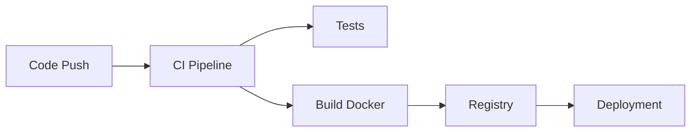

# CI/CD Python (intégration & déploiement continus)

## Objectifs pédagogiques
- Comprendre le fonctionnement d’un pipeline CI/CD
- Automatiser les tests et le linting
- Déployer automatiquement une application Python
- Intégrer Docker dans un pipeline

## Contexte
En entreprise, le code n’est jamais déployé manuellement. Tout passe par des pipelines automatisés pour garantir qualité, reproductibilité et rapidité.

## Principe de fonctionnement

🧠 Concept clé — CI (Continuous Integration)  
Valider automatiquement le code (tests, lint).

🧠 Concept clé — CD (Continuous Deployment)  
Déployer automatiquement en production.

💡 Astuce — “Automate everything”

⚠️ Erreur fréquente — déployer manuellement  
→ erreurs humaines

---

## Architecture

| Composant | Rôle | Exemple |
|-----------|------|---------|
| Repo Git | source code | GitHub |
| Pipeline | automatisation | GitHub Actions |
| Runner | exécution jobs | CI runner |
| Registry | stockage image | Docker Hub |



---

## Commandes essentielles

### Exemple GitHub Actions ⭐

```yaml
name: CI

on: [push]

jobs:
  test:
    runs-on: ubuntu-latest

    steps:
      - uses: actions/checkout@v3
      - name: Install deps
        run: pip install -r requirements.txt
      - name: Run tests
        run: pytest
```

---

## Fonctionnement interne

1. Code push sur repo
2. Pipeline déclenché
3. Tests exécutés
4. Build image Docker
5. Déploiement

⚠️ Si tests échouent → pipeline stop

---

## Cas réel en entreprise

Projet backend :

- push code
- tests auto
- build Docker
- deploy serveur

Résultat :
- zéro intervention manuelle
- qualité garantie

---

## Bonnes pratiques

🔧 Toujours tester dans CI  
🔧 Bloquer merge si tests échouent  
🔧 Automatiser build Docker  
🔧 Utiliser variables sécurisées  
🔧 Monitorer les pipelines  
🔧 Garder pipelines rapides  

---

## Résumé

CI/CD permet :
- automatisation
- fiabilité
- rapidité

Phrase clé : **Un bon pipeline remplace les erreurs humaines.**

---

## SNIPPETS DE RÉVISION

<!-- snippet
id: cicd_pipeline_definition
tech: cicd
level: advanced
importance: high
format: knowledge
tags: cicd,automation
title: Pipeline CI/CD
content: Un pipeline automatise tests, build et déploiement du code
description: base DevOps
-->

<!-- snippet
id: cicd_tests_block
tech: cicd
level: advanced
importance: high
format: knowledge
tags: cicd,tests
title: Tests bloquent pipeline
content: Si les tests échouent, le pipeline s’arrête automatiquement
description: sécurité qualité
-->

<!-- snippet
id: cicd_manual_warning
tech: cicd
level: advanced
importance: high
format: knowledge
tags: cicd,error
title: Déploiement manuel
content: déployer à la main → erreurs → automatiser via CI/CD
description: anti-pattern
-->

