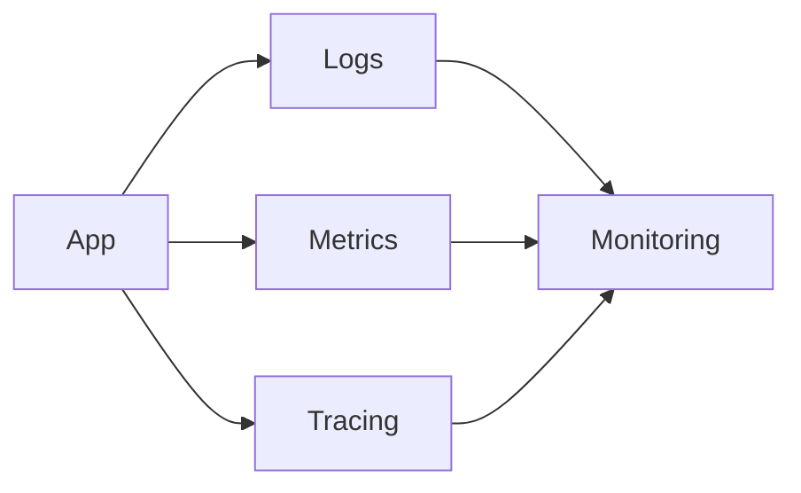

# Observabilité avancée en Python (metrics, tracing, monitoring)

## Objectifs pédagogiques
- Comprendre les trois piliers de l’observabilité (logs, metrics, traces)
- Instrumenter une application Python avec des métriques
- Comprendre le tracing distribué
- Diagnostiquer un incident en production

## Définition

L’observabilité est la capacité à comprendre l’état interne d’un système à partir de ses sorties.

## Pourquoi ce concept existe

Sans observabilité :
- impossible de comprendre un bug en prod
- impossible d’anticiper un problème

Avec observabilité :
- détection rapide
- analyse précise
- amélioration continue

---

## Fonctionnement

🧠 Concept clé — Metrics  
Mesures numériques (CPU, latence, erreurs)

🧠 Concept clé — Tracing  
Suivi d’une requête à travers plusieurs services

🧠 Concept clé — Logs  
Événements détaillés

💡 Astuce — logs ≠ metrics ≠ traces → complémentaires

⚠️ Erreur fréquente — n'utiliser que les logs

---

## Architecture

| Élément | Rôle | Exemple |
|---------|------|--------|
| App | génère données | FastAPI |
| Metrics | collecte | Prometheus |
| Logs | stockage | Loki |
| Traces | analyse | Jaeger |

---

## Cas réel

Incident production :

- API lente
- analyse metrics → latence élevée
- tracing → endpoint lent
- logs → erreur DB

Résultat :
- problème identifié rapidement

---

## Bonnes pratiques

🔧 Toujours instrumenter metrics  
🔧 Centraliser les logs  
🔧 Utiliser tracing distribué  
🔧 Monitorer les seuils critiques  
🔧 Mettre en place alerting  
🔧 Corréler logs + metrics  

---

## Résumé

Observabilité = logs + metrics + traces

Phrase clé : **Ce que tu ne mesures pas, tu ne peux pas le corriger.**

---

## SNIPPETS DE RÉVISION

<!-- snippet
id: observability_three_pillars
type: concept
tech: python
level: advanced
importance: high
format: knowledge
tags: observability,metrics,tracing
title: Trois piliers observabilité
content: logs, metrics et traces permettent de comprendre un système
description: base monitoring
-->

<!-- snippet
id: observability_metrics
type: concept
tech: python
level: advanced
importance: high
format: knowledge
tags: observability,metrics
title: Metrics
content: les metrics mesurent les performances (latence, erreurs, CPU)
description: surveillance système
-->

<!-- snippet
id: observability_logs_only_warning
type: warning
tech: python
level: advanced
importance: high
format: knowledge
tags: observability,error
title: Logs seuls insuffisants
content: utiliser uniquement logs → visibilité limitée → ajouter metrics et traces
description: piège fréquent
-->

