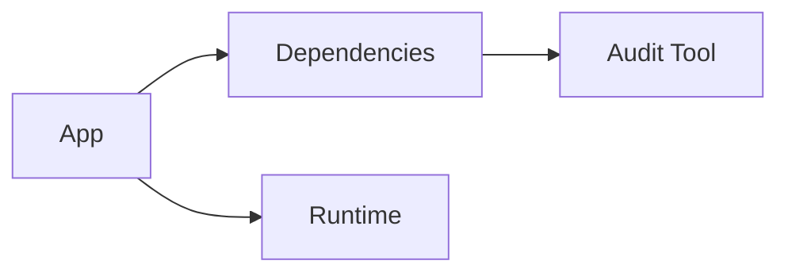

# Sécurité avancée Python (audit, dépendances, hardening)

## Objectifs pédagogiques
- Auditer les dépendances Python
- Identifier les vulnérabilités critiques
- Appliquer des pratiques de hardening
- Sécuriser un environnement d'exécution

## Définition

La sécurité avancée consiste à anticiper, détecter et corriger les vulnérabilités dans une application et son environnement.

## Pourquoi ce concept existe

Même si ton code est propre :
- dépendances vulnérables
- mauvaise config
- exposition réseau

👉 peuvent compromettre ton système

---

## Fonctionnement

🧠 Concept clé — Audit dépendances  
Vérifier les vulnérabilités des librairies utilisées

🧠 Concept clé — Hardening  
Réduction de la surface d’attaque

💡 Astuce — sécuriser aussi l’environnement, pas seulement le code

⚠️ Erreur fréquente — faire confiance aux librairies

---

## Architecture

| Élément | Rôle | Exemple |
|---------|------|--------|
| Code | logique | app.py |
| Dépendances | libs | requests |
| Environnement | OS/runtime | Docker |
| Audit tools | sécurité | pip-audit |



---

## Syntaxe ou utilisation

### Audit dépendances ⭐

```bash
pip install pip-audit
pip-audit
```

Résultat : liste des vulnérabilités connues

---

### Vérification dépendances

```bash
pip list
```

---

## Cas réel

Projet SaaS :

- audit CI
- détection faille
- upgrade dépendance

Résultat :
- vulnérabilité corrigée avant prod

---

## Bonnes pratiques

🔧 Scanner régulièrement les dépendances  
🔧 Mettre à jour les librairies  
🔧 Limiter les permissions  
🔧 Isoler les environnements  
🔧 Utiliser des images Docker sécurisées  
🔧 Ne jamais exposer secrets  

---

## Résumé

Sécurité avancée = audit + hardening + vigilance

Phrase clé : **La sécurité est un processus continu, pas une étape.**

---

## SNIPPETS DE RÉVISION

<!-- snippet
id: python_pip_audit
type: command
tech: python
level: advanced
importance: high
format: knowledge
tags: python,security
title: Audit dépendances
command: pip-audit
description: détecte vulnérabilités dans les librairies
-->

<!-- snippet
id: python_dependency_security
type: concept
tech: python
level: advanced
importance: high
format: knowledge
tags: python,security
title: Dépendances vulnérables
content: une librairie peut contenir des failles même si ton code est propre
description: risque majeur
-->

<!-- snippet
id: python_security_warning
type: warning
tech: python
level: advanced
importance: high
format: knowledge
tags: python,security,error
title: Faire confiance aux libs
content: dépendances non auditées → faille → scanner régulièrement
description: piège critique
-->

