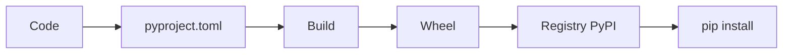
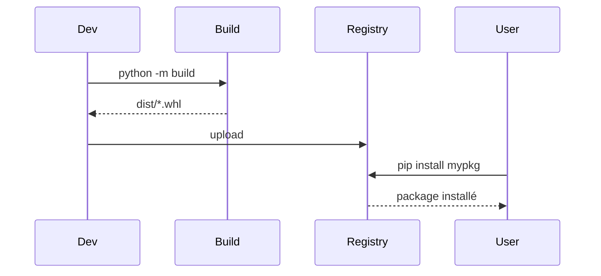

# Packaging avancé & distribution Python (wheels, CLI, publication)

## Objectifs pédagogiques
- Comprendre les formats de distribution Python (sdist, wheel)
- Construire un package avec pyproject.toml
- Créer un outil CLI distribuable
- Publier un package (privé/public) de manière sécurisée

## Définition

Le packaging consiste à transformer ton code en artefact installable et réutilisable (package Python), versionné et distribuable.

## Pourquoi ce concept existe

Sans packaging :
- code non réutilisable
- installation manuelle
- dépendances non maîtrisées

Avec packaging :
- distribution simple (pip install)
- versioning clair
- intégration CI/CD

---

## Fonctionnement

🧠 Concept clé — Wheel (.whl) ⭐  
Format binaire standard pour distribuer un package Python.

🧠 Concept clé — pyproject.toml ⭐  
Fichier de configuration moderne pour définir le build et les dépendances.

💡 Astuce — privilégier wheels pour des installations rapides

⚠️ Erreur fréquente — packaging incomplet  
→ install cassée chez les utilisateurs

---

## Architecture

| Élément | Rôle | Exemple |
|---------|------|--------|
| Code | source | mypkg/ |
| pyproject.toml | config build | metadata |
| Dist | artefacts | .whl / .tar.gz |
| Index | distribution | PyPI / privé |



---

## Syntaxe ou utilisation

### Structure projet ⭐

```
mypkg/
├── pyproject.toml
├── README.md
├── src/
│   └── mypkg/
│       ├── __init__.py
│       └── cli.py
```

---

### pyproject.toml (extrait minimal)

```toml
[build-system]
requires = ["setuptools", "wheel"]
build-backend = "setuptools.build_meta"

[project]
name = "mypkg"
version = "0.1.0"
dependencies = ["requests"]
```

---

### Build package ⭐

```bash
python -m build
```

Résultat : génération des fichiers `dist/*.whl` et `dist/*.tar.gz`.

---

### Installer localement

```bash
pip install dist/mypkg-0.1.0-py3-none-any.whl
```

---

### CLI avec entry points ⭐

```toml
[project.scripts]
mypkg = "mypkg.cli:main"
```

```python
# src/mypkg/cli.py
def main():
    print("Hello CLI")
```

Exécution :
```bash
mypkg
```

---

## Workflow du système

1. Écrire le code (src/)
2. Définir metadata (pyproject.toml)
3. Build (wheel + sdist)
4. Publier (registry)
5. Installer via pip



En cas d’erreur :
- dépendances manquantes → échec installation
- metadata incorrecte → package inutilisable

---

## Cas réel

Outil interne DevOps :

- CLI `infra-tool`
- appels API cloud
- distribué via registre privé

Résultat :
- installation simple (`pip install infra-tool`)
- versioning contrôlé
- usage standardisé dans l’équipe

---

## Bonnes pratiques

🔧 Utiliser pyproject.toml (standard moderne)  
🔧 Fournir un README clair  
🔧 Gérer le versioning (semver)  
🔧 Tester l’installation en environnement propre  
🔧 Éviter les dépendances inutiles  
🔧 Publier des wheels (install rapide)  
🔧 Sécuriser la publication (tokens, scopes)  

---

## Résumé

| Concept | Définition courte | À retenir |
|--------|------------------|----------|
| wheel | package binaire | rapide à installer |
| pyproject | config build | standard moderne |
| entry points | CLI | distribution d’outils |

Étapes :
- structurer
- configurer
- builder
- publier
- installer

Phrase clé : **Un bon package transforme ton code en produit réutilisable.**

---

## SNIPPETS DE RÉVISION

<!-- snippet
id: python_build_package
type: command
tech: python
level: advanced
importance: high
format: knowledge
tags: python,packaging
title: Build package Python
command: python -m build
description: Génère les artefacts wheel et sdist dans dist/
-->

<!-- snippet
id: python_wheel_definition
type: concept
tech: python
level: advanced
importance: high
format: knowledge
tags: python,wheel
title: Wheel Python
content: Un wheel est un format binaire de distribution Python optimisé pour l'installation
description: Standard de distribution
-->

<!-- snippet
id: python_entrypoints_cli
type: concept
tech: python
level: advanced
importance: high
format: knowledge
tags: python,cli,packaging
title: Entry points CLI
content: Les entry points permettent d'exposer une commande CLI installable via pip
description: Créer des outils distribuables
-->

<!-- snippet
id: python_packaging_warning
type: warning
tech: python
level: advanced
importance: high
format: knowledge
tags: python,packaging,error
title: Packaging incomplet
content: metadata ou deps manquantes → install cassée → tester en env propre
description: Piège critique
-->

<!-- snippet
id: python_versioning_tip
type: tip
tech: python
level: advanced
importance: medium
format: knowledge
tags: python,versioning
title: Versioning semver
content: SemVer (1.2.3) encode un contrat de compatibilité : PATCH = correction de bug (rétrocompatible), MINOR = nouvelle fonctionnalité (rétrocompatible), MAJOR = changement cassant. Sans ce signal, les utilisateurs de la lib ne savent pas si une mise à jour est risquée.
description: Une dépendance en `~=1.2` (compatible release) accepte 1.2.x mais pas 1.3.0 — safe pour les patches, bloquant pour les nouvelles features.
-->
