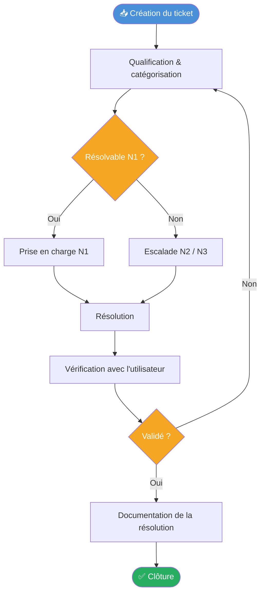

# Comprendre le rôle du support applicatif

## Objectifs pédagogiques

À la fin de ce module, tu seras capable de :

1. **Distinguer** les niveaux de support N1, N2 et N3 et identifier à quel niveau tu opères selon la situation
2. **Différencier** un incident, un problème et une demande au sens ITIL du terme
3. **Décrire** le cycle de vie d'un ticket de sa création à sa clôture
4. **Expliquer** ce qu'est un SLA et pourquoi la priorisation repose sur l'impact métier réel, pas sur l'urgence ressentie
5. **Reconnaître** la différence entre une application métier et une application technique, et ce que ça change pour la gestion des incidents

---

## Mise en situation

Il est 9h15. Tu arrives au bureau. Tu ouvres ton outil de ticketing et tu vois ça :

> *"L'appli de facturation ne fonctionne plus. On ne peut pas créer de bons de commande. Urgent."*
> — Mathilde, responsable ADV

Et juste en dessous :

> *"Besoin d'un accès à l'environnement de recette pour tester les nouvelles fonctionnalités."*
> — Karim, chef de projet

Ces deux messages arrivent en même temps. L'un bloque toute une équipe. L'autre est une simple demande de configuration. Comment tu traites ça ? Dans quel ordre ? Et si tu ne peux pas résoudre toi-même, qui tu appelles — et avec quoi dans les mains ?

Ce module pose les bases pour répondre à ces questions. Pas avec des formules abstraites : avec un cadre concret que tu utiliseras dès ta première semaine.

---

## Ce que c'est — et pourquoi ça existe

Le **support applicatif**, c'est l'ensemble des activités qui permettent de maintenir les applications métiers en état de fonctionner, et d'accompagner les utilisateurs quand quelque chose ne va pas.

Ce n'est pas simplement "répondre aux tickets". C'est un métier structuré, avec des niveaux de compétences, des engagements contractuels, et des processus précis pour ne pas confondre un symptôme avec une cause profonde.

Pourquoi a-t-on eu besoin d'organiser tout ça ? Parce que sans structure, les mêmes problèmes reviennent indéfiniment, les crises se gèrent dans la panique, et personne ne sait vraiment qui est responsable de quoi. Le cadre **ITIL** (*Information Technology Infrastructure Library*) a émergé exactement pour répondre à ce désordre. Ce n'est pas un logiciel ni une certification obligatoire — c'est un vocabulaire commun et des processus éprouvés que la majorité des équipes IT utilisent pour se coordonner.

> 🧠 Quand tu entends "incident", "problème" ou "SLA" dans une équipe IT, c'est ITIL qui parle. Maîtriser ce vocabulaire, c'est pouvoir travailler avec n'importe quelle équipe sans réapprendre les bases à chaque fois.

---

## Application métier vs application technique

Avant d'aller plus loin, clarifions une distinction que tu croiseras constamment.

Une **application métier** sert directement un processus de l'entreprise : la facturation, la gestion des stocks, la prise de commande, la paie. Quand elle tombe, c'est un utilisateur — souvent non-technique — qui est bloqué dans son travail. L'impact est immédiatement visible et chiffrable : commandes non traitées, clients mécontents, chiffre d'affaires en pause.

Une **application technique** soutient l'infrastructure : un serveur de logs, un outil de supervision, une base de données, un service d'authentification. Les utilisateurs directs sont des techniciens — et souvent, personne ne crie.

C'est justement là que se cache le piège.

> ⚠️ Un serveur DNS en panne peut rendre inaccessibles toutes les applications métiers de l'entreprise en quelques minutes. L'impact indirect d'une application technique peut dépasser celui d'une application métier — sans qu'aucun utilisateur final ne soit là pour le signaler.

<!-- snippet
id: support_appli_metier_vs_technique
type: concept
tech: support applicatif
level: beginner
importance: medium
format: knowledge
tags: application,métier,technique,impact,priorisation
title: Application métier vs application technique — impact différent
content: Application métier = sert un processus business directement (facturation, stocks, paie) — l'utilisateur final est non-technique, l'impact d'une panne est immédiatement visible et chiffrable. Application technique = soutient l'infra (monitoring, DNS, auth) — l'impact est indirect mais peut être systémique : un DNS en panne rend inaccessibles toutes les applis métier en quelques minutes.
description: Les applis techniques en panne n'ont pas d'utilisateur qui crie — mais leur impact peut dépasser celui d'une appli métier.
-->

---

## Les niveaux de support : N1, N2, N3

Imagine un entonnoir. La majorité des demandes entrent par le haut — elles sont fréquentes, connues, résolvables rapidement. Les cas les plus complexes descendent vers des spécialistes. C'est ça, les niveaux de support.

| Niveau | Profil | Périmètre | Exemple concret |
|--------|--------|-----------|-----------------|
| **N1** | Technicien généraliste | Prise en charge initiale, diagnostic de surface, résolution des cas courants | Réinitialisation de mot de passe, redémarrage d'un service, vérification d'un accès |
| **N2** | Technicien applicatif / admin | Analyse approfondie, reproduction du bug, escalade avec contexte complet | Analyse de logs, test en environnement de recette, configuration applicative |
| **N3** | Éditeur / développeur / expert infra | Correction de code, patch, intervention en production profonde | Correctif applicatif, modification de base de données, hotfix |

Ce que ce découpage résout concrètement : sans niveaux définis, chaque ticket remonte directement aux développeurs. Résultat — ils passent leur journée à répondre à des questions de base au lieu de corriger des bugs réels. Les niveaux protègent les experts pour qu'ils puissent faire leur travail.

> 💡 En tant que N1/N2 débutant, ton rôle n'est pas de tout résoudre seul. C'est de **qualifier correctement le problème** avant d'escalader. Une escalade avec logs, étapes de reproduction, environnement et heure d'apparition vaut dix fois une escalade "ça marche pas".

<!-- snippet
id: support_niveaux_distinction
type: concept
tech: support applicatif
level: beginner
importance: high
format: knowledge
tags: support,itil,escalade,niveaux,n1-n2-n3
title: Niveaux de support N1 / N2 / N3 — qui fait quoi
content: N1 = prise en charge initiale et résolution des cas courants (reset MDP, redémarrage service). N2 = analyse approfondie, logs, reproduction, configuration applicative. N3 = intervention en profondeur : correctif de code, patch éditeur, modification base de données. La frontière clé : N1 restaure vite, N2 qualifie et analyse, N3 corrige la cause.
description: L'escalade vers N2/N3 est attendue — ce qui compte c'est d'escalader avec le contexte complet (logs, heure, environnement, étapes de reproduction).
-->

<!-- snippet
id: support_escalade_bonne_pratique
type: tip
tech: support applicatif
level: beginner
importance: high
format: knowledge
tags: escalade,ticketing,contexte,n2,documentation
title: Escalader avec contexte — ce qu'il faut transmettre
content: Avant d'escalader, inclure dans le ticket : heure d'apparition du problème, message d'erreur exact ou extrait de log, environnement concerné (prod/recette/dev), nombre d'utilisateurs impactés, étapes pour reproduire si possible, actions déjà tentées. Une escalade sans ce contexte force le N2/N3 à repartir de zéro et double le temps de résolution.
description: La qualité d'une escalade se mesure au temps que le N3 perd à te reposer des questions de base — idéalement zéro.
-->

---

## Incident, problème, demande — trois mots, trois réalités

C'est là que beaucoup de débutants trébuchent. Et c'est pourtant fondamental, parce que la confusion entre ces trois concepts entraîne directement une mauvaise priorisation.

**Un incident**, c'est une interruption non planifiée ou une dégradation d'un service. La priorité absolue : restaurer le service le plus vite possible. On ne cherche pas encore pourquoi c'est arrivé — on répare d'abord.

> *L'appli de facturation est inaccessible depuis 9h05 → c'est un incident.*

**Un problème**, c'est la cause racine sous-jacente à un ou plusieurs incidents. On l'analyse après que le feu est éteint, pour éviter qu'il se rallume.

> *L'appli de facturation tombe tous les lundis matin → c'est un problème. Cause : un job de maintenance mal configuré qui bloque les connexions pendant 20 minutes.*

**Une demande de service**, c'est une sollicitation prévisible, sans urgence de restauration : créer un compte, ouvrir un accès, commander un équipement.

> *Karim veut un accès à l'environnement de recette → c'est une demande.*

```
Incident  →  Restaurer vite  →  Analyser la cause après
Problème  →  Analyser la cause  →  Éviter la récurrence
Demande   →  Traiter selon le catalogue  →  Pas d'urgence par défaut
```

La distinction détermine **comment tu priorises**, **qui tu impliques** et **comment tu documentes**. Un incident récurrent qui n'est jamais analysé en tant que problème reviendra indéfiniment — et chaque occurrence coûte du temps, de l'énergie, et de la crédibilité au support.

<!-- snippet
id: support_itil_incident_vs_probleme
type: concept
tech: itil
level: beginner
importance: high
format: knowledge
tags: itil,incident,problème,demande,priorisation
title: Incident vs Problème vs Demande — la différence ITIL
content: Incident = interruption active → objectif : restaurer le service le plus vite possible. Problème = cause racine d'un ou plusieurs incidents → objectif : éviter la récurrence. Demande = sollicitation prévisible sans urgence de restauration (accès, compte, matériel). Confondre les trois entraîne une mauvaise priorisation et des récurrences non traitées.
description: Un incident récurrent qui n'est jamais analysé devient un problème non résolu. La distinction détermine qui traite et comment.
-->

---

## Le cycle de vie d'un ticket

Chaque interaction avec un utilisateur génère un ticket. Entre l'ouverture et la clôture, il passe par plusieurs étapes — et chacune a son importance.



Trois étapes concentrent la majorité des erreurs de débutants :

**La qualification** n'est pas une formalité administrative. Mal catégoriser un ticket, c'est le voir atterrir dans la mauvaise équipe et perdre deux heures avant même qu'il soit regardé. C'est l'étape où tu décides incident, problème ou demande — et où tu fixes la priorité.

**La vérification avec l'utilisateur** évite les clôtures fantômes. Le technicien déclare "résolu", le service redémarre, mais l'utilisateur se retrouve avec le même problème trois jours plus tard et ouvre un nouveau ticket — sans lien avec le premier dans le système.

**La documentation de la résolution** alimente la base de connaissances. C'est ce qui fait qu'un problème résolu une fois n'a pas besoin d'être rediagnostiqué la prochaine fois — par toi, ou par un collègue qui arrive le lundi matin.

<!-- snippet
id: support_cycle_ticket_etapes
type: concept
tech: ticketing
level: beginner
importance: medium
format: knowledge
tags: ticket,cycle-de-vie,ticketing,itil,qualification
title: Cycle de vie d'un ticket — les étapes clés
content: 1. Création → 2. Qualification (catégorie, priorité, impact) → 3. Prise en charge N1 ou escalade N2/N3 → 4. Résolution → 5. Validation utilisateur → 6. Documentation → 7. Clôture. La qualification (étape 2) est critique : une mauvaise catégorie envoie le ticket dans la mauvaise équipe et coûte plusieurs heures. La validation (étape 5) évite les clôtures fantômes.
description: Un ticket mal qualifié dès l'ouverture peut facilement doubler son délai de résolution avant même d'être traité.
-->

<!-- snippet
id: support_cloture_validation
type: warning
tech: support applicatif
level: beginner
importance: medium
format: knowledge
tags: ticketing,clôture,validation,utilisateur
title: Ne jamais clôturer sans validation utilisateur
content: Piège : clôturer un ticket dès que le service technique redémarre. Conséquence : l'utilisateur a toujours son problème (données corrompues, contournement partiel, erreur différente), et ouvre un nouveau ticket 24h après — sans lien avec le premier. Correction : toujours confirmer avec l'utilisateur que son besoin est satisfait avant de clôturer, même sur un P4.
description: Un service qui redémarre n'est pas un problème résolu. L'utilisateur est le seul juge valide de la résolution.
-->

<!-- snippet
id: support_documentation_resolution
type: tip
tech: support applicatif
level: beginner
importance: medium
format: knowledge
tags: documentation,ticketing,base-de-connaissances,récurrence
title: Documenter la résolution dans chaque ticket
content: À la clôture, noter dans le ticket : cause identifiée (ex : certificat SSL expiré), action corrective appliquée (ex : renouvellement + redémarrage service), et si pertinent, le ticket Problème ouvert pour éviter la récurrence. Cette documentation alimente la base de connaissances et peut diviser par 3 le temps de résolution si le même incident se reproduit.
description: 10 minutes de documentation à la clôture peuvent éviter 2h de diagnostic lors de la prochaine occurrence.
-->

---

## SLA et priorisation : ce qui est derrière les délais

Un **SLA** (Service Level Agreement) est un engagement de niveau de service. Dans le contexte du support, il définit les délais maximaux de prise en charge et de résolution selon la priorité d'un ticket.

Ce qui détermine la priorité, ce n'est pas le degré d'énervement de l'utilisateur. C'est la combinaison de deux axes : l'**impact** (combien de personnes ou de processus sont bloqués ?) et l'**urgence** (à quel point le temps est-il critique ?).

| Priorité | Impact | Urgence | Prise en charge | Résolution |
|----------|--------|---------|-----------------|------------|
| **P1 — Critique** | Bloquant pour toute l'entreprise | Immédiate | 15 min | 4h |
| **P2 — Haute** | Bloquant pour une équipe | Forte | 1h | 8h |
| **P3 — Normale** | Dégradation sans blocage total | Modérée | 4h | 24h |
| **P4 — Faible** | Gêne mineure ou cosmétique | Faible | 8h | 72h |

> 💡 Un utilisateur qui dit "c'est urgent" ne déclare pas automatiquement un P1. Les bonnes questions à poser : combien de personnes sont bloquées ? Y a-t-il un contournement possible ? Un processus financier ou légal est-il impacté ? C'est ça qui fait la priorité réelle — pas l'intensité du message.

Une dernière nuance importante : le SLA mesure le **respect des délais**, pas la qualité de la résolution. Un ticket clôturé en 30 minutes avec une mauvaise solution et un ticket résolu en 3 heures avec une vraie correction sont deux métriques différentes. L'un satisfait le tableau de bord, l'autre satisfait l'utilisateur.

<!-- snippet
id: support_sla_priorite_calcul
type: concept
tech: itil
level: beginner
importance: high
format: knowledge
tags: sla,priorité,impact,urgence,ticketing
title: Priorité SLA — impact × urgence, pas urgence perçue
content: La priorité se calcule avec deux axes : impact (combien de personnes/processus sont bloqués ?) et urgence (le temps est-il critique ?). P1 = impact total + urgence immédiate → prise en charge 15 min, résolution 4h. P4 = gêne mineure → 8h/72h. Un utilisateur stressé ne détermine pas la priorité — l'impact métier réel oui.
description: Qualifier objectivement la priorité protège les P1 vrais d'être noyés dans des faux P1 émotionnels.
-->

---

## Cas réel : une matinée au support applicatif

Voici comment tous ces concepts s'articulent dans la vraie vie. Situation typique d'un N1/N2 dans une entreprise avec un ERP de gestion commerciale.

**8h47** — Trois tickets arrivent en dix minutes. Le module de facturation renvoie une erreur 500 pour tous les utilisateurs. Impact total sur une fonction critique : c'est un **incident P1**.

**8h52** — Tu prends en charge le ticket. Tu le catégorises correctement — incident / application facturation / erreur serveur — et tu informes Mathilde que tu es dessus. Pas de solution encore, mais elle sait que c'est pris en charge. C'est déjà important.

**8h55** — Tu consultes les logs applicatifs. Une exception Java indique que la connexion à la base de données est refusée. Ce n'est pas résolvable à ton niveau — tu n'as pas les accès prod DB. Tu escalades au N3 avec le contexte complet : heure de début, extrait de log exact, service impacté, nombre d'utilisateurs bloqués, actions déjà tentées.

**9h20** — Le N3 identifie qu'un certificat SSL entre l'application et la base de données a expiré pendant la nuit. Renouvellement du certificat, redémarrage du service.

**9h25** — Tu vérifies avec Mathilde que la facturation fonctionne. Elle confirme. Tu documentes dans le ticket : cause (expiration certificat SSL), action corrective (renouvellement + redémarrage). Clôture.

**Plus tard dans la journée** — L'équipe ouvre un **ticket Problème** : pourquoi cette expiration n'a-t-elle pas été détectée à l'avance ? Résultat : une alerte automatique est mise en place 30 jours avant chaque expiration de certificat.

Incident résolu → cause identifiée → récurrence évitée. C'est le cycle complet, tel qu'il fonctionne dans une équipe qui travaille bien.

---

## Bonnes pratiques

**Qualifier objectivement, pas émotionnellement.** Un utilisateur stressé peut sur-qualifier son incident. Ton rôle est d'évaluer l'impact réel, pas de valider le niveau d'urgence ressenti. Ça protège les vrais P1 d'être noyés dans les faux P1.

**Documenter au fil de l'eau, pas à la fin.** Sur un ticket complexe, prends des notes directement dans le ticket à chaque étape. Si tu dois passer la main en milieu de traitement, ton remplaçant ne repart pas de zéro.

**L'escalade avec contexte est une compétence, pas un aveu d'échec.** Ce qui nuit au support, ce n'est pas d'escalader — c'est d'escalader sans contexte, ou d'attendre trop longtemps avant de le faire. Un N3 qui perd 30 minutes à reconstituer ce que tu sais déjà, c'est du temps de résolution perdu.

**Valider la clôture avec l'utilisateur, systématiquement.** Un service qui redémarre n'est pas un problème résolu. L'utilisateur est le seul juge valide. Cette étape prend deux minutes et évite les tickets fantômes.

**Ne pas sous-estimer les petits tickets.** Une demande P4 non traitée depuis cinq jours laisse une mauvaise impression du support, même si techniquement le SLA ne l'exige pas encore. La réactivité sur les petits sujets construit la confiance qui rend les grandes crises plus gérables.

**Distinguer résolution et contournement.** Parfois, la bonne décision c'est de remettre le service en état par un contournement (relancer un processus, basculer sur un environnement de secours), puis d'analyser la vraie cause dans un second temps. C'est valide — à condition de l'indiquer clairement dans le ticket et d'ouvrir un ticket Problème derrière.

---

## Résumé

Le support applicatif, c'est un métier de **qualification et de coordination** autant que de résolution technique. Les trois niveaux de support structurent qui fait quoi — et l'efficacité à N1/N2 repose davantage sur la capacité à qualifier vite et à escalader avec du contexte que sur la volonté de tout résoudre seul.

Les trois concepts ITIL à avoir en tête en permanence : **incident** (quelque chose est cassé, restaure vite), **problème** (cherche la cause pour éviter la récurrence), **demande** (traite sans urgence selon le catalogue). Confondre les trois, c'est mal prioriser — et mal prioriser, c'est laisser brûler ce qu'il fallait éteindre en premier.

Les SLA définissent les délais, mais la vraie priorité vient de l'impact métier réel, pas de l'urgence perçue. Et chaque ticket correctement documenté est un investissement pour toute l'équipe : moins de récurrences, moins de temps perdu à rediagnostiquer ce qui a déjà été résolu.

La suite logique : comprendre l'environnement concret dans lequel tu travailles — les outils de ticketing, les environnements prod/preprod, et les accès distants.
