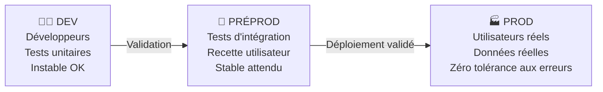

# Environnement de travail & outils support

## Objectifs pédagogiques

À l'issue de ce module, vous serez capable de :

1. **Identifier** les outils de ticketing courants et comprendre leur rôle dans le flux de support
2. **Distinguer** les environnements prod, préprod et dev, et savoir lequel utiliser selon la situation
3. **Utiliser** les outils d'accès distant (RDP, SSH, VPN) pour intervenir sur un système à distance
4. **Lire** des logs simples et interpréter un dashboard de monitoring basique
5. **Appliquer** les principes de gestion des droits et accès sans mettre en danger la production

---

## Mise en situation

Vous venez de rejoindre l'équipe support applicatif d'une PME de 200 personnes. Dès le premier jour, un utilisateur appelle : l'application de gestion des commandes affiche une erreur depuis ce matin. Votre responsable vous dit "ouvre un ticket et jette un œil aux logs".

Vous vous retrouvez devant trois outils ouverts dans votre navigateur, un VPN qui demande des identifiants, et un accès SSH vers un serveur dont vous ne connaissez pas encore l'adresse.

C'est exactement le contexte de ce module. Avant de résoudre des incidents, il faut comprendre dans quel environnement vous évoluez, avec quels outils, et surtout — pourquoi ces outils existent. La réponse naïve ("j'interviens directement en production et je règle le problème") est la plus courante chez les débutants. C'est aussi la plus dangereuse.

---

## Les outils de ticketing : pourquoi on ne règle pas tout par e-mail

Imaginez une équipe support sans outil de ticketing. Les demandes arrivent par e-mail, par Teams, par téléphone, parfois à voix haute dans l'open space. Résultat : des incidents oubliés, des doublons traités deux fois, aucune trace de ce qui a été fait. En cas d'audit, vous n'avez rien.

Un outil de ticketing centralise toutes les demandes dans un système unique et traçable. Chaque incident a un numéro, un statut, un responsable, un historique. Ça peut sembler bureaucratique au début — mais c'est ce qui permet à une équipe de 5 personnes de gérer 200 utilisateurs sans se marcher dessus.

### Les trois outils que vous croiserez le plus souvent

**GLPI** est très répandu dans les PME et les administrations françaises. C'est un outil open source, souvent hébergé en interne. Son interface n'est pas la plus moderne, mais il fait très bien le travail : gestion des tickets, inventaire du parc, base de connaissances. Budget serré, service IT interne — il y a de bonnes chances que vous tombiez sur GLPI.

**ServiceNow** est l'outil des grandes entreprises. Interface soignée, workflows complexes, intégration avec des dizaines de systèmes tiers. En tant que technicien débutant, vous l'utiliserez plus que vous ne le configurerez — l'essentiel est de savoir naviguer dans les files de tickets et renseigner les bons champs.

**Jira Service Management** est souvent choisi dans les équipes qui font aussi du développement, car Jira est déjà l'outil de gestion de projet des devs. L'intégration entre tickets support et tickets de développement est son principal atout.

| Fonctionnalité | GLPI | ServiceNow | Jira SM |
|---|---|---|---|
| Cible | PME / Admin | Grandes entreprises | Tech / Dev |
| Licence | Open source | Payant (SaaS) | Payant (SaaS/Cloud) |
| Courbe d'apprentissage | Modérée | Élevée | Modérée |
| Inventaire parc | ✅ Natif | Via plugins | ❌ Limité |
| Intégration Dev | ❌ | Partielle | ✅ Native avec Jira |

💡 Quelle que soit la solution utilisée, les concepts sont les mêmes : un ticket a toujours un statut (ouvert, en cours, résolu, clôturé), une priorité, et un assigné. Apprenez ces concepts une fois, vous vous adapterez à n'importe quel outil en moins d'une journée.

### Ce qu'un bon ticket contient

Un ticket mal renseigné, c'est du temps perdu pour tout le monde. Quand vous créez ou prenez en charge un ticket, vérifiez qu'il contient :

- **Qui** est impacté — un seul utilisateur ou un service entier ?
- **Quoi** exactement — message d'erreur exact, capture d'écran si possible
- **Depuis quand** — la temporalité est souvent clé pour corréler avec un changement récent
- **Impact métier** — peut-on continuer à travailler ou tout est bloqué ?

⚠️ L'erreur classique du débutant : fermer un ticket sans documenter la solution. Même si c'était une correction rapide, notez ce que vous avez fait. Dans six mois, vous ou un collègue retrouvera ce ticket comme référence. Un ticket sans résolution documentée est un ticket inutile.

<!-- snippet
id: support_ticket_contenu
type: concept
tech: glpi
level: beginner
importance: high
format: knowledge
tags: ticketing,incident,glpi,documentation,support
title: Contenu minimal d'un ticket d'incident
content: Un ticket exploitable doit contenir : QUI est impacté (1 user ou service entier), QUOI exactement (message d'erreur exact), DEPUIS QUAND (timestamp), et IMPACT MÉTIER (bloquant ou non). Sans ces 4 éléments, le technicien suivant perd du temps à reconstruire le contexte.
description: Les 4 informations indispensables dans tout ticket — leur absence rallonge le délai de résolution et rend l'escalade impossible.
-->

<!-- snippet
id: support_ticket_sans_resolution
type: warning
tech: glpi
level: beginner
importance: medium
format: knowledge
tags: ticketing,documentation,cloture,traçabilite
title: Fermer un ticket sans documenter la solution
content: Piège : clôturer rapidement un ticket sans noter la cause et la correction appliquée. Conséquence : lors d'un incident identique 6 mois plus tard, l'équipe repart de zéro. Correction : avant toute clôture, ajouter un commentaire "Cause : X — Solution : Y — Vérifié le Z".
description: Un ticket sans résolution documentée perd toute valeur de base de connaissance — la même résolution devra être retrouvée à partir de zéro.
-->

---

## Prod, préprod, dev : la règle d'or que tout débutant doit graver

C'est probablement la notion la plus importante de ce module, et celle qui cause le plus de dégâts quand elle est mal comprise.

Dans toute entreprise qui a un minimum de maturité technique, les applications tournent sur plusieurs environnements distincts :



**L'environnement de développement** est le terrain de jeu des développeurs. Il peut planter, être incohérent, contenir du code non testé. Vous n'interviendrez presque jamais ici en tant que technicien support.

**La préprod** (aussi appelée staging ou recette) est une copie quasi-identique de la production. C'est ici qu'on teste les nouvelles versions avant de les déployer. Si vous devez reproduire un bug pour le comprendre, c'est en préprod que vous travaillez — jamais directement en prod si vous pouvez l'éviter.

**La production**, c'est l'environnement réel, avec les vraies données des vrais utilisateurs. Chaque intervention ici est à risque. Une mauvaise manipulation peut affecter des centaines de personnes en quelques secondes.

🧠 La règle d'or : **on ne teste jamais rien directement en production**. Si vous devez vérifier qu'une modification résout un problème, vous le vérifiez en préprod. Vous déployez en prod seulement quand vous êtes sûr. Cette règle existe parce que les effets de bord sont impossibles à prévoir à 100% — même les développeurs expérimentés en font l'expérience.

En pratique, vos accès seront différents selon les environnements. Les accès prod sont généralement plus restreints, journalisés, et parfois soumis à validation. C'est normal et c'est une bonne chose.

<!-- snippet
id: support_env_prod_preprod
type: warning
tech: support-applicatif
level: beginner
importance: high
format: knowledge
tags: production,preprod,environnements,risque,déploiement
title: Ne jamais tester directement en production
content: Piège : intervenir directement en prod pour "aller plus vite". Conséquence : un effet de bord imprévu peut impacter tous les utilisateurs en quelques secondes. Correction : reproduire le problème en préprod, valider la correction là-bas, puis déployer en prod avec un ticket et un accord.
description: La prod contient les données réelles de vrais utilisateurs — chaque action non validée en préprod est un risque d'incident majeur.
-->

---

## Accès distant : VPN, RDP et SSH

Un technicien support applicatif passe une bonne partie de sa journée à intervenir sur des machines qu'il ne voit pas physiquement. Les serveurs sont dans une salle machine, un datacenter externe, ou dans le cloud. L'accès distant est donc une compétence fondamentale — et elle commence toujours par le VPN.

### VPN : la porte d'entrée du réseau

Le VPN (Virtual Private Network) crée un tunnel chiffré entre votre machine et le réseau de l'entreprise, comme si vous étiez physiquement connecté au bureau. Sans VPN actif, vous n'aurez tout simplement pas accès aux serveurs internes.

Les clients courants en entreprise : **Cisco AnyConnect**, **GlobalProtect** (Palo Alto), **OpenVPN**, **Fortinet FortiClient**. L'utilisation est toujours similaire : vous lancez le client, renseignez l'adresse du serveur VPN fournie par votre admin réseau, vous authentifiez (souvent avec un double facteur), et l'accès est établi.

⚠️ Certains VPN d'entreprise routent tout votre trafic internet à travers l'infra de l'entreprise (split tunneling désactivé). Rester connecté hors des heures de travail ralentit votre connexion personnelle et génère des logs réseau inutiles côté entreprise. Prenez l'habitude de vous déconnecter en fin de session.

<!-- snippet
id: support_vpn_deconnexion
type: tip
tech: vpn
level: beginner
importance: low
format: knowledge
tags: vpn,securite,reseau,bonne-pratique
title: Se déconnecter du VPN en fin de session
content: Certains VPN d'entreprise routent tout votre trafic internet (split tunneling désactivé). Rester connecté hors des heures de travail ralentit votre connexion et génère des logs réseau inutiles côté entreprise. Déconnectez-vous systématiquement en fin de journée.
description: Garder le VPN actif après le travail peut router tout votre trafic via l'infra entreprise — impact sur les perfs et sur les logs de sécurité.
-->

### RDP : accès graphique aux serveurs Windows

**RDP** (Remote Desktop Protocol) vous donne accès à l'interface graphique d'une machine Windows distante, comme si vous étiez assis devant. Sur Windows, l'outil natif s'appelle Connexion Bureau à distance, accessible via `mstsc` dans la barre de recherche.

```
mstsc /v:<ADRESSE_IP_OU_HOSTNAME>
```

Vous entrez l'adresse du serveur, vos identifiants, et vous avez accès à un bureau Windows complet. C'est l'outil adapté pour les applications qui n'ont pas d'interface web, ou pour intervenir directement dans une application métier Windows.

Le port utilisé par RDP est le **3389** par défaut. Si votre connexion échoue malgré un VPN actif, c'est souvent ce port qui est bloqué dans les règles de pare-feu.

💡 En RDP, vous pouvez partager le presse-papier entre votre machine locale et la machine distante (option dans les paramètres de connexion). Ça vous évite de ressaisir manuellement des commandes ou des chemins de fichiers — un détail qui fait gagner du temps sur les interventions répétées.

<!-- snippet
id: support_rdp_connexion
type: command
tech: windows
level: beginner
importance: medium
format: knowledge
tags: rdp,acces-distant,windows,mstsc,bureau-distance
title: Ouvrir une connexion Bureau à distance Windows
command: mstsc /v:<ADRESSE_IP_OU_HOSTNAME>
example: mstsc /v:192.168.1.100
description: Lance le client RDP natif Windows vers le serveur cible. Le port 3389 doit être ouvert dans le pare-feu. Partage du presse-papier activable dans les options de connexion.
-->

### SSH : accès en ligne de commande aux serveurs Linux

**SSH** (Secure Shell) est l'équivalent de RDP pour les serveurs Linux — mais en mode ligne de commande uniquement. C'est l'outil quotidien de tout technicien intervenant sur des serveurs Linux.

```bash
ssh <UTILISATEUR>@<ADRESSE_IP>
```

La première connexion à un nouveau serveur affiche une empreinte de clé (fingerprint) et vous demande de confirmer. Tapez `yes` — c'est le mécanisme qui vous protège contre les attaques de type man-in-the-middle pour les connexions suivantes.

En entreprise, on utilise rarement un mot de passe pour SSH. L'authentification se fait par **clé SSH** : vous gardez la clé privée sur votre machine et déposez la clé publique sur le serveur. C'est plus sécurisé et plus pratique — plus besoin de retaper un mot de passe à chaque connexion.

🧠 SSH chiffre intégralement la communication. Contrairement à Telnet (son ancêtre), vos commandes et les réponses du serveur ne transitent pas en clair sur le réseau. Si vous croisez un serveur qui n'accepte que Telnet en 2024, c'est un signal d'alarme de sécurité à remonter immédiatement.

<!-- snippet
id: support_ssh_connexion
type: command
tech: ssh
level: beginner
importance: high
format: knowledge
tags: ssh,acces-distant,linux,terminal,securite
title: Se connecter à un serveur Linux via SSH
command: ssh <UTILISATEUR>@<ADRESSE_IP>
example: ssh admin@192.168.1.50
description: Ouvre une session SSH chiffrée sur le serveur distant. La première connexion demande une confirmation d'empreinte — taper 'yes' pour l'enregistrer.
-->

---

## Lire des logs et surveiller avec un dashboard

Le monitoring et les logs sont vos yeux sur ce qui se passe dans une application. Avant de courir résoudre un incident, prenez deux minutes pour regarder ce que vous disent les logs. Dans la majorité des cas, la cause est écrite en toutes lettres quelque part.

### Anatomie d'une ligne de log

Un log est un enregistrement horodaté d'événements produits par un système ou une application. Chaque ligne suit généralement ce format :

```
[2024-01-15 09:42:17] ERROR  - ConnectionPool timeout: impossible d'atteindre db01.internal:5432
```

Trois informations à extraire immédiatement : la **date et l'heure** (pour corréler avec l'incident déclaré), le **niveau de sévérité** (INFO, WARNING, ERROR, CRITICAL), et le **message** lui-même.

Les logs se trouvent à des endroits différents selon le contexte :

| Contexte | Où chercher |
|---|---|
| Application Windows | `C:\logs\` ou répertoire d'installation, ou Observateur d'événements |
| Application Linux | `/var/log/<nom_appli>/` ou via `journalctl` |
| Serveur web Apache/Nginx | `/var/log/apache2/` ou `/var/log/nginx/` |
| Base de données | Souvent `/var/log/postgresql/` ou `/var/log/mysql/` selon le SGBD |

Pour lire un fichier de logs en temps réel sur Linux, `tail -f` est votre réflexe de base. Il affiche les dernières lignes et continue à afficher les nouvelles au fur et à mesure :

```bash
tail -f /var/log/<application>/app.log
```

Pour chercher un pattern spécifique — par exemple, toutes les lignes ERROR :

```bash
grep -i "<PATTERN>" /var/log/<application>/app.log
```

💡 Combinez les deux : `tail -f app.log | grep "ERROR"` vous affiche uniquement les nouvelles erreurs en temps réel, sans être noyé par les lignes INFO. C'est la commande que vous utiliserez le plus souvent lors d'un diagnostic en direct.

<!-- snippet
id: support_logs_tail_grep
type: command
tech: linux
level: beginner
importance: high
format: knowledge
tags: logs,tail,grep,linux,monitoring
title: Afficher les erreurs d'un log en temps réel
command: tail -f <CHEMIN_LOG> | grep "ERROR"
example: tail -f /var/log/tracking-app/app.log | grep "ERROR"
description: Combine tail -f (nouvelles lignes en direct) et grep pour filtrer uniquement les erreurs — évite d'être noyé par les lignes INFO.
-->

<!-- snippet
id: support_logs_grep_recherche
type: command
tech: linux
level: beginner
importance: medium
format: knowledge
tags: logs,grep,linux,debug,recherche
title: Rechercher un pattern dans un fichier de logs
command: grep -i "<PATTERN>" <CHEMIN_LOG>
example: grep -i "timeout" /var/log/nginx/error.log
description: L'option -i rend la recherche insensible à la casse — utile quand les logs mélangent majuscules et minuscules dans les messages d'erreur.
-->

### Ce que vous dit un dashboard de monitoring

Dans les environnements structurés, les métriques clés sont visualisées sur des dashboards — **Grafana**, **Datadog**, ou des outils embarqués comme AWS CloudWatch. En tant que débutant, vous n'aurez probablement pas à les configurer, mais à les lire efficacement.

Un dashboard typique expose quatre familles de métriques :

- **CPU et mémoire** des serveurs — un indicateur qui reste à 100% en continu signale un problème
- **Taux d'erreur** de l'application — une hausse soudaine est souvent le premier signal visible d'un incident
- **Temps de réponse** — une application qui répond en 10 secondes au lieu de 0,5 seconde est en difficulté
- **Disponibilité** des services dépendants (base de données, API tierces)

⚠️ Regarder un dashboard sans comprendre ce que représente chaque métrique ne sert à rien. Dès votre arrivée dans une équipe, demandez à un collègue de vous expliquer les principaux indicateurs et leurs seuils d'alerte normaux. Ce contexte est ce qui transforme un graphe en information utile.

---

## Gestion des droits et accès utilisateurs

La gestion des droits peut sembler administrative, mais elle est au cœur de la sécurité de votre environnement. En tant que technicien support, vous serez régulièrement sollicité pour créer des accès, modifier des permissions, ou expliquer pourquoi quelqu'un n'arrive pas à ouvrir un fichier.

### Le principe du moindre privilège

La règle est simple : **un utilisateur ne doit avoir accès qu'à ce dont il a besoin pour faire son travail, rien de plus**. C'est le principe du moindre privilège.

Ce principe existe parce que les erreurs humaines arrivent. Un utilisateur avec trop de droits peut supprimer ou modifier quelque chose accidentellement — sans jamais avoir eu de mauvaises intentions. En limitant les droits au strict nécessaire, on contient les dégâts potentiels.

Quelques exemples concrets :
- Un comptable n'a pas besoin d'accès en lecture sur les dossiers RH
- Un utilisateur qui consulte des rapports n'a pas besoin d'écrire dans la base de données
- Un compte applicatif qui lit une base de données n'a besoin que du droit SELECT, pas INSERT/DELETE

🧠 Sur Linux, les droits fonctionnent en trois niveaux pour trois types d'acteurs : le **propriétaire** du fichier, le **groupe** auquel il appartient, et **les autres** (tout le monde). Chaque niveau peut avoir les droits en lecture (r), écriture (w) et exécution (x). La commande `ls -l` vous affiche ces permissions pour chaque fichier :

```bash
ls -l /var/log/application/
# Exemple de sortie :
# -rw-r--r-- 1 appuser appgroup 45231 Jan 15 09:00 app.log
#  ↑ propriétaire: lecture+écriture
#     ↑ groupe: lecture seule
#        ↑ autres: lecture seule
```

<!-- snippet
id: support_droits_linux_ls
type: command
tech: linux
level: beginner
importance: medium
format: knowledge
tags: droits,permissions,linux,fichiers,securite
title: Afficher les permissions d'un fichier ou dossier
command: ls -l <CHEMIN>
example: ls -l /var/log/application/
description: Affiche propriétaire, groupe et permissions (rwx) pour chaque fichier. Format : -rw-r--r-- = proprio lecture+écriture, groupe lecture, autres lecture.
-->

<!-- snippet
id: support_moindre_privilege
type: concept
tech: support-applicatif
level: beginner
importance: high
format: knowledge
tags: securite,droits,acces,privilege,gouvernance
title: Principe du moindre privilège
content: Un utilisateur ou service ne reçoit que les droits strictement nécessaires à sa fonction — ni plus. Mécanisme : si un compte compromis ou mal utilisé n'a que des droits limités, le rayon de dégâts est contenu. Exemple concret : un compte applicatif qui lit une base de données n'a besoin que du droit SELECT, pas INSERT/DELETE.
description: Limiter les droits au strict nécessaire réduit la surface d'exposition — une erreur ou compromission reste alors confinée à son périmètre.
-->

### Les demandes d'accès en pratique

Dans une entreprise structurée, les accès ne se créent pas à la volée. Il y a un processus : l'utilisateur (ou son manager) fait une demande formelle via un ticket, la demande est validée par un responsable, le technicien applique le changement, et l'accès est documenté.

⚠️ L'erreur classique : créer un accès "vite fait" sans ticket parce que c'est "juste un collègue". Ce type de pratique contourne les processus de validation, rend les audits impossibles, et peut vous exposer personnellement si quelque chose se passe mal avec cet accès. Ce n'est pas de la méfiance envers vos collègues — c'est de la rigueur professionnelle.

---

## Cas réel en entreprise

**Contexte** : Une équipe de 4 techniciens support dans une entreprise de logistique. L'application de suivi des colis commence à afficher des erreurs pour certains utilisateurs, mais pas tous. Trois appels arrivent en 20 minutes.

Voici comment l'incident a été traité, étape par étape :

1. Le ticket est créé dans GLPI avec le niveau d'impact "élevé" — plusieurs utilisateurs impactés, activité opérationnelle bloquée
2. Le technicien active le VPN, se connecte en SSH au serveur applicatif
3. `tail -f /var/log/tracking-app/app.log | grep "ERROR"` — une erreur s'affiche en boucle : `Database connection refused`
4. Le dashboard Grafana confirme : la métrique de connexions actives à la base de données est à zéro depuis 18 minutes
5. Vérification en préprod : le même problème est reproductible, la base de données de préprod est aussi injoignable
6. L'équipe base de données est alertée. Diagnostic : un job de maintenance automatique a verrouillé les tables pendant trop longtemps
7. Résolution côté DBA, retour à la normale en 12 minutes
8. Le ticket est mis à jour avec la timeline complète, la cause racine et la solution appliquée

**Résultat** : Résolution en moins de 45 minutes. Grâce aux logs et au monitoring, le technicien n'a pas perdu de temps à chercher du côté de l'application ou du réseau — il a directement orienté vers la base de données. Sans ces outils, le diagnostic aurait pu prendre plusieurs heures.

---

## Bonnes pratiques

**Travaillez toujours avec un ticket ouvert.** Même pour une intervention de 5 minutes. C'est votre traçabilité et votre protection — un ticket vide vaut mieux qu'aucun ticket.

**Identifiez l'environnement avant d'agir.** Prenez l'habitude de vérifier dans quel environnement vous êtes connecté avant toute commande. Un bandeau coloré, un hostname explicite, une variable d'environnement — trouvez votre repère visuel et ne l'ignorez jamais. Confondre préprod et prod est une erreur qui arrive même aux techniciens expérimentés.

**Ne partagez jamais vos identifiants.** Ni votre mot de passe VPN, ni votre clé SSH. Si un collègue a besoin d'accès, demandez-lui d'en créer un via le processus officiel. Ce n'est pas de la méfiance, c'est de la rigueur — et c'est ce qui vous protège si quelque chose se passe mal.

**Documentez ce que vous trouvez dans les logs.** Quand vous identifiez une erreur utile, copiez-la dans le ticket avec son timestamp. Quelqu'un reprendra peut-être ce ticket après vous, ou dans six mois.

**Ne modifiez jamais les logs.** Les logs sont souvent utilisés à des fins d'audit et ont une valeur légale. Les modifier, même pour "faire le ménage", peut avoir des conséquences disciplinaires ou légales graves.

**Demandez avant d'agir en production.** Si vous n'êtes pas sûr à 100% de l'impact d'une commande en prod, demandez à un senior. Il vaut mieux poser une question naïve que de déclencher un incident. Les meilleurs techniciens sont ceux qui savent quand ils ne savent pas.

**Signalez vos interventions hors horaires.** Des connexions sur des systèmes critiques en dehors des heures ouvrées peuvent déclencher des alertes de sécurité. Prévenez votre équipe et laissez une trace dans le ticket.

---

## Résumé

Les outils de ticketing (GLPI, ServiceNow, Jira) structurent le flux de travail et assurent la traçabilité — un ticket bien renseigné vaut mieux que dix e-mails. La distinction prod / préprod / dev est non négociable : on teste en préprod, on intervient en prod avec précaution et un ticket ouvert. Les accès distants (VPN puis RDP ou SSH selon l'OS) sont votre moyen d'action sur les systèmes. Les logs et dashboards sont votre moyen de comprendre ce qui se passe — souvent en quelques secondes si vous savez où regarder. Enfin, la gestion des droits selon le principe du moindre privilège protège à la fois les systèmes et les utilisateurs, et vous protège aussi en tant que technicien. Ces fondations posées, vous êtes prêt à approfondir votre capacité d'intervention technique sur les systèmes Windows et Linux.
