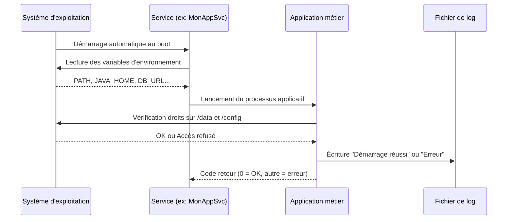

# Bases systèmes — Windows & Linux

## Objectifs pédagogiques

À l'issue de ce module, vous serez capable de :

- Naviguer dans l'arborescence de fichiers Windows et Linux et interpréter les droits d'accès
- Identifier les processus et services actifs et comprendre leur rôle dans le fonctionnement d'une application
- Localiser et lire les logs système pour diagnostiquer un premier incident
- Lire et modifier une variable d'environnement pour corriger un problème de configuration
- Distinguer les comportements propres à chaque OS pour éviter les erreurs classiques en support

---

## Mise en situation

Vous venez d'intégrer une équipe support dans une PME. Le parc est mixte : les serveurs de production tournent sous Linux (Ubuntu 22.04), les postes utilisateurs sous Windows 11, et une application métier de gestion de stocks tourne sur un serveur Windows Server 2019.

Lundi matin, un utilisateur signale que l'application de gestion des stocks ne se lance plus. Il a "juste redémarré son PC". Votre N+1 vous demande de traiter le ticket en autonomie.

Vous n'avez pas encore accès à l'environnement applicatif complet. Mais le problème vient peut-être du service Windows associé à l'application, d'un chemin de fichier mal configuré après une mise à jour, ou d'un log qui indique clairement ce qui s'est passé.

Ce module vous donne les bases pour aller chercher ces réponses — dans les deux mondes.

---

## Contexte et problématique

Un technicien support qui ne comprend pas l'OS sur lequel tourne une application, c'est comme un mécanicien qui ne saurait pas ouvrir le capot. L'application, vous ne pouvez pas toujours la modifier — mais l'environnement dans lequel elle tourne, vous en avez la maîtrise.

Windows et Linux partagent les mêmes concepts fondamentaux : des fichiers organisés en arborescence, des processus qui s'exécutent, des services qui tournent en arrière-plan, des journaux qui enregistrent ce qui se passe. La différence, c'est surtout la façon d'interagir avec ces mécanismes — interface graphique d'un côté, ligne de commande de l'autre — et quelques conventions propres à chaque OS.

L'objectif ici n'est pas de devenir administrateur système. C'est de comprendre assez pour ne pas être bloqué face à un incident courant.

---

## Le système de fichiers — s'y retrouver dans l'arborescence

### Deux arbres, deux logiques

Sous Windows, tout commence par une lettre de lecteur. `C:\` est le disque principal, `D:\` peut être un second disque ou un lecteur réseau. Les chemins utilisent des antislashs : `C:\Program Files\MonApp\config.ini`.

Sous Linux, il n'y a qu'un seul arbre, qui commence à `/` (la racine). Pas de lettre de lecteur — les disques sont "montés" dans des dossiers. Les chemins utilisent des slashs : `/etc/monapp/config.ini`.

```
Windows                          Linux
───────────────────────────────────────────────────
C:\                              /
├── Program Files\               ├── etc/          ← configs
│   └── MonApp\                  ├── var/
│       └── config.ini           │   └── log/      ← logs
├── Users\                       ├── home/
│   └── alice\                   │   └── alice/    ← home user
│       └── Documents\           ├── usr/
├── Windows\                     │   └── bin/      ← exécutables
│   └── System32\                └── tmp/          ← fichiers temp
└── Temp\
```

🧠 **Concept clé** — Sous Linux, `/etc` contient les fichiers de configuration système et applicatifs. C'est souvent là que vous trouverez les fichiers `.conf` d'une application. `/var/log` est l'endroit standard pour les logs. Ces conventions sont quasi universelles sur les distributions Linux.

### Les droits d'accès — qui peut faire quoi

Sous Windows, les droits sont gérés via les ACL (Access Control Lists), visibles dans les propriétés d'un fichier → onglet Sécurité. En pratique, en support, vous rencontrez surtout des erreurs "Accès refusé" qui viennent d'un compte de service mal configuré.

Sous Linux, les droits sont plus simples à lire, mais déroutants au début. La commande `ls -l` affiche quelque chose comme :

```bash
-rwxr-xr-- 1 alice devops 4096 juin 10 09:00 monscript.sh
```

Décomposons ça :

```
-  rwx  r-x  r--
│   │    │    └── autres (le reste du monde)
│   │    └─────── groupe (devops)
│   └──────────── propriétaire (alice)
└──────────────── type (- = fichier, d = dossier)

r = lecture   w = écriture   x = exécution
```

⚠️ **Erreur fréquente** — Un script shell qui "ne veut pas s'exécuter" alors qu'il existe bien sur le serveur. Cause quasi certaine : le bit `x` (exécution) n'est pas positionné. Correction : `chmod +x monscript.sh`. C'est l'une des premières choses à vérifier sur Linux.

En support, les problèmes de droits se manifestent presque toujours de la même façon : l'application tourne sous un compte de service (`svc_monapp`, `www-data`, `app_user`…) et ce compte n'a pas accès au dossier de logs, de config, ou de données. La correction consiste à ajuster les droits sur le bon dossier — sans jamais céder à la tentation du `chmod -R 777`, qui règle le problème en surface tout en ouvrant une faille de sécurité.

---

## Processus et services — ce qui tourne sous le capot

### La différence entre processus et service

Un **processus**, c'est un programme en cours d'exécution. Quand vous ouvrez Firefox, un processus Firefox démarre. Quand vous le fermez, il s'arrête.

Un **service**, c'est un processus particulier : il est conçu pour tourner en arrière-plan, souvent démarré automatiquement avec le système, sans fenêtre, sans interaction utilisateur. Une base de données, un serveur web, un agent de monitoring — ce sont des services.

En support applicatif, la première question à se poser face à une application qui ne répond plus : **est-ce que le service est démarré ?**

### Gérer les services sous Windows

L'interface graphique passe par `services.msc` (Win + R → `services.msc`). Vous y voyez l'état (Démarré / Arrêté), le type de démarrage (Automatique / Manuel / Désactivé), et le compte sous lequel le service tourne.

En ligne de commande (PowerShell) :

```powershell
# État d'un service précis
Get-Service -Name <NOM_SERVICE>

# Démarrer / Arrêter / Redémarrer
Start-Service -Name <NOM_SERVICE>
Stop-Service -Name <NOM_SERVICE>
Restart-Service -Name <NOM_SERVICE>
```

```powershell
# Exemples concrets
Get-Service -Name "wuauserv"          # Windows Update
Restart-Service -Name "MonAppSvc"
```

### Gérer les services sous Linux (systemd)

La grande majorité des distributions Linux modernes utilisent `systemd` pour gérer les services. La commande centrale est `systemctl`.

```bash
# État d'un service
systemctl status <NOM_SERVICE>

# Démarrer / Arrêter / Redémarrer
systemctl start <NOM_SERVICE>
systemctl stop <NOM_SERVICE>
systemctl restart <NOM_SERVICE>

# Activer au démarrage / désactiver
systemctl enable <NOM_SERVICE>
systemctl disable <NOM_SERVICE>
```

```bash
# Exemples concrets
systemctl status nginx
systemctl restart postgresql
```

La sortie de `systemctl status` est particulièrement utile : elle affiche les dernières lignes de log du service directement dans le terminal, ce qui permet souvent de voir l'erreur sans même ouvrir un fichier de log.

💡 **Astuce** — Si `systemctl status` affiche `Active: failed`, les lignes juste en dessous donnent généralement la raison exacte de l'échec (fichier manquant, port déjà utilisé, permission refusée). C'est votre premier réflexe avant d'aller fouiller dans `/var/log`.

### Voir les processus en cours

Parfois, le problème n'est pas un service arrêté, mais un processus qui consomme trop de ressources ou qui est bloqué.

**Windows** — Le Gestionnaire des tâches (`Ctrl + Shift + Échap`) est l'outil graphique. En PowerShell :

```powershell
# Trouver un processus par nom
Get-Process -Name <NOM>

# Forcer l'arrêt
Stop-Process -Name <NOM> -Force
```

**Linux** — `ps aux` liste les processus, `top` ou `htop` donnent une vue dynamique :

```bash
# Filtrer par nom
ps aux | grep <NOM_PROCESSUS>

# Vue dynamique (q pour quitter)
top
```

```bash
# Exemple : trouver le processus java (souvent utilisé par des apps métier)
ps aux | grep java
```

---

## Logs système — lire ce que l'OS a enregistré

Les logs sont vos meilleurs alliés en support. Ils enregistrent en temps réel ce que fait le système — erreurs, avertissements, connexions, démarrages de services. Apprendre à les lire, c'est gagner 80% de l'autonomie en diagnostic.

### Windows — l'Observateur d'événements

L'outil graphique s'appelle l'**Observateur d'événements** (Event Viewer) : Win + R → `eventvwr.msc`.

Structure des journaux Windows :

```
Journaux Windows
├── Application   ← erreurs et infos des applications installées
├── Système       ← événements OS (services, drivers, matériel)
├── Sécurité      ← connexions, échecs d'authentification
└── Installation  ← mises à jour, installations
```

Chaque événement a un **niveau** (Information, Avertissement, Erreur, Critique) et un **ID d'événement**. L'ID est précieux : une recherche sur "Windows Event ID 7034" vous donnera immédiatement ce que ça signifie (en l'occurrence, un service qui s'est arrêté de façon inattendue).

En PowerShell :

```powershell
# Derniers événements d'erreur dans le journal Système
Get-EventLog -LogName System -EntryType Error -Newest 20

# Filtrer par source applicative
Get-EventLog -LogName Application -Source <NOM_SOURCE> -Newest 10
```

### Linux — les fichiers de log et journald

Sous Linux, les logs peuvent être à deux endroits selon la configuration :

1. **Fichiers texte dans `/var/log/`** — méthode classique, lisibles directement
2. **journald** — le système de logs de systemd, interrogeable avec `journalctl`

```bash
# Logs système en temps réel
tail -f /var/log/syslog           # Debian/Ubuntu
tail -f /var/log/messages         # RHEL/CentOS
tail -100 /var/log/syslog         # 100 dernières lignes

# Avec journalctl
journalctl -u <NOM_SERVICE>       # logs d'un service précis
journalctl -u <NOM_SERVICE> -f    # en temps réel
journalctl --since "1 hour ago"   # depuis la dernière heure
journalctl -p err                 # uniquement les erreurs
```

```bash
# Suivre les logs nginx en temps réel
journalctl -u nginx -f

# Chercher "error" dans syslog (insensible à la casse)
grep -i "error" /var/log/syslog | tail -50
```

💡 **Astuce** — `tail -f` est votre meilleur ami pour le diagnostic en temps réel : lancez-le dans un terminal, reproduisez l'erreur dans un autre, et regardez ce qui apparaît. La plupart des erreurs applicatives se lisent directement dans le flux.

🧠 **Concept clé** — `grep` est l'outil de recherche dans les fichiers texte sous Linux. `grep -i "mot" fichier` cherche sans tenir compte de la casse. `grep -r "mot" /var/log/` cherche récursivement dans tous les sous-dossiers. En combinaison avec `tail` ou `cat`, c'est l'essentiel du diagnostic de log sur Linux.

---

## Variables d'environnement — la configuration invisible

### Ce que c'est, concrètement

Une variable d'environnement, c'est une paire clé=valeur que le système met à disposition de tous les programmes. Ces variables permettent de configurer le comportement d'une application sans modifier son code.

Exemples courants :
- `PATH` — liste des dossiers où le système cherche les exécutables
- `JAVA_HOME` — chemin vers l'installation Java, utilisé par beaucoup d'applications métier
- `DATABASE_URL` — souvent utilisé dans les applications modernes pour pointer vers la base de données

En support, les variables d'environnement causent des incidents classiques : une application qui "ne trouve pas Java", un script qui échoue sur un serveur mais pas sur un autre, une configuration qui change entre `dev` et `prod`.

### Lire et modifier sous Windows

```powershell
# Lire une variable précise
$env:PATH
$env:JAVA_HOME

# Modifier temporairement (session courante uniquement)
$env:MA_VARIABLE = "valeur"

# Modifier de façon permanente (machine)
[System.Environment]::SetEnvironmentVariable("MA_VARIABLE", "valeur", "Machine")
```

L'interface graphique : Paramètres → Système → Informations système → Paramètres système avancés → Variables d'environnement.

⚠️ **Erreur fréquente** — Une modification de variable d'environnement via l'interface graphique ne prend effet que pour les **nouvelles sessions**. Si l'application ou le service tourne déjà, il faut le redémarrer. C'est un piège classique en support.

### Lire et modifier sous Linux

```bash
# Lire une variable précise
echo $PATH
echo $JAVA_HOME

# Modifier temporairement (session courante)
export MA_VARIABLE="valeur"

# Rendre permanent : ajouter dans ~/.bashrc (user) ou /etc/environment (système)
echo 'export MA_VARIABLE="valeur"' >> ~/.bashrc
source ~/.bashrc    # recharger sans fermer le terminal
```

```bash
# Vérifier si JAVA_HOME est bien défini
echo $JAVA_HOME
# Si vide → Java n'est pas configuré → l'application Java ne démarrera pas
```

⚠️ **Piège systemd** — Une variable définie dans votre terminal bash n'est **pas** disponible pour un service systemd. Les services ont leur propre environnement, isolé de votre session. Pour vérifier ce qu'un service voit réellement : `systemctl show <NOM_SERVICE> | grep Environment`. Pour corriger, il faut passer par le fichier d'override du service, pas par `~/.bashrc`.

---

## Fonctionnement interne — comment tout ça s'enchaîne

Pour comprendre pourquoi les incidents arrivent, il est utile de voir comment ces mécanismes interagissent au démarrage d'une application métier typique.



Ce schéma résume la chaîne de dépendances. Quand une application ne démarre pas, l'erreur peut se situer à n'importe quel niveau : le service n'est pas configuré pour démarrer automatiquement, une variable d'environnement est manquante, le compte de service n'a pas les droits sur le dossier de données, ou l'application plante et l'erreur est dans les logs. Connaître cette chaîne, c'est savoir dans quel ordre chercher.

---

## Cas réel en entreprise

**Contexte** : Application de facturation Java déployée sur un serveur Ubuntu 20.04. Après une migration serveur, l'application ne démarre plus. Ticket P2 ouvert en urgence.

**Étape 1 — Vérifier le service**

```bash
systemctl status facturation.service
```

Résultat : `Active: failed (Result: exit-code)`. Les dernières lignes affichées dans le terminal montrent :

```
Error: JAVA_HOME is not set and 'java' is not in the PATH
```

Pas besoin d'ouvrir un fichier de log — le problème est déjà là.

**Étape 2 — Vérifier les variables d'environnement**

```bash
echo $JAVA_HOME
# (vide)

which java
# /usr/lib/jvm/java-11-openjdk-amd64/bin/java
```

Java est bien installé sur le serveur, mais `JAVA_HOME` n'a pas été défini lors de la migration.

**Étape 3 — Corriger dans le contexte du service**

Comme le service systemd a son propre environnement, définir `JAVA_HOME` dans le terminal ne suffit pas. On passe par le mécanisme d'override :

```bash
sudo systemctl edit facturation.service
```

Ajout dans le fichier d'override :

```ini
[Service]
Environment="JAVA_HOME=/usr/lib/jvm/java-11-openjdk-amd64"
```

```bash
sudo systemctl daemon-reload
sudo systemctl start facturation.service
systemctl status facturation.service
# Active: running ✓
```

**Résultat** : Application relancée en 12 minutes. Cause documentée dans le ticket : variable d'environnement `JAVA_HOME` non migrée lors du transfert serveur. Action préventive : créer une checklist de migration incluant les variables d'environnement des services.

---

## Bonnes pratiques

**1. Commencer par le service, pas par l'application**
Avant de plonger dans les logs applicatifs, confirmez que le service est bien démarré. La moitié des incidents "l'application ne répond plus" se résolvent avec un simple `systemctl status` ou `Get-Service`.

**2. Lire les logs dans l'ordre chronologique**
Cherchez l'heure de l'incident, pas seulement le mot "Error" dans tout le fichier. La première erreur dans la séquence est presque toujours la cause racine — les suivantes sont des conséquences.

**3. Ne jamais modifier les droits en cascade sans comprendre l'impact**
`chmod -R 777 /var/data` est tentant quand on ne sait pas quel droit manque exactement. C'est une mauvaise pratique de sécurité. Prenez le temps d'identifier le compte concerné et d'appliquer le droit minimal nécessaire.

**4. Tester une variable d'environnement dans le contexte du service, pas dans votre terminal**
Une variable définie dans votre session bash n'est pas disponible pour un service systemd. Vérifiez avec `systemctl show <SERVICE> | grep Environment` et corrigez dans l'override du service.

**5. Documenter la cause, pas seulement la correction**
En support, noter "j'ai redémarré le service" ne suffit pas. La valeur est dans "le service s'était arrêté parce que `JAVA_HOME` n'avait pas été migré lors du transfert serveur". Ça évite de traiter le même ticket dans trois semaines.

**6. Sur Windows, ouvrir `eventvwr.msc` avant de chercher ailleurs**
L'Observateur d'événements est sous-utilisé par les débutants. Filtrer sur les erreurs dans les journaux Application et Système, dans la fenêtre de temps de l'incident, donne très souvent la réponse directement — sans avoir à reproduire le problème.

**7. `systemctl status` avant `journalctl`**
Sur Linux, `systemctl status` affiche déjà les dernières lignes de log du service. Dans la majorité des cas, c'est suffisant pour identifier la cause. Ne pas aller chercher dans `/var/log` si la réponse est déjà là.

---

## Résumé

Windows et Linux partagent les mêmes mécanismes fondamentaux — fichiers, processus, services, logs et variables d'environnement — mais avec des conventions et des outils différents. En support applicatif, ces bases permettent de savoir où chercher quand une application ne fonctionne plus : est-ce que le service tourne ? Les droits sont-ils corrects sur les fichiers de config et de données ? Une variable d'environnement est-elle mal définie ou absente ? Les logs — Observateur d'événements sous Windows, `journalctl` et `/var/log/` sous Linux — sont la première source de réponse. La maîtrise de ces fondamentaux est ce qui différencie un technicien qui "essaie des choses" d'un technicien qui sait où regarder, et pourquoi.

---

<!-- snippet
id: linux_service_status
type: command
tech: linux
level: beginner
importance: high
format: knowledge
tags: systemd,service,diagnostic,linux,support
title: Vérifier l'état d'un service systemd
command: systemctl status <NOM_SERVICE>
example: systemctl status nginx
description: Affiche l'état du service + les dernières lignes de log. Si "failed", les lignes suivantes donnent la cause exacte de l'échec sans ouvrir de fichier log.
-->

<!-- snippet
id: linux_service_restart
type: command
tech: linux
level: beginner
importance: high
format: knowledge
tags: systemd,service,redémarrage,linux
title: Démarrer / arrêter / redémarrer un service systemd
command: systemctl <start|stop|restart> <NOM_SERVICE>
example: systemctl restart postgresql
description: Les trois actions essentielles sur un service. Toujours vérifier avec "systemctl status" après un restart pour confirmer que le service est bien "Active: running".
-->

<!-- snippet
id: linux_logs_tail
type: command
tech: linux
level: beginner
importance: high
format: knowledge
tags: logs,tail,diagnostic,linux,temps-réel
title: Suivre les logs système en temps réel
command: tail -f /var/log/syslog
example: tail -f /var/log/syslog
description: Affiche les nouvelles lignes au fur et à mesure qu'elles s'écrivent. Lancer dans un terminal, reproduire l'erreur dans un autre — la cause apparaît en direct. Ctrl+C pour quitter.
-->

<!-- snippet
id: linux_journalctl_service
type: command
tech: linux
level: beginner
importance: high
format: knowledge
tags: journald,logs,service,linux,diagnostic
title: Lire les logs d'un service avec journalctl
command: journalctl -u <NOM_SERVICE> -f
example: journalctl -u nginx -f
description: Équivalent de "tail -f" pour les services systemd. Sans "-f", affiche l'historique complet. Ajouter "--since '1 hour ago'" pour filtrer dans le temps.
-->

<!-- snippet
id: linux_grep_logs
type: command
tech: linux
level: beginner
importance: medium
format: knowledge
tags: grep,logs,recherche,linux,diagnostic
title: Chercher un mot-clé dans les logs
command: grep -i "<MOT>" /var/log/syslog | tail -<N>
example: grep -i "error" /var/log/syslog | tail -50
description: "-i" ignore la casse (trouve Error, ERROR, error). "| tail -50" limite aux 50 dernières occurrences. Ajouter "-r" pour chercher récursivement dans /var/log/.
-->

<!-- snippet
id: linux_droits_chmod
type: warning
tech: linux
level: beginner
importance: high
format: knowledge
tags: droits,chmod,permissions,linux,sécurité
title: Script Linux qui refuse de s'exécuter
content: Piège : le fichier existe et le chemin est bon, mais le bit exécution (x) est absent → "Permission denied". Vérifier avec "ls -l script.sh". Correction : chmod +x script.sh. Ne jamais appliquer chmod 777 en production — identifier le compte concerné et appliquer le droit minimal.
description: Absence du bit exécution sur un script shell : cause #1 des erreurs "Permission denied" sur Linux. Correction ciblée avec chmod +x, jamais chmod 777.
-->

<!-- snippet
id: windows_service_powershell
type: command
tech: windows
level: beginner
importance: high
format: knowledge
tags: powershell,service,windows,redémarrage
title: Gérer un service Windows en PowerShell
command: Get-Service -Name <NOM> | Restart-Service
example: Get-Service -Name "wuauserv" | Restart-Service
description: Enchaîner Get-Service et Restart-Service avec un pipe. Pour démarrer/arrêter : Start-Service / Stop-Service. Vérifier l'état final avec Get-Service -Name <NOM>.
-->

<!-- snippet
id: windows_eventlog_errors
type: command
tech: windows
level: beginner
importance: medium
format: knowledge
tags: powershell,eventlog,logs,windows,diagnostic
title: Lire les erreurs récentes dans les journaux Windows
command: Get-EventLog -LogName <JOURNAL> -EntryType Error -Newest <N>
example: Get-EventLog -LogName System -EntryType Error -Newest 20
description: JOURNAL = System, Application ou Security. Filtrer sur l'heure de l'incident pour trouver la cause racine. L'Event ID est interrogeable directement sur docs.microsoft.com.
-->

<!-- snippet
id: linux_env_java_home
type: concept
tech: linux
level: beginner
importance: high
format: knowledge
tags: variable-environnement,linux,java,configuration,service
title: Variable d'environnement manquante — application qui ne démarre pas
content: Une variable d'environnement (ex: JAVA_HOME) est lue par le processus au démarrage. Si elle est absente ou vide, l'application échoue avant même d'écrire dans ses logs. Vérifier : echo $JAVA_HOME. Si vide, la définir dans le fichier d'override systemd (/etc/systemd/system/<service>.d/override.conf) avec "Environment=JAVA_HOME=/chemin/java". Un service systemd a son propre environnement — indépendant du terminal courant.
description: JAVA_HOME vide = application Java qui refuse de démarrer. Le service systemd n'hérite pas des variables du terminal. Définir dans l'override systemd, pas dans ~/.bashrc.
-->

<!-- snippet
id: windows_env_session
type: warning
tech: windows
level: beginner
importance: medium
format: knowledge
tags: variable-environnement,windows,service,redémarrage
title: Variable d'environnement modifiée mais l'appli ne voit pas le changement
content: Piège : modifier une variable dans l'interface graphique ou avec SetEnvironmentVariable prend effet uniquement pour les nouvelles sessions. L'application ou le service déjà en cours d'exécution continue avec l'ancienne valeur. Correction : redémarrer le service (Stop-Service + Start-Service) ou fermer/rouvrir l'application après la modification.
description: Toute modification de variable d'environnement Windows nécessite un redémarrage du service ou de l'application concernée — la session courante n'est pas rechargée automatiquement.
-->

<!-- snippet
id: linux_ps_grep
type: command
tech: linux
level: beginner
importance: medium
format: knowledge
tags: processus,ps,grep,linux,diagnostic
title: Vérifier si un processus tourne sur Linux
command: ps aux | grep <NOM_PROCESSUS>
example: ps aux | grep java
description: "ps aux" liste tous les processus avec l'utilisateur, le PID et la commande complète. Utile pour confirmer qu'une application Java ou Python tourne bien, et identifier son PID pour un éventuel kill.
-->

<!-- snippet
id: linux_filesystem_etc
type: concept
tech: linux
level: beginner
importance: medium
format: knowledge
tags: arborescence,linux,configuration,logs,fichiers
title: Arborescence Linux — où trouver quoi
content: Trois dossiers à connaître en priorité : /etc/ contient les fichiers de configuration (nginx.conf, postgresql.conf, fichiers .conf des apps) ; /var/log/ contient les logs applicatifs et système ; /home/<user>/ est le répertoire personnel des utilisateurs. Ces conventions sont respectées par la quasi-totalité des applications Linux. Un fichier de config introuvable → commencer par ls /etc/<nom-app>/.
description: /etc = configs, /var/log = logs, /home = utilisateurs. Ces trois dossiers couvrent 90% des recherches courantes en support
