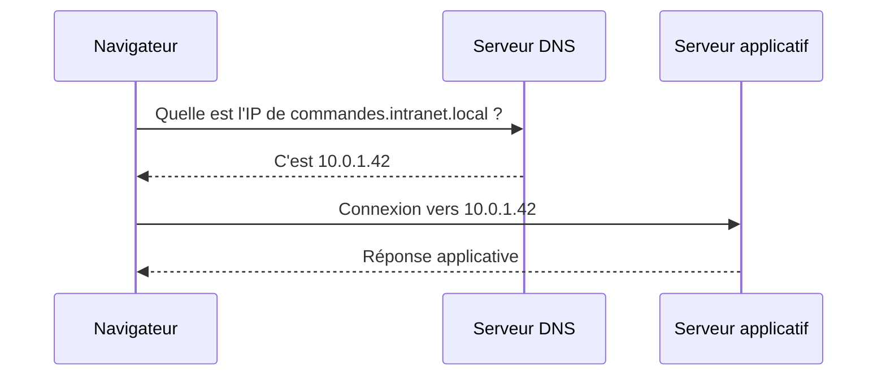

# Bases réseau essentielles

## Objectifs pédagogiques

À l'issue de ce module, vous serez capable de :

- Expliquer comment une application communique sur un réseau via le modèle TCP/IP
- Identifier le rôle d'une adresse IP, d'un port et d'un nom DNS dans une connexion applicative
- Distinguer HTTP et HTTPS et comprendre pourquoi cette différence compte en production
- Lire une URL et en déduire le protocole, le serveur cible et le service concerné
- Utiliser ces notions pour poser les bonnes questions lors d'un incident réseau applicatif

---

## Mise en situation

Il est 9h15. Un utilisateur ouvre un ticket : *"L'application de gestion des commandes ne répond plus depuis ce matin."* Pas d'autre info. L'application tourne sur un serveur interne, elle s'appelle via un nom de domaine type `commandes.intranet.local`, et communique avec une base de données sur un autre serveur.

Où commencer ? Est-ce un problème de serveur ? De réseau ? De DNS ? De pare-feu ? Est-ce que le port est ouvert ? Est-ce que le certificat HTTPS a expiré ?

Sans maîtriser les bases réseau, cette liste de questions n'a aucun sens. Avec, chaque élément devient un point de diagnostic concret. C'est exactement ce qu'on va construire dans ce module.

---

## Pourquoi le réseau concerne le support applicatif

On pourrait croire que le réseau, c'est l'affaire des administrateurs systèmes. En pratique, une bonne partie des incidents applicatifs a une composante réseau — même quand l'application elle-même fonctionne parfaitement.

Un timeout de connexion, une page qui ne charge pas, une API qui ne répond pas, une synchronisation inter-serveurs qui échoue : dans tous ces cas, comprendre comment les données circulent entre les machines est indispensable pour diagnostiquer rapidement — même si vous n'êtes pas celui qui va corriger l'infrastructure.

L'objectif n'est pas de devenir administrateur réseau. C'est de ne pas rester bloqué devant un incident parce qu'on ne sait pas ce que signifie "le port 443 est fermé" ou "le DNS ne résout pas".

---

## Le modèle TCP/IP : quatre couches, une seule idée

Le modèle TCP/IP décrit comment les données voyagent entre deux machines. Il existe des modèles plus détaillés — le modèle OSI à 7 couches — mais en support applicatif, quatre couches suffisent pour raisonner correctement.

```
┌─────────────────────────┐
│   Application           │  HTTP, HTTPS, FTP, DNS...
│   (ce que vous utilisez)│
├─────────────────────────┤
│   Transport             │  TCP, UDP
│   (fiabilité du trajet) │
├─────────────────────────┤
│   Internet              │  IP
│   (adressage & routage) │
├─────────────────────────┤
│   Accès réseau          │  Ethernet, Wi-Fi
│   (le câble ou l'onde)  │
└─────────────────────────┘
```

Pensez à un colis postal : la couche Accès réseau, c'est le camion et la route. La couche Internet, c'est l'adresse postale. La couche Transport, c'est l'accusé de réception. La couche Application, c'est le contenu du colis.

🧠 **En support applicatif, ce sont surtout les couches Transport et Application qui vous concernent.** Les deux couches inférieures sont gérées par l'infrastructure — mais savoir qu'elles existent permet de comprendre pourquoi un problème réseau peut bloquer une application sans que celle-ci soit en cause.

### TCP vs UDP — la distinction qui change tout

La couche Transport utilise principalement deux protocoles : **TCP** et **UDP**.

**TCP** (Transmission Control Protocol) établit une connexion avant d'envoyer des données. Les deux machines se synchronisent via un mécanisme appelé *three-way handshake*, puis chaque paquet est acquitté — si un paquet est perdu, il est renvoyé. C'est fiable, mais légèrement plus lent.

**UDP** (User Datagram Protocol) envoie les données sans vérification. Pas de connexion préalable, pas d'accusé de réception. Rapide, mais sans garantie de livraison.

En support applicatif, la quasi-totalité des applications métiers utilisent TCP : HTTP, HTTPS, FTP, les connexions aux bases de données. UDP est plutôt réservé au streaming vidéo, aux jeux en ligne ou à certains protocoles d'infrastructure comme DNS.

💡 **Quand une connexion TCP échoue, vous obtenez un message d'erreur explicite** — connexion refusée, timeout. Avec UDP, le silence est total, ce qui peut compliquer considérablement le diagnostic.

---

## Adresses IP, DNS et ports : le trio fondamental

Ces trois notions fonctionnent ensemble pour établir n'importe quelle connexion applicative. Il est utile de les comprendre ensemble plutôt que séparément.

### L'adresse IP — l'identité d'une machine sur le réseau

Chaque machine connectée à un réseau possède une adresse IP. C'est son identifiant unique sur ce réseau, comme un numéro de téléphone. Il en existe deux versions :

- **IPv4** : format `192.168.1.10` — quatre nombres entre 0 et 255, séparés par des points
- **IPv6** : format `2001:0db8:85a3::8a2e:0370:7334` — plus long, conçu pour pallier l'épuisement des adresses IPv4

En entreprise, vous croiserez surtout des adresses IPv4. Certaines plages sont réservées aux réseaux privés — elles ne sont pas routables sur Internet :

| Plage | Usage typique |
|-------|---------------|
| `10.0.0.0/8` | Grands réseaux d'entreprise |
| `172.16.0.0/12` | Réseaux de taille intermédiaire |
| `192.168.0.0/16` | Réseaux domestiques et petites structures |
| `127.0.0.1` | Loopback — la machine elle-même |

⚠️ **`127.0.0.1` est un cas particulier** très utile en support : quand une application tourne localement et communique avec un service sur la même machine, elle utilise souvent `localhost` ou `127.0.0.1`. Si vous voyez cette adresse dans une configuration, l'application ne cherche pas à joindre une autre machine — ce qui devient un problème si le service est migré ailleurs.

<!-- snippet
id: reseau_loopback_localhost
type: concept
tech: réseau
level: beginner
importance: medium
tags: ip, loopback, localhost, configuration
title: 127.0.0.1 et localhost — la machine qui se parle à elle-même
content: L'adresse 127.0.0.1 (alias "localhost") est une adresse spéciale : le trafic ne quitte jamais la machine. Quand une config applicative pointe vers localhost, l'application cherche un service sur le même serveur (ex: app web → base de données locale). Implication : si la DB est déplacée sur un autre serveur, remplacer localhost par l'IP réelle est obligatoire.
description: Une config pointant sur localhost ne fonctionne que si le service cible tourne sur la même machine — piège classique lors de migrations
-->

### Le DNS — parce que personne ne mémorise des IP

Le DNS (Domain Name System) est le service qui traduit un nom lisible (`commandes.intranet.local`) en adresse IP compréhensible par les machines (`10.0.1.42`). Sans lui, vous devriez saisir l'adresse IP de chaque serveur directement. Ça fonctionnerait — mais dès qu'un serveur change d'adresse, tout se casse. Le DNS permet de changer l'IP derrière un nom sans toucher aux applications.



💡 **Un incident DNS est l'une des causes les plus fréquentes d'indisponibilité applicative apparente.** L'application fonctionne, le serveur est en ligne, mais le navigateur ne sait plus où aller. Symptôme caractéristique : l'accès via le nom échoue, l'accès direct via l'IP fonctionne.

<!-- snippet
id: reseau_dns_diagnostic
type: tip
tech: réseau
level: beginner
importance: high
tags: dns, diagnostic, ip, incident, support
title: Isoler une panne DNS en testant l'IP directe
content: Si l'accès via le nom échoue (ex: commandes.intranet.local), testez immédiatement l'IP directe (ex: 10.0.1.42). Ça fonctionne via IP mais pas via le nom → problème DNS, pas réseau. Utilisez `ping <NOM>` vs `ping <IP>` pour confirmer en 10 secondes.
example: ping commandes.intranet.local → échec / ping 10.0.1.42 → succès = DNS en cause
description: Distingue une panne DNS d'une panne réseau sans outil spécialisé — réflexe n°1 face à une application injoignable
-->

### Les ports — distinguer les services sur une même machine

Un serveur peut faire tourner plusieurs services simultanément : un serveur web, une base de données, un serveur FTP. L'adresse IP pointe vers la machine, mais le port indique *quel service* on veut joindre. Imaginez un immeuble de bureaux : l'adresse IP, c'est l'adresse de l'immeuble ; le port, c'est le numéro de bureau à l'intérieur.

Les ports vont de 0 à 65535. Ceux inférieurs à 1024 sont réservés à des protocoles standard — on les appelle *well-known ports* :

| Port | Protocole | Usage |
|------|-----------|-------|
| 21 | FTP | Transfert de fichiers |
| 22 | SSH / SFTP | Accès distant sécurisé |
| 80 | HTTP | Web non chiffré |
| 443 | HTTPS | Web chiffré (TLS) |
| 3306 | MySQL | Base de données MySQL/MariaDB |
| 5432 | PostgreSQL | Base de données PostgreSQL |
| 3389 | RDP | Bureau à distance Windows |
| 8080 | HTTP alternatif | Souvent utilisé en développement ou services internes |

⚠️ **Un pare-feu bloque les connexions par port.** Si une application ne répond pas, vérifier si le port concerné est ouvert entre le client et le serveur est souvent la première piste. Un port fermé produit une erreur "connexion refusée" ou un timeout silencieux selon la configuration du pare-feu.

<!-- snippet
id: reseau_ports_wellknown
type: concept
tech: réseau
level: beginner
importance: high
tags: ports, protocoles, http, https, ssh
title: Ports standards à connaître absolument
content: Chaque service écoute sur un port précis. Le navigateur contacte automatiquement le port 80 pour HTTP et 443 pour HTTPS. Un port différent dans l'URL (ex: :8080, :8443) signale souvent un service interne ou dev — à vérifier dans les règles pare-feu. Ports clés : 21=FTP, 22=SSH/SFTP, 80=HTTP, 443=HTTPS, 3306=MySQL, 5432=PostgreSQL, 3389=RDP.
description: Un port fermé au pare-feu donne une erreur "connexion refusée" ou un timeout — savoir quel port chercher évite de perdre du temps
-->

<!-- snippet
id: reseau_tcp_timeout
type: warning
tech: réseau
level: beginner
importance: medium
tags: tcp, timeout, pare-feu, diagnostic, connexion
title: Timeout TCP vs connexion refusée — deux causes différentes
content: Piège : "timeout" et "connexion refusée" semblent identiques mais indiquent des problèmes différents. "Connexion refusée" (service absent ou pare-feu REJECT) = réponse immédiate. "Timeout" (pare-feu en mode DROP) = attente jusqu'à expiration sans réponse. Un timeout long suggère un pare-feu DROP plutôt qu'un service arrêté.
description: Un timeout long pointe vers un pare-feu en mode DROP ; une erreur immédiate "connexion refusée" pointe vers un service absent ou un pare-feu REJECT
-->

---

## HTTP, HTTPS et FTP — les protocoles du quotidien applicatif

### HTTP : comment un client et un serveur se parlent

HTTP (HyperText Transfer Protocol) est le protocole de communication entre un client — navigateur ou application — et un serveur web. Son fonctionnement est simple : le client envoie une **requête**, le serveur renvoie une **réponse** accompagnée d'un **code de statut**.

Ces codes sont précis et directement exploitables en support :

| Code | Famille | Signification |
|------|---------|---------------|
| 200 | Succès | Tout s'est bien passé |
| 301 / 302 | Redirection | La ressource a changé d'adresse |
| 400 | Erreur client | Requête mal formée |
| 401 | Erreur client | Authentification requise |
| 403 | Erreur client | Accès refusé (même authentifié) |
| 404 | Erreur client | Ressource introuvable |
| 500 | Erreur serveur | Le serveur a rencontré une erreur interne |
| 503 | Erreur serveur | Service temporairement indisponible |

🧠 **La distinction 4xx / 5xx est fondamentale pour orienter le diagnostic.** Un 4xx pointe vers un problème dans la requête ou les droits — inutile de fouiller les logs serveur. Un 5xx pointe vers une défaillance côté serveur — c'est là qu'il faut aller chercher.

<!-- snippet
id: reseau_http_codes
type: concept
tech: http
level: beginner
importance: high
tags: http, codes-statut, diagnostic, erreur, support
title: Codes HTTP — lire la réponse du serveur
content: Les codes HTTP indiquent précisément où se situe le problème. 2xx = succès. 4xx = erreur côté client (401=non authentifié, 403=accès refusé malgré auth, 404=ressource absente). 5xx = erreur côté serveur (500=crash applicatif, 503=service indispo). Un 4xx ne nécessite pas de regarder les logs serveur — un 5xx, si.
description: La famille du code (4xx vs 5xx) oriente immédiatement le diagnostic : droits/URL pour 4xx, logs serveur pour 5xx
-->

### HTTPS : la même chose, mais chiffrée

HTTPS, c'est HTTP avec une couche de chiffrement TLS (anciennement appelé SSL). Deux choses changent concrètement :

1. **Le contenu des échanges est chiffré** — personne sur le réseau ne peut lire ce qui transite entre le client et le serveur.
2. **Le serveur s'authentifie via un certificat** — le client vérifie que le serveur est bien celui qu'il prétend être.

En support, le certificat TLS est une source récurrente d'incidents. Un certificat a une date d'expiration. Quand il expire, le navigateur bloque l'accès et affiche un avertissement de sécurité — l'application *semble* cassée alors qu'elle tourne parfaitement.

⚠️ **Risque classique : le certificat qui expire un week-end.** Les certificats sont parfois renouvelés manuellement. Si personne ne surveille, l'expiration tombe un samedi matin et l'application devient inaccessible jusqu'au lundi.

<!-- snippet
id: reseau_https_certificat
type: warning
tech: https
level: beginner
importance: high
tags: https, tls, certificat, expiration, incident
title: Certificat TLS expiré — application bloquée sans panne serveur
content: Piège : le navigateur bloque l'accès avec "connexion sécurisée impossible" même si l'application tourne parfaitement. Cause : le certificat TLS a expiré ou est autosigné. Correction : vérifier la date d'expiration dans le navigateur (icône cadenas → détails du certificat), puis alerter l'équipe infra pour renouvellement. Risque élevé les weekends si le renouvellement est manuel.
description: Un certificat expiré ressemble à une panne applicative alors que le service est intact — vérifier avant d'escalader
-->

### FTP : le transfert de fichiers

FTP (File Transfer Protocol) est un protocole dédié au transfert de fichiers entre machines. Vous le rencontrerez dans des contextes de dépôt de fichiers — rapports, exports, imports de données entre applications.

FTP présente une particularité : il utilise **deux ports simultanément** — le port 21 pour les commandes et un port dynamique pour les données. Cela pose régulièrement des problèmes avec les pare-feux. En pratique, on lui préfère SFTP (FTP via SSH, port 22 uniquement) ou FTPS (FTP avec TLS), plus sécurisés et plus simples à traverser dans un réseau filtré.

<!-- snippet
id: reseau_ftp_sftp
type: tip
tech: réseau
level: beginner
importance: low
tags: ftp, sftp, transfert, securite, pare-feu
title: Préférer SFTP à FTP en environnement filtré
content: FTP utilise deux ports (21 pour les commandes + port dynamique pour les données), ce qui bloque souvent au pare-feu. SFTP (SSH File Transfer Protocol, port 22 uniquement) passe partout où SSH est autorisé et chiffre les données. Si un transfert FTP échoue ou est bloqué, proposer SFTP comme alternative en vérifiant que le port 22 est ouvert vers le serveur cible.
description: FTP échoue souvent au pare-feu à cause du port de données dynamique ; SFTP sur port 22 contourne ce problème et est plus sécurisé
-->

---

## Lire une URL comme un technicien

Une URL contient toutes les informations réseau nécessaires pour établir une connexion. Savoir la décortiquer est un réflexe de base — c'est souvent la première chose à faire avant de lancer le moindre test.

```
https://commandes.intranet.local:8443/api/orders?status=pending
  │         │                      │    │
  │         │                      │    └─ Chemin de la ressource
  │         │                      └────── Port explicite (non standard)
  │         └─────────────────────────── Nom de domaine (résolu par DNS)
  └───────────────────────────────────── Protocole (HTTPS → port 443 par défaut)
```

Quand une URL ne précise pas de port, le port par défaut du protocole s'applique : 80 pour HTTP, 443 pour HTTPS. Dès qu'un port non standard apparaît — `:8443`, `:8080` — c'est souvent le signe d'un service interne ou d'un environnement de recette. C'est un point à vérifier systématiquement dans les règles du pare-feu.

<!-- snippet
id: reseau_url_decryptage
type: tip
tech: réseau
level: beginner
importance: medium
tags: url, protocole, port, dns, diagnostic
title: Décortiquer une URL pour identifier les points de défaillance
content: Une URL contient tout : protocole (http/https → port par défaut 80/443), nom DNS (résolu par le serveur DNS), port explicite si non standard (:8080, :8443), chemin de ressource. Exemple : https://app.intranet.local:8443/api/v2 → HTTPS sur port 8443 non standard → vérifier ouverture de ce port au pare-feu ET validité du certificat sur ce port.
description: Lire l'URL avant de tester quoi que ce soit — elle indique le protocole, le nom à résoudre et le port à tester
-->

---

## Cas réel en entreprise

**Contexte :** Dans une PME industrielle de 200 personnes, une application de reporting interne ne charge plus après une mise à jour du serveur. Les utilisateurs signalent un message "impossible d'établir une connexion sécurisée". Une vingtaine de personnes sont bloquées.

**Diagnostic :**

1. Le message évoque HTTPS → probable problème de certificat ou de port 443
2. La mise à jour du serveur a pu modifier la configuration du service web
3. Test direct : accès à l'URL en HTTP (port 80) → fonctionne. En HTTPS → bloqué.
4. Vérification du certificat via le navigateur (icône cadenas → détails) → certificat autosigné installé lors de la mise à jour, non reconnu par les postes clients

**Résolution :** Réinstallation du certificat signé par l'autorité de certification interne. Délai total : 35 minutes. L'application fonctionnait, le réseau était intact — seule la couche TLS bloquait.

Ce type de diagnostic — isoler la couche en cause plutôt que de tester tout en aveugle — est précisément ce que les bases réseau permettent de faire rapidement.

---

## Bonnes pratiques pour le support applicatif

Quatre réflexes couvrent l'essentiel des situations courantes.

**Commencer par lire l'URL.** Elle contient le protocole, le nom et le port. Un port non standard, un HTTP là où on attend HTTPS : ce sont des indices immédiats avant de lancer le moindre test.

**Distinguer "le nom ne résout pas" de "le service ne répond pas".** Si `ping commandes.intranet.local` échoue mais que `ping 10.0.1.42` fonctionne, le problème est DNS, pas réseau. Cette distinction change complètement l'escalade.

**Utiliser les codes HTTP comme des faits.** Un 403 n'est pas "un problème réseau" — c'est un problème de droits. Un 500, c'est dans les logs serveur qu'il faut chercher, pas côté réseau. Ne pas sauter d'étape.

**Documenter l'environnement réseau de chaque application supportée.** Notez le nom DNS, l'IP du serveur, le port, le protocole et la date d'expiration du certificat si applicable. Quand un incident survient à 8h du matin, cette fiche vous fait gagner un temps précieux.

**Vérifier les certificats avant les weekends chargés.** Un certificat qui expire le vendredi soir bloque l'application le samedi matin. Une vérification mensuelle des dates d'expiration évite ce type d'incident entièrement prévisible.

---

## Résumé

| Concept | Rôle | Point clé support |
|---------|------|-------------------|
| Modèle TCP/IP | Décrire comment les données circulent | 4 couches ; le support touche surtout Transport et Application |
| Adresse IP | Identifier une machine sur le réseau | `127.0.0.1` = machine elle-même ; 10.x, 172.x, 192.168.x = réseaux privés |
| DNS | Traduire un nom en adresse IP | Nom échoue + IP fonctionne = problème DNS |
| Port | Identifier un service sur une machine | 80=HTTP, 443=HTTPS, 22=SSH, 3306=MySQL — à connaître par réflexe |
| HTTP | Protocole de communication web/API | 4xx = erreur client, 5xx = erreur serveur |
| HTTPS | HTTP + chiffrement TLS | Surveiller les dates d'expiration des certificats |
| FTP | Transfert de fichiers | Préférer SFTP (port 22) en environnement filtré |
| TCP | Transport fiable avec accusé de réception | Utilisé par toutes les applications métiers critiques |

Ces notions forment la grille de lecture de base pour tout incident applicatif avec une composante réseau. La prochaine étape : apprendre à les mettre en pratique avec les outils de diagnostic — `ping`, `tracert`, `netstat`, `curl` — pour passer de la théorie à l'action face à un ticket réel.
