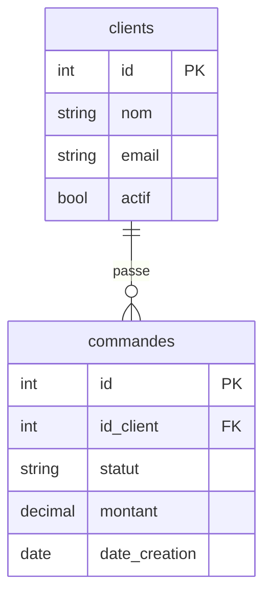
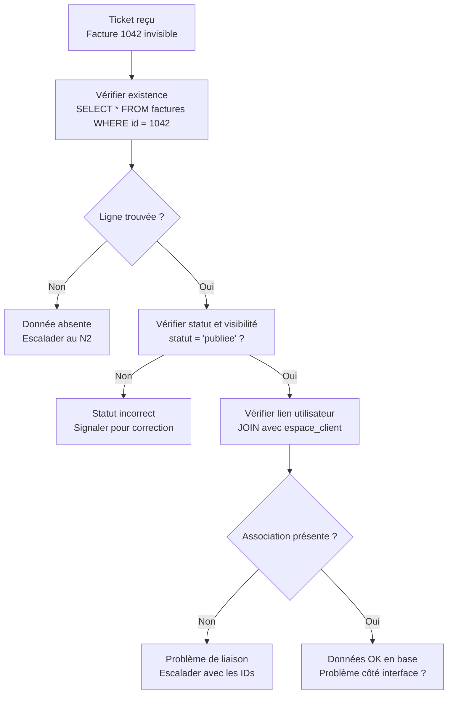

# SQL pour le support applicatif

## Objectifs pédagogiques

À la fin de ce module, vous serez capable de :

- **Lire** et comprendre une requête SQL simple pour diagnostiquer un problème utilisateur
- **Interroger** une base de données pour vérifier l'état d'une donnée (présence, valeur, statut)
- **Identifier** l'origine d'une anomalie applicative via une requête ciblée
- **Utiliser** les filtres, jointures et agrégats de base pour répondre à une question métier concrète
- **Éviter** les erreurs courantes qui peuvent impacter les données en production

---

## Mise en situation

Vous êtes technicien support dans une société de logistique. Un commercial appelle : *"Mon client n'apparaît plus dans la liste des destinataires, mais je suis sûr qu'il existe dans le système."*

Pas d'accès à l'interface graphique ce matin — elle est en maintenance. Votre responsable vous dit : *"Vas directement vérifier en base."*

Vous avez un accès en lecture à la base PostgreSQL de production. Deux options : attendre que la maintenance se termine, ou aller chercher l'information vous-même en deux minutes.

C'est exactement pour ça que SQL est utile en support. Pas pour développer des applications — pour **poser des questions directement à la base de données** et comprendre ce qui se passe, maintenant, sans intermédiaire.

---

## Pourquoi SQL en support ?

La plupart des applications métier — ERP, CRM, logiciels RH, outils de facturation — stockent leurs données dans une base relationnelle. MySQL, PostgreSQL, SQL Server, Oracle : les technologies changent, mais le langage pour les interroger reste fondamentalement le même.

En support niveau 1, vous passez souvent par une interface graphique pour consulter les données. Mais cette interface a des limites : elle ne montre pas toujours tout, elle peut être indisponible, ou elle ne permet pas de croiser des informations provenant de plusieurs tables.

SQL vous donne un accès direct. Pas pour modifier n'importe quoi — vous ne devriez jamais faire de `UPDATE` ou `DELETE` en production sans protocole strict — mais pour **lire, comprendre et diagnostiquer**.

> 🧠 Une base de données relationnelle, c'est un ensemble de tableaux liés entre eux. SQL est le langage qui permet de poser des questions à ces tableaux : *"Montre-moi les lignes qui correspondent à telle condition."*

---

## La structure d'une base : tables, colonnes, lignes

Imaginez un fichier Excel avec plusieurs onglets. Chaque onglet est une **table**. Chaque colonne est un **champ** (nom, email, statut…). Chaque ligne est un **enregistrement**.

La différence avec Excel : les tables sont reliées entre elles. Un client a un identifiant unique (`id_client`). Ses commandes, dans une autre table, font référence à cet identifiant. C'est ce qu'on appelle une **clé étrangère** — le fil qui relie les tableaux entre eux.

```
Table : clients                  Table : commandes
┌────┬──────────┬────────┐       ┌──────┬────────────┬──────────┐
│ id │ nom      │ actif  │       │ id   │ id_client  │ montant  │
├────┼──────────┼────────┤       ├──────┼────────────┼──────────┤
│  1 │ Dupont   │ true   │       │  101 │     1      │  450.00  │
│  2 │ Martin   │ false  │       │  102 │     1      │  230.00  │
│  3 │ Lefevre  │ true   │       │  103 │     3      │  890.00  │
└────┴──────────┴────────┘       └──────┴────────────┴──────────┘
```

Martin (id=2) a `actif = false`. Si l'interface n'affiche que les clients actifs, il disparaît — sans avoir été supprimé pour autant. Ce genre de cas se diagnostique en trente secondes avec SQL.

### L'anatomie d'une requête SELECT

Une requête SQL suit toujours le même ordre logique :

```sql
SELECT   quoi afficher
FROM     quelle table
WHERE    quelle condition
ORDER BY dans quel ordre
LIMIT    combien de lignes
```

Chaque clause est optionnelle sauf `SELECT` et `FROM`. On n'écrit que ce dont on a besoin.

---

## Les opérations de diagnostic, une par une

### Vérifier qu'un enregistrement existe

Le cas le plus fréquent en support : *"Est-ce que cette donnée est bien en base ?"*

```sql
SELECT id, nom, email, actif
FROM clients
WHERE nom = 'Martin';
```

`SELECT *` serait plus rapide à écrire, mais sur une table volumineuse, lister uniquement les colonnes utiles est plus rapide à exécuter et bien plus lisible dans le résultat.

**Résultat attendu :**
```
 id | nom    | email              | actif
----+--------+--------------------+-------
  2 | Martin | martin@exemple.com | false
```

Le client existe. Il est juste inactif. Vous pouvez répondre au commercial sans attendre la fin de la maintenance.

> 💡 Les comparaisons texte sont sensibles à la casse dans certaines bases, PostgreSQL en particulier. Si `WHERE nom = 'martin'` ne retourne rien mais que `'Martin'` fonctionne, c'est normal. Utilisez `LOWER(nom) = 'martin'` pour chercher sans tenir compte de la casse.

---

### Filtrer avec des conditions

`WHERE` accepte des conditions combinées avec `AND`, `OR` et `NOT`.

**Cas concret :** lister tous les utilisateurs inactifs depuis plus de trente jours.

```sql
SELECT id, nom, email, derniere_connexion
FROM utilisateurs
WHERE actif = false
  AND derniere_connexion < NOW() - INTERVAL '30 days';
```

> ⚠️ `NOW() - INTERVAL '30 days'` est une syntaxe PostgreSQL. Sur MySQL : `DATE_SUB(NOW(), INTERVAL 30 DAY)`. Sur SQL Server : `DATEADD(day, -30, GETDATE())`. La logique est identique — seule la syntaxe change selon le moteur de base de données.

Deux autres formes utiles à connaître : `IN` pour tester plusieurs valeurs d'un coup, et `LIKE` pour une recherche approximative sur du texte.

```sql
-- Moins lisible
WHERE statut = 'annule' OR statut = 'suspendu' OR statut = 'bloque'

-- Même résultat, bien plus lisible
WHERE statut IN ('annule', 'suspendu', 'bloque')
```

```sql
-- Tous les clients dont l'email est sur le domaine @dupont.fr
SELECT * FROM clients WHERE email LIKE '%@dupont.fr';
-- % = n'importe quel nombre de caractères
```

---

### Compter et agréger des données

Quelqu'un signale que *"les statistiques du tableau de bord semblent fausses"*. Avant d'escalader, vous pouvez recalculer le chiffre directement en base.

```sql
SELECT COUNT(*) AS nombre_commandes
FROM commandes
WHERE statut = 'validee'
  AND DATE(date_creation) = CURRENT_DATE;
```

`COUNT(*)` compte toutes les lignes. `AS` renomme la colonne dans le résultat — ça n'affecte pas la base, c'est juste pour la lisibilité.

Pour aller plus loin, `GROUP BY` compte par catégorie :

```sql
SELECT statut, COUNT(*) AS nombre
FROM commandes
GROUP BY statut
ORDER BY nombre DESC;
```

**Résultat :**
```
 statut     | nombre
------------+--------
 validee    |   1423
 en_attente |    287
 annulee    |     54
 erreur     |     12
```

D'un coup d'œil, vous repérez 12 commandes en erreur. Ce genre de requête transforme une investigation de dix minutes en cinq secondes.

---

### Joindre deux tables

Les données utiles sont rarement dans une seule table. La **jointure** (`JOIN`) permet de croiser les informations de plusieurs tables en utilisant les clés qui les relient.

**Cas concret :** afficher les commandes en erreur avec le nom et l'email du client — pas juste son identifiant.



```sql
SELECT
    c.nom,
    c.email,
    cmd.statut,
    cmd.montant,
    cmd.date_creation
FROM commandes cmd
JOIN clients c ON cmd.id_client = c.id
WHERE cmd.statut = 'erreur';
```

On **aliase** les tables (`cmd` pour commandes, `c` pour clients) pour éviter de répéter les noms complets à chaque colonne. La clause `ON` précise comment les deux tables se rejoignent.

> 🧠 `JOIN` (ou `INNER JOIN`) ne retourne que les lignes qui ont une correspondance dans les **deux** tables. Si une commande référence un `id_client` qui n'existe plus dans la table `clients`, cette commande disparaît du résultat. Pour voir quand même les lignes sans correspondance, on utilise `LEFT JOIN`.

```sql
-- Toutes les commandes, même si le client associé n'existe plus
SELECT cmd.id, cmd.statut, c.nom
FROM commandes cmd
LEFT JOIN clients c ON cmd.id_client = c.id;
```

Les lignes où `c.nom` est `NULL` dans le résultat sont des commandes **orphelines** — client supprimé ou `id_client` invalide. C'est souvent révélateur d'un problème de cohérence de données.

---

### Diagnostiquer une anomalie en base : workflow complet

Voici comment structurer une investigation quand un utilisateur signale une donnée invisible ou incorrecte. Cas : *"Ma facture n°1042 n'est pas visible dans mon espace client, mais on me dit qu'elle est bien créée."*



**Étape 1 — La facture existe-t-elle ?**

```sql
SELECT id, statut, id_client, date_creation
FROM factures
WHERE id = 1042;
```

**Étape 2 — Son statut permet-il l'affichage ?**

```sql
SELECT id, statut, visible_client
FROM factures
WHERE id = 1042;
-- Si visible_client = false ou statut != 'publiee' → on tient le coupable
```

**Étape 3 — Est-elle rattachée au bon utilisateur ?**

```sql
SELECT f.id, f.statut, u.email
FROM factures f
JOIN utilisateurs u ON f.id_client = u.id
WHERE f.id = 1042;
```

Chaque étape réduit le champ des possibles. L'objectif n'est pas de résoudre le problème seul, mais de monter un ticket avec des éléments précis : *"La facture existe, statut = publiee, visible_client = true, mais l'association avec l'utilisateur id=87 est absente de la table factures_utilisateurs."* C'est ça qui fait la différence entre un ticket escaladé en dix minutes et un ticket ouvert pendant trois jours.

---

### Ce qu'on ne fait pas en support sans protocole

Vous avez peut-être un accès en écriture. Ça ne signifie pas qu'il faut l'utiliser librement.

```sql
-- ⛔ NE JAMAIS FAIRE ÇA sans validation explicite et backup
UPDATE utilisateurs SET actif = true WHERE nom = 'Martin';
DELETE FROM commandes WHERE statut = 'erreur';
```

> ⚠️ En production, toute modification de données — `UPDATE`, `DELETE`, `INSERT` — doit être validée par votre N2 ou responsable technique, documentée dans un ticket, et précédée d'une vérification du `SELECT` correspondant. Un `UPDATE` sans `WHERE` précis peut corrompre des milliers de lignes en une seconde. Il n'y a pas de CTRL+Z.

La bonne pratique avant tout `UPDATE` : exécutez d'abord le `SELECT` équivalent pour visualiser exactement ce qui sera modifié, puis filtrez par ID technique — jamais par un libellé texte seul.

```sql
-- D'abord, visualiser
SELECT id, nom, actif FROM utilisateurs WHERE nom = 'Martin';

-- Ensuite seulement, si validé
UPDATE utilisateurs SET actif = true WHERE id = 2;
-- L'ID est unique. Le nom peut avoir des doublons.
```

---

## Cas réel en entreprise

**Secteur :** E-commerce — environ 500 000 commandes par mois  
**Problème :** Des clients signalent que leurs remises promotionnelles ne s'appliquent pas à la commande, même après avoir saisi le bon code promo.

Le support reçoit 40 tickets similaires en deux heures. Plutôt que de traiter chaque cas individuellement, un technicien N2 pose la question directement en base :

```sql
SELECT
    cp.code,
    cp.date_expiration,
    cp.actif,
    COUNT(c.id) AS commandes_concernees
FROM codes_promo cp
JOIN commandes c ON c.id_code_promo = cp.id
WHERE c.date_creation >= NOW() - INTERVAL '3 hours'
  AND c.remise_appliquee = 0
GROUP BY cp.code, cp.date_expiration, cp.actif;
```

**Résultat :**
```
 code        | date_expiration | actif | commandes_concernees
-------------+-----------------+-------+---------------------
 PROMO20AOUT | 2024-08-31      | false |                  43
```

En trente secondes, le diagnostic est posé : le code existe, mais son flag `actif` a été mis à `false` par une tâche automatique de fin de mois déclenchée avec un jour d'avance. Le problème touche 43 commandes. L'information remonte au N3 avec toutes les données nécessaires — correction et communication client bouclées en moins d'une heure.

---

## Bonnes pratiques

**Explorer sans risquer**  
Ajoutez toujours un `LIMIT 10` avant de lancer un `SELECT` exploratoire sur une table inconnue. Une requête mal filtrée sur une table à plusieurs millions de lignes peut saturer la base et dégrader les performances pour tous les utilisateurs. Si vous ne connaissez pas le volume d'une table, commencez par `SELECT COUNT(*) FROM la_table` — ça coûte peu et ça évite les mauvaises surprises.

**Nommer clairement, lire facilement**  
Utilisez des alias explicites dès que vous faites des jointures (`clients c`, `commandes cmd`). Écrivez les mots-clés SQL en majuscules (`SELECT`, `FROM`, `WHERE`) et les noms de tables et colonnes en minuscules : c'est une convention largement partagée qui rend le code immédiatement lisible. Commentez vos requêtes complexes avec `--` quand vous les partagez dans un ticket — votre N2 vous en remerciera.

**Filtrer par ID, pas par libellé**  
`WHERE id = 42` est plus fiable que `WHERE nom = 'Dupont'`. Un identifiant est unique par définition. Un nom peut avoir des doublons, des variantes de casse, des espaces invisibles. En production, un mauvais filtre texte peut cibler plus de lignes que prévu — avec des conséquences si vous avez la main sur un `UPDATE`.

**Lire d'abord, écrire jamais sans validation**  
Si vous n'avez pas encore de compte en lecture seule sur les bases de production, demandez-en un. C'est une protection pour vous autant que pour les données. Et si vous êtes amené à faire un `UPDATE` ou un `DELETE` : `SELECT` d'abord, validation N2 ensuite, modification avec l'ID précis en dernier.

**Garder une trace**  
Copiez vos requêtes dans le ticket correspondant. Si un incident survient plus tard, vous avez une trace de ce que vous avez lu — et de ce que vous n'avez pas modifié.

---

## Résumé

| Concept | Ce que ça fait | À retenir |
|---|---|---|
| `SELECT` | Choisit les colonnes à afficher | Toujours présent dans une requête de lecture |
| `FROM` | Indique la table source | Associé à `SELECT` |
| `WHERE` | Filtre les lignes selon une condition | Toujours vérifier avec un `SELECT` avant un `UPDATE` |
| `JOIN` | Combine deux tables via une clé commune | Correspondance obligatoire dans les deux tables |
| `LEFT JOIN` | Combine deux tables, conserve les lignes sans correspondance | Les colonnes de droite sont `NULL` si pas de correspondance |
| `GROUP BY` | Agrège les lignes par valeur | Utilisé avec `COUNT`, `SUM`, `AVG`… |
| `COUNT(*)` | Compte le nombre de lignes | Outil de vérification rapide en diagnostic |
| `LIKE` | Recherche partielle sur du texte | `%` = n'importe quelle séquence de caractères |
| `IN` | Teste l'appartenance à une liste | Alternative lisible à plusieurs `OR` |
| `LIMIT` | Restreint le nombre de lignes retournées | Essentiel avant d'explorer une grande table |
| `NULL` | Absence de valeur | `IS NULL` / `IS NOT NULL` — jamais `= NULL` |

SQL en support, c'est avant tout un outil de **lecture et de diagnostic**. Vous n'avez pas besoin de maîtriser les transactions, les procédures stockées ou l'optimisation des index pour être efficace au quotidien. Savoir poser la bonne question à la base — précisément, rapidement, sans risque — c'est déjà ce qui fait la différence entre un ticket résolu en dix minutes et un ticket ouvert pendant trois jours.

---

<!-- snippet
id: sql_select_base
type: command
tech: SQL
level: beginner
importance: high
format: knowledge
tags: sql,select,lecture,support,requete
title: Requête SELECT de base pour vérifier une donnée
command: SELECT <COLONNES> FROM <TABLE> WHERE <COLONNE> = '<VALEUR>';
example: SELECT id, nom, email, actif FROM clients WHERE nom = 'Martin';
description: Point d'entrée de tout diagnostic en base. Toujours préférer lister les colonnes utiles plutôt que SELECT * sur une table volumineuse.
-->

<!-- snippet
id: sql_select_star_limit
type: warning
tech: SQL
level: beginner
importance: high
format: knowledge
tags: sql,performance,production,limit,select
title: Ne jamais faire SELECT * sans LIMIT sur une grande table
content: Piège → lancer SELECT * FROM commandes sur une table à 10M lignes peut saturer la base et impacter les utilisateurs en prod. Conséquence → la requête tourne plusieurs minutes et verrouille des ressources. Correction → ajouter LIMIT 100 pour explorer, ou vérifier d'abord SELECT COUNT(*) FROM commandes pour estimer le volume.
description: Un SELECT * sans LIMIT sur une table volumineuse peut bloquer la base en production. Toujours estimer le volume avant d'explorer.
-->

<!-- snippet
id: sql_where_update_select_avant
type: warning
tech: SQL
level: beginner
importance: high
format: knowledge
tags: sql,update,production,securite,donnees
title: Toujours exécuter le SELECT avant un UPDATE en production
content: Piège → exécuter UPDATE utilisateurs SET actif = true WHERE nom = 'Martin' sans vérifier. Conséquence → si plusieurs lignes ont ce nom, toutes seront modifiées. Correction → lancer d'abord SELECT id, nom, actif FROM utilisateurs WHERE nom = 'Martin', vérifier le résultat, puis UPDATE avec l'ID précis : UPDATE utilisateurs SET actif = true WHERE id = 2.
description: Avant tout UPDATE en prod, visualiser les lignes ciblées avec le SELECT équivalent. Utiliser l'ID technique, jamais un libellé texte seul.
-->

<!-- snippet
id: sql_join_inner_vs_left
type: concept
tech: SQL
level: beginner
importance: high
format: knowledge
tags: sql,join,left-join,jointure,diagnostic
title: INNER JOIN vs LEFT JOIN — quelle différence concrète
content: INNER JOIN ne retourne que les lignes ayant une correspondance dans les deux tables. Si une commande a un id_client qui n'existe plus dans la table clients, elle disparaît du résultat. LEFT JOIN retourne toutes les lignes de la table de gauche, même sans correspondance — les colonnes de la table de droite seront NULL. Utiliser LEFT JOIN pour détecter les enregistrements orphelins (données incohérentes).
description: INNER JOIN = correspondance obligatoire dans les deux tables. LEFT JOIN = toutes les lignes de gauche, NULL si pas de correspondance à droite.
-->

<!-- snippet
id: sql_count_group_by
type: command
tech: SQL
level: beginner
importance: medium
format: knowledge
tags: sql,count,group-by,agregation,diagnostic
title: Compter les enregistrements par statut avec GROUP BY
command: SELECT <COLONNE_STATUT>, COUNT(*) AS nombre FROM <TABLE> GROUP BY <COLONNE_STATUT> ORDER BY nombre DESC;
example: SELECT statut, COUNT(*) AS nombre FROM commandes GROUP BY statut ORDER BY nombre DESC;
description: Permet de recalculer un indicateur tableau de bord directement en base, ou de repérer une anomalie de distribution (ex : pic soudain d'erreurs).
-->

<!-- snippet
id: sql_like_recherche_partielle
type: command
tech: SQL
level: beginner
importance: medium
format: knowledge
tags: sql,like,texte,recherche,filtre
title: Recherche partielle sur du texte avec LIKE
command: SELECT * FROM <TABLE> WHERE <COLONNE> LIKE '%<VALEUR>%';
example: SELECT * FROM clients WHERE email LIKE '%@dupont.fr';
description: % remplace n'importe quelle séquence de caractères. Utile pour chercher un email ou un nom approximatif. Attention : LIKE sans index est lent sur les grandes tables.
-->

<!-- snippet
id: sql_null_comparaison
type: warning
tech: SQL
level: beginner
importance: high
format: knowledge
tags: sql,null,comparaison,piege,where
title: NULL ne se compare jamais avec = mais avec IS NULL
content: Piège → WHERE id_client = NULL ne retourne jamais rien, même si des lignes ont id_client à NULL. Cause → NULL n'est pas une valeur, c'est une absence de valeur ; aucune comparaison avec = ne peut être vraie. Correction → utiliser WHERE id_client IS NULL ou WHERE id_client IS NOT NULL.
description: En SQL, NULL = NULL est toujours faux. Pour tester l'absence de valeur, utiliser IS NULL ou IS NOT NULL.
-->

<!-- snippet
id: sql_casse_lower
type: tip
tech: SQL
level: beginner
importance: medium
format: knowledge
tags: sql,casse,texte,postgresql,filtre
title: Rechercher un texte sans tenir compte de la casse avec LOWER()
content: En PostgreSQL, WHERE nom = 'martin' et WHERE nom = 'Martin' donnent des résultats différents. Pour ignorer la casse : WHERE LOWER(nom) = 'martin'. Sur MySQL en configuration par défaut, les comparaisons texte sont insensibles à la casse — comportement à vérifier selon le SGBD.
description: PostgreSQL est sensible à la casse par défaut. Envelopper la colonne dans LOWER() pour une recherche insensible à la casse.
-->

<!-- snippet
id: sql_in_valeurs_multiples
type: tip
tech: SQL
level: beginner
importance: low
format: knowledge
tags: sql,in,filtre,lisibilite,where
title: Remplacer les OR répétés par IN pour plus de lisibilité
content: Plutôt que WHERE statut = 'annule' OR statut = 'suspendu' OR statut = 'bloque', écrire WHERE statut IN ('annule', 'suspendu', 'bloque'). Le résultat est identique, la lisibilité bien meilleure. IN fonctionne aussi avec des sous-requêtes : WHERE id IN (SELECT id FROM ...).
description: IN remplace une série de OR sur la même colonne. Plus lisible et extensible — il suffit d'ajouter une valeur dans la liste.
-->

<!-- snippet
id: sql_intervalle_date
type: command
tech: SQL
level: beginner
importance: medium
format: knowledge
tags: sql,date,intervalle,postgresql,filtre
title: Filtrer sur un intervalle de temps relatif (dernières N heures)
command: SELECT * FROM <TABLE> WHERE <COLONNE_DATE> >= NOW() - INTERVAL '<N> <UNITE>';
example: SELECT * FROM commandes WHERE date_creation >= NOW() - INTERVAL '3 hours';
description: Syntaxe PostgreSQL pour les intervalles relatifs. MySQL utilise DATE_SUB(NOW(), INTERVAL 3 HOUR), SQL Server utilise DATEADD(hour, -3, GETDATE()). La logique est identique, la syntaxe change.
-->
