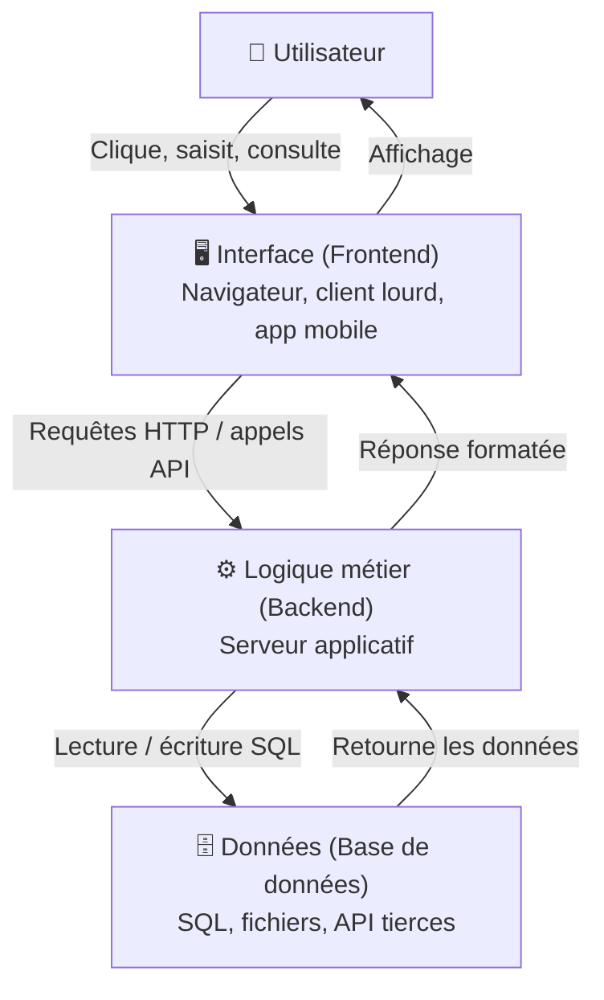
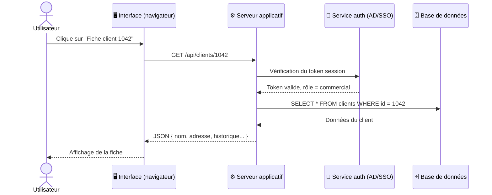

# Comprendre une application métier

## Objectifs pédagogiques

À l'issue de ce module, vous serez capable de :

1. **Expliquer** ce qu'est une application métier et en quoi elle diffère d'un outil généraliste
2. **Identifier** les trois couches qui composent une application et le rôle de chacune
3. **Nommer** les composants périphériques typiques d'une application en production
4. **Reconnaître** quel composant est probablement en cause lors d'un incident donné
5. **Lire** une architecture applicative simple pour situer un dysfonctionnement

---

## Mise en situation

Vous venez d'intégrer une équipe support. Dès le premier matin, un utilisateur vous appelle : *"Mon application de facturation ne charge plus les clients."*

Vous ouvrez le ticket. La description est vague. Vous regardez l'écran de l'utilisateur — une interface web, un message d'erreur générique. Vous ne savez pas si le problème vient du réseau, de la base de données, du serveur applicatif, d'un droit d'accès ou d'un bug.

Sans comprendre comment fonctionne cette application — ce qu'elle fait, de quoi elle est composée, comment les pièces s'articulent — vous ne pouvez pas poser les bonnes questions. Vous ne savez pas par où commencer.

C'est exactement ce que ce module vous donne : une carte du terrain avant de partir en patrouille.

---

## Ce qu'est une application métier — et pourquoi c'est différent

Un traitement de texte, un navigateur, un lecteur PDF : ce sont des outils généralistes. Ils ne savent rien de votre entreprise. Ils manipulent des données abstraites — du texte, des fichiers, des images — sans connaître le contexte dans lequel ils s'utilisent.

Une **application métier**, c'est tout l'opposé. Elle a été conçue — ou configurée — pour répondre à un besoin précis d'une organisation : gérer des commandes, suivre des dossiers patients, calculer des paies, planifier des interventions terrain. Elle encode les règles du secteur, parfois les contraintes légales, et elle manipule des données qui ont une valeur opérationnelle directe.

🧠 **Concept clé** — Une application métier encode la logique de fonctionnement d'une activité. Quand elle tombe en panne, ce n'est pas une gêne : c'est un arrêt de travail.

Concrètement, ça change tout pour le support. Une panne sur Word embête un utilisateur. Une panne sur l'ERP d'un entrepôt peut bloquer 200 préparateurs de commandes et paralyser les expéditions de la journée. C'est pourquoi comprendre **ce que fait** l'application — avant même de comprendre **comment elle est construite** — est la première compétence d'un technicien support applicatif.

<!-- snippet
id: appmetier_definition_metier
type: concept
tech: support-applicatif
level: beginner
importance: medium
format: knowledge
tags: application-métier, erp, crm, définition
title: Application métier vs outil généraliste
content: Un outil généraliste (Word, Excel, navigateur) traite des données abstraites sans connaître le contexte de l'entreprise. Une application métier encode les règles d'un secteur ou d'une activité : règles de gestion, données opérationnelles, processus propres à l'organisation. Conséquence support : la panne d'une appli métier = arrêt d'activité, pas seulement une gêne utilisateur.
description: L'impact d'une panne sur une appli métier est directement opérationnel — facturation bloquée, stocks gelés, dossiers inaccessibles.
-->

---

## Les grandes familles d'applications métier

Avant d'entrer dans les mécanismes internes, il est utile de savoir à quoi vous allez avoir affaire. Les applications métier se regroupent en quelques grandes catégories que vous croiserez régulièrement :

| Famille | Ce qu'elle fait | Exemples courants |
|--------|-----------------|-------------------|
| **ERP** (Enterprise Resource Planning) | Gère l'ensemble des ressources de l'entreprise : finance, stocks, RH, achats | SAP, Sage, Odoo |
| **CRM** (Customer Relationship Management) | Gère la relation client, les prospects, les ventes | Salesforce, HubSpot, Zoho |
| **Métier sectoriel** | Spécifique à un secteur (santé, BTP, transport…) | Logiciel de paie, dossier patient, GMAO |
| **Intranet / portail** | Interface centralisée pour les collaborateurs | Outils RH, demandes de congés, bases de connaissances |
| **Application maison** | Développée en interne pour un besoin très spécifique | Outil de reporting custom, interface de traitement de données |

Ce découpage est utile pour se repérer, mais ne vous y attachez pas trop : en pratique, les frontières sont floues. Un ERP moderne intègre souvent un CRM. L'important, c'est de comprendre **ce que les utilisateurs font avec l'outil**, pas son étiquette commerciale.

---

## Anatomie d'une application métier : les trois couches

La grande majorité des applications métier modernes reposent sur une architecture en **trois couches**. C'est un modèle conceptuel, pas une règle absolue — mais il couvre 90 % de ce que vous verrez en production.

**La couche présentation** — c'est ce que l'utilisateur voit. Un navigateur web, une application installée sur le poste (client lourd), parfois une app mobile. Elle n'a pas de logique métier : elle affiche, collecte les saisies, et transmet.

**La couche logique métier** — c'est le cerveau. C'est ici que les règles sont appliquées : *"une commande ne peut pas être validée si le stock est insuffisant"*, *"un congé doit être approuvé par le manager avant d'être enregistré"*. Ce traitement tourne sur un **serveur applicatif** — une machine que l'utilisateur ne voit jamais.

**La couche données** — c'est la mémoire. Elle stocke tout ce qui doit persister : les clients, les commandes, les factures, les comptes utilisateurs. Le plus souvent, c'est une **base de données relationnelle** (PostgreSQL, MySQL, Oracle, SQL Server). Parfois des fichiers, parfois des services tiers.

⚠️ **Erreur fréquente** — Beaucoup de débutants supposent que "le problème vient du serveur" dès qu'une page ne s'affiche pas. En réalité, l'incident peut se situer dans n'importe laquelle des trois couches — ou dans la communication entre elles. La démarche de diagnostic consiste précisément à isoler la couche fautive avant d'agir.

<!-- snippet
id: appmetier_architecture_couches
type: concept
tech: support-applicatif
level: beginner
importance: high
format: knowledge
tags: architecture, couches, backend, frontend, base-de-données
title: Les 3 couches d'une application métier
content: Toute application métier est divisée en 3 couches : (1) Frontend — interface utilisateur (navigateur, client lourd), (2) Backend — logique métier sur un serveur applicatif, (3) Base de données — stockage persistant. Un incident peut toucher n'importe quelle couche ou la communication entre elles. Isoler la couche fautive est la première étape du diagnostic.
description: Couche 1 = ce que voit l'utilisateur, couche 2 = traitement serveur, couche 3 = stockage. Localiser la couche en cause avant d'agir.
-->

---

## Ce qui gravite autour de l'application

Les trois couches, c'est le cœur. Mais une application en production ne vit jamais seule. Elle est entourée d'une infrastructure que vous allez croiser dès vos premières interventions — et dont la défaillance peut bloquer l'application sans qu'elle soit elle-même en cause.

| Composant | Rôle | Pourquoi c'est important en support |
|-----------|------|-------------------------------------|
| **Serveur web / reverse proxy** | Reçoit les requêtes HTTP et les redirige vers l'application | Un NGINX ou Apache mal configuré peut bloquer l'accès sans toucher à l'appli |
| **Base de données** | Stocke les données persistantes | Lente ou indisponible → l'application répond en erreur ou en timeout |
| **Serveur de fichiers** | Stocke les pièces jointes, exports, images | Un chemin cassé et les documents n'apparaissent plus |
| **Service d'authentification** | Vérifie les identités (LDAP, Active Directory, SSO) | Si ce service tombe, personne ne peut se connecter |
| **Scheduler / cron** | Exécute des tâches planifiées (imports, exports, calculs) | Un traitement de nuit qui n'a pas tourné peut fausser les données du matin |
| **API tierce** | Fournit des données externes (géolocalisation, paiement, météo…) | Une API externe indisponible peut bloquer une fonctionnalité clé |

💡 **Astuce** — Quand un utilisateur signale un problème intermittent ou "qui arrive surtout le matin", pensez immédiatement aux **tâches planifiées**. Un traitement de nuit qui échoue silencieusement laisse des traces dans les logs — et des données incohérentes dans l'interface.

<!-- snippet
id: appmetier_composants_gravitants
type: concept
tech: support-applicatif
level: beginner
importance: medium
format: knowledge
tags: infrastructure, reverse-proxy, authentification, api, scheduler
title: Composants périphériques d'une application métier
content: Au-delà des 3 couches, une application en production dépend de : reverse proxy (NGINX/Apache) pour router les requêtes, service d'authentification (AD, SSO, LDAP) pour valider les identités, serveur de fichiers pour les pièces jointes et exports, scheduler pour les traitements automatiques, APIs tierces pour les données externes. La panne de l'un de ces composants peut bloquer l'application sans qu'elle soit elle-même défaillante.
description: Une application peut sembler "en panne" alors que c'est un composant périphérique (auth, scheduler, API) qui est indisponible.
-->

<!-- snippet
id: appmetier_scheduler_invisible
type: warning
tech: support-applicatif
level: beginner
importance: high
format: knowledge
tags: scheduler, cron, logs, données, incident
title: Données figées le matin — penser au scheduler nocturne
content: Piège : si les données affichées sont correctes mais "en retard" (chiffres de la veille, stocks non mis à jour), le problème vient rarement de l'application elle-même. La cause probable est un job planifié (cron, scheduler) qui a échoué silencieusement la nuit. Vérifier les logs du scheduler en priorité, pas les logs applicatifs.
description: Un scheduler qui échoue ne génère pas d'erreur visible dans l'interface — les données sont juste figées. Chercher dans les logs de jobs planifiés.
-->

---

## Comment une action utilisateur traverse l'application

Rien de mieux qu'un exemple concret pour ancrer tout ça. Voici ce qui se passe réellement quand un utilisateur clique sur "Afficher la fiche client n°1042" dans un CRM.

En quelques millisecondes, l'action d'un seul clic traverse au moins quatre composants distincts. Si l'un d'eux répond mal — ou ne répond plus — l'utilisateur voit une erreur, un écran blanc, ou un chargement infini.

Le rôle du technicien support, c'est de remonter ce chemin à l'envers : qu'est-ce que l'utilisateur a vu exactement ? Où dans ce flux l'erreur s'est-elle produite ? Est-ce que d'autres utilisateurs sont touchés ? Est-ce que ça fonctionne en preprod ?

---

## Ce que ça change dans votre façon de travailler

Comprendre l'architecture d'une application ne sert pas à la redévelopper. Ça sert à **poser les bonnes questions dans le bon ordre** — et à éviter les actions précipitées qui masquent le vrai problème.

Quand un utilisateur vous dit que son application "ne fonctionne pas", vous pouvez maintenant structurer votre analyse :

1. **L'interface se charge-t-elle ?** → Si non : réseau, DNS, serveur web, ou certificat SSL.
2. **L'utilisateur peut-il se connecter ?** → Si non : service d'authentification ou droits d'accès.
3. **Les données s'affichent-elles ?** → Si non : probablement la base de données ou la logique métier.
4. **Une seule fonctionnalité est-elle touchée ?** → Bug applicatif ou dépendance externe (API, fichier, scheduler).

C'est ce qu'on appelle un raisonnement par isolation — et c'est le fondement du diagnostic applicatif.

<!-- snippet
id: appmetier_diagnostic_ordre
type: tip
tech: support-applicatif
level: beginner
importance: high
format: knowledge
tags: diagnostic, méthodologie, isolation, incident
title: Ordre de diagnostic par couche applicative
content: Face à un dysfonctionnement applicatif : (1) L'interface se charge-t-elle ? → réseau / DNS / serveur web. (2) L'utilisateur peut-il se connecter ? → auth / droits. (3) Les données s'affichent-elles ? → backend ou base de données. (4) Une seule fonction est touchée ? → bug applicatif ou dépendance externe. Toujours isoler avant d'agir.
description: Raisonner couche par couche évite les redémarrages "à l'aveugle" qui masquent le vrai problème sans le résoudre.
-->

<!-- snippet
id: appmetier_erreur_redemarrage_aveugle
type: error
tech: support-applicatif
level: beginner
importance: high
format: knowledge
tags: diagnostic, redémarrage, méthodologie, erreur-fréquente
title: Redémarrer sans diagnostiquer — le piège classique
content: Symptôme : application lente ou en erreur. Réflexe incorrect : redémarrer le serveur applicatif immédiatement. Cause du piège : le redémarrage peut masquer temporairement le problème sans le résoudre (ex : une base de données saturée, un disque plein, une API tierce en timeout). Correction : isoler d'abord la couche en cause via les logs, puis agir de manière ciblée. Le redémarrage est une action de dernier recours, pas de premier réflexe.
description: Redémarrer sans diagnostic masque le problème et empêche d'en identifier la cause — ce qui garantit une récidive.
-->

---

## Cas réel : une panne qui venait… du scheduler

Un technicien support reçoit un ticket à 9h : *"Les tableaux de bord des commerciaux n'affichent pas les chiffres du jour."*

L'application fonctionne : les utilisateurs se connectent, naviguent, accèdent aux fiches clients. Mais les indicateurs de vente affichent les données de la veille.

Le technicien vérifie l'interface — elle répond. Il vérifie la base de données — elle est accessible, les données brutes des ventes sont bien présentes. Il consulte les logs du backend — aucune erreur applicative.

C'est en regardant les **logs du scheduler** qu'il trouve la cause : un job de consolidation nocturne — qui calcule les agrégats de vente et alimente la table des indicateurs — a échoué à 3h du matin à cause d'un espace disque insuffisant sur le serveur de base de données.

**Résultat :** aucune couche applicative n'était défaillante. Tout fonctionnait — sauf la tâche qui devait alimenter les données. Sans une vision complète de l'écosystème applicatif, ce type de panne est presque impossible à diagnostiquer rapidement. Avec cette vision, il faut moins de dix minutes pour orienter le diagnostic au bon endroit.

---

## Bonnes pratiques pour démarrer

Quand vous prenez en charge une application métier que vous ne connaissez pas encore, voici les réflexes à acquérir dès les premiers jours.

**Commencez par comprendre le métier, pas la technique.** Avant de regarder les logs, demandez : à quoi sert cette application ? Qui l'utilise ? Quels sont les processus critiques ? Un ERP de gestion de stocks a des priorités différentes d'un portail RH — et les incidents n'ont pas le même niveau d'urgence.

**Cartographiez l'environnement dès que possible.** Demandez ou cherchez dans la documentation : combien de serveurs ? Quelle base de données ? Y a-t-il un service d'authentification centralisé ? Des APIs tierces ? Des jobs planifiés ? Vous n'avez pas besoin de tout comprendre le premier jour — mais vous devez savoir que ces composants existent.

**Identifiez les environnements disponibles.** Prod, preprod, recette : savoir ce qui tourne où vous permettra de reproduire les problèmes sans risque pour la production.

**Ne redémarrez jamais "à l'aveugle".** Le redémarrage d'un serveur est parfois nécessaire — mais c'est une action de dernier recours, pas de premier réflexe. Isolez d'abord la couche en cause, consultez les logs, puis agissez de manière ciblée.

**Identifiez la personne qui connaît l'application sur le bout des doigts.** Dans chaque équipe, il y a quelqu'un qui a une connaissance profonde d'une application — son historique, ses bizarreries, ses dépendances cachées. Repérez cette personne dès le début. C'est votre première source de vérité quand la documentation manque.

💡 **Astuce** — La documentation technique est souvent sommaire, parfois inexistante. Mais les incidents passés, eux, sont toujours quelque part : dans les tickets anciens, les emails d'équipe, les notes de post-mortem. Exploiter l'historique des incidents est souvent plus efficace que de chercher un schéma d'architecture à jour.

<!-- snippet
id: appmetier_approche_decouverte
type: tip
tech: support-applicatif
level: beginner
importance: medium
format: knowledge
tags: onboarding, documentation, contexte, métier
title: Prendre en main une appli inconnue — commencer par le métier
content: Avant de lire les logs d'une application inconnue, répondre à 3 questions : (1) À quoi sert-elle concrètement ? (2) Qui l'utilise et à quelle fréquence ? (3) Quels processus sont critiques ? Ensuite identifier : nombre de serveurs, type de base de données, présence d'un SSO, jobs planifiés, APIs tierces. Cette cartographie prend 30 minutes et évite des heures d'errance lors des premiers incidents.
description: Connaître le métier d'une application avant sa technique permet de prioriser les bons composants lors d'un diagnostic.
-->

---

## Résumé

Une application métier est un logiciel conçu pour supporter un processus opérationnel précis — facturation, gestion des stocks, suivi des patients, planification des interventions. Contrairement aux outils généralistes, elle encode les règles et les données du cœur de l'activité, ce qui rend chaque panne immédiatement visible et impactante.

Elle repose sur trois couches distinctes : l'interface (ce que voit l'utilisateur), la logique applicative (les traitements côté serveur), et les données (base de données, fichiers). Autour de ces couches gravitent des composants critiques — serveur web, service d'authentification, scheduler, APIs tierces — dont la défaillance peut bloquer l'application sans qu'elle soit elle-même en cause.

Comprendre cette architecture ne sert pas à développer l'application. Ça sert à savoir où regarder quand quelque chose ne va pas : transformer un message d'erreur vague en hypothèse localisée, puis en action ciblée. C'est la compétence de base du technicien support applicatif — et c'est ce sur quoi s'appuient tous les modules suivants.
