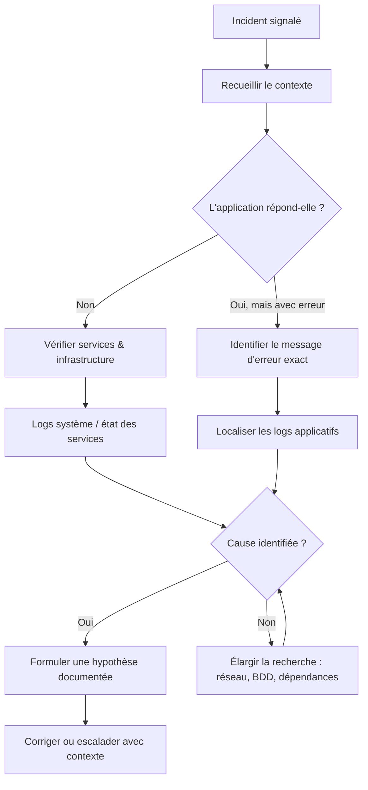

# Gestion des erreurs & diagnostic initial

## Objectifs pédagogiques

À l'issue de ce module, vous serez capable de :

1. **Identifier** les trois origines d'une erreur applicative et orienter l'investigation en conséquence
2. **Lire et décomposer** un message d'erreur pour en extraire symptôme, cause racine et contexte temporel
3. **Appliquer une démarche structurée** de diagnostic initial face à un incident inconnu
4. **Localiser les logs pertinents** selon l'environnement et les filtrer efficacement avec les outils en ligne de commande
5. **Formuler une hypothèse documentée** avant toute action corrective ou escalade

---

## Mise en situation

Il est 9h15. Votre téléphone sonne. Un utilisateur vous explique que "l'application ne marche plus". Pas plus de détail. Il est pressé, il a une réunion dans vingt minutes, et il attend que vous régliez ça.

Que faites-vous en premier ?

C'est exactement là que tout se joue. Un technicien sans méthode va se précipiter — relancer le serveur, vider le cache, appeler le développeur — sans savoir ce qui s'est réellement passé. Résultat : parfois ça marche, souvent ça aggrave, et presque toujours ça prend plus de temps que nécessaire.

Un technicien avec méthode va poser trois questions, regarder deux fichiers, et avoir une hypothèse solide en moins de cinq minutes.

Ce module vous donne cette méthode.

---

## Ce qu'est vraiment une erreur applicative

Une erreur applicative, c'est un signal. L'application vous dit que quelque chose s'est mal passé — et souvent, elle vous dit aussi *quoi*, *où*, et *quand*. Le problème, c'est qu'on a tendance à ne voir que la surface : un écran blanc, un message vague, une page d'erreur générique. Mais derrière ce que voit l'utilisateur, il y a presque toujours une trace plus précise, quelque part dans le système.

Apprendre à gérer les erreurs, c'est apprendre à lire ces signaux plutôt qu'à les ignorer ou à les contourner.

### Les trois origines d'une erreur

Il y a toujours un endroit où l'erreur est née. Cette distinction est fondamentale parce qu'elle oriente immédiatement votre investigation — escalader au mauvais interlocuteur fait perdre du temps à tout le monde.

| Origine | Ce que ça signifie | Exemple concret |
|---|---|---|
| **Applicative** | Le code a rencontré un cas qu'il ne sait pas gérer | Division par zéro, valeur null inattendue, format de date invalide |
| **Système / Infrastructure** | Le contexte d'exécution est défaillant | Disque plein, service arrêté, mémoire insuffisante |
| **Réseau / Intégration** | Une communication avec un autre système a échoué | Timeout vers une API tierce, base de données injoignable, certificat expiré |

Une erreur d'intégration ne se règle pas de la même façon qu'une erreur applicative. Identifier l'origine en premier, c'est choisir le bon chemin d'investigation dès le départ.

---

## Anatomie d'un message d'erreur

Avant de savoir chercher, il faut savoir lire. Un message d'erreur bien écrit contient plusieurs couches d'information superposées. Prenons un exemple réaliste, tel qu'on en voit dans les logs d'une application Java :

```
[2024-06-12 09:12:43] ERROR  OrderService - Failed to process order #45821
java.sql.SQLException: Timeout waiting for connection from pool
    at com.zaxxer.hikari.pool.HikariPool.getConnection(HikariPool.java:213)
    at com.myapp.repository.OrderRepository.findById(OrderRepository.java:87)
    at com.myapp.service.OrderService.processOrder(OrderService.java:134)
Caused by: java.net.SocketTimeoutException: connect timed out
```

Voici ce que cette erreur contient, couche par couche :

- **L'horodatage** (`2024-06-12 09:12:43`) — quand c'est arrivé. Premier réflexe : corréler avec ce que l'utilisateur a signalé.
- **Le niveau** (`ERROR`) — la sévérité. Pas un warning, pas un info : une opération a échoué.
- **Le composant** (`OrderService`) — quel module de l'application est en cause.
- **Le message principal** — ce que l'application a essayé de faire et n'a pas réussi.
- **La stack trace** — le chemin d'exécution au moment de l'erreur, du plus proche au plus profond.
- **La cause racine** (`Caused by`) — souvent la ligne la plus importante. Ici : un timeout réseau vers la base de données.

🧠 La cause racine et le symptôme sont deux choses différentes. L'application a planté sur le traitement d'une commande (*symptôme*), mais la vraie cause est un timeout de connexion vers la base de données (*cause racine*). C'est toujours la cause racine qu'on cherche à traiter — pas le symptôme.

### Les niveaux de sévérité des logs

Les applications bien configurées ne logguent pas toutes les informations au même niveau. Comprendre ces niveaux change complètement la façon dont vous lisez un fichier de log :

```
DEBUG   → Information très détaillée, pour le développement. Rarement actif en prod.
INFO    → Événements normaux : connexion réussie, traitement terminé, démarrage service.
WARN    → Quelque chose d'inattendu s'est produit, mais l'application continue.
ERROR   → Une opération a échoué. Nécessite une attention.
FATAL   → L'application ne peut plus fonctionner. Arrêt imminent ou déjà effectif.
```

En support, votre point d'entrée naturel est `ERROR` et au-dessus. Les `WARN` méritent attention quand ils sont répétitifs ou apparaissent juste avant un `ERROR` — ils signalent souvent une dégradation progressive avant la panne.

⚠️ Chercher "l'erreur" en lisant le fichier de log depuis le début est une perte de temps. Les fichiers de logs peuvent peser des centaines de Mo. La bonne approche : filtrer directement sur `ERROR` et `FATAL` à partir de l'horodatage de l'incident, puis remonter pour voir le contexte si nécessaire.

---

## La démarche de diagnostic initial

Le diagnostic n'est pas une recherche aléatoire. C'est une démarche structurée qui va du général vers le particulier, et du symptôme vers la cause.



### Étape 1 — Recueillir le contexte avant de toucher quoi que ce soit

C'est la règle numéro un, et la plus souvent violée. Avant d'ouvrir un terminal, avant de redémarrer un service, posez ces questions :

- **Qui** est touché ? Un seul utilisateur, un groupe, tout le monde ?
- **Quoi** exactement ? Un message d'erreur précis, une lenteur, un blocage ?
- **Quand** est-ce apparu ? Depuis toujours, depuis ce matin, après une action précise ?
- **Qu'est-ce qui a changé ?** Mise à jour, modification de paramètre, nouvel import de données ?

💡 La question "qu'est-ce qui a changé ?" est souvent la plus révélatrice. La majorité des incidents en production ont une cause liée à un changement récent — pas forcément lié à l'application elle-même. Un patch système, une modification de mot de passe, un changement de quota : tout compte. Si l'utilisateur ne sait pas, vérifiez le journal des changements (CMDB, historique Git, tickets récents liés à l'infra).

### Étape 2 — Reproduire si possible

Un bug qu'on peut reproduire à la demande est à moitié résolu. Essayez de suivre exactement les mêmes étapes que l'utilisateur : même compte, mêmes données, même navigateur si c'est une webapp. Si vous reproduisez l'erreur, vous avez un terrain d'expérimentation contrôlé.

Si vous ne reproduisez pas, notez-le — c'est une information en soi. Ça orientera vers des causes intermittentes : charge système, données spécifiques, timing, condition de concurrence.

### Étape 3 — Aller aux logs

C'est votre source de vérité. L'utilisateur décrit ce qu'il a *vu*. Les logs décrivent ce qui s'est *réellement passé*.

En fonction du type d'application, les logs se trouvent à différents endroits :

| Environnement | Emplacement typique |
|---|---|
| Application Java / Python (Linux) | `/var/log/appname/` ou répertoire de l'app |
| IIS (Windows) | `C:\inetpub\logs\LogFiles\` |
| Apache / Nginx | `/var/log/apache2/` ou `/var/log/nginx/` |
| Tomcat | `$CATALINA_HOME/logs/catalina.out` |
| Logs système Linux | `/var/log/syslog` ou `journalctl` |
| Logs événements Windows | Observateur d'événements (Event Viewer) |

La recherche dans les logs se fait toujours avec un cap temporel. Vous savez quand l'incident s'est produit — utilisez-le comme point de départ :

```bash
# Filtrer les erreurs à partir d'une heure précise dans un log Linux
grep "ERROR" /var/log/appname/app.log | grep "2024-06-12 09:1"

# Voir les 100 dernières lignes d'un log en temps réel
tail -n 100 -f /var/log/appname/app.log

# Sur Windows — chercher dans les logs IIS avec PowerShell
Select-String -Path "C:\inetpub\logs\LogFiles\W3SVC1\*.log" -Pattern "500"
```

### Étape 4 — Formuler une hypothèse avant d'agir

C'est l'étape que les débutants sautent le plus souvent. Avant de faire quoi que ce soit, écrivez (ou dites à voix haute) ce que vous pensez être la cause, et pourquoi.

> *"Je pense que le service de traitement des commandes n'arrive pas à se connecter à la base de données depuis 9h12, probablement parce que le pool de connexions est épuisé ou que la base est injoignable."*

Cette formulation vous force à vérifier que vous avez *compris* avant d'*agir*. Elle permet aussi de documenter votre raisonnement dans le ticket — ce qui est précieux si vous vous trompez et devez changer de piste.

---

## Les erreurs les plus fréquentes en support applicatif

Avec l'expérience, certaines erreurs reviennent très régulièrement. Voici les plus courantes, avec leur signature reconnaissable et l'endroit précis où chercher.

### Erreur 500 — Internal Server Error

Le serveur a planté en traitant la requête, mais ne veut pas (ou ne peut pas) vous dire pourquoi côté utilisateur. C'est opaque en façade, mais il y a forcément une trace côté serveur. **Où chercher :** logs applicatifs, immédiatement après l'horodatage de la requête.

### Timeout de connexion

L'application a essayé de contacter quelque chose — une base de données, une API, un service interne — et n'a pas eu de réponse dans le délai imparti. **Où chercher :** configuration réseau, état du service cible. Un test rapide de connectivité confirme ou infirme en quelques secondes :

```bash
# Vérifier si un port est joignable (ex : base PostgreSQL sur port 5432)
nc -zv 192.168.1.50 5432

# Alternative avec telnet
telnet 192.168.1.50 5432
```

### NullPointerException / AttributeError

L'application a essayé d'utiliser une valeur qui n'existait pas — une donnée manquante, un champ vide, un objet non initialisé. La stack trace indique la ligne exacte du code. En support, vous ne pouvez pas corriger le code, mais vous pouvez identifier si le problème vient d'une donnée métier (un enregistrement avec un champ obligatoire vide) ou d'un bug applicatif à remonter aux développeurs.

### Espace disque insuffisant

Plus courant qu'on ne le croit, et ses symptômes sont trompeurs. L'application peut sembler "planter au hasard" alors que le vrai problème est que les logs ne peuvent plus s'écrire, ou que les fichiers temporaires ne peuvent plus être créés :

```bash
# Vérifier l'espace disque disponible (Linux)
df -h

# Trouver les répertoires qui prennent le plus de place
du -sh /var/log/* | sort -rh | head -10
```

⚠️ Piège classique : redémarrer un service "pour voir si ça repart" sans vérifier l'espace disque. Le service redémarre, les logs se remettent à tourner, et vingt minutes plus tard le même problème revient. Le redémarrage n'était pas un correctif — juste un délai.

---

## Distinguer le symptôme de la cause — un réflexe à construire

C'est la compétence centrale de tout technicien support. Quand vous lisez un message d'erreur ou qu'un utilisateur vous décrit un problème, posez-vous toujours cette question en deux temps :

> **"Qu'est-ce que je vois ?"** — le symptôme, ce que l'utilisateur ressent
> **"Qu'est-ce qui a causé ça ?"** — la cause, ce que le système rapporte

| Symptôme signalé | Cause racine possible |
|---|---|
| "L'application est lente" | Base de données saturée, requête non optimisée, ressources système à la limite |
| "Je ne peux pas me connecter" | Compte bloqué, service d'authentification en panne, problème réseau client/serveur |
| "La page affiche une erreur" | Bug applicatif, données corrompues, service tiers indisponible |
| "Le fichier ne s'exporte pas" | Espace disque plein, permissions insuffisantes, format de données inattendu |

🧠 En ITIL, on distingue l'**incident** (interruption de service, à restaurer rapidement) du **problème** (cause racine récurrente, à traiter en profondeur). En tant que technicien N1/N2, votre mission sur un incident est de *restaurer le service*. Identifier et traiter la cause racine est souvent un travail séparé, qui peut nécessiter une escalade — mais vous devez toujours documenter ce que vous avez trouvé.

---

## Cas réel — Investigation d'une erreur de traitement batch

**Contexte :** Une application de gestion RH génère chaque nuit un batch de paie. Ce matin, le responsable RH signale que le batch ne s'est pas terminé et que les bulletins ne sont pas disponibles.

**Étape 1 — Recueillir le contexte**

Vous demandez : depuis quand, quels bulletins manquent, est-ce déjà arrivé. Réponse : ça n'a jamais raté en trois ans, et hier soir il y a eu une migration de la base de données vers un nouveau serveur.

Voilà. Le changement est là.

**Étape 2 — Lecture des logs applicatifs**

```
[2024-06-12 02:14:33] INFO  BatchScheduler - Starting payroll batch for period 2024-06
[2024-06-12 02:14:33] INFO  DatabaseConnector - Connecting to db-server-02.internal:5432
[2024-06-12 02:14:48] ERROR DatabaseConnector - Connection refused: db-server-02.internal:5432
[2024-06-12 02:14:48] FATAL BatchScheduler - Cannot initialize database connection. Batch aborted.
```

Le batch a tenté de se connecter à `db-server-02.internal` — l'ancien serveur. La migration a changé l'adresse du serveur de base de données, mais la configuration de l'application n'a pas été mise à jour.

**Étape 3 — Vérification de la connectivité**

```bash
# Le nouveau serveur répond
nc -zv db-server-03.internal 5432
# Connection to db-server-03.internal 5432 port [tcp/postgresql] succeeded!

# L'ancienne adresse est injoignable
nc -zv db-server-02.internal 5432
# nc: getaddrinfo for host "db-server-02.internal" port 5432: Name or service not known
```

Hypothèse confirmée.

**Étape 4 — Résolution et documentation**

La correction consiste à mettre à jour le fichier de configuration de l'application (`database.properties` ou équivalent) avec la nouvelle adresse du serveur, puis relancer le batch manuellement. Dans le ticket, vous documentez : symptôme, cause identifiée, action corrective, durée d'interruption. Et vous ajoutez une recommandation : que les migrations de base de données incluent systématiquement une vérification des fichiers de configuration de toutes les applications dépendantes.

Ce dernier point — la recommandation — est ce qui transforme un incident en amélioration durable.

---

## Bonnes pratiques

**Documenter en temps réel, pas après.** Quand vous commencez un diagnostic, notez dans le ticket ce que vous voyez, ce que vous cherchez, et vos hypothèses successives. Si vous êtes interrompu ou si quelqu'un reprend le ticket, ça évite de repartir de zéro — et ça montre votre raisonnement, pas seulement votre conclusion.

**Ne jamais modifier en production sans comprendre.** Relancer un service, modifier une configuration, vider un cache — tout ça peut avoir des effets de bord. Si vous ne savez pas précisément pourquoi vous faites une action, attendez d'avoir une hypothèse claire.

**Distinguer "c'est reparti" de "c'est corrigé".** Un redémarrage peut faire repartir une application pendant quelques heures sans que la cause soit traitée. Mentionnez-le explicitement dans le ticket : *"Service relancé comme mesure conservatoire — cause racine non identifiée, suivi requis."* C'est une information critique pour l'équipe.

**Vérifier les changements récents en priorité.** La majorité des incidents en production suivent un changement — mise à jour, déploiement, modification de configuration, changement d'infrastructure. C'est votre premier réflexe, avant d'ouvrir le moindre fichier de log.

**Consulter le monitoring avant de plonger dans les logs.** Si vous avez accès à des dashboards ou des alertes, regardez-les en premier. Un graphe CPU à 100% ou une mémoire saturée visible d'un coup d'œil peut vous éviter quinze minutes de lecture de logs. Le monitoring donne la vue d'ensemble ; les logs donnent le détail.

**Tester la connectivité réseau rapidement.** Face à un timeout ou une erreur de connexion, un `nc -zv` vers l'IP et le port cible prend trois secondes et vous dit immédiatement si le problème est réseau ou applicatif. C'est l'une des vérifications les plus rentables du diagnostic.

**Clôturer le ticket avec une cause, pas juste une action.** "Service redémarré" n'est pas une résolution. "Service redémarré suite à épuisement du pool de connexions causé par une montée de charge anormale — surveillance mise en place" est une résolution. La différence, c'est ce que la prochaine personne trouvera quand l'incident se reproduira.

---

## Résumé

Un incident applicatif génère toujours des traces — à condition de savoir où les chercher et comment les lire. La clé d'un bon diagnostic initial n'est pas la vitesse : c'est la méthode. Comprendre le contexte avant d'agir, localiser les logs au bon endroit et au bon moment, lire les messages d'erreur jusqu'à la cause racine plutôt que de s'arrêter au symptôme, formuler une hypothèse avant de toucher quoi que ce soit.

Les erreurs courantes — timeouts, erreurs 500, espace disque, NullPointerException — ont chacune une signature reconnaissable. Les distinguer dès la lecture du log vous évite de chercher au mauvais endroit. Et la question "qu'est-ce qui a changé récemment ?" reste, encore et toujours, l'une des plus puissantes de votre arsenal.

La suite logique de ce module est l'exploration des outils de lecture de logs en temps réel et les premières notions de corrélation entre événements — pour aller plus loin quand le premier niveau de diagnostic ne suffit pas.

---

<!-- snippet
id: support_logs_filtrer_erreurs
type: command
tech: bash
level: beginner
importance: high
format: knowledge
tags: logs,diagnostic,grep,erreur,linux
title: Filtrer les erreurs dans un log applicatif Linux
context: À exécuter sur le serveur hébergeant l'application, dans un terminal avec accès au fichier de log
command: grep "ERROR" <CHEMIN_LOG> | grep "<HORODATAGE>"
example: grep "ERROR" /var/log/myapp/app.log | grep "2024-06-12 09:1"
description: Combine grep sur le niveau ERROR et l'horodatage de l'incident pour isoler les lignes pertinentes sans lire tout le fichier.
-->

<!-- snippet
id: support_logs_tail_temps_reel
type: command
tech: bash
level: beginner
importance: medium
format: knowledge
tags: logs,tail,temps-reel,monitoring,linux
title: Suivre un log en temps réel avec tail
context: Utile pour observer le comportement d'une application pendant une reproduction de bug
command: tail -n <NB_LIGNES> -f <CHEMIN_LOG>
example: tail -n 100 -f /var/log/myapp/app.log
description: Affiche les N dernières lignes du fichier et continue à afficher les nouvelles entrées au fur et à mesure — équivalent d'un live feed des logs.
-->

<!-- snippet
id: support_port_joignabilite
type: command
tech: bash
level: beginner
importance: high
format: knowledge
tags: réseau,diagnostic,netcat,port,connectivite
title: Vérifier si un port distant est joignable
context: À utiliser depuis le serveur applicatif, vers le service cible (base de données, API, etc.)
command: nc -zv <IP_OU_HOSTNAME> <PORT>
example: nc -zv db-server-03.internal 5432
description: Confirme ou infirme la connectivité réseau vers un service précis. Si le port ne répond pas, le problème est réseau ou service arrêté — pas applicatif.
-->

<!-- snippet
id: support_disque_espace
type: command
tech: bash
level: beginner
importance: high
format: knowledge
tags: disque,diagnostic,espace,linux,df
title: Vérifier l'espace disque disponible sur Linux
command: df -h
description: Affiche l'espace utilisé et disponible sur chaque partition. Un disque à 100% peut provoquer des crashes applicatifs silencieux ou l'impossibilité d'écrire des logs.
-->

<!-- snippet
id: support_disque_gros_repertoires
type: command
tech: bash
level: beginner
importance: medium
format: knowledge
tags: disque,logs,diagnostic,du,linux
title: Identifier les répertoires les plus volumineux
context: Utile quand le disque est plein et qu'on cherche quoi libérer en priorité
command: du -sh <REPERTOIRE>/* | sort -rh | head -10
example: du -sh /var/log/* | sort -rh | head -10
description: Trie les sous-répertoires par taille décroissante. Souvent, les logs non rotatés ou les fichiers temporaires sont responsables du remplissage disque.
-->

<!-- snippet
id: support_erreur_symptome_cause
type: concept
tech: support-applicatif
level: beginner
importance: high
format: knowledge
tags: diagnostic,root-cause,symptome,itil,methode
title: Différence entre symptôme et cause racine
content: Le symptôme est ce que l'utilisateur ressent ("l'appli est lente"). La cause racine est ce que le système rapporte ("pool de connexions BDD épuisé"). En support, traiter uniquement le symptôme (ex : redémarrer le service) sans identifier la cause racine garantit la récurrence de l'incident. La cause racine se trouve presque toujours dans les logs, au niveau "Caused by" ou dans les dernières lignes avant le FATAL.
description: Traiter le symptôme sans cause racine = incident récurrent. Chercher "Caused by" dans les logs pour remonter à l'origine réelle.
-->

<!-- snippet
id: support_log_niveaux_severite
type: concept
tech: support-applicatif
level: beginner
importance: high
format: knowledge
tags: logs,severite,debug,error,fatal
title: Niveaux de sévérité des logs applicatifs
content: Les niveaux de log (DEBUG < INFO < WARN < ERROR < FATAL) filtrent la gravité des événements. En diagnostic, commencer par ERROR et FATAL — ils signalent des opérations échouées. Les WARN répétitifs avant un ERROR indiquent souvent une dégradation progressive. Le niveau DEBUG est rarement actif en production ; l'activer temporairement peut révéler des informations invisibles autrement.
description: Lire les logs depuis ERROR/FATAL à l'horodatage de l'incident. Les WARN répétitifs juste avant un ERROR signalent souvent la dégradation qui a précédé la panne.
-->

<!-- snippet
id: support_changement_recent_reflexe
type: tip
tech: support-applicatif
level: beginner
importance: high
format: knowledge
tags: diagnostic,changement,incident,methode,production
title: Toujours demander "qu'est-ce qui a changé ?" en premier
content: La majorité des incidents en production suivent un changement récent : déploiement, mise à jour OS, migration BDD, modification de configuration, changement de mot de passe de compte de service. Poser cette question dès le début du ticket oriente immédiatement vers la cause et évite 30 minutes de recherche dans les logs. Si l'utilisateur ne sait pas, vérifier le journal des changements (CMDB, historique Git, tickets récents liés à l'infra).
description: Demander "qu'est-ce qui a changé récemment ?" avant d'ouvrir un terminal — c'est la question qui résout le plus d'incidents en production en moins de 5 minutes.
-->

<!-- snippet
id: support_redemarrage_conservatoire
type: warning
tech: support-applicatif
level: beginner
importance: high
format: knowledge
tags: redemarrage,service,diagnostic,production,documentation
title: Redémarrer sans comprendre masque le problème
content: Piège : relancer un service "pour voir si ça repart" sans avoir identifié la cause. Conséquence : le service redémarre, l'incident semble résolu, mais la cause sous-jacente (disque plein, fuite mémoire, dépendance en erreur) reproduira l'incident dans les heures suivantes. Correction : si vous redémarrez sans cause identifiée, documenter explicitement dans le ticket "mesure conservatoire — cause racine non résolue" et déclencher un suivi.
description: Redémarrer sans cause identifiée = répit temporaire, pas une résolution. Toujours documenter "mesure conservatoire" dans le ticket si la cause n'est pas connue.
-->

<!-- snippet
id: support_logs_iis_windows
type: command
tech: powershell
level: beginner
importance: medium
format: knowledge
tags: windows,iis,logs,powershell,erreur-500
title: Chercher les erreurs HTTP dans les logs IIS avec PowerShell
context: À exécuter sur le serveur Windows hébergeant IIS, en PowerShell avec droits administrateur
command: Select-String -Path "C:\inetpub\logs\LogFiles\W3SVC1\*.log" -Pattern "<CODE_HTTP>"
example: Select-String -Path "C:\inetpub\logs\LogFiles\W3SVC1\*.log" -Pattern "500"
description: Recherche tous les codes HTTP correspondants dans les logs IIS. Remplacer 500 par 404, 401 ou 503 selon le type d'erreur à investiguer.
-->
