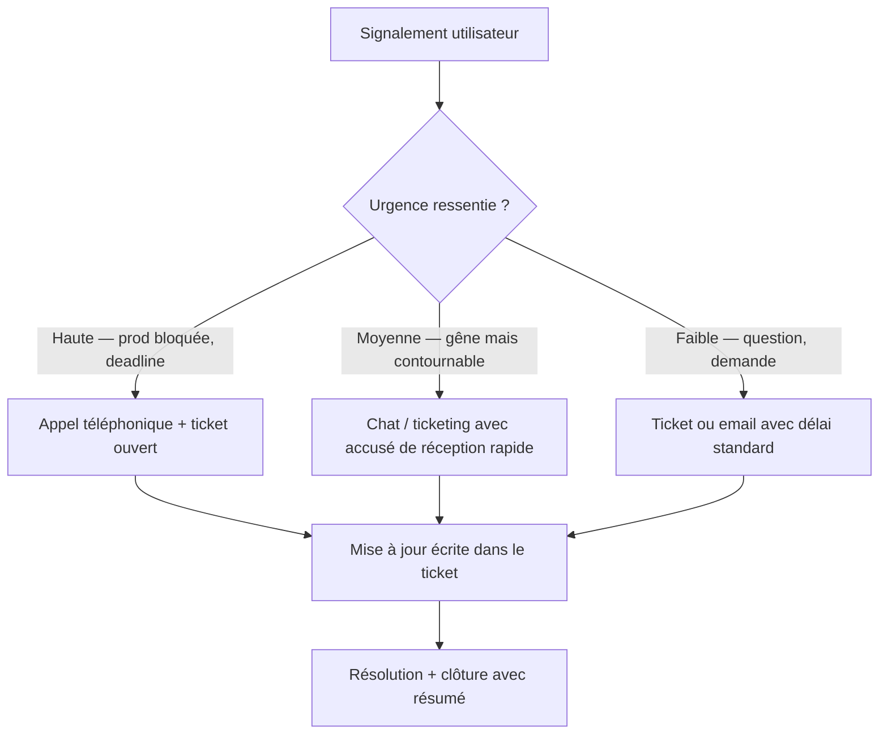

# Communication & gestion utilisateur

## Objectifs pédagogiques

À la fin de ce module, tu seras capable de :

- Identifier le bon ton et le bon canal selon la situation et l'urgence ressentie par l'utilisateur
- Reformuler un problème utilisateur pour en extraire les informations techniques utiles
- Structurer une réponse claire, même sans solution immédiate
- Gérer les situations tendues sans perdre le contrôle de l'échange
- Décider quand escalader et formuler cette escalade sans perdre la confiance de l'utilisateur

---

## Mise en situation

Tu viens de prendre ton poste. Il est 9h07. Le téléphone sonne. C'est Sophie, responsable comptable, voix tendue :

> *"Le logiciel de facturation ne marche plus. J'ai une réunion avec le client à 10h et j'ai besoin de la dernière facture. Personne ne répond sur le chat. C'est urgent !"*

Tu ne connais pas encore bien le logiciel de facturation. Tu n'as pas accès au serveur de prod en autonomie. Et l'escalade N2 est en réunion jusqu'à 9h30.

Ce module est là pour t'apprendre à gérer ce moment — pas juste techniquement, mais humainement.

---

## Ce que c'est, et pourquoi ça compte vraiment

La communication en support, ce n'est pas "être sympa". C'est une compétence technique à part entière — au même titre que lire un log ou diagnostiquer un crash.

Un technicien qui résout le problème en silence, sans tenir l'utilisateur informé, crée de l'anxiété inutile. Un technicien qui répond vite mais de façon floue ou condescendante dégrade la confiance dans tout le service IT. À l'inverse, quelqu'un qui sait dire "je ne sais pas encore, mais voilà ce que je fais et quand je reviens vers toi" — ça rassure, même sans solution.

🧠 En support, la *perception* du service est aussi importante que le service lui-même. Un utilisateur qui se sent ignoré escalade vers son manager. Un utilisateur informé patiente.

La gestion utilisateur, c'est donc l'art de maintenir la confiance pendant tout le cycle de résolution — de la première prise en charge jusqu'à la clôture du ticket.

---

## Comprendre ce que l'utilisateur dit vraiment

### Le problème de la traduction

Quand un utilisateur dit *"le logiciel ne marche plus"*, il ne te donne pas un bug. Il te donne une émotion et un symptôme. Ton rôle, c'est de traduire ça en information technique utilisable.

Voici ce que cache souvent un signalement brut :

| Ce que dit l'utilisateur | Ce qu'il faut creuser |
|--------------------------|----------------------|
| "Ça ne marche plus" | Depuis quand ? Ça a déjà marché avant ? Sur cette machine uniquement ? |
| "C'est lent" | Lent comment ? Toujours ? À quel moment précis ? Depuis une MàJ ? |
| "J'ai une erreur" | Quel message exact ? Quelle action déclenchait l'erreur ? |
| "Tout est bloqué" | L'application entière ? Un onglet ? Un bouton ? Un utilisateur ou tous ? |
| "C'est urgent" | Urgence réelle (deadline, client) ou frustration ? Impact métier concret ? |

La reformulation est ton meilleur outil. Plutôt que de poser cinq questions d'affilée — ce qui épuise l'utilisateur — reformule ce que tu as compris, puis pose une seule question ouverte :

> *"Si je comprends bien, tu ne peux plus accéder à l'écran de facturation — c'est bien ça ? Et ça a commencé ce matin seulement ?"*

Ça montre que tu écoutes. Ça valide ce que l'utilisateur a dit. Et ça t'amène l'info qui manque sans créer de friction.

⚠️ Poser plusieurs questions d'un coup ("C'est sur quelle machine ? Quel OS ? Tu as fait des mises à jour ? Et l'erreur exacte ?") est perçu comme un interrogatoire. L'utilisateur se décourage ou répond en vrac. Une question à la fois.

<!-- snippet
id: support_communication_reformulation
type: tip
tech: support
level: beginner
importance: high
format: knowledge
tags: communication,reformulation,diagnostic,utilisateur,questions
title: Reformuler avant de poser des questions
content: Plutôt que de bombarder l'utilisateur de questions, commence par reformuler ce que tu as compris : "Si je comprends bien, tu ne peux plus accéder à X depuis ce matin — c'est bien ça ?" Puis pose une seule question. Ça montre l'écoute et structure le diagnostic sans créer de friction.
description: La reformulation réduit les malentendus et évite l'effet interrogatoire qui décourage les utilisateurs à répondre précisément.
-->

---

## Structurer une réponse, même sans solution

C'est là que beaucoup de techniciens débutants bloquent : ils ne savent pas quoi dire quand ils n'ont pas encore la réponse. Du coup, ils ne disent rien. Et ça, c'est pire que tout.

La règle d'or en support : **ne jamais laisser un utilisateur dans le vide.**

Une bonne réponse initiale, même partielle, contient toujours trois choses :

1. **L'accusé de réception** — tu as bien compris et tu prends en charge
2. **Ce que tu vas faire** — action concrète, même simple
3. **Quand tu reviens** — une échéance, même approximative

Exemple concret pour Sophie :

> *"Bonjour Sophie, je prends en charge ton ticket maintenant. Je n'ai pas encore accès au serveur de facturation en autonomie, mais je contacte l'équipe N2 immédiatement. Je te donne un retour d'ici 20 minutes, au plus tard avant 9h30."*

Tu n'as pas résolu le problème. Mais Sophie sait qu'elle n'est pas seule, qu'il se passe quelque chose, et elle a une heure de retour. Elle peut décider si elle doit alerter son manager ou non. Tu lui as donné du contrôle.

💡 Si tu n'es pas sûr du délai, donne une fourchette légèrement large plutôt qu'une promesse serrée. Mieux vaut revenir en avance que dépasser ce que tu avais annoncé.

<!-- snippet
id: support_communication_accusereception
type: tip
tech: support
level: beginner
importance: high
format: knowledge
tags: communication,ticket,utilisateur,urgence,support
title: Accuser réception en moins de 10 minutes, même sans solution
content: Envoie un premier message dans les 5-10 min suivant le signalement : "Je prends en charge ton ticket, je reviens vers toi avant [heure]." Sans ça, l'utilisateur ne sait pas si son message a été lu — il escalade vers son manager ou rappelle en boucle.
description: Un accusé de réception rapide réduit la tension et évite les escalades inutiles, même quand tu n'as pas encore de réponse technique.
-->

<!-- snippet
id: support_communication_structurereponse
type: concept
tech: support
level: beginner
importance: high
format: knowledge
tags: communication,reponse,support,ticket,attente
title: Structure d'une réponse sans solution immédiate
content: Toute réponse initiale doit contenir 3 éléments : 1) accusé de réception ("je prends en charge"), 2) action concrète en cours ("je contacte l'équipe N2"), 3) échéance ("je reviens avant 9h30"). Sans ces 3 éléments, l'utilisateur reste dans le vide même si tu travailles sur son problème.
description: Cette structure maintient la confiance pendant toute la durée de résolution, indépendamment de la solution technique.
-->

---

## Choisir le bon canal selon la situation

Tout ne se gère pas de la même façon selon le canal. Un ticket écrit n'a pas la même dynamique qu'un appel, et un message Teams n'est pas un email.

**Le téléphone** est pour les urgences réelles et les situations qui s'emballent. Une voix humaine rassure bien plus qu'un message — elle désarme la tension immédiatement. Mais tout ce qui est dit par téléphone doit être retranscrit dans le ticket ensuite.

**Le chat** (Teams, Slack, etc.) est efficace pour les allers-retours rapides, les clarifications, les petites demandes. Attention : les messages courts peuvent sembler secs à l'écrit. Soigne le ton.

**Le ticket écrit** est la trace officielle. C'est là que tout doit finir, même si le problème a été résolu par téléphone. Un ticket sans historique, c'est un savoir perdu.

⚠️ Répondre à une urgence *uniquement* par ticket sans accusé de réception rapide est une erreur fréquente. L'utilisateur voit son ticket "en cours" mais ne sait pas si quelqu'un l'a lu. Un simple message rapide ("je regarde ça") change tout.

<!-- snippet
id: support_canal_choix
type: concept
tech: support
level: beginner
importance: high
format: knowledge
tags: communication,canal,téléphone,chat,ticket,urgence
title: Choisir le bon canal selon le niveau d'urgence
content: Urgence haute (prod bloquée, deadline) → téléphone + ticket ouvert en parallèle. Urgence moyenne (gêne contournable) → chat avec accusé de réception rapide. Faible urgence (question, demande) → ticket ou email. Dans tous les cas, la trace finale doit toujours atterrir dans le ticket écrit.
description: Le canal conditionne la vitesse de désescalade — une voix humaine rassure plus vite que n'importe quel message en situation de stress.
-->

---

## Gérer les situations tendues

Ça arrivera. Un utilisateur agressif, pressé, convaincu que l'IT "ne fait rien". Voici ce qui fonctionne réellement, et ce qui empire les choses.

**Laisser la frustration s'exprimer une fois.** Si l'utilisateur a besoin de dire "c'est inadmissible, ça fait trois fois cette semaine", laisse-le finir. Couper ou défendre le service immédiatement crée une confrontation.

**Valider sans s'excuser excessivement.** "Je comprends que ce soit bloquant, surtout avec ta réunion à 10h" — c'est suffisant. Pas besoin de s'aplatir ni de promettre que ça n'arrivera plus.

**Recentrer sur l'action.** Après avoir entendu la frustration : "Voilà ce que je vais faire maintenant." Ça redirige vers le concret et clôt la phase émotionnelle.

À l'inverse, certaines réactions empirent systématiquement la situation : dire *"c'est normal"* ou *"c'est pas de ma faute"* — même si c'est vrai — est perçu comme du désengagement. Promettre une résolution rapide pour calmer quand tu n'en sais rien est encore pire : si tu ne tiens pas le délai, la confiance s'effondre. Et être trop formel ou robotique quand l'utilisateur est en stress donne l'impression que tu lis un script.

🧠 La gestion d'un utilisateur tendu, ce n'est pas de la psychologie. C'est de la gestion d'attente et d'information. Dans 80% des cas, la tension vient du manque de visibilité sur ce qui se passe, pas du problème lui-même.

<!-- snippet
id: support_communication_tendu
type: warning
tech: support
level: beginner
importance: medium
format: knowledge
tags: communication,tension,utilisateur,gestion,support
title: Situation tendue — valider sans promettre
content: Piège : promettre une résolution rapide pour calmer l'urgence. Conséquence : si tu n'y arrives pas dans le délai annoncé, la confiance s'effondre et la situation empire. Correction : valide la frustration ("je comprends que ce soit bloquant avec ta réunion à 10h"), puis recentre sur l'action concrète sans donner un délai que tu ne peux pas tenir.
description: La tension utilisateur vient surtout du manque de visibilité, pas du problème lui-même. Valider + informer suffit dans 80% des cas.
-->

---

## Quand et comment escalader

Escalader, ce n'est pas un aveu d'échec. C'est une décision professionnelle. Et l'utilisateur doit le percevoir comme tel.

Deux questions suffisent pour décider :

1. **Est-ce que j'ai les accès, les outils ou les droits pour résoudre ça ?** Si non → escalade technique.
2. **Est-ce que le délai de résolution dépasse le SLA ou met en danger une deadline métier critique ?** Si oui → escalade priorité.

Quand tu escalades, dis-le clairement à l'utilisateur — mais cadre-le positivement :

> *"Ce problème nécessite une intervention au niveau serveur que je n'ai pas en autonomie. Je transmets maintenant à l'équipe N2 avec le contexte complet. Tu resteras informé via le ticket."*

Ce que tu ne dis pas : *"Je sais pas, tu dois appeler quelqu'un d'autre."* Ça, c'est abandonner l'utilisateur. La différence entre les deux formulations tient à un seul mot : *"je transmets"* signifie que tu restes propriétaire du suivi.

💡 Quand tu transmets à un N2 ou un spécialiste, fournis-lui un résumé propre : symptôme exact, depuis quand, ce que tu as déjà testé, l'impact métier. Ça évite à l'utilisateur de tout réexpliquer, et ça montre ton professionnalisme.

<!-- snippet
id: support_communication_escalade
type: tip
tech: support
level: beginner
importance: high
format: knowledge
tags: escalade,communication,n2,support,ticket
title: Formuler une escalade sans abandonner l'utilisateur
content: Dis : "Ce problème nécessite une intervention au niveau serveur. Je transmets maintenant à l'équipe N2 avec le contexte complet — tu resteras informé via le ticket." Ne dis jamais "je sais pas, appelle quelqu'un d'autre." La différence : dans le premier cas, tu restes propriétaire du suivi.
description: La formulation de l'escalade détermine si l'utilisateur se sent accompagné ou abandonné — le mot "je transmets" est clé.
-->

<!-- snippet
id: support_escalade_contexte
type: tip
tech: support
level: beginner
importance: medium
format: knowledge
tags: escalade,n2,résumé,contexte,support
title: Fournir un résumé propre lors d'une escalade N2
content: Lors de la transmission à un N2 ou spécialiste, inclure : symptôme exact, depuis quand, ce qui a déjà été testé, impact métier estimé. Format suggéré : "Utilisateur X, problème Y depuis Z heure, testé A et B sans résultat, bloquant pour réunion client à 10h."
description: Un résumé structuré évite à l'utilisateur de tout réexpliquer et accélère la prise en main par le niveau supérieur.
-->

---

## Clôturer un ticket proprement

La clôture est souvent bâclée. Pourtant c'est un moment clé — pour la traçabilité, et pour l'utilisateur.

Un ticket bien clôturé contient :

- **La cause identifiée** — même simple ("session expirée", "droit manquant sur le dossier X")
- **Ce qui a été fait** pour résoudre
- **Si rien n'a changé côté système**, le dire aussi (ex : "l'utilisateur avait mal saisi son mot de passe, aucune action serveur nécessaire")
- **Une confirmation à l'utilisateur** que le ticket est clôturé — pas juste fermer dans l'outil

Un exemple de message de clôture :

> *"Sophie, le problème est résolu. La session avait expiré suite à la mise à jour de nuit. Ton accès est rétabli. N'hésite pas à rouvrir un ticket si ça se reproduit. Bonne réunion !"*

Court, clair, humain. Et ça se retient.

⚠️ Fermer un ticket sans prévenir l'utilisateur est une erreur classique. Il reçoit un email automatique "ticket clôturé" sans explication. Il ne sait pas ce qui a été fait, ni si ça peut se reproduire. Il a l'impression que tu t'es débarrassé du problème.

<!-- snippet
id: support_communication_cloture
type: warning
tech: support
level: beginner
importance: medium
format: knowledge
tags: ticket,cloture,documentation,support,traçabilite
title: Clôturer un ticket sans informer l'utilisateur — erreur classique
content: Piège : fermer le ticket dans l'outil sans message explicatif. Conséquence : l'utilisateur reçoit un email automatique "ticket clôturé" sans savoir ce qui a été fait ni si ça peut se reproduire. Correction : envoyer un message de clôture avec la cause identifiée, ce qui a été fait, et si besoin la procédure pour la prochaine fois.
description: Un ticket clôturé sans explication est perçu comme un désengagement, même si le problème est résolu.
-->

---

## Cas réel — Un vendredi à 16h45

**Contexte :** Mehdi, directeur commercial, contacte le support en urgence. Il ne peut plus se connecter au CRM depuis son laptop. Il a une présentation client dans 45 minutes à distance.

**Comment ça s'est géré :**

Prise en charge immédiate par téléphone — *"Je m'en occupe maintenant."* Ticket ouvert en parallèle. Pas de mise en attente, pas de formulaire à remplir d'abord.

Reformulation + une seule question : *"Tu ne peux plus te connecter du tout, ou tu as un message d'erreur précis ?"* → Mehdi décrit un écran blanc après login.

Premier diagnostic rapide : est-ce que d'autres utilisateurs sont impactés ? Non → problème isolé. Cache navigateur ou session corrompue ?

Solution : navigation privée → le CRM s'ouvre. Cache corrompu confirmé. Vidage du cache en 2 minutes.

Communication claire en fin d'appel : *"C'était un cache navigateur. Fais Ctrl+Shift+Delete → vider le cache → relancer. Je t'envoie les étapes par écrit dans le ticket pour la prochaine fois."*

Clôture avec résumé : cause, solution, lien vers la procédure de vidage de cache ajouté en base de connaissance.

**Résultat :** Mehdi reconnecté à 17h03. Présentation maintenue. Et la prochaine fois, il saura peut-être le faire lui-même — ce qui est aussi l'objectif.

---

## Bonnes pratiques

**Accuser réception dans les 5 à 10 premières minutes**, même sans réponse technique. C'est la chose la plus simple et la plus efficace pour éviter les escalades inutiles.

**Reformuler avant de poser des questions.** Une reformulation + une question, pas un interrogatoire à cinq items.

**Écrire dans le ticket ce qui a été dit par téléphone**, systématiquement. Ce n'est pas du travail administratif — c'est du savoir partagé. Le prochain technicien qui tombe sur le même problème gagne 30 minutes grâce à ta description.

**Donner un délai plutôt qu'un vague "je regarde".** Si tu ne sais pas combien de temps ça prend, donne une fourchette large et tiens-la.

**Personnaliser légèrement le message** — le prénom de l'utilisateur, la mention de son contexte métier. Ça coûte dix secondes et ça change le ressenti.

**Ne jamais supposer que l'urgence est exagérée.** Parfois c'est effectivement critique pour le business, et tu n'as pas tous les éléments pour en juger depuis ton poste.

**Traduire le jargon en impact concret.** "Le daemon est down" ne veut rien dire pour un utilisateur métier. "Le service qui gère les connexions s'est arrêté, on le redémarre" — ça, il comprend.

<!-- snippet
id: support_communication_jargon
type: warning
tech: support
level: beginner
importance: medium
format: knowledge
tags: communication,jargon,utilisateur,support,vocabulaire
title: Éviter le jargon technique avec les utilisateurs métier
content: Piège : dire "le daemon est down" ou "t'as un timeout sur le socket" à un utilisateur non technique. Conséquence : panique ou agacement, perte de confiance. Correction : traduis en impact concret — "le service qui gère les connexions s'est arrêté, on le redémarre" ou "la connexion a été coupée automatiquement, on va la rétablir".
description: Le jargon technique non traduit crée une distance et amplifie le stress de l'utilisateur en situation d'urgence.
-->

<!-- snippet
id: support_ticket_documentation
type: concept
tech: support
level: beginner
importance: medium
format: knowledge
tags: ticket,documentation,traçabilite,support,savoir
title: Documenter dans le ticket même après un appel téléphonique
content: Tout ce qui est résolu par téléphone doit être retranscrit dans le ticket : symptôme, cause identifiée, action réalisée. Mécanisme : le prochain technicien qui rencontre le même problème retrouve la solution sans repartir de zéro. Un ticket sans historique = savoir perdu, problème récurrent non détectable.
description: La documentation ticket n'est pas administrative — c'est du savoir partagé qui fait gagner du temps à chaque récurrence.
-->

---

## Résumé

La communication en support, ce n'est pas une soft skill vague — c'est une pratique structurée avec des techniques concrètes. Reformuler avant de questionner, structurer chaque réponse en trois temps (réception, action, délai), choisir le bon canal selon l'urgence réelle : ce sont des réflexes qui s'acquièrent. Les situations tendues se désamorcent en validant la frustration sans promettre l'impossible, puis en recentrant sur l'action. L'escalade est une décision professionnelle — à condition de rester propriétaire du suivi et de ne pas laisser l'utilisateur se débrouiller seul. Et un ticket bien clôturé, avec la cause et la solution documentées, c'est du temps gagné pour toute l'équipe à chaque récurrence. La confiance des utilisateurs se construit ticket après ticket, dans les détails.
