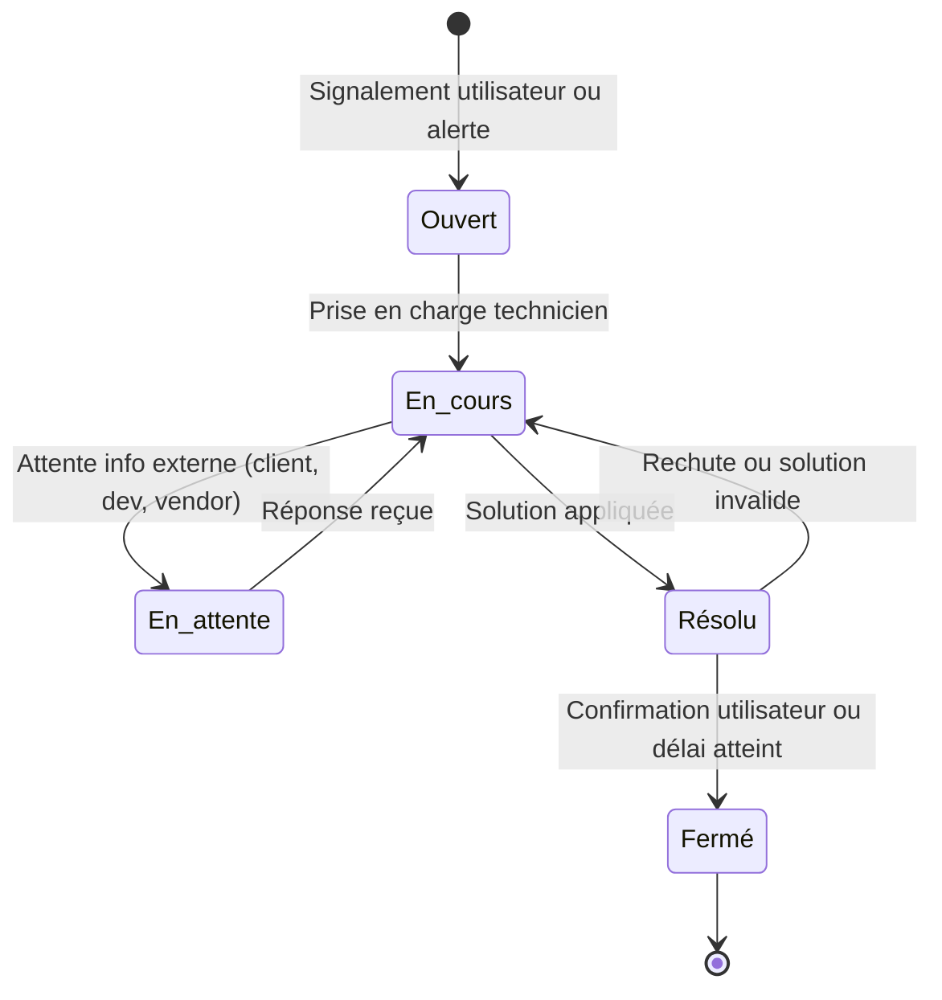

# Travail en équipe & outils collaboratifs

## Objectifs pédagogiques

À l'issue de ce module, vous serez capable de :

- Identifier le rôle de chaque outil collaboratif et choisir le bon canal selon la nature de l'information
- Créer, mettre à jour et clôturer un ticket en respectant les conventions de l'équipe
- Rédiger un commentaire de passation ou d'escalade immédiatement actionnable
- Contribuer à une base de connaissance partagée en structurant une procédure exécutable
- Adapter votre communication selon l'interlocuteur : collègue, développeur, utilisateur final

---

## Mise en situation

Vous intégrez une équipe support de six personnes dans une ESN qui gère plusieurs applications métiers pour un client dans la logistique. Dès le premier jour, vous avez accès à Jira, à un canal Slack `#support-prod`, et à un Confluence rempli de pages dont certaines datent de 2019.

Un incident arrive à 14h : une erreur bloquante empêche les magasiniers de valider leurs bons de livraison. Votre collègue Thomas a commencé à investiguer le matin, mais il part en rendez-vous. Il vous laisse un message vocal de 45 secondes et un ticket Jira avec juste un titre : *"Problème BL"*.

Vous ne savez pas ce qu'il a déjà testé. Vous ne savez pas si le client a été informé. Vous ne savez pas si c'est un problème de base de données ou de droits applicatifs.

Ce scénario — le ticket trop vague, la passation ratée, le contexte perdu — est l'un des problèmes les plus fréquents en support. Et il ne vient pas d'un manque de compétences techniques. Il vient d'une mauvaise organisation collective.

---

## Pourquoi la collaboration est une compétence technique à part entière

En support applicatif, vous êtes rarement seul sur un incident. Il y a toujours un technicien qui a travaillé sur le sujet avant vous, un responsable qui attend un point de situation, un développeur à qui vous allez devoir expliquer ce que vous avez observé, ou un utilisateur que quelqu'un d'autre avait déjà rappelé.

La valeur d'un bon technicien support ne se mesure pas uniquement à sa capacité à résoudre des problèmes — elle se mesure aussi à sa capacité à **transmettre clairement ce qu'il a fait, ce qu'il a trouvé, et ce qu'il reste à faire**. Un problème résolu mais mal documenté reviendra. Un ticket ambigu générera trois allers-retours inutiles. Une escalade sans contexte agacera le niveau 3 et ralentira la résolution.

Les outils collaboratifs — ticketing, messagerie, wiki — ne sont pas des contraintes administratives. Ce sont les infrastructures de la mémoire collective de votre équipe.

---

## Le bon message au bon endroit

Avant de parler des outils un par un, il faut poser une règle fondamentale : dans une équipe qui fonctionne bien, chaque type d'information a un canal naturel. Quand tout finit dans Slack, les décisions sont perdues. Quand tout finit dans les tickets, la communication devient lourde. Quand tout reste dans les têtes, l'équipe est fragile.

| Canal | Usage approprié |
|---|---|
| Slack / Teams | Communication rapide, coordination, alertes temps réel |
| Ticket (Jira / GLPI) | Suivi formalisé d'un incident ou d'une demande |
| Wiki (Confluence / Notion) | Documentation durable, procédures, bases de connaissance |
| E-mail | Communication formelle vers le client ou la hiérarchie |
| Réunion / standup | Synchronisation d'équipe, décisions collectives |

💡 **Règle pratique** : Si une information doit exister dans trois semaines, elle n'a pas sa place uniquement dans Slack. Elle doit être dans un ticket ou dans le wiki.

---

## Les outils de ticketing : le cœur du support

Un ticket n'est pas un Post-it. C'est un objet de travail partagé, qui doit permettre à n'importe qui dans l'équipe de comprendre la situation sans avoir à vous appeler.

### Ce qu'un bon ticket contient

La structure ci-dessous fonctionne quel que soit l'outil utilisé — GLPI, Jira, ServiceNow ou autre.

| Champ | Ce qu'on y met | Exemple concret |
|---|---|---|
| **Titre** | Problème + contexte, pas symptôme vague | "Erreur 500 sur validation BL depuis v2.4.1" |
| **Description** | Qui ? Quand ? Quoi ? Impact ? | "Depuis 13h45, les magasiniers de Nantes ne peuvent pas valider les BL. Écran blanc + erreur console." |
| **Environnement** | Prod / Préprod, version appli, OS client | "Prod — WMS v2.4.1 — Windows 10 21H2" |
| **Ce qui a été testé** | Actions déjà réalisées et leur résultat | "Redémarrage du service IIS à 14h → sans effet" |
| **Priorité / Impact** | Criticité et nombre d'utilisateurs bloqués | "Critique — 12 utilisateurs bloqués, livraisons arrêtées" |
| **Prochaine action** | Ce qu'il faut faire maintenant | "Analyser les logs applicatifs entre 13h30 et 14h15" |

⚠️ Ne pas renseigner le champ "ce qui a été testé" est l'une des principales sources de doublons d'investigation. Votre collègue va refaire exactement ce que vous avez déjà fait, perdre du temps, et ne comprendra pas pourquoi le problème persiste.

### Cycle de vie d'un ticket

Chaque transition entre états doit être accompagnée d'un commentaire dans le ticket. "Mis en attente" sans explication ne sert à personne.



---

## La passation : l'art de transmettre le contexte

La passation — transmettre un ticket à un collègue ou à un niveau supérieur — est l'un des moments où les équipes perdent le plus d'information. Le format suivant tient en quinze lignes et élimine la quasi-totalité des allers-retours.

```
[PASSATION → Thomas / N2]

Contexte :
- Depuis 13h45, erreur 500 lors de la validation des BL sur la prod
- 12 utilisateurs bloqués sur le site Nantes
- Version appli : WMS 2.4.1 (déployée ce matin)

Ce que j'ai fait :
- Redémarré le service IIS à 14h → pas d'effet
- Consulté les logs IIS : erreur "Object reference not set" dans WMSController.cs ligne 247
- Aucune mise à jour BDD récente côté DBA (confirmé par Ahmed)

Hypothèse probable :
- Régression introduite dans le déploiement de ce matin
- À vérifier : changements dans le module BL depuis la v2.4.0

Prochaine action recommandée :
- Contacter l'équipe dev pour rollback ou hotfix
- SLA : il reste 1h30 avant dépassement critique
```

Ce commentaire prend cinq minutes à rédiger. Il évite trente minutes de va-et-vient, et donne à la personne qui reprend le ticket tout ce dont elle a besoin pour agir immédiatement.

---

## La messagerie instantanée : Slack, Teams, et la discipline du canal

La messagerie instantanée a rendu les équipes plus réactives. Elle a aussi créé de nouveaux problèmes : information dispersée, contexte perdu dans des fils de discussion, notifications permanentes qui interrompent la concentration. Un canal Slack bien tenu ressemble à un outil. Un canal mal tenu ressemble à un couloir où tout le monde crie en même temps.

### Organiser ses canaux

La plupart des équipes structurent leurs canaux par périmètre fonctionnel ou par criticité :

```
#support-prod       → incidents en production, alertes critiques
#support-questions  → questions techniques non urgentes entre collègues
#déploiements       → annonces de mises en production
#général            → vie d'équipe, annonces non techniques
```

Envoyer une alerte critique dans `#général` parce qu'on ne sait pas quel canal utiliser, c'est l'équivalent de coller une note urgente sur le mauvais tableau d'affichage.

### Structurer ses messages d'incident

Un message qui dit "ça marche pas" génère immédiatement une question de relance. Un message structuré permet d'agir sans aller-retour :

```
🔴 [INCIDENT PROD] — Erreur validation BL
Depuis : 13h45
Impact : 12 utilisateurs bloqués (Nantes)
Symptôme : Erreur 500 — Object reference not set (WMSController)
En cours : Investigation logs applicatifs
Ticket Jira : SUP-2847
```

💡 Beaucoup d'équipes utilisent des emojis codifiés pour qualifier la sévérité d'un message au premier coup d'œil : 🔴 critique, 🟠 dégradé, 🟢 résolu. C'est une convention informelle qui fonctionne bien dans la pratique — à proposer si votre équipe n'en a pas.

⚠️ `@channel` et `@here` sont des interruptions pour toute l'équipe. Les réserver aux situations qui le justifient vraiment. Les utiliser pour une question non urgente est perçu comme irrespectueux du travail des collègues — et ça finit par être ignoré, ce qui est encore pire.

**Slack n'est pas une archive.** Si une décision est prise dans un fil de discussion, elle doit être reportée dans le ticket ou le wiki correspondant. Retrouver une information dans l'historique Slack six semaines plus tard est une perte de temps garantie.

---

## La documentation partagée : le wiki comme mémoire collective

Écrire de la documentation quand on est débordé ressemble à une perte de temps. En réalité, c'est l'inverse : c'est une économie de temps différée. Chaque procédure écrite, c'est un appel téléphonique de moins, une investigation répétée de moins, un nouveau collègue autonome plus vite.

🧠 **Base de connaissance vs wiki de projet** : La KB (*Knowledge Base*) contient les solutions à des problèmes connus et les procédures opérationnelles — elle est orientée résolution rapide. Le wiki de projet contient l'architecture, les décisions techniques, les guides d'installation — il est orienté compréhension du système. Les deux sont complémentaires, pas interchangeables.

### Quand créer une trace écrite

Vous n'avez pas besoin de tout documenter. Mais certains événements devraient systématiquement générer quelque chose :

- **Incident résolu de manière non évidente** → article KB avec symptôme, cause, solution
- **Procédure réalisée pour la première fois** → procédure opérationnelle avec les étapes exactes
- **Paramètre ou configuration inhabituelle découvert en prod** → note technique dans le wiki de l'application

### Écrire une procédure exécutable

Une procédure utilisable, c'est une procédure qu'un collègue peut exécuter sans vous avoir au téléphone. Elle répond à cinq questions :

1. **Dans quel contexte l'utiliser ?** (déclencheur)
2. **Quels prérequis sont nécessaires ?** (droits, environnement)
3. **Quelles sont les étapes exactes, dans l'ordre ?** (numérotées)
4. **Comment vérifier que ça a fonctionné ?** (résultat attendu)
5. **Que faire si ça échoue ?** (renvoi vers escalade ou autre procédure)

Voici un exemple minimaliste mais immédiatement utilisable :

```markdown
## Redémarrage du service WMS en production

**Contexte** : À utiliser si le service WMS ne répond plus après 2 min de timeout.
**Prérequis** : Accès RDP au serveur PROD-WMS-01, droits administrateur.

### Étapes

1. Se connecter à PROD-WMS-01 via RDP
2. Ouvrir "Services" (Win+R → services.msc)
3. Localiser "WMS Application Service"
4. Clic droit → Redémarrer
5. Attendre 60 secondes

### Vérification

Ouvrir http://prod-wms-01/health → la page doit afficher {"status":"UP"}

### Si ça échoue

Consulter les logs dans C:\WMS\logs\app.log
Si l'erreur persiste → escalader vers le N2 (ticket Jira + tag @equipe-infra)
```

Cette procédure tient en vingt lignes. Elle peut être exécutée par un technicien junior à 2h du matin sans appeler personne.

---

## Collaborer avec les autres équipes

En support applicatif, vous interagissez avec des interlocuteurs très différents selon la nature du problème. Chacun a ses propres besoins d'information.

### Formuler une demande à un développeur

Les développeurs reçoivent souvent des demandes mal formulées. "L'appli plante" n'est pas actionnable. Voici ce qu'un développeur a besoin de savoir pour traiter votre demande efficacement :

| Information | Pourquoi c'est nécessaire |
|---|---|
| Environnement + version exacte | Le bug existe peut-être déjà en dev, ou a été corrigé dans une autre version |
| Reproductibilité (toujours / intermittent / une fois) | Détermine l'effort d'investigation côté dev |
| Étapes exactes avant le problème | Sans reproduction, pas de correction possible |
| Résultat obtenu — message d'erreur exact | Le message d'erreur oriente directement dans le code |
| Résultat attendu | Permet de valider que la correction est complète |
| Extrait de log pertinent | Pas tout le fichier — les 20 lignes autour de l'erreur |
| Impact métier et deadline SLA | Permet de prioriser par rapport aux autres travaux en cours |

Ce format transforme votre échange de "je ne comprends pas ce que tu veux dire" en "ah oui, je vois exactement le problème".

---

## Cas réel en entreprise

**Contexte** : Équipe support de quatre techniciens dans une société de retail gérant 500 magasins. L'application de caisse tombe en erreur tous les lundis matin depuis trois semaines. Chaque lundi, un technicien différent prend le ticket, refait les mêmes vérifications, trouve la même solution — redémarrage d'un service de synchronisation — et ferme le ticket sans documenter. La cause de fond n'a jamais été investiguée.

**Résultat avant correction** : trois incidents identiques, trois heures de travail perdues, et un problème récurrent que personne ne cherche vraiment à résoudre.

**Ce qui a été mis en place après la troisième occurrence** :

1. Une procédure KB créée avec la solution connue (symptôme, cause, étapes de résolution)
2. Un champ "Incident récurrent ?" ajouté au template de ticket
3. Un canal Slack `#incidents-récurrents` où chaque ticket dupliqué est signalé automatiquement
4. Un ticket "problème" ouvert au sens ITIL pour investiguer la cause racine

**Résultat** : le lundi suivant, le technicien de garde a résolu l'incident en huit minutes en suivant la procédure. La cause racine a été identifiée la semaine d'après — un job planifié qui bloquait le service de synchronisation — et corrigée par l'équipe dev.

La différence entre les trois premières semaines et la suite ? Aucune compétence supplémentaire. Juste de la documentation et une communication mieux structurée.

---

## Bonnes pratiques

**1. Écrire le ticket pendant l'investigation, pas après.** Quand vous notez ce que vous faites en temps réel, vous ne perdez rien si vous êtes interrompu — et le ticket sera bien plus précis qu'un résumé rédigé de mémoire une heure plus tard.

**2. Séparer les faits des hypothèses dans vos commentaires.** "J'ai trouvé une erreur 500 dans les logs à 13h46" est un fait. "Je pense que c'est lié au déploiement de ce matin" est une hypothèse. Vos collègues ont besoin de cette distinction pour évaluer la fiabilité de l'information.

**3. Escalader avec du contexte, jamais à vide.** Avant de transmettre un ticket, posez-vous la question : "La personne qui reçoit ça peut-elle agir sans me rappeler ?" Si la réponse est non, complétez le ticket.

**4. Confirmer la résolution avec l'utilisateur avant de clôturer.** Un ticket fermé trop vite qui ré-escalade une heure plus tard est deux fois plus frustrant. La confirmation utilisateur est une étape de clôture, pas une formalité optionnelle.

**5. Ne pas dupliquer l'information.** Si la solution est déjà dans le wiki, mettez un lien dans le ticket plutôt que de recopier. Deux sources qui peuvent diverger créent de la confusion — une seule source fait autorité.

**6. Mettre à jour la documentation existante dès qu'elle est obsolète.** Si vous suivez une procédure et qu'une étape est périmée, corrigez-la immédiatement. Une KB qui contient de mauvaises informations est parfois plus dangereuse qu'une KB inexistante.

**7. Respecter les conventions d'équipe même quand elles semblent arbitraires.** Si l'équipe a décidé que les titres de tickets commencent par `[PROD]` ou `[PRÉPROD]`, s'y tenir. La cohérence dans les conventions est ce qui rend les recherches et les filtres efficaces à l'échelle de l'équipe.

---

## Résumé

Le travail en équipe en support applicatif repose sur une idée simple : **l'information produite pendant une investigation a de la valeur pour toute l'équipe, pas seulement pour soi**. Les outils — ticketing, messagerie instantanée, wiki — ne font que structurer cette circulation d'information.

Un ticket bien rédigé évite des allers-retours. Une passation structurée évite de perdre trente minutes à reconstituer un contexte. Une procédure documentée transforme un incident récurrent en résolution en huit minutes. Et une demande claire vers un développeur transforme un échange flou en action immédiate.

Ces compétences sont indépendantes de l'outil utilisé — qu'il s'agisse de Jira, GLPI, Confluence ou Notion. Ce qui compte, c'est la discipline : écrire au bon endroit, avec le bon niveau de détail, au bon moment. Le module suivant aborde la gestion des priorités et des SLA, où ces pratiques de communication s'intègrent dans les engagements contractuels avec les clients.

---

<!-- snippet
id: support_ticket_structure
type: concept
tech: jira
level: beginner
importance: high
format: knowledge
tags: ticketing,jira,incident,support,documentation
title: Structure minimale d'un ticket de support
content: Un ticket de support doit contenir : titre descriptif (problème + contexte), description avec Qui/Quand/Quoi/Impact, environnement exact (prod/préprod, version appli), ce qui a déjà été testé et son résultat, priorité et prochaine action. Sans le champ "ce qui a déjà été testé", les collègues refont systématiquement les mêmes vérifications et ne comprennent pas pourquoi le problème persiste.
description: Un ticket sans contexte force un aller-retour de 30 min. Le champ "testé" est le plus souvent oublié et le plus souvent utile.
-->

<!-- snippet
id: support_passation_format
type: tip
tech: support
level: beginner
importance: high
format: knowledge
tags: passation,escalade,communication,support,ticketing
title: Format d'un commentaire de passation de ticket
content: Structure en 4 blocs : 1) Contexte (quand, quoi, combien d'utilisateurs), 2) Ce que j'ai fait (actions et résultats obtenus), 3) Hypothèse probable, 4) Prochaine action recommandée + SLA restant. Ce format tient en 15 lignes et évite tout aller-retour entre techniciens. Écrire pendant l'investigation, pas après.
description: Une passation sans contexte = 30 min perdues à reconstituer la situation. Ce format donne tout ce qu'il faut pour agir immédiatement.
-->

<!-- snippet
id: support_slack_message_incident
type: tip
tech: slack
level: beginner
importance: medium
format: knowledge
tags: slack,communication,incident,messagerie,format
title: Structurer un message d'alerte incident sur Slack
content: "Utiliser ce format : 🔴 [INCIDENT PROD] — titre / Depuis : heure / Impact : nombre d'utilisateurs et contexte / Symptôme : message d'erreur exact / En cours : action en cours / Ticket : lien Jira. Les emojis 🔴/🟠/🟢 permettent de qualifier la sévérité au premier coup d'œil sans lire le texte complet."
description: Un message non structuré génère immédiatement des questions de relance. Ce format donne tout ce qu'il faut pour agir sans aller-retour.
-->

<!-- snippet
id: support_wiki_procedure_structure
type: concept
tech: confluence
level: beginner
importance: medium
format: knowledge
tags: documentation,wiki,confluence,procédure,kb
title: Structure d'une procédure opérationnelle exécutable
content: "Une procédure doit répondre à 5 questions : 1) Dans quel contexte l'utiliser (déclencheur), 2) Quels prérequis (droits, environnement), 3) Étapes numérotées dans l'ordre exact, 4) Comment vérifier que ça a fonctionné (résultat attendu), 5) Que faire si ça échoue (escalade ou procédure alternative). Une procédure qui répond à ces 5 points peut être exécutée sans appeler personne, y compris à 2h du matin."
description: Une procédure exécutable seule à 2h du matin tient en 20 lignes si elle répond à ces 5 questions.
-->

<!-- snippet
id: support_dev_request_format
type: tip
tech: support
level: beginner
importance: medium
format: knowledge
tags: développeurs,escalade,communication,bug,reproductibilité
title: Informations à fournir pour une demande à l'équipe dev
content: "Fournir systématiquement : environnement + version exacte, reproductibilité (toujours / intermittent / une fois), étapes exactes avant le problème, résultat obtenu (message d'erreur exact), résultat attendu, extrait de log pertinent (pas tout le fichier — les 20 lignes autour de l'erreur), impact métier et deadline SLA. Sans reproductibilité et étapes exactes, le développeur ne peut pas reproduire le bug."
description: Une demande dev sans étapes de reproduction ni message d'erreur exact ne peut pas être traitée. Ce format évite 2 à 3 allers-retours.
-->

<!-- snippet
id: support_canal_slack_choix
type: warning
tech: slack
level: beginner
importance: medium
format: knowledge
tags: slack,canal,communication,équipe,organisation
title: Chaque information a un canal naturel dans Slack
content: "Piège : tout mettre dans #général ou dans le premier canal qui vient à l'esprit. Conséquence : l'information est introuvable 3 jours plus tard, les notifications polluent des collègues non concernés. Règle : si ça doit exister dans 3 semaines → ticket ou wiki. Si c'est urgent prod → canal dédié. @channel est une interruption pour toute l'équipe : le réserver aux incidents critiques uniquement."
description: Mauvais canal = information perdue ou collègues parasités. @channel non justifié = signal ignoré et mauvaise réputation dans l'équipe.
-->

<!-- snippet
id: support_kb_vs_wiki
type: concept
tech: confluence
level: beginner
importance: low
format: knowledge
tags: documentation,kb,wiki,confluence,connaissance
title: Différence entre base de connaissance (KB) et wiki de projet
content: "La KB (Knowledge Base) contient les solutions à des problèmes connus et les procédures opérationnelles — orientée résolution rapide. Le wiki de projet contient l'architecture, les décisions techniques, les guides d'installation — orienté compréhension du système. En support, alimenter la KB après chaque incident non trivial : symptôme / cause / solution. C'est cette KB qui réduit le temps moyen de résolution sur les incidents récurrents."
description: KB = résolution rapide d'incidents connus. Wiki = compréhension du système. Les deux sont complémentaires, pas interchangeables.
-->

<!-- snippet
id: support_ticket_cloture
type: warning
tech: support
level: beginner
importance: medium
format: knowledge
tags: ticketing,clôture,utilisateur,support,sla
title: Ne pas clôturer un ticket sans confirmation utilisateur
content: "Piège : fermer un ticket dès qu'une solution est appliquée côté technique. Conséquence : si le problème persiste côté utilisateur, il ré-escalade une heure plus tard — deux fois plus frustrant pour tout le monde. Correction : contacter l'utilisateur pour confirmer la résolution, attendre sa validation explicite ou un délai défini (ex. 24h sans réponse = clôture automatique). Mentionner dans le ticket que la vérification a été faite."
description: Un ticket fermé trop vite qui ré-escalade est perçu comme un double échec. La confirmation utilisateur est une étape de clôture, pas une formalité.
-->

<!-- snippet
id: support_documentation_declencheurs
type: tip
tech: confluence
level: beginner
importance: medium
format: knowledge
tags: documentation,kb,wiki,incident,procédure
title: Trois situations qui déclenchent systématiquement une trace écrite
content: "1) Incident résolu de manière non évidente → article KB (symptôme / cause / solution). 2) Procédure réalisée pour la première fois → procédure opérationnelle avec étapes numérotées. 3) Paramètre ou configuration inhabituelle découvert en prod → note technique dans le wiki de l'application. Règle simple : si ça vous a pris plus de 15 min à trouver, ça vaut une trace écrite."
description: Documenter uniquement quand c'est non évident, pas tout le temps. Ces trois déclencheurs couvrent 80 % de ce qui mérite d'être écrit en support.
-->

<!-- snippet
id: support_faits_vs_hypotheses
type: tip
tech: support
level: beginner
importance: medium
format: knowledge
tags: communication,diagnostic,escalade,support,rigueur
title: Distinguer faits et hypothèses dans les commentaires de ticket
content: "Dans un ticket ou une passation, toujours séparer explicitement ce qui est observé de ce qui est interprété. Fait : 'Erreur 500 dans les logs à 13h46 sur WMSController ligne 247.' Hypothèse : 'Probablement lié au déploiement de ce matin — à confirmer.' Cette distinction permet au collègue d'évaluer la fiabilité de l'information sans la remettre en cause entièrement si l'hypothèse s'avère fausse."
description: Mélanger faits et hypothèses dans un ticket crée de la confusion. Cette distinction oriente l'investigation sans induire en erreur.
-->
