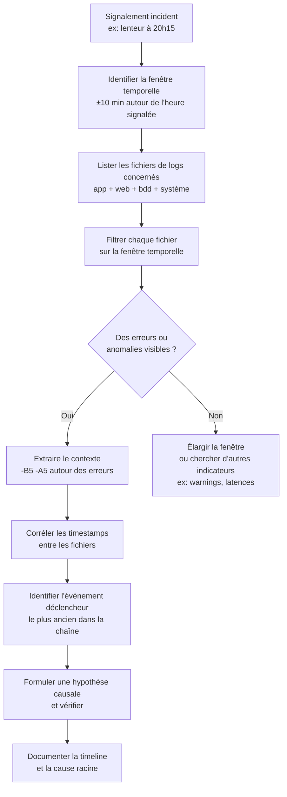

# Analyse avancée des logs

## Objectifs pédagogiques

À l'issue de ce module, tu seras capable de :

- **Localiser** rapidement les fichiers de logs pertinents sur un système Linux ou Windows selon le type d'application
- **Filtrer et extraire** les lignes significatives d'un fichier de logs volumineux avec `grep`, `awk` et `sed`
- **Identifier** les patterns d'erreurs récurrents et distinguer une anomalie isolée d'une dégradation progressive
- **Reconstituer** une séquence d'événements à partir de logs multi-sources pour comprendre la cause racine d'un incident
- **Mettre en place** une lecture de logs structurée qui fait gagner du temps en production

---

## Mise en situation

Tu es technicien support applicatif dans une entreprise de e-commerce. Un lundi matin, le responsable e-commerce t'appelle : *"Le site a été lent à mourir pendant 20 minutes hier soir entre 20h15 et 20h35. Des clients ont abandonné leur panier. C'est quoi le problème ?"*

Tu n'étais pas là. Personne n'était là. La seule chose que tu as, ce sont les logs.

Le problème avec les logs, c'est qu'il y en a **partout** — logs applicatifs, logs serveur web, logs base de données, logs système — et qu'ils pèsent souvent plusieurs centaines de mégaoctets. Chercher manuellement "ce qui s'est passé à 20h15" dans un fichier de 800 000 lignes sans méthode, c'est comme chercher une aiguille dans une botte de foin avec les yeux bandés.

Ce module t'apprend à retirer le bandeau.

---

## Pourquoi les logs sont ta seule source de vérité — et pourquoi ils te noient

Un log, c'est la mémoire de ce qu'une application a vécu. Chaque requête traitée, chaque erreur levée, chaque connexion ouverte ou fermée — si c'est bien configuré, c'est quelque part dans un fichier.

Le problème n'est pas le manque d'information. C'est l'excès. Une application en production peut générer **plusieurs milliers de lignes par minute**. Sans méthode de lecture, tu te noies.

Deux erreurs classiques face aux logs :

- **Lire de haut en bas** en espérant tomber sur quelque chose. Inefficace, et tu passeras à côté de l'essentiel.
- **Chercher uniquement le mot "ERROR"** et ignorer le contexte. Trompeur — une erreur sans ce qui précède ne raconte qu'une partie de l'histoire, parfois la mauvaise.

La bonne approche : **interroger les logs comme une base de données**. Tu sais ce que tu cherches, tu filtres, tu croises les sources, tu reconstitues une timeline. Ce module te donne les outils et la méthode pour faire exactement ça.

---

## Anatomie d'une ligne de log

Avant de filtrer quoi que ce soit, il faut comprendre ce qu'on lit. La structure varie selon l'application, mais la grande majorité des logs suivent ce pattern :

```
[TIMESTAMP] [NIVEAU] [SOURCE] MESSAGE
```

Trois exemples concrets — log Apache, log applicatif Java, log système — extraits d'un même incident :

```
# Log Apache (access.log)
192.168.1.45 - - [12/Mar/2024:20:17:32 +0100] "GET /checkout HTTP/1.1" 503 0 "-" "Mozilla/5.0"

# Log applicatif Java (application.log)
2024-03-12 20:17:33,412 ERROR [com.shop.OrderService] - Database connection timeout after 30000ms

# Log système (syslog)
Mar 12 20:17:31 web01 kernel: Out of memory: Kill process 14823 (java) score 892 or sacrifice child
```

Ces trois lignes, extraites de trois fichiers différents, racontent ensemble une histoire très précise : à 20h17, l'OS a tué le processus Java faute de mémoire, ce qui a provoqué des timeouts de connexion base de données dans l'application, visibles côté web sous forme de codes 503.

Aucun des trois fichiers, pris isolément, ne donne la cause. C'est leur **corrélation temporelle** qui révèle la chaîne de défaillances.

🧠 Un incident a rarement une seule ligne de log. La cause racine se lit dans le croisement de plusieurs fichiers, pas dans un seul.

---

## Où sont les logs ?

Selon l'environnement, les logs ne sont pas au même endroit. Voilà les emplacements à connaître par cœur :

| Type de log | Linux | Windows |
|---|---|---|
| Système | `/var/log/syslog` ou `/var/log/messages` | Observateur d'événements → Système |
| Application web (Apache) | `/var/log/apache2/error.log` | `C:\Apache24\logs\error.log` |
| Application web (Nginx) | `/var/log/nginx/error.log` | `C:\nginx\logs\error.log` |
| Application Java / Tomcat | `/var/log/tomcat9/catalina.out` | `C:\tomcat\logs\catalina.out` |
| Base de données (MySQL) | `/var/log/mysql/error.log` | `C:\ProgramData\MySQL\...` |
| Authentification | `/var/log/auth.log` | Observateur → Sécurité |
| Application métier | Défini dans la config — souvent `/opt/<appli>/logs/` | `C:\<appli>\logs\` |

💡 Sur Linux, si tu ne sais pas où une application écrit ses logs, commence par `systemctl status <service>` : la dernière sortie standard est souvent affichée directement. Sinon, `lsof -p $(pgrep <nom_processus>) | grep log` te montrera les fichiers actuellement ouverts par le processus.

---

## Les outils du diagnostic

### `grep` — Filtrer les lignes pertinentes

C'est l'outil de base. Son superpouvoir : chercher un pattern dans un fichier de plusieurs centaines de mégaoctets en quelques secondes.

```bash
# Chercher toutes les lignes contenant "ERROR"
grep "ERROR" /var/log/app/application.log

# Ne pas tenir compte de la casse
grep -i "error" /var/log/app/application.log

# Afficher 5 lignes avant et après la correspondance — le contexte fait toute la différence
grep -B 5 -A 5 "OutOfMemoryError" /var/log/app/application.log

# Compter le nombre d'occurrences sans afficher les lignes
grep -c "ERROR" /var/log/app/application.log

# Chercher récursivement dans tous les .log d'un dossier
grep -r "ERROR" /var/log/app/

# Exclure un pattern connu sans intérêt (les erreurs attendues)
grep "ERROR" application.log | grep -v "IgnorableHealthCheckException"
```

⚠️ Chercher `"ERROR"` sans contexte, c'est souvent insuffisant. Deux lignes d'erreur identiques peuvent avoir des causes très différentes selon ce qui les précède. Prends l'habitude d'utiliser `-B 3 -A 3` systématiquement au début d'une investigation — tu affines ensuite.

Les **expressions régulières** permettent d'aller bien plus loin, notamment pour filtrer par timestamp :

```bash
# Filtrer sur une plage horaire (entre 20h15 et 20h35)
grep "20:1[5-9]\|20:2[0-9]\|20:3[0-5]" /var/log/app/application.log

# Trouver les codes HTTP 5xx dans un access log
grep -E "\" 5[0-9]{2} " /var/log/apache2/access.log

# Détecter des durées de traitement anormalement longues (5 chiffres = > 10 000ms)
grep -E "([0-9]{5,})ms" /var/log/app/application.log
```

### `awk` — Extraire des champs et calculer

Là où `grep` filtre des lignes entières, `awk` travaille sur les **colonnes**. C'est l'outil parfait pour extraire un champ précis ou agréger des valeurs.

```bash
# Afficher uniquement le timestamp et le message (colonnes 1, 2 et 5)
awk '{print $1, $2, $5}' /var/log/app/application.log

# Compter les erreurs par type — utile pour voir quel composant souffre le plus
awk '/ERROR/ {count[$3]++} END {for (k in count) print count[k], k}' application.log | sort -rn

# Extraire les temps de réponse et calculer la moyenne
awk '/request_time/ {sum += $NF; count++} END {print "Moyenne:", sum/count "ms"}' access.log
```

### `sed` — Transformer à la volée

`sed` est utile pour nettoyer ou reformater des logs avant de les analyser, et pour masquer des données sensibles dans un export vers une équipe externe.

```bash
# Supprimer les lignes DEBUG pour réduire le bruit
sed '/DEBUG/d' application.log

# Masquer les adresses IP (pour partager un log sans données personnelles)
sed 's/[0-9]\{1,3\}\.[0-9]\{1,3\}\.[0-9]\{1,3\}\.[0-9]\{1,3\}/[IP_MASQUEE]/g' access.log

# Extraire uniquement une fenêtre temporelle entre deux patterns
sed -n '/20:15:00/,/20:35:00/p' application.log
```

### `tail` et `less` — Suivre et naviguer

```bash
# Suivre un log en temps réel
tail -f /var/log/app/application.log

# Suivre plusieurs fichiers simultanément (avec indication du nom de fichier)
tail -f /var/log/app/application.log /var/log/nginx/error.log

# Voir les 100 dernières lignes
tail -n 100 /var/log/app/application.log

# Lire un gros fichier avec navigation complète
less /var/log/app/application.log
# Dans less : /PATTERN pour chercher, n pour l'occurrence suivante, G pour aller à la fin
```

💡 Dans `less`, appuie sur `F` pour passer en mode "follow" — l'équivalent de `tail -f`. Appuie sur `Ctrl+C` pour revenir à la navigation normale sans quitter. C'est bien plus pratique que `tail -f` quand tu veux alterner entre "voir en direct" et "remonter dans l'historique" pour comprendre ce qui a précédé une erreur.

---

## Méthode : reconstituer une timeline

Quand tu reçois un signalement d'incident, l'approche qui fonctionne en production n'est pas une checklist mécanique — c'est une façon de penser. Le diagramme ci-dessous l'illustre, mais l'essentiel est dans l'étape clé : **identifier l'événement déclencheur**.



Dans une chaîne de défaillances, il y a toujours **un premier domino**. Trouver le plus ancien événement anormal dans tes logs, c'est trouver la cause — tout le reste, c'est la propagation. Ne t'attarde pas sur les erreurs visibles en surface : elles sont presque toujours des conséquences.

---

## Enchaîner les outils : la vraie puissance des pipes

Chaque outil est utile seul, mais leur vraie puissance vient de la composition avec des pipes. Quelques patterns à avoir en tête :

```bash
# Compter les erreurs par minute sur une fenêtre temporelle
grep "ERROR" application.log | awk '{print $1, $2}' | cut -d: -f1-2 | sort | uniq -c

# Top 10 des URLs les plus lentes (champ $7 = URL, $NF = temps en secondes)
awk '$NF > 1.0 {print $7}' access.log | sort | uniq -c | sort -rn | head -10

# Fréquence des codes HTTP — détecte immédiatement une vague de 503
awk '{print $9}' /var/log/nginx/access.log | sort | uniq -c | sort -rn

# Trouver les pics de charge — requêtes par seconde
awk '{print $4}' access.log | cut -d: -f2 | sort | uniq -c | sort -rn | head -20

# Extraire les stack traces complètes (souvent multi-lignes)
grep -A 30 "Exception" application.log | grep -v "^--$"
```

Pour les logs **compressés** (rotation automatique), pas besoin de les décompresser avant d'analyser :

```bash
# Chercher directement dans un .gz
zgrep "ERROR" application.log.2024-03-12.gz

# Compter les erreurs dans une archive sans décompression
zcat application.log.2024-03-12.gz | grep "ERROR" | wc -l
```

---

## Problèmes courants et comment les résoudre

### "Je ne trouve rien alors qu'il y a clairement eu un problème"

**Cause probable** : Le niveau de log est trop restrictif (`WARN` ou `ERROR` seulement), ou tu ne consultes pas le bon fichier.

Deux choses à vérifier :
1. Le niveau de log dans la config applicative — cherche `log4j.properties`, `logback.xml` ou `logging.properties`
2. L'existence de plusieurs fichiers de log — souvent un `application.log` et un `error.log` distincts

```bash
# Trouver les fichiers modifiés récemment dans /var/log
find /var/log -name "*.log" -newer /tmp/reference_file
```

### Les timestamps ne correspondent pas à l'heure signalée

**Cause probable** : Décalage de timezone entre le serveur et l'utilisateur, ou entre plusieurs serveurs.

```bash
# Vérifier la timezone du serveur
timedatectl

# Convertir un timestamp UTC en heure locale
date -d "2024-03-12 19:15:00 UTC" +"%Y-%m-%d %H:%M:%S %Z"
```

🧠 Dans une architecture avec plusieurs serveurs, normalise toujours les timestamps en UTC avant de corréler des logs. Un décalage d'une heure entre deux fichiers peut te faire manquer une corrélation qui est pourtant bien réelle.

### Le fichier est trop gros pour être lu ou transféré

```bash
# Extraire uniquement la fenêtre utile dans un nouveau fichier
awk '/2024-03-12 20:15/,/2024-03-12 20:35/' application.log > incident_20h15.log

# Évaluer la taille et la vitesse de génération
wc -l application.log
ls -lh application.log
```

### "J'ai une stack trace Java mais je ne sais pas quoi en faire"

Une stack trace se lit **de haut en bas**, mais la cause originelle est dans les lignes `Caused by:`, pas dans la première exception affichée.

```
java.lang.RuntimeException: Unable to process order
    at com.shop.OrderService.createOrder(OrderService.java:142)
    at com.shop.CheckoutController.submit(CheckoutController.java:87)
    ...
Caused by: java.sql.SQLTimeoutException: Connection timeout after 30000ms
    at com.mysql.jdbc.ConnectionImpl.createNewIO(ConnectionImpl.java:2181)
```

L'erreur visible est `RuntimeException`, mais la vraie cause est `SQLTimeoutException`. C'est toujours **le dernier `Caused by:`** qui t'intéresse en premier. Le reste de la stack trace te dit où l'erreur a remonté, pas où elle est née.

---

## Cas réel en entreprise

**Contexte** : Application de gestion de stocks, 50 utilisateurs internes. Signalement à 10h30 : "L'appli est très lente depuis ce matin, parfois ça répond, parfois ça timeout."

**Étape 1 — Borner la fenêtre.** Le signalement arrive à 10h30, l'appli est ouverte depuis 8h00. On commence là.

```bash
grep -E "ERROR|WARN|timeout|exception" /opt/stockapp/logs/application.log | \
  awk '$1 >= "2024-03-13 08:00"' | head -50
```

Résultat : augmentation progressive de warnings `Connection pool exhausted` à partir de **8h47**.

**Étape 2 — Corréler avec le système.** Quelque chose s'est passé avant 8h47 pour provoquer cet épuisement du pool.

```bash
grep "Mar 13 08:[4-5]" /var/log/syslog | grep -i "mysql\|memory\|oom"
```

Un log MySQL apparaît à **08h44** : `Too many connections`.

**Étape 3 — Vérifier les logs MySQL.**

```bash
grep "2024-03-13 08:4" /var/log/mysql/error.log
```

À 08h44:12, MySQL log `Aborted connection` sur 47 connexions consécutives, toutes provenant de la même IP — celle du serveur applicatif.

**Étape 4 — Remonter à la cause.** En cherchant ce qui s'est passé côté applicatif juste avant 08h44, on trouve un batch de synchronisation automatique configuré pour 08h45, qui ouvre 200 connexions simultanées sans les fermer correctement — à cause d'un bug introduit dans la version déployée la veille au soir.

**Résultat** : bug identifié, hotfix déployé à 11h15, incident résolu. Durée de diagnostic : **25 minutes**, grâce à la corrélation systématique des logs sur une fenêtre temporelle bornée.

---

## Bonnes pratiques

**1. Commence toujours par borner temporellement.** Avant de chercher quoi que ce soit, détermine ta fenêtre. Les logs ont une dimension temporelle — l'utiliser réduit le volume à analyser de 90% et t'empêche de te noyer.

**2. Lis dans l'ordre inverse de la chaîne.** Commence par l'interface utilisateur (log web), puis l'application, puis la base de données. L'erreur visible côté utilisateur est presque toujours une conséquence, pas la cause.

**3. Ne jamais analyser un seul fichier en isolation.** Un incident traverse plusieurs couches. Si tu te limites à un seul fichier, tu vois l'effet — pas le déclencheur.

**4. Méfie-toi des faux positifs.** Certaines erreurs dans les logs sont normales et attendues : health checks qui retournent 404, reconnexions automatiques, etc. Avant de paniquer sur un `ERROR`, demande-toi si cette erreur existait aussi *avant* l'incident.

**5. Documente ta timeline au fur et à mesure.** Quand tu investigues, note immédiatement les timestamps et les événements dans un fichier texte. Reconstituer une timeline 2h après l'avoir parcourue de tête, c'est pratiquement impossible.

**6. Vérifie la rétention avant d'investiguer.** Si les logs sont configurés pour être écrasés toutes les 24h et que l'incident date d'avant-hier, tu es peut-être déjà trop tard. Connaître la politique de rotation *avant* un incident, c'est un réflexe à acquérir — pas une précaution après coup.

**7. Automatise les recherches récurrentes.** Si tu fais le même `grep | awk | sort | uniq -c` tous les matins, mets-le dans un script. Dix minutes d'écriture pour trente minutes gagnées par semaine — et zéro risque d'oublier un flag.

---

## Résumé

Analyser des logs efficacement, c'est d'abord une question de méthode avant d'être une question d'outils. La combinaison `grep` / `awk` / `sed` / `tail` couvre la grande majorité des besoins sur un système Linux — à condition de les enchaîner intelligemment plutôt que de les utiliser isolément.

Le vrai gain de temps vient de la **corrélation multi-sources** : un incident ne se lit jamais dans un seul fichier. Apprendre à reconstruire une timeline à partir de trois fichiers distincts, c'est ce qui distingue un technicien qui "cherche" d'un technicien qui "trouve". Borner temporellement, corréler, identifier le premier domino — c'est la séquence qui fonctionne en production.

---

<!-- snippet
id: logs_grep_contexte
type: command
tech: grep
level: intermediate
importance: high
tags: grep,logs,diagnostic,contexte,linux
title: grep avec contexte avant/après la correspondance
command: grep -B <N_AVANT> -A <N_APRES> "<PATTERN>" <FICHIER>
example: grep -B 5 -A 5 "OutOfMemoryError" /var/log/app/application.log
description: Affiche N lignes avant et après chaque correspondance — indispensable pour comprendre la cause d'une erreur, pas juste la constater
-->

<!-- snippet
id: logs_grep_regex_horaire
type: command
tech: grep
level: intermediate
importance: high
tags: grep,regex,timestamp,logs,filtrage
title: Filtrer les logs sur une plage horaire avec grep
command: grep "HH:M[<MIN_DEBUT>-<MIN_FIN>]" <FICHIER>
example: grep "20:1[5-9]\|20:2[0-9]\|20:3[0-5]" /var/log/app/application.log
description: Utiliser une regex sur le timestamp pour isoler une fenêtre temporelle précise — réduit le volume à analyser de façon radicale
-->

<!-- snippet
id: logs_awk_top_erreurs
type: command
tech: awk
level: intermediate
importance: medium
tags: awk,logs,comptage,erreurs,frequence
title: Compter les erreurs par type avec awk
command: awk '/ERROR/ {count[$3]++} END {for (k in count) print count[k], k}' <FICHIER> | sort -rn
example: awk '/ERROR/ {count[$3]++} END {for (k in count) print count[k], k}' application.log | sort -rn
description: Agrège les erreurs par le 3ème champ (souvent la source/classe) et trie par fréquence — identifie les composants qui génèrent le plus d'erreurs
-->

<!-- snippet
id: logs_pipe_codes_http
type: command
tech: awk
level: intermediate
importance: medium
tags: awk,nginx,apache,http,codes,access-log
title: Fréquence des codes HTTP dans un access log
command: awk '{print $9}' <ACCESS_LOG> | sort | uniq -c | sort -rn
example: awk '{print $9}' /var/log/nginx/access.log | sort | uniq -c | sort -rn
description: Extrait le code HTTP (9ème colonne du format combined) et les classe par fréquence — détecte immédiatement une vague de 503/504 ou 404 anormaux
-->

<!-- snippet
id: logs_zgrep_archive
type: command
tech: grep
level: intermediate
importance: medium
tags: grep,gzip,rotation,archives,logs
title: Chercher dans des logs compressés sans les décompresser
command: zgrep "<PATTERN>" <FICHIER>.gz
example: zgrep "ERROR" /var/log/app/application.log.2024-03-12.gz
description: zgrep opère directement sur les .gz — évite la décompression temporaire et fonctionne avec tous les flags grep habituels
-->

<!-- snippet
id: logs_stack_trace_java
type: concept
tech: java
level: intermediate
importance: high
tags: java,stack-trace,exception,debug,logs
title: Lire une stack trace Java — partir du dernier "Caused by"
content: Une stack trace Java se lit de haut en bas, mais la cause réelle est dans le dernier bloc "Caused by:". Les premières lignes montrent où l'erreur a été remontée (la conséquence), pas où elle a été générée. Ex : RuntimeException visible → chercher Caused by: SQLTimeoutException plus bas — c'est là qu'est le vrai problème.
description: Le premier type d'exception affiché est la conséquence — la cause originelle est dans le dernier "Caused by:" de la chaîne
-->

<!-- snippet
id: logs_lsof_trouver_fichier
type: command
tech: linux
level: intermediate
importance: medium
tags: lsof,processus,logs,linux,diagnostic
title: Trouver les fichiers de logs ouverts par un processus
command: lsof -p $(pgrep <NOM_PROCESSUS>) | grep log
example: lsof -p $(pgrep java) | grep log
description: Affiche les fichiers actuellement ouverts par le processus — permet de localiser les logs d'une application dont on ne connaît pas la config
-->

<!-- snippet
id: logs_sed_extraction_fenetre
type: command
tech: sed
level: intermediate
importance: medium
tags: sed,extraction,timestamp,fenetre,logs
title: Extraire une fenêtre temporelle avec sed
command: sed -n '/<TIMESTAMP_DEBUT>/,/<TIMESTAMP_FIN>/p' <FICHIER> > <FICHIER_SORTIE>
example: sed -n '/20:15:00/,/20:35:00/p' /var/log/app/application.log > incident_extract.log
description: Extrait toutes les lignes entre deux patterns de timestamp — utile pour isoler un incident dans un gros fichier et travailler sur un sous-ensemble
-->

<!-- snippet
id: logs_correlation_timezone
type: warning
tech: linux
level: intermediate
importance: high
tags: timezone,timestamp,correlation,logs,utc
title: Décalage de timezone entre serveurs — piège de corrélation
content: Piège : corréler des logs de deux serveurs sans vérifier leur timezone. Un serveur en UTC et un serveur en Europe/Paris ont 1h de décalage en hiver, 2h en été. Conséquence : on cherche une corrélation à 20h17 sur l'un et 21h17 sur l'autre — la causalité est invisible. Correction : vérifier avec timedatectl sur chaque serveur et normaliser en UTC avant toute corrélation.
description: Toujours vérifier la timezone des serveurs avant de corréler des logs multi-sources — un décalage masque des causalités réelles
-->

<!-- snippet
id: logs_less_navigation
type: tip
tech: linux
level: beginner
importance: medium
tags: less,navigation,logs,recherche,linux
title: less — alterner navigation et suivi temps réel
content: Dans less, taper F active le mode "follow" (équivalent tail -f). Ctrl+C revient à la navigation normale. Pour chercher : /PATTERN puis n pour l'occurrence suivante. G va à la fin du fichier, g au début. Bien plus utile que tail -f quand on veut alterner entre observation en direct et remontée dans l'historique.
description: less +F combine suivi temps réel et navigation libre — appuyer sur Ctrl+C pour repasser en mode navigation sans quitter less
-->

<!-- snippet
id: logs_rotation_retention
type: warning
tech: linux
level: intermediate
importance: high
tags: rotation,retention,logs,incident,diagnostic
title: Vérifier la rétention des logs avant d'investiguer
content: Piège : commencer une investigation et découvrir que les logs du jour J ont été écrasés par la rotation automatique. Si logrotate est configuré en daily + compress + rotate 7, les logs de plus de 7 jours sont perdus. Correction : avant toute investigation sur un incident ancien, vérifier cat /etc/logrotate.d/<service> et confirmer que la fenêtre temporelle est encore couverte.
description: Avant d'investiguer un incident, vérifier /etc/logrotate.d/<service> pour confirmer que les logs de la période concernée existent encore
-->
