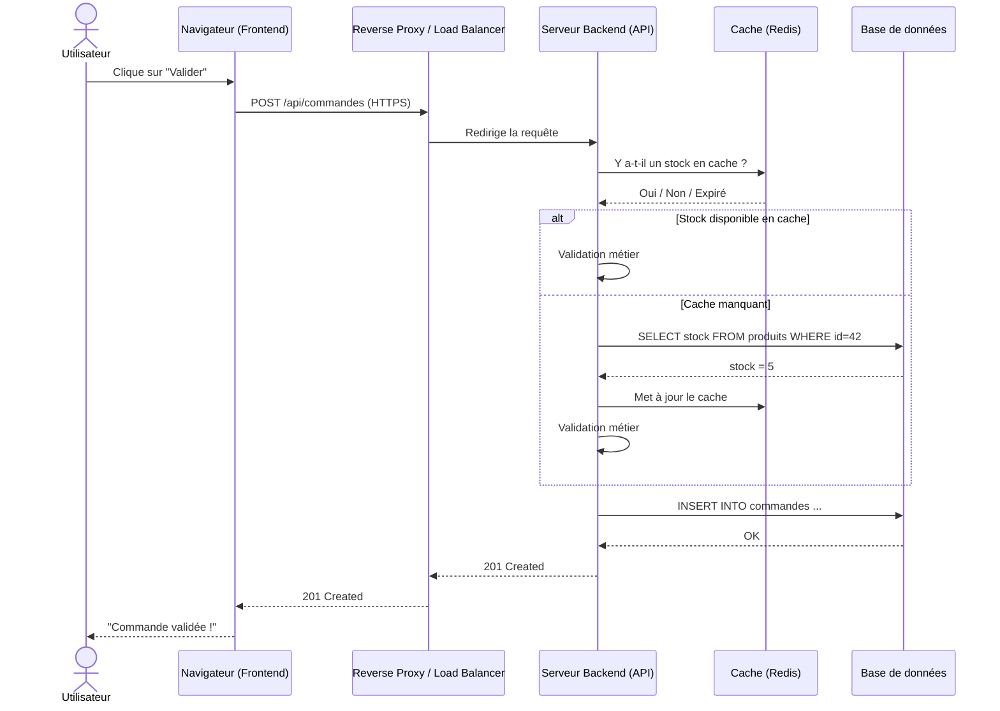

# Architecture applicative réelle

## Objectifs pédagogiques

À l'issue de ce module, vous serez capable de :

1. **Identifier** les composants d'une architecture applicative standard — frontend, backend, base de données, cache, reverse proxy — et le rôle de chacun
2. **Lire** un schéma d'architecture et reconstituer mentalement le chemin d'une requête
3. **Localiser** l'origine d'un incident en suivant le flux de bout en bout plutôt qu'en cherchant au symptôme visible
4. **Distinguer** une architecture monolithique d'une architecture microservices, et adapter sa stratégie de diagnostic en conséquence
5. **Anticiper** les points de défaillance les plus fréquents selon le type d'architecture rencontré en production

---

## Mise en situation

Il est 10h30. Un utilisateur ouvre un ticket : *"L'application de gestion des commandes ne répond plus."*

Vous ouvrez l'application dans votre navigateur — page blanche. Timeout au bout de 30 secondes.

Où est le problème ? Le serveur web ? La base de données ? Un service tiers qui ne répond plus ? Le réseau interne ? Un cache expiré ? Un batch qui tourne en arrière-plan et sature les ressources ?

Si vous ne savez pas comment l'application est construite, vous allez chercher au hasard. Peut-être que vous tomberez dessus par chance. Peut-être pas. Et le métier attend.

C'est exactement pour ça qu'on commence par l'architecture : pas pour devenir développeur, mais pour savoir **où regarder** quand quelque chose ne va plus.

---

## Ce qu'est une architecture — et pourquoi ça change tout pour le support

Une **architecture applicative**, c'est simplement la façon dont les différentes parties d'une application sont organisées et reliées entre elles. Presque aucune application n'est un bloc unique : elle est composée de couches, de services, de briques qui communiquent en permanence.

Pensez à un restaurant. Il y a la salle (ce que voit le client), la cuisine (là où ça se passe vraiment), le garde-manger (le stockage), et parfois un traiteur externe pour certains plats. Si les plats arrivent froids, le problème n'est pas forcément en cuisine — peut-être que c'est le chemin entre la cuisine et la salle qui est trop long, ou que le traiteur n'a pas livré.

Une application web fonctionne pareil. Et comme pour un restaurant, diagnostiquer un problème sans connaître l'organisation interne, c'est tâtonner dans le noir.

🧠 En support applicatif, comprendre l'architecture ne sert pas à coder. Ça sert à poser les bonnes questions et à aller directement au bon endroit.

---

## Les grandes couches d'une application

Quelle que soit l'application, on retrouve presque toujours les mêmes grandes couches. Voici leur rôle et — surtout — ce qu'elles signifient pour vous quand ça plante.

### Le frontend — ce que voit l'utilisateur

L'interface : navigateur web, application mobile, client lourd. Le frontend envoie des requêtes et affiche les résultats. Il ne fait pas de traitement métier complexe.

En support, c'est souvent ici que le problème se manifeste — mais rarement là où il trouve son origine. Un écran blanc peut venir de n'importe quelle couche derrière.

### Le backend — là où la logique vit

Le cœur de l'application. Le backend reçoit les requêtes du frontend, applique les règles métier (calculs, validations, autorisations), et va chercher ou écrire des données. Il peut être une seule application ou plusieurs services distincts.

C'est souvent ici que se trouvent les erreurs applicatives : timeout, exception non gérée, règle métier mal appliquée.

### La base de données — la mémoire long terme

Toutes les données persistantes vivent ici : comptes utilisateurs, commandes, stocks, historiques. Composant critique : si elle est lente ou indisponible, tout le reste s'effondre avec elle. Les problèmes classiques sont les connexions saturées (*pool exhausted*), les requêtes lentes faute d'index, l'espace disque plein ou les verrous (*deadlock*).

### Le cache — la mémoire rapide

Pour ne pas interroger la base de données à chaque requête, les applications gardent certains résultats en mémoire — typiquement dans Redis ou Memcached. C'est rapide, volatile, et source de bugs subtils quand les données en cache ne correspondent plus à la réalité. On y reviendra, parce que c'est souvent le coupable invisible.

### Le reverse proxy et le load balancer — les aiguilleurs du trafic

Avant même d'arriver au backend, les requêtes passent souvent par un reverse proxy (Nginx, Apache) qui les redirige vers le bon service. En cas de forte charge, un load balancer répartit le trafic sur plusieurs instances pour éviter la saturation.

⚠️ Beaucoup de techniciens pensent immédiatement à la base de données quand l'application est lente, parce qu'elle "contient les données". En réalité, un cache mal configuré, un reverse proxy saturé ou un backend qui enchaîne trop d'appels réseau produisent exactement les mêmes symptômes. La leçon : suivre le chemin de la requête de bout en bout, pas sauter aux conclusions.

---

## Le chemin d'une requête — de l'utilisateur à la réponse

Voici ce qui se passe concrètement quand un utilisateur clique sur "Valider ma commande" :

Ce diagramme illustre quelque chose de fondamental : **une seule action utilisateur peut déclencher une dizaine d'opérations internes**. Une panne à n'importe quelle étape produit une erreur ou un timeout côté utilisateur — avec des symptômes parfois identiques, quelle que soit l'étape en cause.

C'est pour ça qu'en support, la première question n'est pas *"qu'est-ce qui ne marche pas ?"* mais **"à quelle étape ça bloque ?"**

---

## Monolithe vs microservices — ce que ça change pour vous

Ces deux termes reviennent constamment dans les discussions avec les développeurs et les OPS. Ce qui compte ici, ce n'est pas leur définition théorique — c'est l'impact direct sur votre façon de diagnostiquer.

### Le monolithe

Toute la logique métier est dans **une seule application déployée d'un bloc**. La gestion des commandes, des stocks, des utilisateurs, de la facturation — tout est dans le même code, sur le même serveur.

C'est simple à comprendre et à déboguer : les logs sont généralement au même endroit, il y a un seul point d'accès. Les incidents ont tendance à être soit très localisés (une fonction qui lève une exception) soit totaux (le processus entier est mort). Dans les deux cas, vous savez où chercher.

Inconvénient majeur : si une partie consomme trop de ressources, elle impacte tout le reste. Et redéployer une fonctionnalité, c'est redéployer l'application entière.

### Les microservices

Chaque fonctionnalité métier devient **un service indépendant** : un service commandes, un service stock, un service paiement, un service notifications. Chacun tourne dans son propre processus, avec sa propre base de données, et communique avec les autres via des API ou des files de messages.

L'avantage : on peut faire évoluer, déployer ou redémarrer un service sans toucher aux autres.

Pour le support, en revanche, **la complexité explose**. Un incident peut trouver son origine dans n'importe quel service de la chaîne, et la cause est parfois plusieurs sauts de communication plus loin que le symptôme visible. Sans outil de tracing distribué, vous êtes aveugle.

| Critère | Monolithe | Microservices |
|---|---|---|
| Logs | Centralisés, un seul endroit | Distribués, un fichier par service |
| Isolation des pannes | Faible — une panne peut tout affecter | Bonne si bien conçu |
| Nature des incidents | Souvent totaux ou très localisés | Souvent partiels, intermittents |
| Latence réseau interne | Nulle (appels locaux) | Réelle (appels HTTP entre services) |
| Outil de diagnostic | Logs + APM basique | Tracing distribué indispensable (Jaeger, Zipkin, Datadog) |
| Fréquence en PME | Très courante | En croissance, encore minoritaire |

💡 Quand vous arrivez sur un nouvel environnement, la première question à poser à l'équipe technique : *"C'est quoi l'architecture — monolithe ou microservices ?"*. La réponse change complètement votre stratégie de diagnostic avant même d'ouvrir un seul fichier de log.

---

## Les composants que vous rencontrerez en production

Au-delà des grandes couches, voici les briques concrètes que vous croiserez dans la quasi-totalité des environnements.

**Nginx / Apache** — Le reverse proxy sert les fichiers statiques et relaie les requêtes dynamiques vers le backend. Un Nginx mal configuré ou saturé peut bloquer toutes les requêtes sans que le backend soit en cause.

**PostgreSQL, MySQL, MariaDB, SQL Server** — Les bases relationnelles classiques. Quand elles posent problème : pool de connexions épuisé, requête lente (index manquant), disque plein, ou deadlock entre transactions concurrentes.

**Redis** — Le cache distribué le plus répandu. Il stocke des sessions utilisateur, des résultats de requêtes, parfois des files d'attente légères. Point critique : Redis est volatile. Un redémarrage efface tout — ce qui peut déclencher une vague de reconnexions simultanées et saturer la base de données.

**RabbitMQ, Kafka, ActiveMQ** — Les message brokers. Quand deux services ne doivent pas communiquer directement, ils passent par une file : le producteur dépose un message, le consommateur le traite plus tard. Si la file s'accumule sans baisser, c'est presque toujours signe que le consommateur est en panne — pas le broker lui-même.

**API Gateway** — Dans les architectures microservices, c'est le point d'entrée unique pour toutes les requêtes externes. Elle gère l'authentification, le routage, parfois le rate limiting. Si elle tombe, toute l'application devient inaccessible — même si tous les services backend sont en parfaite santé. En cas de panne totale et soudaine sur une architecture microservices, c'est la première chose à vérifier.

---

## Cas réel — Le bug qui venait du cache

**Contexte** : Application de gestion RH, architecture monolithique, base PostgreSQL, Redis pour les sessions et les données de référentiel (liste des postes, des départements).

**Incident** : Après un déploiement, des utilisateurs signalent que la liste des départements affichée dans un formulaire ne correspond plus à la réalité. Certains voient d'anciens départements supprimés, d'autres voient la bonne liste. Le comportement n'est pas reproductible de façon cohérente.

**Pourquoi ?** Redis n'avait pas été vidé après le déploiement. Les utilisateurs dont la session était récente récupéraient les données depuis le cache — l'ancien référentiel. Ceux dont la session était expirée forçaient un rechargement depuis la base de données — la nouvelle version. Résultat : deux vérités coexistaient dans le même système.

**Résolution** : Flush ciblé des clés de référentiel dans Redis. Cinq minutes une fois la cause identifiée.

**Ce que ce cas enseigne** : Le "bug applicatif" était un problème de cohérence cache / base de données. Sans connaître l'architecture — et sans savoir que Redis existait et ce qu'il stockait —, on pouvait passer des heures à chercher dans le code ou dans les données sans jamais trouver. C'est le cas typique où la connaissance de l'architecture vaut plus que n'importe quel outil de debug.

---

## Lire un schéma d'architecture — les réflexes à acquérir

Quand on vous donne un schéma ou qu'on vous explique verbalement comment l'application est construite, voici ce qu'il faut identifier systématiquement — dans cet ordre.

**Les points d'entrée.** Par où arrivent les requêtes ? Reverse proxy ? API Gateway ? Accès direct au backend ? C'est là que commence votre chemin de diagnostic.

**Les dépendances critiques.** Quels composants sont indispensables au fonctionnement de tout le reste ? Si la base de données tombe, que se passe-t-il ? Si un service externe (SSO, paiement) est indisponible, est-ce que l'application dégrade proprement ou s'effondre ?

**Les points de redondance.** Y a-t-il plusieurs instances du backend ? Un failover pour la base de données ? Si oui, une panne peut être partielle et intermittente — ce qui complique le diagnostic, mais indique aussi que le système peut encaisser.

**Les frontières réseau.** Quels composants communiquent entre eux, sur quel port ? Un firewall ou une règle réseau peut bloquer silencieusement une communication sans générer d'erreur explicite.

**Le stockage de session.** Où sont stockées les sessions utilisateur ? En mémoire du backend (problème si plusieurs instances sans sticky session), en base de données, ou dans Redis ? Cette réponse explique beaucoup de comportements "bizarres" liés à l'authentification.

🧠 Un incident de production suit presque toujours le chemin de la requête. Si vous connaissez ce chemin, vous pouvez tester chaque étape et identifier la rupture. Sans cette connaissance, vous cherchez une aiguille dans une botte de foin.

---

## Bonnes pratiques

**Documentez l'architecture dès l'onboarding, avant le premier incident.** Si un schéma n'existe pas, dessinez-le vous-même à partir de ce que vous observez et faites-le valider. Ce document sera votre carte de navigation quand la pression monte.

**Ne supposez jamais que le problème est là où le symptôme apparaît.** Une erreur dans le navigateur peut venir du frontend, du backend, de la base de données, du cache, d'un service tiers ou du réseau. Suivez le chemin — toujours.

**Apprenez où sont les logs de chaque composant avant d'en avoir besoin.** Nginx a les siens, le backend les siens, PostgreSQL aussi, Redis aussi. En microservices, chaque service a les siens. Savoir où chercher sans avoir à demander à chaque incident, ça change la vitesse de résolution de manière significative.

**Traitez le cache comme un suspect systématique.** Il est la source des comportements les plus déroutants en support : données incohérentes entre utilisateurs, modifications qui "ne prennent pas", erreurs intermittentes impossibles à reproduire. Réflexe : toujours vérifier si un cache est impliqué avant de conclure à un bug applicatif.

⚠️ **Ne redémarrez pas le serveur en premier réflexe.** C'est le piège classique : ça masque le symptôme sans identifier la cause, et ça peut aggraver la situation — vider Redis, interrompre des transactions en cours, déclencher une vague de reconnexions sur la base de données. Règle simple : diagnostiquer d'abord, redémarrer seulement si le diagnostic le justifie et si vous avez capturé les preuves nécessaires.

**En microservices, exigez un outil de tracing.** Jaeger, Zipkin, Datadog APM — ces outils permettent de suivre une requête à travers tous les services et d'identifier exactement lequel a introduit la latence ou l'erreur. Sans ça, vous êtes structurellement aveugle sur une bonne partie des incidents.

---

## Résumé

Une architecture applicative réelle est composée de plusieurs couches — frontend, backend, base de données, cache, reverse proxy — qui communiquent en permanence. Chaque brique a un rôle précis et des points de défaillance qui lui sont propres. Un symptôme visible côté utilisateur peut trouver son origine à n'importe quelle étape de ce chemin.

La distinction monolithe / microservices change profondément la stratégie de diagnostic : logs centralisés et pannes franches d'un côté, logs distribués et incidents partiels de l'autre. Le cache mérite une attention particulière — souvent invisible dans les schémas simplifiés, il est impliqué dans une proportion significative d'incidents liés à des données incohérentes.

Connaître l'architecture avant le premier incident, c'est avoir la carte avant d'entrer dans le labyrinthe. Les modules suivants s'appuieront sur cette base pour aborder les outils concrets de supervision et de diagnostic en production.

---

<!-- snippet
id: archi_composants_roles
type: concept
tech: architecture
level: intermediate
importance: high
format: knowledge
tags: architecture, frontend, backend, cache, base-de-données
title: Les 5 couches d'une architecture applicative standard
content: Frontend (interface utilisateur) → Reverse Proxy / Load Balancer (aiguillage du trafic) → Backend (logique métier) → Cache Redis (données fréquentes en mémoire rapide) → Base de données (persistance). Chaque couche peut être source d'incident indépendamment des autres.
description: Connaître ces 5 couches permet de localiser l'étape défaillante sans chercher au hasard lors d'un incident.
-->

<!-- snippet
id: archi_requete_chemin
type: concept
tech: architecture
level: intermediate
importance: high
format: knowledge
tags: diagnostic, requête, flux, support-applicatif
title: Suivre le chemin d'une requête pour localiser un incident
content: Une requête utilisateur traverse : Navigateur → Reverse Proxy → Backend → Cache (si hit) ou Base de données (si miss) → retour. Un symptôme visible côté utilisateur (timeout, erreur 500, page blanche) peut trouver son origine à n'importe laquelle de ces étapes. Diagnostiquer = identifier à quelle étape le chemin se rompt.
description: Le symptôme et la cause sont rarement au même endroit. Suivre le flux de bout en bout évite les fausses pistes.
-->

<!-- snippet
id: archi_monolithe_vs_micro
type: concept
tech: architecture
level: intermediate
importance: high
format: knowledge
tags: monolithe, microservices, diagnostic, architecture
title: Monolithe vs microservices — impact concret sur le support
content: Monolithe : logs centralisés, panne souvent totale ou très localisée, debug direct. Microservices : chaque service a ses propres logs, une panne peut être causée par n'importe quel service dans la chaîne, nécessite un outil de tracing distribué (Jaeger, Zipkin, Datadog APM) pour suivre une requête entre services.
description: La première question à poser en onboarding sur un nouveau système : monolithe ou microservices ? La réponse change toute la stratégie de diagnostic.
-->

<!-- snippet
id: archi_cache_incoherence
type: warning
tech: redis
level: intermediate
importance: high
format: knowledge
tags: cache, redis, cohérence, incident, données
title: Cache non vidé après déploiement — données incohérentes entre utilisateurs
content: Piège : après un déploiement modifiant des données de référentiel, si Redis n'est pas flushé, certains utilisateurs voient les anciennes données (depuis le cache) et d'autres les nouvelles (depuis la base). Comportement différent selon les utilisateurs, difficile à reproduire. Correction : flush ciblé des clés concernées dans Redis (redis-cli DEL <clé> ou flush partiel par pattern).
description: Un cache non invalidé après déploiement est l'une des causes les plus fréquentes de données incohérentes entre utilisateurs.
-->

<!-- snippet
id: archi_redis_restart_effect
type: warning
tech: redis
level: intermediate
importance: high
format: knowledge
tags: redis, cache, session, base-de-données, restart
title: Redémarrer Redis efface toutes les sessions — risque de saturation DB
content: Redis stocke les sessions utilisateur en mémoire volatile. Un redémarrage efface toutes les sessions actives : tous les utilisateurs sont déconnectés simultanément et se reconnectent en même temps, ce qui peut déclencher une vague de requêtes et saturer la base de données. Anticiper ce risque avant tout redémarrage Redis en production.
description: Redémarrer Redis sans prévenir peut provoquer une déconnexion massive et saturer la base de données par effet de vague.
-->

<!-- snippet
id: archi_broker_queue_accumulation
type: warning
tech: architecture
level: intermediate
importance: medium
format: knowledge
tags: rabbitmq, kafka, message-broker, file-attente, incident
title: File de messages qui s'accumule — consommateur probablement en panne
content: Dans une architecture avec broker (RabbitMQ, Kafka), si la taille de la file augmente sans baisser, c'est presque toujours signe que le service consommateur est arrêté, en erreur ou surchargé. Le producteur continue d'envoyer des messages, la file gonfle. Vérifier l'état du service consommateur en priorité avant d'agir sur le broker lui-même.
description: Une file de messages qui grossit est un signal indirect de panne du consommateur — pas du broker.
-->

<!-- snippet
id: archi_api_gateway_single_point
type: concept
tech: architecture
level: intermediate
importance: medium
format: knowledge
tags: api-gateway, microservices, point-de-défaillance, routing
title: API Gateway — point d'entrée unique et point de défaillance unique
content: Dans une architecture microservices, l'API Gateway centralise l'authentification, le routage et le rate limiting. Si elle tombe, toute l'application devient inaccessible même si tous les services backend sont opérationnels. En cas de panne totale et soudaine sur une architecture microservices, vérifier l'API Gateway en premier.
description: Une API Gateway hors service rend l'application entière inaccessible indépendamment de l'état des services backend.
-->

<!-- snippet
id: archi_redemarrage_reflexe
type: warning
tech: architecture
level: intermediate
importance: high
format: knowledge
tags: diagnostic, redémarrage, bonne-pratique, support-applicatif
title: Ne pas redémarrer le serveur en premier réflexe
content: Redémarrer le serveur applicatif masque le symptôme sans identifier la cause et peut aggraver la situation : vider le cache Redis, interrompre des transactions en cours, déclencher une vague de reconnexions sur la base de données. Règle : diagnostiquer d'abord (logs, état des composants, chemin de la requête), redémarrer seulement si le diagnostic le justifie et après avoir capturé les preuves.
description: Un redémarrage prématuré efface les preuves de la panne et peut créer de nouveaux problèmes en cascade.
-->

<!-- snippet
id: archi_onboarding_questions
type: tip
tech: architecture
level: intermediate
importance: medium
format: knowledge
tags: onboarding, documentation, architecture, support-applicatif
title: 5 questions à poser dès l'onboarding sur un nouveau système
content: 1. Monolithe ou microservices ? 2. Où sont les logs de chaque composant ? 3. Y a-t-il un cache (Redis, Memcached) et qu'est-ce qu'il stocke ? 4. Où sont stockées les sessions utilisateur ? 5. Quels services externes sont appelés (SSO, paiement, API tierces) ? Ces 5 réponses permettent de reconstituer mentalement le chemin d'une requête avant le premier incident.
description: Ces 5 questions en onboarding remplacent des heures de tâtonnement lors du premier incident en production.
-->
