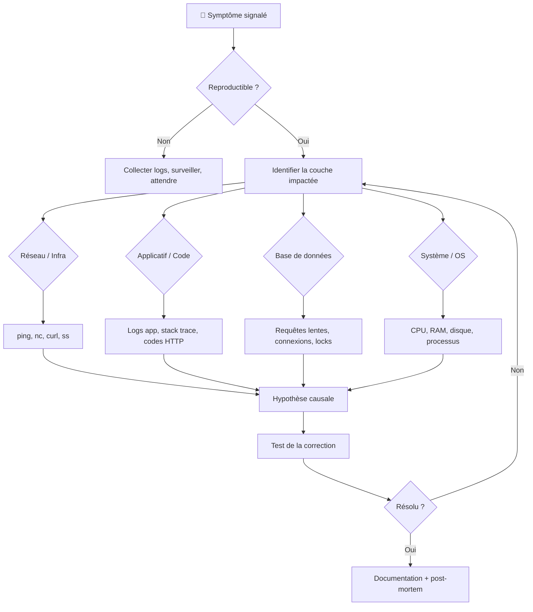

# Debugging technique

## Objectifs pédagogiques

À la fin de ce module, tu seras capable de :

- **Structurer** une démarche de diagnostic face à un comportement anormal d'une application
- **Lire et interpréter** des logs applicatifs et système pour identifier une cause racine
- **Relier** un symptôme utilisateur à un composant technique précis (base de données, réseau, applicatif)
- **Utiliser** les outils de diagnostic courants (`journalctl`, `ss`, `curl`, `grep`, `pg_stat_activity`) de façon ciblée et ordonnée
- **Distinguer** une erreur applicative d'un problème d'infrastructure sous-jacente

---

## Mise en situation

Il est 8h05. Slack s'emballe. L'application de gestion des commandes ne répond plus — page blanche pour certains, timeout pour d'autres. Dix utilisateurs bloqués. Ton manager veut un point dans 20 minutes.

Et bien sûr, "rien n'a changé".

Ce scénario, c'est précisément ce que ce module te prépare à gérer. Pas en redémarrant des services dans l'espoir que ça se règle tout seul. Pas en cherchant au hasard dans des fichiers de log de 200 000 lignes. Mais en avançant méthodiquement, en lisant ce que l'application et le système essaient de te dire.

La différence entre un débutant et un technicien confirmé face à une panne ? Le débutant cherche **la panne**. Le technicien cherche **les symptômes**, puis remonte vers la cause. C'est une question de méthode.

---

## Pourquoi le débogage applicatif est plus complexe qu'il n'y paraît

Une application en production, c'est rarement un monolithe simple. Tu as généralement une combinaison de : serveur web, backend applicatif, base de données, cache, file de messages, système de fichiers, règles réseau. Quand quelque chose cloche, la panne peut se situer à n'importe quelle couche — et le message d'erreur que reçoit l'utilisateur final est souvent **déconnecté de la vraie cause**.

Exemple classique : l'utilisateur voit `500 Internal Server Error`. Ce message générique peut cacher :

- Une exception non gérée dans le code
- Une base de données qui ne répond plus
- Un fichier de configuration modifié avec une syntaxe invalide
- Un serveur qui manque de mémoire
- Un certificat SSL expiré

Le symptôme est identique. Les causes, non. C'est pour ça qu'un bon diagnostic commence toujours par **refuser de supposer**.

---

## La méthode : observer avant d'agir

Avant de toucher quoi que ce soit, trois questions structurent le diagnostic :

1. **Qu'est-ce qui est observable ?** — symptôme précis, fréquence, utilisateurs concernés
2. **Qu'est-ce qui a changé récemment ?** — déploiement, mise à jour, modification de config, changement réseau
3. **Le problème est-il reproductible ?** — toujours, parfois, dans quelles conditions ?

Ces trois questions t'évitent de partir dans une fausse direction pendant une heure. La pression d'un incident pousse à agir vite. La méthode te force à observer d'abord.



Ce n'est pas un logigramme magique. C'est une façon de ne pas sauter d'étapes — et de pouvoir expliquer à ton manager exactement pourquoi tu as fait ce que tu as fait.

---

## Lire les logs : la compétence centrale

Les logs sont la première chose à consulter. Pas parce que c'est une règle, mais parce que l'application t'y laisse le récit de ce qui s'est passé — si tu sais le lire.

### Où chercher selon l'environnement

| Contexte | Emplacement typique | Commande utile |
|---|---|---|
| Service systemd (Linux) | journald | `journalctl -u <SERVICE> -n 100 --no-pager` |
| Application avec logs fichier | `/var/log/<app>/`, `/opt/<app>/logs/` | `tail -f`, `grep`, `less` |
| Container Docker | stdout/stderr du container | `docker logs <CONTAINER> --tail 100 -f` |
| Nginx / Apache | `/var/log/nginx/error.log` | `tail -f /var/log/nginx/error.log` |
| Windows (IIS, app Win) | Event Viewer → Application | Interface graphique ou `Get-EventLog` |
| PostgreSQL | `/var/log/postgresql/` | `tail -f /var/log/postgresql/postgresql-*.log` |

💡 Quand tu ne sais pas où sont les logs d'une application, commence par sa configuration : les fichiers de config déclarent souvent un `log_path` ou `log_dir`. Si rien n'y est, `find /var/log -name "*.log" -newer /tmp/ref` (avec un fichier de référence créé juste avant l'incident) liste les logs récemment modifiés.

### Lire une stack trace sans paniquer

Une stack trace, c'est le journal d'un crash : l'application te dit exactement quelle ligne de code a explosé et tout le chemin d'appels qui y a mené. La plupart des techniciens lisent la première ligne et s'arrêtent. C'est souvent insuffisant.

```
[ERROR] 2024-03-15 08:12:44 - Unhandled exception
java.sql.SQLTimeoutException: Connection timeout after 30000ms   ← TYPE + MESSAGE
    at com.example.db.ConnectionPool.acquire(ConnectionPool.java:87)
    at com.example.service.OrderService.fetchOrder(OrderService.java:142)
    at com.example.api.OrderController.getOrder(OrderController.java:58)  ← POINT D'ENTRÉE
```

Comment la lire efficacement :

- **Première ligne** — type d'erreur (`SQLTimeoutException`) et message (`Connection timeout after 30000ms`) : la base de données ne répond pas dans les temps
- **Bas de la stack** — d'où vient l'appel dans ton code applicatif (`OrderController.getOrder`) : la requête venait de l'API commandes
- **Milieu** — le chemin technique, qui confirme que c'est bien la couche base de données, pas le code métier

🧠 La ligne la plus importante n'est pas forcément la première. L'erreur de surface (timeout, NullPointer) cache souvent une cause racine plus bas dans la stack ou dans les logs des secondes précédentes. Remonte toujours le fil temporel avant de conclure.

### Grep efficacement dans les logs

Quand un fichier de log fait 200 000 lignes, `cat` n'est pas une stratégie.

```bash
# Filtrer par niveau d'erreur (insensible à la casse)
grep -i "error\|exception\|fatal" /var/log/app/application.log

# Afficher le contexte autour d'un match
grep -A 5 -B 2 "SQLTimeoutException" /var/log/app/application.log

# Filtrer sur une fenêtre temporelle précise
grep "2024-03-15 08:1[0-5]" /var/log/app/application.log

# Compter les occurrences d'une erreur récurrente
grep -c "Connection refused" /var/log/app/application.log

# Surveiller les erreurs en temps réel
tail -f /var/log/app/application.log | grep --line-buffered "ERROR"
```

⚠️ `grep "error"` en minuscule peut manquer `ERROR`, `Error` ou `FATAL` selon le framework. Utiliser `-i` systématiquement, sauf si tu cherches un pattern très précis et sensible à la casse.

---

## Diagnostiquer couche par couche

Une fois le type d'erreur identifié dans les logs, il faut localiser la couche fautive. Chaque couche a ses outils propres.

### Réseau et connectivité

Avant de conclure que "l'appli est cassée", vérifie que les composants peuvent se parler.

```bash
# Joindre la base de données depuis le serveur applicatif
ping <DB_HOST>
nc -zv <DB_HOST> <DB_PORT>           # ex: nc -zv 10.0.1.5 5432

# Vérifier qu'un port est bien ouvert localement
ss -tlnp | grep <PORT>               # Linux moderne
netstat -tlnp | grep <PORT>          # Linux classique

# Tester une réponse HTTP
curl -v http://<HOST>:<PORT>/health
curl -o /dev/null -s -w "%{http_code}" http://<HOST>/api/ping
```

💡 `curl -v` est ton meilleur ami pour débugger le HTTP. Il affiche les headers envoyés et reçus, la négociation TLS si HTTPS, le code de retour et le corps de réponse. Un `curl -v` sur l'endpoint problématique prend 10 secondes et donne souvent plus d'information que 5 minutes dans les logs.

Un point important sur les messages d'erreur réseau : **"Connection refused"** et **"Connection timed out"** ne signifient pas la même chose.

- `Connection refused` → la machine est joignable, mais aucun service n'écoute sur ce port (ou le firewall renvoie un `REJECT` explicite). Problème côté service ou firewall.
- `Connection timed out` → la machine ne répond pas du tout. Probablement injoignable, firewall `DROP`, ou route manquante. Problème côté réseau ou infrastructure.

Confondre les deux, c'est partir dans la mauvaise direction pendant 30 minutes.

### Ressources système

Un applicatif qui ralentit ou crashe peut simplement manquer de ressources.

```bash
# Vue globale CPU / RAM / load average
top
htop                                 # plus lisible si disponible

# Espace disque (des logs qui remplissent le disque provoquent des crashs)
df -h
du -sh /var/log/*

# Mémoire et swap
free -h

# Processus les plus gourmands
ps aux --sort=-%cpu | head -10
ps aux --sort=-%mem | head -10

# Limite de descripteurs de fichiers
ulimit -n
lsof -p <PID> | wc -l
```

🧠 L'erreur `Too many open files` (ou `EMFILE` dans les logs Java/Python) n'est pas un problème de disque plein. C'est une limite du noyau Linux sur le nombre de descripteurs de fichiers qu'un processus peut ouvrir simultanément — connexions réseau incluses. Par défaut souvent à 1024. Sous forte charge, une application avec beaucoup de connexions simultanées l'atteint rapidement. Correction immédiate : `ulimit -n 65536`. Pour persister : `/etc/security/limits.conf`.

### Processus et configuration applicative

```bash
# Le service tourne-t-il ?
systemctl status <SERVICE>
ps aux | grep <NOM_PROCESSUS>

# Depuis quand tourne-t-il ? (redémarrage récent = signal d'alerte)
systemctl show <SERVICE> --property=ActiveEnterTimestamp

# Valider la syntaxe d'un fichier de config
nginx -t                             # Nginx
apachectl configtest                 # Apache
python -m py_compile config.py       # Python

# Variables d'environnement du processus en cours
cat /proc/<PID>/environ | tr '\0' '\n'
```

⚠️ Un service `active (running)` dans `systemctl status` ne veut pas dire qu'il fonctionne correctement. Il peut être démarré mais dans un état dégradé : pool de connexions épuisé, thread bloqué, queue saturée. Toujours croiser avec les logs applicatifs.

---

## Les erreurs les plus fréquentes en support

Ces quatre scénarios couvrent la majorité des incidents applicatifs en entreprise. Reconnaître le pattern évite de repartir de zéro à chaque fois.

### Erreur 500 — Internal Server Error

C'est le symptôme le plus générique qui soit. La méthode est toujours la même :

| Étape | Action |
|---|---|
| **1. Trouver le détail** | Logs applicatifs → chercher `ERROR` ou `Exception` dans la fenêtre temporelle de l'incident |
| **2. Identifier le type** | `NullPointerException` = bug code/données · `SQLException` = BDD · `OutOfMemoryError` = ressources |
| **3. Contextualiser** | Ça arrive toujours ? Sur une action précise ? Depuis quand ? Après quoi ? |
| **Correction courante** | Selon cause : rollback, correction de config, redémarrage propre avec investigation |

### Timeout et lenteurs — chercher ce qui est lent, pas le timeout lui-même

Le timeout est rarement une cause — c'est une conséquence. La vraie question : *qu'est-ce qui est lent en aval ?*

```bash
# Mesurer le temps de réponse d'un endpoint
time curl -s http://<HOST>/api/endpoint > /dev/null

# Identifier les requêtes SQL qui traînent (PostgreSQL)
SELECT pid, now() - query_start AS duration, state, query
FROM pg_stat_activity
WHERE state = 'active'
ORDER BY duration DESC;
```

🧠 Un timeout qui se déclenche toujours **exactement** à la même valeur (30s pile, systématiquement) indique que le composant aval ne répond pas du tout — l'application attend jusqu'à sa limite configurée. Un timeout **variable** (8s, 14s, 27s) indique que le composant répond, mais est lent. Les causes et les corrections sont très différentes.

### Connexion refusée

```
Error: connect ECONNREFUSED 10.0.1.5:5432
```

Message précis : la connexion TCP a été refusée. La machine est joignable, mais aucun service n'écoute sur ce port.

```bash
# Le service écoute-t-il bien ?
ss -tlnp | grep 5432

# Règles firewall ?
iptables -L -n | grep 5432
ufw status verbose
firewall-cmd --list-all              # RedHat/CentOS avec firewalld
```

### Service qui démarre puis crashe en boucle

```bash
# Voir pourquoi ça crashe
journalctl -u <SERVICE> -n 50 --no-pager

# Repérer la boucle de redémarrage
systemctl status <SERVICE>           # regarder "Main PID" et le compteur de restarts
```

Les causes les plus fréquentes : fichier de config invalide, port déjà utilisé par un autre processus, variable d'environnement manquante, dépendance (base de données, cache) inaccessible au démarrage.

---

## Cas réel en entreprise

**Contexte** : application Java EE en production, serveur Linux avec Tomcat. Depuis 7h30, les utilisateurs signalent des lenteurs extrêmes sur le module de reporting. Le reste de l'application fonctionne normalement.

**Étape 1 — Cibler le périmètre**

Le problème est limité au module de reporting. Ce périmètre restreint oriente d'emblée vers une requête SQL coûteuse ou une ressource spécifique à ce module — pas un problème global d'infrastructure.

**Étape 2 — Logs applicatifs**

```
[WARN] 2024-03-15 07:31:12 - Query execution time: 45230ms — SELECT * FROM orders JOIN ...
[WARN] 2024-03-15 07:31:58 - Query execution time: 48100ms — SELECT * FROM orders JOIN ...
```

Deux requêtes prennent 45 secondes. Clairement anormal pour ce type de requête.

**Étape 3 — Côté base de données**

```sql
SELECT pid, now() - query_start AS duration, state, query
FROM pg_stat_activity
WHERE state = 'active'
ORDER BY duration DESC;
```

Résultat : une requête tourne depuis 52 minutes, en attente d'un **lock** sur la table `orders`.

**Étape 4 — Identifier le verrou**

```sql
SELECT * FROM pg_locks WHERE NOT granted;
```

Un processus de batch (lancé automatiquement à 7h00) verrouille la table `orders` pour un recalcul mensuel. Il n'a pas de timeout configuré et peut tenir la table indéfiniment.

**Résolution** : arrêt du batch après validation avec l'équipe métier, ajout d'un `statement_timeout` sur le batch, replanification du recalcul en dehors des heures ouvrées.

**Résultat** : temps de réponse du module reporting repassé sous 2 secondes après libération du verrou. Temps de diagnostic total : 22 minutes.

---

## Bonnes pratiques

**1. Ne pas toucher avant de comprendre.** Redémarrer un service pour "voir si ça repart" peut faire disparaître les preuves — logs en mémoire, état du processus, métriques en cours. Observer d'abord, agir ensuite.

**2. Corréler par timestamp.** L'heure du premier signalement utilisateur est ton point de départ. Tous les logs doivent être remis dans cette fenêtre temporelle. Un log d'erreur à 3h du matin n'est pas forcément lié à une panne signalée à 9h.

**3. Vérifier les changements récents en premier.** Dans ~70% des incidents applicatifs, quelque chose a changé dans les 24h précédentes — déploiement, cron job, mise à jour, rotation de secret. La question "qu'est-ce qui a changé hier ?" résout plus d'incidents que n'importe quel outil de diagnostic.

**4. Changer une seule chose à la fois.** Sous pression, la tentation est d'appliquer plusieurs corrections simultanément. Si ça se règle, tu ne sauras jamais laquelle a fonctionné — et tu ne pourras pas l'expliquer dans le post-mortem.

**5. Distinguer correction et contournement.** Un redémarrage résout le symptôme immédiat, pas la cause. Documenter explicitement "contournement temporaire appliqué" et créer une tâche pour identifier la cause racine.

**6. Documenter pendant, pas après.** Prendre 30 secondes pour noter ce que tu as trouvé et ce que tu as fait au fil du diagnostic. En sortie d'incident, la mémoire est sélective et les détails s'évaporent vite.

**7. Croiser logs applicatifs et logs système.** `journalctl`, le syslog ou l'Event Viewer Windows montrent des signaux que l'application elle-même ne logue pas — OOM killer, segfault, problème disque. Les deux sources ensemble donnent une image complète.

---

## Résumé

Débugger une application en production, c'est une question de méthode avant d'être une question de connaissance technique. L'entonnoir — observer le symptôme, identifier la couche, formuler une hypothèse, tester — permet d'avancer même face à des technologies qu'on ne maîtrise pas parfaitement.

Les logs sont le premier outil. Savoir les lire efficacement — stack trace, `grep` ciblé, corrélation temporelle — change radicalement le temps de diagnostic. Les outils réseau et système (`curl`, `ss`, `df`, `pg_stat_activity`) permettent de tester chaque couche indépendamment sans supposer.

Les erreurs les plus fréquentes en support — timeouts, connexions refusées, 500 génériques, crashs au démarrage — suivent des patterns reconnaissables une fois qu'on les a vus deux ou trois fois. La suite logique : analyser les performances applicatives de façon proactive, avec du profiling et des métriques, pour ne plus découvrir une panne par les utilisateurs.

---

<!-- snippet
id: debug_logs_grep_erreurs
type: command
tech: bash
level: intermediate
importance: high
format: knowledge
tags: logs,grep,diagnostic,bash,erreurs
title: Grep ciblé sur les erreurs dans un fichier de log
command: grep -i "error\|exception\|fatal" <FICHIER_LOG>
example: grep -i "error\|exception\|fatal" /var/log/app/application.log
description: Filtre en une commande les trois niveaux d'erreur les plus courants. Le -i évite de rater ERROR, Error ou error selon le framework.
-->

<!-- snippet
id: debug_logs_contexte_grep
type: command
tech: bash
level: intermediate
importance: medium
format: knowledge
tags: logs,grep,contexte,diagnostic
title: Grep avec contexte autour du match
command: grep -A <LIGNES_APRES> -B <LIGNES_AVANT> "<PATTERN>" <FICHIER>
example: grep -A 5 -B 2 "SQLTimeoutException" /var/log/app/application.log
description: Affiche les lignes avant et après le match — indispensable pour comprendre ce qui a précédé une erreur dans les logs.
-->

<!-- snippet
id: debug_port_ecoute_ss
type: command
tech: bash
level: intermediate
importance: high
format: knowledge
tags: réseau,port,diagnostic,ss,netstat
title: Vérifier qu'un service écoute sur un port
command: ss -tlnp | grep <PORT>
example: ss -tlnp | grep 5432
description: Confirme qu'un processus écoute bien sur le port attendu. Répond à "Connection refused" avant de chercher côté code ou firewall.
-->

<!-- snippet
id: debug_service_statut_systemd
type: command
tech: linux
level: intermediate
importance: high
format: knowledge
tags: systemd,service,diagnostic,linux
title: Vérifier l'état d'un service et ses derniers logs
command: journalctl -u <SERVICE> -n <NB_LIGNES> --no-pager
example: journalctl -u tomcat -n 100 --no-pager
description: Combine l'état systemd et les dernières lignes de logs du service — premier réflexe quand une appli ne démarre pas ou crashe en boucle.
-->

<!-- snippet
id: debug_curl_code_http
type: command
tech: bash
level: intermediate
importance: medium
format: knowledge
tags: http,curl,diagnostic,code-retour
title: Tester un endpoint HTTP et récupérer uniquement le code de retour
command: curl -o /dev/null -s -w "%{http_code}" <URL>
example: curl -o /dev/null -s -w "%{http_code}" http://10.0.1.5:8080/api/health
description: Retourne uniquement le code HTTP (200, 500, 503…) sans afficher le corps. Utile pour scripter des vérifications ou tester rapidement depuis un serveur.
-->

<!-- snippet
id: debug_timeout_vs_refused
type: concept
tech: réseau
level: intermediate
importance: high
format: knowledge
tags: réseau,timeout,connection-refused,diagnostic
title: Différence entre Connection refused et Connection timed out
content: "Connection refused" = la machine est joignable mais aucun service n'écoute sur ce port (ou firewall REJECT). "Connection timed out" = la machine ne répond pas du tout — injoignable, firewall DROP, ou route manquante. Le premier se corrige côté service ou firewall local. Le second se corrige côté réseau ou infrastructure.
description: Distinguer les deux évite 30 minutes de debug dans la mauvaise direction — l'un est un problème de service, l'autre un problème réseau.
-->

<!-- snippet
id: debug_timeout_fixe_vs_variable
type: concept
tech: applicatif
level: intermediate
importance: high
format: knowledge
tags: timeout,diagnostic,performance,applicatif
title: Timeout fixe vs timeout variable — ce que ça indique
content: Un timeout qui se déclenche toujours à exactement la même valeur (ex : 30s pile) indique que le composant aval ne répond PAS du tout — l'appli attend jusqu'à sa limite configurée. Un timeout variable (8s, 14s, 28s) indique que le composant répond mais est lent. Les deux situations ont des causes différentes et des corrections différentes.
description: La régularité du timeout dans les logs oriente immédiatement vers "composant mort" ou "composant dégradé".
-->

<!-- snippet
id: debug_stack_trace_lecture
type: tip
tech: java
level: intermediate
importance: high
format: knowledge
tags: stack-trace,logs,java,diagnostic
title: Lire une stack trace de bas en haut
content: Dans une stack trace Java, lire d'abord la PREMIÈRE ligne (type + message d'erreur), puis sauter au BAS de la stack (point d'entrée dans ton code applicatif). Le milieu montre le chemin technique. Les logs des secondes précédentes donnent souvent la vraie cause racine que la stack ne montre pas.
description: La plupart des techniciens lisent seulement la première ligne — rater le bas de la stack, c'est rater d'où vient réellement l'appel qui a échoué.
-->

<!-- snippet
id: debug_trop_many_open_files
type: error
tech: linux
level: intermediate
importance: medium
format: knowledge
tags: linux,descripteurs,fichiers,limite,erreur
title: Erreur "Too many open files" — cause et correction
content: Symptôme : logs Java/Python affichent "Too many open files" ou EMFILE. Cause : le processus a atteint la limite kernel sur les descripteurs ouverts (connexions réseau incluses), souvent 1024 par défaut. Correction immédiate : ulimit -n 65536 dans la session, ou /etc/security/limits.conf pour persister. Vérifier avec lsof -p <PID> | wc -l le nombre réel de descripteurs utilisés.
description: Ce n'est pas un problème de disque plein — c'est une limite kernel sur les handles ouverts. Fréquent sur les applis sous charge avec beaucoup de connexions simultanées.
-->

<!-- snippet
id: debug_pg_requetes_longues
type: command
tech: postgresql
level: intermediate
importance: medium
format: knowledge
tags: postgresql,performance,locks,diagnostic,sql
title: Voir les requêtes longues en cours dans PostgreSQL
command: SELECT pid, now() - query_start AS duration, state, query FROM pg_stat_activity WHERE state = 'active' ORDER BY duration DESC;
description: Identifie les requêtes qui traînent en temps réel. Si une requête tourne depuis plusieurs minutes, c'est souvent un verrou ou une table non indexée sous forte charge.
-->

<!-- snippet
id: debug_changement_recent_premier
type: tip
tech: diagnostic
level: intermediate
importance: high
format: knowledge
tags: diagnostic,méthode,incident,prod
title: Vérifier les changements récents en premier
content: Dans ~70% des incidents applicatifs, quelque chose a changé dans les 24h précédentes (déploiement, cron job, mise à jour de config, rotation de secret). Avant de plonger dans les logs, demander explicitement à l'équipe et vérifier l'historique des déploiements. Un diff de 10 secondes peut éviter 1h de debug.
description: La question "qu'est-ce qui a changé hier ?" résout plus d'incidents que n'importe quel outil de diagnostic.
-->
