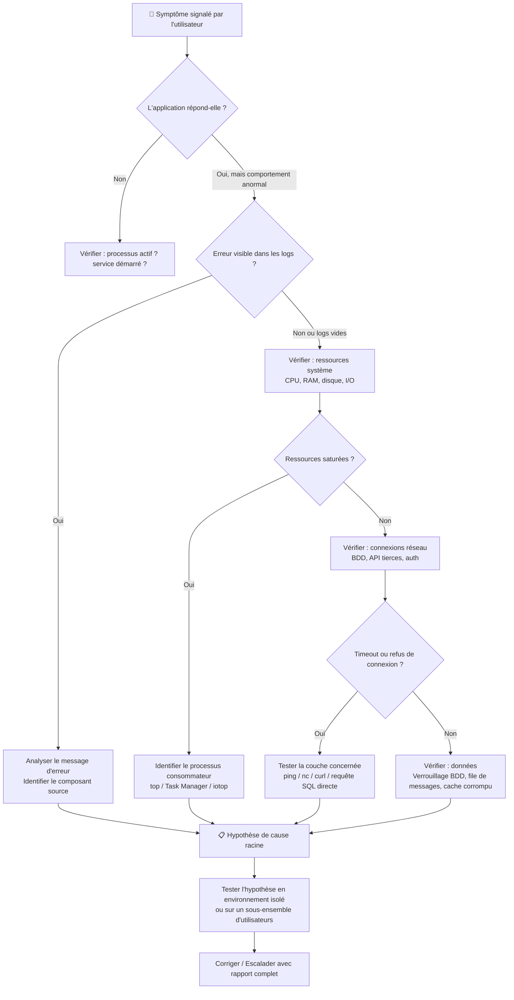

# Gestion des incidents complexes

## Objectifs pédagogiques

À l'issue de ce module, tu seras capable de :

- **Distinguer** un incident simple d'un incident complexe et adapter ta méthode en conséquence
- **Appliquer** une démarche de diagnostic structurée pour isoler la cause racine d'un dysfonctionnement applicatif
- **Exploiter** les logs, métriques et outils système pour reconstituer la chronologie d'un incident
- **Décider** quand escalader, quoi transmettre et comment formuler un rapport d'incident utile
- **Éviter** les pièges classiques qui font perdre du temps ou masquent la vraie cause

---

## Mise en situation

Il est 9h15. Une responsable RH t'appelle : "L'application de paie est inaccessible. On a 47 personnes qui ne peuvent pas valider leurs notes de frais, et la clôture mensuelle est à midi."

Tu regardes dans le système de ticketing — trois autres tickets similaires ont été ouverts dans la dernière heure. Le monitoring affiche une alerte vague : *"Application response time degraded"*. L'application tourne, le serveur répond, mais les utilisateurs ne passent pas.

C'est ça, un incident complexe. Pas une panne franche avec un message d'erreur clair. Pas un utilisateur qui a oublié son mot de passe. Un système qui *semble* fonctionner mais qui ne fonctionne **pas vraiment**, et pour lequel tu vas devoir enquêter couche par couche.

---

## Ce qu'on appelle vraiment un "incident complexe"

Un incident devient complexe quand une ou plusieurs de ces conditions sont réunies :

- La cause n'est **pas immédiatement visible** — pas d'erreur explicite, pas de panne franche
- **Plusieurs composants** sont potentiellement impliqués (applicatif, base de données, réseau, auth, OS)
- Le symptôme est **intermittent** ou ne se reproduit pas facilement
- L'impact est **élevé** ou **croissant** dans le temps
- Des **parties prenantes multiples** sont concernées (utilisateurs, métier, infra, éditeur)

🧠 La complexité d'un incident vient rarement de la technique en elle-même. Elle vient du fait que le symptôme visible (l'application rame) et la cause réelle (un index manquant sur une table requêtée toutes les secondes) peuvent être dans des couches complètement différentes. C'est pourquoi la méthode prime sur le réflexe.

---

## La méthode : du symptôme à la cause racine

### Cadrer avant de toucher quoi que ce soit

Le premier réflexe en urgence, c'est souvent de redémarrer un service, vider un cache, appliquer ce qui a marché la dernière fois. C'est compréhensible — mais c'est une erreur fréquente. Agir sans comprendre peut masquer la vraie cause, retarder la résolution, voire aggraver la situation.

Avant toute action corrective, prends cinq minutes pour répondre à ces quatre questions :

| Question | Ce qu'elle permet |
|---|---|
| **Quand** ça a commencé (heure précise) ? | Identifier ce qui s'est passé juste avant |
| **Qui** est impacté (tous les utilisateurs ? un profil ? une région ?) ? | Restreindre l'espace de recherche |
| **Quoi** exactement ne fonctionne pas (quelle action, quel écran) ? | Cibler le composant concerné |
| **Est-ce que** ça a déjà fonctionné récemment ? | Distinguer régression vs. problème latent |

Ces quatre questions définissent ce qu'on appelle le **périmètre d'incident**. Sans ça, tu cherches dans le noir.

<!-- snippet
id: support_incident_cadrage_questions
type: concept
tech: support applicatif
level: intermediate
importance: high
format: knowledge
tags: incident,diagnostic,cadrage,methode
title: Les 4 questions à poser avant tout diagnostic
content: Avant toute action sur un incident complexe : 1) QUAND ça a commencé (heure précise → chercher ce qui s'est passé juste avant), 2) QUI est impacté (tous les users ? un profil ? une région ? → restreint l'espace de recherche), 3) QUOI exactement ne fonctionne pas (action précise, pas "l'appli rame"), 4) EST-CE QUE ça fonctionnait récemment ? (régression vs. problème latent). Sans ce cadrage, on cherche dans le noir.
description: 4 questions qui définissent le périmètre d'incident — sans ça, tout diagnostic part dans la mauvaise direction
-->

---

### Descendre la pile couche par couche

Un système applicatif, c'est une pile. Quand quelque chose ne va pas, la cause est quelque part dans cette pile. La méthode la plus efficace est de **descendre couche par couche**, du plus haut (interface utilisateur) vers le plus bas (infrastructure), en éliminant au fur et à mesure.



Ce schéma n'est pas une recette magique — c'est un fil conducteur. En pratique, tu trouveras souvent un indice à l'étape 3 qui t'amène directement à la cause. Mais quand tu es bloqué, revenir à ce flux évite de tourner en rond.

---

### Lire les logs comme un enquêteur

Les logs sont ta principale source de vérité dans un diagnostic complexe. Encore faut-il savoir quoi chercher et où.

**Où chercher selon le contexte :**

| Contexte | Fichiers / Emplacements typiques |
|---|---|
| Application Java / JEE | `logs/application.log`, `logs/error.log`, console du serveur (Tomcat, JBoss) |
| Application .NET | Event Viewer Windows → Application, `C:\inetpub\logs\`, répertoire de l'app |
| Application web (Linux) | `/var/log/nginx/`, `/var/log/apache2/`, `/opt/<app>/logs/` |
| Base de données | PostgreSQL : `/var/log/postgresql/` — MySQL : `/var/log/mysql/error.log` |
| Système (Linux) | `journalctl -u <service>`, `/var/log/syslog`, `/var/log/messages` |

💡 Quand tu ouvres un fichier de log volumineux, commence toujours par chercher les mots-clés `ERROR`, `FATAL`, `Exception`, `OOM`, `timeout`, `refused`. Un `grep` ciblé te donnera souvent l'essentiel en dix secondes :

```bash
grep -i "error\|exception\|fatal\|timeout\|refused" /opt/app/logs/application.log | tail -100
```

<!-- snippet
id: support_logs_grep_erreurs
type: command
tech: linux
level: intermediate
importance: high
format: knowledge
tags: logs,grep,diagnostic,linux
title: Filtrer rapidement les erreurs dans un fichier de log
command: grep -i "error\|exception\|fatal\|timeout\|refused" <FICHIER_LOG> | tail -<N>
example: grep -i "error\|exception\|fatal\|timeout\|refused" /opt/appRH/logs/application.log | tail -100
description: Extrait les lignes critiques d'un log volumineux en partant de la fin — commencer par la fin, pas le début
-->

En lisant les résultats, reconstitue mentalement quatre éléments :

1. **La chronologie** — À quelle heure exactement la première erreur est apparue ? Avant ou après le signalement utilisateur ?
2. **La fréquence** — Erreur unique ? Récurrente toutes les X secondes ? Croissante ?
3. **Le contexte** — Quelle action a déclenché l'erreur ? Quel utilisateur ? Depuis quelle IP ?
4. **La propagation** — L'erreur est-elle isolée à un composant ou se répercute-t-elle en cascade ?

⚠️ En production, un fichier de log peut contenir des millions de lignes. Commence toujours par la **fin** et remonte dans le temps depuis le moment de l'incident. Et méfie-toi des erreurs anciennes et chroniques : concentre-toi sur ce qui est apparu **à partir du moment où l'incident a débuté**, pas sur tout ce qui est rouge dans le fichier.

<!-- snippet
id: support_logs_tail_temps_reel
type: command
tech: linux
level: intermediate
importance: medium
format: knowledge
tags: logs,tail,monitoring,linux
title: Suivre un fichier de log en temps réel
command: tail -f <FICHIER_LOG>
example: tail -f /var/log/nginx/error.log
description: Affiche les nouvelles lignes au fur et à mesure — indispensable pendant qu'on reproduit un incident ou qu'on surveille une correction
-->

---

### Quand les logs ne suffisent pas

Parfois les logs applicatifs sont propres mais le problème persiste. Il faut alors descendre d'un niveau.

**Ressources système**

```bash
# CPU et mémoire en temps réel
top -c

# Processus gourmands en I/O disque
iotop -o

# Espace disque restant par partition
df -h

# Répertoires qui consomment le plus d'espace
du -sh /var/log/* | sort -rh | head -20
```

Un disque plein à 100 % est une cause classique de comportement applicatif bizarre : l'application tourne, les processus répondent, mais aucune écriture n'est possible. Résultat : des sessions qui ne s'enregistrent pas, des logs qui s'arrêtent net, des transactions qui échouent silencieusement. Aucune erreur franche, juste un comportement de plus en plus étrange.

<!-- snippet
id: support_disque_plein_cause_silencieuse
type: warning
tech: linux
level: intermediate
importance: high
format: knowledge
tags: disque,diagnostic,linux,incident
title: Disque plein — cause silencieuse d'incidents applicatifs
content: Un disque à 100% provoque des comportements applicatifs bizarres sans erreur franche : sessions non enregistrées, logs qui s'arrêtent, transactions qui échouent silencieusement. L'application tourne, le processus répond, mais aucune écriture n'est possible. Toujours vérifier `df -h` tôt dans un diagnostic, surtout si les logs applicatifs sont étrangement vides.
description: Disque plein → aucune écriture possible → comportements anormaux sans message clair. Vérifier df -h dès le début du diagnostic
-->

**Connexions réseau et dépendances**

```bash
# Tester qu'un port est joignable depuis le serveur applicatif
nc -zv <IP_CIBLE> <PORT>

# Voir les connexions TCP actives — utile pour détecter un pool épuisé
ss -tnp | grep <PORT>

# Tester une URL d'API tierce directement depuis le serveur
curl -v https://<URL_API>/health
```

💡 Toujours tester depuis **le serveur applicatif lui-même**, pas depuis ton poste. Un firewall ou une règle réseau peut bloquer uniquement certaines sources — ce que tu ne verras jamais depuis ta machine.

<!-- snippet
id: support_connexion_port_test
type: command
tech: linux
level: intermediate
importance: medium
format: knowledge
tags: reseau,diagnostic,nc,telnet,port
title: Tester la joignabilité d'un port depuis le serveur applicatif
command: nc -zv <IP_CIBLE> <PORT>
example: nc -zv 192.168.1.50 5432
description: Tester depuis le serveur applicatif lui-même, pas depuis son poste — un firewall peut bloquer uniquement certaines sources
-->

**Côté base de données : requêtes lentes et verrous**

```sql
-- PostgreSQL : requêtes en cours d'exécution
SELECT pid, now() - pg_stat_activity.query_start AS duration, query, state
FROM pg_stat_activity
WHERE state != 'idle'
ORDER BY duration DESC;

-- PostgreSQL : détecter les verrous bloquants
SELECT blocked_locks.pid     AS blocked_pid,
       blocking_locks.pid    AS blocking_pid,
       blocked_activity.query AS blocked_statement
FROM pg_catalog.pg_locks blocked_locks
JOIN pg_catalog.pg_locks blocking_locks
  ON blocking_locks.locktype = blocked_locks.locktype
JOIN pg_catalog.pg_stat_activity blocked_activity
  ON blocked_activity.pid = blocked_locks.pid
WHERE NOT blocked_locks.granted;
```

Un verrou en base de données est une cause d'incident complexe extrêmement courante et souvent invisible depuis les logs applicatifs. L'application attend une réponse de la BDD qui ne vient pas — mais le timeout peut prendre plusieurs minutes avant de déclencher une erreur visible.

<!-- snippet
id: support_bdd_verrous_bloquants_pg
type: command
tech: postgresql
level: intermediate
importance: medium
format: knowledge
tags: postgresql,verrous,locks,diagnostic
title: Identifier les verrous bloquants sur PostgreSQL
command: SELECT blocked_locks.pid AS blocked_pid, blocking_locks.pid AS blocking_pid, blocked_activity.query AS blocked_statement FROM pg_catalog.pg_locks blocked_locks JOIN pg_catalog.pg_locks blocking_locks ON blocking_locks.locktype = blocked_locks.locktype JOIN pg_catalog.pg_stat_activity blocked_activity ON blocked_activity.pid = blocked_locks.pid WHERE NOT blocked_locks.granted;
example: -- Exécuter directement dans psql ou pgAdmin connecté à la base concernée
description: Révèle quelle requête est bloquée et par quel PID — les verrous ne génèrent souvent aucune erreur visible dans les logs applicatifs avant le timeout
-->

<!-- snippet
id: support_bdd_pool_connexions_epuise
type: concept
tech: postgresql
level: intermediate
importance: high
format: knowledge
tags: postgresql,pool,connexions,incident,bdd
title: Pool de connexions épuisé — diagnostic PostgreSQL
content: Symptôme : logs applicatifs affichent "Connection timeout waiting for pool" ou équivalent. Vérification : SELECT count(*), state FROM pg_stat_activity GROUP BY state; — si beaucoup de connexions en "idle in transaction", des transactions sont ouvertes et jamais commitées/annulées. Correction immédiate : terminer les connexions bloquées avec pg_terminate_backend. Cause racine : gestion incorrecte des transactions dans le code (timeout non géré, exception non catchée avant le commit).
description: Pool épuisé = transactions jamais fermées, pas un problème de capacité. Diagnostiquer via pg_stat_activity, pas via les logs applicatifs seuls
-->

<!-- snippet
id: support_bdd_pg_terminate_idle
type: command
tech: postgresql
level: intermediate
importance: medium
format: knowledge
tags: postgresql,verrous,connexions,incident
title: Tuer les connexions idle in transaction sur PostgreSQL
command: SELECT pg_terminate_backend(pid) FROM pg_stat_activity WHERE state = 'idle in transaction' AND query_start < now() - interval '<DUREE>';
example: SELECT pg_terminate_backend(pid) FROM pg_stat_activity WHERE state = 'idle in transaction' AND query_start < now() - interval '10 minutes';
description: Libère les connexions bloquées dans une transaction ouverte depuis trop longtemps — mitigation, pas correction de la cause racine
-->

---

## Gérer la pression sans se disperser

Un incident avec impact métier fort crée de la pression. Plusieurs personnes t'appellent, des messages arrivent, ton responsable veut un point toutes les quinze minutes. C'est là que les erreurs de diagnostic se produisent — pas par incompétence, mais par dispersion.

**Communiquer avant d'investiguer.** Dès que tu prends en charge un incident majeur, envoie une première mise à jour dans les dix minutes. Pas de solution, pas d'ETA — juste : *"Incident pris en charge, investigation en cours, prochain point dans 30 minutes."* Ça coupe les interruptions et ça montre que quelqu'un gère.

**Une hypothèse à la fois.** Sous la pression, on a tendance à tester plusieurs pistes simultanément. Résultat : si quelque chose se résout (ou s'aggrave), on ne sait pas pourquoi. Tester une hypothèse, noter le résultat, passer à la suivante.

**Documenter en temps réel.** Ouvrir un bloc-notes ou un document partagé et noter chaque action avec son heure et son résultat. Ça paraît ralentir au moment où on le fait — ça accélère considérablement si tu dois escalader ou si un collègue prend la relève.

---

## Escalader au bon moment, de la bonne façon

L'escalade est une compétence à part entière. Escalader trop tôt, c'est faire perdre du temps à des personnes avec plus de responsabilités. Escalader trop tard, c'est aggraver l'impact.

Escalade quand :
- Tu es bloqué sur une couche que tu n'as pas accès à modifier (code applicatif, configuration infrastructure)
- L'incident dépasse ton niveau d'habilitation (modification en base de production, accès réseau restreint)
- L'impact s'étend et le SLA est en danger
- Tu as besoin d'une décision métier (passer en mode dégradé, communiquer aux utilisateurs)

**Ce qu'un bon rapport d'escalade contient :**

```
INCIDENT : [Titre court]
HEURE DE DÉBUT : HH:MM
IMPACT : [Nombre d'utilisateurs, fonctionnalité, criticité métier]

SYMPTÔME OBSERVÉ :
[Ce que voit l'utilisateur, exactement]

INVESTIGATION EFFECTUÉE :
- [Action 1 à HH:MM — résultat]
- [Action 2 à HH:MM — résultat]
- [Action 3 à HH:MM — résultat]

HYPOTHÈSE ACTUELLE :
[Cause probable identifiée ou écartée]

BESOIN IMMÉDIAT :
[Ce dont tu as besoin pour avancer : accès, intervention, décision]
```

⚠️ Escalader avec *"l'application ne fonctionne pas, je ne sais pas pourquoi"* sans avoir documenté ce qui a été testé oblige le niveau supérieur à tout recommencer depuis zéro. Un rapport d'escalade sans trace d'investigation, c'est une investigation perdue.

<!-- snippet
id: support_escalade_rapport_structure
type: tip
tech: support applicatif
level: intermediate
importance: high
format: knowledge
tags: escalade,incident,rapport,communication
title: Structure minimale d'un rapport d'escalade efficace
content: Un rapport d'escalade doit contenir : heure de début, impact chiffré (X utilisateurs, quelle fonctionnalité), symptôme exact vu par l'utilisateur, liste horodatée de chaque action tentée avec son résultat, hypothèse actuelle, et besoin précis (accès, intervention, décision). Sans la liste des actions déjà effectuées, le niveau supérieur recommence tout depuis zéro.
description: Escalader sans trace d'investigation = investigation perdue. L'historique des actions horodatées est la partie la plus critique du rapport
-->

---

## Cas réel : incident de connexion intermittente sur une application RH

**Contexte** — Application de gestion RH sur serveur Linux, base PostgreSQL, environ 200 utilisateurs. Depuis 8h30, des utilisateurs signalent des déconnexions aléatoires et des lenteurs importantes lors de la consultation des fiches employées.

**8h40 — Cadrage**

L'application répond (ping OK, service actif), mais lentement. Le monitoring indique un temps de réponse moyen de 12 secondes pour des pages qui chargent normalement en moins d'une seconde. Tous les utilisateurs sont impactés, sans distinction de profil. Aucun déploiement ni modification signalée depuis trois jours.

**8h43 — Logs applicatifs**

```bash
grep -i "error\|exception\|timeout" /opt/appRH/logs/application.log | tail -50
```

Résultat : des dizaines de `Connection timeout waiting for pool` répétés depuis 8h28. Le message est clair — le pool de connexions à la base de données est épuisé. L'application ne peut plus obtenir de connexion libre.

**8h47 — Vérification côté base**

Connexion directe à PostgreSQL :

```sql
SELECT count(*), state FROM pg_stat_activity GROUP BY state;
```

Résultat : 98 connexions en état `idle in transaction`. Le pool est configuré pour 100 connexions maximum. 98 sont ouvertes et bloquées dans une transaction jamais commitée ni annulée.

**8h51 — Identification de la cause**

Remontée dans les logs 30 minutes avant le début de l'incident : une tâche de batch planifiée à 8h00 ouvrait des transactions en masse sans les fermer correctement suite à un timeout non géré dans le code.

**Résolution immédiate**

```sql
SELECT pg_terminate_backend(pid)
FROM pg_stat_activity
WHERE state = 'idle in transaction'
AND query_start < now() - interval '10 minutes';
```

L'application est revenue à la normale en 90 secondes. Le ticket a été transmis à l'équipe de développement pour corriger la gestion des transactions dans le batch.

**Ce que la méthode a évité** — Sans démarche structurée, la première intuition aurait probablement été de redémarrer le serveur applicatif. Ce qui aurait effectivement résolu le symptôme... mais sans identifier la cause, le même incident se serait reproduit au prochain passage du batch, à 8h00 le lendemain matin.

---

## Bonnes pratiques

**Ne pas confondre symptôme et cause.** "L'application est lente" est un symptôme. "Le pool de connexions est épuisé" est une cause. "Une transaction ne se ferme pas dans le batch" est la cause racine. Le diagnostic s'arrête à la cause racine, pas au symptôme.

**Ne jamais agir sans tracer.** Chaque action en production doit être notée avec son heure. Si tu redémarres un service à 9h12 et que l'incident se résout à 9h13, tu dois savoir si c'est ton action ou une coïncidence. Sans trace, impossible de conclure.

**Méfie-toi des faux positifs dans les logs.** Un fichier de log en production peut contenir des erreurs chroniques et anciennes sans rapport avec l'incident. Concentre-toi sur ce qui est apparu à partir du moment où l'incident a débuté — pas sur tout ce qui est rouge dans le fichier.

**Le redémarrage n'est pas une solution.** C'est une mitigation temporaire. Redémarrer peut rétablir le service immédiatement mais masque la cause. Si tu redémarres, note-le, note l'heure, et continue l'investigation pour comprendre pourquoi c'était nécessaire.

**Vérifier `df -h` tôt dans le diagnostic.** Un disque plein est l'une des causes les plus courantes de comportements bizarres sans erreur explicite — et l'une des plus oubliées. Trente secondes de vérification peuvent t'éviter une heure de recherche.

**Tester les dépendances depuis le bon endroit.** Une API tierce ou une base de données qui ne répond pas depuis le serveur applicatif peut très bien répondre depuis ton poste. Les règles réseau et les firewalls sont souvent source-dépendants.

🧠 Un incident résolu sans cause identifiée est un problème en attente de se répéter. ITIL fait d'ailleurs la distinction entre la **résolution d'incident** (rétablir le service) et la **gestion de problème** (identifier et éliminer la cause racine). En tant que technicien support, ton rôle peut s'arrêter à la résolution — mais un rapport bien documenté transmis à l'équipe qui gère les problèmes fait toute la différence sur le long terme.

<!-- snippet
id: support_redemarrage_mitigation_non_solution
type: warning
tech: support applicatif
level: intermediate
importance: high
format: knowledge
tags: incident,redemarrage,methodologie,cause-racine
title: Redémarrer un service n'est pas une résolution
content: Redémarrer résout le symptôme mais masque la cause. Si tu redémarres sans savoir pourquoi c'était nécessaire, l'incident se reproduira. Règle : si tu redémarres en urgence, note l'heure, note le résultat, et continue l'investigation pour identifier la cause. Un incident résolu sans cause identifiée est un problème en attente.
description: Redémarrage = mitigation temporaire. Sans cause identifiée documentée, l'incident se répète — ITIL distingue résolution d'incident et gestion de problème
-->

---

## Résumé

Un incident complexe se distingue d'un incident simple par l'absence de cause évidente — souvent parce que le symptôme visible et la cause réelle se trouvent dans des couches différentes du système. La clé, c'est une démarche structurée : cadrer l'incident avant d'agir, descendre la pile couche par couche, lire les logs avec méthode, tester les hypothèses une par une. Les outils système — logs, monitoring de ressources, analyse des connexions réseau et BDD — constituent le kit d'enquête de base. La gestion de la communication et de la pression fait partie du travail autant que le diagnostic technique. Escalader, c'est bien — à condition de le faire avec un rapport d'investigation complet, pas les mains vides.
