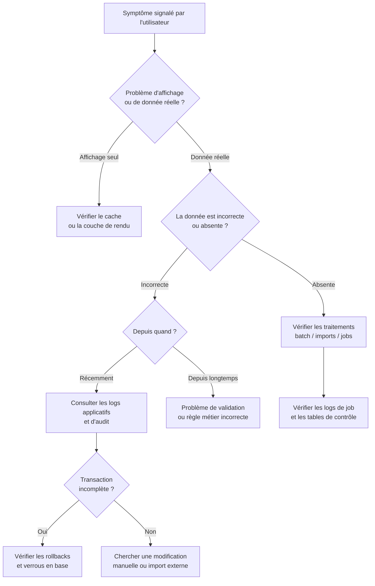

# Gestion des données & intégrité

## Objectifs pédagogiques

À l'issue de ce module, vous serez capable de :

1. **Identifier** les différentes formes d'anomalies de données rencontrées en production
2. **Diagnostiquer** une incohérence de données en remontant sa cause réelle — applicative, base de données, réseau ou humaine
3. **Distinguer** une corruption de données d'un bug d'affichage ou d'un problème de synchronisation
4. **Exécuter** des requêtes SQL de contrôle pour vérifier l'intégrité d'un jeu de données
5. **Prioriser** et escalader correctement un incident de données selon son impact métier

---

## Mise en situation

Vous travaillez pour une société de gestion de flotte de véhicules. Un lundi matin, le responsable logistique vous appelle : certains chauffeurs apparaissent comme "en mission" alors qu'ils sont en congé depuis vendredi. Des véhicules affichent un kilométrage négatif. Et quelques livraisons du week-end n'ont tout simplement pas été enregistrées.

Trois problèmes distincts, trois causes probables différentes — et pourtant, tous donnent la même impression côté utilisateur : "l'appli déconne". Votre mission : démêler ce qui relève d'un bug applicatif, d'une anomalie de données, d'un problème de synchronisation, ou d'une erreur utilisateur.

Ce module vous donne les outils pour faire cette distinction.

---

## Pourquoi l'intégrité des données est un sujet support à part entière

On a tendance à penser que les données, c'est l'affaire des développeurs ou des DBA. En réalité, le technicien support est souvent le **premier à constater une anomalie** — et parfois le premier à vouloir "juste corriger en base" sans protocole, ce qui est précisément le piège à éviter.

Les données d'une application métier sont rarement stockées dans un seul endroit. Il y a la base principale, parfois un cache (Redis, Memcached), des fichiers plats exportés, des tables de référence partagées entre plusieurs applications, des queues de messages peut-être non consommées. Quand quelque chose ne va pas, l'anomalie visible — une mauvaise valeur dans l'interface — peut avoir sa source n'importe où dans cette chaîne.

Ce qui rend le diagnostic difficile, c'est que les symptômes se ressemblent tous : "la valeur affichée est fausse". Mais la cause peut être :

- une donnée mal saisie, passée sans validation
- une synchronisation entre deux systèmes qui a échoué silencieusement
- une règle métier mal implémentée produisant des valeurs incohérentes
- une transaction non commitée ou partiellement écrite
- une modification manuelle en base faite sans considérer les dépendances

Comprendre cette distinction change complètement la réponse à apporter — et à qui vous l'adressez.

---

## Les quatre familles d'anomalies de données

Avant de chercher d'où vient un problème, encore faut-il savoir ce qu'on cherche. Ces quatre catégories ne se diagnostiquent pas de la même façon.

### Données invalides

Une valeur qui viole les règles métier ou techniques : un âge négatif, un email sans `@`, un montant à zéro pour une facture supposément payée, un code postal à 4 chiffres dans un système français. Ces anomalies auraient dû être bloquées par des contraintes de validation — soit dans l'application, soit directement en base.

🧠 La validation côté application et les contraintes en base ne sont pas redondantes : elles se complètent. L'appli protège l'expérience utilisateur, la base protège la donnée contre tout ce qui n'est pas l'appli — scripts, imports, accès directs. Quand on retrouve des données invalides en base, la première question n'est pas "comment corriger" mais "pourquoi la contrainte n'a pas joué".

### Données incohérentes

Ici, chaque valeur prise isolément est valide, mais elles se contredisent quand on les met en relation. Un bon de commande marqué "livré" alors que le stock n'a pas bougé. Un utilisateur actif dont le compte de facturation est clôturé. Un total de facture différent de la somme de ses lignes.

Ce type d'anomalie est souvent le symptôme d'une **transaction incomplète** ou d'une synchronisation ratée entre deux tables — ou deux systèmes. On y reviendra en détail plus bas.

### Données dupliquées

Un même enregistrement existe en double, parfois avec des valeurs légèrement différentes entre les deux copies. Cela arrive souvent après une migration, une réimportation, ou un double-clic utilisateur sur un bouton "Valider" mal géré côté développement.

💡 Un doublon n'est pas toujours identifiable par ID. Cherchez des doublons fonctionnels : même client avec des noms légèrement différents (`Jean Dupont` vs `J. Dupont`), même commande créée deux fois à 3 secondes d'intervalle.

### Données manquantes

Des enregistrements qui auraient dû être créés et ne l'ont pas été. Un traitement batch nocturne qui a planté à mi-chemin. Une livraison qui n'a pas déclenché la mise à jour de stock prévue. Contrairement aux trois premières catégories, ici il n'y a rien à voir — c'est justement le problème, et c'est souvent le plus difficile à repérer.

---

## Méthode de diagnostic : remonter la chaîne

Quand un utilisateur signale "les données sont fausses", la tentation est de foncer dans la base pour corriger. C'est presque toujours une erreur. Un bon diagnostic suit un fil logique.



**Étape 1 — Reproduire et isoler.** Vérifiez d'abord si le problème est généralisé ou ponctuel. Une seule ligne affectée, c'est probablement une erreur sur un enregistrement précis. Dix mille lignes affectées, c'est un traitement batch ou une migration qui a mal tourné. Demandez à l'utilisateur : depuis quand ? Sur quels enregistrements précisément ? Est-ce que d'autres utilisateurs sont impactés ?

**Étape 2 — Séparer affichage et donnée.** Avant de regarder la base, vérifiez ce qu'elle contient réellement. Il arrive que la donnée en base soit correcte mais que l'affichage soit faux — cache non invalidé, bug dans la couche de présentation, format de date mal interprété selon la locale. Une requête SQL directe vous dira immédiatement si le problème est dans la donnée ou dans le rendu.

**Étape 3 — Consulter les logs avant de toucher quoi que ce soit.** Les logs applicatifs, les logs d'audit en base (si activés), et les logs des jobs de traitement sont vos témoins. Ils vous disent ce qui s'est passé, dans quel ordre, et si des erreurs ont été ignorées silencieusement.

⚠️ Corriger une donnée en base sans avoir lu les logs, c'est risquer de corriger le symptôme en laissant la cause intacte. Dans deux heures, la donnée sera à nouveau fausse.

**Étape 4 — Identifier la cause racine.** Est-ce que le problème vient d'une saisie utilisateur, d'un traitement automatique, d'un import externe, ou d'une intervention manuelle directe en base ? Cette question détermine si la correction doit être technique, procédurale, ou les deux.

---

## Requêtes SQL de contrôle : ce qu'un technicien support doit savoir écrire

Vous n'avez pas besoin d'être DBA pour faire du contrôle de données. Ces quelques types de requêtes couvrent 80 % des diagnostics courants en support.

### Détecter les doublons fonctionnels

```sql
-- Commandes créées deux fois pour le même client dans la même minute
SELECT
    client_id,
    DATE_TRUNC('minute', created_at) AS minute,
    COUNT(*) AS nb_commandes
FROM commandes
GROUP BY client_id, DATE_TRUNC('minute', created_at)
HAVING COUNT(*) > 1
ORDER BY nb_commandes DESC;
```

Ce type de requête permet aussi de confirmer un problème de double-clic côté interface : on voit exactement combien de doublons, pour quels clients, et à quelle heure. C'est souvent la preuve qu'il manque un verrou applicatif ou une contrainte d'unicité en base.

### Vérifier la cohérence entre deux tables liées

```sql
-- Livraisons référençant des commandes qui n'existent plus (clés orphelines)
SELECT l.id AS livraison_id, l.commande_id
FROM livraisons l
LEFT JOIN commandes c ON l.commande_id = c.id
WHERE c.id IS NULL;
```

```sql
-- Cohérence financière : total facture vs somme des lignes
SELECT
    f.id AS facture_id,
    f.montant_total,
    SUM(fl.prix_unitaire * fl.quantite) AS total_calcule,
    f.montant_total - SUM(fl.prix_unitaire * fl.quantite) AS ecart
FROM factures f
JOIN lignes_facture fl ON fl.facture_id = f.id
GROUP BY f.id, f.montant_total
HAVING ABS(f.montant_total - SUM(fl.prix_unitaire * fl.quantite)) > 0.01;
```

La tolérance de `0.01` évite les faux positifs liés aux arrondis flottants. En contexte financier, même un écart d'un centime mérite investigation — mais en dessous, c'est du bruit numérique, pas un bug.

### Détecter les valeurs hors plage

```sql
-- Kilométrages suspects (négatifs ou anormalement élevés)
SELECT
    id,
    vehicule_id,
    kilometrage,
    date_releve
FROM releves_kilometrage
WHERE kilometrage < 0
   OR kilometrage > 2000000  -- seuil à adapter selon le parc
ORDER BY date_releve DESC;
```

### Vérifier les enregistrements récemment modifiés

Si votre table dispose d'une colonne `updated_at` :

```sql
-- Modifications des dernières 24h
SELECT *
FROM commandes
WHERE updated_at >= NOW() - INTERVAL '24 hours'
ORDER BY updated_at DESC
LIMIT 100;
```

💡 Si la table n'a pas de colonne `updated_at`, cherchez si l'application dispose d'une table de log d'audit séparée (`audit_log`, `change_history`...). C'est souvent là que se trouvent les preuves d'une modification manuelle — et l'identité de qui l'a faite.

---

## Transactions et atomicité : pourquoi les données peuvent se retrouver dans un état intermédiaire

C'est le concept qui explique une large part des incohérences rencontrées en support, et il mérite qu'on s'y arrête.

🧠 Une transaction est un groupe d'opérations qui doit réussir entièrement ou échouer entièrement. Si une application effectue une mise à jour en plusieurs étapes sans les encapsuler dans une transaction, un crash entre deux étapes laisse la base dans un état partiellement mis à jour — ni bon, ni en erreur explicite.

Exemple concret : une application de gestion de stock qui, lors d'une vente, doit :
1. Créer la ligne de vente
2. Décrémenter le stock du produit
3. Mettre à jour le statut de la commande

Si ces trois opérations ne sont pas dans la même transaction et qu'un crash survient entre 1 et 2, le chiffre de vente monte, le stock ne descend pas, et personne ne comprend pourquoi l'inventaire est faux. Les deux tables sont individuellement valides — elles sont structurellement incohérentes ensemble.

En tant que technicien support, vous ne corrigez pas le code. Mais reconnaître ce pattern vous permet d'escalader au bon niveau avec le bon diagnostic : *"incohérence de données consécutive à une transaction incomplète, probablement liée à une interruption applicative entre telle et telle heure"* — plutôt qu'un simple *"les données sont fausses"*.

### Vérifier si une transaction est bloquée (PostgreSQL)

```sql
-- Transactions actives depuis plus de 5 minutes
SELECT
    pid,
    now() - pg_stat_activity.query_start AS duree,
    query,
    state
FROM pg_stat_activity
WHERE state = 'active'
  AND now() - pg_stat_activity.query_start > INTERVAL '5 minutes';
```

```sql
-- Verrous en attente (lock waits)
SELECT
    blocked_locks.pid     AS pid_bloque,
    blocking_locks.pid    AS pid_bloquant,
    blocked_activity.query  AS requete_bloquee,
    blocking_activity.query AS requete_bloquante
FROM pg_catalog.pg_locks blocked_locks
JOIN pg_catalog.pg_locks blocking_locks
    ON blocking_locks.locktype  = blocked_locks.locktype
    AND blocking_locks.relation = blocked_locks.relation
    AND blocking_locks.granted  = true
    AND blocked_locks.granted   = false
JOIN pg_catalog.pg_stat_activity blocked_activity
    ON blocked_activity.pid = blocked_locks.pid
JOIN pg_catalog.pg_stat_activity blocking_activity
    ON blocking_activity.pid = blocking_locks.pid;
```

Ces requêtes sont des premiers points de contrôle, pas des outils de résolution. Si vous trouvez des verrous persistants, escaladez au DBA avant de tuer quoi que ce soit.

---

## Cas réel : anomalie de stock après migration de données

**Contexte** — Distribution alimentaire, 3 entrepôts, environ 80 000 références produits. Migration vers un nouveau WMS (Warehouse Management System) effectuée un week-end.

**Problème** — Le lundi suivant la migration, les responsables d'entrepôt constatent que les quantités affichées ne correspondent pas aux inventaires physiques. Les écarts vont de quelques unités à plusieurs centaines selon les références.

**Diagnostic mené**

La première question est de savoir si le problème est généralisé ou concentré. Une requête sur `stock_actuel` avec jointure sur `produits` et filtrage par date de dernière modification révèle que les écarts concernent principalement les produits à code-barres composé — c'est-à-dire les variantes de conditionnement.

Consultation des logs de migration : le script d'import avait correctement géré les produits simples, mais avait mal interprété les unités de conditionnement pour les produits composés — il importait des quantités en unités là où le nouveau système attendait des cartons.

Vérification de cohérence par export comparatif entre ancien et nouveau système : sur 80 000 références, **4 200 produits affectés**, représentant environ **30 % de la valeur de stock**.

**Résolution** — Correctif de données ciblé sur les 4 200 références concernées, réexécution de la portion de script avec la bonne règle de conversion, puis procédure de validation avec les responsables d'entrepôt sur un échantillon représentatif avant fermeture de l'incident.

**Ce que ça enseigne** — Une migration de données sans jeu de tests de contrôle (comparaison avant/après sur un échantillon représentatif) est une migration incomplète. Le contrôle des données n'est pas une option de fin de projet, c'est une étape du projet — et elle aurait détecté ce problème avant la mise en production.

---

## Bonnes pratiques

**Ne jamais corriger en production sans sauvegarde préalable.** Même pour une modification d'une seule ligne. Un `UPDATE` sans `WHERE` correct qui traîne dans le presse-papier peut ruiner une journée de travail — la vôtre et celle de vos utilisateurs.

**Toujours tester la requête de correction avec un `SELECT` d'abord.** Transformez mentalement votre `UPDATE clients SET statut = 'inactif' WHERE id = 42` en `SELECT * FROM clients WHERE id = 42` pour vérifier que vous ciblez exactement ce que vous croyez cibler, et combien de lignes sont concernées.

**Ouvrir une transaction explicite avant toute modification.** `BEGIN;` avant votre `UPDATE`, vérification du résultat, puis `COMMIT;` — ou `ROLLBACK;` si quelque chose cloche. C'est le filet de sécurité minimal en production.

**Documenter chaque modification manuelle.** Date, heure, qui, pourquoi, valeur avant, valeur après. Si votre application n'a pas de table d'audit, tenez un fichier de suivi personnel. Ces traces seront précieuses lors du prochain incident similaire.

**Distinguer correction et contournement.** Mettre à jour une valeur incorrecte règle le symptôme. Si la cause racine n'est pas adressée, la valeur redeviendra incorrecte au prochain traitement. Tout ticket de correction de données devrait s'accompagner d'un ticket de correction applicative si la source est dans le code ou la configuration.

**Poser quatre questions avant d'agir.** "Depuis quand ?" "Combien d'enregistrements ?" "Est-ce que d'autres utilisateurs sont impactés ?" "Y a-t-il eu une opération particulière récemment — import, migration, mise à jour ?" Ces quatre questions évitent la majorité des diagnostics à côté de la plaque.

**Ne jamais supposer qu'un problème de données est isolé.** Si une anomalie est apparue sur un enregistrement, vérifiez systématiquement si d'autres enregistrements créés dans la même fenêtre de temps présentent le même comportement. Un bug de traitement touche rarement une seule ligne.

---

## Résumé

| Concept | Ce que c'est | Ce qu'il faut chercher |
|---|---|---|
| Donnée invalide | Valeur qui viole une règle métier ou une contrainte | Pourquoi la contrainte n'a pas bloqué la saisie |
| Donnée incohérente | Valeurs valides individuellement mais contradictoires ensemble | Transaction incomplète ou synchronisation ratée |
| Donnée dupliquée | Même enregistrement présent plusieurs fois | Doublons fonctionnels, pas seulement par ID |
| Donnée manquante | Enregistrement attendu qui n'existe pas | Logs des traitements batch et des jobs |
| Transaction | Groupe d'opérations tout-ou-rien | Crash mid-transaction → état incohérent entre tables |
| Clé orpheline | Référence vers un enregistrement supprimé | `LEFT JOIN ... WHERE x IS NULL` |
| Table d'audit | Historique des modifications de données | Première source de vérité pour dater et identifier une anomalie |

En support applicatif, votre valeur sur les incidents de données ne vient pas de votre capacité à corriger vite — elle vient de votre capacité à **distinguer le symptôme de la cause** et à escalader avec un diagnostic précis plutôt qu'un simple "les données sont fausses". C'est cette précision qui permet à l'équipe de développement de corriger le vrai problème, pas juste ses effets visibles.

---

<!-- snippet
id: sql_doublons_detection
type: command
tech: sql
level: intermediate
importance: high
format: knowledge
tags: sql,doublons,diagnostic,intégrité,group-by
title: Détecter des doublons fonctionnels en SQL
context: Utiliser des colonnes métier (pas l'ID) pour regrouper — un doublon fonctionnel a deux IDs différents mais représente le même événement
command: SELECT <COL1>, <COL2>, COUNT(*) AS nb FROM <TABLE> GROUP BY <COL1>, <COL2> HAVING COUNT(*) > 1
example: SELECT client_id, DATE_TRUNC('minute', created_at), COUNT(*) FROM commandes GROUP BY client_id, DATE_TRUNC('minute', created_at) HAVING COUNT(*) > 1
description: Regroupe par colonnes métier pour détecter les doublons fonctionnels — même événement créé deux fois à quelques secondes d'intervalle, souvent signe d'un double-clic ou d'un import rejoué.
-->

<!-- snippet
id: sql_cles_orphelines
type: command
tech: sql
level: intermediate
importance: high
format: knowledge
tags: sql,intégrité,jointure,clés-étrangères,diagnostic
title: Détecter des clés orphelines avec LEFT JOIN
command: SELECT a.<ID>, a.<FK> FROM <TABLE_A> a LEFT JOIN <TABLE_B> b ON a.<FK> = b.id WHERE b.id IS NULL
example: SELECT l.id, l.commande_id FROM livraisons l LEFT JOIN commandes c ON l.commande_id = c.id WHERE c.id IS NULL
description: Trouve les enregistrements référençant une entrée supprimée ou jamais créée — symptôme classique de suppression sans cascade ou de synchronisation ratée entre deux systèmes.
-->

<!-- snippet
id: sql_ecart_coherence_financiere
type: tip
tech: sql
level: intermediate
importance: high
format: knowledge
tags: sql,cohérence,finances,diagnostic,arrondi
title: Tolérance d'arrondi dans les contrôles financiers
content: Pour comparer un total calculé à un total stocké, utiliser HAVING ABS(total_stocke - SUM(calcul)) > 0.01 plutôt qu'une égalité stricte. Les nombres flottants produisent des écarts de quelques centimes sans bug réel. En dessous de 0.01, c'est du bruit numérique ; au-dessus, c'est un écart métier à investiguer.
description: Une comparaison stricte entre deux totaux décimaux génère des faux positifs à cause des arrondis flottants. Le seuil 0.01 filtre le bruit sans masquer les vrais écarts métier.
-->

<!-- snippet
id: sql_transactions_bloquees_pg
type: command
tech: postgresql
level: intermediate
importance: medium
format: knowledge
tags: postgresql,transaction,verrou,diagnostic,performance
title: Détecter les transactions actives depuis plus de 5 min (PG)
command: SELECT pid, now() - query_start AS duree, query, state FROM pg_stat_activity WHERE state = 'active' AND now() - query_start > INTERVAL '5 minutes'
description: Identifie les requêtes longues pouvant maintenir un verrou et bloquer d'autres transactions — premier point de contrôle avant d'escalader au DBA.
-->

<!-- snippet
id: sql_verrous_pg
type: command
tech: postgresql
level: intermediate
importance: medium
format: knowledge
tags: postgresql,verrou,lock,diagnostic,blocage
title: Identifier les verrous actifs et les requêtes bloquées (PG)
context: À utiliser quand une transaction longue est détectée — permet d'identifier quelle requête bloque quelle autre
command: SELECT blocked_locks.pid AS pid_bloque, blocking_locks.pid AS pid_bloquant, blocked_activity.query AS requete_bloquee, blocking_activity.query AS requete_bloquante FROM pg_catalog.pg_locks blocked_locks JOIN pg_catalog.pg_locks blocking_locks ON blocking_locks.locktype = blocked_locks.locktype AND blocking_locks.relation = blocked_locks.relation AND blocking_locks.granted = true AND blocked_locks.granted = false JOIN pg_catalog.pg_stat_activity blocked_activity ON blocked_activity.pid = blocked_locks.pid JOIN pg_catalog.pg_stat_activity blocking_activity ON blocking_activity.pid = blocking_locks.pid
description: Affiche les paires requête bloquée / requête bloquante — à transmettre au DBA avec le PID si une interruption est envisagée.
-->

<!-- snippet
id: data_transaction_incomplete
type: concept
tech: sql
level: intermediate
importance: high
format: knowledge
tags: transaction,intégrité,cohérence,crash,base-de-données
title: Incohérence de données par transaction incomplète
content: Si plusieurs opérations SQL ne sont pas encapsulées dans une transaction (BEGIN/COMMIT), un crash entre deux opérations laisse la base dans un état partiellement mis à jour. Exemple : stock décrémenté mais ligne de vente jamais créée. Résultat : les deux tables sont valides individuellement, mais incohérentes ensemble. Ce pattern se diagnostique en cherchant des écarts de comptage entre tables liées.
description: Un écart entre deux tables liées est souvent le signe d'une transaction multi-étapes interrompue — pas un bug de valeur, mais un bug d'atomicité.
-->

<!-- snippet
id: data_correction_select_dabord
type: warning
tech: sql
level: beginner
importance: high
format: knowledge
tags: sql,correction,production,sécurité,update
title: Toujours tester un UPDATE avec un SELECT d'abord
content: Piège : exécuter un UPDATE directement en production sans vérifier la clause WHERE au préalable. Conséquence : un UPDATE sans WHERE correct peut affecter toutes les lignes de la table. Méthode : transformer mentalement l'UPDATE en SELECT avec la même clause WHERE, vérifier le nombre de lignes retournées, puis exécuter l'UPDATE dans une transaction ouverte (BEGIN) pour pouvoir rollback si nécessaire.
description: Un UPDATE sans vérification préalable du périmètre peut écraser des milliers de lignes. SELECT d'abord, UPDATE ensuite, dans une transaction ouverte.
-->

<!-- snippet
id: data_audit_table_verification
type: tip
tech: sql
level: intermediate
importance: medium
format: knowledge
tags: audit,traçabilité,diagnostic,modification,historique
title: Chercher une table d'audit avant de corriger des données
content: Avant toute correction manuelle, rechercher une table de type audit_log, change_history ou _history dans le schéma avec SELECT table_name FROM information_schema.tables WHERE table_name LIKE '%audit%' OR table_name LIKE '%log%'. Ces tables contiennent qui a modifié quoi et quand — elles permettent de dater l'anomalie et d'identifier si une intervention manuelle ou un script externe en est la cause.
description: La table d'audit est le premier témoin d'une anomalie. Elle existe dans la majorité des applications métier et est trop souvent ignorée lors du diagnostic initial.
-->

<!-- snippet
id: data_symptome_vs_cause
type: warning
tech: support-applicatif
level: intermediate
importance: high
format: knowledge
tags: diagnostic,méthodologie,correction,escalade,intégrité
title: Corriger une donnée sans identifier la cause racine
content: Piège : mettre à jour une valeur incorrecte en base et fermer le ticket. Conséquence : si la cause est applicative (bug de code, règle métier incorrecte, job défaillant), la donnée redeviendra fausse au prochain traitement. Correction : tout ticket de correction de données doit s'accompagner d'une vérification de la cause — et d'un ticket de correction applicative si la source est dans le code ou la configuration.
description: Corriger le symptôme sans adresser la cause, c'est garantir que le même incident reviendra. Correction de données et correction applicative sont deux tickets distincts.
-->

<!-- snippet
id: data_isolation_perimetre
type: tip
tech: support-applicatif
level: beginner
importance: high
format: knowledge
tags: diagnostic,isolation,périmètre,incident,données
title: Quatre questions pour isoler le périmètre d'une anomalie
content: Avant tout diagnostic technique, poser quatre questions à l'utilisateur : 1) Depuis quand ? 2) Combien d'enregistrements sont affectés ? 3) D'autres utilisateurs sont-ils impactés ? 4) Y a-t-il eu une opération particulière récemment (import, migration, mise à jour applicative) ? Les réponses orientent immédiatement vers un incident ponctuel, un traitement batch défaillant, ou un problème systémique.
description: Ces quatre questions évitent la majorité des diagnostics à côté du problème réel et permettent de calibrer l'urgence avant même d'ouvrir une connexion à la base.
-->
