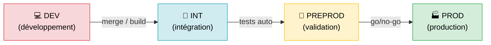
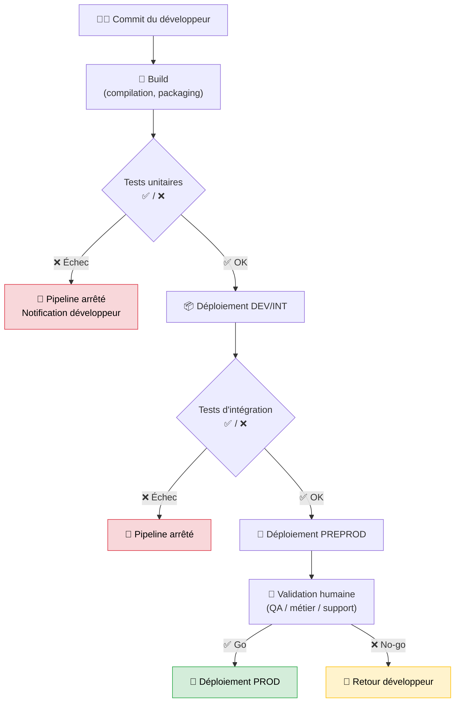

# Environnements & déploiements

## Objectifs pédagogiques

À l'issue de ce module, vous serez capable de :

- **Distinguer** les environnements DEV, PREPROD et PROD, et expliquer pourquoi leur séparation n'est pas optionnelle
- **Identifier** ce qui change concrètement d'un environnement à l'autre : configuration, données, accès, stabilité attendue
- **Reconnaître** les étapes qu'emprunte une modification de code avant d'atteindre la production
- **Diagnostiquer** un incident en partant de l'environnement concerné plutôt que des symptômes bruts
- **Éviter** les erreurs classiques liées à la confusion ou au mélange des environnements

---

## Mise en situation

Une application de gestion RH tourne en production pour 300 utilisateurs. L'équipe dev a corrigé un bug critique sur le calcul des congés. Le développeur, pressé, déploie directement en prod — "c'est urgent". Trente minutes plus tard, le module de paie est planté. La correction dépendait d'une nouvelle version de librairie, testée sur sa machine, jamais validée ailleurs.

Résultat : incident P1, rollback d'urgence, deux heures de production perdue, et une réunion post-mortem peu agréable.

Ce scénario n'est pas exceptionnel. Il arrive régulièrement dans les équipes qui n'ont pas formalisé leur gestion des environnements. Votre rôle en tant que support applicatif, c'est de comprendre cette mécanique pour ne pas être le maillon qui court-circuite le process — et pour diagnostiquer rapidement quand quelqu'un d'autre l'a fait.

---

## Pourquoi plusieurs environnements ?

Au démarrage d'un projet, il est tentant de tout faire tourner sur une seule machine : dev, tests, démonstration client, mise en prod — le même serveur, la même base. Ça marche... jusqu'à ce que ça ne marche plus.

Le problème est simple : **une modification non testée dans des conditions proches de la production peut casser ce qui fonctionne**. Et quand des utilisateurs réels dépendent de l'application, chaque interruption a un coût — humain, financier, réputationnel.

Les environnements séparés répondent à un besoin de **cloisonnement du risque**. On fait les erreurs là où elles ne coûtent rien. On ne valide qu'une fois qu'on est sûr. On livre en production ce qui a déjà prouvé qu'il fonctionne. C'est le même principe qu'une chaîne de montage avec des postes de contrôle qualité : on n'expédie pas une voiture sans avoir vérifié les freins.

---

## Les trois environnements fondamentaux

Dans la grande majorité des organisations, on retrouve au minimum cette trilogie :

| Environnement | Abréviation usuelle | Propriétaires principaux | Données | Stabilité attendue |
|---|---|---|---|---|
| Développement | DEV | Développeurs | Fictives ou anonymisées | Faible — ça casse souvent |
| Préproduction | PREPROD / STAGING / UAT | QA, support, métier | Copie anonymisée de prod | Élevée — doit ressembler à prod |
| Production | PROD | Ops / Support | Réelles | Maximale — SLA engagé |

🧠 La PREPROD n'est pas un "deuxième dev". Son rôle est de simuler la production aussi fidèlement que possible : même version de base de données, mêmes variables de configuration (sauf les credentials), mêmes volumes de données approximatifs. Si la PREPROD diverge trop de la PROD, elle perd toute valeur de validation.

Certaines organisations ajoutent des environnements intermédiaires selon leurs besoins :

- **INT (Intégration)** : assembler les travaux de plusieurs équipes avant de passer en QA
- **UAT (User Acceptance Testing)** : tests métier réalisés par les utilisateurs finaux
- **HOTFIX** : correction rapide d'un bug critique sans passer par le pipeline complet
- **SANDBOX** : espace libre pour expérimenter sans conséquences

Pour le support applicatif, l'important est de savoir à quel niveau on intervient — et de ne jamais les confondre.

### Vue d'ensemble du flux



Chaque flèche représente une porte. Pour passer à l'étape suivante, il faut satisfaire des critères. En DEV : "ça compile et ça marche chez moi". En PREPROD : "les tests passent et le métier a validé". En PROD : le **go/no-go** — une décision formelle, tracée.

---

## Ce qui change vraiment entre les environnements

On croit souvent que les environnements sont identiques sauf le nom dans l'URL. En réalité, trois dimensions varient en permanence.

### La configuration

Une application bien construite ne contient pas ses paramètres dans le code — elle les lit depuis des **variables d'environnement** ou des fichiers de configuration. Cela permet à la même version de se comporter différemment selon où elle tourne :

```bash
# DEV
DB_HOST=localhost
DB_NAME=monapp_dev
LOG_LEVEL=DEBUG
MAIL_DRIVER=log      # les emails ne sont pas envoyés, juste loggés

# PROD
DB_HOST=db-prod-cluster.internal
DB_NAME=monapp_prod
LOG_LEVEL=ERROR
MAIL_DRIVER=smtp     # les emails partent vraiment
```

⚠️ Un développeur oublie de mettre à jour la configuration en PREPROD après un changement de variable. L'application fonctionne en PROD avec l'ancienne valeur, mais le test en PREPROD échoue à tort. On passe du temps à chercher un bug qui n'existe pas.

### Les données

Les données de production sont réelles et souvent sensibles (RGPD oblige). On ne les met jamais dans un environnement de dev ou de test. À la place :

- **Données fictives** en DEV — générées via des outils comme Faker
- **Données anonymisées** en PREPROD — copie de prod avec noms et emails remplacés
- **Données réelles** en PROD uniquement

Conséquence directe pour le support : si un bug ne se reproduit qu'en PROD, c'est souvent parce que les données de test ne couvrent pas le cas problématique. La phrase "ça marche en PREPROD" ne garantit pas que ça marchera en PROD — elle garantit seulement que ça marche avec des données anonymisées.

### Les droits d'accès

En DEV, tout le monde peut tout faire — pratique pour avancer vite. En PROD, les accès sont stricts. Un développeur n'a généralement pas le droit de se connecter directement à la base de données de production. Un technicien support peut consulter les logs mais pas modifier des données à la main.

Cette restriction n'est pas de la méfiance : c'est de la **traçabilité et de la protection**. Si quelqu'un peut modifier la PROD sans laisser de trace, il devient impossible de reconstituer ce qui s'est passé lors d'un incident.

---

## Le chemin d'une modification vers la production

### La notion de pipeline

Un **pipeline de déploiement** (ou pipeline CI/CD) est la séquence automatisée d'étapes qui transforme un commit en un déploiement validé. Pensez-y comme à un convoyeur avec des postes de contrôle : si un poste détecte un problème, le convoyeur s'arrête.



En tant que support applicatif, vous intervenez surtout à deux niveaux : en **PREPROD** lors de la validation avant déploiement, et en **PROD** pour diagnostiquer ce qui s'est cassé après.

### Déploiement manuel vs automatisé

Dans les équipes matures, le déploiement en production est déclenché par une commande ou un clic — mais toujours avec une validation humaine en amont. Dans des équipes moins avancées, le déploiement se fait encore à la main : copie de fichiers, redémarrage de service, modification directe de config.

Le déploiement manuel n'est pas forcément mauvais, mais il est **risqué si non documenté**. Si la procédure est dans la tête d'une seule personne et qu'elle est absente le jour de l'incident, vous voyez le problème.

💡 Même si votre équipe fait des déploiements manuels, insistez pour avoir un **runbook** : la liste des étapes dans l'ordre, les commandes exactes, les vérifications post-déploiement. Vous vous remercierez à 23h lors d'un rollback d'urgence.

---

## Ce qui se déploie concrètement

Selon le type d'application, ce qui "arrive" en production n'est pas la même chose.

### Application web classique

On déploie souvent un **artifact** : une archive compilée, un `.jar`, un dossier de fichiers. Le processus ressemble à :

1. Build de l'artifact sur un serveur de CI
2. Transfert vers le serveur cible
3. Arrêt de l'ancienne version (ou swap)
4. Démarrage de la nouvelle version
5. Vérification que l'application répond (healthcheck)

### Application containerisée

On déploie une **image Docker** qui encapsule l'application et toutes ses dépendances. Le concept central : l'image est construite une fois, testée, puis déployée telle quelle dans chaque environnement. Ce qui change entre les envs, ce sont les **variables d'environnement injectées au runtime** — pas l'image elle-même.

```bash
# La même image, trois comportements différents
docker run -e ENV=dev    -e DB_HOST=localhost      monapp:1.4.2
docker run -e ENV=preprod -e DB_HOST=preprod-db   monapp:1.4.2
docker run -e ENV=prod   -e DB_HOST=prod-cluster  monapp:1.4.2
```

🧠 C'est le principe **"build once, deploy everywhere"**. Si l'image testée en PREPROD est différente de celle déployée en PROD, la validation PREPROD ne sert à rien. Vérifiez toujours que le tag de version est identique entre les environnements avant tout go/no-go.

### Les migrations de base de données

Un cas souvent oublié : une nouvelle version de l'application peut nécessiter des modifications de schéma — nouvelle colonne, renommage de table. Ces migrations doivent aussi suivre le pipeline. Si elles sont oubliées ou mal ordonnées, l'application démarre mais plante à la première requête SQL. Le symptôme est caractéristique : démarrage correct, puis erreur 500 à la première interaction avec la base.

---

## Diagnostiquer un incident lié aux environnements

Quand un utilisateur remonte un bug, la première question à poser n'est pas "quel est le message d'erreur" — c'est **"dans quel environnement ?"**.

| Situation | Ce que ça signifie | Action prioritaire |
|---|---|---|
| Bug présent en PROD, absent en PREPROD | Différence de config ou de données | Comparer les configs des deux envs |
| Bug présent partout | Régression dans le code | Identifier le dernier déploiement |
| Bug apparu juste après un déploiement | Régression introduite | Vérifier le changelog, envisager rollback |
| Bug impossible à reproduire | Dépendance à des données spécifiques | Obtenir un jeu de données représentatif |
| Bug en PREPROD avant déploiement | La validation a fonctionné | Remonter au développeur avec étapes de reproduction |

⚠️ "Ça marche en DEV" est la phrase la plus dangereuse du support applicatif. DEV n'est pas un environnement de référence. Si quelque chose fonctionne en DEV et pas en PROD, c'est la PROD qui a raison — cherchez la différence de configuration ou de données.

### Premières vérifications concrètes après un déploiement

```bash
# Vérifier la version déployée sur chaque environnement
curl https://monapp.prod/version
curl https://monapp.preprod/version

# Inspecter les variables d'environnement d'un conteneur
docker inspect <CONTAINER_ID> | grep -A 20 '"Env"'

# Consulter les logs applicatifs juste après le déploiement
tail -n 100 /var/log/monapp/application.log
journalctl -u monapp.service --since "10 minutes ago"

# Vérifier que le service tourne
systemctl status monapp.service
```

---

## Bonnes pratiques

**1. Ne jamais déployer directement en PROD sans passer par PREPROD.**
Même pour un "petit changement". Surtout pour un petit changement — ce sont eux qui partent le plus souvent en prod sans test préalable.

**2. Garder PREPROD aussi proche que possible de PROD.**
Même version de base de données, même OS, mêmes variables hors credentials. Une PREPROD qui diverge est une PREPROD inutile.

**3. Tracer chaque déploiement.**
Qui a déployé quoi, quand, sur quel environnement. Sans cette traçabilité, il est impossible de corréler un incident avec une release.

**4. Tester le rollback autant que le déploiement.**
Le rollback, c'est le parachute. Si vous ne l'avez jamais testé, vous ne savez pas s'il s'ouvre. Pratiquez des rollbacks en PREPROD régulièrement — si ça prend 15 minutes à froid, ça prendra 15 minutes sous pression en PROD, et c'est trop long.

**5. Séparer configurations et secrets.**
Les paramètres de configuration peuvent être versionnés. Les mots de passe, tokens et clés API ne doivent jamais être dans le dépôt de code — ils vont dans un gestionnaire de secrets (Vault, AWS Secrets Manager, variables CI protégées) et `.env` rejoint le `.gitignore` systématiquement.

**6. Valider avec un healthcheck après chaque déploiement.**
Avant d'annoncer que le déploiement est terminé, vérifiez que l'application répond. Un endpoint `/health` qui retourne 200 est une sécurité minimale — sans ça, vous découvrez le problème quand un utilisateur appelle.

**7. Communiquer les fenêtres de déploiement.**
En production, les déploiements se font de préférence en heures creuses, et les utilisateurs concernés sont informés. Un déploiement silencieux qui plante pendant les heures de pointe, c'est un incident inutile et évitable.

---

## Cas réel en entreprise

Une entreprise de e-commerce de taille intermédiaire — 50 personnes, 8 développeurs, application PHP/MySQL. Les déploiements se faisaient à la main par FTP depuis des années.

**Le problème** : deux développeurs déployaient parfois en même temps, sans coordination. Les fichiers s'écrasaient mutuellement. Le vendredi soir, une "petite correction CSS" embarquait par erreur du code non testé d'un autre ticket.

**Ce qui a été mis en place** :
1. Création d'une PREPROD sur un second serveur, alimentée automatiquement depuis la branche `main` du dépôt Git
2. Déploiement PROD déclenché manuellement depuis le pipeline, uniquement après approbation du lead tech
3. Un fichier `DEPLOY.md` dans le repo listant les étapes et les vérifications post-déploiement

**Résultats en six mois** : zéro incident lié à un déploiement concurrent. 80 % des régressions détectées en PREPROD avant d'atteindre la PROD. L'équipe support a pu consulter l'historique des déploiements pour corréler les incidents au lieu de chercher à l'aveugle.

Le point clé n'était pas la sophistication des outils — c'était la **discipline de process** et la **séparation claire des environnements**.

---

## Résumé

Gérer plusieurs environnements, c'est gérer le risque de façon contrôlée. DEV absorbe le chaos du développement, PREPROD valide dans des conditions proches du réel, PROD est protégée par tout ce qui a été vérifié avant. Ce cloisonnement ne ralentit pas les équipes — il les protège des incidents inutiles.

Pour le support applicatif, comprendre cette mécanique change la façon d'analyser un incident : est-ce que le bug existe dans tous les environnements ? Est-il apparu après un déploiement ? Y a-t-il une différence de configuration entre PREPROD et PROD ? Ces questions guident le diagnostic bien plus vite que fouiller les logs à l'aveugle.

La prochaine étape logique : comprendre comment les accès distants — SSH, RDP, VPN — permettent d'intervenir concrètement sur ces environnements, et comment ne pas se tromper de machine lors d'une intervention urgente.

---

<!-- snippet
id: env_prod_preprod_diff
type: concept
tech: environnements
level: beginner
importance: high
format: knowledge
tags: environnements,prod,preprod,configuration,données
title: Différences fondamentales entre PREPROD et PROD
content: PREPROD et PROD font tourner le même code, mais diffèrent sur trois axes : la configuration (DB_HOST, LOG_LEVEL, MAIL_DRIVER), les données (anonymisées en PREPROD, réelles en PROD) et les droits d'accès (plus stricts en PROD). Si la PREPROD diverge sur l'un de ces axes, ses tests ne valident plus rien de fiable pour la PROD.
description: Même code, comportements différents : configuration, données et droits distinguent PREPROD de PROD. Une PREPROD qui diverge ne protège plus la PROD.
-->

<!-- snippet
id: env_build_once_deploy_everywhere
type: concept
tech: docker
level: intermediate
importance: high
format: knowledge
tags: docker,image,environnements,pipeline,déploiement
title: Build once, deploy everywhere — principe fondamental Docker
content: Avec Docker, on construit l'image une seule fois (ex: monapp:1.4.2) et on la déploie telle quelle dans tous les environnements. Ce qui change entre DEV, PREPROD et PROD, ce sont uniquement les variables d'environnement injectées au démarrage du conteneur (-e DB_HOST=...). Si l'image PREPROD est différente de l'image PROD, la validation PREPROD est sans valeur.
description: L'image Docker doit être identique entre PREPROD et PROD. Seules les variables d'env changent. Vérifier que le tag de version est le même avant tout go/no-go.
-->

<!-- snippet
id: env_docker_inspect_env
type: command
tech: docker
level: intermediate
importance: medium
format: knowledge
tags: docker,configuration,debug,variables,inspection
title: Inspecter les variables d'environnement d'un conteneur
command: docker inspect <CONTAINER_ID> | grep -A 20 '"Env"'
example: docker inspect a3f1b2c9d4e5 | grep -A 20 '"Env"'
description: Permet de vérifier quelles variables d'environnement sont injectées dans un conteneur en cours d'exécution — utile pour comparer PREPROD et PROD lors d'un incident.
-->

<!-- snippet
id: env_logs_post_deploy
type: command
tech: linux
level: beginner
importance: high
format: knowledge
tags: logs,déploiement,diagnostic,journalctl,tail
title: Vérifier les logs applicatifs juste après un déploiement
command: journalctl -u <SERVICE> --since "<DUREE> minutes ago"
example: journalctl -u monapp.service --since "10 minutes ago"
description: Première vérification après tout déploiement. Permet de détecter immédiatement une erreur au démarrage ou une régression avant que les utilisateurs ne la remontent.
-->

<!-- snippet
id: env_confondre_prod_preprod
type: warning
tech: environnements
level: beginner
importance: high
format: knowledge
tags: prod,preprod,erreur,incident,accès
title: Confondre PROD et PREPROD lors d'une intervention
content: Piège : intervenir sur la PROD en croyant être en PREPROD (ou l'inverse). Conséquence : modification ou redémarrage de service sur le mauvais environnement, incident en production immédiat. Correction : toujours vérifier le hostname, l'URL ou le prompt du serveur avant toute action — hostname dans le prompt SSH, variable ENV dans la config de l'appli, URL du service.
description: Avant toute action sur un serveur, vérifier explicitement l'environnement. Un redémarrage de service PROD fait à la place de PREPROD est un incident immédiat.
-->

<!-- snippet
id: env_ca_marche_en_dev
type: warning
tech: environnements
level: beginner
importance: high
format: knowledge
tags: dev,prod,diagnostic,données,configuration
title: "Ça marche en DEV" — le piège du support applicatif
content: Piège : considérer que DEV est une référence valide pour valider un comportement. Conséquence : on conclut à tort que le bug est lié à la PROD, alors que DEV tourne avec des données fictives, une config allégée et sans les contraintes réseau de la PROD. Correction : la PREPROD est l'unique référence valide avant la PROD. DEV sert au développement, pas à la validation.
description: DEV n'est jamais une référence pour valider un comportement en PROD. Utiliser uniquement PREPROD comme environnement de comparaison lors d'un diagnostic.
-->

<!-- snippet
id: env_rollback_healthcheck
type: tip
tech: déploiement
level: intermediate
importance: medium
format: knowledge
tags: rollback,healthcheck,déploiement,prod,vérification
title: Toujours tester le rollback avant d'en avoir besoin
content: Un rollback jamais testé est un parachute jamais déplié. En pratique : après chaque déploiement réussi en PREPROD, simuler un rollback (redéployer la version précédente) et vérifier que l'application répond via son endpoint /health. Si le rollback prend plus de 10 minutes en PREPROD, il prendra autant en PROD sous pression — c'est trop long.
description: Pratiquer le rollback en PREPROD à chaque sprint. Un rollback non testé échouera en production, précisément quand on en a le plus besoin.
-->

<!-- snippet
id: env_secrets_hors_code
type: tip
tech: sécurité
level: intermediate
importance: high
format: knowledge
tags: secrets,sécurité,configuration,vault,variables
title: Ne jamais versionner les secrets dans le code
content: Les mots de passe, tokens API et clés de chiffrement ne doivent jamais apparaître dans un fichier versionné (même dans un .env commité par erreur). Action concrète : utiliser des variables d'environnement injectées par le CI/CD, ou un gestionnaire de secrets dédié (HashiCorp Vault, AWS Secrets Manager, GitLab CI protected variables). Ajouter .env au .gitignore systématiquement.
description: Un secret dans le repo Git = un secret compromis, même si le repo est privé. Utiliser les variables CI protégées ou Vault, et ajouter .env au .gitignore.
-->

<!-- snippet
id: env_migration_bdd_oubliee
type: warning
tech: base-de-données
level: intermediate
importance: high
format: knowledge
tags: migration,base-de-données,déploiement,sql,régression
title: Migration de base de données oubliée lors d'un déploiement
content: Piège : déployer une nouvelle version de l'application sans appliquer la migration de schéma associée. Conséquence : l'application démarre mais plante à la première requête SQL sur la colonne ou table manquante (erreur 500, "column not found"). Correction : les migrations font partie du déploiement — les exécuter avant ou pendant le démarrage de la nouvelle version, jamais après.
description: Symptôme : app démarre, erreur 500 à la première requête SQL. Cause probable : migration non appliquée. Vérifier les logs SQL et l'état des migrations (table schema_migrations ou équivalent).
-->

<!-- snippet
id: env_healthcheck_post_deploy
type: command
tech: linux
level: beginner
importance: high
format: knowledge
tags: healthcheck,déploiement,curl,vérification,prod
title: Vérifier qu'une application répond après déploiement
command: curl -s -o /dev/null -w "%{http_code}" https://<DOMAINE>/health
example: curl -s -o /dev/null -w "%{http_code}" https://monapp.prod/health
description: Retourne le code HTTP de l'endpoint de santé. Un 200 confirme que l'application est démarrée et répond correctement. À exécuter systématiquement avant de valider un déploiement.
-->
