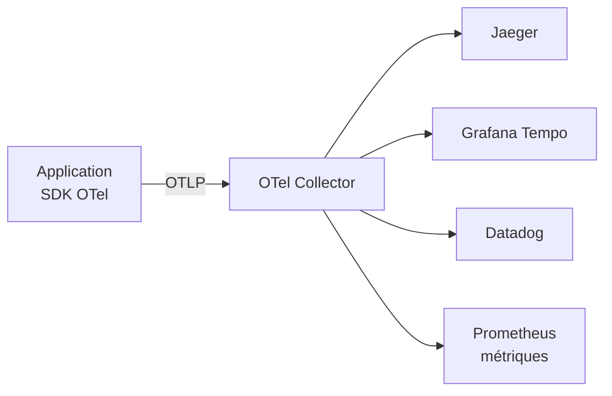
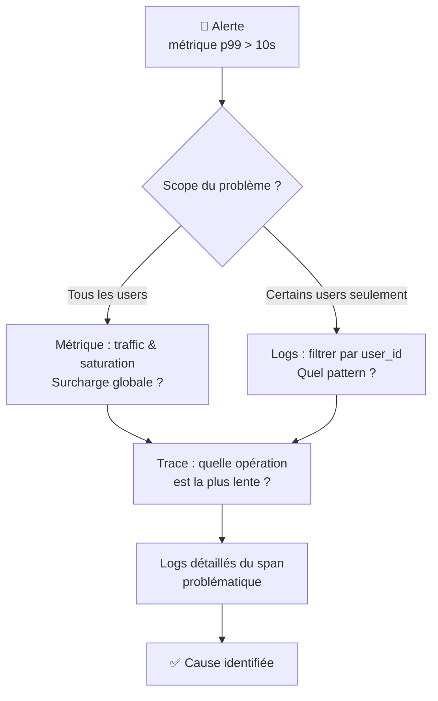
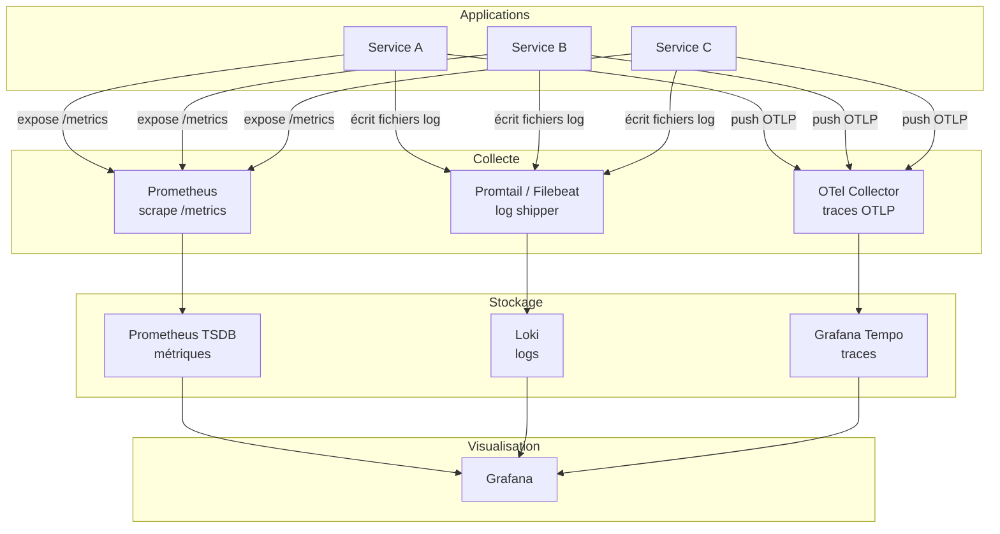

# Observabilité : logs, métriques et traces

## Objectifs pédagogiques

À la fin de ce module, vous serez capable de :

- Distinguer les trois piliers de l'observabilité (logs, métriques, traces) et savoir lequel utiliser selon la situation
- Lire et interpréter des logs applicatifs pour identifier la cause d'un incident
- Comprendre ce qu'une métrique mesure, et pourquoi elle monte ou descend
- Relier une trace distribuée à un ralentissement constaté par un utilisateur
- Proposer une stratégie d'investigation cohérente face à un comportement anormal en production

---

## Mise en situation

Imaginez : un lundi matin, l'équipe support reçoit une vague de tickets. Les utilisateurs signalent que la validation de commande sur l'application e-commerce "tourne" pendant 30 secondes puis affiche une erreur générique. Le problème ne concerne pas tout le monde — certains passent commande sans souci.

Le développeur de garde vérifie le code : rien n'a changé depuis vendredi. L'ops regarde le serveur web : il est vert. La base de données ? CPU normal, connexions stables.

Sans observabilité, l'investigation ressemble à chercher une fuite d'eau dans un immeuble de 10 étages en regardant uniquement la façade. Vous savez qu'il y a un problème, mais vous ne savez pas à quel étage ni dans quelle canalisation.

C'est exactement ce que l'observabilité résout — non pas en vous donnant toutes les réponses, mais en vous donnant les bons points d'entrée pour poser les bonnes questions.

---

## Contexte et problématique

### Pourquoi "monitoring" ne suffit plus

Le monitoring traditionnel, c'est surveiller des seuils : CPU > 80% → alerte. Disk > 90% → alerte. C'est utile, mais ça répond à une seule question : *"est-ce que ça va ?"*

L'observabilité est un cran au-dessus. Elle répond à : *"pourquoi ça ne va pas ?"* — et idéalement, elle permet de répondre à des questions que vous n'aviez pas anticipées au moment où vous avez mis en place votre système.

La distinction vient du monde des systèmes de contrôle : un système est dit "observable" si on peut inférer son état interne uniquement à partir de ses sorties externes. En pratique pour une application, ça signifie que vous ne devriez pas avoir besoin de vous connecter en SSH sur le serveur en prod pour comprendre ce qui s'y passe.

### Les trois piliers

L'industrie a convergé vers trois types de données complémentaires, souvent appelés les **trois piliers de l'observabilité** :

| Pilier | Ce qu'il capture | Analogie |
|--------|-----------------|----------|
| **Logs** | Événements discrets avec contexte | Le journal de bord du capitaine |
| **Métriques** | Mesures numériques dans le temps | Le tableau de bord d'une voiture |
| **Traces** | Le chemin d'une requête à travers les services | Le fil d'Ariane dans un labyrinthe |

Chacun a ses forces et ses angles morts. La pratique réelle consiste à passer de l'un à l'autre pour reconstituer la réalité.

---

## Les logs — ce que l'application vous raconte

### Anatomie d'un log

Un log, c'est la trace écrite d'un événement qui s'est produit à un instant précis. Avant de voir comment les exploiter, voyons à quoi ils ressemblent :

```
2024-01-15T09:23:41.382Z ERROR [OrderService] Failed to call payment gateway
  order_id=ORD-98231
  user_id=usr-4421
  duration_ms=29847
  error=connection timeout
  stack_trace=...
```

Ce log contient plusieurs éléments qu'on retrouve dans tout log bien structuré :

- **Timestamp** — quand exactement
- **Niveau de sévérité** — ERROR, WARN, INFO, DEBUG
- **Composant source** — quel service ou classe a émis ce log
- **Message** — ce qui s'est passé
- **Contexte structuré** — les clés/valeurs qui permettent de filtrer et corréler

Le niveau de sévérité est souvent mal utilisé. En pratique :

| Niveau | Signification réelle | À alerter ? |
|--------|---------------------|-------------|
| `ERROR` | Quelque chose a échoué, l'utilisateur est impacté | Souvent oui |
| `WARN` | Comportement anormal mais récupéré | Parfois (à surveiller) |
| `INFO` | Événement métier normal | Non |
| `DEBUG` | Détail technique pour investigation | Non (ne jamais activer en prod sans raison) |

⚠️ **Erreur fréquente** : laisser le niveau de log en `DEBUG` en production. Cela génère un volume de logs 10 à 100 fois supérieur, noyant les vrais problèmes dans le bruit — et parfois exposant des données sensibles dans les fichiers de log.

### Logs structurés vs logs texte libre

Il existe deux familles de logs que vous rencontrerez en entreprise.

Les **logs texte libre** ressemblent à ça :

```
[15/Jan/2024 09:23:41] ERROR in OrderService: Failed to call payment gateway for order 98231
```

Les **logs structurés** (généralement en JSON) :

```json
{
  "timestamp": "2024-01-15T09:23:41.382Z",
  "level": "ERROR",
  "service": "OrderService",
  "message": "Failed to call payment gateway",
  "order_id": "ORD-98231",
  "duration_ms": 29847
}
```

La différence est énorme en pratique. Avec des logs texte libre, pour trouver tous les échecs liés à l'order 98231, il faut faire un `grep` et espérer que le format est cohérent. Avec des logs structurés, c'est une simple requête sur le champ `order_id`. À grande échelle, avec des dizaines de services qui génèrent des millions de logs par jour, c'est la différence entre une investigation qui prend 5 minutes et une qui prend 2 heures.

### Lire des logs en pratique

Quelques commandes que vous utiliserez régulièrement :

```bash
# Afficher les 100 dernières lignes d'un fichier de log
tail -n 100 /var/log/app/application.log

# Suivre un fichier de log en temps réel
tail -f /var/log/app/application.log

# Filtrer par niveau d'erreur
grep "ERROR" /var/log/app/application.log

# Filtrer sur une période + un terme
grep "2024-01-15T09:2" /var/log/app/application.log | grep "OrderService"

# Compter les occurrences d'une erreur
grep -c "connection timeout" /var/log/app/application.log

# Avec journalctl (systemd)
journalctl -u <SERVICE_NAME> --since "2024-01-15 09:00" --until "2024-01-15 10:00"
```

💡 **Astuce** : `journalctl -u nginx -f -p err` affiche en temps réel uniquement les erreurs du service nginx. Le flag `-p` filtre par priorité (emerg, alert, crit, err, warning, notice, info, debug). Utile pour ne pas se noyer lors d'un incident.

### Agrégation de logs

En environnement réel avec plusieurs serveurs ou conteneurs, vous ne lirez jamais les logs fichier par fichier. C'est là qu'interviennent les plateformes d'agrégation :

- **ELK Stack** (Elasticsearch + Logstash + Kibana) — très répandu, puissant, complexe à opérer
- **Loki + Grafana** — plus léger, indexation par labels uniquement (pas le contenu), s'intègre bien avec Prometheus
- **Datadog / New Relic / Splunk** — solutions SaaS, coût élevé mais opération simplifiée

Le principe est toujours le même : les applications envoient leurs logs à un agent (Filebeat, Fluentd, Promtail...), qui les achemine vers un stockage central, interrogeable via une interface web.

---

## Les métriques — mesurer ce qui compte

### Ce qu'est vraiment une métrique

Une métrique, c'est une valeur numérique mesurée à intervalles réguliers dans le temps. Ce n'est pas un événement (ça c'est un log) — c'est une tendance.

Exemples concrets :
- Nombre de requêtes HTTP par seconde sur l'API
- Taux d'erreur (pourcentage de réponses 5xx)
- Latence au 95e percentile des appels à la base de données
- Taille de la file d'attente des jobs en attente

Ce qui fait la valeur des métriques, c'est leur capacité à montrer des tendances et à déclencher des alertes avant que les utilisateurs se plaignent. Si votre file d'attente de jobs augmente progressivement depuis 3 heures, les logs vous le diront peut-être au moment où tout explose — la métrique, elle, vous le dit pendant que vous pouvez encore agir.

### Les types de métriques (modèle Prometheus)

Prometheus est devenu le standard de facto pour la collecte de métriques dans les environnements modernes. Il définit quatre types de métriques :

**Counter** — un compteur qui ne fait qu'augmenter (ou se remet à zéro au redémarrage).

```
http_requests_total{method="POST", status="200"} 15423
http_requests_total{method="POST", status="500"} 47
```

On ne l'utilise pas tel quel, mais en calculant son taux de variation. `rate(http_requests_total[5m])` vous donne le nombre de requêtes par seconde sur les 5 dernières minutes.

**Gauge** — une valeur qui monte et descend, comme la température ou l'utilisation mémoire.

```
process_resident_memory_bytes 135266304
```

**Histogram** — distribue les observations dans des buckets. C'est ce qui permet de calculer des percentiles.

```
http_request_duration_seconds_bucket{le="0.1"}  1200
http_request_duration_seconds_bucket{le="0.5"}  3400
http_request_duration_seconds_bucket{le="1.0"}  3800
```

🧠 **Concept clé** : le percentile 95 (p95) signifie que 95% des requêtes sont plus rapides que cette valeur. C'est beaucoup plus informatif que la moyenne, qui peut masquer des pics. Si votre latence moyenne est 200ms mais votre p95 est 8 secondes, certains utilisateurs vivent une expérience catastrophique que la moyenne ne montre pas.

**Summary** — similaire à l'histogram mais les percentiles sont calculés côté application. Moins flexible pour les agrégations, moins recommandé.

### Visualiser les métriques avec Grafana

Prometheus collecte, Grafana visualise. Le duo est tellement courant que vous le retrouverez dans la quasi-totalité des infrastructures modernes.

Une requête PromQL typique pour surveiller le taux d'erreur :

```promql
# Taux d'erreur HTTP 5xx sur les 5 dernières minutes
rate(http_requests_total{status=~"5.."}[5m])
  /
rate(http_requests_total[5m])
```

Ou pour la latence au 95e percentile :

```promql
histogram_quantile(0.95, 
  rate(http_request_duration_seconds_bucket[5m])
)
```

⚠️ **Erreur fréquente** : alerter sur la moyenne de latence. Si votre p99 explose mais votre moyenne reste acceptable, vous n'alerterez jamais — mais 1% de vos utilisateurs attendent 30 secondes. Alertez sur les percentiles élevés (p95, p99), pas sur la moyenne.

### Les "Golden Signals"

Google a popularisé quatre métriques fondamentales à surveiller sur tout service, appelées les *four golden signals*. Si vous ne savez pas par où commencer pour instrumenter un service, commencez par là :

| Signal | Définition | Exemple de métrique |
|--------|-----------|---------------------|
| **Latency** | Temps de traitement d'une requête | p95 de `http_request_duration_seconds` |
| **Traffic** | Volume de charge sur le système | `rate(http_requests_total[5m])` |
| **Errors** | Taux de requêtes qui échouent | `rate(http_requests_total{status=~"5.."}[5m])` |
| **Saturation** | À quel point le système est "plein" | CPU, mémoire, taille de file d'attente |

---

## Les traces — suivre une requête à la trace

### Le problème que les traces résolvent

Dans une architecture microservices, une action utilisateur simple peut déclencher une cascade d'appels entre services. L'utilisateur clique sur "Valider ma commande" → l'application appelle le service Panier → qui appelle le service Stock → qui appelle la base de données → pendant que le service Paiement est appelé en parallèle → qui appelle l'API bancaire externe.

Si la requête prend 28 secondes, où sont perdues ces 28 secondes ? Les logs de chaque service vous diront ce qui s'est passé dans leur coin, mais pas comment les pièces s'assemblent. La métrique de latence globale vous dit que c'est lent, mais pas où.

C'est le problème que résolvent les **traces distribuées**.

### Anatomie d'une trace

```mermaid
gantt
    title Trace d'une requête "Valider commande" (durée totale : 28.3s)
    dateFormat SSS
    axisFormat %Lms

    section API Gateway
    Réception requête          :done, 000, 10ms

    section OrderService
    Validation panier          :done, 010, 120ms
    Appel StockService         :crit, 130, 200ms
    Appel PaymentService       :active, 130, 27900ms

    section StockService
    Vérification stock         :done, 130, 195ms

    section PaymentService
    Appel API bancaire externe :crit, 130, 27890ms

    section Base de données
    Écriture commande          :done, 28060, 180ms
```

Une trace est composée de **spans**. Chaque span représente une opération avec un début, une fin, et des métadonnées. Les spans sont reliés entre eux par un identifiant de trace commun (`trace_id`) qui se propage d'un service à l'autre dans les headers HTTP.

Dans notre exemple, la trace révèle immédiatement que le problème se situe dans l'appel à l'API bancaire externe — 27,9 secondes sur 28,3 au total. Sans la trace, cette investigation aurait pu durer des heures.

### OpenTelemetry — le standard qui s'impose

Longtemps, chaque outil de tracing (Jaeger, Zipkin, Datadog...) avait son propre format et ses propres SDK. Instrumenter une application pour Jaeger, puis décider de passer à Datadog, signifiait tout réécrire.

**OpenTelemetry (OTel)** résout ce problème. C'est un projet open source (CNCF) qui fournit un standard unique pour collecter logs, métriques et traces. L'idée : instrumentez votre application une seule fois avec les SDK OpenTelemetry, et choisissez ensuite où vous envoyez les données (Jaeger, Grafana Tempo, Datadog, New Relic...) via de simples changements de configuration.



La propagation d'un `trace_id` dans les headers HTTP ressemble à ça :

```
traceparent: 00-4bf92f3577b34da6a3ce929d0e0e4736-00f067aa0ba902b7-01
```

Ce header est transmis automatiquement par les SDK OTel à chaque appel entre services, ce qui permet de reconstituer le chemin complet d'une requête après coup.

💡 **Astuce** : même si vous n'avez pas encore de système de tracing en place, assurez-vous que votre application génère et propage un `request_id` ou `correlation_id` dans ses logs. C'est une version simplifiée du trace_id — elle vous permet déjà de corréler les logs de différents services pour un même appel utilisateur, avec de simples `grep`.

---

## Comment les trois piliers se complètent

En pratique, une investigation commence rarement par un seul pilier. Voici comment ils s'enchaînent naturellement :



Le flux typique d'une investigation :

1. **La métrique vous dit quand** — le p99 a dépassé le seuil à 09h21
2. **Le log vous dit quoi** — des erreurs `connection timeout` vers le service paiement
3. **La trace vous dit où** — exactement quel appel, dans quelle séquence, avec quelle durée

Aucun des trois ne remplace les deux autres. Un système avec seulement des logs est un système où chaque investigation prend trop de temps. Un système avec seulement des métriques vous dira qu'il y a un problème sans vous dire pourquoi. Un système avec seulement des traces vous noie dans le détail sans la vue d'ensemble.

---

## Fonctionnement interne — comment les données circulent

Comprendre le pipeline de données vous aidera à diagnostiquer les problèmes d'observabilité eux-mêmes (oui, les systèmes de monitoring tombent en panne aussi).

### Pipeline typique en production



Deux modèles de collecte coexistent :

- **Pull** (Prometheus) : le système de monitoring vient chercher les données (`scrape`) sur un endpoint `/metrics` exposé par chaque service. Avantage : le service de monitoring contrôle le rythme, facile à déboguer (l'endpoint est accessible directement dans un navigateur).

- **Push** (logs, traces, parfois métriques) : l'application envoie les données vers un collecteur central. Nécessaire pour les traces (trop de volume pour du pull), naturel pour les logs (écrits dans des fichiers puis collectés).

🧠 **Concept clé** : Prometheus stocke ses métriques dans une base de données *time-series* (TSDB). Ce type de base de données est optimisé pour des données horodatées et régulières — il compresse très efficacement des séries de valeurs similaires dans le temps, mais n'est pas adapté pour des requêtes complexes sur des données non numériques. C'est pourquoi les logs ont leur propre stockage (Loki, Elasticsearch), et les traces le leur (Tempo, Jaeger).

---

## Cas réel en entreprise

### Contexte

Une application de gestion RH reçoit chaque mois un pic de charge lors des clôtures de paie. Le support reçoit des signalements : "le calcul de paie tourne sans fin". L'équipe n'a pas de système d'observabilité structuré — seulement des logs texte dans des fichiers sur trois serveurs d'application.

### Ce qui s'est passé

**Phase 1 — Investigation sans observabilité** (durée : 2h30)

Le technicien support se connecte successivement sur les trois serveurs, fait des `tail -f` sur les logs, constate des erreurs de timeout, mais ne peut pas déterminer lequel des trois serveurs a le problème le plus sévère ni depuis quand. Il escalade au N3.

Le développeur inspecte le code — rien d'anormal. Redémarrage des serveurs → problème temporairement résolu, mais revient 40 minutes plus tard.

**Phase 2 — Mise en place d'une observabilité minimale** (investissement : 3 jours)

L'équipe met en place :
- Centralisation des logs sur Loki via Promtail
- Exposition d'un endpoint `/metrics` sur l'application (nombre de calculs en cours, durée, taux d'erreur)
- Grafana pour visualiser le tout

**Phase 3 — L'incident suivant** (durée de résolution : 18 minutes)

La métrique `paie_calculs_en_cours` grimpe à 450 (normale : ~50). L'alerte se déclenche avant les premiers tickets utilisateurs.

Requête Loki sur les logs du dernier quart d'heure : 87% des erreurs contiennent `lock wait timeout exceeded`. Cause identifiée : une transaction longue pose un verrou sur la table des absences, bloquant tous les autres calculs.

La requête problématique est identifiée grâce au `query_id` présent dans les logs. Rollback de la transaction, libération des verrous. Résolution totale en 18 minutes, avant que la majorité des utilisateurs ne soit impactée.

**Résultat mesurable** : MTTR (Mean Time To Resolve) passé de 2h30 à 18 minutes sur ce type d'incident.

---

## Bonnes pratiques

**1. Structurer ses logs dès le départ, pas après**
Un log structuré (JSON) coûte presque rien à écrire et économise des heures d'investigation. Définissez une convention (quels champs ? quels noms ?) et appliquez-la à tous les services. Le champ `correlation_id` ou `trace_id` est non négociable si vous avez plusieurs services.

**2. Ne logger que ce qui est utile — et au bon niveau**
Un log `DEBUG` en prod, c'est du bruit. Un log `INFO` pour chaque ligne SQL exécutée, c'est des téraoctets inutiles. Demandez-vous : "est-ce que je relirais ce log lors d'un incident ?" Si non, retirez-le ou passez-le en DEBUG.

**3. Alerter sur des symptômes, pas des causes**
Une alerte sur "CPU > 80%" est une cause possible. Une alerte sur "p99 latence > 2 secondes" est un symptôme utilisateur. Les symptômes déclenchent des actions urgentes ; les causes se surveillent pour comprendre. Commencez par les golden signals.

**4. Définir des SLOs avant de configurer des alertes**
Un SLO (Service Level Objective) est un engagement de fiabilité : "99.5% des requêtes répondent en moins d'une seconde". Une fois le SLO défini, les seuils d'alerte se déduisent naturellement. Sans SLO, les seuils sont arbitraires et génèrent trop de faux positifs.

**5. Tester vos alertes**
Une alerte qui n'a jamais déclenché est une alerte dont vous ne savez pas si elle fonctionne. Faites des "fire drills" : injectez volontairement de la latence ou des erreurs en environnement de test, vérifiez que les alertes se déclenchent et que les notifications arrivent aux bonnes personnes.

**6. Conserver les données avec une politique de rétention adaptée**
Les logs détaillés coûtent cher à stocker. Une politique raisonnable : logs DEBUG → 3 jours, logs INFO → 30 jours, logs ERROR → 90 jours, métriques agrégées → 1 an. Adaptez selon vos contraintes réglementaires (RGPD, audit...).

**7. Ne pas observer l'observabilité avec elle-même**
Si Prometheus tombe, il ne peut pas vous alerter qu'il est tombé. Votre système d'alerte (Alertmanager) doit avoir un mécanisme de "watchdog" externe — une alerte qui se déclenche si elle ne reçoit plus de signal de vie pendant X minutes.

---

## Résumé

L'observabilité, ce n'est pas un outil — c'est une propriété de votre système. Un système observable vous permet de comprendre son état interne depuis l'extérieur, sans avoir à deviner ou à trifouiller manuellement en production. Elle repose sur trois piliers complémentaires : les **logs** capturent les événements discrets avec leur contexte, les **métriques** mesurent les tendances dans le temps et déclenchent les alertes, les **traces** révèlent le chemin exact d'une requête à travers vos services. Utilisés ensemble, ils réduisent drastiquement le temps de résolution des incidents. La prochaine étape naturelle est de voir comment ces outils s'intègrent dans une culture SRE — avec la notion de SLO, de budget d'erreur, et de gestion proactive de la fiabilité.

---

<!-- snippet
id: obs_logs_tail_realtime
type: command
tech: bash
level: beginner
importance: high
format: knowledge
tags: logs,bash,debug,monitoring,linux
title: Suivre les logs en temps réel avec tail
command: tail -f <FICHIER_LOG>
example: tail -f /var/log/app/application.log
description: Affiche les nouvelles lignes au fur et à mesure qu'elles sont écrites. Incontournable lors d'un incident actif pour voir ce que fait l'application en direct.
-->

<!-- snippet
id: obs_logs_tail_lines
type: command
tech: bash
level: beginner
importance: medium
format: knowledge
tags: logs,bash,linux,investigation
title: Afficher les N dernières lignes d'un fichier de log
command: tail -n <NOMBRE_LIGNES> <FICHIER_LOG>
example: tail -n 100 /var/log/app/application.log
description: Utile pour inspecter rapidement la fin d'un fichier de log sans l'ouvrir en entier. Remplacer <NOMBRE_LIGNES> selon la profondeur souhaitée.
-->

<!-- snippet
id: obs_logs_grep_filter
type: command
tech: bash
level: beginner
importance: high
format: knowledge
tags: logs,bash,grep,filtrage,linux
title: Filtrer les logs par mot-clé et compter les occurrences
command: grep -c "<TERME>" <FICHIER_LOG>
example: grep -c "connection timeout" /var/log/app/application.log
description: grep -c compte le nombre de lignes correspondantes sans les afficher. Retirer le flag -c pour afficher les lignes. Combiner avec des pipes pour affiner le filtre.
-->

<!-- snippet
id: obs_logs_journalctl_filter
type: command
tech: systemd
level: intermediate
importance: high
format: knowledge
tags: logs,journalctl,systemd,erreur,filtrage
title: Filtrer les logs systemd par service, date et niveau
command: journalctl -u <SERVICE_NAME> --since "<DATE_DEBUT>" --until "<DATE_FIN>" -p err
example: journalctl -u nginx --since "2024-01-15 09:00" --until "2024-01-15 10:00" -p err
description: Combine filtrage par service (-u), plage horaire (--since/--until) et niveau de sévérité (-p err). Réduit le bruit à l'essentiel pendant un incident.
-->

<!-- snippet
id: obs_logs_niveaux_severite
type: concept
tech: logging
level: beginner
importance: high
format: knowledge
tags: logs,severite,debug,error,warn
title: Niveaux de log — lequel signifie quoi
content: ERROR = échec impactant l'utilisateur (à alerter). WARN = anomalie récupérée (à surveiller). INFO = événement métier normal (pas d'alerte). DEBUG = détail technique (jamais en prod). Le niveau DEBUG en production génère 10 à 100x plus de logs, noie les vrais problèmes et peut exposer des données sensibles.
description: Utiliser le mauvais niveau de log est l'une des causes principales de "bruit" dans les systèmes de monitoring — et de problèmes de sécurité.
-->

<!-- snippet
id: obs_metrics_percent
