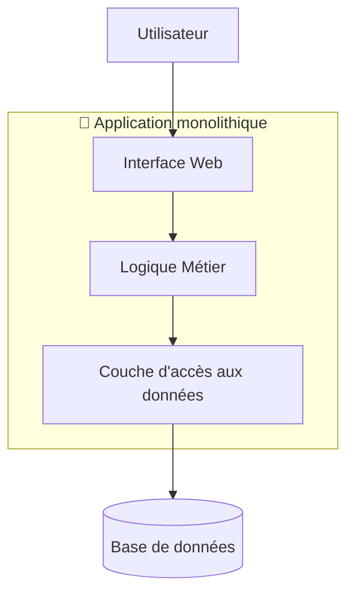
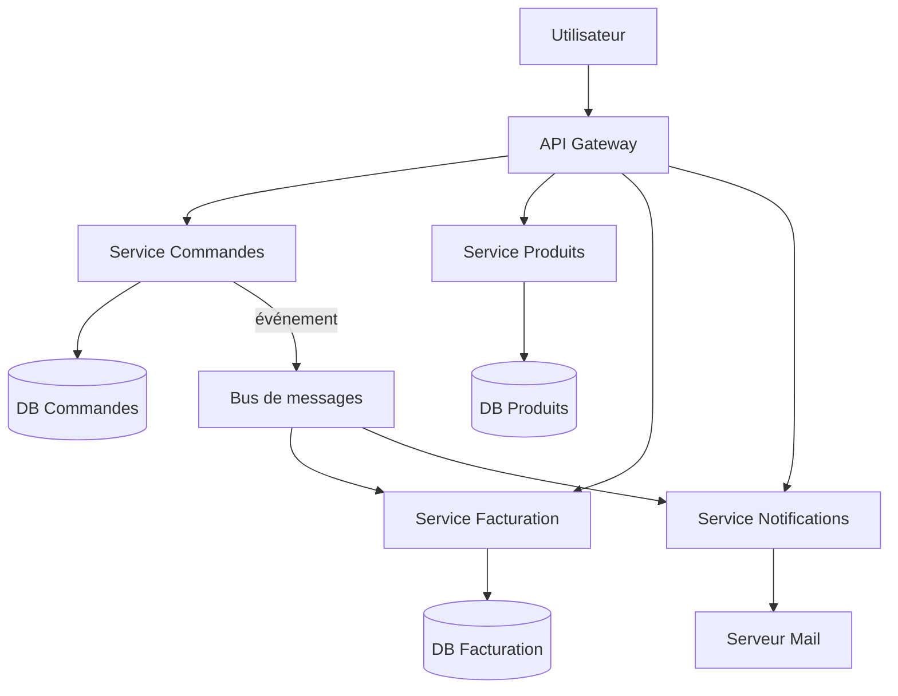
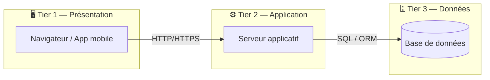
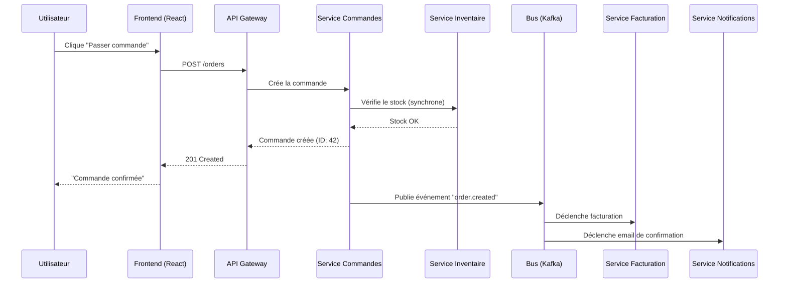
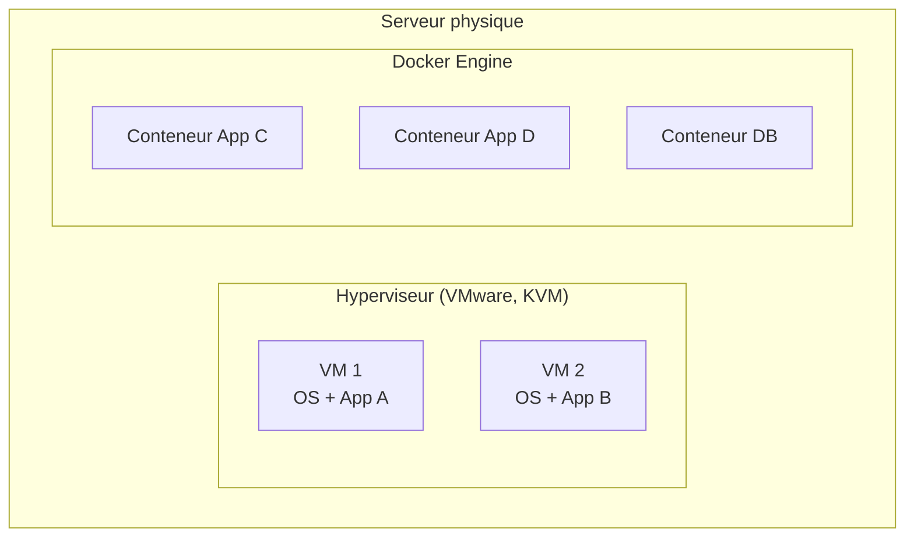

# Architecture & compréhension globale du SI

## Objectifs pédagogiques

À l'issue de ce module, vous serez capable de :

- Décrire les grandes composantes d'un Système d'Information et expliquer comment elles s'articulent
- Distinguer une architecture monolithique d'une architecture distribuée, et identifier les implications concrètes pour le support
- Lire et interpréter un schéma d'architecture applicative pour localiser rapidement la source d'un dysfonctionnement
- Identifier le rôle d'un middleware, d'un bus de messages ou d'une API dans un flux applicatif
- Adapter votre démarche de diagnostic selon la couche du SI concernée

---

## Mise en situation

Vous êtes technicien support dans une entreprise de logistique. Un utilisateur signale que ses commandes n'apparaissent plus dans le portail client depuis ce matin. Le portail s'affiche normalement. Aucun message d'erreur visible.

Où cherchez-vous ? Dans l'application web ? Dans la base de données ? Dans le service d'intégration qui synchronise les commandes depuis l'ERP ? Dans le bus de messages qui transporte les événements entre systèmes ?

Sans une compréhension de l'architecture globale du SI, vous allez tâtonner. Avec elle, vous savez exactement par où commencer — et vous évitez de passer deux heures à chercher dans la mauvaise couche.

C'est précisément ce que ce module vous donne : la carte du territoire.

---

## Ce qu'est un SI — et pourquoi il ne ressemble jamais à un seul système

Un **Système d'Information** (SI) n'est pas une application. C'est l'ensemble des composants — logiciels, matériels, données, processus et humains — qui permettent à une organisation de collecter, traiter, stocker et distribuer l'information dont elle a besoin pour fonctionner.

En pratique, un SI d'entreprise ressemble moins à un bâtiment qu'à une ville : des quartiers construits à des époques différentes, avec des routes entre eux pas toujours bien tracées, des places centrales très fréquentées, et quelques ruelles héritées des années 90 que plus personne ne comprend vraiment mais qu'on ne peut pas supprimer.

🧠 **Concept clé** — Le SI n'est pas statique. Il évolue par couches successives, et chaque ajout laisse des traces dans l'architecture. Comprendre un SI, c'est souvent comprendre son histoire autant que son état actuel.

Les grandes familles de composants qu'on retrouve dans presque tous les SI :

| Composant | Rôle | Exemples concrets |
|-----------|------|-------------------|
| **Applications métier** | Exposent les fonctionnalités aux utilisateurs | ERP (SAP), CRM (Salesforce), portail RH |
| **Bases de données** | Stockent et restituent les données structurées | PostgreSQL, Oracle, SQL Server |
| **Middleware / Bus** | Font circuler l'information entre applications | RabbitMQ, Kafka, MuleSoft, IBM MQ |
| **APIs** | Exposent des services consommables par d'autres systèmes | REST, SOAP, GraphQL |
| **Infrastructure** | Fournissent les ressources d'exécution | Serveurs, VMs, conteneurs, cloud |
| **Outils transverses** | Gestion, supervision, sécurité | LDAP/AD, monitoring, SIEM, IAM |

Ce tableau est une grille de lecture, pas une liste exhaustive. Dans votre quotidien de support, vous croiserez ces composants constamment — parfois tous dans le même incident.

---

## Les grands modèles d'architecture applicative

### Le monolithe — tout dans un seul bloc

L'architecture monolithique, c'est le modèle originel. L'ensemble des fonctionnalités d'une application — interface, logique métier, accès aux données — est regroupé dans un seul et même déployable.



C'est simple à comprendre, simple à déployer au départ, et simple à déboguer — parce que tout est au même endroit. Le problème, c'est la suite. Quand l'application grossit, les dépendances internes s'enchevêtrent, les déploiements deviennent risqués (toucher un module peut casser un autre), et la scalabilité est tout ou rien : vous ne pouvez pas faire grossir uniquement le module de facturation sans faire grossir toute l'application.

**Ce que ça implique pour le support :** un incident dans un monolithe peut avoir des effets en cascade imprévisibles. Si la base de données ralentit, toute l'application souffre. Si une fonctionnalité plante, elle peut emporter les autres. En revanche, les logs sont centralisés et la chaîne de traitement est linéaire — plus facile à suivre.

<!-- snippet
id: si_monolithe_cascade_panne
type: concept
tech: architecture
level: intermediate
importance: medium
format: knowledge
tags: monolithe, panne, cascade, diagnostic, architecture
title: Monolithe — une lenteur base de données ralentit tout
content: Dans un monolithe, tous les modules partagent les mêmes ressources (pool de connexions DB, mémoire heap, threads). Une lenteur sur la base de données ou une fuite mémoire dans un module se propage à toute l'application. Effet visible : l'application devient globalement lente ou instable même sur des fonctionnalités sans lien avec l'incident d'origine.
description: En monolithe, isoler un module lent est impossible : la dégradation se propage à l'ensemble de l'application.
-->

---

### Les microservices — décomposer pour mieux régner

L'architecture microservices découpe l'application en services indépendants, chacun responsable d'un périmètre fonctionnel précis, déployable et scalable séparément.



Chaque service a sa propre base de données, sa propre logique, son propre cycle de déploiement. Ils communiquent entre eux via des APIs ou un bus de messages.

Les avantages sont réels : scalabilité ciblée, déploiements indépendants, isolation des pannes. Mais le prix à payer est significatif : la complexité opérationnelle explose. Un flux qui traversait trois fonctions dans un monolithe traverse maintenant trois services, une API gateway, un bus de messages — et chaque saut est un point de défaillance potentiel.

⚠️ **Erreur fréquente** — En microservices, quand un utilisateur dit "ça ne marche pas", la tentation est de chercher l'erreur dans le service qu'il utilise directement. Or la panne est souvent en aval, dans un service dépendant. Toujours reconstituer le flux complet avant de creuser.

<!-- snippet
id: si_microservices_panne_aval
type: warning
tech: architecture
level: advanced
importance: high
format: knowledge
tags: microservices, diagnostic, dependances, panne, api
title: Panne microservices — chercher en aval, pas dans le service appelé
content: En microservices, quand un utilisateur signale une erreur sur le service A, la cause est souvent dans le service B ou C que A appelle. Méthode : identifier tous les appels sortants du service A (via les logs ou la doc d'API), vérifier les health checks de chaque dépendance. Ne pas commencer par les logs internes de A avant d'avoir éliminé ses dépendances.
description: Erreur microservice : remonter la chaîne des dépendances avant de creuser dans le service en façade.
-->

---

### L'architecture n-tiers — la logique en couches

Entre le monolithe et les microservices, l'architecture **n-tiers** (ou multicouches) est probablement ce que vous croiserez le plus souvent dans les SI d'entreprise existants. Elle sépare l'application en couches bien définies, sans aller jusqu'à la décomposition par service.

La version la plus répandue est le **3-tiers** :



Cette séparation a une conséquence directe sur votre travail : quand un utilisateur dit que "l'application est lente", la question immédiate est **dans quel tier ?** Lenteur réseau entre le client et le serveur ? Traitement applicatif (requêtes lentes, algo coûteux) ? Requêtes base de données non optimisées ? Ce n'est pas la même chose, et ce n'est pas résolu pareil.

<!-- snippet
id: si_3tiers_localiser_lenteur
type: tip
tech: architecture
level: intermediate
importance: medium
format: knowledge
tags: 3tiers, performance, diagnostic, base-de-donnees, reseau
title: Lenteur 3-tiers — identifier le tier responsable
content: Face à une lenteur applicative en architecture 3-tiers : 1) Mesurer le temps de réponse réseau client→serveur (ping, traceroute, onglet Network du navigateur) 2) Vérifier le temps de traitement applicatif (logs serveur avec timestamps) 3) Analyser les requêtes SQL lentes (slow query log, pg_stat_statements). Commencer par le tier réseau élimine rapidement 30% des faux positifs.
description: Lenteur 3-tiers : mesurer réseau, puis applicatif, puis SQL — dans cet ordre pour ne pas chercher au mauvais endroit.
-->

---

## Le rôle du middleware et des bus de messages

Voilà un composant que beaucoup de techniciens support ignorent jusqu'au jour où il tombe en panne — et là, tout s'arrête sans que personne ne comprenne pourquoi.

Un **middleware** est un logiciel qui fait le lien entre deux systèmes qui ne parlent pas naturellement le même langage. Il peut transformer des données, router des messages, gérer des files d'attente, ou assurer la fiabilité des échanges.

Imaginez un interprète dans une conférence internationale : les intervenants parlent leurs langues respectives, l'interprète traduit en temps réel. Si l'interprète ne répond plus, la communication s'arrête — même si tous les intervenants sont présents et en bonne santé.

Les deux grandes familles :

| Type | Mécanisme | Exemples | Usage typique |
|------|-----------|----------|---------------|
| **Bus de messages** | Asynchrone — le producteur envoie, le consommateur lit quand il peut | RabbitMQ, Kafka, ActiveMQ | Découplage de services, événements, flux de données |
| **ESB / iPaaS** | Orchestration centralisée, souvent synchrone | MuleSoft, IBM Integration Bus | Intégration ERP-CRM, transformations complexes |
| **API Gateway** | Point d'entrée unique, routage, auth, rate limiting | Kong, AWS API Gateway, nginx | Façade microservices, sécurité, monitoring |

🧠 **Concept clé** — Un bus de messages asynchrone introduit un découplage temporel : le producteur n'attend pas que le consommateur traite le message. Conséquence directe pour le support : si le consommateur tombe en panne, les messages s'accumulent dans la file. Quand il redémarre, il les traite en rafale. Ce comportement peut provoquer des pics de charge inattendus après un redémarrage — et des alertes qui semblent surgir "de nulle part".

<!-- snippet
id: si_middleware_file_messages
type: concept
tech: rabbitmq
level: advanced
importance: high
format: knowledge
tags: middleware, rabbitmq, kafka, asynchrone, support
title: File de messages qui grossit = panne en aval
content: Dans un système asynchrone (RabbitMQ, Kafka), si la file de messages grossit anormalement, le producteur fonctionne mais le consommateur est bloqué. Le consommateur peut être en panne, surchargé, ou coupé du système cible. Toujours vérifier la profondeur de la file en premier lors d'un incident sur un flux asynchrone.
description: Une file RabbitMQ/Kafka qui s'accumule signale une panne consommateur ou connectivité — pas un problème producteur.
-->

<!-- snippet
id: si_gateway_point_entree
type: concept
tech: architecture
level: advanced
importance: medium
format: knowledge
tags: api-gateway, microservices, routage, securite, monitoring
title: API Gateway — rôle et position dans l'architecture
content: Une API Gateway est le point d'entrée unique devant un ensemble de microservices. Elle gère : le routage (quel service appeler selon l'URL), l'authentification (vérification JWT/OAuth avant d'atteindre les services), le rate limiting (bloquer les abus), et la collecte de métriques centralisées. Conséquence support : si toutes les APIs semblent en panne simultanément, vérifier la gateway avant les services individuels.
description: Panne de toutes les APIs simultanément → la gateway (Kong, AWS API Gateway, nginx) est le premier composant à inspecter.
-->

---

## Lire une architecture — le réflexe du flux

Devant un schéma d'architecture, le bon réflexe n'est pas de lire les boîtes une par une. C'est de **suivre le flux** du point de vue d'une requête utilisateur.

Prenons un exemple concret : un utilisateur passe commande sur un site e-commerce.



Ce diagramme illustre quelque chose d'essentiel : la réponse à l'utilisateur arrive **avant** que la facturation et la notification soient traitées. Ces traitements sont asynchrones. Donc si l'utilisateur dit "je n'ai pas reçu mon email de confirmation" mais que la commande existe bien dans le système, le problème est probablement dans le service Notifications ou dans la consommation du bus — pas dans le flux principal.

Sans cette lecture de flux, vous cherchez au mauvais endroit.

<!-- snippet
id: si_architecture_flux_lecture
type: concept
tech: architecture
level: advanced
importance: high
format: knowledge
tags: architecture, si, diagnostic, flux, support
title: Lire une architecture en suivant le flux utilisateur
content: Devant un schéma d'architecture, suivre la requête utilisateur de bout en bout plutôt que lire les composants un par un. Chaque saut entre deux composants (API call, message bus, requête SQL) est un point de défaillance potentiel. Les pannes se produisent aux interfaces, rarement au cœur d'un système.
description: Identifier la couche de panne en 5 minutes : reconstituer le flux complet avant de creuser dans les logs.
-->

---

## Infrastructure sous-jacente — ce qui fait tourner tout ça

Les applications ne flottent pas dans le vide. Elles s'exécutent sur une infrastructure qu'il faut comprendre, au moins dans ses grandes lignes.

### Les environnements

Dans toute entreprise sérieuse, les applications vivent dans plusieurs environnements distincts, qui ne sont jamais complètement identiques :

| Environnement | Usage | Risque |
|---------------|-------|--------|
| **Production (PROD)** | Utilisateurs réels, données réelles | Toute erreur a un impact immédiat |
| **Pré-production (PREPROD)** | Tests de validation avant mise en prod | Peut diverger de la prod (config, données) |
| **Recette / UAT** | Validation métier | Souvent géré par les utilisateurs clés |
| **Développement (DEV)** | Travail des développeurs | Très instable, jamais représentatif |

💡 **Astuce** — Quand un utilisateur signale un bug, la première question est : est-ce reproductible en PREPROD ? Si oui, le problème est dans le code ou la configuration, pas dans les données de prod. Si non, cherchez une différence d'environnement — version, paramètre, certificat, données spécifiques.

<!-- snippet
id: si_env_preprod_divergence
type: tip
tech: architecture
level: intermediate
importance: high
format: knowledge
tags: environnement, preprod, prod, diagnostic, configuration
title: Bug non reproductible en PREPROD → chercher une différence d'environnement
content: Si un bug apparaît en PROD mais pas en PREPROD, ne pas chercher dans le code en premier. Comparer : version de l'application déployée, variables d'environnement, certificats SSL, données de configuration (ex : URL de service externe), règles réseau/firewall. Les différences de config entre environnements sont responsables d'une majorité des bugs "inexplicables".
description: Bug PROD absent en PREPROD : comparer version, config, certificats et règles réseau avant de chercher dans le code.
-->

### Virtualisation et conteneurs

La grande majorité des applications ne tournent plus sur des serveurs physiques dédiés. Elles tournent sur des **machines virtuelles** (VMs) ou dans des **conteneurs** (Docker, orchestrés par Kubernetes).

La différence fondamentale : une VM embarque un OS complet (lourd, lent à démarrer), un conteneur partage le noyau de l'hôte (léger, démarrage en secondes). En termes de support, ça change la façon d'accéder aux logs, de redémarrer un composant, et d'interpréter les métriques de ressources.



⚠️ **Erreur fréquente** — En environnement conteneurisé, redémarrer un conteneur efface ses fichiers temporaires locaux. Si une application écrivait des données dans le conteneur plutôt que dans un volume monté, ces données sont perdues au redémarrage. Ce n'est pas un bug applicatif — c'est une mauvaise configuration d'infrastructure.

<!-- snippet
id: si_conteneur_donnees_perdues
type: warning
tech: docker
level: intermediate
importance: high
format: knowledge
tags: docker, conteneur, volume, données, infrastructure
title: Redémarrage conteneur = perte des données locales
content: Si une application écrit des fichiers dans le système de fichiers du conteneur (et non dans un volume Docker monté), ces données disparaissent au redémarrage. Piège classique : fichiers de session, uploads temporaires, logs locaux. Correction : vérifier que les répertoires critiques sont montés en volume (`-v /host/path:/container/path`).
description: Donnée perdue après redémarrage Docker → vérifier si le répertoire concerné est monté en volume ou écrit dans le conteneur.
-->

---

## Cas réel — Diagnostiquer une panne dans un SI complexe

**Contexte :** Lundi matin, 8h30. Les équipes commerciales signalent que les devis générés depuis le CRM n'arrivent plus dans l'ERP. Le CRM fonctionne, les utilisateurs créent des devis sans erreur. Mais côté ERP, silence radio.

**L'architecture en jeu :**
- CRM (Salesforce) → publie un événement sur RabbitMQ à chaque devis validé
- Un service d'intégration (middleware maison) consomme RabbitMQ → transforme les données → appelle l'API REST de l'ERP
- L'ERP reçoit, valide et enregistre le devis

**Étape 1 — Identifier où le flux se coupe**

Première vérification : les messages arrivent-ils dans RabbitMQ ? Via la console de management RabbitMQ, on constate que la file `crm.quotes.validated` contient 847 messages non consommés, accumulés depuis 7h12.

Le producteur fonctionne. Le problème est côté consommateur.

**Étape 2 — Diagnostiquer le service d'intégration**

Les logs du service d'intégration montrent des erreurs répétées depuis 7h12 :

```
[ERROR] Failed to call ERP API: Connection timeout after 30000ms
[ERROR] Retry 1/3 failed. Next retry in 60s.
[ERROR] Retry 2/3 failed. Next retry in 120s.
[ERROR] Retry 3/3 failed. Message requeued.
```

Le service essaie, échoue, remet les messages en file. Il tourne, mais il ne peut pas atteindre l'ERP.

**Étape 3 — Remonter vers l'infrastructure**

L'ERP est-il en panne ? Non — les utilisateurs ERP travaillent normalement via l'interface web. Le problème est donc dans la connectivité **réseau entre le service d'intégration et l'API de l'ERP**.

Vérification des règles de pare-feu : une mise à jour de la politique réseau déployée à 7h00 a bloqué le port 8443 (port de l'API ERP) pour le segment réseau hébergeant le service d'intégration.

**Résolution :** Rétablissement de la règle pare-feu → le service d'intégration reprend la consommation de la file → les 847 messages sont traités en 12 minutes → l'ERP reçoit tous les devis.

**Ce que ce cas illustre :** La panne était invisible depuis le CRM (le producteur fonctionnait parfaitement) et invisible depuis l'ERP (l'application elle-même ne voyait rien). Elle était entièrement localisée dans la couche de connectivité entre deux composants. Sans une lecture du flux complet, ce cas pouvait durer des heures.

<!-- snippet
id: si_async_redemarrage_rafale
type: warning
tech: architecture
level: advanced
importance: medium
format: knowledge
tags: asynchrone, rabbitmq, kafka, redemarrage, performance
title: Redémarrage consommateur après accumulation → pic de charge
content: Quand un consommateur de messages (RabbitMQ, Kafka) redémarre après une panne, il traite en rafale tous les messages accumulés. Si la file contient 10 000 messages et que le consommateur les traite en quelques minutes, le système cible (API, base de données) peut subir un pic de charge inattendu. Anticiper en limitant le débit de consommation (prefetch count, rate limiting) après un redémarrage post-incident.
description: Après redémarrage d'un consommateur, la vidange rapide d'une file pleine peut provoquer un pic de charge sur le système cible.
-->

---

## Bonnes pratiques — ce qu'on apprend sur le terrain

**Cartographiez avant de diagnostiquer.** Avant de plonger dans des logs, prenez 5 minutes pour reconstituer le flux applicatif impliqué dans l'incident. Demandez : quels systèmes participent à ce processus ? Dans quel ordre ? De façon synchrone ou asynchrone ? Cette carte mentale vaut de l'or.

**Cherchez les points de jonction.** Les pannes se produisent rarement au cœur d'un système. Elles se produisent aux interfaces — entre deux applications, entre un service et sa base, entre un réseau et un pare-feu. Regardez en priorité les coutures de l'architecture.

**Ne confondez pas "l'application fonctionne" et "le flux fonctionne".** Une application peut démarrer, répondre aux health checks, afficher une interface — et quand même ne pas traiter correctement les données, parce qu'un service dont elle dépend est dégradé. Tester le bout en bout, pas juste les composants individuellement.

💡 **Astuce** — Sur les systèmes asynchrones, toujours vérifier la profondeur des files de messages lors d'un incident. Une file qui grossit anormalement est souvent le premier signal visible d'un problème en aval — avant même que les utilisateurs s'en aperçoivent.

**Documentez ce que vous découvrez.** Chaque incident est une opportunité d'enrichir la connaissance de l'architecture. Si vous avez passé 2h à comprendre le rôle d'un middleware que personne n'avait documenté, écrivez-le. Votre successeur (ou vous-même dans 6 mois) vous remerciera.

⚠️ **Erreur fréquente** — Se concentrer sur les symptômes côté utilisateur sans remonter à la cause structurelle. Un utilisateur qui dit "les données ne s'affichent pas" décrit un symptôme. La cause peut être dans n'importe quelle couche du SI. Ne restez pas au niveau de l'interface.

**Méfiez-vous des redémarrages comme solution réflexe.** Redémarrer un service peut masquer un problème sous-jacent — et dans un contexte conteneurisé ou asynchrone, provoquer de nouveaux incidents (perte de données locales, pic de charge sur la file de messages). Comprendre avant d'agir.

---

## Résumé

Un Système d'Information est un ensemble de composants hétérogènes — applications, bases de données, middlewares, infrastructure — qui s'assemblent pour servir des processus métier. Comprendre son architecture, c'est comprendre comment l'information circule entre ces composants, et où elle peut se bloquer.

Les architectures modernes vont du monolithe (simple mais rigide) aux microservices (flexible mais complexe à opérer), en passant par le n-tiers qui reste dominant dans les SI existants. Quel que soit le modèle, les pannes se produisent aux interfaces — c'est là qu'il faut regarder en premier.

En tant que technicien support, votre valeur ajoutée sur un incident complexe ne vient pas de votre connaissance d'un outil particulier, mais de votre capacité à lire l'architecture comme un flux, à identifier rapidement la couche concernée, et à poser les bonnes questions au bon interlocuteur.

La suite logique de ce module : comprendre comment surveiller ce SI — logs, métriques, alertes — pour détecter les problèmes avant que les utilisateurs n'appellent.
