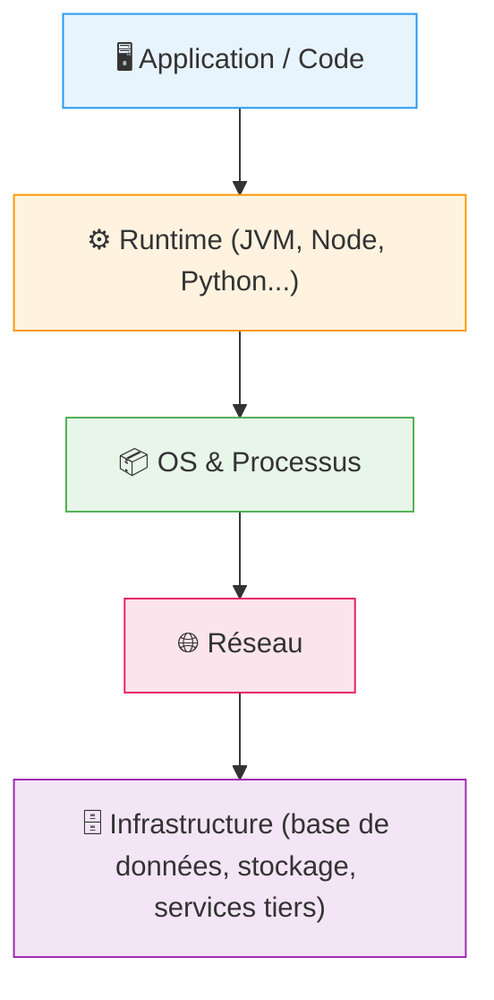
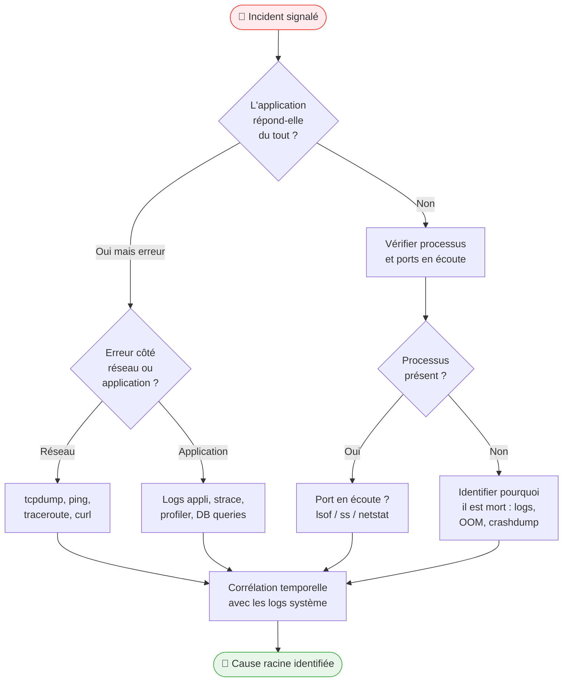

# Debugging avancé & troubleshooting

## Objectifs pédagogiques

À l'issue de ce module, vous serez capable de :

- **Structurer** une démarche de diagnostic méthodique face à un incident applicatif inconnu
- **Identifier** la couche fautive (réseau, OS, application, données) avant de toucher quoi que ce soit
- **Utiliser** les outils avancés (`strace`, `tcpdump`, `lsof`, profilers) pour observer un système en direct
- **Lire et corréler** des logs issus de sources multiples pour reconstruire une chronologie d'incident
- **Produire** un rapport de diagnostic exploitable par une équipe de développement

---

## Mise en situation

Vous êtes technicien support N2 dans une entreprise de logistique. L'application de suivi des colis tombe en erreur tous les jours entre 14h et 15h. Le message affiché côté utilisateur : *"Erreur de connexion au serveur"*. L'application a fonctionné sans incident pendant deux ans. Rien n'a changé côté code, du moins selon le développeur.

L'équipe N1 a déjà redémarré le service deux fois. Le problème revient. Le développeur dit que son code est bon. L'admin réseau dit que son réseau est bon. Et vous, vous êtes au milieu.

C'est exactement le type de situation pour lequel ce module existe. Pas pour vous apprendre à "chercher dans Google" — mais pour vous donner une méthode et des outils qui permettent de **prouver** ce qui se passe, couche par couche, sans avoir besoin que quelqu'un vous croie sur parole.

---

## Contexte et problématique

### Pourquoi le debugging ad hoc ne scale pas

La majorité des erreurs en support applicatif ne viennent pas d'un bug unique et évident. Elles viennent d'une **interaction entre plusieurs composants** : une base de données lente sous charge, un certificat SSL expiré côté interne, un fichier de configuration récemment modifié par une mise à jour silencieuse, un pool de connexions saturé à heure fixe.

Chercher "à l'intuition" — tenter une chose, redémarrer, voir si ça revient — peut fonctionner pour 30 % des cas. Pour les 70 % restants, ça mène à des heures perdues, des interventions inutiles en production, et une frustration croissante de toutes les parties.

La méthode que vous allez apprendre ici repose sur un principe simple : **avant d'agir, observer**. Et observer avec les bons outils, pas juste les logs applicatifs de surface.

### Le modèle de couches d'un incident

Un incident applicatif se situe toujours dans l'une de ces couches — ou dans l'interaction entre deux d'elles :



Le réflexe naturel est de commencer par regarder les logs applicatifs. C'est souvent la mauvaise entrée. Un message d'erreur applicatif dit *ce qui a échoué*, rarement *pourquoi*. La cause réelle peut être deux couches plus bas.

---

## La méthode : diagnostic par élimination structurée

### Principe général

Il ne s'agit pas d'avoir "de l'instinct" mais d'appliquer une démarche de **réduction progressive de l'espace de causes possibles**. Chaque vérification élimine une famille entière de causes. Vous progressez du général vers le spécifique.



### Les 5 questions à poser avant toute manipulation

Avant de toucher quoi que ce soit sur un système en production, répondre à ces cinq questions :

1. **Quand exactement le problème a-t-il commencé ?** — pas "ce matin", mais l'heure précise dans les logs
2. **Le problème est-il continu ou intermittent ?** — change radicalement la stratégie de diagnostic
3. **Périmètre affecté ?** — tous les utilisateurs, certains, certaines fonctions seulement ?
4. **Qu'est-ce qui a changé récemment ?** — déploiement, mise à jour, changement de config, montée en charge
5. **Le problème est-il reproductible à la demande ?** — si oui, vous pouvez observer en direct

Ces questions ne sont pas des formalités. Elles orientent immédiatement votre hypothèse de départ et évitent de partir dans la mauvaise direction.

---

## Lire les logs comme un professionnel

### Pas juste "ouvrir le fichier de log"

Lire des logs en support avancé, ce n'est pas parcourir un fichier ligne par ligne en espérant trouver quelque chose de rouge. C'est **chercher des patterns, des corrélations temporelles, et des anomalies par rapport à un baseline normal**.

```bash
# Voir les dernières erreurs d'un service systemd
journalctl -u <SERVICE> --since "1 hour ago" -p err

# Compter les occurrences d'un pattern par minute (détecter des pics)
grep "ERROR" /var/log/<APP>/app.log | awk '{print $1, $2}' | cut -d: -f1,2 | sort | uniq -c

# Suivre plusieurs fichiers de log simultanément
tail -f /var/log/app/app.log /var/log/nginx/error.log /var/log/syslog

# Extraire les erreurs avec contexte (3 lignes avant et après)
grep -B3 -A3 "OutOfMemoryError" /var/log/app/app.log
```

💡 **Astuce** — Quand un problème est intermittent, créez immédiatement un watcher continu plutôt que d'aller manuellement dans les logs après coup. `tail -f` combiné à `grep --line-buffered` vous donne une vue en temps réel filtrée.

```bash
tail -f /var/log/app/app.log | grep --line-buffered -E "ERROR|WARN|Exception"
```

### Corréler plusieurs sources de logs

Le vrai travail commence quand vous mettez côte à côte les logs applicatifs, les logs système, et les métriques. Un pic CPU visible dans `sar` à 14h03 qui coïncide avec les premières erreurs applicatives à 14h03:12 — c'est une corrélation exploitable.

```bash
# Logs système horodatés (Linux)
journalctl --since "<DATE> 14:00:00" --until "<DATE> 15:00:00"

# Historique des ressources système (si sysstat installé)
sar -u -f /var/log/sysstat/sa<DD> -s 14:00:00 -e 15:00:00

# Logs kernel (OOM killer, erreurs disque)
dmesg --since "<DATE> 14:00:00" | grep -E "OOM|killed|error|fail"
```

⚠️ **Erreur fréquente** — Ne comparer que les timestamps applicatifs sans vérifier que les horloges des serveurs sont synchronisées (NTP). Sur des systèmes distribués, un décalage de 30 secondes entre deux serveurs rend toute corrélation temporelle inutilisable.

```bash
# Vérifier la synchronisation NTP
timedatectl status
chronyc tracking
```

---

## Observer les processus et les appels système

### `ps`, `top` et ce qu'on rate souvent

`top` est l'outil que tout le monde ouvre mais que peu lisent correctement en situation de crise. Ce qui compte vraiment :

```bash
# Vue par thread (utile pour les applications Java/multi-thread)
top -H -p <PID>

# Trier par mémoire résidente (pas juste le %MEM affiché)
ps aux --sort=-%mem | head -20

# Voir l'état exact de chaque processus (R=running, D=uninterruptible sleep = souvent I/O bloqué)
ps aux | awk '$8 ~ /D/ {print}'
```

🧠 **Concept clé** — Un processus en état `D` (uninterruptible sleep) signifie qu'il attend une ressource I/O sans pouvoir être interrompu. Ce n'est pas un bug applicatif — c'est souvent un problème de disque, NFS, ou base de données qui ne répond plus. `kill -9` ne le tuera pas tant que l'I/O n'est pas résolu.

### `strace` : voir exactement ce que fait un processus

`strace` intercepte tous les appels système effectués par un processus. C'est l'outil ultime pour comprendre ce qu'une application fait *vraiment* — quel fichier elle ouvre, quelle connexion elle tente, où elle se bloque.

```bash
# Attacher strace à un processus existant
strace -p <PID> -f -e trace=network,file 2>&1 | tee /tmp/strace_output.txt

# Voir uniquement les appels réseau (connect, send, recv)
strace -p <PID> -e trace=connect,sendto,recvfrom 2>&1

# Mesurer le temps passé dans chaque type d'appel système
strace -p <PID> -c -f 2>&1
```

Un exemple concret : vous voyez une application qui "freeze" sans message d'erreur. Vous attachez strace. Vous observez des centaines de `futex(FUTEX_WAIT...)` — l'application attend un verrou qui n'est jamais libéré. Deadlock identifié en 2 minutes.

⚠️ **Erreur fréquente** — `strace` ajoute un overhead non négligeable sur le processus observé (parfois 10x plus lent). Ne jamais l'utiliser en production sur un service critique sous charge sans prévenir l'équipe et limiter la durée d'observation.

### `lsof` : qui tient quoi ouvert

```bash
# Fichiers ouverts par un processus
lsof -p <PID>

# Qui utilise un port donné
lsof -i :<PORT>

# Connexions réseau d'un processus spécifique
lsof -p <PID> -i

# Détecter les fichiers supprimés mais encore tenus ouverts (espace disque qui ne se libère pas)
lsof | grep deleted
```

💡 **Astuce** — Le classique "le disque est plein mais `df` dit 95% et `du` ne trouve rien" vient presque toujours de fichiers supprimés mais encore tenus ouverts par un processus. `lsof | grep deleted` vous les montre immédiatement. La solution : redémarrer le processus concerné.

---

## Diagnostic réseau avancé

### Quand `ping` ne suffit plus

`ping` vous dit si un hôte est joignable au niveau ICMP. Il ne vous dit pas si le port 5432 de votre base de données répond, si le certificat TLS est valide, si un proxy modifie vos requêtes en transit.

```bash
# Tester un port TCP directement (sans installer nmap)
timeout 3 bash -c "echo > /dev/tcp/<HOST>/<PORT>" && echo "OPEN" || echo "CLOSED"

# Vérifier un certificat SSL expiré ou mal configuré
openssl s_client -connect <HOST>:<PORT> -servername <HOSTNAME> 2>/dev/null | openssl x509 -noout -dates

# Tracer le chemin réseau avec les temps de réponse par hop
traceroute -T -p <PORT> <HOST>

# Test HTTP complet avec timings détaillés
curl -w "@curl-format.txt" -o /dev/null -s https://<HOST>/<PATH>
```

Le fichier `curl-format.txt` pour obtenir les timings détaillés :

```
     time_namelookup:  %{time_namelookup}s\n
        time_connect:  %{time_connect}s\n
     time_appconnect:  %{time_appconnect}s\n
    time_pretransfer:  %{time_pretransfer}s\n
       time_redirect:  %{time_redirect}s\n
  time_starttransfer:  %{time_starttransfer}s\n
                     ----------\n
          time_total:  %{time_total}s\n
```

Avec cette sortie, vous voyez immédiatement si le problème est dans la résolution DNS (`time_namelookup` élevé), dans la négociation TLS (`time_appconnect` long), ou dans le traitement côté serveur (`time_starttransfer` − `time_pretransfer`).

### `tcpdump` : capturer le trafic réseau

`tcpdump` vous permet de voir exactement ce qui circule sur le réseau — la version brute, sans interprétation applicative.

```bash
# Capturer le trafic sur un port spécifique
tcpdump -i <INTERFACE> -n port <PORT> -w /tmp/capture.pcap

# Capturer les connexions vers une IP précise
tcpdump -i <INTERFACE> -n host <IP> and port <PORT>

# Afficher le contenu HTTP en clair (non chiffré)
tcpdump -i <INTERFACE> -A -s 0 'tcp port 80 and (((ip[2:2] - ((ip[0]&0xf)<<2)) - ((tcp[12]&0xf0)>>2)) != 0)'

# Lire une capture existante
tcpdump -r /tmp/capture.pcap -n
```

🧠 **Concept clé** — Une capture `.pcap` peut être ouverte dans Wireshark pour une analyse visuelle. L'avantage de capturer côté serveur puis d'analyser sur votre poste : vous voyez exactement ce que le serveur reçoit, pas ce que le client pense envoyer. Utile pour détecter les proxies qui modifient les requêtes.

---

## Diagnostic mémoire et performance

### Détecter les fuites mémoire

Une fuite mémoire se manifeste rarement avec un message d'erreur clair. Ce que vous observez : la mémoire consommée par un processus augmente progressivement sur des heures ou des jours, jusqu'à ce que le système tue le processus (OOM killer) ou que les performances dégradent.

```bash
# Surveiller l'évolution mémoire d'un processus toutes les 5 secondes
watch -n 5 'ps -p <PID> -o pid,rss,vsz,%mem,cmd'

# Vérifier si l'OOM killer s'est déclenché
dmesg | grep -i "out of memory"
grep -i "oom" /var/log/kern.log

# Vue détaillée de la mémoire d'un processus
cat /proc/<PID>/status | grep -E "VmRSS|VmSwap|VmPeak"
```

Pour les applications Java, la stack trace en cas d'OOM et le heap dump sont vos meilleurs alliés :

```bash
# Générer un heap dump d'une JVM (sans la tuer)
jmap -dump:format=b,file=/tmp/heap_<TIMESTAMP>.hprof <PID>

# Voir les statistiques du garbage collector en temps réel
jstat -gcutil <PID> 1000
```

### Identifier les goulots d'étranglement I/O

```bash
# Vue globale des I/O par processus (seulement les actifs)
iotop -o -d 2

# Statistiques I/O disque en temps réel avec métriques étendues
iostat -x -d 2

# Alerter si le temps d'attente moyen dépasse 20ms
iostat -x 2 | awk 'NR>3 {if ($14+0 > 20) print "⚠️ await élevé:", $0}'
```

💡 **Astuce** — La métrique `await` dans `iostat` est souvent plus parlante que le `%util`. Un disque à 100% d'utilisation avec un `await` de 1ms travaille bien. Un disque à 40% d'utilisation avec un `await` de 200ms est en difficulté : les requêtes s'accumulent en file d'attente plus vite qu'elles ne sont traitées.

---

## Diagnostic des situations courantes

Ces scénarios reviennent régulièrement en production. Les connaître par avance vous économise 30 minutes à chaque fois.

### "L'application ne démarre plus après un déploiement"

| Symptôme | Cause probable | Vérification rapide |
|----------|----------------|---------------------|
| Processus mort immédiatement | Erreur de syntaxe config | `<APP> --check-config` ou logs de démarrage |
| Processus démarre, port pas en écoute | Bind failed — port déjà utilisé | `ss -tlnp \| grep <PORT>` |
| Processus démarre, erreurs dans les logs | Connexion DB impossible | `nc -zv <DB_HOST> <DB_PORT>` |
| Timeout au démarrage | Dépendance externe lente | `strace -e trace=connect -p <PID>` |

### "L'application ralentit progressivement puis tombe"

C'est souvent une combinaison de : pool de connexions épuisé + mémoire saturée + GC excessif. La séquence à suivre :

```bash
# 1. Pool de connexions (exemple PostgreSQL)
psql -h <DB_HOST> -U <DB_USER> -c "SELECT count(*), state FROM pg_stat_activity GROUP BY state;"

# 2. Mémoire système disponible
free -h && grep -E "MemAvailable|SwapUsed" /proc/meminfo

# 3. Charge globale — load average > nombre de CPUs = saturation
uptime && nproc
```

⚠️ **Erreur fréquente** — Redémarrer l'application règle le symptôme mais pas la cause. Si le pool de connexions se remplit en 4 heures à chaque fois, il y a une fuite de connexions côté applicatif — des connexions ouvertes qui ne sont jamais fermées. Un redémarrage remet juste le compteur à zéro.

### "Erreur SSL/TLS intermittente"

```bash
# Vérifier la date d'expiration du certificat
echo | openssl s_client -connect <HOST>:443 2>/dev/null | openssl x509 -noout -enddate

# Vérifier la chaîne de certificats complète
openssl s_client -connect <HOST>:443 -showcerts 2>/dev/null

# Tester avec une version TLS spécifique
curl --tlsv1.2 --tls-max 1.2 https://<HOST>/
curl --tlsv1.3 https://<HOST>/
```

### "Espace disque insuffisant alors que les fichiers ont été supprimés"

```bash
# Trouver les fichiers supprimés mais encore ouverts
lsof | grep "(deleted)"

# Identifier quel répertoire consomme l'espace
du -sh /* 2>/dev/null | sort -rh | head -10

# Vérifier les inodes (peut être plein même si l'espace en Go est disponible)
df -i
```

---

## Cas réel en entreprise

### Contexte

Application de gestion de commandes, stack Java + PostgreSQL, hébergée sur deux serveurs Linux. Tous les jours entre 14h et 15h, les utilisateurs obtiennent des timeouts. Le service ne tombe pas — il répond, mais avec des délais de 30 à 60 secondes au lieu de moins d'une seconde.

### Déroulement du diagnostic

**Étape 1 — Délimiter la fenêtre temporelle**

```bash
grep "ERROR\|WARN\|timeout" /var/log/app/app.log | grep "14:" | head -50
```

Premiers messages d'erreur : 14h02. Pas 14h00 pile — quelque chose déclenche à 14h02.

**Étape 2 — Chercher un événement système à 14h02**

```bash
journalctl --since "today 14:00" --until "today 14:10" -p warning
```

Trouvé : un job cron se lance à 14h01:58. Un script de sauvegarde qui exécute un `pg_dump` de la base de données en production.

**Étape 3 — Vérifier l'impact sur PostgreSQL**

```bash
psql -c "SELECT query, state, wait_event_type, wait_event, query_start
         FROM pg_stat_activity
         WHERE state != 'idle'
         ORDER BY query_start;"
```

Pendant le backup : 40 connexions en état `active`, dont plusieurs en attente de verrous (`Lock` dans `wait_event_type`). Le `pg_dump` utilise un verrou de niveau `ACCESS SHARE` qui entre en conflit avec certaines écritures applicatives.

**Étape 4 — Confirmation et solution**

La sauvegarde était configurée sans `--lock-wait-timeout`. Elle prenait un verrou qui entrait en conflit avec les transactions applicatives pendant la fenêtre de charge maximale. Solution : déplacer le backup à 3h du matin, ou utiliser `pg_basebackup` qui n'impacte pas les transactions en cours.

**Résultat** — Problème résolu sans aucune modification du code applicatif. Temps de diagnostic total : 47 minutes. Le développeur avait raison : son code n'avait rien.

---

## Bonnes pratiques

**1. Observer avant d'agir** — Chaque action en production est irréversible ou coûteuse. Passer 10 minutes à observer avec les bons outils économise souvent 2 heures de bidouillage aveugle.

**2. Documenter pendant le diagnostic** — Tenir un journal horodaté de ce que vous testez et ce que vous observez. Pas pour la forme : si vous escaladez vers le N3, ils n'auront pas à recommencer depuis zéro. Un simple fichier texte avec timestamps suffit.

**3. Changer une variable à la fois** — Si vous modifiez la configuration de l'application ET redémarrez le service ET changez un paramètre réseau en même temps, vous ne saurez jamais ce qui a réglé le problème.

**4. Conserver les artefacts de diagnostic** — Les captures `.pcap`, les heap dumps, les sorties de `strace` — ne pas les supprimer dès le problème résolu. Ils servent pour le post-mortem ou si le problème revient.

**5. Valider que le problème est réellement résolu** — Ne pas clore un incident sur "ça a l'air de fonctionner". Définir un critère de succès mesurable avant de déclarer victoire. Par exemple : aucune erreur dans les logs pendant 2h en période de charge normale.

**6. Distinguer correction et contournement** — Redémarrer un service pour récupérer de la mémoire est un contournement, pas une correction. Documenter la différence dans le ticket et ouvrir un problème au sens ITIL si la cause racine n'est pas traitée.

**7. Prévoir un plan de retour arrière** — Sur un système critique, prendre 30 secondes pour vérifier que vous avez une sortie de secours avant toute manipulation. "Si je change X et que ça empire, comment je reviens ?"

---

## Résumé

Le debugging avancé n'est pas une question de talent ou d'expérience mystérieuse — c'est l'application d'une méthode. Vous commencez par délimiter le problème (quand, qui, quoi), vous identifiez la couche fautive par élimination, et vous utilisez des outils adaptés à chaque couche : `journalctl` et `grep` pour les logs, `strace` et `lsof` pour les processus, `tcpdump` et `curl` pour le réseau, `iotop` et `iostat` pour les I/O.

La corrélation temporelle entre plusieurs sources — logs applicatifs, logs système, métriques — est souvent la clé qui révèle la cause là où une analyse isolée échoue. La majorité des incidents "mystérieux" ont une cause simple une fois qu'on la voit avec les bons outils.

La suite logique de ce module : la mise en place d'une observabilité proactive — métriques, alertes, dashboards — pour détecter les anomalies *avant* que les utilisateurs les signalent.

---

<!-- snippet
id: debug_journalctl_filter_errors
type: command
tech: linux
level: intermediate
importance: high
format: knowledge
tags: logs,journalctl,systemd,diagnostic,erreurs
title: Filtrer les erreurs d'un service sur la dernière heure
command: journalctl -u <SERVICE> --since "1 hour ago" -p err
example: journalctl -u nginx --since "1 hour ago" -p err
description: Affiche uniquement les messages de niveau erreur d'un service systemd. Plus rapide que grep sur /var/log quand les logs sont gérés par journald.
-->

<!-- snippet
id: debug_lsof_deleted_files
type: tip
tech: linux
level: intermediate
importance: high
format: knowledge
tags: lsof,disque,espace,fichiers-supprimes,diagnostic
title: Trouver les fichiers supprimés encore tenus ouverts
content: "Disque plein malgré rm ? Exécuter `lsof | grep deleted` pour lister les fichiers supprimés mais encore ouverts par un processus. L'espace ne se libère qu'à la fermeture du fichier. Correction : redémarrer le processus identifié dans la colonne COMMAND."
description: Un fichier supprimé reste sur le disque tant qu'un processus le tient ouvert. lsof | grep deleted révèle ces fantômes en 5 secondes.
-->

<!-- snippet
id: debug_strace_attach_process
type: command
tech: linux
level: advanced
importance: high
format: knowledge
tags: strace,syscall,diagnostic,freeze,debug
title: Attacher strace à un processus pour observer ses appels système
command: strace -p <PID> -f -e trace=network,file 2>&1 | tee /tmp/strace_output.txt
example: strace -p 4821 -f -e trace=network,file 2>&1 | tee /tmp/strace_output.txt
description: Observe en temps réel les appels réseau et fichiers d'un processus sans le redémarrer. Utile pour diagnostiquer un freeze sans message d'erreur.
-->

<!-- snippet
id: debug_process_state_D
type: concept
tech: linux
level: advanced
importance: high
format: knowledge
tags: processus,etat-D,io,blocage,diagnostic
title: État D (uninterruptible sleep) — processus bloqué en I/O
content: "Un processus en état D attend une ressource I/O sans pouvoir être interrompu — ni par un signal, ni par kill -9. Cause typique : disque NFS non disponible, base de données qui ne répond plus, périphérique bloqué. Le tuer est impossible tant que l'I/O n'est pas résolu ou que le kernel ne timeout pas. Détecter : `ps aux | awk '$8 ~ /D/ {print}'`."
description: État D = blocage I/O non interruptible. kill -9 inefficace. Il faut résoudre la ressource I/O bloquante en amont, pas tuer le processus.
-->

<!-- snippet
id: debug_curl_timing_breakdown
type: tip
tech: curl
level: intermediate
importance: medium
format: knowledge
tags: curl,http,performance,tls,diagnostic
title: Décomposer les timings d'une requête HTTP avec curl
context: Créer un fichier curl-format.txt avec les variables de timing avant d'exécuter la commande
command: curl -w "@curl-format.txt" -o /dev/null -s https://<HOST>/<PATH>
example: curl -w "@curl-format.txt
