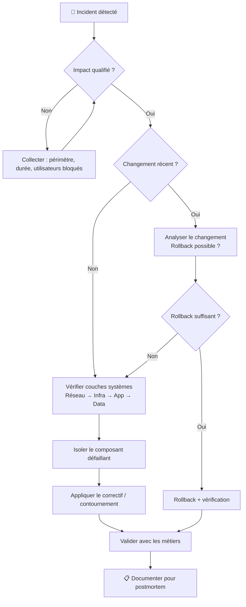

# Gestion de crise & incidents majeurs

## Objectifs pédagogiques

À l'issue de ce module, tu seras capable de :

1. **Distinguer** un incident standard d'un incident majeur et déclencher le bon niveau de réponse
2. **Structurer** une cellule de crise : rôles, communication, escalade
3. **Appliquer** une démarche de diagnostic sous pression sans perdre le fil
4. **Piloter** la communication de crise vers les parties prenantes (métier, direction, éditeurs)
5. **Rédiger** un postmortem exploitable qui empêche la récidive

---

## Mise en situation

Il est 8h47 un lundi matin. Tu arrives au bureau. La salle est inhabituelle : le responsable technique est debout, le téléphone à l'oreille. Trois tickets critiques sont ouverts depuis 22 minutes. L'ERP de l'entreprise — celui que 400 commerciaux utilisent pour passer des commandes — répond en timeout. Les ventes sont à l'arrêt.

Personne ne sait encore si c'est la base de données, un déploiement de vendredi soir, un problème réseau, ou autre chose. Et toi, tu es le technicien support en poste.

Ce module t'apprend à ne pas te noyer dans ce genre de situation. Pas à devenir omniscient — mais à savoir *quoi faire dans les dix premières minutes*, comment tenir la pression dans la durée, et comment ne pas commettre les erreurs classiques qui transforment un incident de deux heures en catastrophe de deux jours.

---

## Ce qu'est vraiment un incident majeur

Un incident majeur (parfois appelé P1, SEV1 ou incident critique selon les organisations) n'est pas simplement "un bug grave". C'est une situation où **l'impact métier dépasse la capacité de réponse normale du support**.

En pratique, trois signaux le caractérisent :

- **L'impact est transversal** : plusieurs utilisateurs, plusieurs équipes, ou un processus métier critique sont bloqués
- **Le temps compte** : chaque minute d'indisponibilité a un coût mesurable (chiffre d'affaires, pénalités contractuelles, image client)
- **Le diagnostic n'est pas trivial** : la cause n'est pas évidente, et plusieurs composants peuvent être impliqués

> 🧠 **Concept clé** — Un incident devient "majeur" moins par sa nature technique que par son **impact sur le métier**. Un timeout sur un service interne peu utilisé reste P3. Le même timeout sur le module de facturation en fin de mois devient P1. La sévérité est une notion de contexte, pas de technique.

La confusion fréquente est de traiter un incident majeur avec les mêmes réflexes qu'un ticket standard : ouvrir un ticket, investiguer seul, attendre. C'est exactement ce qu'il ne faut pas faire — et c'est ce qui transforme un incident de 45 minutes en crise de 4 heures.

---

## La première minute : ce que tu fais avant de comprendre

Sous pression, le cerveau a tendance à plonger immédiatement dans le diagnostic technique — ouvrir des logs, relancer des services, tenter des trucs. C'est une erreur. Avant de toucher quoi que ce soit, trois actions s'imposent.

**1. Qualifier l'impact réel**

Pas "le serveur est lent". Mais : combien d'utilisateurs sont bloqués ? Quels processus métier sont arrêtés ? Depuis combien de temps ? Y a-t-il un contournement possible ?

Cette qualification détermine le niveau de réponse. Si tu la sautes, tu risques soit de sur-réagir (mobiliser toute l'équipe pour un problème de cache local), soit de sous-réagir (traiter seul un incident qui mérite une cellule de crise).

**2. Ouvrir le pont de crise**

Dès qu'un incident majeur est confirmé, tu alertes. Pas dans deux heures, pas après avoir "vérifié quelque chose". Maintenant. Le canal peut être un Slack dédié, un bridge téléphonique, un groupe SMS d'astreinte — peu importe la forme, l'important est que les bonnes personnes soient dans la boucle.

**3. Nommer un pilote**

Quelqu'un doit tenir le fil. Pas forcément la personne la plus technique — mais celle qui va coordonner, communiquer, et éviter que tout le monde parte dans des directions différentes. Dans une petite structure, c'est souvent le lead technique ou le responsable support. Dans une grande, c'est un rôle formalisé : **Incident Commander** ou **War Room Lead**.

> ⚠️ **Erreur fréquente** — "Je vais juste regarder les logs avant d'alerter." Ce délai coûte souvent 20 à 30 minutes supplémentaires, parce que la communication a lieu trop tard et les ressources arrivent après que les premières mauvaises décisions ont été prises.

---

## Structurer la réponse : rôles et responsabilités

Une crise bien gérée ressemble à une opération chirurgicale : chaque personne a un rôle défini, et personne ne dépasse son périmètre. Une crise mal gérée ressemble à une cuisine amateur un soir de réveillon.

Les rôles clés à couvrir — une même personne peut en tenir plusieurs en petite équipe :

| Rôle | Responsabilité | Ce qu'il ne fait PAS |
|---|---|---|
| **Incident Commander** | Coordonne, prend les décisions finales, débloque les blocages | Ne fait pas le diagnostic technique lui-même |
| **Technicien diagnostic** | Investigue la cause racine, documente en temps réel | Ne communique pas directement avec les métiers |
| **Communicant** | Tient les parties prenantes informées (métier, direction) | Ne modifie rien sur les systèmes |
| **Scribe** | Note tout : actions tentées, résultats, chronologie | Ne propose pas de solutions |

Ce découplage est essentiel. Si le technicien le plus compétent est aussi celui qui répond aux mails de la direction, il perd 40% de son efficacité à gérer des sollicitations au lieu de diagnostiquer.

> 💡 **Astuce** — Dans les équipes réduites, le scribe peut être un simple document partagé (Google Doc, Confluence, même un pad). L'important est que tout le monde l'alimente en temps réel. Ce document devient la mémoire de la crise — et la base du postmortem.

---

## Diagnostiquer sous pression : la méthode

Le diagnostic en situation de crise obéit à des contraintes différentes du diagnostic normal. Tu n'as pas le luxe de tout explorer. Tu dois **converger vite vers la cause la plus probable**, sans fermer les yeux sur les alternatives.

### La règle des 5 questions

Avant de toucher quoi que ce soit sur un système en crise, réponds à ces cinq questions :

1. **Qu'est-ce qui a changé récemment ?** — Déploiement, mise à jour, changement de config, migration, même "petit" changement vendredi soir
2. **Quel est le périmètre exact de l'impact ?** — Tous les utilisateurs ? Un seul site ? Un seul module ?
3. **Depuis quand exactement ?** — Timestamp précis, pas "depuis ce matin"
4. **Est-ce que ça s'est déjà produit ?** — Un pattern connu change radicalement la stratégie
5. **Y a-t-il des alertes monitoring qui coïncident ?** — CPU, mémoire, connexions DB, erreurs 5xx

Ces cinq questions orientent le diagnostic sans t'enfermer dans une hypothèse. Elles t'empêchent aussi de passer 45 minutes sur la base de données quand le problème est un certificat TLS expiré.

### Le flux de diagnostic structuré



### L'approche couche par couche

Quand la cause n'est pas évidente, progresse de l'infrastructure vers l'applicatif — pas l'inverse. C'est contre-intuitif pour un technicien applicatif, mais c'est plus efficace : les problèmes réseau et infra se détectent vite et éliminent des heures de chasse aux bugs applicatifs.

**Couche 1 — Réseau/connectivité** : ping, traceroute, résolution DNS, accès aux ports. L'application est-elle seulement joignable ?

**Couche 2 — Infrastructure** : serveur en ligne ? Services démarrés ? Espace disque ? Charge CPU/mémoire anormale ?

**Couche 3 — Middleware/runtime** : JVM, Python, Node, IIS — le runtime répond-il ? Y a-t-il des erreurs dans ses propres logs ?

**Couche 4 — Application** : logs applicatifs, erreurs, exceptions, comportements anormaux

**Couche 5 — Données** : base de données accessible ? Requêtes lentes ? Locks ? Espace tablespace ?

> 🧠 **Concept clé** — Cette progression bottom-up évite le piège du "ça doit être le code" qui pousse à chercher des bugs applicatifs pendant des heures alors que le disque est plein à 100%.

---

## Lire les signaux d'un incident en cours

En situation de crise, les logs deviennent ta principale source de vérité. Mais lire des logs sous pression, c'est un exercice à part entière.

**Cherche d'abord les timestamps anormaux.** Une rupture dans la régularité des logs (silence soudain, flood d'erreurs à un instant précis) est souvent plus révélatrice que le contenu des messages eux-mêmes.

**Corrèle entre plusieurs sources.** Un timeout dans les logs applicatifs seul ne dit rien. Corrélé avec un pic de connexions dans les logs DB au même instant, ça commence à dessiner quelque chose.

**Méfie-toi des red herrings.** Les logs sont souvent bruités en situation de crise — des erreurs secondaires apparaissent en cascade à cause d'un problème primaire. Cherche le *premier* message d'erreur, pas le plus récent.

```bash
# Trouver la première occurrence d'une erreur dans un log
grep -n "ERROR\|FATAL\|Exception" /var/log/app/application.log | head -20

# Voir les logs en temps réel pendant l'investigation
tail -f /var/log/app/application.log | grep --line-buffered "ERROR"

# Sur Windows — Event Viewer en ligne de commande
Get-EventLog -LogName Application -EntryType Error -Newest 50 | Format-List TimeGenerated, Message
```

> 💡 **Astuce** — Si tu as accès à plusieurs serveurs, commence toujours par vérifier l'heure système. Des serveurs avec des horloges désynchronisées (même de quelques secondes) rendent la corrélation de logs quasiment impossible. `timedatectl status` sur Linux, `w32tm /query /status` sur Windows.

---

## La communication de crise : ce que tout le monde attend de toi

Techniquement, l'incident peut être en cours d'investigation. Mais les métiers, eux, ont besoin d'une information maintenant. Ce besoin est légitime : ils ont des clients au téléphone, des engagements à tenir, des décisions à prendre.

La règle d'or : **communiquer souvent, même quand tu n'as rien de nouveau**.

Un message "L'investigation est en cours, le problème est localisé sur le serveur de base de données, nous estimons une résolution dans 45 minutes" vaut infiniment mieux que le silence. Le silence génère de l'anxiété, des appels intempestifs, et pousse les managers à "venir voir" — ce qui perturbe le diagnostic.

### Structure d'un message de crise

- **Ce qu'on sait** : symptômes confirmés, périmètre, durée
- **Ce qu'on fait** : actions en cours, qui s'en occupe
- **Ce qu'on attend** : prochaine communication dans X minutes, estimation de résolution si disponible

Exemple concret :

> *"8h52 — L'ERP est inaccessible depuis 8h34 pour l'ensemble des utilisateurs. L'équipe technique a identifié un problème sur le serveur de base de données. Un correctif est en cours d'application. Prochaine communication à 9h15 ou dès résolution."*

Court. Factuel. Sans jargon. Sans promesse non tenue.

> ⚠️ **Erreur fréquente** — Donner une estimation de résolution trop précise ("résolu dans 10 minutes") sans base technique solide. Si tu te trompes, tu perds la confiance des métiers pour la suite. Mieux vaut donner une fourchette large et la tenir que promettre l'impossible.

---

## L'escalade : quand et comment

Escalader n'est pas un aveu de faiblesse. C'est une décision technique. Tu escalades quand :

- Tu as épuisé ton périmètre d'action sans identifier la cause
- La résolution nécessite des droits ou des accès que tu n'as pas
- L'impact dépasse un seuil qui requiert une validation hiérarchique
- Un tiers (éditeur, hébergeur, prestataire) est probablement impliqué

L'escalade doit être **préparée**. Quand tu contactes le niveau 3 ou l'éditeur applicatif, tu dois arriver avec :

1. La chronologie précise de l'incident
2. Les actions déjà tentées et leurs résultats
3. Les logs pertinents déjà extraits et formatés
4. Une hypothèse sur la cause, même partielle

Arriver en disant "ça marche pas, aide-moi" à un expert N3 ou à une hotline éditeur, c'est repartir avec une heure de questions basiques que tu aurais pu répondre seul.

> 💡 **Astuce** — Garde un template d'escalade prêt dans ton outil de ticketing : périmètre / chronologie / actions tentées / hypothèse / logs joints. Tu le remplis en 5 minutes et tu arrives préparé. Ça fait une différence réelle sur le temps de résolution.

---

## Restaurer, pas juste corriger

Quand le correctif est appliqué et que le service répond à nouveau, l'instinct naturel est de respirer et de passer à autre chose. C'est une erreur.

La **restauration** d'un incident majeur comporte trois étapes distinctes :

**Vérification technique** : les métriques sont-elles revenues à la normale ? CPU, temps de réponse, taux d'erreur, connexions DB — tous les indicateurs, pas seulement le symptôme présenté.

**Validation métier** : un utilisateur représentatif a-t-il confirmé que les fonctionnalités critiques fonctionnent ? La validation technique ne remplace pas la validation fonctionnelle.

**Surveillance post-incident** : les 2 à 4 heures suivant la résolution sont à haut risque de récidive ou d'effets secondaires. Un monitoring renforcé pendant cette fenêtre est indispensable.

Ce n'est qu'après ces trois étapes que l'incident peut être déclaré résolu — pas avant.

---

## Cas réel : incident ERP en prod — 2h34 d'indisponibilité

**Contexte** : ESN de 80 personnes, ERP de gestion commerciale utilisé par 6 équipes. Lundi 9h03, le module de facturation devient inaccessible. 3 clients en attente de devis urgents.

| Heure | Action | Résultat |
|-------|--------|----------|
| 09h03 | Qualification : 100% des users bloqués sur facturation, autres modules OK | Impact P1 confirmé |
| 09h05 | Alerte Slack #incident-prod, pilote nommé (lead dev) | War room ouverte |
| 09h08 | 5 questions : déploiement vendredi 17h → patch de migration SQL | Piste principale identifiée |
| 09h12 | Log DB : requête de migration bloquée en deadlock depuis 8h57 | Cause confirmée |
| 09h18 | Kill de la requête bloquante, rollback de la migration | Service restauré |
| 09h22 | Validation par 2 utilisateurs métier | Fonctionnel confirmé |
| 09h35 | Communication de clôture aux métiers | Incident clos |

**Leçon** : la migration avait été testée en preprod sur un jeu de données 10× plus petit. En prod, la table de 2M de lignes a créé un deadlock que le test n'avait pas détecté. Le postmortem a produit une règle concrète : toute migration sur une table > 500k lignes passe désormais par une fenêtre de maintenance dédiée hors heures ouvrées.

---

## Le postmortem : transformer la crise en connaissance

Un incident majeur sans postmortem, c'est une leçon qu'on paie et qu'on n'apprend pas. Le postmortem n'est pas un rapport d'accusation — c'est un exercice collectif d'apprentissage. Il doit avoir lieu dans les **48 à 72 heures** : passé ce délai, les mémoires s'effacent et le document perd de sa valeur.

Un postmortem efficace répond à cinq questions :

1. **Que s'est-il passé ?** — Chronologie factuelle, sans jugement
2. **Pourquoi est-ce arrivé ?** — Cause racine identifiée, pas juste le symptôme
3. **Pourquoi n'a-t-on pas détecté plus tôt ?** — Lacunes dans le monitoring ou les alertes
4. **Comment a-t-on limité l'impact ?** — Ce qui a bien fonctionné dans la réponse
5. **Quelles actions correctives ?** — Items concrets, assignés, avec une date

Sans assignation et sans délai, les actions postmortem ne se font pas. "Améliorer le monitoring" n'est pas une action. "Ajouter une alerte sur le taux de connexions DB > 80% d'ici vendredi, responsable : Thomas" — c'en est une.

> 🧠 **Concept clé** — La technique des **5 Pourquoi** remonte du symptôme à la cause organisationnelle. Exemple : service crashé → pool de connexions saturé → requête DB trop lente → index manquant → migration déployée sans revue → pas de processus de validation des migrations. La vraie cause racine est l'absence de processus, pas le crash. C'est ce qu'on peut réellement corriger pour éviter la récidive.

### Template de postmortem

```markdown
# Postmortem — [Nom de l'incident] — [Date]

## Résumé exécutif (3 lignes max)

## Timeline
| Heure | Événement |
|-------|-----------|

## Cause racine

## Impact
- Durée :
- Utilisateurs affectés :
- Coût estimé (si disponible) :

## Ce qui a bien fonctionné

## Ce qui aurait pu être mieux

## Actions correctives
| Action | Responsable | Date limite | Statut |
|--------|-------------|-------------|--------|
```

---

## Bonnes pratiques & pièges classiques

**Prépare avant la crise.** Les runbooks d'incident (procédures documentées pour les scénarios fréquents), les contacts d'escalade, les accès aux outils critiques — tout ça doit exister avant l'incident, pas être cherché pendant. Un runbook minimal pour "service inaccessible" :

```
1. Vérifier le statut des services : docker ps / systemctl status <SERVICE>
2. Logs des 30 dernières minutes : journalctl -u <SERVICE> --since "30 min ago"
3. Espace disque et charge : df -h && top -bn1 | head -20
4. Contact N3 : [nom] — [numéro] / Contact éditeur : [canal]
5. En cas de doute : rollback du dernier déploiement via [procédure]
```

**Ne modifie jamais un système en crise sans noter ce que tu fais.** Même un petit redémarrage de service. Le scribe doit tout avoir. Si l'incident rebondit, tu dois pouvoir reconstituer exactement ce qui a été fait et quand.

**Résiste à la tentation du quick fix non compris.** Redémarrer un service peut restaurer le service pendant quelques minutes et masquer un problème plus profond qui refera surface 2 heures plus tard, en plein pic d'utilisation.

**La fatigue est un facteur d'incident.** Sur des crises longues (4h+), alterne les équipes. Un technicien épuisé prend de mauvaises décisions. Planifie des relèves, même sur des incidents nocturnes.

> ⚠️ **Erreur fréquente** — Déclarer l'incident résolu dès que le service répond, sans vérification complète ni surveillance post-incident. Les rechutes post-"résolution" sont parmi les incidents les plus coûteux, parce que les équipes se sont dispersées et la réactivité est plus faible.

---

## Résumé

Un incident majeur n'est pas un ticket difficile — c'est un mode de fonctionnement différent qui nécessite coordination, communication et diagnostic structurés. Les dix premières minutes déterminent souvent la trajectoire complète : qualifier l'impact, alerter les bonnes personnes, nommer un pilote. Ensuite, le diagnostic suit une progression logique couche par couche, documentée en temps réel. La communication vers les métiers n'est pas optionnelle — elle est **partie** intégrante de la gestion de crise. Enfin, l'incident ne se termine pas quand le service redémarre : il se termine quand le postmortem a produit des actions correctives concrètes et assignées. C'est à ce prix qu'un incident majeur devient un investissement en résilience plutôt qu'un simple coût.

---

<!-- snippet
id: incident_crise_qualification
type: concept
tech: support-applicatif
level: advanced
importance: high
format: knowledge
tags: incident, crise, qualification, p1, sla
title: Qualifier un incident majeur avant toute action
content: Un incident devient P1/majeur quand l'impact dépasse la capacité de réponse normale : processus métier bloqué, impact transversal (plusieurs utilisateurs ou équipes), coût mesurable par minute. La sévérité dépend du contexte, pas de la complexité technique — timeout sur facturation fin de mois = P1, timeout sur outil interne peu utilisé = P3.
description: La sévérité est une notion de contexte métier, pas de technicité. Qualifier avant d'investiguer évite sur- et sous-réaction.
-->

<!-- snippet
id: incident_crise_premiereminute
type: tip
tech: support-applicatif
level: advanced
importance: high
format: knowledge
tags: incident, crise, réflexe, escalade, communication
title: Les 3 actions avant de toucher quoi que ce soit en crise
content: 1. Qualifier l'impact réel (combien d'utilisateurs, quels processus, depuis quand). 2. Ouvrir le pont de crise — alerter maintenant, pas après avoir vérifié. 3. Nommer un pilote. Ces 3 actions en moins de 5 min évitent 30 min de dispersion. Plonger dans les logs avant d'alerter est le piège le plus fréquent : coûte en moyenne 20-30 min supplémentaires.
description: Qualifier → alerter → nommer un pilote. Dans cet ordre, avant tout diagnostic.
-->

<!-- snippet
id: incident_crise_5questions
type: concept
tech: support-applicatif
level: advanced
importance: high
format: knowledge
tags: diagnostic, crise, investigation, logs, changement
title: Les 5 questions à poser avant tout diagnostic en crise
content: 1) Qu'est-ce qui a changé récemment (déploiement, config, migration) ? 2) Périmètre exact de l'impact ? 3) Timestamp précis du début ? 4) Déjà vu ? 5) Alertes monitoring qui coïncident ? Ces 5 questions cadrent le diagnostic en 3 min et évitent 45 min sur la mauvaise piste. La question sur le changement récent résout ~40% des incidents majeurs.
description: 5 questions à poser avant de toucher quoi que ce soit. Orientent sans enfermer dans une hypothèse.
-->

<!-- snippet
id: incident_crise_couchesbottomup
type: concept
tech: support-applicatif
level: advanced
importance: high
format: knowledge
tags: diagnostic, layers, infrastructure, applicatif, methodologie
title: Diagnostic bottom-up : réseau → infra → app → data
content: Progresser de l'infra vers l'applicatif : Réseau (ping, DNS, ports) → Infra (services, CPU/RAM/disque) → Middleware/runtime → Application (logs, exceptions) → Données (DB, requêtes lentes, locks). Un disque plein à 100% se détecte en 30 sec et évite 2h de chasse aux bugs applicatifs.
description: Toujours partir de l'infrastructure vers l'applicatif. Évite le piège "ça doit être le code".
-->

<!-- snippet
id: incident_logs_premiereerr
type: command
tech: linux
level: intermediate
importance: high
format: knowledge
tags: logs, diagnostic, grep, erreur, investigation
title: Trouver la première erreur dans un fichier de log
command: grep -n "ERROR\|FATAL\|Exception" <FICHIER_LOG> | head -20
example: grep -n "ERROR\|FATAL\|Exception" /var/log/app/application.log | head -20
description: En crise, cherche le PREMIER message d'erreur, pas le plus récent. Les erreurs en cascade masquent la cause racine.
-->

<!-- snippet
id: incident_logs_tempsreel
type: command
tech: linux
level: intermediate
importance: medium
format: knowledge
tags: logs, tail, monitoring, investigation, temps-reel
title: Suivre un log en temps réel avec filtre sur les erreurs
command: tail -f <FICHIER_LOG> | grep --line-buffered "ERROR"
example: tail -f /var/log/app/application.log | grep --line-buffered "ERROR"
description: --line-buffered force l'affichage ligne par ligne. Sans cette option, grep peut bufferiser et retarder l'affichage en temps réel.
-->

<!-- snippet
id: incident_crise_communication
type: tip
tech: support-applicatif
level: advanced
importance: high
format: knowledge
tags: communication, crise, metier, message, war-room
title: Structure d'un message de crise en 3 éléments
content: 1) Ce qu'on SAIT (symptômes, périmètre, durée). 2) Ce qu'on FAIT (action en cours, qui). 3) Ce qu'on ATTEND (prochaine comm dans X min, ETA si dispo). Exemple : "9h05 — ERP inaccessible depuis 8h57. Problème DB identifié. Correctif en cours. Prochaine update à 9h30." Répéter toutes les 15-20 min même sans nouveauté.
description: Le silence génère des appels qui perturbent le diagnostic. Un message court toutes les 15 min vaut mieux que rien.
-->

<!-- snippet
id: incident_crise_estimationresolution
type: warning
tech: support-applicatif
level: advanced
importance: high
format: knowledge
tags: communication, crise, engagement, sla, confiance
title: Ne jamais promettre un délai de résolution sans base technique
content: Piège : donner une ETA précise ("résolu dans 10 min") pour rassurer les métiers. Conséquence : si la promesse n'est pas tenue, la confiance s'effondre et les sollicitations doublent. Correction : fourchette large ("entre 30 et 60 min") ou "prochaine info dans 20 min, ETA non estimable pour l'instant".
description: Fourchette large tenue > promesse précise ratée. Une ETA non tenue coûte plus en crédibilité que son absence.
-->

<!-- snippet
id: incident_crise_escalade
type: tip
tech: support-applicatif
level: advanced
importance: medium
format: knowledge
tags: escalade, n3, editeur, hotline, preparation
title: Préparer une escalade en 5 points avant de contacter N3 ou éditeur
content: Arriver avec : 1) Chronologie précise (timestamps). 2) Actions tentées + résultats. 3) Logs pertinents extraits. 4) Hypothèse sur la cause. 5) Périmètre exact. Arriver sans préparation = 1h de questions basiques. Solution : template d'escalade prêt dans l'outil de ticketing, à remplir en 5 min.
description: Un N3 ou éditeur contacté sans préparation perd 30-60 min en questions de qualification que tu aurais pu anticiper.
-->

<!-- snippet
id: incident_crise_rollback
type: warning
tech: support-applicatif
level: advanced
importance: high
format: knowledge
tags: rollback, quickfix, crise, recidive, correction
title: Ne jamais appliquer un quick fix sans comprendre la cause
content: Piège : redémarrer un service pour restaurer rapidement sans identifier pourquoi il a crashé. Conséquence : récidive 1-2h plus tard en pic d'utilisation, équipe dispersée et moins réactive. Correction : appliquer le contournement pour restaurer ET investiguer la cause racine en parallèle pour un correctif durable.
description: Un redémarrage masque le problème. Il doit s'accompagner d'une investigation parallèle, jamais être la réponse finale.
-->

<!-- snippet
id: incident_postmortem_5pourquoi
type: concept
tech: support-applicatif
level: advanced
importance: high
format: knowledge
tags: postmortem, rca, 5-pourquoi, cause-racine, amelioration
title: Technique des 5 Pourquoi pour trouver la vraie cause racine
content: Poser "pourquoi" 5 fois face à la cause identifiée. Exemple : service crashé → pool de connexions saturé → requête trop lente → index manquant → migration sans revue de code → pas de processus de validation des migrations. La vraie cause racine est l'absence de processus, pas le crash. C'est ce qui peut réellement être corrigé pour empêcher la récidive.
description: Les 5 Pourquoi remontent du symptôme à la cause organisationnelle. Sans eux, le correctif cible le symptôme et l'incident se répète.
-->
