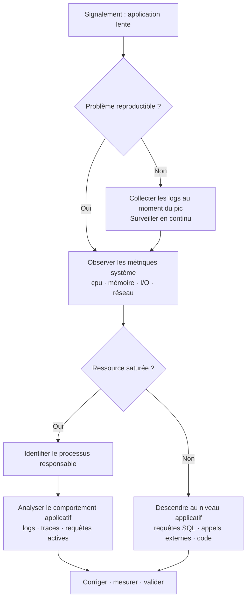

# Performance & optimisation : diagnostic et résolution

## Objectifs pédagogiques

À l'issue de ce module, tu seras capable de :

- **Identifier** l'origine d'un problème de performance (CPU, mémoire, I/O, réseau, base de données) à partir de symptômes observés en production
- **Lire et interpréter** les métriques système et applicatives pour localiser le goulot d'étranglement
- **Distinguer** un problème de charge ponctuelle d'une dégradation structurelle
- **Appliquer** une méthode de diagnostic reproductible, sans se perdre dans les hypothèses
- **Proposer des corrections** adaptées au contexte — à court terme (urgence) et à moyen terme (durabilité)

---

## Mise en situation

Il est 10h22. Un utilisateur ouvre un ticket : "L'application est lente depuis ce matin." Dix minutes plus tard, cinq autres tickets arrivent avec le même message. Le responsable métier appelle.

Tu as accès au serveur d'application, à la base de données, aux logs. Tu n'as pas de graphe historique propre, pas de baseline établie, et personne ne sait exactement ce qui a changé depuis hier.

C'est la situation réelle dans 80 % des environnements de support intermédiaires. Pas de Datadog nickel configuré, pas d'alerting calibré. Juste vous, un terminal et quelques outils.

Le piège classique ? Commencer par redémarrer le service "pour voir". Parfois ça marche — mais ça masque le problème, et il reviendra. La bonne approche, c'est de poser un diagnostic avant toute action : comprendre *pourquoi* avant de toucher à quoi que ce soit.

Ce module te donne la méthode.

---

## Contexte et problématique

### Pourquoi les problèmes de performance sont difficiles à diagnostiquer

Un bug fonctionnel est binaire : ça marche ou ça ne marche pas. Une dégradation de performance, c'est différent — elle peut être partielle, intermittente, contextuelle. Elle touche parfois un seul utilisateur, parfois toute la base. Elle peut venir du code, du serveur, du réseau, de la base de données, ou d'une interaction entre plusieurs couches.

C'est ce qu'on appelle un **problème multi-couches** : chaque couche de l'architecture peut être le coupable, et souvent, le symptôme visible (l'appli est lente) est très éloigné de la cause réelle (une requête SQL non indexée sur une table qui a grossi en silence depuis 6 mois).

### Les quatre grandes familles de goulots d'étranglement

| Famille | Ce qui ralentit | Exemples typiques |
|---|---|---|
| **CPU** | Calcul intensif ou monopolisation | Boucle infinie, traitement lourd non optimisé |
| **Mémoire** | Saturation RAM, swap actif | Fuite mémoire applicative, heap Java pleine |
| **I/O disque** | Lecture/écriture trop lentes | Logs verbeux, fichiers temporaires non nettoyés |
| **Base de données** | Requêtes lentes, locks, connexions saturées | Absence d'index, N+1 queries, pool épuisé |
| **Réseau** | Latence, perte de paquets, débit saturé | DNS lent, appel API externe qui timeout |

🧠 **Concept clé** — Un goulot d'étranglement ne ralentit pas seulement sa propre couche. Un CPU à 100 % va bloquer les threads I/O en attente. Une base de données lente va faire s'accumuler les connexions en attente, ce qui va épuiser le pool, ce qui va faire planter l'application avec une erreur "connection pool timeout" — alors que la vraie cause est une requête SQL mal écrite.

---

## Méthode de diagnostic — approche systématique

Avant de montrer les outils, parlons de la méthode. Sans elle, tu vas passer d'un outil à l'autre sans logique, produire des informations sans savoir quoi en faire, et perdre du temps.

La méthode se résume en trois étapes : **Observer → Localiser → Corriger**.



Cette logique évite un piège fréquent : **sauter directement à la couche applicative** alors que le serveur est en train de swapper. Ou inversement, passer des heures à optimiser des requêtes SQL quand le vrai problème est un disque saturé par des logs.

---

## Observation système : les commandes de première ligne

### Sur Linux

Quand tu arrives sur un serveur suspect, les trois premières commandes à lancer donnent déjà 60 % du diagnostic.

```bash
# Vue d'ensemble instantanée : charge CPU, mémoire, processus actifs
top

# Version enrichie avec tri et couleurs (si disponible)
htop

# Charge moyenne sur 1/5/15 minutes + processus actifs/bloqués
uptime
```

La charge (`load average`) est ton premier indicateur. Une règle simple : si la charge dépasse le nombre de cœurs CPU disponibles, le système est en surconsommation. Un load de 4.0 sur une machine à 2 cœurs, c'est le signal que des processus font la queue pour accéder au CPU.

```bash
# Nombre de cœurs disponibles
nproc

# Détail CPU par cœur (utile pour détecter un seul cœur saturé)
mpstat -P ALL 1 5

# Statistiques I/O par disque — column 'await' = temps d'attente moyen en ms
iostat -x 1 5

# Activité réseau par interface
sar -n DEV 1 5
```

⚠️ **Erreur fréquente** — Lire `top` une seule fois et conclure. Les valeurs dans `top` sont instantanées. Un pic CPU de 2 secondes peut passer inaperçu. Préférez `top -d 2` (rafraîchissement toutes les 2 secondes) ou `vmstat 1 10` pour observer une tendance sur 10 secondes.

```bash
# Vue synthétique : CPU, mémoire, swap, I/O, système, processus
vmstat 1 10

# Consommation mémoire : total · utilisé · libre · buffers/cache
free -h
```

Sur la sortie de `free`, ne paniquez pas si la mémoire "libre" est proche de zéro — Linux utilise agressivement le cache disque. Ce qui compte, c'est la colonne `available`. Et si `swap used` augmente progressivement au fil du temps : fuite mémoire probable.

### Sur Windows

```powershell
# Vue des processus triée par CPU
Get-Process | Sort-Object CPU -Descending | Select-Object -First 10

# Utilisation mémoire par processus (MB)
Get-Process | Sort-Object WorkingSet -Descending |
  Select-Object Name, @{N='RAM_MB';E={[math]::Round($_.WorkingSet/1MB,1)}} |
  Select-Object -First 10

# Compteurs de performance : CPU global
Get-Counter '\Processor(_Total)\% Processor Time' -SampleInterval 2 -MaxSamples 5
```

💡 **Astuce** — Sur Windows Server, le `Gestionnaire des tâches` en ligne de commande manque de précision pour le diagnostic avancé. Préférez `perfmon` (Performance Monitor) ou `Get-Counter` pour exporter des métriques sur une durée, ou installez [Process Hacker](https://processhacker.sourceforge.io/) si l'environnement le permet.

---

## Identifier le processus responsable

Une fois qu'une ressource est identifiée comme saturée, l'étape suivante est de savoir *quel processus* consomme.

```bash
# Top 5 processus par CPU
ps aux --sort=-%cpu | head -6

# Top 5 processus par mémoire
ps aux --sort=-%mem | head -6

# Voir les fichiers ouverts par un processus (utile pour I/O)
lsof -p <PID>

# I/O par processus en temps réel (nécessite iotop installé)
iotop -o -P

# Threads actifs d'un processus (utile pour diagnostiquer les blocages)
ps -eLf | grep <PID>
```

💡 **Astuce** — Si un processus Java ou Python consomme 100 % CPU sans raison apparente, la première hypothèse est une boucle ou un thread bloqué en GC (garbage collection). Pour Java, `jstack <PID>` produit un thread dump instantané qui révèle exactement où chaque thread est bloqué.

```bash
# Thread dump Java (à répéter 3 fois à 5s d'intervalle pour confirmer un blocage)
jstack <PID>

# Pour Python : signal SIGUSR1 si l'application le gère, sinon py-spy
py-spy dump --pid <PID>
```

---

## Diagnostic base de données

La base de données est la cause numéro un des lenteurs applicatives en production. Et souvent, elle travaille correctement — c'est la façon dont l'application l'interroge qui pose problème.

### Requêtes lentes sur MySQL / MariaDB

```sql
-- Activer le slow query log (si pas encore fait)
SET GLOBAL slow_query_log = 'ON';
SET GLOBAL long_query_time = 1;  -- loguer les requêtes > 1 seconde
SET GLOBAL slow_query_log_file = '/var/log/mysql/slow.log';

-- Voir les requêtes en cours d'exécution
SHOW FULL PROCESSLIST;

-- Requêtes actives depuis plus de 5 secondes
SELECT * FROM information_schema.processlist
WHERE time > 5 AND command != 'Sleep'
ORDER BY time DESC;

-- Analyser une requête : voir si elle utilise un index
EXPLAIN SELECT * FROM commandes WHERE client_id = 42;
```

La sortie d'`EXPLAIN` est ton outil principal. Ce qu'il faut surveiller :

| Colonne | Signal d'alerte |
|---|---|
| `type` | `ALL` = full table scan, à éviter sur grandes tables |
| `rows` | Valeur très élevée = beaucoup de lignes lues inutilement |
| `key` | `NULL` = aucun index utilisé |
| `Extra` | `Using filesort` ou `Using temporary` = requête coûteuse |

```sql
-- Voir les index existants sur une table
SHOW INDEX FROM <TABLE>;

-- Créer un index sur une colonne fréquemment filtrée
CREATE INDEX idx_client ON commandes(client_id);
```

⚠️ **Erreur fréquente** — Créer des index en masse "pour optimiser". Un index accélère les lectures, mais ralentit les écritures et consomme de l'espace. Sur une table avec beaucoup d'insertions/updates, un index mal placé peut aggraver les performances globales.

### Sur PostgreSQL

```sql
-- Requêtes actives et leur durée
SELECT pid, now() - pg_stat_activity.query_start AS duree,
       query, state
FROM pg_stat_activity
WHERE state != 'idle' AND query_start IS NOT NULL
ORDER BY duree DESC;

-- Statistiques sur les tables : séquentiels vs index scans
SELECT relname, seq_scan, idx_scan,
       n_live_tup AS lignes_actives
FROM pg_stat_user_tables
ORDER BY seq_scan DESC;
```

Un ratio `seq_scan / idx_scan` élevé sur une grande table est le signal direct qu'il manque un index.

---

## Analyse des logs applicatifs

Les logs sont souvent sous-exploités dans le diagnostic de performance. Pourtant, ils contiennent exactement ce dont tu as besoin : timestamps, durées, erreurs, et contexte.

```bash
# Chercher les entrées "slow" ou "timeout" dans les logs applicatifs
grep -iE "slow|timeout|took [0-9]{4,}ms|duration" /var/log/app/application.log

# Compter les occurrences d'erreurs par type
grep "ERROR" /var/log/app/application.log | awk '{print $5}' | sort | uniq -c | sort -rn

# Voir les 100 dernières lignes en temps réel
tail -f -n 100 /var/log/app/application.log

# Identifier les pics : compter les lignes par minute
grep "2024-01-15 10:" /var/log/app/application.log | \
  awk '{print $2}' | cut -d: -f1,2 | sort | uniq -c
```

💡 **Astuce** — Si les logs applicatifs incluent des durées d'exécution (fréquent dans les frameworks web : Rails, Django, Spring Boot), tu peux extraire statistiquement les percentiles de temps de réponse sans aucun outil de monitoring :

```bash
# Extraire les durées de réponse et calculer min/max/moyenne
grep "Completed 200" /var/log/app/production.log | \
  grep -oP '\d+ms' | tr -d 'ms' | \
  awk 'BEGIN{min=999999}{sum+=$1; count++; if($1<min)min=$1; if($1>max)max=$1}
       END{print "min="min"ms avg="sum/count"ms max="max"ms count="count}'
```

---

## Diagnostic / Erreurs fréquentes

Voici les cas les plus rencontrés en support applicatif, avec la méthode pour les identifier rapidement.

### Symptôme 1 : L'application est lente uniquement aux heures de pointe

**Cause probable** : saturation des ressources sous charge — le système est dimensionné pour la charge moyenne, pas pour les pics.

**Diagnostic** :
```bash
# Corréler les logs applicatifs avec les métriques système aux heures concernées
# Vérifier le nombre de connexions simultanées
ss -s                          # Résumé des connexions TCP
ss -tnp | grep :8080 | wc -l   # Connexions actives sur le port applicatif
```

**Correction à court terme** : augmenter le pool de threads/connexions dans la configuration applicative.  
**Correction durable** : identifier la ressource saturée et dimensionner ou optimiser le code.

---

### Symptôme 2 : La mémoire augmente progressivement et ne redescend jamais

**Cause probable** : fuite mémoire — un objet est créé mais jamais libéré.

**Diagnostic** :
```bash
# Observer l'évolution mémoire du processus sur 10 minutes
watch -n 30 "ps -o pid,rss,vsz,comm -p <PID>"

# Pour Java : analyser le heap
jmap -histo <PID> | head -20   # Top 20 objets en mémoire
```

**Correction** : identifier la classe ou le module qui accumule des objets. En attendant un fix applicatif, un redémarrage planifié (cron) peut être une rustine temporaire acceptable — à condition de le documenter comme tel.

⚠️ **Piège** — Ne pas confondre une fuite mémoire avec un cache applicatif qui grossit normalement. Un cache a généralement une limite configurée (`max_size`, `TTL`). Une fuite, non.

---

### Symptôme 3 : Des timeouts aléatoires sur la base de données

**Cause probable** : pool de connexions épuisé, ou lock sur une transaction longue.

**Diagnostic** :
```sql
-- MySQL : voir les locks actifs
SELECT * FROM information_schema.innodb_locks;
SELECT * FROM information_schema.innodb_lock_waits;

-- PostgreSQL : voir les blocages
SELECT blocked_locks.pid AS pid_bloque,
       blocking_locks.pid AS pid_bloquant,
       blocked_activity.query AS requete_bloquee
FROM pg_catalog.pg_locks blocked_locks
JOIN pg_catalog.pg_locks blocking_locks
  ON blocking_locks.locktype = blocked_locks.locktype
  AND blocking_locks.granted AND NOT blocked_locks.granted
JOIN pg_catalog.pg_stat_activity blocked_activity
  ON blocked_activity.pid = blocked_locks.pid;
```

**Correction** : identifier et terminer la transaction bloquante si nécessaire (`KILL <PID>` sur MySQL), puis analyser pourquoi cette transaction est longue.

---

### Symptôme 4 : Tout semble normal côté serveur, mais l'appli reste lente

**Cause probable** : goulot au niveau des appels externes (API tierce, service interne, DNS).

**Diagnostic** :
```bash
# Tester la latence vers un service externe
curl -w "\n%{time_namelookup} DNS\n%{time_connect} TCP connect\n%{time_starttransfer} TTFB\n%{time_total} total\n" \
  -o /dev/null -s https://api.service-externe.com/endpoint

# Résolution DNS
time nslookup api.service-externe.com

# Tracer le chemin réseau
traceroute api.service-externe.com
```

💡 **Astuce** — Si le `time_namelookup` de curl est élevé (> 200ms), le problème est DNS. Sur Linux, vérifiez `/etc/resolv.conf` et testez avec `dig @8.8.8.8 domain.com` pour comparer avec un resolver externe.

---

## Cas réel en entreprise

**Contexte** : application de gestion commerciale, environ 80 utilisateurs simultanés. L'équipe support reçoit des plaintes de lenteur sur la fonctionnalité "recherche client" depuis une mise en production réalisée 3 semaines plus tôt. Avant, la recherche prenait moins d'une seconde. Maintenant, entre 8 et 15 secondes.

**Étape 1 — Observation système**  
CPU et RAM normaux. `iostat` montre un `await` de 45ms sur le disque, légèrement élevé mais pas critique. Rien d'évident.

**Étape 2 — Descente au niveau base de données**  
`SHOW FULL PROCESSLIST` révèle régulièrement des requêtes en état "Sending data" avec un temps > 10 secondes. Toutes concernent la même table `clients`.

**Étape 3 — Analyse de la requête**  
```sql
EXPLAIN SELECT * FROM clients
WHERE LOWER(nom) LIKE '%dupont%'
OR LOWER(email) LIKE '%dupont%';
```
Résultat : `type = ALL`, `rows = 287 000`, `key = NULL`. Full table scan sur 287 000 lignes, sans index, avec une fonction `LOWER()` qui empêche l'utilisation d'un éventuel index.

**Étape 4 — Compréhension du contexte**  
La mise en production de 3 semaines avait ajouté une nouvelle fonctionnalité de recherche "plus souple". Le développeur avait enveloppé les colonnes dans `LOWER()` pour ignorer la casse — ce qui est logique côté fonctionnel, mais catastrophique côté SQL : une fonction sur une colonne désactive l'utilisation de l'index classique.

**Correction appliquée** :
```sql
-- Solution 1 : index fonctionnel (MySQL 5.7+, PostgreSQL)
CREATE INDEX idx_clients_nom_lower ON clients((LOWER(nom)));
CREATE INDEX idx_clients_email_lower ON clients((LOWER(email)));

-- Solution 2 : passer la colonne en COLLATION insensible à la casse
ALTER TABLE clients MODIFY nom VARCHAR(200)
  COLLATE utf8mb4_general_ci;
```

**Résultat** : temps de réponse de la recherche redescendu à 0.3 secondes. Aucun redémarrage de service requis. Le correctif a été déployé en preprod, validé, puis mis en production en 20 minutes.

---

## Bonnes pratiques

**1. Établir une baseline avant d'avoir un problème**  
Un problème de performance sans référence, c'est impossible à qualifier. Notez les métriques normales (charge CPU, temps de réponse moyen, mémoire utilisée) en période calme. Quand tout va bien, c'est le moment de le faire.

**2. Ne jamais redémarrer avant d'avoir collecté les preuves**  
Un redémarrage résout parfois le symptôme, mais détruit les preuves. Si tu dois redémarrer en urgence, fais au moins `ps aux`, `free -h`, `vmstat 1 5` et copiez les logs *avant*.

**3. Travailler par élimination, pas par intuition**  
Couche système → couche base de données → couche applicative → couche réseau. Dans cet ordre. Chaque couche éliminée te rapproche de la vraie cause.

**4. Mesurer l'effet de chaque correction**  
"J'ai ajouté un index, ça devrait aller mieux" n'est pas un diagnostic bouclé. Mesurez avant et après : temps de requête, charge système, temps de réponse utilisateur. Sans mesure, tu ne sais pas si ta correction a fonctionné.

**5. Documenter le slow query log en permanence**  
Sur MySQL/MariaDB, `long_query_time = 2` avec rotation des logs est une configuration minimale en production. Elle coûte quasiment rien en performance et te donne un historique précieux.

**6. Différencier urgence et cause racine**  
En production dégradée, l'objectif immédiat est de rétablir le service (redémarrage, kill d'un processus bloquant, ajout temporaire de RAM). La cause racine se traite après, à froid, avec les preuves collectées.

**7. Ne pas optimiser ce qui n'est pas mesuré**  
L'optimisation prématurée est le premier déchets de temps en support. Optimisez ce que les métriques désignent comme problème, pas ce qui te semble "probablement lent".

**8. Indexer avec discernement**  
Un index manquant sur une colonne très filtrée peut multiplier le temps de requête par 100. Un index superflu sur une table à forte écriture peut dégrader l'ensemble des INSERT/UPDATE. Analysez `EXPLAIN` avant de créer.

---

## Résumé

Diagnostiquer un problème de performance, c'est avant tout une question de méthode : observer les métriques système pour localiser la ressource saturée, descendre dans les couches pour identifier le responsable, puis corriger en mesurant l'effet. Les outils sont simples — `top`, `vmstat`, `iostat`, `EXPLAIN` — mais c'est la logique d'investigation qui fait la différence. La base de données reste la première cause de lenteur applicative en production, souvent à cause d'index manquants ou de requêtes mal écrites sur des tables qui ont grossi en silence. Les fuites mémoire, les pools de connexions saturés et les appels réseau lents constituent les autres familles classiques. Dans tous les cas : collecter avant d'agir, mesurer avant de conclure, documenter pour ne pas recommencer.

---

<!-- snippet
id: perf_load_average_concept
type: concept
tech: linux
level: intermediate
importance: high
format: knowledge
tags: performance, cpu, load, systeme, diagnostic
title: Load average — lecture et seuil d'alerte
content: Le load average (affiché par uptime/top) mesure le nombre moyen de processus en attente d'accès au CPU sur 1, 5 et 15 minutes. Un load de 1.0 signifie qu'un cœur est occupé à 100%. Seuil critique : load > nombre de cœurs (nproc). Exemple : load 6.2 sur une machine 4 cœurs = 2 processus font la queue en permanence = dégradation active.
description: Si load > nproc, le CPU est en surconsommation. Comparer toujours avec le nombre de cœurs disponibles, pas avec une valeur absolue.
-->

<!-- snippet
id: perf_vmstat_lecture
type: command
tech: linux
level: intermediate
importance: high
format: knowledge
tags: performance, cpu, memoire, io, diagnostic
title: vmstat — observer les tendances système sur 10 secondes
command: vmstat 1 10
description: Affiche CPU, mémoire, swap, I/O et system calls toutes les secondes pendant 10s. Colonne 'wa' (I/O wait) > 20% = disque saturé. Colonne 'si/so' > 0 = swap actif = mémoire insuffisante.
-->

<!-- snippet
id: perf_iostat_await
type: command
tech: linux
level: intermediate
importance: medium
format: knowledge
tags: performance, io, disque, diagnostic
title: iostat — détecter la saturation disque avec await
command: iostat -x 1 5
description: La colonne 'await' indique le temps d'attente moyen des requêtes I/O en ms. Au-delà de 20ms en production, investiguer. Au-delà de 100ms, le disque est un goulot d'étranglement certain.
-->

<!-- snippet
id: perf_mysql_slow_query_enable
type: command
tech: mysql
level: intermediate
importance: high
format: knowledge
tags: performance, mysql, sql, diagnostic, logs
title: Activer le slow query log MySQL à chaud
command: SET GLOBAL slow_query_log = 'ON'; SET GLOBAL long_query_time = <SECONDES>; SET GLOBAL slow_query_log_file = '<CHEMIN>';
example: SET GLOBAL slow_query_log = 'ON'; SET GLOBAL long_query_time = 1; SET GLOBAL slow_query_log_file = '/var/log/mysql/slow.log';
description: Active l'enregistrement de toutes les requêtes dépassant le seuil défini, sans redémarrage MySQL. Réinitialiser à 2s en production pour éviter un log trop verbeux.
-->

<!-- snippet
id: perf_mysql_explain_type
type: concept
tech: mysql
level: intermediate
importance: high
format: knowledge
tags: performance, mysql, sql, index, optimisation
title: EXPLAIN — lire le type de scan pour détecter un index manquant
content: Dans la sortie d'EXPLAIN, la colonne 'type' indique comment MySQL lit la table. 'ALL' = full table scan : MySQL lit toutes les lignes, catastrophique sur > 10 000 lignes. 'ref' ou 'eq_ref' = utilisation d'un index : acceptable. 'index' = scan de l'index entier, souvent insuffisant. Si type=ALL et rows > 10 000, créer un index sur la colonne du WHERE.
description: type=ALL dans EXPLAIN sur une grande table = index manquant. Priorité 1 pour l'optimisation SQL.
-->

<!-- snippet
id: perf_mysql_fonction_index
type: warning
tech: mysql
level: advanced
importance: high
format: knowledge
tags: performance, mysql, sql, index, optimisation
title: Fonction SQL sur colonne = index inutilisé
content: Piège : entourer une colonne d'une fonction (LOWER(nom), YEAR(date_creation), TRIM(email)) empêche MySQL d'utiliser l'index classique sur cette colonne. Conséquence : full table scan même si un index existe. Correction : créer un index fonctionnel CREATE INDEX idx ON table((LOWER(col))), ou modifier la collation pour ignorer la casse sans fonction.
description: WHERE LOWER(col) LIKE '%x%' désactive l'index sur col. Utiliser un index fonctionnel ou une collation ci_ai à la place.
-->

<!-- snippet
id: perf_mysql_processlist
type: command
tech: mysql
level: intermediate
importance: medium
format: knowledge
tags: performance, mysql, diagnostic, connexions, locks
title: Voir les requêtes actives et leur durée en MySQL
command: SELECT * FROM information_schema.processlist WHERE time > <SECONDES> AND command != 'Sleep' ORDER BY time DESC;
example: SELECT * FROM information_schema.processlist WHERE time > 5 AND command != 'Sleep' ORDER BY time DESC;
description: Liste les requêtes en cours depuis plus de N secondes. Permet d'identifier immédiatement les transactions longues ou bloquées sans accès au code applicatif.
-->

<!-- snippet
id: perf_memory_leak_watch
type: command
tech: linux
level: intermediate
importance: medium
format: knowledge
tags: performance, memoire, diagnostic, fuite, processus
title: Surveiller l'évolution mémoire d'un processus dans le temps
command: watch -n 30 "ps -o pid,rss,vsz,comm -p <PID>"
example: watch -n 30 "ps -o pid,rss,vsz,comm -p 4821"
description: Affiche la mémoire résidente (RSS) du processus toutes les 30 secondes. Si RSS augmente sans jamais redescendre sur plusieurs minutes, fuite mémoire probable.
-->

<!-- snippet
id: perf_curl_timing
type: command
tech: linux
level: intermediate
importance: medium
format: knowledge
tags: performance, reseau, api, latence, diagnostic
title: Mesurer les temps DNS, TCP et TTFB d'un endpoint HTTP
command: curl -w "\n%{time_namelookup}s DNS\n%{time_connect}s TCP\n%{time_starttransfer}s TTFB\n%{time_total}s total\n" -o /dev/null -s <URL>
example: curl -w "\n%{time_namelookup}s DNS\n%{time_connect}s TCP\n%{time_starttransfer}s TTFB\n%{time_total}s total\n" -o /dev/null -s https://api.exemple.com/health
description: Décompose le temps de réponse HTTP en phases. time_namelookup > 0.2s = problème DNS. time_connect élevé = latence réseau. TTFB élevé = lenteur serveur ou applicative.
-->
