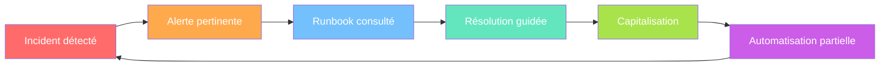
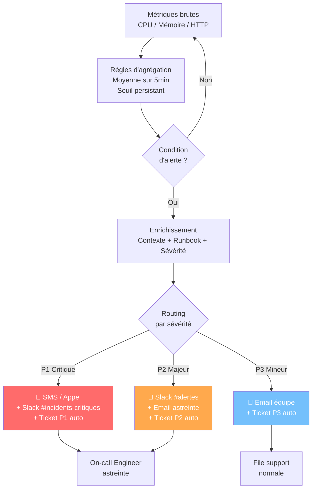

# Industrialisation & support avancé

## Objectifs pédagogiques

À la fin de ce module, tu seras capable de :

1. **Construire des runbooks opérationnels** réutilisables et maintenables pour les incidents récurrents
2. **Automatiser les vérifications de santé** d'une application avec des scripts Bash et Python exploitables en production
3. **Mettre en place une chaîne d'alerting** cohérente : de la métrique brute à la notification contextualisée
4. **Distinguer une alerte utile d'un bruit** et concevoir un système qui réveille les bonnes personnes pour les bonnes raisons
5. **Mesurer l'efficacité du support** avec des indicateurs réels (MTTR, taux de récurrence, volume par composant) pour piloter des améliorations

---

## Mise en situation

Imagine une équipe support de 4 personnes qui gère une suite applicative métier — un ERP sur serveur Windows, une API REST sur Linux, une base PostgreSQL, et une interface web. L'équipe reçoit en moyenne 40 tickets par semaine. Rien d'alarmant en apparence.

Sauf que :

- 60 % des tickets concernent **les mêmes 5 problèmes** — redémarrage de service, connexion DB perdue, certificat expiré, espace disque plein, job batch en échec
- Chaque fois, quelqu'un passe 20 à 45 minutes à "rediagnostiquer" ce qu'un collègue a déjà résolu la semaine précédente
- Les alertes monitoring arrivent trop tard, trop vagues, ou trop souvent — résultat : elles sont ignorées
- Quand un incident critique frappe à 2h du matin, la personne d'astreinte repart de zéro

Ce n'est pas un problème de compétence. C'est un problème d'industrialisation : l'équipe fait du bon travail, mais de façon artisanale. Chaque résolution repart de rien plutôt que de capitaliser sur ce qui a déjà été fait.

Ce module répond exactement à ça. L'objectif n'est pas d'ajouter de la complexité — c'est de transformer le travail répétitif en processus fiables, et de donner à chaque incident la bonne réponse en un minimum de temps.

---

## Contexte et problématique

### Pourquoi "industrialiser" le support ?

Le terme peut faire peur — il évoque des chaînes de montage, de la rigidité, de la bureaucratie. En réalité, industrialiser le support, c'est simplement répondre à une question fondamentale : **est-ce que le prochain technicien qui rencontrera ce problème devra tout réinventer ?**

Si la réponse est oui, tu as un problème de capitalisation.

Le support artisanal fonctionne bien tant que :
- l'équipe est petite et stable (tout le monde connaît les astuces)
- le volume d'incidents est faible
- les mêmes personnes gèrent les mêmes applications pendant des années

Aucune de ces conditions n'est garantie dans une entreprise réelle. Les personnes partent, les volumes augmentent, les applications évoluent. Sans industrialisation, chaque départ d'un technicien expérimenté est une catastrophe silencieuse.

### Le cycle vertueux qu'on veut construire



Chaque incident bien géré doit nourrir le suivant. C'est ça, le cœur du support avancé.

---

## Runbooks : transformer l'expérience en procédure

### Ce qu'un bon runbook n'est pas

Un runbook n'est pas une documentation exhaustive. Ce n'est pas non plus un wiki de 50 pages qu'on lit quand on a le temps. C'est un **guide d'action pour quelqu'un qui est sous pression**, qui a peut-être la prod en feu, et qui a besoin de savoir exactement quoi faire dans les 3 prochaines minutes.

La différence entre un runbook et une documentation classique, c'est le point de vue : la documentation explique comment quelque chose fonctionne. Un runbook explique quoi faire quand quelque chose ne fonctionne plus.

### Structure d'un runbook opérationnel

Voici la structure minimale qui fonctionne en production :

```markdown
# [NOM DU RUNBOOK] — Titre explicite de l'incident couvert

## Identification rapide
- Symptômes observables : ce que voit l'utilisateur / le monitoring
- Composants concernés : liste des services / serveurs / bases impliqués
- Criticité habituelle : P1 / P2 / P3

## Pré-requis
- Accès nécessaires : SSH sur <SERVEUR>, droits DBA, accès GLPI...
- Outils à avoir : nom des CLI, accès VPN, etc.

## Diagnostic (étapes ordonnées)
1. Vérifier [quoi] avec [commande/outil]
   → Si résultat X : aller en section Résolution A
   → Si résultat Y : aller en section Résolution B
2. ...

## Résolution A — [Cause identifiée]
1. Commande ou action 1
2. Commande ou action 2
3. Vérification que c'est réglé

## Résolution B — [Autre cause]
...

## Escalade
- Si non résolu après [N minutes] : contacter [NOM/RÔLE] via [CANAL]
- Informations à transmettre : logs, résultat des diagnostics, timeline

## Post-incident
- Ce qu'il faut noter dans le ticket
- Actions de suivi éventuelles (ticket problème, suivi capacité...)

## Dernière mise à jour
[Date] — [Auteur] — [Raison de la mise à jour]
```

### Exemple concret : runbook "service API en échec"

Imaginons une API REST qui tourne sur un serveur Linux. Le monitoring remonte une erreur 502 sur le load balancer.

```markdown
# RUNBOOK — API Métier : erreur 502 / service inaccessible

## Identification rapide
- Symptômes : utilisateurs voient "Service indisponible", monitoring HTTP retourne 502/503
- Composants : api-server-01, api-server-02, nginx (reverse proxy), PostgreSQL
- Criticité habituelle : P1 si les deux serveurs sont KO / P2 si un seul

## Pré-requis
- SSH sur api-server-01 et api-server-02 (clé dans KeePass équipe)
- Accès SSH sur nginx-proxy-01

## Diagnostic

1. Vérifier le statut du service applicatif
   ssh api-server-01
   systemctl status api-metier
   → Si "inactive (dead)" ou "failed" → Résolution A
   → Si "active (running)" → continuer

2. Vérifier si le port répond localement
   curl -o /dev/null -s -w "%{http_code}" http://localhost:8080/health
   → Si retourne 200 : problème côté nginx → Résolution B
   → Si retourne autre chose : voir les logs applicatifs → Résolution C

## Résolution A — Service arrêté
1. Consulter les logs avant de redémarrer
   journalctl -u api-metier --since "30 minutes ago" | tail -50
2. Si erreur DB ("connection refused", "too many connections") → Résolution C
3. Si erreur mémoire ou crash applicatif → noter le message exact dans le ticket
4. Redémarrer le service
   systemctl restart api-metier
5. Vérifier le redémarrage dans les 30 secondes
   systemctl status api-metier
   curl http://localhost:8080/health
```

💡 **Astuce** — Le runbook doit être testé lors d'un incident réel. La première version sera imparfaite. Mets systématiquement à jour après chaque utilisation : ajoute les cas que tu n'avais pas prévus, supprime les étapes inutiles. Un runbook qui date de 18 mois sans modification est soit parfait (rare), soit obsolète (très probable).

⚠️ **Erreur fréquente** — Créer le runbook "pour plus tard" en situation calme, puis ne jamais le relire en situation d'incident. Un runbook non utilisé se dégrade vite. Intègre-le dans tes processus : quand tu ouvres un ticket qui correspond à un runbook existant, ouvre-le en premier.

---

## Scripts de vérification de santé

### La logique des health checks

Un health check, c'est une question binaire posée à un système : **"Est-ce que tu fonctionnes correctement en ce moment ?"**. La réponse doit être rapide, fiable, et actionnable.

Il existe trois niveaux de health checks, qu'il est utile de distinguer :

| Niveau | Ce qu'il vérifie | Exemple |
|--------|-----------------|---------|
| **Liveness** | Le processus est-il vivant ? | `systemctl is-active monservice` |
| **Readiness** | Le service est-il prêt à traiter des requêtes ? | HTTP 200 sur `/health` |
| **Deep check** | Les dépendances fonctionnent-elles ? | Connexion DB réussie + temps de réponse < 500ms |

La plupart des équipes s'arrêtent au niveau 1. C'est insuffisant : un service peut être "actif" selon systemd tout en étant incapable de traiter quoi que ce soit (base de données inaccessible, espace disque plein, cache corrompu).

### Script Bash : vérification complète d'un serveur applicatif

```bash
#!/bin/bash
# health_check.sh — Vérification de santé applicative
# Usage : ./health_check.sh [--alert-email admin@entreprise.fr]

set -euo pipefail

# === Configuration ===
APP_NAME="api-metier"
APP_PORT=8080
HEALTH_ENDPOINT="http://localhost:${APP_PORT}/health"
DB_HOST="db-prod-01"
DB_PORT=5432
DB_NAME="appdb"
DB_USER="appuser"
DISK_THRESHOLD=85          # % d'utilisation disque avant alerte
MEM_THRESHOLD=90           # % d'utilisation RAM avant alerte
RESPONSE_TIME_MAX=2        # secondes max pour le health endpoint
LOG_DIR="/var/log/healthcheck"
ALERT_EMAIL="${1:-}"

# === Initialisation ===
mkdir -p "${LOG_DIR}"
TIMESTAMP=$(date '+%Y-%m-%d %H:%M:%S')
REPORT="${LOG_DIR}/report_$(date '+%Y%m%d_%H%M%S').log"
ERRORS=0

log() {
    local level="$1"
    local message="$2"
    echo "[${TIMESTAMP}] [${level}] ${message}" | tee -a "${REPORT}"
}

check_fail() {
    log "ERROR" "$1"
    ERRORS=$((ERRORS + 1))
}

check_ok() {
    log "OK" "$1"
}

# === 1. Vérification du service système ===
log "INFO" "=== Vérification du service ${APP_NAME} ==="
if systemctl is-active --quiet "${APP_NAME}"; then
    check_ok "Service ${APP_NAME} actif"
else
    check_fail "Service ${APP_NAME} INACTIF — statut : $(systemctl is-active ${APP_NAME})"
fi

# === 2. Vérification de l'endpoint HTTP ===
log "INFO" "=== Test HTTP : ${HEALTH_ENDPOINT} ==="
HTTP_RESPONSE=$(curl -o /dev/null -s -w "%{http_code}|%{time_total}" \
    --connect-timeout 5 --max-time 10 "${HEALTH_ENDPOINT}" 2>/dev/null || echo "000|99")

HTTP_CODE=$(echo "${HTTP_RESPONSE}" | cut -d'|' -f1)
HTTP_TIME=$(echo "${HTTP_RESPONSE}" | cut -d'|' -f2)

if [[ "${HTTP_CODE}" == "200" ]]; then
    if (( $(echo "${HTTP_TIME} > ${RESPONSE_TIME_MAX}" | bc -l) )); then
        check_fail "Endpoint répond 200 mais lent : ${HTTP_TIME}s (seuil : ${RESPONSE_TIME_MAX}s)"
    else
        check_ok "Endpoint HTTP 200 en ${HTTP_TIME}s"
    fi
else
    check_fail "Endpoint retourne HTTP ${HTTP_CODE} (attendu : 200)"
fi

# === 3. Vérification de la connexion base de données ===
log "INFO" "=== Test connectivité PostgreSQL ==="
if pg_isready -h "${DB_HOST}" -p "${DB_PORT}" -d "${DB_NAME}" -U "${DB_USER}" -q; then
    check_ok "PostgreSQL accessible sur ${DB_HOST}:${DB_PORT}"
else
    check_fail "PostgreSQL inaccessible sur ${DB_HOST}:${DB_PORT}"
fi

# === 4. Vérification espace disque ===
log "INFO" "=== Vérification espace disque ==="
while IFS= read -r line; do
    USAGE=$(echo "${line}" | awk '{print $5}' | tr -d '%')
    MOUNT=$(echo "${line}" | awk '{print $6}')
    if [[ "${USAGE}" -ge "${DISK_THRESHOLD}" ]]; then
        check_fail "Disque ${MOUNT} à ${USAGE}% (seuil : ${DISK_THRESHOLD}%)"
    else
        check_ok "Disque ${MOUNT} à ${USAGE}%"
    fi
done < <(df -h | grep -vE '^Filesystem|tmpfs|udev|cdrom')

# === 5. Vérification mémoire ===
log "INFO" "=== Vérification mémoire ==="
MEM_USED=$(free | awk '/^Mem:/ {printf "%.0f", $3/$2 * 100}')
if [[ "${MEM_USED}" -ge "${MEM_THRESHOLD}" ]]; then
    check_fail "RAM utilisée à ${MEM_USED}% (seuil : ${MEM_THRESHOLD}%)"
else
    check_ok "RAM utilisée à ${MEM_USED}%"
fi

# === Bilan ===
log "INFO" "=== BILAN : ${ERRORS} erreur(s) détectée(s) ==="

if [[ "${ERRORS}" -gt 0 && -n "${ALERT_EMAIL}" ]]; then
    mail -s "[ALERTE] Health check ${APP_NAME} — ${ERRORS} erreur(s)" \
        "${ALERT_EMAIL}" < "${REPORT}"
    log "INFO" "Rapport envoyé à ${ALERT_EMAIL}"
fi

exit "${ERRORS}"
```

🧠 **Concept clé** — `set -euo pipefail` en début de script Bash est une bonne pratique de production : `-e` arrête le script sur la première erreur, `-u` fait échouer si une variable non définie est utilisée, et `-o pipefail` propage les erreurs dans les pipes. Sans ça, un script peut continuer à s'exécuter après une étape ratée et donner des résultats faux.

### Script Python : analyse de logs et détection d'anomalies

Le Bash est parfait pour les vérifications ponctuelles. Python entre en jeu quand tu as besoin d'analyser des volumes de logs, de corréler des événements, ou d'implémenter une logique plus complexe.

```python
#!/usr/bin/env python3
"""
log_analyzer.py — Analyse de logs applicatifs et détection d'anomalies
Usage : python3 log_analyzer.py --logfile /var/log/api-metier/app.log --minutes 60
"""

import argparse
import re
import sys
from collections import Counter, defaultdict
from datetime import datetime, timedelta
from pathlib import Path

# Pattern de log type : [2024-01-15 14:32:01] [ERROR] message...
LOG_PATTERN = re.compile(
    r'\[(?P<timestamp>\d{4}-\d{2}-\d{2} \d{2}:\d{2}:\d{2})\] '
    r'\[(?P<level>DEBUG|INFO|WARN|ERROR|CRITICAL)\] '
    r'(?P<message>.+)'
)

# Patterns d'erreurs connues avec leur catégorie
ERROR_PATTERNS = {
    'connexion_db': re.compile(r'connection refused|too many connections|FATAL.*database', re.I),
    'memoire': re.compile(r'OutOfMemoryError|MemoryError|Cannot allocate memory', re.I),
    'timeout': re.compile(r'timeout|timed out|connection reset', re.I),
    'authentification': re.compile(r'401|403|authentication failed|unauthorized', re.I),
    'erreur_applicative': re.compile(r'NullPointerException|AttributeError|KeyError|ValueError'),
}

def parse_logs(logfile: Path, since_minutes: int) -> list[dict]:
    """Parse le fichier de log et retourne les entrées dans la fenêtre temporelle."""
    cutoff = datetime.now() - timedelta(minutes=since_minutes)
    entries = []

    with logfile.open('r', encoding='utf-8', errors='replace') as f:
        for line_num, line in enumerate(f, 1):
            match = LOG_PATTERN.match(line.strip())
            if not match:
                continue
            try:
                ts = datetime.strptime(match.group('timestamp'), '%Y-%m-%d %H:%M:%S')
            except ValueError:
                continue
            if ts >= cutoff:
                entries.append({
                    'timestamp': ts,
                    'level': match.group('level'),
                    'message': match.group('message'),
                    'line': line_num
                })

    return entries

def analyze(entries: list[dict]) -> dict:
    """Produit un rapport d'analyse à partir des entrées parsées."""
    level_counts = Counter(e['level'] for e in entries)
    errors = [e for e in entries if e['level'] in ('ERROR', 'CRITICAL')]

    # Catégorisation des erreurs
    error_categories = defaultdict(list)
    for entry in errors:
        categorized = False
        for category, pattern in ERROR_PATTERNS.items():
            if pattern.search(entry['message']):
                error_categories[category].append(entry)
                categorized = True
                break
        if not categorized:
            error_categories['autres'].append(entry)

    # Détection de storm d'erreurs : > 10 erreurs en moins de 5 minutes
    error_storm = False
    if len(errors) >= 10:
        for i in range(len(errors) - 9):
            window = errors[i:i+10]
            delta = (window[-1]['timestamp'] - window[0]['timestamp']).seconds
            if delta <= 300:
                error_storm = True
                break

    return {
        'total_entries': len(entries),
        'level_counts': dict(level_counts),
        'error_count': len(errors),
        'error_categories': {k: len(v) for k, v in error_categories.items()},
        'error_storm': error_storm,
        'top_errors': [e['message'][:120] for e in errors[-5:]],
    }

def print_report(report: dict, since_minutes: int):
    """Affiche le rapport dans la console."""
    print(f"\n{'='*60}")
    print(f"ANALYSE DE LOGS — {since_minutes} dernières minutes")
    print(f"{'='*60}")
    print(f"Entrées analysées : {report['total_entries']}")
    print(f"\nDistribution par niveau :")
    for level, count in sorted(report['level_counts'].items()):
        bar = '█' * min(count, 40)
        print(f"  {level:<10} {count:>5}  {bar}")

    print(f"\nErreurs détectées : {report['error_count']}")
    if report['error_categories']:
        print("  Catégories :")
        for cat, count in sorted(report['error_categories'].items(), key=lambda x: -x[1]):
            print(f"    {cat:<25} {count}")

    if report['error_storm']:
        print("\n⚠️  STORM D'ERREURS DÉTECTÉ — plus de 10 erreurs en moins de 5 minutes")

    if report['top_errors']:
        print(f"\nDernières erreurs :")
        for msg in report['top_errors']:
            print(f"  → {msg}")

    # Code de sortie basé sur la criticité
    if report['error_storm'] or report['level_counts'].get('CRITICAL', 0) > 0:
        print("\n❌ STATUT : CRITIQUE")
        return 2
    elif report['error_count'] > 20:
        print("\n⚠️  STATUT : DÉGRADÉ")
        return 1
    else:
        print("\n✅ STATUT : NORMAL")
        return 0

def main():
    parser = argparse.ArgumentParser(description='Analyse de logs applicatifs')
    parser.add_argument('--logfile', required=True, help='Chemin vers le fichier de log')
    parser.add_argument('--minutes', type=int, default=60, help='Fenêtre d\'analyse en minutes')
    args = parser.parse_args()

    logfile = Path(args.logfile)
    if not logfile.exists():
        print(f"Erreur : fichier introuvable : {logfile}", file=sys.stderr)
        sys.exit(3)

    entries = parse_logs(logfile, args.minutes)
    report = analyze(entries)
    exit_code = print_report(report, args.minutes)
    sys.exit(exit_code)

if __name__ == '__main__':
    main()
```

Ce script illustre une logique importante : **les codes de sortie sont le langage des scripts d'automatisation**. Code 0 = OK, 1 = avertissement, 2 = critique, 3 = erreur d'exécution. Tout orchestrateur (cron, Nagios, Prometheus, CI/CD) peut brancher des actions dessus sans parser le texte.

---

## Chaîne d'alerting : du bruit au signal

### Le problème de l'alerte mal conçue

Une alerte qui se déclenche trop souvent devient invisible. Les équipes support finissent par ignorer les emails de monitoring — pas par négligence, mais par survie. C'est ce qu'on appelle l'**alert fatigue**, et c'est l'un des problèmes les plus sous-estimés dans les équipes support.

La solution n'est pas d'envoyer moins d'alertes. C'est d'envoyer des alertes meilleures.

Une bonne alerte répond à quatre questions :
1. **Quoi** — Quel composant, quel symptôme exact
2. **Depuis quand** — Durée du problème (un pic de 10 secondes n'est pas une alerte)
3. **Impact** — Qui est affecté ? Combien d'utilisateurs ? Quelle fonctionnalité ?
4. **Quoi faire** — Lien direct vers le runbook correspondant

### Architecture d'une chaîne d'alerting



### Règles d'alerting : exemples concrets

La plupart des outils de monitoring (Nagios, Zabbix, Prometheus, Datadog, Grafana) permettent de définir des règles. L'important n'est pas l'outil — c'est la logique. Voici des patterns qui fonctionnent :

**Pattern 1 : Seuil avec persistance (évite les faux positifs)**
```yaml
# Exemple format Prometheus / Alertmanager
alert: DiskSpaceCritique
expr: (1 - (node_filesystem_avail_bytes / node_filesystem_size_bytes)) * 100 > 85
for: 10m    # L'alerte ne se déclenche que si la condition dure 10 minutes
labels:
  severity: warning
  runbook: "https://wiki.interne/runbooks/disk-space"
annotations:
  summary: "Espace disque critique sur {{ $labels.instance }}"
  description: "Partition {{ $labels.mountpoint }} à {{ $value | printf \"%.1f\" }}% depuis 10 minutes"
```

**Pattern 2 : Taux d'erreur HTTP (plus pertinent que le nombre brut)**
```yaml
alert: TauxErreurHTTPEleve
expr: |
  sum(rate(http_requests_total{status=~"5.."}[5m]))
  /
  sum(rate(http_requests_total[5m])) * 100 > 5
for: 5m
labels:
  severity: critical
annotations:
  summary: "Taux d'erreur HTTP > 5% depuis 5 minutes"
  description: "Taux actuel : {{ $value | printf \"%.2f\" }}%"
```

💡 **Astuce** — Préfère toujours les ratios aux valeurs absolues pour les alertes. "50 erreurs par minute" n'a pas le même sens sur une API qui traite 100 req/min (50% d'erreur, catastrophe) et une qui traite 50 000 req/min (0.1%, probablement normal).

⚠️ **Erreur fréquente** — Alerter sur une métrique sans fenêtre temporelle (`for: 0m` ou absence de `for`). Un spike de CPU à 100% pendant 2 secondes est normal. Si ton alerte se déclenche dessus, tu vas recevoir des centaines de notifications par jour, et les ignorer toutes — y compris quand ça devient vraiment critique.

### Configuration d'alertmanager : routage et déduplication

```yaml
# alertmanager.yml — configuration de routage
global:
  smtp_smarthost: 'smtp.entreprise.fr:587'
  smtp_from: 'alerting@entreprise.fr'
  resolve_timeout: 5m

route:
  receiver: 'default'
  group_by: ['alertname', 'instance']
  group_wait: 30s        # Attendre 30s pour regrouper les alertes liées
  group_interval: 5m     # Délai entre deux notifications du même groupe
  repeat_interval: 4h    # Re-notifier si l'alerte persiste (max 1 fois toutes les 4h)

  routes:
    - match:
        severity: critical
      receiver: 'astreinte-pagerduty'
      continue: false

    - match:
        severity: warning
      receiver: 'slack-alertes'
      continue: true     # Continue vers le receiver suivant (email)

receivers:
  - name: 'astreinte-pagerduty'
    pagerduty_configs:
      - service_key: '<PAGERDUTY_KEY>'
        description: '{{ .GroupLabels.alertname }} — {{ .CommonAnnotations.summary }}'

  - name: 'slack-alertes'
    slack_configs:
      - api_url: '<SLACK_WEBHOOK_URL>'
        channel: '#alertes-prod'
        title: '⚠️ {{ .GroupLabels.alertname }}'
        text: |
          *Résumé :* {{ .CommonAnnotations.summary }}
          *Détail :* {{ .CommonAnnotations.description }}
          *Runbook :* {{ .CommonAnnotations.runbook }}
        send_resolved: true

  - name: 'default'
    email_configs:
      - to: 'support@entreprise.fr'
        subject: '[{{ .Status | toUpper }}] {{ .GroupLabels.alertname }}'
```

🧠 **Concept clé** — Le paramètre `group_wait` dans Alertmanager est fondamental pour éviter les storms de notifications. Quand 10 instances tombent en même temps (reboot d'hyperviseur, réseau rompu), sans regroupement tu reçois 10 alertes séparées en 10 secondes. Avec `group_by` et `group_wait`, tu reçois un seul message résumant les 10 problèmes — avec le contexte, le runbook, et la sévérité. Une décision en 30 secondes au lieu de 5 minutes à trier des emails.

---

## Cas réel : industrialisation d'une équipe support en 6 mois

**Contexte** : équipe support de 5 personnes dans une PME industrielle. Elles gèrent un ERP de gestion des stocks (4 serveurs Linux, 1 PostgreSQL, ~120 utilisateurs). Volume : 45 tickets/semaine. MTTR moyen : 3h40. Taux de récurrence : 34% (un tiers des incidents reviennent sans qu'on en comprenne la cause).

**Problème** : chaque incident est traité comme s'il était nouveau. Pas de runbooks, pas de scripts de diagnostic, des alertes Nagios qui envoient 200 emails par semaine et sont toutes ignorées.

**Ce qui a été fait, dans l'ordre :**

| Semaine | Action | Résultat immédiat |
|---------|--------|-------------------|
| S1-S2 | Audit des 15 incidents les plus fréquents → 3 runbooks rédigés (disque plein, service ERP arrêté, job batch en échec) | 0 ticket sur ces 3 types rediagnostiqué depuis |
| S3-S4 | Script `health_check.sh` planifié en cron toutes les 5 min, avec alerting email conditionnel (code sortie > 0) | Détection proactive avant remontée utilisateur dans 40% des cas |
| S5-S6 | Nettoyage des règles Nagios : suppression des alertes CPU < 5 min, ajout du `for: 10m` sur les seuils disque | Volume d'alertes email : 200/semaine → 12/semaine |
| S7-S8 | Dashboard Grafana basique : MTTR par priorité, top 10 composants par volume, taux de récurrence mensuel | Premier comité de pilotage support avec données chiffrées |
| S9-S12 | Formation de l'équipe aux runbooks : obligation de consulter avant d'agir | MTTR moyen : 3h40 → 1h55 |

**6 mois après** :
- MTTR : **3h40 → 1h15** (−66%)
- Taux de récurrence : **34% → 11%**
- Volume d'alertes ignorées : **200/semaine → 9/semaine** (toutes actionnables)
- Tickets hors heures ouvrées traités sans escalade senior : **12% → 58%**

**Leçon** : l'industrialisation ne demande pas de refondre le système. Les 3 runbooks des semaines 1-2 ont eu plus d'impact sur le MTTR que tous les outils qui ont suivi. La capitalisation de l'expérience est le levier n°1 — le reste est de l'amplification.

---

## KPIs du support : mesurer pour améliorer

### Pourquoi mesurer ?

Sans indicateurs, tu gères à vue. Tu sais qu'il y a "beaucoup de tickets" et que "certains problèmes reviennent", mais tu ne peux pas prioriser, ni justifier des investissements (automatisation, refonte d'une fonctionnalité problématique), ni mesurer si tes efforts d'industrialisation portent leurs fruits.

Les indicateurs clés du support applicatif sont au nombre de quatre :

| Indicateur | Formule | Ce qu'il mesure | Cible typique |
|-----------|---------|-----------------|--------------|
| **MTTR** | Durée totale résolution / Nb incidents | Vitesse de résolution | < 4h pour P2, < 1h pour P1 |
| **Taux de récurrence** | Incidents récurrents / Total incidents | Efficacité des corrections | < 15% |
| **Taux de résolution N1** | Tickets résolus sans escalade / Total | Autonomie du support | > 70% |
| **Volume par composant** | Nb tickets par module/service | Points de fragilité | Décroissant dans le temps |

### Dashboard de suivi : exemple SQL sur base de tickets

La plupart des outils de ticketing (GLPI, Jira, ServiceNow) exposent une base SQL accessible en lecture. Au lieu d'attendre un rapport mensuel, tu peux extraire ces KPIs directement à la demande — ou les brancher sur un dashboard Grafana via une datasource SQL.

```sql
-- MTTR moyen par priorité (derniers 30 jours)
SELECT
    priority,
    COUNT(*) AS nb_incidents,
    AVG(EXTRACT(EPOCH FROM (closed_at - opened_at)) / 3600) AS mttr_heures,
    PERCENTILE_CONT(0.9) WITHIN GROUP (
        ORDER BY EXTRACT(EPOCH FROM (closed_at - opened_at)) / 3600
    ) AS mttr_p90_heures
FROM tickets
WHERE
    closed_at IS NOT NULL
    AND opened_at >= NOW() - INTERVAL '30 days'
    AND ticket_type = 'incident'
GROUP BY priority
ORDER BY priority;

-- Top 10 composants problématiques
SELECT
    component,
    COUNT(*) AS nb_tickets,
    COUNT(*) * 100.0 / SUM(COUNT(*)) OVER () AS pct_total,
    AVG(EXTRACT(EPOCH FROM (closed_at - opened_at)) / 3600) AS mttr_heures
FROM tickets
WHERE opened_at >= NOW() - INTERVAL '90 days'
GROUP BY component
ORDER BY nb_tickets DESC
LIMIT 10;

-- Taux de récurrence : tickets avec même titre/composant en < 30 jours
SELECT
    t1.component,
    t1.title,
    COUNT(*) AS recurrences,
    MIN(t1.opened_at) AS premier_ticket,
    MAX(t1.opened_at) AS dernier_ticket
FROM tickets t1
JOIN tickets t2 ON (
    t1.component = t2.component
    AND t1.id != t2.id
    AND ABS(EXTRACT(EPOCH FROM (t1.opened_at - t2.opened_at))) < 2592000  -- 30 jours
)
GROUP BY t1.component, t1.title
HAVING COUNT(*) > 1
ORDER BY recurrences DESC
LIMIT 20;
```

💡 **Astuce** — Le MTTR seul est trompeur. Un MTTR excellent sur des incidents P3 peut masquer un MTTR désastreux sur des P1. Segmente toujours par priorité. Et surveille le P90 (90e percentile), pas seulement la moyenne : il révèle les cas extrêmes que la moyenne gomme.

---

## Standardisation des diagnostics

L'industrialisation n'est pas que technique. Elle passe aussi par la **standardisation des comportements** : deux techniciens face au même incident doivent suivre le même processus, pas celui que chacun a "toujours fait".

### La checklist de premier diagnostic

Pour tout incident entrant, avant de toucher quoi que ce soit :

```markdown
## Checklist premier contact (< 5 minutes)

### 1. Comprendre le symptôme
- [ ] Quel est le comportement observé exactement ? (message d'erreur, page blanche, lenteur...)
- [ ] Depuis quand ? (heure précise, pas "ce matin")
- [ ] Combien d'utilisateurs affectés ? (1 seul, groupe, tous)
- [ ] Impact fonctionnel : quelle fonctionnalité est bloquée ?

### 2. Reproduire (si possible)
- [ ] Peut-on reproduire sur un autre compte / poste / navigateur ?
- [ ] Y a-t-il eu une action déclenchante ? (après connexion, après import, après déploiement)
- [ ] Le problème est-il constant ou intermittent ?

### 3. Vérifier l'environnement
- [ ] Le problème est-il présent en preprod ?
- [ ] Y a-t-il eu un déploiement récent ? (< 24h)
- [ ] Y a-t-il d'autres tickets similaires ouverts ?
- [ ] Les logs applicatifs montrent-ils quelque chose dans la fenêtre temporelle concernée ?

### 4. Classer avant d'agir
- [ ] Définir la priorité (P1 / P2 / P3) selon l'impact
- [ ] Identifier si un runbook existe pour ce type d'incident
- [ ] Si P1 : prévenir le responsable immédiatement, ne pas attendre d'avoir la solution
```

⚠️ **Erreur fréquente** — Passer directement à la résolution sans diagnostiquer. C'est tentant quand on pense "reconnaître" un problème. Mais un symptôme familier peut avoir une cause différente. Un technicien qui redémarre le service sans lire les logs rate l'information qui aurait permis de prévenir la prochaine occurrence.

---

## Résumé

L'industrialisation du support, c'est convertir l'expérience individuelle en processus collectifs. Un runbook bien écrit permet à un junior de gérer un incident que seul le senior savait traiter. Un script de health check détecte à 3h du matin ce qu'un humain manquerait. Une alerte bien configurée réveille la bonne personne avec le bon contexte.

Les quatre piliers à retenir :

1. **Runbooks** — guide d'action, pas documentation. Structure fixe, mise à jour après chaque utilisation.
2. **Health checks** — trois niveaux (liveness, readiness, deep). Le niveau 1 ne suffit pas.
3. **Alerting** — ratios > valeurs absolues, fenêtre temporelle obligatoire, lien runbook dans l'alerte.
4. **KPIs** — MTTR par priorité, taux de récurrence, volume par composant. Mesurer pour prioriser.

Le signe qu'une équipe a atteint le bon niveau d'industrialisation : quand quelqu'un part en vacances, le niveau de service ne baisse pas.

---

<!-- SNIPPETS DE RÉVISION -->

<!-- snippet
id: indus_bash_set_pipefail
type: tip
tech: bash
level: intermediate
importance: high
tags: bash,scripting,robustesse,production
title: set -euo pipefail en début de script Bash
content: Ajoute `set -euo pipefail` en première ligne de tout script Bash de production. `-e` stoppe sur erreur, `-u` échoue sur variable non définie, `-o pipefail` propage les erreurs dans les pipes. Sans ça, un script peut continuer après une étape ratée et produire des résultats silencieusement faux.
description: Triple protection Bash indispensable pour les scripts de production — stoppe sur erreur, variable non définie, et erreur dans pipe.
-->

<!-- snippet
id: indus_bash_exit_codes
type: concept
tech: bash
level: intermediate
importance: high
tags: bash,scripting,monitoring,automatisation
title: Codes de sortie comme interface d'automatisation
content: Convention standard pour les scripts de monitoring/support : code 0 = OK, 1 = avertissement, 2 = critique, 3 = erreur d'exécution (fichier manquant, accès refusé). Tout orchestrateur — cron, Nagios, Prometheus, CI/CD — peut brancher des actions sur ces codes sans parser le texte de sortie. C'est le contrat entre ton script et le système qui l'invoque.
description: Les codes de sortie 0/1/2/3 sont le contrat entre un script de monitoring et son orchestrateur — ne jamais tout retourner 0.
-->

<!-- snippet
id: indus_health_check_levels
type: concept
tech: support
level: intermediate
importance: high
tags: healthcheck,monitoring,observabilite,service
title: Trois niveaux de health check
content: Liveness (le processus existe-t-il ?), Readiness (peut-il traiter des requêtes ?), Deep check (ses dépendances fonctionnent-elles ?). S'arrêter au niveau Liveness est insuffisant : un service peut être "actif" selon systemd tout en étant incapable de traiter quoi que ce soit si la base de données est inaccessible ou le disque plein.
description: Liveness seul ne suffit pas en production — un service "actif" peut être totalement non fonctionnel si ses dépendances sont KO.
-->

<!-- snippet
id: indus_alerting_ratio_vs_absolu
type: tip
tech: prometheus
level: intermediate
importance: high
tags: alerting,prometheus,monitoring,alertmanager
title: Alerter sur des ratios, pas des valeurs absolues
content: "50 erreurs/min" n'a pas de sens sans contexte. Sur 100 req/min c'est 50% d'erreur (catastrophe), sur 50 000 req/min c'est 0.1% (normal). Utilise des ratios : `sum(rate(http_requests_total{status=~"5.."}[5m])) / sum(rate(http_requests_total[5m])) * 100 > 5` pour alerter à partir de 5% d'erreurs HTTP, quelle que soit la charge.
description: Les alertes sur valeurs absolues donnent des faux positifs en charge faible et des faux négatifs en forte charge — toujours utiliser des ratios.
-->

<!-- snippet
id: indus_alerting_for_clause
type: warning
tech: prometheus
level: intermediate
importance: high
tags: alerting,prometheus,faux-positif,alertmanager
title: Clause `for` obligatoire dans les règles Prometheus
content: Sans `for:`, une alerte se déclenche sur n'importe quel spike instantané — un CPU à 100% pendant 2 secondes génère une notification. Avec `for: 5m`, l'alerte ne se déclenche que si la condition persiste 5 minutes. Résultat sans `for` : alert fatigue, les alertes sont ignorées y compris les vraies urgences. Correction : ajouter `for: 5m` (CPU/mémoire) ou `for: 2m` (HTTP errors) selon la volatilité de la métrique.
description: `for: 0m` ou absence de `for` dans Prometheus déclenche des alertes sur des spikes instantanés → alert fatigue garantie.
-->

<!-- snippet
id: indus_alertmanager_group_wait
type: concept
tech: alertmanager
level: advanced
importance: medium
tags: alertmanager,grouping,notification,storm
title: group_wait et group_by contre les storms de notifications
content: Sans `group_by` + `group_wait`, 10 instances qui tombent simultanément (reboot hyperviseur) génèrent 10 alertes en 10 secondes. Avec `group_by: ['alertname', 'instance']` et `group_wait: 30s`, Alertmanager attend 30 secondes et envoie un seul message résumant les 10 problèmes. `group_interval` contrôle la fréquence des mises à jour du groupe, `repeat_interval` la ré-notification si l'alerte persiste.
description: group_wait + group_by dans Alertmanager transforme un storm de 50 notifications en un seul message groupé avec contexte complet.
-->

<!-- snippet
id: indus_runbook_structure
type: concept
tech: support
level: intermediate
importance: high
tags: runbook,incident,capitalisation,documentation
title: Structure minimale d'un runbook opérationnel
content: Un runbook efficace contient : identification rapide (symptômes + composants + criticité), prérequis (accès, outils), diagnostic ordonné avec branchements (si résultat X → section A), résolutions par cause, critères d'escalade, et section post-incident. La clé : chaque étape de diagnostic pointe vers une résolution spécifique — pas de liste linéaire à dérouler entièrement.
description: Un runbook n'est pas une documentation — c'est un guide de décision sous pression avec branchements selon les résultats de diagnostic.
-->

<!-- snippet
id: indus_kpi_mttr_sql
type: command
tech: sql
level: intermediate
importance: medium
tags: kpi,support,sql,mttr,mesure
title: Calculer le MTTR par priorité en SQL
command: SELECT priority, COUNT(*) AS nb, AVG(EXTRACT(EPOCH FROM (closed_at - opened_at))/3600) AS mttr_h FROM tickets WHERE closed_at IS NOT NULL AND opened_at >= NOW() - INTERVAL '<JOURS> days' GROUP BY priority ORDER BY priority;
example: SELECT priority, COUNT(*) AS nb, AVG(EXTRACT(EPOCH FROM (closed_at - opened_at))/3600) AS mttr_h FROM tickets WHERE closed_at IS NOT NULL AND opened_at >= NOW() - INTERVAL '30 days' GROUP BY priority ORDER BY priority;
description: MTTR moyen par priorité sur les N derniers jours — segmenter par priorité est indispensable, le MTTR global masque les P1 critiques.
-->

<!-- snippet
id: indus_alert_fatigue
type: warning
tech: support
level: intermediate
importance: high
tags: alerting,monitoring,alerte,fatigue
title: Alert fatigue : quand le monitoring devient du bruit
content: Symptôme : les équipes filtrent ou ignorent les alertes email. Cause : alertes trop nombreuses, trop vagues, ou sans contexte actionnable. Conséquence directe documentée dans de nombreux incidents majeurs (Cloudflare 2019, Facebook 2021) : les vraies alertes critiques sont manquées parce que noyées dans le bruit. Correction : chaque alerte doit répondre à quoi/depuis quand/impact/quoi faire. Supprimer les alertes qui déclenchent plus de 3 fois par semaine sans action associée.
description: Une alerte ignorée vaut zéro — si tes alertes sont filtrées par l'équipe, tu n'as plus de monitoring quelle que soit la stack utilisée.
-->

<!-- snippet
id: indus_python_log_exit_code
type: tip
tech: python
level: intermediate
importance: medium
tags: python,scripting,log,monitoring,exit-code
title: Script Python d'analyse de logs avec codes de sortie
content: Un analyseur de logs Python utile retourne un code de sortie basé sur la criticité détectée (0=normal, 1=dégradé, 2=critique), pas juste 0 ou 1. Ajoute une détection de "storm d'erreurs" (ex : 10 erreurs en 5 minutes) en plus des seuils absolus. Utilise `sys.exit(code)` en fin de `main()` pour que cron, Nagios et CI/CD puissent déclencher des actions différentes selon la sévérité.
description: Un script Python de monitoring doit retourner 0/1/2 selon la sévérité — pas juste succès/échec — pour permettre un routing automatique des alertes.
-->
