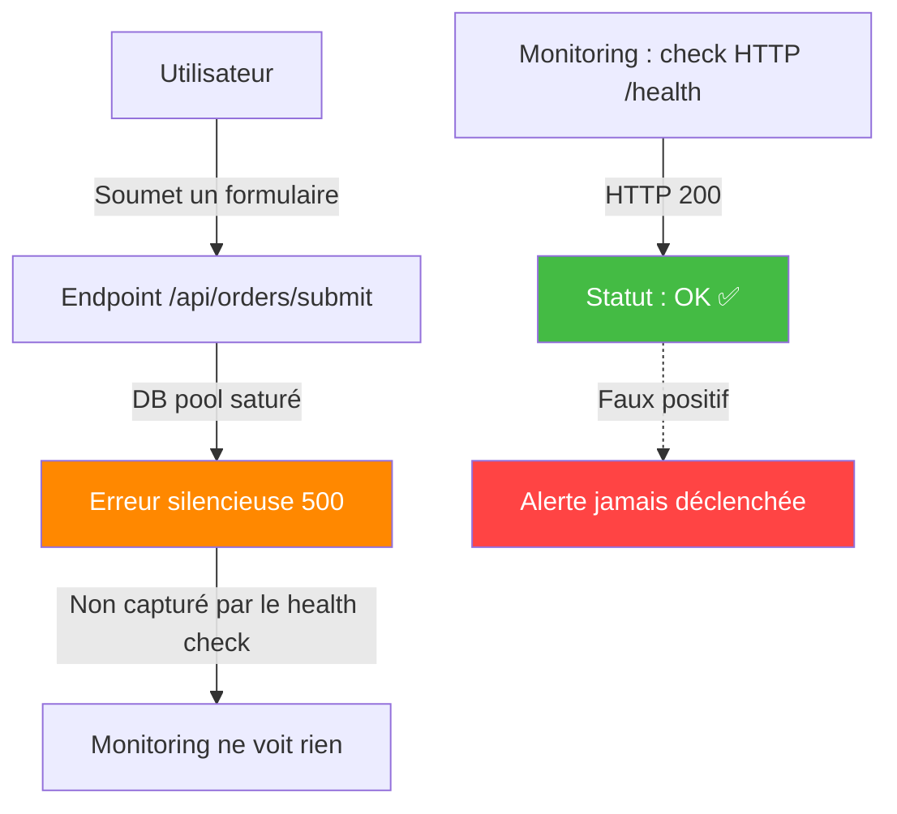
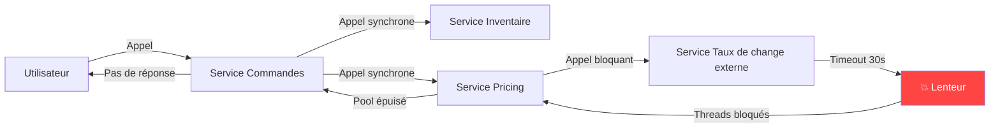

# 🪤 Pièges avancés du support applicatif

## Objectifs pédagogiques

À l'issue de ce module, tu seras capable de :

1. **Identifier** les pièges cognitifs qui mènent à un mauvais diagnostic en support de niveau 2/3
2. **Distinguer** un symptôme d'une cause racine dans un incident complexe
3. **Appliquer** une méthode de dépouillement systématique pour ne pas sauter aux conclusions
4. **Reconnaître** les comportements "fantômes" liés à la mise en cache, aux connexions persistantes et aux états applicatifs incohérents
5. **Construire** un raisonnement défensif face aux faux positifs de monitoring et aux incidents intermittents

---

## Mise en situation

Il est 9h47. Ton téléphone sonne — un responsable métier te signale que l'application de gestion des commandes "ne fonctionne plus". Vingt utilisateurs sont bloqués. Le monitoring affiche tout au vert. Les logs ne montrent rien d'anormal. Ton collègue a redémarré le service il y a dix minutes, ça a "semblé" repartir, mais le problème est revenu.

C'est ce genre de situation qui sépare un technicien junior d'un technicien confirmé : pas la vitesse de frappe, pas la connaissance exhaustive des outils — mais la capacité à ne **pas** se laisser piéger par les premières apparences.

Ce module cartographie les pièges les plus redoutables du support applicatif en production : ceux qui font perdre des heures, ceux qui font intervenir au mauvais endroit, et ceux qui font croire qu'un problème est résolu alors qu'il ne l'est pas.

---

## Contexte

Le support applicatif avancé, c'est avant tout un combat contre ses propres biais. Les incidents les plus difficiles ne le sont pas parce que la technique est incompréhensible — ils le sont parce que les symptômes pointent dans la mauvaise direction. Un timeout réseau peut masquer un deadlock base de données. Un monitoring "OK" peut coexister avec une dégradation silencieuse. Une correction "qui marche" peut être un placebo causé par un redémarrage opportun.

Ce module recense les pièges récurrents observés en production, en les catégorisant par type : pièges cognitifs, pièges liés aux couches techniques, et pièges liés aux outils de surveillance. L'objectif n'est pas d'apprendre de nouvelles commandes — c'est d'apprendre à douter au bon moment, de façon structurée.

---

## Piège n°1 — Le biais de confirmation en diagnostic

### Ce que c'est, et pourquoi il est dévastateur

Quand tu reçois un ticket disant "le module de facturation est cassé", ton cerveau construit immédiatement une hypothèse. Et dès ce moment, sans t'en rendre compte, tu cherches des preuves qui **confirment** cette hypothèse — plutôt que des preuves qui la challengent.

C'est le biais de confirmation. Il est universel et ne disparaît pas avec l'expérience. En revanche, les techniciens expérimentés savent le contrecarrer activement.

**Exemple concret :** Un incident signale que "les PDF de factures ne se génèrent plus". Le technicien pense immédiatement au service de génération PDF. Il vérifie les logs du service — tout semble OK. Il redémarre le service "au cas où". Le problème persiste. En réalité, le service PDF fonctionne parfaitement : c'est le répertoire de sortie qui est plein à 100%, et les fichiers sont silencieusement écrasés sans erreur visible.

> 🧠 **Concept clé** : La première hypothèse n'est pas nécessairement mauvaise, mais elle ne doit jamais être la seule explorée. Formule toujours au moins **deux hypothèses concurrentes** avant de commencer à creuser.

**Méthode corrective — la règle des trois hypothèses :**

Avant toute action corrective, pose-toi trois questions :
- Quelle est mon hypothèse principale ?
- Quelle hypothèse **contredit** la mienne ?
- Quelle hypothèse **inclut** les deux premières comme cas particuliers ?

Ce n'est pas une contrainte bureaucratique. C'est une discipline mentale qui empêche de passer deux heures à fouiller les logs applicatifs quand le disque est plein.

---

## Piège n°2 — Confondre redémarrage et résolution

### Le redémarrage comme anesthésique

Le redémarrage d'un service ou d'un serveur est l'action la plus réflexe du support. Et parfois elle fonctionne — le problème disparaît. C'est là que le piège se referme.

Un redémarrage peut masquer temporairement une dizaine de causes différentes : fuite mémoire progressive, connexion base de données orpheline, état applicatif incohérent après un déploiement partiel, verrou de fichier non libéré, pool de threads saturé... Après redémarrage, l'application repart à zéro. Le problème revient dans quelques heures ou quelques jours.

> ⚠️ **Erreur fréquente** : Clôturer un ticket après un redémarrage "qui a résolu le problème" sans identifier la cause racine. Le ticket sera rouvert dans 48h, et cette fois tu n'auras plus les logs de l'incident d'origine.

**Ce qu'il faut faire avant de redémarrer :**

Si la situation le permet (et si l'impact métier le tolère), prends 5 minutes pour collecter :

```bash
# Sur Linux — état avant redémarrage
ps aux --sort=-%mem | head -20          # Consommation mémoire par processus
lsof -p <PID> | wc -l                  # Nombre de fichiers ouverts
ss -tp | grep <PORT>                   # Connexions réseau actives
cat /proc/<PID>/status | grep VmRSS    # Mémoire résidente exacte
journalctl -u <SERVICE> --since "1h ago" > /tmp/logs_avant_restart.txt
```

Sur Windows, avant un redémarrage de service :

```powershell
# Capturer l'état du processus avant restart
Get-Process -Name <NOM_PROCESSUS> | Select-Object CPU, WorkingSet, HandleCount | Export-Csv C:\support\etat_avant.csv
Get-EventLog -LogName Application -Newest 100 | Export-Csv C:\support\eventlog_avant.csv
```

Ces captures prennent 2 minutes. Elles peuvent t'éviter 3 jours d'errance si le problème revient.

---

## Piège n°3 — Les incidents intermittents et la tentation de "ne pas reproduire, ne pas traiter"

### Quand le problème disparaît quand tu regardes

Un incident intermittent, c'est le cauchemar du support : l'utilisateur voit l'erreur, tu prends la main, tout fonctionne. C'est tentant de classer ça en "non reproduit" et de passer à autre chose.

Mauvaise idée. Les incidents intermittents sont souvent les **précurseurs** d'incidents majeurs. Ils signalent que le système est en limite de capacité, ou qu'une dégradation progressive est en cours.

Les causes les plus fréquentes d'intermittence :

| Cause | Signature caractéristique | Où regarder |
|---|---|---|
| Saturation pool de connexions DB | Erreurs en pic, jamais en fond | Métriques pool connexions, délai entre erreurs |
| Memory leak lent | Fréquence d'erreur augmente avec l'uptime | Graphe mémoire sur 24-72h |
| Race condition | Reproductible sous charge, jamais seul | Tests de charge, logs concurrents |
| Timeout réseau intermittent | Corrélé avec la charge réseau | Latence réseau, logs retry |
| Cron/job planifié qui perturbe | Erreurs à heure fixe | Corrélation horaire exacte des incidents |

> 💡 **Astuce** : Avant de chercher la cause, cherche le **pattern**. Exporte les timestamps de toutes les occurrences de l'erreur et cherche une régularité : toutes les N minutes, aux heures rondes, sous une certaine charge, depuis un certain serveur. La corrélation temporelle est souvent plus parlante que le message d'erreur lui-même.

```bash
# Extraire les timestamps d'une erreur et compter les occurrences par minute
grep "ERROR_SPECIFIQUE" /var/log/app/application.log \
  | awk '{print $1, substr($2,1,5)}' \
  | sort | uniq -c | sort -rn | head -20

# Comparer avec les crons actifs sur le serveur — chercher une coïncidence horaire
crontab -l; cat /etc/cron.d/*

# Corréler avec l'uptime du processus : l'erreur apparaît-elle après N heures de fonctionnement ?
ps -o pid,etime,comm -p <PID>
```

Si les erreurs surviennent à intervalle régulier (toutes les heures pile, ou tous les jours à 3h), cherche un cron avant de chercher un bug. Si la fréquence augmente avec le temps depuis le dernier redémarrage, cherche une fuite mémoire ou un pool qui se sature.

---

## Piège n°4 — Le monitoring qui ment (ou qui dit la mauvaise chose)

### Quand "tout est vert" ne veut rien dire

C'est le scénario de la mise en situation d'introduction : une application dysfonctionnelle avec un monitoring au vert. Comment est-ce possible ?



Plusieurs raisons expliquent ce décalage :

**1. Le health check ne teste pas le bon chemin.** Une sonde qui appelle `/health` et reçoit un HTTP 200 ne sait pas si la route `/api/orders/submit` fonctionne. Le health check est une preuve que le processus est **vivant**, pas qu'il est **opérationnel**.

**2. La métrique surveillée n'est pas celle qui plante.** On surveille souvent le CPU et la RAM. Mais la saturation peut être sur le pool de connexions à la base de données, le nombre de threads disponibles, ou l'espace disque d'un volume spécifique.

**3. Les seuils d'alerte sont mal calibrés.** Si l'alerte se déclenche à 90% de CPU et que le problème arrive à 70%, l'alerte ne se déclenche jamais.

**4. Les logs d'erreur sont absorbés silencieusement.** Certaines erreurs sont capturées et avalées par des `try/catch` vides ou par une gestion d'erreur qui renvoie HTTP 200 avec un corps JSON `{"status": "error"}`. Le monitoring HTTP ne voit que le code de statut.

> ⚠️ **Erreur fréquente** : Faire confiance au dashboard de monitoring pendant un incident sans vérifier ce qu'il mesure réellement. Commence toujours par identifier **ce que ton monitoring ne surveille pas**.

**Checklist rapide pour évaluer la fiabilité de ton monitoring :**

- Le health check teste-t-il une vraie opération métier, ou juste un ping applicatif ?
- Les erreurs HTTP 5xx sont-elles comptées et alertées séparément ?
- Le taux d'erreur fonctionnel (erreurs métier retournées en HTTP 200) est-il mesuré ?
- Les ressources spécifiques de l'application sont-elles surveillées (pool DB, queue de traitement, espace disque des volumes applicatifs) ?

---

## Piège n°5 — Les effets de cache et d'état persistant

### Quand la correction ne corrige rien — ou quand elle corrige trop

Le cache est l'un des mécanismes les plus efficaces en production. C'est aussi l'un des plus traîtres à diagnostiquer.

**Scénario 1 — La correction invisible :** Un développeur corrige un bug et déploie en production. L'utilisateur continue de voir l'ancien comportement pendant 30 minutes. Le bug "n'est pas corrigé". En réalité, le CDN ou le cache applicatif sert encore l'ancienne version. La correction est bonne, mais elle n'est pas encore visible.

**Scénario 2 — L'incident causé par le cache :** Après un déploiement, une partie des utilisateurs voit des erreurs, l'autre partie n'en voit pas. Cause probable : des serveurs ont été mis à jour, d'autres pas encore (déploiement progressif), et le load balancer distribue les requêtes aléatoirement entre les deux versions. Les sessions utilisateurs contiennent un format de données que la nouvelle version ne reconnaît plus.

**Scénario 3 — Le cache empoisonné :** Une erreur a été mise en cache (réponse erronée stockée). Même après correction du bug sous-jacent, le cache continue de servir la réponse erronée.

> 🧠 **Concept clé** : Quand un bug semble résolu "côté serveur" mais persiste pour certains utilisateurs, ton premier réflexe doit être : **est-ce que quelque chose est en cache entre le serveur et l'utilisateur ?** Liste des couches potentielles : cache navigateur, CDN, reverse proxy (Nginx/Varnish), cache applicatif (Redis, Memcached), cache de session.

Identifier rapidement quelle couche est en cause :

```bash
# Tester l'endpoint directement sur le serveur (bypasse tout le front)
curl -v http://localhost:<PORT>/api/endpoint

# Tester en forçant une réponse sans cache (header Cache-Control)
curl -H "Cache-Control: no-cache" -H "Pragma: no-cache" https://monapp.example.com/api/endpoint

# Vérifier les headers de réponse pour identifier si le cache a servi
curl -I https://monapp.example.com/api/endpoint | grep -i "x-cache\|age\|cache-control"
```

Si le serveur renvoie la bonne réponse mais que l'utilisateur voit l'ancienne, le problème est en amont. Si le serveur lui-même renvoie la mauvaise réponse, c'est un problème applicatif ou de cache applicatif.

---

## Piège n°6 — L'environnement qui n'est pas ce qu'on croit

### "Ça marche en recette, pas en prod" — et inversement

C'est l'une des phrases les plus prononcées en support. Et l'une des plus mal exploitées. Quand quelque chose fonctionne dans un environnement et pas dans un autre, la différence entre les deux environnements **est** la cause du problème. Ce n'est pas une coïncidence.

Les différences les plus fréquentes (et les plus souvent oubliées) :

| Différence | Ce qu'on vérifie rarement |
|---|---|
| Version de l'application | Le numéro de commit exact, pas juste le tag de version |
| Configuration | Les variables d'environnement, les fichiers `.env`, les secrets |
| Données | Volume, format, cas limites présents en prod et absents en recette |
| Infrastructure | JVM heap size, worker count, timeout différents entre envs |
| Dépendances externes | Recette pointe vers un mock, prod vers le vrai service |
| Charge | Comportement différent sous 10 utilisateurs et sous 1000 |

> 💡 **Astuce** : Crée un "diff d'environnement" systématique. Compare côte à côte les variables d'environnement, les fichiers de configuration, les versions des dépendances et les ressources allouées entre les deux environnements. La différence qui cause le bug est généralement la première que tu n'as pas pensé à vérifier.

```bash
# Comparer les variables d'environnement de deux services (sur le même hôte ou via export)
env | sort > /tmp/env_prod.txt
# (répéter sur recette)
diff /tmp/env_recette.txt /tmp/env_prod.txt
```

Un cas particulier mérite attention : les **bases de données de configuration**. Certaines applications stockent leur configuration non pas dans des fichiers mais en base de données. Recette et production ont des bases différentes, donc des configurations différentes — et personne ne pense à les comparer pendant un incident.

---

## Piège n°7 — Les dépendances cachées et les effets de bord en cascade

### Un service peut "mourir" à cause d'un service que tu n'as pas touché

En architecture microservices ou en application monolithique fortement couplée, un incident sur un composant secondaire peut provoquer la défaillance d'un composant principal. Le symptôme est visible sur le composant principal ; la cause est sur l'autre.



Dans ce schéma, l'utilisateur voit le Service Commandes comme défaillant. Le monitoring du Service Commandes peut même montrer des erreurs. Mais la cause racine est un timeout sur un service externe de taux de change — un service que personne n'a touché et que personne ne surveille directement.

> 🧠 **Concept clé** : La **propagation en cascade** transforme une panne locale en panne globale. Quand tu analyses un incident, remonte toujours la chaîne des dépendances. La question à poser n'est pas "pourquoi ce service est-il lent ?" mais "qu'est-ce que ce service appelle, et qu'est-ce qui a changé dans ces dépendances ?"

**Comment identifier les dépendances en production :**

```bash
# Sur Linux — voir les connexions réseau actives d'un processus
ss -tp | grep <PID>
lsof -i -p <PID>

# Tracer les appels réseau sortants en temps réel
strace -p <PID> -e trace=network 2>&1 | grep connect

# Sur les applications Java — thread dump pour voir les threads bloqués
kill -3 <PID>   # Envoie SIGQUIT → thread dump dans stdout/stderr
```

Le thread dump Java est particulièrement utile : il montre exactement sur quoi chaque thread est bloqué. Si tu vois des dizaines de threads en état `WAITING` sur une connexion réseau, tu as ta réponse.

---

## Piège n°8 — Traiter les symptômes sans tracer la chronologie

### L'incident a une histoire — si tu ne la lis pas, tu manques la cause

Un incident complexe n'arrive jamais instantanément. Il y a toujours une séquence d'événements qui y mène. Le piège est de se focaliser sur l'état actuel du système sans reconstituer ce qui s'est passé avant.

La chronologie est ta meilleure alliée. Voici comment la construire méthodiquement :

```mermaid
gantt
    title Reconstitution d'une chronologie d'incident
    dateFormat HH:mm
    axisFormat %H:%M

    section Événements système
    Déploiement v2.4.1        :milestone, 08:30, 0m
    Augmentation latence DB   :crit, 08:35, 15m
    Saturation pool connexions :crit, 08:45, 20m

    section Alertes
    Alerte latence P95 > 2s   :08:48, 5m
    Ticket ouvert par métier  :08:52, 5m

    section Actions support
    Redémarrage service       :09:05, 5m
    Retour à la normale       :09:10, 30m
    Rechute                   :crit, 09:40, 20m
```



Pour reconstruire une telle chronologie, croise plusieurs sources :

- **Logs applicatifs** : premiers messages d'erreur avec timestamp précis
- **Logs système** : événements kernel, OOM killer, rotations de logs
- **Historique des déploiements** : heure exacte de chaque mise en production
- **Historique des modifications de configuration**
- **Métriques de monitoring** : CPU, mémoire, latence — en remontant à l'heure précédant l'incident
- **Tickets récents** : d'autres utilisateurs ont-ils signalé quelque chose avant ?

> ⚠️ **Erreur fréquente** : Commencer à investiguer à l'heure où le ticket a été ouvert. Le problème a souvent démarré 15 à 45 minutes avant la première remontée utilisateur. Recule toujours ta fenêtre d'analyse.

---

## Piège n°9 — Les logs qui ne disent pas ce qu'on croit

### Lire les logs sans contexte, c'est lire un roman en ouvrant au milieu

Les logs sont ta source d'information principale. Mais plusieurs pièges les rendent traîtres :

**Piège 1 — Le log d'erreur qui n'est pas la cause.** Une erreur dans les logs peut être la *conséquence* d'une erreur antérieure qui, elle, n'est pas loggée ou est loggée ailleurs. Si un service de paiement logue "connexion refusée", c'est peut-être parce que le service de session a crashé deux minutes avant et que la requête n'était plus authentifiée.

**Piège 2 — Les logs asynchrones désynchronisés.** Dans un système distribué, les logs de différents services ont des horloges qui peuvent dériver de quelques secondes. Un événement qui semble se passer *avant* dans les logs peut en réalité se passer *après*. Utilise un système de centralisation des logs (ELK, Loki, Datadog) avec une synchronisation NTP vérifiée.

**Piège 3 — Le niveau de log trompeur.** Certaines applications loggent des erreurs graves en `WARN` ou inversement loggent des `ERROR` récupérées sans impact. Ne filtre pas aveuglément sur `ERROR` — lis aussi les `WARN` autour de la période de l'incident.

**Piège 4 — La rotation de log qui efface les preuves.** Si les logs tournent toutes les 24h et que tu analyses un incident survenu il y a 36h, les logs d'origine ont peut-être été compressés ou supprimés. Sache où sont archivés les anciens logs avant d'en avoir besoin.

```bash
# Trouver les logs archivés d'un service
find /var/log/ -name "*.gz" -newer /var/log/app/application.log.1
zcat /var/log/app/application.log.2.gz | grep "ERROR" | grep "2024-01-15 08:3"

# Chercher une corrélation entre deux services sur la même plage horaire
grep "08:35:.*ERROR" /var/log/serviceA/app.log > /tmp/erreurs_A.txt
grep "08:35:.*ERROR" /var/log/serviceB/app.log > /tmp/erreurs_B.txt
```

---

## Piège n°10 — La pression du temps qui dégrade la qualité du diagnostic

### Quand l'urgence devient l'ennemi de la résolution

En production, la pression est réelle. Chaque minute coûte. Et cette pression pousse à agir vite, à prendre la première action qui semble logique — redémarrer, rollback, escalader — sans avoir confirmé l'hypothèse.

Le paradoxe : **les actions précipitées rallongent souvent la durée totale de l'incident.** Un redémarrage mal ciblé, un rollback qui ne résout pas le problème, une escalade prématurée qui met du monde en attente — tout ça consomme du temps sans résoudre.

La structure minimale à respecter même sous pression :

```
1. [2 min] Qualifier l'impact réel : combien d'utilisateurs, quelles fonctions, depuis quand ?
2. [3 min] Formuler deux hypothèses concurrentes
3. [2 min] Identifier quelle vérification rapide discrimine les deux hypothèses
4. [5 min] Exécuter la vérification
5. [Action] Intervenir sur la bonne couche
```

Ce n'est pas 12 minutes perdues — c'est 12 minutes qui évitent potentiellement 2 heures d'errements.

> 💡 **Astuce** : En situation de crise, désigne explicitement un "coordinateur" et un "investigateur". Le coordinateur gère la communication avec le métier et les escalades. L'investigateur creuse sans être interrompu. Un technicien seul à la fois coordinateur et investigateur fait mal les deux.

---

## Bonnes pratiques — Ce que font les techniciens confirmés

Ces pratiques ne s'apprennent pas dans les formations. Elles s'acquièrent après avoir été brûlé une ou deux fois par chacun des pièges précédents.

**Documenter pendant l'incident, pas après.** Ouvre un bloc-notes ou un document partagé dès le début. Note chaque vérification effectuée, chaque résultat, chaque hypothèse abandonnée. Quand l'incident dure 3h et que tu as 5 personnes dessus, cette trace est indispensable pour ne pas faire deux fois la même vérification.

**Différencier "corrélation" et "causalité".** Le fait que deux événements soient survenus au même moment ne prouve pas que l'un a causé l'autre. Un déploiement à 8h30 et un incident à 8h45 sont corrélés — mais l'incident peut être dû à un cron qui tourne à 8h45 tous les jours.

**Ne jamais modifier plusieurs variables à la fois.** Chaque action corrective doit être isolée et observée. Si tu changes la configuration ET redémarres le service ET augmentes la mémoire en même temps, tu ne sauras jamais laquelle des trois actions a résolu le problème.

**Valider la résolution avec les métriques, pas avec les impressions.** "Ça semble OK" n'est pas une validation. Compare les métriques (taux d'erreur, latence, charge) avec la baseline connue. Attends au moins 5 à 10 minutes après la correction avant de déclarer l'incident résolu.

**Faire un post-mortem même sur les petits incidents.** Un incident qui revient trois fois sans post-mortem est un incident que tu gères de façon chronique plutôt que de résoudre. Même 10 minutes de réflexion collective "pourquoi ça s'est produit / comment l'éviter" valent mieux que le traiter indéfiniment.

---

## Tableau de synthèse

| Piège | Signature | Contre-mesure |
|---|---|---|
| Biais de confirmation | On cherche ce qu'on s'attend à trouver | Formuler 2 hypothèses concurrentes |
| Redémarrage placebo | Le problème revient dans les heures suivantes | Capturer l'état avant redémarrage |
| Incident intermittent ignoré | "Non reproduit" → classé | Chercher le pattern temporel |
| Monitoring faux positif | Tout est vert, ça plante quand même | Auditer ce que le monitoring ne mesure pas |
| Effet de cache | Correction invisible ou partielle | Bypasser chaque couche de cache séquentiellement |
| Diff d'environnement | Marche en recette, pas en prod | Comparer exhaustivement les deux envs |
| Cascade de dépendances | Le service principal "tombe" sans raison | Remonter la chaîne des dépendances |
| Chronologie manquante | On ne sait pas ce qui a déclenché l'incident | Reconstruire la timeline sur -1h minimum |
| Mauvaise lecture des logs | On corrige la conséquence, pas la cause | Lire les logs avant l'erreur, croiser les sources |
| Pression qui dégrade | Actions précipitées, errements | Structure minimale de 12 minutes |

---

<!-- SNIPPETS DE RÉVISION -->

<!-- snippet
id: pieges_biais_confirmation
type: warning
tech: support-applicatif
level: advanced
importance: high
format: knowledge
tags: diagnostic,biais,hypothese,investigation,methodologie
title: Biais de confirmation en diagnostic d'incident
content: Piège : dès réception d'un ticket, le cerveau construit une hypothèse et cherche inconsciemment des preuves qui la confirment. Conséquence : on passe 2h dans les mauvais logs pendant que le disque est plein. Correction : formuler systématiquement 2 hypothèses concurrentes avant toute action, et identifier quelle vérification rapide discrimine les deux.
description: Le premier endroit où tu regardes n'est souvent pas le bon — formule une hypothèse alternative avant de creuser.
-->

<!-- snippet
id: pieges_capture_etat_avant_restart
type: command
tech: linux
level: intermediate
importance: high
format: knowledge
tags: redemarrage,logs,diagnostic,incident,linux
title: Capturer l'état d'un processus Linux avant redémarrage
command: journalctl -u <SERVICE> --since "1h ago" > /tmp/logs_avant_restart.txt && ps aux --sort=-%mem | head -20 && lsof -p <PID> | wc -l
example: journalctl -u tomcat9 --since "1h ago" > /tmp/logs_avant_restart.txt && ps aux --sort=-%mem | head -20 && lsof -p 4821 | wc -l
description: Capture les logs récents, consommation mémoire, et fichiers ouverts avant un redémarrage — sans ça, la cause est perdue si le problème revient.
-->

<!-- snippet
id: pieges_capture_etat_windows
type: command
tech: powershell
level: intermediate
importance: medium
format: knowledge
tags: powershell,windows,redemarrage,diagnostic
title: Capturer l'état d'un processus Windows avant redémarrage
command: Get-Process -Name <NOM_PROCESSUS> | Select-Object CPU,WorkingSet,HandleCount | Export-Csv C:\support\etat_avant.csv
example: Get-Process -Name "w3wp" | Select-Object CPU,WorkingSet,HandleCount | Export-Csv C:\support\etat_avant.csv
description: Capture CPU, RAM (WorkingSet) et handles ouverts d'un processus Windows avant restart — HandleCount élevé peut indiquer une fuite de ressources.
-->

<!-- snippet
id: pieges_intermittent_pattern
type: tip
tech: linux
level: intermediate
importance: high
format: knowledge
tags: incident,intermittent,logs,pattern,grep
title: Extraire le pattern temporel d'une erreur intermittente
command: grep "<ERREUR>" /var/log/app/application.log | awk '{print $1, $2}' | sort
example: grep "connection refused" /var/log/app/application.log | awk '{print $1, $2}' | sort
description: Trie les timestamps des occurrences d'une erreur — révèle si le problème est lié à une heure fixe (cron), à un intervalle régulier (memory leak), ou aléatoire (race condition).
-->

<!-- snippet
id: pieges_cache_bypass_curl
type: command
tech: curl
level: intermediate
importance: high
format: knowledge
tags: cache,debug,curl,http,headers
title: Tester un endpoint en bypassant le cache HTTP
command: curl -H "Cache-Control: no-cache" -H "Pragma: no-cache" -I <URL>
example: curl -H "Cache-Control: no-cache" -H "Pragma: no-cache" -I https://api.exemple.com/v1/orders
description: Force une requête sans cache côté proxy/CDN. Vérifie aussi x-cache, Age et Cache-Control dans les headers de réponse pour identifier quelle couche sert encore l'ancienne version.
-->

<!-- snippet
id: pieges_env_diff
type: command
tech: bash
level: intermediate
importance: high
format: knowledge
tags: environnement,diff,debug,production,recette
title: Comparer les variables d'environnement entre deux serveurs
command: env | sort > /tmp/env_<ENV>.txt && diff /tmp/env_recette.txt /tmp/env_prod.txt
example: env | sort > /tmp/env_prod.txt && diff /tmp/env_recette.txt /tmp/env_prod.txt
description: Compare exhaustivement les variables d'environnement — la variable manquante ou différente est souvent la cause d'un bug "marche en recette, pas en prod".
-->

<!-- snippet
id: pieges_cascade_connexions
type: command
tech: linux
level: advanced
importance: medium
format: knowledge
tags: dependances,cascade,reseau,strace,debug
title: Identifier les connexions réseau sortantes d'un processus
command: lsof -i -p <PID>
example: lsof -i -p 7823
description: Liste toutes les connexions réseau ouvertes par un processus — révèle les dépendances actives et permet de détecter des connexions bloquées sur un service tiers qui causent une cascade.
-->

<!-- snippet
id: pieges_monitoring_faux_vert
type: concept
tech: support-applicatif
level: advanced
importance: high
format: knowledge
tags: monitoring,faux-positif,healthcheck,diagnostic
title: Monitoring "tout vert" pendant un incident réel
content: Quatre causes possibles : (1) le health check teste `/health` mais pas le chemin fonctionnel impacté, (2) la ressource saturée n'est pas surveillée (pool DB, threads, espace disque applicatif), (3) les seuils d'alerte sont trop hauts, (4) les erreurs sont absorbées silencieusement dans un try/catch qui renvoie HTTP 200. Lors d'un incident sans alerte, commence par identifier ce que ton monitoring ne mesure PAS.
description: Un dashboard vert pendant un incident signifie que le monitoring ne mesure pas la bonne chose — pas que tout va bien.
-->

<!-- snippet
id: pieges_chronologie_1h_avant
type: tip
tech: support-applicatif
level: advanced
importance: high
format: knowledge
tags: chronologie,incident,timeline,investigation
title: Reculer la fenêtre d'analyse d'au moins 1h avant l'incident
content: Les utilisateurs signalent un incident 15 à 45 minutes après son démarrage réel. Investiguer depuis l'heure du ticket rate systématiquement le déclencheur. Recule toujours ta fenêtre d'analyse de 1h minimum — voire 24h pour détecter une dégradation progressive (memory leak, saturation disque). Croise logs applicatifs, système, historique déploiements et métriques monitoring sur cette fenêtre élargie.
description: Le déclencheur d'un incident est presque toujours antérieur à l'heure du premier ticket — commence toujours 1h avant.
-->

<!-- snippet
id: pieges_une_variable_a_la_fois
type: warning
tech: support-applicatif
level: intermediate
importance: high
format: knowledge
tags: methodologie,diagnostic,correction,isolation
title: Ne jamais modifier plusieurs variables simultanément
content: Si tu changes la configuration ET redémarres le service ET augmentes la mémoire en même temps et que ça fonctionne, tu ne sauras jamais laquelle des trois actions a résolu le problème — et tu ne pourras pas reproduire la correction ni documenter la cause. Chaque action corrective doit être isolée, appliquée, puis observée 5-10 min avant la suivante. En cas d'urgence P1, note toutes les actions avec leur timestamp exact pour reconstituer après.
description: Modifier plusieurs paramètres simultanément rend la cause de la résolution inidentifiable — impossible à documenter et à reproduire.
-->
