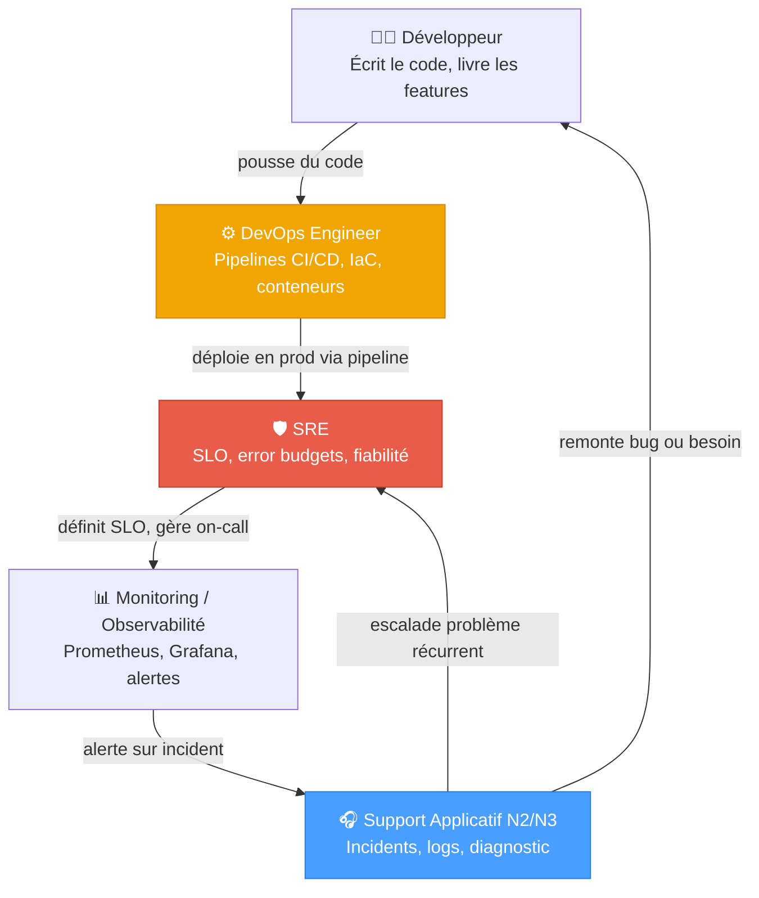
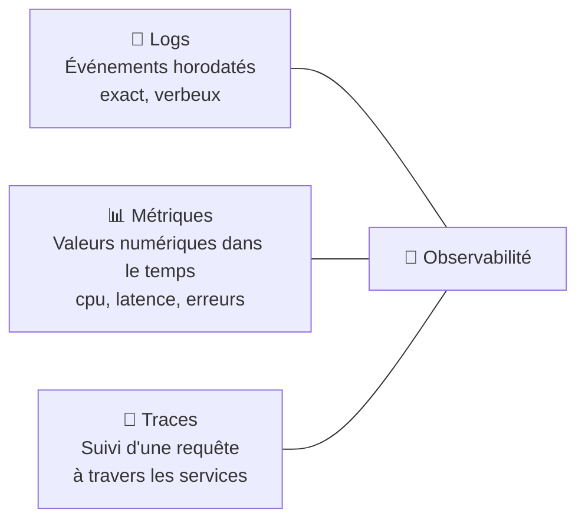

# Passage vers DevOps / SRE

## Objectifs pédagogiques

À l'issue de ce module, tu seras capable de :

- Distinguer les rôles DevOps, SRE et Support Applicatif sur des critères concrets (périmètre, responsabilités, outillage)
- Identifier les compétences que tu as déjà et celles qui manquent pour évoluer vers l'un ou l'autre profil
- Arbitrer entre un positionnement DevOps et SRE selon le contexte d'une organisation
- Comprendre comment les pratiques DevOps/SRE s'articulent avec le support de niveau 2/3
- Planifier une transition progressive depuis un poste de technicien support

---

## Mise en situation

Tu travailles depuis deux ans en support applicatif niveau 2 dans une entreprise de logistique. Tu gères des incidents sur une application Java en production, tu lis des logs, tu coordonnes avec les équipes Dev et Infra, tu connais les environnements par cœur.

Un jour, deux offres d'emploi atterrissent dans ta boîte mail. L'une cherche un **DevOps Engineer**, l'autre un **Site Reliability Engineer (SRE)**. Tu te demandes : c'est la même chose ? C'est fait pour moi ? Par où commencer ?

La réponse courte : non, ce n'est pas la même chose — mais les deux partent d'endroits que tu connais déjà mieux que tu ne le penses. Le problème, c'est que ces deux rôles sont souvent mal définis, mal marketés, et que la frontière entre les deux dépend autant de l'entreprise que du profil.

Ce module te donne les clés pour comprendre la différence, te situer, et décider où aller.

---

## Contexte et problématique

### Pourquoi ces rôles ont émergé

Pendant longtemps, les organisations fonctionnaient en silos : les développeurs écrivaient le code, les ops le déployaient, le support gérait les incidents. Chacun faisait son travail — et se renvoyait la balle quand quelque chose brûlait en production.

Ce modèle a fonctionné jusqu'au moment où les cycles de livraison sont passés de "une release par trimestre" à "plusieurs déploiements par jour". À ce rythme, les anciennes barrières organisationnelles deviennent des goulots d'étranglement. C'est de ce constat qu'est né le mouvement **DevOps** au début des années 2010.

Le **SRE** (Site Reliability Engineering), lui, vient de Google. En 2003, Ben Treynor Sloss a eu une idée simple mais radicale : confier la fiabilité des systèmes à des ingénieurs logiciels, pas à des opérateurs. L'idée : si les devs cassent la prod, autant que ce soient eux qui la maintiennent — avec des outils de mesure rigoureux.

Ces deux approches répondent au même problème de fond — **comment livrer vite sans tout casser** — mais par des chemins différents.

---

## DevOps vs SRE : la comparaison au fond

Avant le tableau, une mise en garde : dans la réalité, beaucoup d'entreprises utilisent ces termes de manière interchangeable ou approximative. Ce qui compte, c'est de comprendre les **philosophies** derrière, pas les intitulés.

### Philosophies de départ

**DevOps** est une **culture et un ensemble de pratiques** visant à rapprocher développement et opérations. Il n'existe pas de définition technique unique — c'est intentionnel. DevOps dit *comment* travailler ensemble, pas *quoi* faire exactement.

**SRE** est une **implémentation concrète** de cette idée, avec des mécanismes précis : SLO, error budgets, toil reduction. Google a publié un livre entier dessus. SRE dit *quoi mesurer, comment décider, où mettre la limite*.

Une formule souvent citée : **"SRE is what you get when you ask a software engineer to do operations."** DevOps, c'est ce que tu obtiens quand tu demandes à tout le monde de partager la responsabilité.

### Comparaison structurée

| Critère | DevOps Engineer | SRE |
|---|---|---|
| **Philosophie de base** | Culture de collaboration Dev ↔ Ops | Ingénierie appliquée à la fiabilité |
| **Origine** | Mouvement communautaire (2009) | Google, Ben Treynor Sloss (2003) |
| **Focus principal** | Automatiser les pipelines de livraison | Maintenir la fiabilité des systèmes |
| **Outil de pilotage** | CI/CD, IaC, conteneurs | SLO, SLI, error budget, post-mortem |
| **Rapport au code** | Écrire de la glue, des pipelines, des scripts | Écrire du code pour éliminer les tâches répétitives |
| **Rapport aux incidents** | Participe à la résolution, améliore les processus | Pilote la résolution, analyse les causes racines |
| **Métrique clé** | Fréquence de déploiement, MTTR, lead time | Disponibilité (uptime), error budget consommé |
| **Présence en prod** | Indirecte (via pipelines et IaC) | Directe (on-call, runbooks, SLO définis) |
| **Profil typique** | Dev avec appétence Ops, ou Ops avec dev | Ingénieur logiciel converti en ops, ou SysAdmin très solide |

🧠 **Concept clé** — L'error budget SRE : si le SLO est 99,9% de disponibilité mensuelle, tu as droit à 43 minutes d'indisponibilité. Ce "budget d'erreur" est partagé entre incidents imprévus et déploiements risqués. Quand il est épuisé, on arrête les déploiements. C'est un mécanisme de décision, pas juste une métrique.

---

## Où se situe le technicien support dans ce schéma ?

C'est la vraie question. Voici une représentation de comment ces rôles s'articulent dans une organisation moderne :



Le support applicatif N2/N3 est en **contact direct avec la production**. C'est une position centrale, pas périphérique. Et c'est précisément ce qui rend la transition naturelle : tu connais les symptômes, les environnements, les utilisateurs. Ce qui manque souvent, c'est l'outillage et la culture de l'automatisation.

---

## Prise de décision : DevOps ou SRE, lequel choisir ?

Il n'y a pas de bonne réponse universelle. Il y a des contextes. Voici comment raisonner selon ta situation.

### Si tu aimes construire des pipelines et automatiser les livraisons

→ **DevOps** est ton chemin. Tu vas passer ton temps sur GitLab CI, GitHub Actions, Terraform, Ansible, Docker, Kubernetes. Le plaisir de ce rôle, c'est de voir un développeur pousser du code et le voir en production 10 minutes plus tard, proprement, sans intervention humaine.

Ce rôle demande une forte appétence pour les **outils** et une capacité à comprendre le code sans forcément en écrire autant que les devs.

### Si tu aimes les incidents, l'analyse, la mesure de la fiabilité

→ **SRE** est plus adapté. Tu vas définir des SLO, analyser des post-mortems, réduire le "toil" (les tâches répétitives manuelles), écrire des runbooks, gérer l'astreinte avec méthode. Le plaisir de ce rôle, c'est de rendre un système prévisible — et de pouvoir dire "on peut déployer, le budget le permet" ou "on s'arrête là".

Ce rôle demande une rigueur analytique, du Python/Go pour automatiser, et une vraie capacité à prendre des décisions sous pression.

### En pratique dans les entreprises

| Taille / Contexte | Ce que tu trouveras |
|---|---|
| Startup < 50 personnes | Un seul rôle "DevOps" qui fait tout (CI/CD + infra + on-call) |
| Scale-up 50-500 | Équipe Platform ou DevOps distincte, SRE émerge pour les services critiques |
| Grande entreprise / GAFAM | SRE dédié par domaine, DevOps intégré dans les feature teams |
| ESN / Consulting | Le titre varie, mais souvent "DevOps" = intégrateur d'outils CI/CD |

⚠️ **Erreur fréquente** — Beaucoup de postes intitulés "SRE" dans des PME sont en réalité des postes DevOps avec quelques notions de monitoring. Regarde les responsabilités concrètes, pas le titre. Si tu ne vois pas les mots "SLO", "error budget" ou "post-mortem" dans la fiche, c'est probablement un DevOps.

---

## Compétences : ce que tu as déjà, ce qu'il faut acquérir

Voici une cartographie honnête pour un technicien support applicatif expérimenté.

### Ce que tu as déjà (et qui compte vraiment)

- **Lecture de logs et diagnostic** — C'est fondamental en SRE. Tu lis des stack traces, tu cherches des corrélations, tu sais distinguer un symptôme d'une cause. C'est rare et précieux.
- **Connaissance des environnements prod/preprod/dev** — Tu sais que "ça marche pas pareil en prod" n'est pas une excuse, c'est un indice.
- **Communication inter-équipes** — Tu as appris à parler aux devs, aux métiers, à la DSI. C'est une compétence sous-estimée.
- **Gestion d'incidents** — Priorisation, escalade, communication de crise, post-incident. C'est exactement ce que fait un SRE.
- **Connaissance applicative** — Tu sais ce que fait l'application, ses dépendances, ses points de fragilité.

### Ce qu'il faut acquérir selon le chemin choisi

| Compétence | DevOps | SRE | Priorité |
|---|---|---|---|
| Git avancé (branches, merge, rebase) | ✅ Indispensable | ✅ Indispensable | Haute |
| Scripting Python ou Bash | ✅ Indispensable | ✅ Indispensable | Haute |
| Docker / conteneurs | ✅ Indispensable | ➡️ Utile | Haute |
| CI/CD (GitLab CI, GitHub Actions) | ✅ Cœur du métier | ➡️ Notions | Haute pour DevOps |
| Terraform / Ansible (IaC) | ✅ Indispensable | ➡️ Utile | Haute pour DevOps |
| Kubernetes | ✅ Attendu | ✅ Attendu (niveau admin) | Moyenne / évolue vite |
| Prometheus / Grafana | ➡️ Utile | ✅ Cœur du métier | Haute pour SRE |
| Définition de SLO/SLI/SLA | ➡️ Notions | ✅ Cœur du métier | Haute pour SRE |
| Go ou Python avancé | ➡️ Optionnel | ✅ Attendu | Moyenne pour SRE |
| Astreinte / on-call structuré | ➡️ Partiel | ✅ Indispensable | Haute pour SRE |

💡 **Astuce** — Ne cherche pas à tout apprendre d'un coup. Choisis un axe (pipelines CI/CD pour DevOps, ou monitoring/SLO pour SRE) et va au bout d'un projet concret. Un repo GitHub avec une vraie pipeline sur un vrai projet vaut plus qu'une liste de certifications.

---

## Les pratiques clés à maîtriser dans les deux cas

Certaines pratiques sont communes aux deux rôles — et souvent déjà partiellement connues des techniciens support.

### L'observabilité (pas juste le monitoring)

La différence entre monitoring et observabilité est subtile mais importante. Le monitoring te dit **"quelque chose est cassé"**. L'observabilité te permet de comprendre **"pourquoi"**, même pour des états que tu n'avais pas anticipés.

Les trois piliers de l'observabilité :



En support, tu connais surtout les logs. En DevOps/SRE, tu vas construire les métriques et les traces — et surtout les **corréler**.

### L'Infrastructure as Code (IaC)

L'idée centrale : tout ce qui est fait manuellement dans une interface graphique peut être oublié, mal reproduit, ou perdu. Coder l'infrastructure (avec Terraform, Ansible, Pulumi…) la rend **reproductible, versionnée et auditable**.

Pour un ancien support, c'est un changement de paradigme fort : au lieu de "je clique pour créer un serveur", tu écris un fichier qui décrit ce serveur, et un outil le crée. Avantage : si tu dois recréer l'environnement, c'est `terraform apply`, pas 3 heures de clics.

### Exemple concret : définir un premier SLO

Un SLO ne demande pas d'outil sophistiqué pour commencer. Voici un document SLO minimal pour une API de commandes :

```yaml
# slo-api-commandes.yaml
service: api-commandes
owner: equipe-platform
version: 1.0
date: 2024-01-15

sli:
  definition: "Taux de requêtes HTTP retournant 2xx ou 3xx"
  mesure: "sum(rate(http_requests_total{status=~'[23]..'}[5m])) / sum(rate(http_requests_total[5m]))"

slo:
  target: 99.5%       # 99.5% des requêtes réussies sur 30 jours glissants
  window: 30d

error_budget:
  total_minutes: 216  # (1 - 0.995) × 30j × 24h × 60min
  alert_threshold: 50%  # Alerter quand 50% du budget est consommé

consequences:
  budget_epuise: "Gel des déploiements non critiques jusqu'à fin de période"
  revue: "Mensuelle — premier lundi du mois, 30 min"
```

Ce document n'est qu'un fichier texte. Ce qui compte, c'est de le partager avec l'équipe de développement et de s'y tenir. C'est ce contrat informel qui transforme "le service est souvent lent" en "on a consommé 80% du budget d'erreur cette semaine, pourquoi ?".

### La gestion du toil (spécifique SRE)

🧠 **Concept clé** — Le "toil" en SRE désigne les tâches manuelles, répétitives, sans valeur à long terme. Redémarrer un service toutes les nuits parce que personne n'a résolu le memory leak, c'est du toil. Google recommande que le toil ne dépasse pas 50% du temps d'un SRE — le reste doit aller à de l'ingénierie qui élimine ce toil. C'est une règle de survie, pas une aspiration.

---

## Cas réel : transition de support N2 vers SRE

**Contexte** : Sophia, 3 ans de support applicatif N2 dans une fintech. Elle gère des incidents sur une API de paiement Java, coordonne avec les devs, maintient les runbooks à jour. Elle est souvent appelée en premier lors des alertes critiques.

**Déclencheur** : Son équipe adopte Prometheus + Grafana. On lui demande de "créer quelques dashboards". Elle commence à comprendre les métriques, les alertes, les seuils. Elle réalise qu'elle peut aller plus loin.

**Chemin suivi sur 12 mois** :
1. Elle suit une formation Python (3 mois, 2h/semaine) — scripting d'abord, puis automatisation de rapports d'incidents
2. Elle propose de formaliser les SLO de l'API de paiement avec son manager — premier document SLO réel
3. Elle prend en charge la rotation d'astreinte avec une formation PagerDuty
4. Elle contribue à un post-mortem structuré après une panne de 45 minutes — et le présente à l'équipe
5. Elle passe sa certification CKA (Kubernetes) en autodidacte

**Résultat** : Elle rejoint l'équipe plateforme comme SRE junior 14 mois après le début de la démarche. Son profil vendeur : la connaissance métier de l'application, la capacité à communiquer avec les non-techniques, et une pratique réelle des SLO (pas juste théorique).

💡 **Ce qui a vraiment compté** : pas les certifications, mais les **projets réels avec impact mesurable**. Elle pouvait montrer les SLO qu'elle avait définis, les alertes qu'elle avait créées, et expliquer pourquoi.

---

## Bonnes pratiques pour réussir la transition

**1. Commence par un projet concret, pas une roadmap exhaustive**
Action immédiate : crée un repo GitHub public, écris un script Python ou Bash qui automatise une tâche que tu fais manuellement (extraction de logs, rapport d'incidents, health check), et ajoute une pipeline GitHub Actions qui le teste à chaque push. Voilà un projet DevOps réel en 2 à 3 heures. Exemple minimal :

```yaml
# .github/workflows/test.yml
name: Test health check script
on: [push]
jobs:
  test:
    runs-on: ubuntu-latest
    steps:
      - uses: actions/checkout@v3
      - name: Run script tests
        run: bash tests/test_health_check.sh
```

**2. Documente ce que tu fais déjà — avec la méthode SRE**
Chaque incident résolu peut devenir un post-mortem en 10 minutes. Utilise ce template : symptôme observé → timeline des actions → cause racine → action corrective avec date. Stocke-les dans un repo Git ou Confluence. Au bout de 6 mois, tu as un portfolio de post-mortems qui prouve une pratique SRE réelle.

**3. Mesure avant d'automatiser**
Avant chaque projet d'automatisation, note la métrique baseline. "Le déploiement prend 45 minutes" → automatise → "il prend 8 minutes" → tu peux le montrer. Sans baseline, tu ne peux pas prouver l'impact. C'est ce qui sépare un projet d'automatisation d'un projet de CV.

**4. Choisis un outil, va au fond, puis le suivant**
Premier outil recommandé si tu pars de zéro : **Docker** (conteneurisation, omniprésent, bien documenté). Puis **GitHub Actions** (CI/CD, gratuit sur repo public). Puis **Prometheus + Grafana** (monitoring). Dans cet ordre. Maîtriser Docker en profondeur vaut plus que toucher superficiellement à Kubernetes.

**5. Construis un artefact montrable**
Un repo GitHub avec un README qui explique ce que fait le projet, pourquoi, et quels problèmes il résout — c'est ton meilleur CV. Les recruteurs DevOps/SRE regardent les repos avant les certifications. Une pipeline qui fonctionne avec des tests et un badge vert est plus convaincante qu'un AWS SAA obtenu sans pratique.

**6. Rejoins une rotation d'astreinte dès que possible**
L'astreinte révèle les faiblesses du système que personne ne voit en journée. Un SRE qui n'a jamais fait d'astreinte n'a pas encore eu accès à la vraie information. Si ton organisation propose de rejoindre une rotation, c'est une opportunité — pas une punition. Si elle n'en a pas, propose d'en créer une formelle pour les services critiques.

**7. Pose la question SRE après chaque incident**
Support : "comment je résous cet incident ?" SRE : "comment j'empêche que cet incident se reproduise, et comment je mesure si j'ai réussi ?" Ce glissement de posture est la vraie transition. Il ne nécessite aucun titre, aucun outil, aucune certification. Il nécessite juste de rester 15 minutes de plus après l'incident pour écrire l'action corrective et la planifier.

---

## Résumé

Le passage vers DevOps ou SRE n'est pas un saut dans le vide — c'est une évolution logique depuis le support applicatif. Les deux rôles partagent un socle commun : comprendre les systèmes en production, diagnostiquer, améliorer. Ce qui les distingue, c'est la direction prise.

DevOps pousse vers la **livraison continue** : pipelines, Infrastructure as Code, conteneurs, automatisation du déploiement. SRE pousse vers la **fiabilité mesurable** : SLO, error budgets, observabilité, réduction du toil. Les deux requièrent du code, de la rigueur, et une vraie connaissance des systèmes en production — terrain que tu connais déjà.

La clé de la transition : ne pas attendre d'être "prêt" pour commencer. Choisis un axe, trouve un projet réel, mesure l'impact, documente. C'est ce chemin-là — pas la liste de certifications — qui convaincra un recruteur ou un manager.

---

<!-- SNIPPETS DE RÉVISION -->

<!-- snippet
id: sre_error_budget_concept
type: concept
tech: sre
level: advanced
importance: high
format: knowledge
tags: sre,slo,error-budget,fiabilite,production
title: Error budget SRE — mécanisme de décision
content: Si le SLO est 99,9% de dispo mensuelle → 43min d'indisponibilité autorisée. Ce budget est partagé entre incidents imprévus et déploiements risqués. Quand il est épuisé → gel des déploiements jusqu'au mois suivant. Ce n'est pas une punition : c'est un signal que le système n'est pas assez stable pour absorber du changement. Formule : indispo autorisée = (1 - SLO) × durée_période.
description: L'error budget traduit un SLO en temps d'indisponibilité consommable — quand il est épuisé, les déploiements s'arrêtent, pas les équipes.
-->

<!-- snippet
id: sre_toil_concept
type: concept
tech: sre
level: advanced
importance: high
format: knowledge
tags: sre,toil,automatisation,ingenierie
title: Toil SRE — définition et règle des 50%
content: Le toil = toute tâche manuelle, répétitive, sans valeur ingénierie à long terme (ex: redémarrer un service chaque nuit à cause d'un memory leak non corrigé). Google recommande que le toil ne dépasse pas 50% du temps SRE — le reste doit aller à de l'ingénierie qui élimine ce toil. Au-delà de 50%, l'équipe SRE est en mode survie, pas en amélioration continue.
description: Toil = travail manuel répétitif sans valeur durable. Règle SRE : max 50% du temps, le reste en ingénierie qui supprime ce toil.
-->

<!-- snippet
id: devops_sre_difference
type: concept
tech: devops
level: advanced
importance: high
format: knowledge
tags: devops,sre,comparatif,role,carriere
title: DevOps vs SRE — différence fondamentale
content: DevOps = culture et pratiques pour rapprocher Dev et Ops (CI/CD, IaC, pipelines). SRE = implémentation d'ingénierie appliquée à la fiabilité (SLO, error budgets, post-mortems). Formule Google : "SRE is what you get when you ask a software engineer to do operations." DevOps dit COMMENT collaborer. SRE dit QUOI mesurer et COMMENT décider.
description: DevOps = culture de livraison continue. SRE = discipline d'ingénierie de la fiabilité avec métriques précises (SLO, error budget).
-->

<!-- snippet
id: sre_slo_sli_sla_difference
type: concept
tech: sre
level: advanced
importance: high
format: knowledge
tags: sre,slo,sli,sla,fiabilite
title: SLI / SLO / SLA — différences concrètes
content: SLI (indicateur) = métrique mesurée, ex "taux de succès des requêtes = 99,95%". SLO (objectif) = cible interne fixée par l'équipe, ex "SLI ≥ 99,9% sur 30j". SLA (accord) = engagement contractuel client, souvent moins strict que le SLO. On pilote sur le SLO, on s'engage sur le SLA. Si le SLO est atteint, le SLA l'est aussi — le SLO est le filet de sécurité interne.
description: SLI = valeur mesurée, SLO = objectif interne, SLA = engagement client. On surveille le SLO pour ne jamais violer le SLA.
-->

<!-- snippet
id: observabilite_trois_piliers
type: concept
tech: observabilite
level: intermediate
importance: high
format: knowledge
tags: observabilite,logs,metriques,traces,monitoring
title: Les 3 piliers de l'observabilité
content: Logs = événements horodatés, verbeux, racontent ce qui s'est passé. Métriques = valeurs numériques dans le temps (CPU, latence, taux d'erreur), agrégées et compactes. Traces = suivi d'une requête à travers plusieurs services (distributed tracing). Le monitoring classique utilise surtout les métriques. L'observabilité corrèle les trois pour comprendre un état non anticipé — notamment les cascades en microservices.
description: Logs (événements), métriques (valeurs dans le temps), traces (chemin d'une requête) — corréler les trois permet de déboguer des états imprévus.
-->

<!-- snippet
id: devops_iac_principe
type: concept
tech: devops
level: intermediate
importance: medium
format: knowledge
tags: iac,terraform,ansible,infrastructure,automatisation
title: Infrastructure as Code — pourquoi c'est un changement de paradigme
content: L'IaC remplace les clics manuels par du code versionné (Terraform, Ansible, Pulumi). Avantage clé : si l'environnement doit être recréé → `terraform apply`. Sans IaC, recréer un environnement demande de retrouver les étapes, de les exécuter dans le bon ordre, et d'espérer qu'on n'a rien oublié. L'IaC rend l'infra reproductible, auditable et testable comme du code.
description: Coder l'infrastructure la rend reproductible et versionnée — au lieu de clics oubliés, un `terraform apply` recrée l'environnement identiquement.
-->

<!-- snippet
id: sre_postmortem_structure
type: tip
tech: sre
level: intermediate
importance: medium
format: knowledge
tags: sre,post-mortem,incident,amelioration,blameless
title: Post-mortem blameless — structure en 5 blocs
content: Un post-mortem SRE structuré contient : 1) Résumé de l'incident (durée, impact, services affectés), 2) Timeline précise des événements, 3) Causes racines (les 5 pourquoi), 4) Ce qui a bien fonctionné, 5) Actions correctives avec propriétaire et délai. Règle fondamentale : blameless — on cherche les causes systémiques, pas les coupables. "Le serveur a crashé à cause de Jean" est inutile. "Le serveur a crashé parce qu'il n'y avait pas d'alerte sur le swap" est actionnable.
description: Post-mortem en 5 blocs : résumé, timeline, causes racines, ce qui a bien marché, actions correctives — sans chercher de coupable.
-->

<!-- snippet
id: devops_sre_job_offer_warning
type: warning
tech: devops
level: advanced
importance: medium
format: knowledge
tags: recrutement,sre,devops,offre-emploi,carriere
title: Titre "SRE" en offre d'emploi — vérifier le contenu réel
content: Piège : beaucoup de postes "SRE" dans des PME sont en réalité des postes DevOps avec du monitoring. Conséquence : tu rejoins un rôle qui ne correspond pas à tes attentes. Correction : avant d'accepter, cherche dans la fiche les mots "SLO", "error budget", "post-mortem", "toil reduction". Leur absence = le poste est probablement DevOps, pas SRE au sens strict.
description: Un titre "SRE" sans mention de SLO, error budget ou post-mortem dans la fiche est souvent un poste DevOps mal intitulé.
-->

<!-- snippet
id: transition_support_sre_atouts
type: tip
tech: sre
level: advanced
importance: medium
format: knowledge
tags: carriere,sre,support,transition,competences
title: Transition support → SRE — atouts souvent sous-estimés
content: Les techniciens support ont un avantage concret sur les ingénieurs logiciels qui passent en SRE : ils connaissent déjà les symptômes prod, les patterns d'incidents, et savent communiquer avec les non-techniques. Pour valoriser cela : formalise tes runbooks avec la méthode post-mortem, propose de définir un SLO sur ton application, rejoins la rotation d'astreinte si elle existe. Ce sont des livrables montrables en entretien.
description: Connaissance prod + gestion d'incidents + communication inter-équipes = socle SRE déjà présent. L'objectif : le formaliser avec les outils SRE.
-->

<!-- snippet
id: sre_slo_document_minimal
type: tip
tech: sre
level: advanced
importance: high
format: knowledge
tags: sre,slo,error-budget,definition,yaml
title: Rédiger un premier SLO sans outil dédié
content: Un SLO minimal tient en un fichier YAML ou Markdown : service concerné, définition du SLI (ex: "taux de requêtes 2xx/3xx"), cible numérique (ex: 99.5% sur 30j), calcul du budget d'erreur (ex: (1-0.995)×30×24×60 = 216 min), conséquences si épuisé (gel des déploiements), et cadence de revue (mensuelle). Ce document partagé avec l'équipe dev est plus utile qu'un outil sophistiqué non lu.
description: Un SLO efficace commence par un fichier texte partagé, pas par un outil. Le contrat avec l'équipe dev prime sur la sophistication technique.
-->

<!-- snippet
id: devops_cicd_minimal_github_actions
type: tip
tech: github-actions
level: intermediate
importance: medium
format: knowledge
tags: cicd,github-actions,pipeline,devops,automatisation
title: Pipeline CI/CD minimale avec GitHub Actions
content: Structure minimale d'un `.github/workflows/test.yml` : `on: [push]` → `jobs.test.runs-on: ubuntu-latest` → steps avec `actions/checkout@v3` puis l'étape de test. C'est suffisant pour un premier projet. La pipeline se déclenche à chaque push, exécute les tests, et affiche un badge vert ou rouge dans le README. Premier projet concret DevOps réalisable en 2 heures.
description: Un workflow GitHub Actions en 10 lignes YAML suffit pour un premier projet CI/CD réel — pipeline déclenchée sur push, tests exécutés, badge dans le README.
-->

<!-- snippet
id: devops_sre_outillage_comparatif
type: concept
tech: devops
level: advanced
importance: medium
format: knowledge
tags: devops,sre,outils,kubernetes,terraform,prometheus
title: Outillage DevOps vs SRE — ce qui diffère concrètement
content: DevOps cœur de métier : GitLab CI / GitHub Actions (pipelines), Terraform / Ansible (IaC), Docker + Kubernetes (conteneurs). SRE cœur de métier : Prometheus + Grafana (métriques), Jaeger / Tempo (traces), PagerDuty / OpsGenie (astreinte), runbooks structurés. Kubernetes et Python sont attendus dans les deux cas. La différence : DevOps pense "livraison rapide et fiable", SRE pense "fiabilité mesurable et budget d'erreur".
description: DevOps = pipelines + IaC + conteneurs. SRE = métriques + traces + SLO + astreinte. Kubernetes et Python sont communs aux deux.
-->
