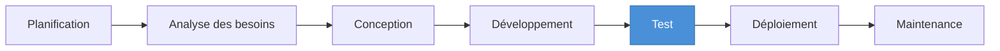
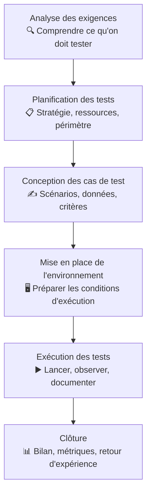

# Rôle du QA & cycle de vie logiciel

## Objectifs pédagogiques

À la fin de ce module, vous serez capable de :

1. **Distinguer** les rôles de QA, testeur et développeur dans une équipe logicielle
2. **Expliquer** pourquoi on teste en termes de risque, de coût et d'impact métier
3. **Situer** les activités de test dans le cycle de vie d'un logiciel (SDLC / STLC)
4. **Différencier** qualité produit et qualité de processus
5. **Identifier** les grands types de tests sans chercher à les mémoriser exhaustivement

---

## Mise en situation

Une startup lance une application de paiement mobile. Le dev principal code pendant trois mois, livre la version 1.0 — et le premier jour en production, 30 % des transactions échouent silencieusement. L'utilisateur croit avoir payé. Le commerçant ne voit rien. L'argent reste bloqué.

Personne n'avait testé le cas "réseau instable + session expirée simultanément".

Ce n'est pas un problème de code. C'est un problème de processus : personne dans l'équipe n'avait pour rôle explicite de chercher ce qui pouvait mal tourner. C'est précisément pour ça que le QA existe.

---

## Ce qu'est le QA — et ce que ce n'est pas

Le terme **QA** (Quality Assurance) est souvent utilisé à tort comme synonyme de "testeur". La confusion est compréhensible, mais elle cache quelque chose d'important.

🧠 Le QA ne se réduit pas à trouver des bugs. Son rôle est de s'assurer que le processus de développement produit, de manière fiable, un logiciel qui correspond à ce qu'on attend de lui.

En pratique, les rôles se répartissent ainsi :

| Rôle | Ce qu'il fait concrètement | Ce qu'il ne fait PAS |
|------|---------------------------|----------------------|
| **Développeur** | Écrit le code, corrige les bugs signalés, écrit des tests unitaires | Vérifie rarement le comportement global du système |
| **Testeur** | Exécute des tests, identifie des anomalies, rédige des rapports de bugs | Ne conçoit pas nécessairement la stratégie de test |
| **QA Engineer** | Conçoit la stratégie de test, définit les critères de qualité, analyse les risques, peut automatiser | N'est pas responsable de livrer les features |

Dans les petites équipes, une seule personne cumule souvent ces trois casquettes. Mais comprendre la distinction aide à savoir *quelles questions poser* à chaque étape du projet.

⚠️ L'anti-pattern le plus répandu — et le plus coûteux — est de faire intervenir le QA seulement à la fin, une fois le code livré. On revient sur ce point tout de suite.

---

## Pourquoi on teste vraiment

"Pour trouver des bugs" est la réponse de surface. La vraie réponse touche au risque et à l'économie du développement logiciel.

### Un bug détecté tard coûte exponentiellement plus cher

C'est un principe documenté depuis les années 1970 (Boehm, 1976), confirmé depuis dans de nombreux contextes industriels. L'idée centrale : plus un bug est détecté tard dans le cycle de vie, plus il coûte cher à corriger.

```
Coût de correction selon la phase de détection (ordre de grandeur)

  Spécification    →     1x
  Développement    →    10x
  Test             →   100x
  Production       →  1000x
```

Un bug repéré en spécification se règle en modifiant un document. Le même bug découvert en production implique un hotfix en urgence, une communication client, potentiellement une compensation financière et une perte de confiance durable.

💡 Quand on vous demande "à quoi sert le QA ?", cette progression est l'argument le plus concret. Elle justifie à elle seule d'investir dans une stratégie de test dès le début du projet.

### Tester, c'est raisonner sur le risque

Tout logiciel contient des bugs. L'objectif du QA n'est pas d'en trouver 100 % — c'est impossible, et même contre-productif en termes de coût. L'objectif est de **s'assurer que les risques les plus importants sont couverts en priorité**.

Un bug dans un écran de configuration peu utilisé et un bug dans le tunnel de paiement n'ont pas le même impact métier. Le QA est là pour raisonner sur cette hiérarchie — pas pour tester mécaniquement toutes les fonctionnalités avec la même intensité.

---

## Le cycle de vie logiciel — où se situe le QA

### Le SDLC : le cadre global

Le **SDLC** (Software Development Life Cycle) est le processus par lequel un logiciel est conçu, développé, livré et maintenu. Il en existe de nombreuses variantes — cascade, agile, etc. — mais les phases fondamentales sont stables :



Dans un modèle en cascade classique, le test arrive après le développement. Dans les équipes agiles modernes, le QA intervient dès la phase d'analyse — pour questionner les spécifications, identifier les zones d'ambiguïté, et préparer les cas de test avant même que le code soit écrit.

### Le STLC : le cycle de test à l'intérieur du SDLC

Le **STLC** (Software Testing Life Cycle) est le sous-processus dédié aux activités de test. Il se déroule en parallèle — ou en amont — du développement, et comprend ses propres phases :



Ce qui compte ici : **tester, ce n'est pas juste appuyer sur des boutons**. C'est un processus structuré qui commence bien avant l'exécution, et qui se clôt par une analyse — pas simplement par "le code est en prod".

---

## Qualité produit vs qualité processus

La distinction semble abstraite. Elle a pourtant des conséquences très concrètes sur la façon dont un QA travaille au quotidien.

**La qualité produit** concerne le logiciel lui-même : est-ce qu'il fonctionne correctement ? Est-ce qu'il répond aux exigences ? Est-ce qu'il est performant, sécurisé, accessible ?

**La qualité processus** concerne la façon dont ce logiciel est fabriqué : l'équipe fait-elle des revues de code ? Les critères d'acceptation sont-ils définis avant de commencer à coder ? Les bugs sont-ils tracés correctement ?

L'analogie la plus parlante : une boulangerie peut produire un excellent pain (qualité produit) — mais si le boulanger n'a aucune recette, ne mesure pas ses ingrédients et improvise chaque matin, la qualité sera aléatoire d'un jour sur l'autre. Un bon processus rend la qualité **reproductible**.

Un QA expérimenté travaille sur les deux fronts. Dans vos premières missions, vous vous concentrerez naturellement sur la qualité produit. Mais garder l'autre dimension en tête, c'est ce qui distingue un testeur d'un vrai QA Engineer.

---

## Les grands types de tests — une première carte

Les taxonomies QA sont nombreuses et parfois contradictoires selon les sources. Plutôt que de mémoriser une liste, voici les deux axes fondamentaux qui structurent presque tout le reste.

### Fonctionnel vs Non-fonctionnel

**Tests fonctionnels** — *"Est-ce que le logiciel fait ce qu'il est censé faire ?"*
Le bouton "Commander" passe bien la commande. Le formulaire de connexion rejette un mot de passe incorrect.

**Tests non-fonctionnels** — *"Est-ce qu'il se comporte bien dans les conditions réelles ?"*
Le bouton "Commander" tient la charge sous 10 000 requêtes simultanées. La page de connexion se charge en moins de 2 secondes sur une connexion 3G.

Un logiciel peut être fonctionnellement parfait et s'effondrer complètement en production sous charge. Les deux axes sont nécessaires.

### Manuel vs Automatisé

**Test manuel** — Un humain exécute, observe et juge. Indispensable pour les tests exploratoires, les interfaces complexes, les cas limites imprévus — tout ce qui demande du jugement.

**Test automatisé** — Un script exécute et vérifie. Puissant pour la régression, la répétition à grande échelle, l'intégration dans un pipeline CI/CD.

⚠️ Le piège classique : croire qu'"automatisé = meilleur". L'automatisation est un investissement. Elle ne rentabilise que sur des tests **stables et fréquemment exécutés**. Automatiser des scénarios qui changent toutes les deux semaines génère plus de dette de maintenance qu'elle n'économise de temps.

Ces deux axes se croisent librement : un test de performance peut être automatisé, un test exploratoire est toujours manuel.

---

## Résumé

Le QA n'est pas le développeur qui teste en bout de chaîne, ni le gardien qui bloque les livraisons. C'est le rôle qui s'assure que l'équipe construit le bon produit, de la bonne façon, avec une visibilité sur les risques à chaque étape.

Tester existe parce que les bugs coûtent exponentiellement plus cher à mesure qu'ils sont découverts tard — et parce qu'un logiciel mal testé en production peut avoir des conséquences métier, financières ou légales difficiles à rattraper.

Le SDLC est le cadre global du cycle logiciel ; le STLC est le processus QA qui s'y imbrique. Le QA moderne intervient dès la phase de spécification, pas uniquement après que le code est écrit.

La qualité a deux visages : le produit livré et le processus qui le produit. Travailler sur l'un sans l'autre donne des résultats qui tiennent par chance plutôt que par design.

Le module suivant entre dans le détail des types de tests et des stratégies pour décider quoi tester, dans quel ordre et avec quelle intensité.

---

<!-- snippet
id: qa_role_distinction
type: concept
tech: qa
level: beginner
importance: high
format: knowledge
tags: qa,role,testeur,qualite,equipe
title: QA vs Testeur vs Développeur — ce qui les distingue
content: Le développeur écrit le code et corrige les bugs signalés. Le testeur exécute des tests et identifie des anomalies. Le QA Engineer conçoit la stratégie, définit les critères de qualité et analyse les risques. Dans une petite équipe, une seule personne cumule souvent les trois — mais les trois responsabilités existent et répondent à des questions différentes.
description: Trois rôles distincts souvent confondus — le QA ne teste pas juste, il pilote la stratégie qualité de l'équipe.
-->

<!-- snippet
id: qa_cout_bug_progression
type: concept
tech: qa
level: beginner
importance: high
format: knowledge
tags: qa,bug,cout,risque,production
title: Le coût d'un bug × 10 à chaque phase tardive
content: Un bug détecté en spécification coûte 1x à corriger. En développement : ~10x. En phase de test : ~100x. En production : ~1000x. La différence vient du nombre de personnes impliquées, de la communication client, du risque de réputation et du hotfix en urgence. C'est l'argument économique central qui justifie d'investir en QA tôt dans le cycle.
description: Plus un bug est découvert tard dans le cycle, plus sa correction est coûteuse — facteur 10 à chaque phase franchie.
-->

<!-- snippet
id: qa_sdlc_stlc_difference
type: concept
tech: qa
level: beginner
importance: high
format: knowledge
tags: sdlc,stlc,cycle de vie,processus,qa
title: SDLC vs STLC — deux cycles imbriqués
content: Le SDLC (Software Development Life Cycle) est le processus global : planification → analyse → conception → dev → test → déploiement → maintenance. Le STLC (Software Testing Life Cycle) est le sous-processus QA qui s'y imbrique : analyse des exigences → planification → conception des cas de test → mise en place de l'environnement → exécution → clôture. Le QA moderne intervient dès la phase d'analyse du SDLC, pas uniquement après le développement.
description: Le STLC vit à l'intérieur du SDLC — le QA commence à travailler bien avant que le premier commit soit écrit.
-->

<!-- snippet
id: qa_qualite_produit_vs_process
type: concept
tech: qa
level: beginner
importance: medium
format: knowledge
tags: qualite,processus,produit,qa,reproductibilite
title: Qualité produit vs qualité processus — la différence concrète
content: La qualité produit mesure si le logiciel livré fonctionne correctement. La qualité processus mesure si la façon de le construire est fiable et reproductible. Un bon produit sorti d'un mauvais processus est de la chance. Un bon processus rend la qualité systématique. Le QA travaille sur les deux — en débutant, on se concentre sur le produit, mais c'est le processus qui rend les résultats durables.
description: Qualité produit = ce qu'on livre. Qualité processus = comment on le fabrique. L'un rend l'autre reproductible.
-->

<!-- snippet
id: qa_test_automatise_piege
type: warning
tech: qa
level: beginner
importance: high
format: knowledge
tags: automatisation,tests,strategie,qa,anti-pattern
title: Automatiser trop tôt — le piège classique du débutant
content: Piège : vouloir automatiser tous les tests dès le début du projet. Conséquence : les specs changent, les tests automatisés cassent en permanence, l'équipe passe plus de temps à maintenir les scripts qu'à tester réellement. Correction : automatiser en priorité les tests stables, répétitifs et critiques — smoke tests, régression sur les flux principaux. Les cas exploratoires et les zones en évolution restent manuels jusqu'à stabilisation.
description: L'automatisation ne rentabilise que sur des tests stables et souvent exécutés. Automatiser trop tôt crée de la dette de maintenance.
-->

<!-- snippet
id: qa_test_fonctionnel_vs_nonfonctionnel
type: concept
tech: qa
level: beginner
importance: medium
format: knowledge
tags: test fonctionnel,test non-fonctionnel,performance,qa,types de tests
title: Fonctionnel vs Non-fonctionnel — la distinction de base
content: Test fonctionnel = "Est-ce que le logiciel fait ce qu'il est censé faire ?" (ex : le bouton Commander passe bien la commande). Test non-fonctionnel = "Est-ce qu'il se comporte bien dans les conditions réelles ?" (ex : ce même bouton tient la charge sous 10 000 requêtes simultanées). Un logiciel peut être fonctionnellement correct et s'effondrer en production sous charge. Les deux dimensions sont nécessaires.
description: Fonctionnel = comportement attendu. Non-fonctionnel = comportement sous contrainte (charge, sécurité, accessibilité).
-->

<!-- snippet
id: qa_intervention_precoce
type: tip
tech: qa
level: beginner
importance: high
format: knowledge
tags: qa,strategie,specification,early testing,sdlc
title: Intervenir en phase de spécification — pas après le code
content: En pratique : lire les user stories dès qu'elles sont rédigées, poser des questions sur les cas limites ("Que se passe-t-il si l'utilisateur soumet le formulaire deux fois ?"), et commencer à esquisser les cas de test avant que le développement commence. Cela détecte les ambiguïtés à 1x le coût de correction plutôt qu'à 100x ou 1000x.
description: Le QA qui lit les specs avant le code économise des ordres de grandeur de coût de correction — agir dès l'analyse est la pratique la plus rentable.
-->

<!-- snippet
id: qa_risque_comme_boussole
type: concept
tech: qa
level: beginner
importance: high
format: knowledge
tags: qa,risque,priorité,strategie,impact metier
title: Le risque comme boussole — tester ce qui compte le plus
content: L'objectif du QA n'est pas de trouver 100 % des bugs — c'est impossible et contre-productif. L'objectif est de couvrir en priorité les risques les plus importants. Un bug dans un écran de configuration peu utilisé et un bug dans le tunnel de paiement n'ont pas le même impact métier. La hiérarchisation par risque est au cœur de toute stratégie de test efficace.
description: Tester = raisonner sur le risque, pas couvrir mécaniquement chaque fonctionnalité avec la même intensité.
-->
