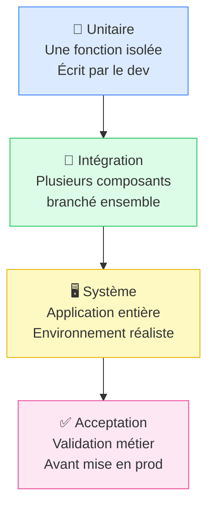
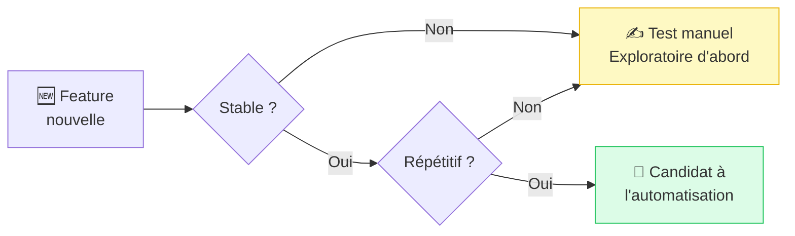

# Types de tests & stratégies

## Objectifs pédagogiques

À l'issue de ce module, vous serez capable de :

- Distinguer les quatre niveaux de tests (unitaire, intégration, système, acceptation) et identifier à quel moment chacun intervient dans un cycle de développement
- Expliquer la différence entre smoke test et test de régression, et choisir lequel déployer selon le contexte
- Sélectionner entre test exploratoire et test scripté en fonction de la situation et de l'objectif
- Arbitrer entre tests manuels et tests automatisés à partir de critères concrets de stabilité et de fréquence
- Reconnaître et éviter le piège de l'automatisation prématurée

---

## Mise en situation

Vous rejoignez une équipe qui vient de livrer une nouvelle version d'une application e-commerce. Le chef de projet se tourne vers vous : "Qu'est-ce qu'on teste avant de mettre en prod ?"

Sans réponse structurée, vous risquez de tester au hasard — passer des heures sur une fonctionnalité mineure, rater un bug critique sur le paiement, ou automatiser des tests qui changeront la semaine prochaine. Ce module vous donne le vocabulaire et les critères pour répondre à cette question avec méthode.

---

## Ce qu'on teste, à quel niveau, et pourquoi ça change tout

Il n'existe pas "un test". Il existe des tests à différentes altitudes — chacun répond à une question différente, cible une couche différente du système, et implique des acteurs différents.

```
Question que chaque niveau pose :
─────────────────────────────────────────────────────────────────────────────
Unitaire     → "Cette fonction fait-elle exactement ce qu'elle est censée faire ?"
Intégration  → "Ces deux composants se parlent-ils correctement ?"
Système      → "L'application entière fonctionne-t-elle bout en bout ?"
Acceptation  → "Ce que j'ai livré correspond-il à ce que le métier attendait ?"
─────────────────────────────────────────────────────────────────────────────
```

**Tests unitaires** — c'est la responsabilité principale du développeur. On teste une fonction, une méthode, une classe en isolation totale. Si la fonction `calculer_remise(prix, taux)` retourne `90` pour une entrée `(100, 0.1)`, le test passe. Le reste de l'application n'existe pas à ce stade.

**Tests d'intégration** — on commence à brancher les pièces ensemble. Est-ce que la couche base de données répond bien aux requêtes de la couche service ? Est-ce que l'API externe retourne ce qu'on attend ? Ces tests attrapent les problèmes qui n'existent pas dans le vide mais qui surgissent dès que deux composants interagissent.

**Tests système** — on teste l'application dans son ensemble, dans un environnement qui ressemble à la production. Un utilisateur se connecte, ajoute un produit au panier, passe commande. Est-ce que tout le flux tient ? C'est souvent à ce niveau que le testeur QA intervient le plus directement.

**Tests d'acceptation (UAT)** — le métier prend le relais. On vérifie que ce qui a été livré correspond aux besoins exprimés. C'est la dernière porte avant la production. Un test peut passer techniquement et échouer ici parce qu'on a mal compris la demande initiale.



🧠 Plus on monte dans les niveaux, plus les tests sont lents, coûteux à maintenir et difficiles à déboguer quand ils échouent. Un bug attrapé au niveau unitaire coûte environ dix fois moins cher à corriger qu'un bug découvert en acceptation. C'est la raison d'être de la pyramide de tests : attraper les problèmes le plus tôt possible, là où le coût de correction est le plus faible.

---

## Smoke test vs test de régression : deux usages, deux moments

Ces deux types de tests sont souvent confondus par les débutants — et pourtant ils répondent à des questions radicalement différentes, à des moments différents du cycle.

### Le smoke test : "Est-ce que ça tient debout ?"

Un smoke test est un test rapide qui vérifie que les fonctions critiques d'une application sont opérationnelles après un déploiement. L'objectif n'est pas la couverture, c'est la rapidité. Si le smoke test échoue, inutile d'aller plus loin — on rollback et on reporte.

L'analogie vient de l'électronique : quand on branche un circuit pour la première fois, on regarde s'il fume. Si ça fume, on coupe tout. Pareil ici.

Concrètement, un smoke test sur une application e-commerce ressemblerait à :
- La page d'accueil se charge
- La connexion utilisateur fonctionne
- La recherche produit retourne des résultats
- Le tunnel de paiement s'ouvre

Cinq minutes, dix vérifications. Si tout passe, on continue les tests approfondis. Si ça échoue, on ne perd pas deux heures à tester des fonctionnalités secondaires sur une build cassée.

### Le test de régression : "Est-ce qu'on n'a rien cassé ?"

Un test de régression vise à s'assurer qu'une modification n'a pas introduit de bug dans une fonctionnalité qui fonctionnait déjà. C'est le filet de sécurité. À chaque nouvelle feature, à chaque correctif, on rejoue la suite de régression pour vérifier que rien ne s'est dégradé.

⚠️ Beaucoup de débutants pensent que "tester la nouvelle feature" suffit. Mais les bugs de régression arrivent précisément là où on ne regarde pas : une modification du système de panier peut casser le calcul des taxes, qui n'a pourtant pas été touché directement. La régression est là pour attraper exactement ça.

| Critère | Smoke test | Test de régression |
|---|---|---|
| **Quand ?** | Après chaque déploiement | Après chaque modification du code |
| **Objectif** | Valider que le système démarre | Valider que l'existant n'est pas cassé |
| **Durée** | Très court (5–15 min) | Variable, peut être long |
| **Couverture** | Fonctions critiques uniquement | Ensemble du périmètre fonctionnel |
| **Si ça échoue** | On stoppe tout | On bloque la mise en prod |

Ces deux types ne sont pas substituables. Le smoke test ne remplace pas la régression, et une suite de régression complète ne dispense pas d'un smoke test rapide post-déploiement.

---

## Test exploratoire vs test scripté : intuition vs rigueur

### Le test scripté

Un test scripté, c'est un scénario écrit à l'avance, pas à pas, avec un résultat attendu défini. Exemple :

```
Étape 1 : Aller sur /login
Étape 2 : Saisir email = "user@test.com"
Étape 3 : Saisir password = "Test1234!"
Étape 4 : Cliquer sur "Se connecter"
Résultat attendu : redirection vers /dashboard, message "Bienvenue user"
```

L'avantage est clair : c'est reproductible, vérifiable, transmissible. N'importe quel testeur peut exécuter ce scénario et obtenir le même résultat. C'est indispensable pour les tests de régression — on rejoue exactement le même scénario à chaque itération.

La limite : on ne découvre que ce qu'on a pensé à tester. Et les bugs les plus intéressants vivent souvent là où personne n'a pensé à regarder.

### Le test exploratoire

Ici, pas de script préétabli. Le testeur explore l'application avec une intention, pas un chemin fixé. Il teste des chemins inattendus, essaie des données limites, combine des actions que personne n'a anticipées.

Pensez à un détective qui enquête : il a une question ("y a-t-il des failles dans ce système ?"), mais pas de procédure rigide. Il suit les indices, improvise, creuse là où quelque chose lui semble louche.

💡 Le test exploratoire est particulièrement efficace juste après une release sur un nouveau périmètre, quand un utilisateur remonte un comportement bizarre non reproduit par les tests scriptés, ou sur une zone de code peu couverte. Ce n'est pas du test au hasard — c'est du test guidé par l'expérience et le jugement, documenté après coup.

| Critère | Test scripté | Test exploratoire |
|---|---|---|
| **Planification** | Élevée | Faible |
| **Reproductibilité** | Totale | Partielle |
| **Couverture ciblée** | Ce qui est prévu | Ce qu'on découvre |
| **Idéal pour** | Régression, conformité | Discovery, nouveaux périmètres |
| **Documentation** | Avant le test | Après le test |

En pratique, les deux se complètent : les tests scriptés couvrent le périmètre connu, les tests exploratoires découvrent ce qu'on ne savait pas qu'on cherchait.

---

## Manuel vs automatisé : la question qu'on se pose trop tôt

C'est souvent la première question que posent les débutants. C'est aussi la mauvaise question de départ. La vraie question, c'est : **quand est-ce que l'automatisation rapporte vraiment ?**

### Ce que l'automatisation fait bien

Un test automatisé s'exécute en millisecondes, ne se fatigue pas, ne rate pas une étape, et peut tourner cinquante fois par jour sur une pipeline CI/CD. Sur des tests stables, répétitifs, qui doivent tourner à chaque build — l'automatisation est imbattable.

Tests de régression, smoke tests sur des features matures, tests d'API : ce sont des candidats naturels.

### Ce que le test manuel fait mieux

Un testeur humain détecte des incohérences visuelles, des flux qui "font mal à utiliser", des comportements qui ne sont pas dans les specs mais qui sont clairement faux. Il s'adapte en temps réel, change de direction si quelque chose attire son attention. Aucun script ne fait ça.

Les tests exploratoires, les tests UX, les tests sur des features en cours de développement — là, le manuel reste supérieur, quelle que soit la maturité de l'outillage.

### Le piège de l'automatisation prématurée

⚠️ Automatiser trop tôt est l'un des anti-patterns les plus coûteux en QA. Si une feature n'est pas stabilisée, ses tests automatisés devront être réécrits à chaque itération. Résultat : le testeur passe plus de temps à maintenir des scripts cassés qu'à tester réellement. La règle pratique est simple — **automatiser ce qui est stable, garder en manuel ce qui change**.



| Critère | Test manuel | Test automatisé |
|---|---|---|
| **Coût initial** | Faible | Élevé |
| **Coût de maintenance** | Faible si feature stable | Élevé si feature change |
| **Vitesse d'exécution** | Lente | Très rapide |
| **Adaptabilité** | Totale | Nulle |
| **Idéal pour** | Exploration, UX, instable | Régression, CI/CD, stable |
| **Quand éviter** | Tests très répétitifs | Features non stabilisées |

---

## Cas réel : une release e-commerce

Voici comment une équipe QA mature aborde une release sur une application de vente en ligne.

**Contexte :** une équipe de trois personnes, dont un testeur QA, doit valider l'ajout d'un système de codes promo avant mise en production. Délai : deux jours.

**Jour 1 — Tests exploratoires**

Le testeur explore la feature librement : code valide, code expiré, code avec majuscules/minuscules, code appliqué plusieurs fois, code combiné avec une remise déjà active sur un article. Il documente ce qu'il découvre — pas ce qu'il prévoyait de trouver.

Résultat concret : il découvre que l'application accepte un code promo sur un article déjà en promotion, doublant la remise. Ce cas n'était dans aucune spec. Sans session exploratoire, il passait en production.

**Jour 2 — Tests scriptés & régression**

Les scénarios principaux sont formalisés (code valide → remise appliquée, code invalide → message d'erreur clair, code expiré → rejet). La suite de régression existante est rejouée sur les fonctionnalités connexes : panier, tunnel de paiement, calcul de TVA.

**Avant déploiement :** smoke test automatisé de dix minutes sur l'environnement de staging. Tout passe → go prod.

Le bug du doublement de remise a été attrapé en jour 1, corrigé par le développeur, et couvert par un nouveau test scripté qui rejoint la suite de régression. À la prochaine release, ce cas sera automatiquement revérifié — sans effort supplémentaire.

---

## Bonnes pratiques

**Tester par ordre de risque métier, pas par facilité.** Commencer par ce qui fait le plus de dégâts si ça casse — le paiement avant la page "À propos". Avant chaque session, se poser une question : "Si je ne peux tester qu'une chose, laquelle doit absolument fonctionner ?" La réponse définit votre smoke test minimum.

**Ne pas confondre smoke test et régression.** Un smoke test rapide post-déploiement ne remplace pas une suite de régression complète. Ils ont des rôles complémentaires, pas hiérarchiques.

**Documenter les sessions exploratoires.** Même sans script, noter les chemins empruntés, les données utilisées, les comportements observés. Une session exploratoire de deux heures sans notes ne laisse aucune trace réutilisable.

**Résister à la pression d'automatiser immédiatement.** L'automatisation est un investissement — elle ne rapporte que si le test tourne souvent et reste stable assez longtemps pour amortir son coût d'écriture et de maintenance. Pour une feature qui évolue chaque sprint, l'équation ne tient pas.

**Appliquer deux critères avant d'automatiser.** Ce test tournera-t-il plus de dix fois ? La feature est-elle stable depuis au moins deux sprints ? Si les deux réponses sont "oui" → candidat à l'automatisation. Si l'une est "non" → rester en manuel.

💡 Les tests exploratoires et UX restent en manuel quelle que soit la stabilité de la feature — leur valeur repose précisément sur l'adaptabilité humaine en temps réel.

---

## Résumé

Les tests s'organisent selon quatre niveaux — unitaire, intégration, système, acceptation — qui correspondent à des questions différentes sur la qualité du logiciel, et dont le coût de correction augmente à mesure qu'on monte. En parallèle, le **smoke test** vérifie en quelques minutes que le système tient debout après un déploiement, tandis que le **test de régression** s'assure qu'une modification n'a rien cassé dans le périmètre existant. Sur le plan de la méthode, le **test scripté** garantit la reproductibilité sur un périmètre connu, et le **test exploratoire** permet de découvrir ce qu'on ne savait pas qu'on cherchait — les deux se complètent plutôt qu'ils ne s'opposent. Enfin, la décision d'automatiser doit être guidée par deux critères simples : la stabilité de la feature et la fréquence d'exécution du test. Automatiser trop tôt reste l'un des pièges les plus fréquents et les plus coûteux en QA.

---

<!-- snippet
id: qa_niveaux_tests_concept
type: concept
tech: qa
level: beginner
importance: high
format: knowledge
tags: qa,niveaux,unitaire,integration,systeme,acceptation
title: Les 4 niveaux de tests et leur question centrale
content: Chaque niveau répond à une question précise. Unitaire → "cette fonction fait-elle ce qu'elle doit ?" (isolation totale). Intégration → "ces deux composants se parlent-ils correctement ?" Système → "le flux complet fonctionne-t-il ?" Acceptation → "ce qu'on a livré correspond-il au besoin métier ?" Un bug attrapé au niveau unitaire coûte ~10x moins cher à corriger qu'en acceptation.
description: Les 4 niveaux ne sont pas interchangeables — chacun cible une couche différente de la qualité logicielle.
-->

<!-- snippet
id: qa_smoke_test_concept
type: concept
tech: qa
level: beginner
importance: high
format: knowledge
tags: qa,smoke test,deploiement,rollback
title: Smoke test — vérification rapide post-déploiement
content: Un smoke test vérifie que les fonctions critiques d'une application sont opérationnelles immédiatement après un déploiement. Durée cible : 5 à 15 min. Couverture volontairement limitée (login, page d'accueil, tunnel principal). Si le smoke test échoue → on stoppe tout et on rollback sans aller plus loin dans les tests.
description: Le smoke test répond à "est-ce que ça tient debout ?" — pas à "est-ce que tout est correct ?"
-->

<!-- snippet
id: qa_regression_vs_smoke_warning
type: warning
tech: qa
level: beginner
importance: high
format: knowledge
tags: qa,regression,smoke,confusion
title: Ne pas confondre smoke test et test de régression
content: Piège : croire que rejouer le smoke test après une modif suffit comme régression. Conséquence : des bugs de régression passent en prod sur des fonctionnalités non modifiées directement (ex : calcul des taxes cassé par une modif du panier). Correction : smoke test = sanity check rapide post-déploiement. Régression = rejouer tout le périmètre fonctionnel connu après toute modification du code.
description: Ces deux types de tests répondent à des questions différentes et ne sont pas substituables.
-->

<!-- snippet
id: qa_exploratoire_usage_tip
type: tip
tech: qa
level: beginner
importance: medium
format: knowledge
tags: qa,exploratoire,discovery,session,documentation
title: Quand utiliser le test exploratoire en priorité
content: Lancer une session exploratoire dans 3 situations : (1) juste après une release sur un nouveau périmètre, (2) quand un utilisateur remonte un comportement bizarre non reproduit par les tests scriptés, (3) sur une zone de code peu couverte. Durée recommandée : sessions de 45 à 90 min avec note des chemins empruntés et bugs trouvés. Sans documentation post-session, la valeur disparaît.
description: Le test exploratoire n'est pas du test au hasard — c'est un test guidé par l'intention, documenté après coup.
-->

<!-- snippet
id: qa_automatisation_prematuree_warning
type: warning
tech: qa
level: beginner
importance: high
format: knowledge
tags: qa,automatisation,maintenance,strategie
title: Automatiser trop tôt — le piège le plus fréquent en QA
content: Piège : automatiser une feature dès sa livraison pour "gagner du temps". Conséquence : si la feature évolue (ce qui arrive souvent), les scripts doivent être réécrits à chaque itération. Le testeur passe plus de temps à maintenir des tests cassés qu'à tester. Correction : attendre que la feature soit stabilisée (plus de changements fonctionnels sur 2 à 3 sprints) avant d'investir dans l'automatisation.
description: L'automatisation ne rapporte que si le test tourne souvent et reste stable assez longtemps pour amortir son coût d'écriture.
-->

<!-- snippet
id: qa_manuel_vs_auto_decision_tip
type: tip
tech: qa
level: beginner
importance: medium
format: knowledge
tags: qa,automatisation,manuel,decision,criteres
title: Deux critères pour décider d'automatiser un test
content: Deux questions à poser avant d'automatiser : (1) Ce test tournera-t-il plus de 10 fois ? (2) La feature est-elle stable depuis au moins 2 sprints ? Si les deux réponses sont "oui" → candidat à l'automatisation. Si l'une est "non" → rester en manuel. Pour les tests exploratoires et UX → toujours manuel, quelle que soit la stabilité de la feature.
description: L'automatisation est un investissement — elle ne vaut que si la fréquence d'exécution et la stabilité sont au rendez-vous.
-->

<!-- snippet
id: qa_scripte_vs_exploratoire_concept
type: concept
tech: qa
level: beginner
importance: medium
format: knowledge
tags: qa,test scripte,exploratoire,comparatif,complementarite
title: Test scripté vs exploratoire — ce que chacun détecte
content: Test scripté : on vérifie ce qu'on a prévu de vérifier. Reproductible à 100%, idéal pour la régression. Limite : ne découvre que ce que le testeur a imaginé. Test exploratoire : on suit l'intuition et les anomalies. Détecte les bugs inattendus et les cas aux limites non spécifiés. Limite : non reproductible sans notes de session. En pratique, les deux se complètent — le scripté couvre le périmètre connu, l'exploratoire découvre l'inconnu.
description: Les deux méthodes ne sont pas en compétition — elles répondent à des questions différentes sur la qualité du système.
-->

<!-- snippet
id: qa_priorisation_risque_tip
type: tip
tech: qa
level: beginner
importance: medium
format: knowledge
tags: qa,priorisation,risque,strategie,smoke
title: Prioriser par risque métier avant de commencer une session
content: Avant chaque session, se poser une question : "Si je ne peux tester qu'une seule chose, laquelle doit absolument fonctionner ?" La réponse définit le point de départ et le smoke test minimum. En e-commerce : paiement > panier > connexion > recherche > page d'accueil. Tester d'abord ce qui fait le plus de dégâts si ça casse, pas ce qui est le plus facile à tester.
description: La priorisation par risque métier évite de passer du temps sur des fonctionnalités secondaires pendant qu'un bug critique attend.
-->

<!-- snippet
id: qa_pyramide_tests_concept
type: concept
tech: qa
level: beginner
importance: high
format: knowledge
tags: qa,pyramide,niveaux,strategie,cout
title: Pyramide de tests — pourquoi le niveau où on attrape un bug compte
content: La pyramide de tests pose un principe simple : plus on monte en niveau (unitaire → intégration → système → acceptation), plus les tests sont lents, coûteux à écrire et difficiles à déboguer. Un bug attrapé en phase unitaire coûte ~10x moins cher à corriger qu'en acceptation, et ~50x moins qu'un bug découvert en production. La stratégie de test doit donc maximiser la détection précoce, au niveau le plus bas possible.
description: Attraper les bugs tôt n'est pas qu'une bonne pratique — c'est une décision économique qui structure toute la stratégie QA.
-->
