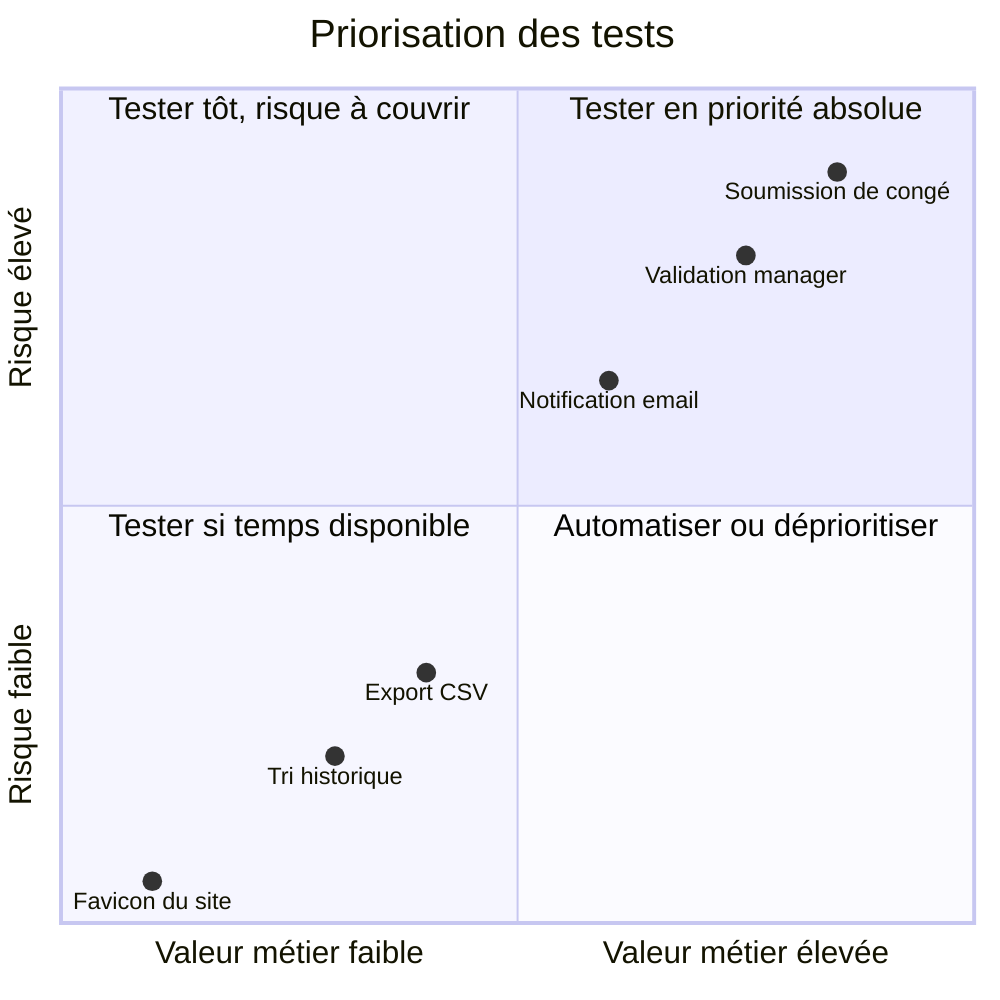

# Méthodologie de test

## Objectifs pédagogiques

À la fin de ce module, tu seras capable de :

1. **Rédiger** un cas de test structuré avec la syntaxe GIVEN / WHEN / THEN
2. **Identifier** les critères d'acceptation d'une User Story et les traduire en tests concrets
3. **Prioriser** un ensemble de tests selon le risque et la valeur métier
4. **Distinguer** un test utile d'un test qui consomme du temps sans apporter de valeur
5. **Construire** une mini-stratégie de test avant de commencer à tester

---

## Mise en situation

Imagine que tu rejoins une équipe qui développe une application de gestion de congés. Le développeur te dit : "La fonctionnalité de demande de congé est prête, tu peux tester." Tu ouvres l'application et tu commences à cliquer. Tu trouves un bug, tu le notes. Puis un autre. Après une heure, tu réalises que tu ne sais plus ce que tu as testé, ce que tu as sauté, ni si tu as couvert les cas les plus importants.

C'est exactement le piège du test sans méthode. Pas parce que tu es un mauvais testeur — mais parce qu'on t'a donné un marteau sans te dire quoi construire.

Ce module te donne la structure pour ne plus jamais tester dans le vide.

---

## Ce qu'est la méthodologie de test — et pourquoi elle existe

Tester un logiciel sans méthode, c'est comme inspecter un appartement sans liste de vérification : tu regardes les murs, tu oublies les prises, tu reviens deux fois sur la cuisine, et tu repars sans avoir vérifié la plomberie.

La méthodologie de test, c'est l'ensemble des règles et conventions qui permettent de **planifier ce qu'on va tester, documenter comment on le teste, et décider dans quel ordre**. Ce n'est pas de la bureaucratie — c'est ce qui transforme une séance de clics en travail professionnel reproductible.

Elle existe parce que les logiciels en production ont des comportements complexes, impliquent plusieurs personnes (développeurs, product owners, clients), et que les bugs trouvés **avant** la mise en production coûtent dix à cent fois moins cher que ceux trouvés après. Pour trouver les bons bugs au bon moment, il faut savoir où chercher — et ça ne s'improvise pas.

🧠 La méthodologie de test n'est pas une fin en soi. C'est un outil au service d'une décision : "est-ce que ce logiciel est prêt à être livré ?"

---

## Le cas de test : l'unité de base du travail QA

Un **cas de test** est la description structurée d'une vérification précise. Il répond à trois questions : dans quel contexte de départ est-on, quelle action est effectuée, quel résultat est attendu.

Ce n'est pas une note informelle ("tester le bouton de connexion"). C'est une fiche qui permet à n'importe qui — toi dans trois semaines, un collègue qui te remplace — de reproduire exactement le même test et d'obtenir le même verdict.

### La structure GIVEN / WHEN / THEN

C'est le format le plus utilisé dans le monde QA professionnel. Il vient du BDD (*Behavior Driven Development*), mais tu n'as pas besoin de connaître le BDD pour l'utiliser. Retiens la logique :

| Partie | Question | Rôle |
|--------|----------|------|
| **GIVEN** | Quel est le contexte de départ ? | Définir l'état du système avant l'action |
| **WHEN** | Que fait l'utilisateur ? | Décrire l'action testée |
| **THEN** | Que doit-il se passer ? | Décrire le résultat attendu, vérifiable |

Voici un exemple appliqué à la fonctionnalité de demande de congé :

```
GIVEN : Un employé est connecté à l'application avec un solde de 10 jours de congé disponibles
WHEN  : Il soumet une demande de 5 jours ouvrés pour la semaine prochaine
THEN  : La demande apparaît en statut "En attente de validation" dans son tableau de bord
         ET son solde affiche toujours 10 jours (il ne diminue qu'à la validation)
         ET le manager reçoit une notification par email
```

Ce cas est **précis**, **reproductible** et **vérifiable**. On sait exactement quoi préparer, quoi faire, et quoi observer.

⚠️ Le `THEN` vague est l'erreur la plus fréquente. "L'application fonctionne correctement" n'est pas un critère d'acceptation, c'est une impression. Un bon `THEN` contient des éléments observables : un statut, un message, une valeur numérique, un email reçu ou non.

💡 Le `GIVEN` doit être suffisamment précis pour que quelqu'un qui n'a jamais vu l'application puisse reproduire l'état de départ. Si tu dois l'expliquer verbalement, c'est qu'il est incomplet.

### Les données de test font partie du cas de test

Un cas de test sans données précises est un cas de test incomplet. Laquelle de ces deux formulations est exploitable ?

❌ "L'utilisateur a un solde de congé suffisant"  
✅ "L'utilisateur a exactement 5 jours de solde et demande 5 jours"

Le deuxième teste une **valeur limite** — et c'est là que les bugs se cachent le plus souvent. Pas au milieu du domaine de valeurs, mais aux bords.

---

## Des User Stories aux critères d'acceptation

Dans la plupart des équipes agiles, les fonctionnalités sont décrites sous forme de **User Stories** :

> "En tant qu'employé, je veux pouvoir soumettre une demande de congé depuis l'application, afin de ne plus avoir à envoyer un email à mon manager."

La User Story dit *quoi* et *pourquoi*. Elle ne dit pas *dans quelles conditions c'est validé*. C'est là qu'interviennent les **critères d'acceptation** : les conditions précises que le logiciel doit satisfaire pour que la story soit considérée comme terminée.

Un bon critère d'acceptation ressemble à ça :

- La demande ne peut pas dépasser le solde de congés disponible
- Une demande ne peut pas être soumise pour une date passée
- Le manager reçoit un email dans les 5 minutes suivant la soumission
- Si le manager n'a pas traité la demande après 48h, un rappel automatique est envoyé

Chaque critère d'acceptation produit au moins un cas de test. Souvent plusieurs, parce qu'un critère se décline en scénario nominal (ça marche) et en scénarios alternatifs (ça échoue correctement).

🧠 Tester sans critères d'acceptation, c'est tester sans cible. Tu peux passer des heures à vérifier des comportements secondaires pendant que le comportement principal n'est pas défini.

---

## Prioriser ses tests : tous les tests ne se valent pas

Une application réelle a des centaines, parfois des milliers de scénarios possibles. Tu ne pourras jamais tous les tester — pas dans le temps imparti, pas à chaque sprint. La question n'est donc pas "comment tout tester ?", mais "quoi tester en premier ?".

Deux critères guident cette décision.

**Le risque** — Si ce test échoue, quel est l'impact ? Une erreur sur le calcul du solde de congés qui affecte tous les employés chaque mois, c'est un risque élevé. Une faute de frappe dans un email de bienvenue, c'est un risque faible.

**La valeur métier** — Cette fonctionnalité est-elle centrale pour l'utilisateur ou anecdotique ? La soumission d'une demande, c'est le cœur du produit. Le tri des demandes par ordre alphabétique dans l'historique, c'est une commodité.



En pratique, voici l'ordre à suivre quand tu construis ton jeu de tests :

1. **Le chemin nominal d'abord** — le parcours utilisateur le plus courant, de bout en bout. C'est le *happy path*. S'il est cassé, tout le reste est secondaire.
2. **Les cas limites à risque élevé** — valeurs à zéro, champs vides, permissions insuffisantes. Ce sont les bugs les plus fréquents.
3. **Les cas d'erreur visibles par l'utilisateur** — les messages d'erreur doivent être clairs et guidants, pas cryptiques.
4. **Les cas cosmétiques en dernier** — couleurs, libellés, ordre d'affichage.

⚠️ Commencer par les cas limites avant d'avoir validé le cas nominal est une erreur classique. Si la fonctionnalité principale ne fonctionne pas, tester les bords est du temps perdu.

---

## Construire une stratégie de test minimale

Avant de rédiger un seul cas de test, prends cinq minutes pour répondre à ces quatre questions :

**Qu'est-ce qu'on teste ?**  
Délimite le périmètre. Pour cette itération, c'est la soumission de congé — pas la validation, pas le reporting.

**Quels sont les risques principaux ?**  
Calcul du solde, envoi de notifications, gestion des droits d'accès.

**Quelle est la couverture minimale acceptable ?**  
Le happy path + les cas de risque élevé identifiés.

**Qui valide que les tests sont complets ?**  
Idéalement, le product owner signe les critères d'acceptation. Sinon, écris-les toi-même avant de commencer.

Ce n'est pas un plan formel de vingt pages. C'est un cadrage de dix minutes qui t'évite de passer trois heures sur des détails secondaires pendant que le bug critique t'attendait à la première page.

---

## Cas réel : tester une page de connexion de bout en bout

Prenons un exemple simple et universel pour voir comment la méthode s'applique concrètement.

**User Story :**
> "En tant qu'utilisateur, je veux me connecter avec mon email et mon mot de passe pour accéder à mon espace personnel."

**Critères d'acceptation identifiés :**
- Connexion réussie avec des identifiants valides → redirection vers le tableau de bord
- Email ou mot de passe incorrect → message d'erreur générique (ne pas préciser lequel des deux est faux)
- Compte bloqué après 5 tentatives échouées
- Le mot de passe n'est pas visible en clair dans le champ de saisie

Ces quatre critères génèrent cinq cas de test, couvrant le nominal, les erreurs courantes et un comportement de sécurité :

| # | GIVEN | WHEN | THEN | Priorité |
|---|-------|------|------|----------|
| 1 | Compte actif existant | Saisit email + mot de passe corrects → clique "Se connecter" | Redirigé vers le tableau de bord | 🔴 Haute |
| 2 | Compte actif existant | Saisit un mot de passe incorrect | Message "Email ou mot de passe incorrect", reste sur la page | 🔴 Haute |
| 3 | Compte actif existant | Échoue 5 fois consécutives | Message "Compte bloqué, contactez l'administrateur" | 🟠 Moyenne |
| 4 | Page de connexion affichée | Saisit un mot de passe | Les caractères apparaissent masqués (points) | 🟠 Moyenne |
| 5 | Page de connexion affichée | Soumet le formulaire avec les deux champs vides | Messages d'erreur sur les champs requis | 🟡 Basse |

Ce tableau garantit qu'on teste les bons comportements dans le bon ordre, avec des critères vérifiables par n'importe qui.

---

## Bonnes pratiques — et pièges à éviter

**Un cas de test = une seule vérification.** Si ton `THEN` liste cinq conditions sur des fonctionnalités différentes, c'est probablement deux ou trois cas de test distincts. Un test qui échoue doit indiquer immédiatement *quoi* a échoué — pas juste "quelque chose ne va pas".

**Rédige les cas de test avant d'ouvrir l'application.** Ça paraît contre-intuitif, mais c'est là que tu identifies les trous dans les critères d'acceptation. En cliquant, tu te laisses guider par ce que tu vois — pas par ce qui doit être vérifié.

**Teste le comportement, pas l'implémentation.** Tu ne t'intéresses pas à *comment* le système calcule le solde, mais à *ce qu'il affiche* après la soumission. L'implémentation peut changer ; le comportement attendu, lui, est défini par les critères.

**Les cas négatifs sont aussi critiques que les cas nominaux.** Ce qui doit échouer proprement est aussi important que ce qui doit fonctionner. Un formulaire qui plante silencieusement au lieu d'afficher un message d'erreur clair, c'est un bug — et souvent un bug qui impacte davantage l'utilisateur qu'une fonctionnalité secondaire absente.

**Documente les données de test utilisées.** Valeur exacte du solde, email précis, nombre de tentatives : ces détails semblent anodins jusqu'au moment où tu dois rejouer le test six mois plus tard et que tu ne sais plus dans quel état était le compte.

💡 Quand tu manques de temps et que tu dois couper des tests, coupe depuis le bas de ta liste de priorité — jamais depuis le haut. Ça semble évident dit comme ça, mais dans le stress d'un sprint, on a tendance à tester ce qui est facile plutôt que ce qui est important.

---

## Résumé

La méthodologie de test, c'est ce qui sépare "j'ai cliqué partout" de "j'ai couvert les comportements critiques de manière traçable". Son fondement est simple : des **cas de test structurés** (GIVEN / WHEN / THEN) dérivés de **critères d'acceptation** clairs, **priorisés** selon le risque et la valeur métier.

Un cas de test efficace est précis dans son contexte de départ, univoque dans son action, et objectif dans son résultat attendu. Il peut être rejoué par n'importe qui, à n'importe quel moment, et produire le même verdict.

Tester sans stratégie, c'est avancer à l'aveugle avec un sentiment de productivité. Tester avec une méthode, même légère, c'est s'assurer qu'on cherche les bugs là où ils font le plus mal — avant qu'ils atteignent les utilisateurs.

La prochaine étape naturelle : les outils qui permettent de gérer ces cas de test en équipe, de les relier aux tickets de suivi, et d'en suivre le statut dans le temps.

---

<!-- snippet
id: qa_gwt_structure
type: concept
tech: qa
level: beginner
importance: high
format: knowledge
tags: cas-de-test,given-when-then,bdd,methodologie,qa
title: Structure GIVEN / WHEN / THEN d'un cas de test
content: Un cas de test GIVEN/WHEN/THEN découpe la vérification en 3 parties : GIVEN = état initial du système avant l'action (contexte précis, données incluses) ; WHEN = action unique effectuée par l'utilisateur ou le système ; THEN = résultat observable attendu (valeur, statut, message). Cette structure garantit la reproductibilité : n'importe qui peut rejouer le test et obtenir le même verdict.
description: Format universel pour écrire des cas de test lisibles, reproductibles et vérifiables — le THEN doit être observable, pas subjectif.
-->

<!-- snippet
id: qa_then_vague_warning
type: warning
tech: qa
level: beginner
importance: high
format: knowledge
tags: cas-de-test,given-when-then,critères,antipattern,qa
title: THEN vague = test inutile
content: Piège : écrire THEN "L'application fonctionne correctement" ou "Le comportement est normal". Ces formulations sont invérifiables : deux personnes peuvent avoir deux avis différents sur ce qui est "normal". Conséquence : le test ne peut pas produire un verdict objectif. Correction : le THEN doit contenir un élément observable et précis — un statut affiché, un email reçu, une valeur numérique, un message d'erreur exact.
description: Un critère d'acceptation vague rend le test non-reproductible. Toujours formuler le THEN avec une observation concrète et mesurable.
-->

<!-- snippet
id: qa_acceptance_criteria_source
type: concept
tech: qa
level: beginner
importance: high
format: knowledge
tags: critères-acceptation,user-story,qa,methodologie
title: User Story → Critères d'acceptation → Cas de tests
content: Une User Story dit QUOI et POURQUOI — pas dans quelles conditions c'est validé. Les critères d'acceptation comblent ce vide : ce sont les conditions précises et vérifiables que le logiciel doit satisfaire. Chaque critère produit au moins 1 cas de test nominal + souvent 1 à 2 cas alternatifs (erreur, limite). Sans critères définis, tester revient à viser sans cible.
description: Les critères d'acceptation sont la source directe des cas de test. Tester sans eux, c'est couvrir ce qu'on imagine important — pas ce qui l'est réellement.
-->

<!-- snippet
id: qa_prioritization_risk_value
type: concept
tech: qa
level: beginner
importance: high
format: knowledge
tags: priorisation,risque,valeur-metier,strategie,qa
title: Prioriser les tests : risque × valeur métier
content: Deux axes guident la priorisation. Risque : si ce test échoue, quel est l'impact ? (données corrompues, blocage utilisateur, perte financière). Valeur métier : cette fonctionnalité est-elle centrale au produit ou anecdotique ? On teste en priorité absolue ce qui est à la fois à risque élevé ET à valeur métier élevée. Les cas cosmétiques (libellés, ordre d'affichage) passent en dernier.
description: Quand le temps manque, couper depuis le bas de la liste de priorité — jamais depuis le haut. Risque × valeur métier guide l'ordre.
-->

<!-- snippet
id: qa_happy_path_first
type: tip
tech: qa
level: beginner
importance: high
format: knowledge
tags: priorisation,happy-path,strategie,qa,ordre
title: Commencer par le happy path avant les cas limites
content: Avant de tester les cas d'erreur ou les valeurs limites, valide le parcours nominal (happy path) de bout en bout. Si la fonctionnalité principale est cassée, tester les cas limites est du temps perdu. Exemple : pour une demande de congé, vérifier d'abord qu'une soumission valide crée bien la demande et notifie le manager — puis tester le cas "solde insuffisant".
description: Un cas limite qui passe alors que le cas nominal est cassé ne protège personne. Happy path en premier, toujours.
-->

<!-- snippet
id: qa_one_test_one_check
type: tip
tech: qa
level: beginner
importance: medium
format: knowledge
tags: cas-de-test,bonne-pratique,qa,methodologie
title: 1 cas de test = 1 seule vérification
content: Si le THEN d'un cas de test liste 4 ou 5 conditions portant sur des comportements différents, c'est probablement 2 ou 3 cas de test distincts. Un test qui échoue doit indiquer immédiatement QUOI a échoué. Avec un THEN composite, on sait qu'il y a un problème — pas lequel. Découper en cas atomiques facilite le diagnostic et la maintenance.
description: Un cas de test trop large masque l'origine des échecs. Viser l'atomicité : une action → un résultat attendu.
-->

<!-- snippet
id: qa_negative_cases_importance
type: tip
tech: qa
level: beginner
importance: medium
format: knowledge
tags: cas-negatif,erreur,strategie,qa,robustesse
title: Tester ce qui doit échouer proprement
content: Les cas négatifs (mot de passe incorrect, champ vide, droits insuffisants) sont aussi critiques que les cas nominaux. Un formulaire qui plante silencieusement au lieu d'afficher un message d'erreur clair est un bug. Pour chaque critère d'acceptation, se poser la question : "Que se passe-t-il si l'entrée est invalide ?" et rédiger au moins un cas de test dédié.
description: Un système qui échoue silencieusement ou avec un message cryptique nuit autant à l'expérience utilisateur qu'une fonctionnalité absente.
-->

<!-- snippet
id: qa_write_tests_before_testing
type: tip
tech: qa
level: beginner
importance: medium
format: knowledge
tags: methodologie,cas-de-test,planification,qa
title: Rédiger les cas de test avant de commencer à tester
content: Rédiger les cas de test AVANT d'ouvrir l'application force à lire les critères d'acceptation attentivement — et révèle les zones floues ou manquantes avant de les découvrir en testant. En pratique : ouvrir la User Story, lister les critères, traduire chaque critère en GIVEN/WHEN/THEN, identifier les données de test nécessaires. Puis seulement, ouvrir l'application.
description: La rédaction préalable des cas de test révèle les ambiguïtés des specs — avant qu'elles deviennent des bugs non détectés en production.
-->

<!-- snippet
id: qa_test_data_precision
type: tip
tech: qa
level: beginner
importance: medium
format: knowledge
tags: données-de-test,cas-de-test,methodologie,qa,reproductibilité
title: Documenter les données de test avec précision
content: Les données de test vagues rendent un cas de test non-reproductible. "Un utilisateur avec un solde suffisant" ne dit pas dans quel état préparer le système. Toujours préciser les valeurs exactes : solde = 5 jours, email = testeur@exemple.com, nombre de tentatives = 4. Ces détails semblent anodins jusqu'au moment où le test doit être rejoué 6 mois plus tard par quelqu'un d'autre.
description: Des données de test précises sont aussi importantes que la formulation du THEN. Sans elles, la reproductibilité du cas n'est pas garantie.
-->

<!-- snippet
id: qa_test_behavior_not_implementation
type: concept
tech: qa
level: beginner
importance: medium
format: knowledge
tags: comportement,implémentation,cas-de-test,qa,methodologie
title: Tester le comportement, pas l'implémentation
content: Un cas de test QA ne s'intéresse pas à comment le système produit un résultat, mais à ce qu'il produit. Le calcul interne du solde de congés peut changer — ce qui compte, c'est que le solde affiché après soumission soit correct. Cette distinction protège les cas de test contre les refactorisations techniques : si le comportement visible reste identique, les tests restent valides.
description: Formuler les cas de test en termes d'effets observables, pas de mécanismes internes. L'implémentation change ; le comportement attendu, lui, est défini par les critères.
-->
