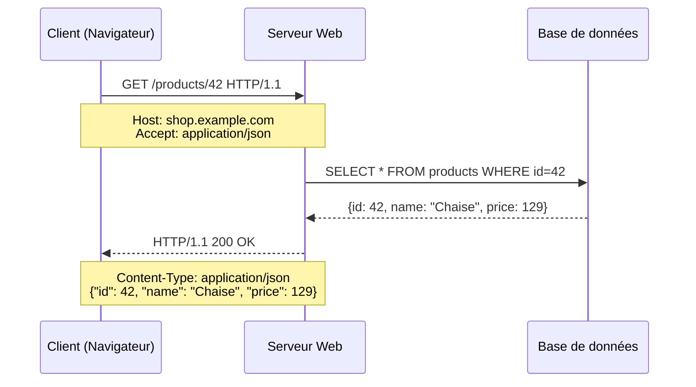

# HTTP & Web fundamentals

## Objectifs pédagogiques

À l'issue de ce module, tu seras capable de :

- Expliquer ce qu'est une requête HTTP et ce que contient une réponse
- Lire et interpréter les codes de statut HTTP dans un contexte de test
- Identifier les headers utiles pour déboguer un comportement inattendu
- Utiliser l'onglet Network des DevTools pour analyser les échanges entre navigateur et serveur
- Distinguer une requête GET d'une requête POST et en tirer des implications concrètes pour tes tests

---

## Mise en situation

Tu rejoins une équipe QA sur une application e-commerce. Le client signale un bug : après avoir cliqué sur "Passer la commande", la page reste muette — ou affiche une erreur vague, sans aucun message explicite côté interface.

Ton premier réflexe : ouvrir les DevTools, aller dans l'onglet **Network**, et regarder ce qui s'est passé au niveau HTTP. La requête est-elle partie ? Quel code de réponse a été renvoyé ? Le serveur a-t-il reçu les bonnes données ?

Sans comprendre HTTP, tu es bloqué. Avec, tu peux déjà isoler si le problème vient du frontend, du backend, ou de la communication entre les deux — avant même d'impliquer un développeur.

---

## Contexte et problématique

Toute application web repose sur un principe simple : un **client** (navigateur, app mobile, Postman) envoie une **requête** à un **serveur**, et le serveur renvoie une **réponse**. Ce dialogue suit le protocole HTTP.

En tant que testeur, tu n'as pas besoin de savoir coder HTTP à la main. Mais tu dois comprendre ce que tu lis quand tu ouvres les DevTools ou Postman — parce que c'est là que se cachent 80 % des informations utiles pour reproduire et qualifier un bug.

Le problème classique du testeur débutant : il voit "erreur 500" sans savoir ce que ça signifie, ou il ne remarque pas qu'une requête s'est terminée en 200 alors qu'elle aurait dû échouer. HTTP, c'est le langage que parle l'application — autant le comprendre.

---

## HTTP dans la pile web

HTTP se situe au niveau applicatif. Concrètement, quand tu tapes une URL ou cliques sur un bouton, voici ce qui se passe en coulisses :



Ce cycle requête → traitement → réponse se produit pour **chaque ressource chargée** : la page HTML, les images, les scripts JS, les appels API. Ouvre DevTools sur n'importe quel site — tu verras parfois des dizaines d'échanges HTTP pour une seule page.

💡 HTTP est un protocole **sans état** (*stateless*). Le serveur ne se souvient pas de toi entre deux requêtes. C'est pour ça qu'il y a des cookies et des tokens d'authentification : ils permettent au client de se "présenter" à chaque nouvelle requête.

---

## Anatomie d'une requête HTTP

Une requête HTTP est un message structuré en trois parties. Exemple concret :

```
POST /api/orders HTTP/1.1
Host: shop.example.com
Content-Type: application/json
Authorization: Bearer eyJhbGci...

{
  "product_id": 42,
  "quantity": 2,
  "address_id": 7
}
```

**La ligne de départ** — `POST /api/orders HTTP/1.1` — concentre trois informations :
- La **méthode** : ce qu'on veut faire (ici, créer une commande)
- Le **chemin** : la ressource ciblée sur le serveur
- La **version** du protocole

**Les en-têtes (headers)** viennent ensuite. Ce sont des métadonnées : qui envoie, dans quel format, avec quelle authentification. Le serveur s'en sert pour savoir comment traiter la requête.

**Le corps (body)** contient les données envoyées — ici les détails de la commande en JSON. Toutes les requêtes n'en ont pas : un `GET` pour récupérer une liste de produits n'a généralement pas de body.

### Les méthodes HTTP que tu rencontreras partout

| Méthode | Ce qu'elle fait | Exemple concret |
|---------|----------------|-----------------|
| `GET` | Récupère une ressource | Afficher une fiche produit |
| `POST` | Crée une ressource ou envoie des données | Soumettre un formulaire de commande |
| `PUT` | Remplace complètement une ressource | Mettre à jour un profil utilisateur |
| `PATCH` | Modifie partiellement une ressource | Changer uniquement le mot de passe |
| `DELETE` | Supprime une ressource | Retirer un article du panier |

⚠️ Un `GET` ne devrait jamais modifier des données côté serveur. Si tu découvres qu'un `GET` supprime ou crée quelque chose, c'est un bug d'architecture — à documenter immédiatement dans ton rapport de test.

---

## Anatomie d'une réponse HTTP

Le serveur répond avec un message de structure similaire :

```
HTTP/1.1 201 Created
Content-Type: application/json
Location: /api/orders/1089

{
  "order_id": 1089,
  "status": "pending",
  "total": 258.00
}
```

Ce qui change par rapport à la requête, c'est la **ligne de statut** — qui contient le fameux **code HTTP**.

### Les codes de statut : lire l'état de santé d'une réponse

Les codes se lisent par famille. Une fois que tu as compris la logique des centaines, tu peux deviner ce que veut dire un code que tu n'as jamais vu.

| Famille | Signification | Exemples courants |
|---------|--------------|-------------------|
| `2xx` | ✅ Succès | 200 OK, 201 Created, 204 No Content |
| `3xx` | 🔀 Redirection | 301 Moved Permanently, 302 Found |
| `4xx` | ❌ Erreur côté client | 400 Bad Request, 401 Unauthorized, 403 Forbidden, 404 Not Found |
| `5xx` | 💥 Erreur côté serveur | 500 Internal Server Error, 503 Service Unavailable |

🧠 La distinction `4xx` vs `5xx` est cruciale pour un testeur. Un `4xx` dit : "le problème vient de ce que tu as envoyé" (mauvaise donnée, mauvais token, ressource inexistante). Un `5xx` dit : "le serveur a planté en traitant ta requête". Ce ne sont pas les mêmes types de bugs — ni les mêmes équipes qui les corrigent.

Voici les codes que tu croiseras le plus souvent, avec ce qu'ils impliquent concrètement en test :

**200 OK** — La requête a réussi. Le body contient ce qui a été demandé. C'est le résultat attendu dans la majorité de tes cas de test positifs.

**201 Created** — Ressource créée avec succès. Tu le verras après un `POST` de création. Certaines APIs retournent 200 à la place — techniquement acceptable, mais moins précis.

**204 No Content** — Succès, mais pas de body en réponse. Fréquent après un `DELETE`. Attention : si ton frontend attend un body et reçoit un 204, ça peut planter côté JS.

**400 Bad Request** — Le serveur ne comprend pas la requête : champ manquant, format incorrect, valeur hors limites. Cas de test négatif classique.

**401 Unauthorized** — Non authentifié. Le token est absent, expiré ou invalide. À tester systématiquement sur toutes les routes protégées.

**403 Forbidden** — Authentifié, mais pas autorisé. Tu es connecté, mais tu n'as pas les droits pour cette action. Différent du 401 — deux cas de test distincts.

**404 Not Found** — La ressource n'existe pas. L'URL est fausse, ou l'objet a été supprimé.

**422 Unprocessable Entity** — La requête est syntaxiquement correcte, mais les données ne passent pas la validation métier. Exemple : une date de naissance dans le futur, ou un email déjà utilisé.

**500 Internal Server Error** — Le serveur a rencontré une erreur inattendue. En test, c'est souvent un cas non géré côté backend — un bug à reporter avec le body complet.

**503 Service Unavailable** — Le serveur est temporairement indisponible (surcharge, maintenance). Utile à observer lors de tests de performance ou de résilience.

---

## Les headers qui comptent vraiment pour un testeur

Les headers, c'est souvent la partie ignorée par les débutants — et pourtant, ils contiennent des informations critiques pour déboguer.

**Du côté de la requête :**

- `Content-Type` : format du body envoyé (`application/json`, `multipart/form-data` pour les uploads). Si ce header est absent ou incorrect, le serveur peut retourner un 400 même si les données sont bonnes.
- `Authorization` : le token d'authentification, généralement sous la forme `Bearer <token>`. Sans lui sur une route protégée, tu devrais obtenir un 401.
- `Accept` : ce que le client accepte en réponse. `application/json` demande une réponse JSON.

**Du côté de la réponse :**

- `Content-Type` : format du body renvoyé. Vérifie que c'est bien du JSON si ton application en attend.
- `Location` : après un 201 ou une redirection, indique l'URL de la ressource créée ou de la destination.
- `Set-Cookie` : le serveur pose un cookie sur le navigateur. Important pour les tests de session et d'authentification.
- `X-RateLimit-Remaining` : nombre de requêtes restantes avant d'être bloqué (rate limiting). Visible sur beaucoup d'APIs publiques.

⚠️ **Piège fréquent** : une API peut retourner un `200 OK` avec un body JSON contenant `{"error": "Invalid token"}`. Le code de statut dit "succès", mais la réponse est en réalité un échec. Toujours lire le body — pas seulement le code.

---

## Utiliser les DevTools pour observer les échanges HTTP

L'onglet **Network** des DevTools (F12 dans Chrome/Firefox) est ton meilleur allié. Voici comment l'exploiter efficacement en situation de test.

**Ouvrir DevTools avant de déclencher l'action.** Si tu ouvres après, tu rates les requêtes déjà parties. Prends l'habitude d'ouvrir DevTools, de cocher **"Preserve log"** — ça conserve les requêtes même en cas de redirection de page — puis de déclencher l'action.

**Filtrer par type.** La barre de filtres te permet de voir uniquement les appels API en cliquant sur "Fetch/XHR". Sur une page complexe, ça évite de te perdre dans les ressources statiques.

**Analyser une requête en détail.** Clique sur n'importe quelle ligne pour voir :
- L'onglet **Headers** : requête et réponse complètes
- L'onglet **Payload** (ou Request) : le body envoyé
- L'onglet **Response** : le body reçu
- L'onglet **Timing** : combien de temps a pris chaque phase (DNS, connexion, attente serveur, transfert)

Quand tu testes une fonctionnalité et que quelque chose ne marche pas, voici ta checklist rapide dans DevTools :

1. La requête est-elle partie ? Si non → le problème est côté frontend (JS, validation, événement)
2. Quel est le code de statut ?
3. Le body de la requête contient-il les bonnes données ?
4. La réponse contient-elle ce qui était attendu — ou un message d'erreur dans le body ?

💡 Le **timing** peut aussi révéler des problèmes de performance. Si le "Time to First Byte" (TTFB) dépasse 500 ms sur une requête simple, c'est un signal à noter même si la fonctionnalité semble fonctionner. Les tests de performance commencent avec ce genre d'observation.

---

## Cas réel en entreprise

**Contexte** : application de gestion RH, environ 200 utilisateurs internes. Les RH signalent que la modification d'un profil employé "ne fonctionne pas" — le formulaire est soumis, un spinner s'affiche brièvement, mais les données ne changent jamais.

**Investigation dans DevTools :**

En ouvrant l'onglet Network et en soumettant le formulaire, on observe la requête sortante :

```
PATCH /api/employees/234 HTTP/1.1
Content-Type: application/x-www-form-urlencoded   ← le problème est ici

name=Dupont&department=RH&salary=45000
```

Et la réponse du serveur :

```
HTTP/1.1 400 Bad Request
Content-Type: application/json

{
  "error": "Invalid Content-Type. Expected application/json"
}
```

Le frontend envoie les données en format formulaire classique (`application/x-www-form-urlencoded`), mais l'API attend du JSON. Le serveur rejette la requête avec un 400 — mais le frontend ignore la réponse et affiche simplement "enregistrement en cours" sans jamais signaler l'échec à l'utilisateur.

**Ce que tu reporters dans ton bug :**
- **Bug 1** : Mauvais `Content-Type` envoyé par le frontend sur `PATCH /api/employees/{id}` — attendu `application/json`, reçu `application/x-www-form-urlencoded`
- **Bug 2** : Le frontend n'affiche aucun message d'erreur lorsque le serveur renvoie un 400 — l'utilisateur croit que l'enregistrement a réussi

Sans DevTools, ce bug se décrit comme "le formulaire ne fonctionne pas". Avec DevTools, le rapport est précis, reproductible, et oriente directement chaque développeur vers sa partie du problème. Le temps d'investigation côté dev passe de plusieurs heures à quelques minutes.

---

## Bonnes pratiques

**Toujours noter le code de statut ET le contenu du body.** Un 200 avec un message d'erreur dans le body, c'est un bug. Un 500 sans contexte ne peut pas être qualifié sans lire le body. Les deux informations sont indissociables.

**Tester les cas d'erreur autant que les cas nominaux.** Que se passe-t-il si tu envoies une requête sans token ? Avec un `product_id` inexistant ? Avec un body vide ? Ces cas révèlent souvent des comportements non gérés côté serveur — et représentent des cas de test à fort retour sur investissement.

**Utiliser Postman pour isoler frontend et backend.** Quand tu ne sais pas d'où vient le problème, reproduis la requête directement dans Postman (clic droit sur la requête dans DevTools → "Copy as cURL", puis importe dans Postman). Si Postman obtient un 200 et l'interface plante → bug frontend. Si Postman obtient aussi un 500 → bug backend. L'isolation prend moins de deux minutes.

**Conserver les captures DevTools dans tes rapports de bug.** Une capture de l'onglet Network avec la requête et la réponse visibles vaut mille mots. Elle donne au développeur tout ce dont il a besoin pour reproduire sans avoir à te recontacter.

**Vérifier les headers d'authentification sur chaque route protégée.** Pour chaque fonctionnalité nécessitant une connexion, teste systématiquement : sans token, avec un token expiré, avec un token d'un autre utilisateur (test de contrôle d'accès horizontal). Ces trois cas couvrent les failles d'authentification les plus courantes.

**Distinguer 400 et 422 dans tes rapports.** Un 400 signale une requête techniquement incorrecte (format, champ manquant). Un 422 signale un échec de validation métier. Ce n'est pas le même correctif — ni la même discussion avec le Product Owner sur les règles attendues.

---

## Résumé

HTTP structure tous les échanges entre un client et un serveur : une requête porte une méthode, un chemin, des headers et parfois un body ; une réponse porte un code de statut, des headers et le résultat. Les codes se lisent par famille — 2xx pour le succès, 4xx pour les erreurs côté client, 5xx pour les erreurs côté serveur — et cette distinction oriente immédiatement l'investigation vers le bon composant.

Les headers sont souvent la clé d'un bug invisible : un mauvais `Content-Type` peut provoquer un 400 alors que les données sont parfaitement correctes. L'onglet Network des DevTools, avec "Preserve log" activé, permet d'observer l'intégralité de ces échanges en temps réel — requête, réponse, body, timing.

La prochaine étape naturelle : utiliser **Postman** pour construire et envoyer des requêtes HTTP manuellement, indépendamment du frontend — ce qui ouvre la porte aux tests d'API en profondeur.

---

<!-- snippet
id: http_statuscode_famille
type: concept
tech: http
level: beginner
importance: high
format: knowledge
tags: http,status-code,reponse,debug,qa
title: Familles de codes HTTP — lire une réponse en 2 secondes
content: Les codes HTTP se lisent par centaine : 2xx = succès (200 OK, 201 Created, 204 No Content), 3xx = redirection (301, 302), 4xx = erreur du client (400 mauvaise requête, 401 non authentifié, 403 non autorisé, 404 introuvable), 5xx = erreur serveur (500 crash, 503 indispo). En QA : 4xx → le problème vient de ce qui a été envoyé ; 5xx → le serveur a planté.
description: Distinguer 4xx (problème côté client/requête) et 5xx (problème côté serveur) oriente immédiatement vers le bon composant à investiguer.
-->

<!-- snippet
id: http_200_avec_erreur
type: warning
tech: http
level: beginner
importance: high
format: knowledge
tags: http,status-code,body,piege,qa
title: Un 200 OK peut cacher une erreur dans le body
content: Piège : certaines APIs retournent HTTP 200 avec un body {"error": "Invalid token"} ou {"success": false}. Le code de statut dit "tout va bien", le contenu dit le contraire. Si tu testes uniquement le code de statut, tu passes à côté du bug. Toujours lire le body de la réponse, pas seulement le code.
description: Ne jamais valider une réponse uniquement sur le code HTTP — lire systématiquement le body pour détecter les erreurs silencieuses.
-->

<!-- snippet
id: http_401_vs_403
type: concept
tech: http
level: beginner
importance: high
format: knowledge
tags: http,authentification,autorisation,securite,status-code
title: 401 Unauthorized vs 403 Forbidden — deux bugs différents
content: 401 = non authentifié (token absent, expiré ou invalide — l'utilisateur doit se reconnecter). 403 = authentifié mais sans les droits suffisants (mauvais rôle, mauvaise permission). En test : appeler une route protégée sans token doit donner 401 ; un utilisateur connecté sans le bon rôle doit donner 403. Si les deux retournent 200, c'est un bug de sécurité critique.
description: 401 = problème d'identité (qui es-tu ?), 403 = problème de droit (tu n'as pas accès). Deux cas de test distincts à couvrir systématiquement.
-->

<!-- snippet
id: http_methode_get_modification
type: warning
tech: http
level: beginner
importance: high
format: knowledge
tags: http,methode,get,architecture,bug
title: Un GET qui modifie des données est un bug d'architecture
content: Si appeler GET /api/orders/42/confirm crée ou modifie une commande, c'est une violation des principes HTTP. GET doit être idempotent et sans effet de bord. Conséquence : un crawler, un préchargement de lien ou un cache peut déclencher involontairement l'action. À documenter comme bug critique dans le rapport de test.
description: GET = lecture seule sans effet de bord. Toute modification déclenchée par un GET est un bug d'architecture à signaler immédiatement.
-->

<!-- snippet
id: http_devtools_preserve_log
type: tip
tech: devtools
level: beginner
importance: high
format: knowledge
tags: devtools,network,debug,navigateur,qa
title: Activer "Preserve log" avant de tester dans DevTools
content: Dans l'onglet Network des DevTools, cocher "Preserve log" avant de déclencher une action. Sans ça, si la page se recharge ou redirige, toutes les requêtes précédentes disparaissent. À faire systématiquement avant tout test impliquant une soumission de formulaire, un redirect, ou une navigation entre pages.
description: Sans "Preserve log", les requêtes disparaissent lors d'une redirection — tu rates les échanges HTTP les plus importants.
-->

<!-- snippet
id: http_content_type_requete
type: warning
tech: http
level: beginner
importance: medium
format: knowledge
tags: http,headers,content-type,body,api
title: Content-Type incorrect → 400 même si les données sont bonnes
content: Piège : envoyer {"name": "Dupont"} avec Content-Type: application/x-www-form-urlencoded au lieu de application/json fait échouer la requête avec un 400. Le serveur rejette la requête non pas à cause des données, mais parce qu'il ne comprend pas le format. Vérifier systématiquement le Content-Type dans DevTools → onglet Headers → Request Headers.
description: Le serveur refuse souvent une requête à cause d'un mauvais Content-Type, même si le body est correct — toujours vérifier ce header en cas de 400 inexpliqué.
-->

<!-- snippet
id: http_postman_isoler_frontend
type: tip
tech: postman
level: beginner
importance: medium
format: knowledge
tags: postman,api,debug,frontend,backend
title: Reproduire une requête dans Postman pour isoler frontend vs backend
content: Quand une fonctionnalité plante, copie la requête depuis DevTools (clic droit sur la requête → "Copy as cURL", puis importe dans Postman) et rejoue-la. Si Postman obtient 200 et l'interface plante → bug frontend. Si Postman obtient aussi 500 → bug backend. Cette technique isole le problème sans ambiguïté en moins de 2 minutes.
description: Rejouer une requête dans Postman permet de déterminer si le bug est côté frontend ou backend sans impliquer les développeurs des deux équipes simultanément.
-->

<!-- snippet
id: http_422_vs_400
type: concept
tech: http
level: beginner
importance: medium
format: knowledge
tags: http,status-code,validation,api,qa
title: 400 Bad Request vs 422 Unprocessable Entity
content: 400 = la requête est malformée (JSON invalide, champ manquant obligatoire, Content-Type incorrect). 422 = la requête est syntaxiquement correcte mais échoue à la validation métier (date de naissance dans le futur, email déjà utilisé, montant négatif). En test : chaque 422 correspond à une règle de validation métier à vérifier dans les critères d'acceptation.
description: 422 signale un échec de validation métier (données cohérentes mais invalides selon les règles), différent du 400 qui signale une requête techniquement incorrecte.
-->

<!-- snippet
id: http_devtools_checklist_bug
type: tip
tech: devtools
level: beginner
importance: high
format: knowledge
tags: devtools,debug,qa,network,bug-report
title: Checklist DevTools quand une fonctionnalité ne répond pas
content: 1) La requête est-elle partie ? (Si non → bug frontend, JS bloqué). 2) Quel est le code de statut ? 3) Le body de la requête contient-il les bonnes données ? (onglet Payload). 4) La réponse contient-elle un message d'erreur dans le body ? Ces 4 questions permettent de qualifier et orienter n'importe quel bug HTTP en moins de 3 minutes.
description: Ces 4 vérifications dans DevTools permettent de qualifier un bug HTTP et d'identifier le composant responsable avant même de contacter un développeur.
-->

<!-- snippet
id: http_204_no_content
type: warning
tech: http
level: beginner
importance: medium
format: knowledge
tags: http,status-code,delete,body,qa
title: 204 No Content — succès sans body, attention côté frontend
content: Le code 204 signale un succès mais sans body en réponse. Fréquent après un DELETE. Piège : si le frontend attend un body JSON pour confirmer l'action et reçoit un 204, ça peut provoquer une erreur silencieuse ou un affichage incorrect. Vérifier que le frontend gère correctement ce cas — c'est un cas de test à prévoir systématiquement après toute suppression.
description: Un 204 ne contient pas de body — si le frontend l'attend, il peut planter silencieusement. À tester explicitement après chaque DELETE.
-->
