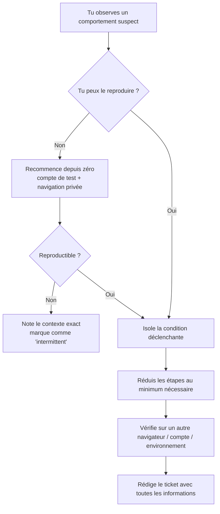
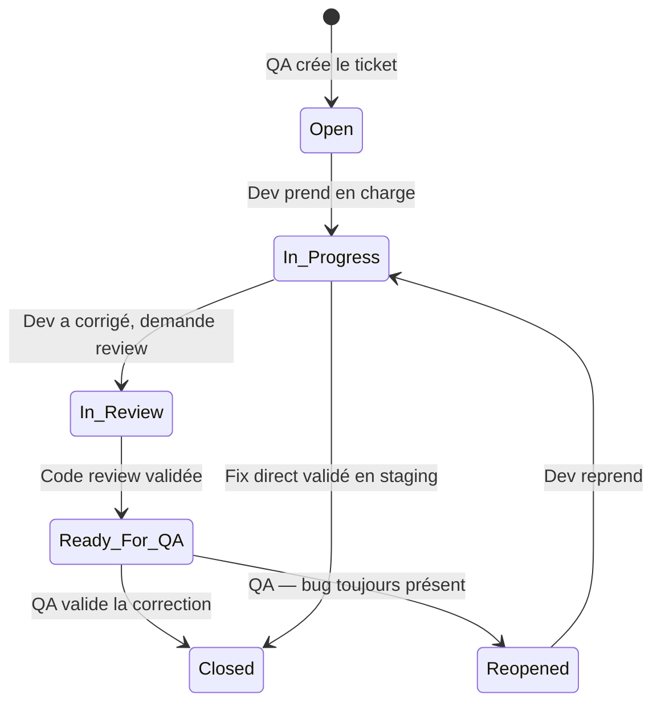

# Bugs & reporting

## Objectifs pédagogiques

À l'issue de ce module, tu seras capable de :

- Distinguer un bug d'un comportement attendu ou d'une incompréhension fonctionnelle
- Reproduire un bug de manière fiable et méthodique avant de le reporter
- Rédiger un rapport de bug immédiatement exploitable par un développeur
- Évaluer la sévérité et la priorité d'un bug avec justesse et sans biais
- Créer et suivre un ticket de bug dans Jira en respectant le workflow d'équipe

---

## Mise en situation

Tu viens de rejoindre une équipe produit en tant que QA junior. La livraison est dans trois jours. Sur la page de validation du panier, le bouton "Confirmer" ne répond pas — parfois. Parfois il répond, mais le total affiché est faux. Parfois tout va bien.

Tu reproduis le problème deux fois, tu prends une capture d'écran, et tu envoies un message Slack au développeur : *"Le bouton de validation bug parfois."*

Il te répond une heure plus tard qu'il n'arrive pas à reproduire. La livraison est toujours dans trois jours. Et le bug est toujours là.

Ce module t'apprend à éviter exactement cette situation.

---

## Ce qu'est vraiment un bug — et ce que ce n'est pas

Un bug, c'est un **écart entre le comportement réel d'une application et son comportement attendu**. Ça semble simple, mais en pratique la frontière est moins nette qu'on ne le croit.

Imagine que tu testes une application de réservation de vol. Tu saisis une date de départ dans le passé, tu valides, et l'application accepte. Est-ce un bug ? Peut-être. Ou peut-être que les specs permettent de saisir des dates passées pour des modifications de réservation existantes. Sans référence au comportement attendu, tu ne peux pas conclure.

C'est pourquoi la première question à se poser face à un comportement suspect n'est pas *"est-ce un bug ?"* mais **"quel était le comportement attendu ici ?"** Cette référence, tu la trouves dans les critères d'acceptation de la user story, les spécifications fonctionnelles, le comportement d'une version précédente stable, ou parfois simplement dans le bon sens métier — une date de naissance dans le futur, ça n'a pas de sens.

🧠 Un bug n'existe pas dans l'absolu. Il existe par rapport à une **référence**. Sans référence, tu signales une *observation*, pas un bug.

Ce qui n'est **pas** un bug :
- Une fonctionnalité absente parce qu'elle n'a jamais été développée → c'est une *feature request*
- Un comportement qui te déplaît mais qui correspond aux specs
- Une lenteur qu'on t'a dit d'ignorer pour cette version

<!-- snippet
id: qa_bug_definition
type: concept
tech: qa
level: beginner
importance: high
format: knowledge
tags: bug, définition, comportement-attendu, référence
title: Un bug existe toujours par rapport à une référence
content: Un bug = écart entre comportement réel et comportement attendu. Sans référence (critères d'acceptation, specs, comportement stable d'une version précédente), un comportement suspect est une observation, pas un bug. Avant de créer un ticket, identifier la source de référence : user story, spec fonctionnelle, ou bon sens métier (ex : date de naissance dans le futur = incohérence métier évidente).
description: Signaler un bug sans référence au comportement attendu génère des débats inutiles entre QA et dev sur ce qui est "normal".
-->

---

## Pourquoi bien reporter un bug change tout

Voici la réalité du terrain : un bug mal reporté, c'est souvent un bug jamais corrigé.

Pas par mauvaise volonté des développeurs. Mais parce qu'un ticket vague génère du travail supplémentaire : le dev doit comprendre ce que tu as vu, deviner dans quel contexte, essayer de reproduire à l'aveugle. Si ça ne marche pas du premier coup, le ticket passe en statut *"Can't reproduce"* et il repart dans la pile.

Un bon rapport de bug, c'est comme une **recette de cuisine** : si une étape est manquante ou imprécise, le plat rate — même si le cuisinier est excellent. Ton rôle en tant que QA est de rendre le travail du développeur aussi déterministe que possible. Des équipes produit qui ont formalisé leurs pratiques de reporting constatent qu'un bug bien documenté prend en moyenne **3 à 5 fois moins de temps** à corriger qu'un bug signalé de façon vague. À l'échelle d'un sprint, ça change tout.

---

## Anatomie d'un rapport de bug

Un ticket de bug bien construit contient toujours les mêmes éléments fondamentaux. Ce qui suit n'est pas une liste de cases à cocher — c'est la logique derrière chaque champ, et ce qui se passe concrètement quand il manque.

| Champ | Rôle concret | Ce qui se passe si c'est absent |
|---|---|---|
| **Titre** | Identifier le bug en un coup d'œil dans une liste de 50 tickets | Le dev perd du temps à ouvrir chaque ticket pour comprendre de quoi il s'agit |
| **Étapes de reproduction** | Permettre au dev de reproduire le bug en moins de 2 minutes | Il ne peut pas reproduire → ticket fermé |
| **Comportement observé** | Décrire exactement ce qui se passe (message d'erreur, valeur, état UI) | Interprétation subjective, risque de corriger la mauvaise chose |
| **Comportement attendu** | Ancrer la référence fonctionnelle | Sans ça, le dev peut considérer que c'est normal |
| **Environnement** | Identifier si le bug est reproductible partout ou dans un contexte précis | Correction impossible si le contexte manque |
| **Sévérité / Priorité** | Aider à prioriser dans le backlog | Le bug critique dort pendant que les mineurs sont traités |
| **Preuves** | Screenshots, vidéo, logs, HAR | Réduit le temps de diagnostic considérablement |

### Le titre : premier filtre, souvent raté

Un mauvais titre : *"Bug sur la page de commande"*. Un bon titre : *"[Panier] Le montant total n'inclut pas les frais de livraison quand un code promo est appliqué"*.

La structure à retenir : **[Zone / Composant] + comportement observé + condition déclenchante**.

<!-- snippet
id: qa_bug_titre_structure
type: tip
tech: jira
level: beginner
importance: high
format: knowledge
tags: bug, reporting, titre, jira, ticket
title: Structure d'un bon titre de ticket de bug
content: Format efficace : [Zone / Composant] + comportement observé + condition déclenchante. Ex : "[Panier] Montant total incorrect quand un code promo est appliqué avec livraison express". Évite les titres vagues comme "Bug sur la page de commande".
description: Un titre structuré permet d'identifier le bug en un coup d'œil dans une liste de 50 tickets sans avoir à les ouvrir un par un.
-->

### Les étapes de reproduction : l'élément le plus sous-estimé

C'est ici que la majorité des rapports échouent. Les étapes doivent être numérotées dans l'ordre exact, atomiques (une action par étape), et suffisamment précises pour que quelqu'un qui ne connaît pas l'application puisse les suivre sans te recontacter. Pas *"remplir le formulaire"*, mais *"saisir 'Jean' dans le champ Prénom, laisser le champ Email vide"*.

💡 Avant de rédiger tes étapes, reproduis le bug toi-même en partant de zéro et en notant chaque action. Si tu ne peux pas le reproduire deux fois de suite, note-le explicitement dans le ticket — et ne présente pas des étapes approximatives comme définitives.

<!-- snippet
id: qa_bug_reproduction_fiable
type: tip
tech: qa
level: beginner
importance: high
format: knowledge
tags: bug, reproduction, étapes, investigation
title: Reproduire un bug de manière fiable avant de le reporter
content: Avant de rédiger le ticket : reproduis le bug depuis zéro avec un compte de test en navigation privée (élimine cache/cookies). Réduis les étapes au minimum nécessaire. Si le bug est intermittent, note la fréquence (ex : "3/5 tentatives") et les variations observées. Si tu ne peux pas le reproduire deux fois, ne marque pas les étapes comme définitives.
description: Un bug non reproductible sera fermé "Can't reproduce" par le dev. La navigation privée + compte dédié élimine la majorité des faux-positifs.
-->

### Environnement : contexte technique complet

Minimum à inclure : navigateur + version, système d'exploitation, URL et environnement (dev, staging, prod), compte ou rôle utilisateur utilisé, données de test si pertinentes. Un bug reproductible uniquement sous Chrome sur macOS avec un compte admin n'a pas le même traitement qu'un bug universel.

---

## Reproduire un bug : la compétence qui te distingue

Un bug qu'on ne peut pas reproduire est un bug qu'on ne peut pas corriger. C'est la compétence la plus sous-estimée du métier — et celle qui fait immédiatement la différence entre un QA junior et un QA qui inspire confiance.



Si un bug apparaît "parfois", ta mission est de comprendre ce qui fait la différence entre "ça marche" et "ça ne marche pas". Les variables à explorer : le compte utilisateur et son historique, les données saisies (valeurs limites, caractères spéciaux, champs vides), l'ordre des actions, l'environnement (navigateur, résolution, réseau), et l'état de l'application (après une session longue, après une déconnexion).

💡 Pour les bugs intermittents, la navigation privée avec un compte de test dédié est ton premier réflexe. Ça élimine d'un coup les variables liées au cache, aux cookies et à l'état de session — et ça t'évite de reporter un "bug" qui n'est en réalité qu'un état local de ton navigateur.

---

## Sévérité vs priorité — deux notions distinctes

C'est l'une des confusions les plus fréquentes chez les QA débutants, et elle a des conséquences directes sur la gestion du backlog.

**La sévérité** mesure l'impact technique du bug sur l'application. **La priorité** mesure l'urgence métier à le corriger. Ces deux dimensions sont indépendantes — et c'est là que ça devient contre-intuitif :

| Exemple | Sévérité | Priorité | Pourquoi |
|---|---|---|---|
| L'appli crashe sur une page d'admin peu utilisée | Haute | Basse | Grave techniquement, peu d'utilisateurs concernés |
| Un texte de bouton est mal orthographié sur la home | Basse | Haute | Peu d'impact technique, visible par tous les visiteurs |
| Le paiement ne s'enregistre pas | Critique | Critique | Les deux s'alignent |
| Une icône disparaît en mobile sur un OS rare | Basse | Basse | Ni grave ni urgent |

🧠 C'est souvent au **Product Owner** de fixer la priorité, pas au QA. Ton rôle est d'évaluer la sévérité avec rigueur et de fournir les éléments qui permettent au PO de décider.

Les niveaux de sévérité courants :

- **Critique (Blocker)** — L'application est inutilisable, une fonctionnalité core est cassée, perte de données possible
- **Haute (Major)** — Fonctionnalité importante cassée, aucun contournement possible
- **Moyenne (Minor)** — Fonctionnalité cassée mais contournement possible
- **Basse (Trivial)** — Cosmétique, typo, alignement, impact négligeable

<!-- snippet
id: qa_bug_severite_priorite
type: concept
tech: qa
level: beginner
importance: high
format: knowledge
tags: bug, sévérité, priorité, backlog, jira
title: Sévérité vs priorité — deux dimensions indépendantes
content: La sévérité mesure l'impact technique (l'app crashe ? une feature est cassée ?). La priorité mesure l'urgence métier (combien d'utilisateurs sont bloqués ? est-ce visible sur la home ?). Un crash sur une page admin peu utilisée = sévérité haute, priorité basse. Une typo sur la home = sévérité basse, priorité haute. C'est souvent le PO qui fixe la priorité, pas le QA.
description: Confondre ces deux dimensions génère un backlog illisible où rien n'est vraiment priorisé.
-->

⚠️ Piège classique : marquer chaque bug comme "Critique" pour qu'il soit traité plus vite. Résultat inverse — si tout est critique, rien ne l'est. Le backlog devient illisible et l'équipe perd confiance dans ta capacité d'évaluation. C'est exactement ce qu'il ne faut pas faire si tu veux être pris au sérieux.

<!-- snippet
id: qa_bug_tout_critique
type: warning
tech: jira
level: beginner
importance: high
format: knowledge
tags: bug, sévérité, priorité, anti-pattern
title: Mettre tous les bugs en "Critique" est contre-productif
content: Piège : marquer chaque bug comme critique pour qu'il soit traité vite. Conséquence : si tout est critique, rien ne l'est — le backlog devient illisible et l'équipe perd confiance dans l'évaluation QA. Correction : évaluer la sévérité honnêtement selon l'impact réel (Blocker → fonctionnalité core cassée, Minor → contournement possible, Trivial → cosmétique).
description: Sur-évaluer la sévérité détruit la crédibilité du QA et ralentit la priorisation de l'équipe.
-->

---

## Créer un ticket dans Jira — en pratique

Jira est l'outil de gestion de tickets le plus répandu en environnement QA professionnel. Voici comment créer un ticket de bug réellement exploitable, pas juste formellement correct.

**1.** Bouton **"+ Create"** en haut de l'interface → sélectionne le type **"Bug"** (pas "Task" ni "Story").

**2.** Remplis les champs essentiels :

```
Titre :
[Panier] Montant total incorrect quand un code promo est appliqué avec livraison express

Description :

## Contexte
Sur la page de validation du panier, le montant total affiché n'inclut pas les frais
de livraison quand un code promo de type "% de réduction" est actif.

## Étapes de reproduction
1. Se connecter avec le compte test_user@example.com (mot de passe : Test1234!)
2. Ajouter le produit "Chaise ergonomique ref. CH-42" au panier
3. Aller sur la page panier (https://staging.example.com/cart)
4. Saisir le code promo "PROMO20" dans le champ dédié
5. Sélectionner le mode de livraison "Express 24h" (9,90€)
6. Observer le montant total affiché

## Comportement observé
Le montant total affiche 143,20€ (prix produit avec réduction, sans frais de livraison)
Capture d'écran jointe : cart_bug_2024.png

## Comportement attendu
Le montant total devrait afficher 153,10€ (143,20€ + 9,90€ de livraison)

## Environnement
- Navigateur : Chrome 124.0 / macOS Sonoma 14.4
- Environnement : Staging (https://staging.example.com)
- Compte : test_user@example.com (rôle : utilisateur standard)
- Date : 2024-05-15, 14h32

## Éléments joints
- Screenshot : cart_bug_2024.png
- Console errors : aucune
- Reproductible : Oui, 3/3 fois
```

**3.** Remplis les métadonnées :
- Sévérité : **Major**
- Priorité : **High** (à valider avec le PO)
- Version affectée : `2.4.1-staging`
- Assigné à : laisser vide si l'équipe gère elle-même les assignations
- Labels : `panier`, `pricing`, `regression`

**4.** Attache les preuves — screenshot annoté, vidéo, logs, fichier HAR si c'est un bug réseau.

---

## Ce qu'on joint à un ticket de bug

Les preuves, c'est ce qui transforme un ticket "à investiguer" en ticket "à corriger directement". Les types utiles selon le contexte :

**Screenshot** — Pour tout bug visuel ou état d'interface. Annote avec des flèches ou encadrés rouges pour pointer exactement l'anomalie. Une capture floue qui montre toute la page sans mettre en évidence le problème force le dev à chercher lui-même ce qui cloche.

**Vidéo / GIF** — Indispensable pour les bugs intermittents ou ceux qui impliquent une séquence d'actions. Outils : Loom, Kap (macOS), ShareX (Windows).

**Console DevTools** — Ouvre les DevTools (F12), onglet Console. Si des erreurs JavaScript apparaissent au moment du bug, copie-les en intégralité. Un `TypeError: Cannot read properties of undefined (reading 'price') at cart.js:142` dit beaucoup plus qu'une capture d'écran et permet au dev de localiser la cause sans investigation préalable.

**Onglet Network** — Pour les bugs d'API ou de données incorrectes. Filtre par XHR/Fetch, identifie la requête concernée, note le status code (400 ? 500 ?) et la réponse reçue.

**Logs applicatifs** — Si tu as accès à Kibana, Datadog ou équivalent, l'identifiant de requête ou le timestamp exact du bug est une information précieuse pour le dev.

<!-- snippet
id: qa_bug_preuve_console
type: tip
tech: devtools
level: beginner
importance: medium
format: knowledge
tags: bug, devtools, console, preuve, javascript
title: Copier les erreurs console DevTools dans le ticket de bug
content: F12 → onglet Console → reproduis le bug → copie le message d'erreur complet (ex : "TypeError: Cannot read properties of undefined (reading 'price') at cart.js:142"). Un message d'erreur JS précis permet au dev de localiser la cause sans investiguer. Plus utile qu'un screenshot seul.
description: Une erreur console bien copiée peut réduire le temps de diagnostic de plusieurs heures.
-->

---

## Le cycle de vie d'un bug dans une équipe

Un ticket de bug ne se crée pas et ne se ferme pas tout seul. Il passe par des états successifs, et en tant que QA, tu interviens à deux moments clés.



**À l'ouverture** — Tu crées le ticket avec toutes les informations. Tu t'assures qu'il est assigné à la bonne personne ou placé dans le bon sprint.

**À la vérification** — Quand le dev marque le bug comme corrigé, tu reprends tes étapes de reproduction dans l'environnement de staging ou de recette. Si c'est corrigé → tu fermes le ticket. Si le bug persiste → tu le **réouvres** avec une note explicite. Ne crée jamais un nouveau ticket pour le même bug : l'historique (commentaires, contexte, fix tenté) reste accessible au même endroit, et le dev voit immédiatement que sa correction n'a pas fonctionné.

💡 Quand tu vérifies une correction, teste aussi les cas adjacents. Un fix peut corriger le bug signalé et en introduire un autre juste à côté — c'est ce qu'on appelle une **régression**.

<!-- snippet
id: qa_bug_reouverture
type: tip
tech: jira
level: beginner
importance: medium
format: knowledge
tags: bug, jira, workflow, vérification, réouverture
title: Réouvrir un ticket existant plutôt que d'en créer un nouveau
content: Quand tu vérifies une correction et que le bug persiste → rouvre le ticket original avec une note ("Toujours reproductible en staging v2.4.2, étapes identiques"). Ne crée jamais un nouveau ticket pour le même bug. Les infos historiques (commentaires, contexte, fix tenté) restent accessibles et le dev voit immédiatement que sa correction n'a pas fonctionné.
description: Créer un doublon fragmente l'historique et fait perdre du temps à toute l'équipe.
-->

---

## Bonnes pratiques et pièges à éviter

**Un bug = un ticket.** Ne regroupe jamais deux bugs distincts dans le même ticket, même s'ils semblent liés. Si la correction de l'un ne corrige pas l'autre, le suivi devient impossible. Utilise les liens Jira ("relates to") pour relier des tickets connexes sans les fusionner.

<!-- snippet
id: qa_bug_un_ticket_un_bug
type: warning
tech: jira
level: beginner
importance: medium
format: knowledge
tags: bug, ticket, jira, organisation
title: Un bug = un ticket — ne jamais regrouper
content: Piège : regrouper deux bugs liés dans un seul ticket ("le total est faux ET le bouton ne répond pas"). Conséquence : si un seul des deux est corrigé, l'état du ticket devient ambigu et le suivi impossible. Correction : créer un ticket distinct par comportement anormal, même si les bugs semblent liés. Utilise les liens Jira (ex : "relates to") pour relier les tickets connexes.
description: Un ticket = une correction = une vérification. Mélanger deux bugs brise le cycle de vie du ticket.
-->

**Ne jamais reporter "de mémoire".** Si tu observes un bug, documente-le immédiatement. Les détails s'effacent vite et tu risques d'oublier un élément clé des étapes de reproduction.

**Neutralité dans la rédaction.** Un ticket de bug n'est pas l'endroit pour exprimer une frustration. Reste factuel. *"Le bouton ne répond pas"* est une observation. *"Le bouton est complètement cassé comme d'habitude"* est une friction inutile qui nuit à la collaboration.

**Toujours vérifier si le bug existe déjà.** Avant de créer un ticket, cherche dans Jira si un ticket similaire existe déjà. Un doublon crée de la confusion et fragmente les informations utiles.

**Évite le bug farming.** Reporter 50 bugs mineurs la veille d'une livraison parce que tu viens de les trouver est une mauvaise pratique. Un bug cosmétique découvert en phase de finition peut être reporté à la prochaine version si l'équipe le décide. La priorisation continue fait partie du travail QA.

---

## Résumé

Un bug est un écart entre le comportement réel et le comportement attendu — sans référence fonctionnelle claire, tu ne peux pas affirmer qu'un comportement est un bug. Bien reporter, c'est permettre à un développeur de reproduire, comprendre et corriger sans avoir à te recontacter. Un bon ticket repose sur des étapes de reproduction précises, une description factuelle de l'observé et de l'attendu, l'environnement complet et des preuves visuelles ou techniques. La sévérité mesure l'impact technique, la priorité mesure l'urgence métier — les deux sont indépendantes et confondre ces deux notions rend le backlog ingérable. Dans Jira, un bug suit un cycle de vie que le QA accompagne à l'ouverture et à la vérification. La prochaine étape est d'apprendre à collecter des preuves techniques plus solides avec les DevTools du navigateur.
