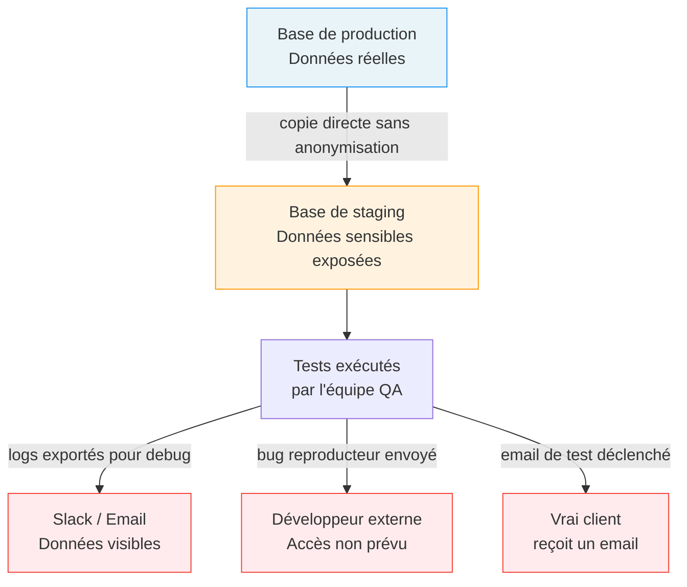

# Gestion des données de test

## Objectifs pédagogiques

À la fin de ce module, tu seras capable de :

1. **Expliquer** pourquoi les données de test sont aussi importantes que les cas de test eux-mêmes
2. **Identifier** les trois grandes catégories de données utilisables en test et leurs cas d'usage respectifs
3. **Reconnaître** les risques concrets liés à l'utilisation de données de production non anonymisées
4. **Choisir** la bonne stratégie de données selon le type de test à réaliser
5. **Préparer** un jeu de fixtures simple, nommé correctement et réutilisable

---

## Mise en situation

Tu rejoins l'équipe QA d'une startup qui gère une plateforme de réservation de voyages. Première mission : tester le module de paiement avant la mise en production d'une nouvelle version.

Le développeur te dit "tu peux utiliser la base de prod pour tes tests, elle a plein de données". Deux heures plus tard, un vrai client reçoit un email de confirmation pour une réservation fantôme. Le responsable technique reçoit un appel de la CNIL.

Ce scénario n'est pas inventé. Il arrive régulièrement dans des équipes qui n'ont pas encore formalisé leur gestion des données de test. Ce module est là pour éviter ça.

---

## Pourquoi les données de test, c'est sérieux

Quand on débute en QA, on se concentre naturellement sur les cas de test : est-ce que le formulaire valide bien le bon format d'email ? Est-ce que le bouton "Commander" déclenche bien la commande ? C'est logique. Mais il y a une question qu'on oublie presque toujours : **avec quelles données tester tout ça ?**

Un test, c'est toujours trois choses : un scénario, un environnement, et des données. Retire l'une de ces trois jambes, le tabouret tombe.

Les données de test posent deux problèmes distincts qui se cumulent souvent.

**Le problème de la qualité** : si tes données sont incomplètes ou ne couvrent pas les cas limites, tes tests passeront alors que le code est buggé. Tu testes avec un utilisateur qui a toujours un profil complet, mais l'application plante dès qu'un champ optionnel est vide — ton test ne l'a jamais vu venir.

**Le problème de la conformité** : si tes données contiennent de vraies informations personnelles (noms, emails, numéros de carte bancaire), tu crées un risque RGPD dès que ces données circulent dans des environnements non sécurisés — bases de dev, logs accessibles à l'équipe entière, emails de test qui partent vraiment.

Les deux problèmes ont des solutions différentes, mais ils partagent la même cause : on n'a pas réfléchi aux données avant de tester.

---

## Les trois types de données — et quand utiliser chacun

Une donnée de test, c'est n'importe quelle information utilisée pour alimenter un test : un utilisateur, une commande, un fichier importé, une configuration, un token d'authentification. Tout ce que l'application consomme pour fonctionner.

On distingue trois grandes catégories, et le choix entre elles dépend du contexte — ce n'est pas "utilise l'une ou l'autre", c'est "sais-tu laquelle choisir selon la situation".

| Catégorie | Description | Quand l'utiliser |
|---|---|---|
| **Fixtures** | Jeux de données préparés à l'avance, stockés en fichier | Tests fonctionnels avec un contexte précis et reproductible |
| **Données générées** | Créées dynamiquement au moment du test | Cas d'unicité : email d'inscription, token, numéro de commande |
| **Données de prod anonymisées** | Copies réelles dont les informations sensibles ont été remplacées | Tests de migration, algorithmes, règles métier complexes |

### Les fixtures : la base de tout

Une fixture, c'est un jeu de données préparé à l'avance qui sert de "décor de scène" pour tes tests. Tu sais exactement ce qu'il contient, tu peux le réinitialiser à tout moment, et il couvre précisément les cas dont tu as besoin.

Imagine que tu testes une fonctionnalité de gestion de panier. Tu as besoin d'un utilisateur avec un compte valide, d'un autre avec un compte expiré, d'un produit en stock, d'un produit hors stock, d'une promotion active et d'une expirée. Tu pourrais créer tout ça à la main avant chaque test. Ou tu peux le définir une fois dans un fichier et l'injecter systématiquement avant chaque exécution. C'est ça, une fixture.

```json
// fixtures/products.json
[
  { "id": 1, "name": "Sac de voyage", "stock": 10, "price": 49.90 },
  { "id": 2, "name": "Valise cabine", "stock": 0, "price": 89.00 },
  { "id": 3, "name": "Couverture voyage", "stock": 3, "price": 19.90 }
]
```

💡 Nomme tes fixtures avec l'état qu'elles représentent, pas juste leur contenu. `product_out_of_stock.json` est plus explicite que `product_2.json`. Dans six mois, tu seras content de ne pas avoir à ouvrir le fichier pour comprendre à quoi il sert.

### La génération dynamique : pour les cas d'unicité

Certains tests nécessitent des données qui ne peuvent pas être réutilisées : un email d'inscription (un email ne peut exister qu'une fois en base), un numéro de commande, un token de reset de mot de passe.

Pour ces cas, on génère les données à la volée, avec suffisamment d'entropie pour éviter les collisions.

```python
import uuid
from datetime import datetime

def generate_test_user():
    timestamp = datetime.now().strftime("%Y%m%d%H%M%S")
    return {
        "email": f"testuser_{timestamp}_{uuid.uuid4().hex[:6]}@qa.local",
        "username": f"qa_user_{timestamp}",
        "password": "TestPassword123!"
    }
```

Le domaine `@qa.local` est important : même si un email part accidentellement, il n'atteindra jamais une vraie boîte mail. C'est une couche de sécurité simple mais efficace.

⚠️ Générer des données sans les nettoyer après le test est une erreur fréquente. Au bout de quelques semaines, la base de test contient des milliers d'utilisateurs fantômes, les performances se dégradent, et les tests qui cherchent "le dernier utilisateur créé" trouvent le mauvais. Toujours prévoir un mécanisme de teardown — un bloc de nettoyage qui s'exécute après le test, qu'il réussisse ou non.

### Les données de production anonymisées : pour les tests réalistes

Pour certains tests, la réalité des données compte vraiment. Tester un algorithme de recommandation, une règle de scoring métier, une migration de base de données — des données synthétiques parfaitement propres ne reproduiront pas les bizarreries du monde réel : les champs à moitié remplis, les encodages exotiques, les valeurs limites imprévues.

Dans ces cas, on peut partir de données de production, mais en les faisant passer par une étape d'anonymisation avant injection en environnement de test.

```
Prod : Jean Dupont | jean.dupont@example.com | 0612345678
  ↓ anonymisation
Test : User_8472   | user_8472@qa.local       | 0600000000
```

🧠 L'anonymisation n'est pas juste "remplacer le nom". Elle doit être **cohérente** — si `jean.dupont@example.com` devient `user_8472@qa.local`, toutes les commandes et l'historique liés à cet email doivent pointer vers `user_8472@qa.local`. Et elle doit être **irréversible** — on ne doit pas pouvoir retrouver la donnée d'origine à partir de la donnée anonymisée.

---

## Ce qui se passe quand on ne maîtrise pas ses données

Le diagramme ci-dessous montre comment des données de production non maîtrisées peuvent traverser des environnements non prévus, et à quel moment chaque incident devient possible :



Chaque flèche rouge est un incident potentiel. Et chacun est évitable avec des données de test correctement gérées dès le départ.

---

## Cas réel — Comment une néobanque a géré sa migration

Une banque en ligne européenne devait migrer 2 millions de comptes vers un nouveau système de core banking. Les tests de migration portaient sur des transformations complexes : règles d'arrondi, calcul des intérêts, historique des transactions.

**Le problème** : leurs fixtures synthétiques ne reproduisaient pas les cas limites réels. Des comptes créés avant 2015 avaient des formats de données différents, certains clients avaient des caractères spéciaux dans leur nom, quelques soldes étaient à exactement 0.00 — cas limite de division qui fait planter silencieusement.

**La solution** : ils ont exporté un échantillon de 50 000 comptes réels, les ont anonymisés (noms remplacés par des identifiants générés, IBAN remplacés par des IBAN de test normalisés, adresses supprimées), puis ont injecté ces données dans leur suite de tests de migration.

**Le résultat** : 14 bugs supplémentaires trouvés que les fixtures synthétiques n'auraient jamais détectés — dont 3 sur des cas de caractères spéciaux dans les noms qui auraient causé des erreurs silencieuses en production.

L'anonymisation leur a coûté deux jours de travail. Corriger ces bugs en production aurait coûté des semaines, et une potentielle amende RGPD pour couronner le tout.

---

## Ce qu'il faut avoir en tête au quotidien

**Avant de créer un jeu de données de test**, pose-toi ces quatre questions :

- Ce jeu couvre-t-il les cas nominaux *et* les cas limites ? (valeur vide, valeur maximale, caractère spécial, langue étrangère)
- Est-ce qu'il contient des informations personnelles réelles ? Si oui, il ne doit pas sortir de la production.
- Qui d'autre va utiliser ces données ? Sont-elles versionnées avec le code, ou stockées ailleurs ?
- Que se passe-t-il si le test plante au milieu ? La base reste-t-elle dans un état cohérent pour le test suivant ?

**Sur l'organisation**, un réflexe qui évite beaucoup de confusion : garde tes fixtures dans un dossier dédié (`/fixtures` ou `/test-data`), versionné avec le code de test. Quand le code évolue, les données évoluent avec. Sans ça, au bout de trois sprints, personne ne sait plus à quoi correspondent les anciennes fixtures.

💡 Pour les données sensibles que tu dois absolument utiliser (tokens, clés API de test), passe par des variables d'environnement ou un gestionnaire de secrets — jamais des valeurs en dur dans le code de test, même dans un dépôt privé.

⚠️ Créer un seul "super-utilisateur de test" avec tous les droits pour simplifier l'écriture des tests est une erreur classique. Ça fonctionne jusqu'au jour où tu dois tester les permissions : tout est autorisé pour ce compte, les bugs d'autorisation passent invisibles. Crée des profils distincts par rôle dès le début — admin, utilisateur standard, utilisateur sans droits, compte suspendu.

---

## Résumé

Les données de test ne sont pas un détail logistique qu'on règle à la dernière minute. Elles font partie de la stratégie de test au même titre que les cas de test eux-mêmes.

| Concept | Ce que c'est | Ce qu'il faut retenir |
|---|---|---|
| **Fixture** | Jeu de données préparé pour un contexte précis | Stable, versionné, réinitialisable |
| **Données générées** | Créées dynamiquement au moment du test | Utile pour les cas d'unicité (email, token) |
| **Anonymisation** | Remplacement cohérent et irréversible des données sensibles | Obligatoire avant tout export de données prod |
| **Teardown** | Nettoyage des données après exécution | Évite la pollution de la base de test |
| **Cas limite** | Valeur vide, null, max, caractère spécial | Les fixtures synthétiques les oublient souvent |

Une suite de tests bien conçue avec de mauvaises données reste une suite de tests aveugle. C'est le point de départ de tout le reste.

---

<!-- snippet
id: qa_fixture_definition
type: concept
tech: qa
level: beginner
importance: high
format: knowledge
tags: fixture,données-de-test,test-data,qa
title: Fixture = jeu de données préparé et réinitialisable
content: Une fixture est un ensemble de données défini avant le test et injecté dans l'environnement au moment de l'exécution. Son intérêt : le test sait exactement ce qu'il va trouver. Elle doit couvrir les cas nominaux ET les cas limites (valeur vide, valeur max, caractère spécial). Elle se stocke en fichier (JSON, CSV, SQL) et se versionne avec le code.
description: Une fixture garantit un état de départ connu et reproductible — sans ça, un test qui passe peut échouer demain si quelqu'un a modifié les données à la main.
-->

<!-- snippet
id: qa_prod_data_warning
type: warning
tech: qa
level: beginner
importance: high
format: knowledge
tags: rgpd,données-de-test,production,sécurité,anonymisation
title: Ne jamais utiliser des données de production brutes en test
content: Piège : copier la base de production dans l'environnement de staging pour "avoir de vraies données". Conséquence : données personnelles (emails, téléphones, IBAN) exposées à l'équipe entière, dans les logs, et potentiellement dans des exports de debug — risque RGPD réel. Correction : toujours anonymiser avant import (noms → identifiants générés, emails → @qa.local, numéros → valeurs fictives).
description: Un dump de prod en staging, c'est une violation RGPD potentielle. L'anonymisation n'est pas optionnelle dès qu'il y a des données personnelles.
-->

<!-- snippet
id: qa_teardown_concept
type: warning
tech: qa
level: beginner
importance: high
format: knowledge
tags: teardown,nettoyage,données-de-test,isolation
title: Teardown — nettoyer les données après chaque test
content: Piège : générer des données dynamiques (utilisateurs, commandes) sans les supprimer après le test. Conséquence : la base de test grossit, les performances se dégradent, et des tests qui cherchent "le dernier élément créé" trouvent le mauvais. Correction : toujours prévoir un bloc de teardown qui supprime les données créées pendant le test, indépendamment du résultat (succès ou échec).
description: Sans teardown, la base de test devient un cimetière de données qui pollue les runs suivants.
-->

<!-- snippet
id: qa_email_domain_tip
type: tip
tech: qa
level: beginner
importance: medium
format: knowledge
tags: email,génération,données-de-test,sécurité
title: Utiliser @qa.local pour les emails générés en test
content: Pour les tests nécessitant un email unique, utiliser le domaine @qa.local (ex: testuser_20240315_a3f9b2@qa.local). Ce domaine n'existant pas sur internet, même si un email est accidentellement envoyé par l'application, il ne peut pas atteindre une vraie boîte mail. Ajouter un timestamp + uuid court garantit l'unicité sans collision.
description: @qa.local est un filet de sécurité gratuit contre les emails de test qui partent vers de vrais utilisateurs.
-->

<!-- snippet
id: qa_anonymisation_coherence
type: concept
tech: qa
level: beginner
importance: high
format: knowledge
tags: anonymisation,rgpd,cohérence,données-de-test
title: Anonymisation cohérente = toutes les références mises à jour
content: Anonymiser ne se résume pas à remplacer un nom. Si jean.dupont@example.com devient user_8472@qa.local, TOUTES les tables liées (commandes, historique, préférences) doivent pointer vers user_8472@qa.local. Une anonymisation partielle crée des incohérences de clés étrangères qui font planter les tests ou masquent des bugs réels. L'anonymisation doit aussi être irréversible : on ne doit pas pouvoir retrouver la donnée d'origine.
description: L'anonymisation doit être globale et irréversible — un remplacement partiel crée des FK orphelines et des données inexploitables.
-->

<!-- snippet
id: qa_edge_case_coverage
type: tip
tech: qa
level: beginner
importance: medium
format: knowledge
tags: edge-case,cas-limite,fixture,couverture
title: Inclure les cas limites dans chaque jeu de fixtures
content: Pour chaque entité testée, prévoir au minimum : valeur vide ou null, valeur au maximum autorisé, caractère spécial dans un champ texte (accent, apostrophe, emoji), et valeur exactement à zéro pour les numériques. Les données synthétiques "propres" ratent systématiquement ces cas — qui sont précisément ceux qui font crasher les applications réelles.
description: Les bugs de production viennent rarement des cas nominaux — ils viennent des cas limites que les fixtures trop propres n'ont jamais testés.
-->

<!-- snippet
id: qa_fixture_naming_tip
type: tip
tech: qa
level: beginner
importance: medium
format: knowledge
tags: fixture,nommage,organisation,lisibilité
title: Nommer les fixtures par l'état représenté, pas par le contenu
content: Préférer product_out_of_stock.json à product_2.json, ou user_expired_account.json à user_test_2.json. Quand une suite de tests contient 30 fixtures, le nom doit dire immédiatement le contexte sans avoir à ouvrir le fichier. Stocker dans un dossier /fixtures versionné avec le code de test.
description: Un nom de fixture qui décrit l'état (pas le contenu) permet de retrouver le bon jeu de données en 5 secondes au lieu de 5 minutes.
-->

<!-- snippet
id: qa_no_superuser_warning
type: warning
tech: qa
level: beginner
importance: medium
format: knowledge
tags: permissions,rôles,données-de-test,isolation
title: Éviter le super-utilisateur de test unique pour tous les tests
content: Piège : créer un seul compte admin avec tous les droits pour simplifier l'écriture des tests. Conséquence : les tests de permissions et de contrôle d'accès deviennent impossibles à écrire correctement — tout est autorisé pour ce compte. Correction : créer dès le début des profils distincts par rôle (admin, utilisateur standard, utilisateur sans droits, compte suspendu).
description: Un seul super-utilisateur rend les tests de permissions invisibles — les bugs d'autorisation passent inaperçus jusqu'en production.
-->

<!-- snippet
id: qa_secrets_in_tests_tip
type: tip
tech: qa
level: beginner
importance: high
format: knowledge
tags: secrets,sécurité,variables-environnement,données-de-test
title: Ne jamais mettre de secrets en dur dans le code de test
content: Tokens, clés API de test, mots de passe de comptes de test : ces valeurs ne doivent jamais apparaître en clair dans le code, même dans un dépôt privé. Utiliser des variables d'environnement (os.environ en Python, process.env en Node) ou un gestionnaire de secrets dédié. Un dépôt privé peut devenir public, être forké, ou ses logs être exposés.
description: Un secret en dur dans un test est un secret compromis — les dépôts privés ne garantissent pas l'absence de fuite.
-->

<!-- snippet
id: qa_fixture_versioning_tip
type: tip
tech: qa
level: beginner
importance: medium
format: knowledge
tags: fixture,versionning,organisation,maintenabilité
title: Versionner les fixtures avec le code de test
content: Stocker les fixtures dans un dossier dédié (/fixtures ou /test-data) inclus dans le dépôt de code. Quand le schéma de données évolue, les fixtures évoluent dans le même commit. Sans ça, au bout de quelques sprints, les fixtures deviennent obsolètes silencieusement — elles ne correspondent plus au schéma réel et les tests passent pour de mauvaises raisons.
description: Des fixtures non versionnées avec le code deviennent rapidement un point de désynchronisation invisible entre les tests et le schéma réel.
-->
