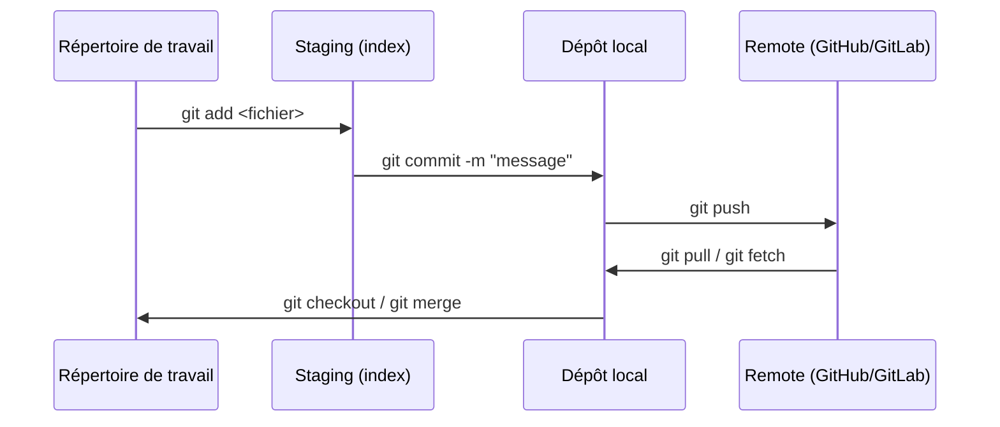
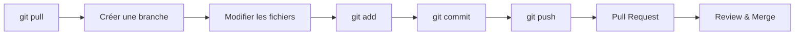

# Git & collaboration

## Objectifs pédagogiques

À l'issue de ce module, tu seras capable de :

- Expliquer pourquoi le contrôle de version est indispensable dans un workflow QA moderne
- Cloner un dépôt et naviguer entre les branches avec les commandes de base
- Créer une branche dédiée, committer des modifications et la pousser sur le remote
- Ouvrir une Pull Request et y contribuer en tant que reviewer avec une grille de lecture QA
- Identifier les marqueurs d'un conflit Git et appliquer la procédure de résolution

---

## Mise en situation

Tu intègres l'équipe QA d'une startup SaaS de 15 personnes. Les développeurs bossent sur une refonte complète de la page de connexion. Toi, tu dois maintenir les cas de test existants, en ajouter pour couvrir la nouvelle feature, et préparer un premier script Cypress.

Le problème : sans outil de versionnage, tu travailles sur ta copie locale. Un développeur modifie le même fichier de configuration côté test. Au moment de tout regrouper, c'est la collision — et personne ne sait laquelle des deux versions est la bonne.

C'est exactement ce que Git résout. Pas uniquement pour les développeurs. Pour **tout le monde qui touche à des fichiers dans un projet partagé**.

---

## Pourquoi un QA a besoin de Git

On associe Git aux développeurs, et c'est une erreur courante en début de carrière QA. Dès que tu travailles avec des fichiers versionnés — cas de test en Markdown, scripts d'automatisation, fichiers de configuration d'environnement — tu as besoin de contrôle de version.

Concrètement, Git te permet de travailler sur une branche isolée sans risquer de casser les tests existants, de retrouver qui a modifié quoi et pourquoi via les messages de commit, de contribuer aux revues de code pour vérifier la couverture de test, et de déclencher des pipelines CI qui lancent les tests automatiquement dès qu'une PR est ouverte.

🧠 Git n'est pas un outil de sauvegarde. C'est un système de **collaboration asynchrone** : chacun travaille de son côté, et Git s'occupe de réconcilier les modifications au moment voulu.

---

## Comment Git s'organise sous le capot

Avant de taper la moindre commande, comprendre le modèle mental de Git évite beaucoup de frustration. Git fonctionne avec trois zones locales, plus un remote partagé :

```
Répertoire de travail  →  Staging (index)  →  Dépôt local  →  Remote (GitHub/GitLab)
     (tes fichiers)        (git add)           (git commit)       (git push)
```



**Répertoire de travail** — ce que tu vois dans ton éditeur. Git le surveille, mais n'en fait rien encore.

**Staging** — une zone de préparation. Tu choisis exactement ce que tu veux committer, pas forcément tout ce que tu as modifié. C'est ce qui rend les commits précis et lisibles.

**Dépôt local** — ton historique personnel, sur ta machine. Tu peux committer sans connexion internet.

**Remote** — GitHub, GitLab ou Bitbucket. C'est là que toute l'équipe se synchronise.

⚠️ Beaucoup de débutants pensent que `git commit` envoie les fichiers sur GitHub. Non : il faut un `git push` séparé. Le commit enregistre dans le dépôt *local*. Le push l'envoie sur le *remote*. Ces deux étapes sont toujours distinctes.

---

## Mise en place et commandes essentielles

### Configurer Git une seule fois

Avant tout, Git a besoin de savoir qui tu es. Ces informations apparaissent dans chaque commit que tu crées — sans ça, les commits sont anonymes ou mal attribués dans l'historique de l'équipe.

```bash
git config --global user.name "<PRENOM_NOM>"
git config --global user.email "<EMAIL>"
```

Exemple :

```bash
git config --global user.name "Sophie Martin"
git config --global user.email "sophie.martin@exemple.com"
```

<!-- snippet
id: git_config_identity
type: command
tech: git
level: beginner
importance: high
format: knowledge
tags: git,config,setup,identite
title: Configurer son identité Git globalement
command: git config --global user.name "<PRENOM_NOM>" && git config --global user.email "<EMAIL>"
example: git config --global user.name "Sophie Martin" && git config --global user.email "sophie@exemple.com"
description: À faire une seule fois après installation. Ces infos apparaissent dans chaque commit — sans ça, les commits sont anonymes ou mal attribués.
-->

### Cloner un dépôt existant

Dans une équipe, tu pars rarement de zéro. Tu récupères le dépôt existant avec :

```bash
git clone <URL_DU_DEPOT>
```

Exemple :

```bash
git clone https://github.com/monequipe/projet-qa.git
```

Cela crée un dossier local avec l'intégralité de l'historique du projet — pas seulement les fichiers actuels.

### Vérifier l'état de ta zone de travail

Avant toute action, prends l'habitude de regarder où tu en es :

```bash
git status
```

C'est la commande la plus utile au quotidien. Elle te dit sur quelle branche tu es, quels fichiers sont modifiés, lesquels sont en staging, et lesquels ne le sont pas encore.

<!-- snippet
id: git_status_reflex
type: tip
tech: git
level: beginner
importance: high
format: knowledge
tags: git,status,workflow,habitude
title: git status avant chaque action
content: Avant tout git add, commit ou push, lance git status. Il indique la branche courante, les fichiers modifiés, ce qui est en staging et ce qui ne l'est pas. Évite les commits accidentels et les oublis.
description: Réflexe fondamental : git status te montre exactement où tu en es avant chaque action. Prend 1 seconde, évite des dizaines d'erreurs.
-->

---

## Travailler avec les branches

Une branche, c'est une ligne de travail indépendante. Tu peux la modifier dans tous les sens sans toucher à la branche principale (`main` ou `master`). Pense-y comme à un espace de travail personnel que tu fusionneras avec le reste quand ton travail est prêt.

### Créer et basculer sur une branche

```bash
git checkout -b <NOM_BRANCHE>
```

Exemple typique en QA :

```bash
git checkout -b qa/login-page-tests
```

💡 Préfixer tes branches avec `qa/` ou `test/` est une convention répandue. Elle permet aux développeurs de voir d'un coup d'œil que c'est une branche de test, et certains pipelines CI peuvent filtrer les branches sur cette convention pour déclencher des jobs spécifiques.

<!-- snippet
id: git_branch_create_qa
type: command
tech: git
level: beginner
importance: high
format: knowledge
tags: git,branches,qa,workflow
title: Créer et basculer sur une nouvelle branche QA
command: git checkout -b <NOM_BRANCHE>
example: git checkout -b qa/login-page-tests
description: Crée la branche et bascule dessus en une seule commande. Préfixer avec qa/ ou test/ est une convention qui facilite le filtrage dans les pipelines CI.
-->

### Voir toutes les branches

```bash
git branch -a
```

L'option `-a` affiche aussi les branches distantes, celles qui existent sur GitHub ou GitLab mais que tu n'as pas encore en local.

### Changer de branche

```bash
git checkout <NOM_BRANCHE>
```

⚠️ Si tu as des fichiers modifiés non commités, Git peut refuser le changement de branche pour éviter d'écraser ton travail en cours. La solution : soit committer ce que tu as, soit utiliser `git stash` pour mettre tes modifications de côté temporairement.

---

## Cycle de travail quotidien

Voici le flux que tu répéteras des dizaines de fois par semaine. Il est simple une fois automatisé, mais chaque étape a sa raison d'être.



### 1. Récupérer les dernières modifications

Avant de commencer, synchronise ta branche principale pour partir d'une base à jour :

```bash
git pull origin main
```

<!-- snippet
id: git_pull_before_work
type: warning
tech: git
level: beginner
importance: high
format: knowledge
tags: git,pull,synchronisation,workflow
title: Toujours git pull avant de commencer à travailler
content: Piège : travailler sur une base obsolète. Si quelqu'un a poussé des modifications depuis ton dernier pull, tu accumules des divergences qui produiront des conflits au moment du push. Systématiquement : git pull origin main avant de créer ta branche ou de reprendre un travail en cours.
description: Travailler sur une base obsolète fabrique des conflits à retardement. git pull origin main en début de session évite 80% des conflits.
-->

### 2. Préparer tes modifications pour le commit

```bash
git add <FICHIER>
```

Et pour tout ajouter d'un coup :

```bash
git add .
```

💡 Préfère `git add <fichier>` à `git add .` en début de parcours. Ça t'oblige à vérifier ce que tu commites, et tu évites d'envoyer accidentellement des fichiers de config locaux ou des logs.

<!-- snippet
id: git_add_selective
type: tip
tech: git
level: beginner
importance: medium
format: knowledge
tags: git,staging,add,bonne-pratique
title: Préférer git add <fichier> à git add .
content: git add . ajoute TOUT ce qui est modifié, y compris des fichiers de config locale ou des logs. En début de projet, utilise git add <fichier> pour vérifier précisément ce que tu commites. Combine avec git diff --staged pour voir exactement ce qui partira dans le commit.
description: git add . est pratique mais risqué : tu peux committer des credentials ou des fichiers inutiles. Vérifier avec git diff --staged avant chaque commit.
-->

### 3. Committer avec un message clair

```bash
git commit -m "<MESSAGE>"
```

Exemple :

```bash
git commit -m "feat(qa): add test cases for login page error states"
```

Un bon message de commit répond à *"Qu'est-ce que ce commit apporte ?"* — pas *"Qu'est-ce que j'ai modifié ?"*. La liste des fichiers touchés, Git la conserve déjà dans l'historique.

<!-- snippet
id: git_commit_message_quality
type: tip
tech: git
level: beginner
importance: medium
format: knowledge
tags: git,commit,message,convention
title: Écrire un message de commit qui exprime l'intention
content: Un bon message répond à "Qu'est-ce que ce commit apporte ?" et non "Qu'est-ce que j'ai modifié ?". Exemple : "feat(qa): add test cases for login error states" plutôt que "modified login_tests.md". La liste des fichiers, Git la stocke déjà dans l'historique.
description: Le message de commit est lu par toute l'équipe dans l'historique. Il doit exprimer l'intention, pas décrire les fichiers touchés.
-->

### 4. Pousser la branche sur le remote

```bash
git push origin <NOM_BRANCHE>
```

Exemple :

```bash
git push origin qa/login-page-tests
```

<!-- snippet
id: git_commit_not_push
type: warning
tech: git
level: beginner
importance: high
format: knowledge
tags: git,commit,push,remote
title: git commit n'envoie PAS sur GitHub
content: Piège classique : après git commit, les fichiers sont dans le dépôt LOCAL uniquement. Pour partager avec l'équipe, il faut git push origin <branche>. Sans push, personne d'autre ne voit ton travail.
description: git commit = sauvegarde locale. git push = envoi sur le remote. Les deux étapes sont séparées — toujours.
-->

---

## Pull Requests : le point de rencontre QA / Dev

La Pull Request (PR) — ou Merge Request sur GitLab — c'est le moment où tu proposes d'intégrer ton travail dans la branche principale. C'est aussi l'endroit où l'équipe discute, commente et valide avant que le code parte en production.

En tant que QA, tu vas interagir avec les PRs de deux façons : en tant qu'**auteur**, quand tu proposes des cas de test ou des scripts ; en tant que **reviewer**, quand tu examines les PRs des développeurs pour vérifier que les modifications sont couvertes par des tests.

### Ce que tu vérifies en tant que reviewer QA

Quand un développeur ouvre une PR, la question n'est pas "est-ce que le code est beau ?" — c'est le rôle du tech lead. Ta lecture est différente :

- Les cas limites ont-ils été pensés dans les tests unitaires ?
- Y a-t-il un test de non-régression pour le bug corrigé ?
- La description de la PR mentionne-t-elle les scénarios à tester manuellement ?
- La modification touche-t-elle des fonctionnalités existantes sans test associé ?

🧠 Un QA qui lit une PR apporte une perspective que le développeur n'a pas naturellement : il pense aux comportements utilisateurs et aux cas d'erreur, là où le développeur pense à l'implémentation. Ce n'est pas redondant — c'est complémentaire.

<!-- snippet
id: git_pr_qa_reviewer
type: concept
tech: git
level: beginner
importance: medium
format: knowledge
tags: git,pull-request,review,qa,collaboration
title: Ce que vérifie un QA quand il review une Pull Request
content: Un QA reviewer ne lit pas le code comme un dev. Il vérifie : les cas limites sont-ils couverts par des tests ? Y a-t-il un test de non-régression pour le bug corrigé ? La PR décrit-elle les scénarios à tester manuellement ? La modification touche-t-elle des fonctionnalités existantes sans test associé ? C'est une perspective complémentaire, pas redondante avec la review technique.
description: La revue de PR côté QA se concentre sur la couverture de test et les risques de régression, pas sur la qualité du code lui-même.
-->

---

## Gérer un conflit : pas de panique

Un conflit survient quand deux personnes ont modifié le même endroit dans le même fichier. Git ne sait pas laquelle des deux versions garder — il te demande de trancher.

Dans le fichier concerné, ça ressemble à ça :

```
<<<<<<< HEAD
GIVEN l'utilisateur entre un email invalide
=======
GIVEN l'utilisateur entre un email vide
>>>>>>> qa/login-page-tests
```

La zone entre `<<<<<<< HEAD` et `=======` est ta version courante. Entre `=======` et `>>>>>>>` se trouve la version de la branche que tu veux fusionner.

**La procédure de résolution en quatre étapes :**
1. Ouvre le fichier dans ton éditeur
2. Décide quelle version garder — ou combine les deux si les deux apports sont valides
3. Supprime les trois marqueurs (`<<<<<<<`, `=======`, `>>>>>>>`)
4. Sauvegarde, puis `git add <fichier>` et `git commit`

💡 VS Code, IntelliJ et la plupart des éditeurs modernes affichent les conflits avec une interface visuelle et des boutons *Accept Current / Accept Incoming / Accept Both*. C'est beaucoup plus lisible que le texte brut — utilise-les sans hésitation.

<!-- snippet
id: git_conflict_structure
type: concept
tech: git
level: beginner
importance: medium
format: knowledge
tags: git,conflit,merge,resolution
title: Structure d'un conflit Git dans un fichier
content: Git insère des marqueurs dans le fichier conflictuel : <<<<<<< HEAD contient ta version locale, ======= est le séparateur, >>>>>>> <branche> contient la version entrante. Pour résoudre : choisir une version (ou combiner), supprimer les 3 marqueurs, puis git add + git commit. VS Code affiche une interface visuelle avec boutons Accept Current/Incoming/Both.
description: Un conflit = deux personnes ont modifié le même endroit. Git te demande de trancher. Les marqueurs délimitent les deux versions en conflit.
-->

---

## Cas réel en entreprise

**Contexte** : équipe de 8 personnes (4 devs, 2 QA, 1 PM, 1 tech lead) sur une application de gestion de plannings. Sprints de 2 semaines.

**Le problème de départ** : les fichiers de cas de test vivaient dans un Google Doc partagé. Impossible de savoir quelle version était à jour. Les scripts Cypress traînaient sur les machines locales de chaque QA, sans jamais être synchronisés.

**Ce qui a été mis en place :**

1. Création d'un dépôt `qa-assets` sur GitLab avec une structure claire : `test-cases/`, `scripts/cypress/`, `environments/`
2. Convention de nommage des branches : `qa/<numero-ticket>-<sujet-court>`
3. Règle d'équipe : chaque PR de dev doit être liée à au moins un cas de test mis à jour côté QA
4. Pipeline CI déclenché à chaque push sur une branche QA : lint des scripts + smoke test automatique sur l'environnement de staging

**Résultats en 3 sprints** : zéro cas de test "fantôme" — ces cas qui existent en documentation mais ne correspondent plus à la réalité du code. Les QA peuvent consulter l'historique des modifications et comprendre pourquoi un cas de test a changé il y a deux mois, et dans quel contexte.

---

## Bonnes pratiques

**Committer souvent, en petites unités.** Un commit = une intention claire. Si tu dois écrire "et aussi" dans ton message, c'est le signe que tu aurais dû faire deux commits distincts.

**Nommer les branches de façon parlante.** `qa/checkout-empty-cart-edge-cases` vaut infiniment mieux que `test-2` ou `ma-branche`. Le nom doit permettre à n'importe qui dans l'équipe de comprendre l'objet de la branche sans l'ouvrir.

**Ne jamais committer directement sur `main`.** Même si tu en as le droit technique, passer par une branche et une PR garantit qu'un autre regard se pose sur ton travail avant qu'il parte en production.

**Toujours `git pull` avant de commencer.** Travailler sur une base obsolète, c'est fabriquer des conflits à retardement. Trente secondes de synchronisation en début de session évitent des dizaines de minutes de résolution de conflits.

**Configurer `.gitignore` dès le départ.** Les fichiers de configuration locale, les credentials, les dossiers `node_modules` n'ont rien à faire dans un dépôt. Un `.gitignore` bien configuré évite les accidents — et les accidents sont souvent irréversibles.

⚠️ Committer un fichier contenant un mot de passe ou une clé API est une erreur critique. Git garde l'historique pour toujours : même si tu supprimes le fichier dans le commit suivant, la clé reste visible dans l'historique pour quiconque a accès au dépôt. La correction implique de réécrire l'historique — une opération complexe qui perturbe toute l'équipe. Le réflexe à adopter : `git diff --staged` avant chaque commit.

<!-- snippet
id: git_gitignore_credentials
type: warning
tech: git
level: beginner
importance: high
format: knowledge
tags: git,gitignore,securite,credentials
title: Ne jamais committer un mot de passe ou une clé API
content: Piège critique : un fichier avec un mot de passe ou token commité reste dans l'historique Git POUR TOUJOURS, même si supprimé dans le commit suivant. La correction nécessite de réécrire l'historique (complexe) et de révoquer la clé. Prevention : configurer .gitignore dès le début pour exclure .env, *.key, config/local.*.
description: L'historique Git est permanent. Un secret commité = secret compromis. Vérifier git diff --staged avant chaque commit.
-->

---

## Résumé

Git résout un problème fondamental dans le travail d'équipe : comment plusieurs personnes peuvent-elles modifier les mêmes fichiers sans se marcher dessus ? En QA, ça concerne tes cas de test, tes scripts d'automatisation et tes fichiers de configuration. Le modèle repose sur trois zones locales — répertoire de travail, staging, dépôt local — avant d'atteindre le remote partagé. Le flux quotidien est simple et répétable : `pull → branche → modifier → add → commit → push → PR`. Les Pull Requests sont le point de rencontre clé entre QA et développeurs, et la review d'un QA apporte une perspective que le code seul ne suffit pas à valider. La prochaine étape logique est d'intégrer ce flux dans un pipeline CI/CD pour que tes tests se déclenchent automatiquement à chaque modification du code.
