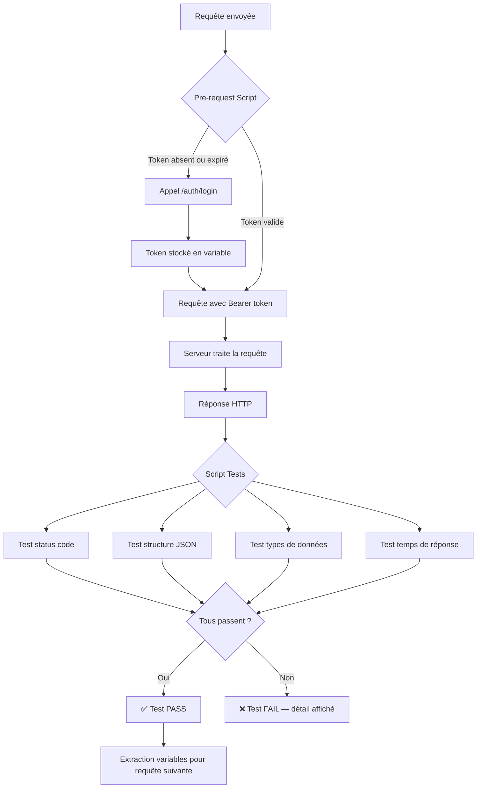

# API Testing avancé

## Objectifs pédagogiques

À la fin de ce module, vous serez capable de :

- Analyser la structure d'une requête et d'une réponse HTTP comme un testeur, pas comme un utilisateur
- Tester des endpoints REST avec Postman en couvrant les cas nominaux, les cas d'erreur et les limites de sécurité
- Écrire des assertions JavaScript dans Postman pour valider le contrat de données d'une API
- Organiser une collection Postman professionnelle et l'exécuter en CI avec Newman
- Gérer l'authentification par token de façon automatisée dans un contexte de test

---

## Mise en situation

Vous intégrez une équipe produit qui développe une application de gestion de tickets clients. Le frontend est une SPA React, le backend expose une API REST. Les développeurs backend livrent régulièrement de nouvelles routes : création de ticket, mise à jour du statut, récupération des tickets par utilisateur, suppression.

Pendant les deux premières semaines, tout se teste à la main : on ouvre Postman, on envoie une requête, on regarde la réponse. Ça marche. Mais la troisième semaine, une modification sur la route `PATCH /tickets/{id}` casse silencieusement le champ `status` — il retourne désormais un entier au lieu d'une chaîne. Le frontend plante en production. Personne n'avait de test automatisé sur ce contrat de données.

C'est exactement ce que l'API testing avancé résout : pas seulement "est-ce que ça répond 200 ?", mais "est-ce que la réponse contient ce qu'on attend, dans le format qu'on attend, dans le délai acceptable ?"

---

## Ce que tester une API veut vraiment dire

Tester une API, ce n'est pas vérifier qu'un endpoint "fonctionne". C'est valider un **contrat** entre le backend et ses consommateurs — frontend, mobile, services tiers. Ce contrat couvre cinq dimensions :

| Dimension | Ce qu'on vérifie |
|-----------|-----------------|
| **Status code** | Le bon code HTTP retourné selon le cas (200, 201, 404, 422…) |
| **Structure JSON** | Les champs présents, leurs types, leurs valeurs |
| **Comportements aux limites** | Données manquantes, ressource inexistante, quota dépassé |
| **Performance** | Temps de réponse sous charge normale |
| **Sécurité** | Les routes protégées rejettent bien les requêtes sans token valide |

La plupart des testeurs débutants s'arrêtent au code 200. Les testeurs expérimentés valident le contrat complet — et c'est ce que ce module vous apprend à faire.

---

## Comment une requête HTTP se décompose

Avant de tester quoi que ce soit, il faut avoir une image mentale claire de ce qui circule sur le réseau.

```
Client (Postman / app)          Serveur (API)
       │                              │
       │── GET /tickets/42 ──────────▶│
       │   Headers: Authorization     │
       │   Bearer eyJhbGciOi...       │
       │                              │── cherche ticket 42
       │                              │── authentifie le token
       │◀── HTTP 200 OK ─────────────│
       │   Content-Type:              │
       │   application/json           │
       │   Body: { "id": 42,          │
       │     "status": "open" }       │
```

**Côté requête**, vous contrôlez :
- La **méthode** (GET, POST, PUT, PATCH, DELETE)
- L'**URL** et ses paramètres (path params `/tickets/{id}`, query params `?status=open`)
- Les **headers** (authentification, type de contenu envoyé)
- Le **body** (JSON envoyé pour créer ou modifier une ressource)

**Côté réponse**, vous validez :
- Le **status code**
- Les **headers** de réponse (Content-Type, directives de cache…)
- Le **body** JSON — structure, types, valeurs

🧠 Les codes HTTP ne sont pas décoratifs. `404` signifie "la ressource n'existe pas", pas "erreur serveur". `401` = non authentifié, `403` = authentifié mais pas autorisé. Un backend qui retourne `200` avec `{ "error": "not found" }` dans le body est mal conçu — et un piège pour vos tests : votre assertion sur le status passera, mais le comportement est faux.

---

## Postman en mode testing professionnel

Postman est souvent utilisé comme un simple client HTTP. En mode testing avancé, c'est un environnement de test à part entière : variables d'environnement, assertions JavaScript, runner de collection. La différence entre un usage basique et un usage professionnel tient à deux choses — l'organisation et l'automatisation.

### Structurer une collection qui tient à l'usage

Une collection mal organisée devient ingérable en quelques semaines. Voici une structure éprouvée :

```
📁 Tickets API
   📁 Auth
      POST /auth/login          ← récupère le token
      POST /auth/refresh
   📁 Tickets — Cas nominaux
      GET /tickets              ← liste tous les tickets
      GET /tickets/:id          ← ticket existant
      POST /tickets             ← création valide
      PATCH /tickets/:id        ← mise à jour status
      DELETE /tickets/:id
   📁 Tickets — Cas d'erreur
      GET /tickets/99999        ← ticket inexistant → 404
      POST /tickets (body vide) ← données manquantes → 422
      DELETE /tickets/:id (sans auth) → 401
   📁 Tickets — Limites & sécurité
      POST /tickets (XSS dans title)
      GET /tickets (autre utilisateur) → 403
```

Séparer les cas d'erreur n'est pas du rangement cosmétique — c'est une décision de couverture. Un backend qui gère mal ses erreurs expose des stack traces, des IDs devinables, des messages trop verbeux. Ces cas méritent autant d'attention que le chemin nominal, souvent plus.

### Variables d'environnement — ne rien coder en dur

Postman gère des **environnements** (Dev, Staging, Production) avec des variables qui font basculer toute la collection d'un contexte à l'autre :

| Variable | Dev | Staging |
|----------|-----|---------|
| `base_url` | `http://localhost:3000` | `https://staging.api.example.com` |
| `auth_token` | *(injecté dynamiquement)* | *(injecté dynamiquement)* |
| `test_user_id` | `42` | `142` |

Dans vos requêtes : `{{base_url}}/tickets`. Quand vous changez d'environnement, toute la collection suit.

💡 Le token d'authentification doit être injecté automatiquement, pas copié-collé à la main à chaque session. C'est l'objet de la section suivante.

---

## Gérer l'authentification dans vos tests

C'est le point de friction numéro un pour les testeurs qui débutent sur les APIs sécurisées.

### Token Bearer (JWT) — injection automatique

Le flux classique : vous appelez `POST /auth/login`, le serveur retourne un token, vous injectez ce token dans toutes les requêtes suivantes. Faire ça manuellement est une source d'erreurs — le token expire, on oublie de le rafraîchir, les tests échouent pour une mauvaise raison.

La solution : un **Pre-request Script au niveau de la collection** qui vérifie et rafraîchit le token automatiquement :

```javascript
const token = pm.environment.get("auth_token");
const tokenExpiry = pm.environment.get("token_expiry");

if (!token || Date.now() > tokenExpiry) {
    pm.sendRequest({
        url: pm.environment.get("base_url") + "/auth/login",
        method: "POST",
        header: { "Content-Type": "application/json" },
        body: {
            mode: "raw",
            raw: JSON.stringify({
                email: pm.environment.get("test_email"),
                password: pm.environment.get("test_password")
            })
        }
    }, (err, res) => {
        const body = res.json();
        pm.environment.set("auth_token", body.token);
        pm.environment.set("token_expiry", Date.now() + 3600000); // 1h
    });
}
```

Ensuite, dans l'onglet "Authorization" de la collection : type `Bearer Token`, valeur `{{auth_token}}`. Toutes les requêtes héritent de cette configuration sans configuration supplémentaire.

⚠️ Ne stockez jamais les credentials (email/mot de passe) dans la collection exportée et committée sur Git. Utilisez les variables d'environnement et ajoutez les fichiers d'environnement Postman à votre `.gitignore`. Les tokens et mots de passe n'ont rien à faire dans l'historique Git.

### Autres mécanismes courants

**API Key** : `pm.environment.set("api_key", "sk-xxxx")` puis dans les headers de la collection : `X-API-Key: {{api_key}}`. Simple et efficace.

**OAuth2** : Postman a un flow intégré (Authorization → OAuth 2.0). Vous renseignez les URLs du serveur d'autorisation, le client ID et secret — Postman gère le redirect et stocke le token. Utile pour les APIs qui s'appuient sur un IdP externe (Keycloak, Auth0).

---

## Écrire des assertions qui ont de la valeur

L'onglet **Tests** de chaque requête Postman accepte du JavaScript exécuté après réception de la réponse. C'est ici que Postman devient un vrai outil de test.

### Les assertions fondamentales

**Status code :**
```javascript
pm.test("Status 200 OK", () => {
    pm.response.to.have.status(200);
});
```

**Présence des champs attendus :**
```javascript
pm.test("Réponse contient les champs attendus", () => {
    const body = pm.response.json();
    pm.expect(body).to.have.property("id");
    pm.expect(body).to.have.property("status");
    pm.expect(body).to.have.property("created_at");
});
```

**Types de données — le test qui aurait évité notre incident de production :**
```javascript
pm.test("Le champ status est une string", () => {
    const body = pm.response.json();
    pm.expect(body.status).to.be.a("string");
    pm.expect(["open", "closed", "pending"]).to.include(body.status);
});
```

**Temps de réponse :**
```javascript
pm.test("Réponse sous 500ms", () => {
    pm.expect(pm.response.responseTime).to.be.below(500);
});
```

### Chaîner des requêtes qui dépendent les unes des autres

Un pattern fondamental : créer une ressource, récupérer son ID, s'en servir dans les requêtes suivantes.

```javascript
// Dans le script Tests de POST /tickets
pm.test("Ticket créé avec un ID", () => {
    const body = pm.response.json();
    pm.expect(body.id).to.be.a("number");
    pm.environment.set("created_ticket_id", body.id);
});
```

La requête suivante `GET /tickets/{{created_ticket_id}}` utilise automatiquement cet ID. Pas d'ID codé en dur, pas de dépendance à des données fixes en base — le test est portable entre environnements.

### Tester les cas d'erreur — souvent plus révélateur que le chemin nominal

```javascript
// POST /tickets avec body vide
pm.test("Données manquantes → 422 Unprocessable Entity", () => {
    pm.response.to.have.status(422);
});

pm.test("L'erreur identifie les champs manquants", () => {
    const body = pm.response.json();
    pm.expect(body).to.have.property("errors");
    pm.expect(body.errors).to.be.an("array").that.is.not.empty;
});

// GET /tickets sans token
pm.test("Sans token → 401 Unauthorized", () => {
    pm.response.to.have.status(401);
});

pm.test("Pas de stack trace exposée dans l'erreur", () => {
    const body = pm.response.json();
    pm.expect(body).to.not.have.property("stack");
    pm.expect(JSON.stringify(body)).to.not.include("at Object.");
});
```

🧠 Ce dernier test relève du security testing. Une API qui retourne `"stack": "Error at /app/routes/tickets.js:42..."` donne des informations précieuses à un attaquant — chemins de fichiers, lignes de code, dépendances utilisées. Ce test prend 2 minutes à écrire et peut prévenir une vulnérabilité sérieuse.

---

## Flux complet d'un test API



---

## De Postman à la CI avec Newman

Newman est le runner CLI de Postman. Il permet d'exécuter votre collection hors de l'interface graphique, dans un pipeline CI/CD. C'est le passage de "les tests existent" à "les tests s'exécutent à chaque changement de code".

### Construire une suite progressive

**Étape 1 — Collection organisée avec variables** : une heure de mise en place, infiniment mieux que des requêtes orphelines. Quelques assertions sur les status codes.

**Étape 2 — Assertions complètes + chaînage** : types de données, structure JSON, cas d'erreur couverts systématiquement. La collection documente le contrat de l'API autant qu'elle le teste.

**Étape 3 — Newman en CI** : chaque merge request déclenche la suite. Les régressions sont détectées avant d'atteindre staging.

### Newman en pratique

```bash
# Installation
npm install -g newman newman-reporter-htmlextra

# Exécution avec rapport HTML
newman run <COLLECTION.json> \
  -e <ENVIRONMENT.json> \
  --reporters cli,htmlextra \
  --reporter-htmlextra-export rapport-tests.html
```

Le rapport HTML généré par `htmlextra` est lisible par n'importe qui — PO, développeur, ops — sans avoir Postman installé.

### Intégration GitHub Actions

```yaml
name: API Tests

on:
  push:
    branches: [main, develop]
  pull_request:

jobs:
  api-tests:
    runs-on: ubuntu-latest
    steps:
      - uses: actions/checkout@v3

      - name: Install Newman
        run: npm install -g newman newman-reporter-htmlextra

      - name: Run API Tests
        run: |
          newman run tests/api/collection.json \
            -e tests/api/env-staging.json \
            --env-var "auth_password=${{ secrets.API_TEST_PASSWORD }}" \
            --reporters cli,htmlextra \
            --reporter-htmlextra-export test-report.html

      - name: Upload rapport
        uses: actions/upload-artifact@v3
        if: always()
        with:
          name: api-test-report
          path: test-report.html
```

⚠️ Ne committez jamais le fichier d'environnement Postman avec des valeurs sensibles. Postman produit deux fichiers distincts : la collection (à committer) et l'environnement (ne commitez que les clés, sans valeurs). Les secrets s'injectent via les variables CI avec `--env-var`.

---

## Diagnostic — Erreurs fréquentes

| Symptôme | Cause probable | Correction |
|----------|---------------|------------|
| `401 Unauthorized` sur toutes les requêtes | Token expiré ou non injecté | Vérifier que le Pre-request Script s'exécute, inspecter la variable `auth_token` |
| `ECONNREFUSED` dans Newman | API non démarrée ou URL incorrecte | Vérifier `base_url` dans l'environnement, tester avec `curl {{base_url}}/health` |
| Tests qui passent dans Postman mais échouent dans Newman | Variables d'environnement absentes du fichier CLI | Exporter l'environnement depuis Postman et le passer avec `-e env.json` |
| `pm.response.json()` retourne une erreur | La réponse n'est pas du JSON (page HTML d'erreur serveur) | Ajouter un test préalable sur le `Content-Type` de la réponse |
| Chaînage cassé — la variable n'est pas propagée | La requête source échoue avant d'extraire la variable | Vérifier que la requête source s'exécute bien en premier dans le Runner |
| Faux positifs sur les tests de temps de réponse | Environnement lent (CI partagée, VPN) | Ajuster le seuil selon l'environnement via une variable `{{response_time_limit}}` |

💡 Avant de déboguer un test qui échoue, ajoutez `console.log(pm.response.json())` dans le script Tests. Le log apparaît dans la console Postman (View → Show Postman Console) et dans la sortie Newman — ça évite de déboguer à l'aveugle.

---

## Cas réel en entreprise

**Contexte** : une startup SaaS exposant une API REST à des clients B2B. Chaque déploiement est un risque de régression silencieuse sur les endpoints critiques — authentification, facturation, export de données.

**Avant la mise en place** : tests manuels avant chaque release. Durée : 2 à 3 heures par développeur. Couverture partielle. Deux incidents en production en un trimestre liés à des changements de structure JSON non détectés.

**Ce qui a été mis en place** :
1. Inventaire de tous les endpoints documentés dans Swagger/OpenAPI
2. Collection Postman en 3 dossiers : nominal, erreurs, sécurité
3. Assertions sur chaque endpoint : status, structure, types, temps de réponse
4. Newman intégré dans le pipeline GitLab CI — la suite tourne sur chaque merge request vers `main`
5. Rapport HTML archivé comme artefact CI, consulté par le PO après chaque déploiement

**Résultats après 6 semaines** :
- Phase de test pre-release : **15 minutes** (automatisé) contre 2 à 3 heures
- **3 régressions** détectées en CI avant d'atteindre staging
- **0 incident** en production lié à une régression API sur la période
- La collection sert de **documentation vivante** — les nouvelles recrues s'en servent pour comprendre le backend sans lire le code

---

## Bonnes pratiques

**Tester le contrat, pas l'implémentation.** Vous ne savez pas — et ne devez pas vous soucier de — comment le backend stocke les données. Vous testez ce qu'il retourne. Si `status` doit être une string parmi `["open", "closed", "pending"]`, codez exactement ça dans vos assertions.

**Un test, un comportement.** Ne mettez pas dix assertions dans un seul `pm.test()`. Si une assertion échoue, vous voulez savoir laquelle — pas juste que "le test a échoué".

**Couvrez systématiquement les 401, 403, 404, 422.** Ces codes représentent les comportements de sécurité et de validation de votre API. Un endpoint qui retourne 200 pour une ressource inexistante est un bug — testez-le.

**Ne couplez pas vos tests aux données de test.** Utilisez des variables et, si possible, des fixtures recréées avant chaque run. Un test qui dépend d'un ID spécifique existant en base cassera à la première remise à zéro de l'environnement.

**Versionnez votre collection.** Exportez-la en JSON et committez-la dans le dépôt du projet, à côté du code. Elle doit vivre avec l'API qu'elle teste, pas dans le workspace Postman personnel d'un développeur.

**Distinguez les environnements.** Jamais de tests automatisés qui écrivent ou suppriment des données en production. Utilisez des environnements dédiés (staging, test) avec des variables distinctes dans Newman.

**Testez la sécurité explicitement.** Vérifiez qu'un utilisateur A ne peut pas accéder aux ressources de l'utilisateur B. Vérifiez qu'une route admin retourne bien 403 avec un token utilisateur standard. Ce type de test se rate facilement manuellement mais se code en cinq lignes.

---

## Résumé

Le testing API avancé, c'est passer de "est-ce que ça répond ?" à "est-ce que ça répond correctement, dans tous les cas, pour tous les consommateurs ?". La clé est de valider un **contrat** complet : status codes, structure JSON, types de données, comportements aux erreurs, sécurité et performance.

Postman fournit l'environnement complet : variables pour gérer plusieurs contextes, Pre-request Scripts pour automatiser l'authentification, assertions JavaScript pour valider les réponses, chaînage pour simuler des workflows réels. Newman transforme cette collection en suite de tests exécutable en CI, avec des rapports lisibles par toute l'équipe — y compris les non-développeurs.

La vraie valeur n'est pas dans la technique : c'est dans la discipline de couvrir les cas d'erreur autant que les cas nominaux, et de versionner la collection à côté du code. Une collection bien tenue devient la documentation vivante de votre API.

---

<!-- snippet
id: postman_token_pre_request
type: tip
tech: postman
level: intermediate
importance: high
format: knowledge
tags: postman,authentification,jwt,automation,pre-request
title: Injecter un token JWT automatiquement dans Postman
content: "Dans l'onglet Pre-request Script de la collection (pas d'une requête individuelle), vérifier si le token existe et n'est pas expiré. Si non, appeler /auth/login avec pm.sendRequest() et stocker le résultat : pm.environment.set('auth_token', body.token). Configurer Authorization: Bearer {{auth_token}} au niveau collection — toutes les requêtes héritent du token sans copier-coller manuel entre sessions."
description: "Automatiser la gestion du token au niveau collection évite les 401 inexpliqués et les tokens périmés copiés à la main entre les sessions de test."
-->

<!-- snippet
id: postman_test_type_json
type: command
tech: postman
level: intermediate
importance: high
format: knowledge
tags: postman,assertions,json,types,contrat
title: Valider le type d'un champ JSON dans Postman
command: pm.expect(pm.response.json().<FIELD>).to.be.a("<TYPE>");
example: pm.expect(pm.response.json().status).to.be.a("string");
description: "Valide le type du champ retourné — détecte les régressions silencieuses comme un champ qui passe de string à integer sans modifier le status code."
-->

<!-- snippet
id: postman_test_enum_values
type: command
tech: postman
level: intermediate
importance: medium
format: knowledge
tags: postman,assertions,enum,valeurs,contrat
title: Vérifier qu'un champ JSON appartient à un ensemble de valeurs
command: pm.expect([<VAL1>, <VAL2>]).to.include(pm.response.json().<FIELD>);
example: pm.expect(["open", "closed", "pending"]).to.include(pm.response.json().status);
description: "Vérifie que la valeur retournée fait partie des valeurs attendues — utile pour les champs statut, type ou rôle qui ont un domaine fini de valeurs."
-->

<!-- snippet
id: postman_test_response_time
type: command
tech: postman
level: intermediate
importance: medium
format: knowledge
tags: postman,performance,temps-reponse,seuil
title: Tester le temps de réponse d'un endpoint dans Postman
command: pm.expect(pm.response.responseTime).to.be.below(<MS>);
example: pm.expect(pm.response.responseTime).to.be.below(500);
description: "Valide que la réponse arrive sous un seuil en millisecondes. À adapter selon l'environnement — 500ms en local peut devenir 2000ms en CI partagée."
-->

<!-- snippet
id: postman_chain_variable
type: tip
tech: postman
level: intermediate
importance: high
format: knowledge
tags: postman,chaining,variables,workflow,dependance
title: Chaîner des requêtes Postman en passant l'ID créé à la suivante
content: "Dans le script Tests de la requête POST (création), extraire l'ID et le stocker : pm.environment.set('created_ticket_id', pm.response.json().id). La requête suivante utilise {{created_ticket_id}} dans son URL. Le Collection Runner exécute les requêtes dans l'ordre — ce chaînage simule un workflow complet sans dépendre de données fixes en base."
description: "Permet de tester créer → lire → modifier → supprimer sans hard-coder d'ID, ce qui rend les tests portables entre environnements."
-->

<!-- snippet
id: postman_test_no_stack_trace
type: tip
tech: postman
level: intermediate
importance: medium
format: knowledge
tags: postman,securite,stack-trace,erreur,information-disclosure
title: Vérifier qu'une API n'expose pas de stack trace dans ses erreurs
content: "Dans le script Tests d'une requête qui déclenche une erreur (ex: body invalide), ajouter : pm.expect(JSON.stringify(pm.response.json())).to.not.include('at Object.'). Une stack trace exposée révèle les chemins de fichiers, les lignes de code et parfois les dépendances utilisées. Ce test s'écrit en 30 secondes."
description: "Test de sécurité basique : une API qui expose ses stack traces dans les réponses d'erreur fuit des informations sur son implémentation interne."
-->

<!-- snippet
id: newman_run_basic
type: command
tech: newman
level: intermediate
importance: high
format: knowledge
tags: newman,cli,postman,ci,automatisation
title: Exécuter une collection Postman en ligne de commande avec Newman
command: newman run <COLLECTION.json> -e <ENVIRONMENT.json>
example: newman run tests/api/collection.json -e tests/api/env-staging.json
description: "Exécute toute la collection hors de Postman — indispensable pour la CI/CD. Retourne un exit code non-nul si des tests échouent, ce qui fait échouer le pipeline."
-->

<!-- snippet
id: newman_report_html
type: command
tech: newman
level: intermediate
importance: medium
format: knowledge
tags: newman,rapport,html,htmlextra,ci
title: Générer un rapport HTML lisible après un run Newman
command: newman run <COLLECTION.json> -e <ENV.json> --reporters cli,htmlextra --reporter-htmlextra-export <RAPPORT.html>
example: newman run tests/api/collection.json -e env-staging.json --reporters cli,htmlextra --reporter-htmlextra-export rapport-tests.html
description: "Le reporter htmlextra produit un rapport visuel consultable sans Postman — utile pour partager les résultats avec des non-développeurs ou les archiver comme artefact CI."
-->

<!-- snippet
id: postman_secrets_gitignore
type: warning
tech: postman
level: intermediate
importance: high
format: knowledge
tags: postman,securite,git,secrets,environnement
title: Ne jamais committer un fichier d'environnement Postman avec des secrets
content: "Piège classique : exporter l'environnement Postman qui contient tokens, mots de passe ou API keys en valeurs courantes, puis le committer dans Git. Conséquence : credentials exposés dans l'historique Git, potentiellement publics. Correction : committer uniquement un fichier env-template.json avec les clés mais sans valeurs. Injecter les secrets via les variables CI (--env-var 'password=$SECRET' dans Newman)."
description: "Les fichiers d'environnement Postman exportés contiennent les valeurs courantes des variables — à ne jamais inclure dans un dépôt Git."
-->

<!-- snippet
id: api_http_401_vs_403
type: concept
tech: api
level: intermediate
importance: high
format: knowledge
tags: http,status-codes,securite,authentification,autorisation
title: Différence entre 401 Unauthorized et 403 Forbidden
content: "401 = le serveur ne sait pas qui vous êtes (token absent, invalide ou expiré). La solution : s'authentifier. 403 = le serveur sait qui vous êtes, mais vous n'avez pas le droit d'accéder à cette ressource. La solution : obtenir les permissions nécessaires. Un backend qui retourne 401 alors qu'il devrait
