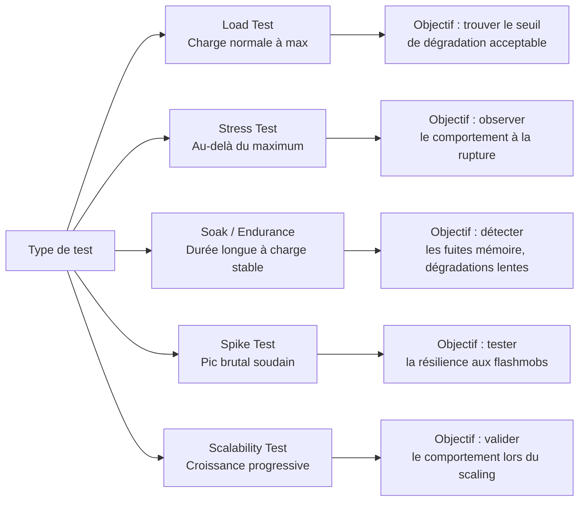
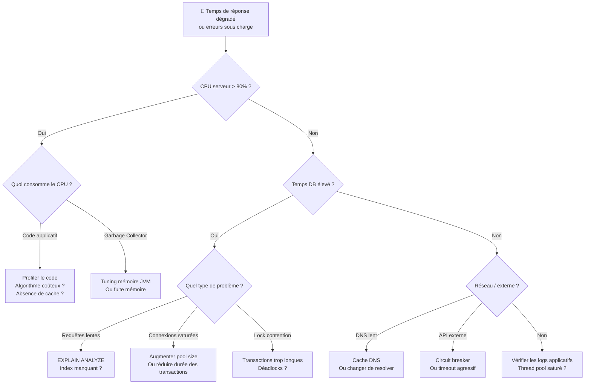

# Performance Testing — Diagnostiquer les lenteurs avant qu'elles coûtent cher

## Objectifs pédagogiques

À la fin de ce module, tu seras capable de :

1. **Distinguer** les différents types de tests de performance (charge, stress, endurance, pic) et choisir le bon selon le problème à résoudre
2. **Identifier** les symptômes caractéristiques d'un problème de performance dans une application web
3. **Concevoir** un scénario de test de charge réaliste à partir de métriques de production
4. **Utiliser** k6 pour exécuter un test de charge et interpréter ses résultats
5. **Localiser** le composant responsable d'une dégradation (frontend, backend, base de données, réseau) à partir des indicateurs disponibles

---

## Mise en situation

Tu rejoins l'équipe QA d'un site e-commerce mid-size — environ 200 000 visites par mois. En temps normal, les pages se chargent en moins d'une seconde. Mais à chaque opération promotionnelle, les retours clients explosent : pages qui ne répondent plus, paniers perdus, transactions qui échouent. Le support reçoit des dizaines de tickets dans la première heure. Et à chaque fois, la même réponse de l'équipe dev : *"En local ça marche parfaitement."*

C'est exactement le problème. Les tests fonctionnels valident le comportement d'un utilisateur. Ils ne disent rien sur ce qui se passe quand il y en a 500 en même temps.

Le réflexe naïf dans cette situation : cliquer manuellement sur le site pendant une promo pour voir si ça rame. Ce n'est pas un test, c'est de l'observation. Ce module t'apprend à anticiper ces situations avant qu'elles arrivent en production.

---

## Contexte et problématique

### Pourquoi les tests fonctionnels ne suffisent pas

Un test fonctionnel répond à la question : *"Est-ce que ça fait ce que ça doit faire ?"* Un test de performance répond à : *"Est-ce que ça tient quand c'est vraiment utilisé ?"*

Ces deux questions sont indépendantes. Une application peut être fonctionnellement parfaite — toutes les règles métier respectées, tous les cas limites couverts — et s'effondrer dès que 50 personnes tentent de se connecter simultanément.

La raison est simple : la charge révèle des problèmes qui n'existent tout simplement pas à un seul utilisateur. Une requête SQL mal indexée prend 2ms seule. À 200 requêtes concurrentes, chacune attendant les ressources de connexion, tu passes à 8 secondes. Un cache applicatif qui fonctionne très bien rafraîchi toutes les 10 secondes devient un goulet d'étranglement quand 300 utilisateurs arrivent dans la même seconde de rafraîchissement.

> 🧠 La performance n'est pas une propriété du code seul — c'est une propriété émergente du système sous charge. Elle implique le code, la base de données, le réseau, l'infrastructure, et leurs interactions simultanées.

### Ce que le performance testing cherche à diagnostiquer

Concrètement, on cherche à répondre à des questions du type :

- Combien d'utilisateurs simultanés l'application supporte-t-elle avant de dégrader ?
- Où se situe le premier point de rupture dans la stack ?
- Le temps de réponse reste-t-il stable sur une heure ? Sur huit heures ?
- L'application se remet-elle correctement d'un pic soudain de trafic ?

Chacune de ces questions correspond à un type de test différent.

---

## Les types de tests de performance

Il y a une confusion fréquente entre ces termes. En pratique, la distinction est utile parce qu'elle change ce qu'on observe et comment on interprète les résultats.



**Load test** — la base. On simule une montée en charge progressive jusqu'au niveau attendu en production, puis on maintient. C'est le test à faire en premier, systématiquement avant chaque release majeure.

**Stress test** — on pousse volontairement au-delà du maximum supportable. L'objectif n'est pas de faire tomber l'application pour le plaisir, mais de comprendre *comment* elle tombe : est-ce qu'elle refuse proprement les nouvelles connexions, ou est-ce qu'elle se fige complètement ? La dégradation gracieuse est une exigence de qualité à part entière.

**Soak test** (ou endurance test) — on maintient une charge modérée pendant plusieurs heures. C'est le seul moyen de détecter une fuite mémoire progressive ou un pool de connexions qui ne libère pas correctement ses ressources. Une application qui tient 30 minutes et plante après 4 heures n'apparaît jamais dans un load test classique.

**Spike test** — un pic brutal et court. Pense aux soldes, aux annonces produits importantes, aux campagnes email qui envoient 100 000 personnes sur la page d'accueil en même temps. La question est : le système absorbe-t-il le choc et revient-il à la normale, ou entre-t-il dans un état dégradé persistant ?

> ⚠️ **Piège fréquent** — Beaucoup d'équipes font uniquement des load tests et pensent avoir couvert la performance. Un système qui tient la charge normale peut s'effondrer sur un spike ou fuir en mémoire sur un soak. Les types de tests ne sont pas interchangeables — chacun cible un risque distinct.

---

## Les métriques à surveiller

Avant de lancer le moindre test, il faut savoir ce qu'on mesure. Sans métriques cibles, un test de performance ne produit qu'un rapport sans signification.

### Les indicateurs fondamentaux

**Response time** — Le temps entre l'envoi de la requête et la réception complète de la réponse. C'est la métrique la plus directement ressentie par l'utilisateur.

L'erreur classique est de ne regarder que la *moyenne*. Une moyenne de 300ms peut cacher une distribution où 95% des requêtes répondent en 100ms et 5% en 4 secondes. Ces 5% représentent des utilisateurs réels qui abandonnent. C'est pour ça qu'on travaille avec des **percentiles** :

- **p50** (médiane) : ce que vit l'utilisateur "typique"
- **p90** : ce que vit l'utilisateur dans le top 10% des plus lentes
- **p95** / **p99** : les cas extrêmes, souvent révélateurs d'un problème spécifique

> 🧠 En SRE et performance testing, la règle est : *never trust averages*. Un p99 de 10 secondes signifie qu'un utilisateur sur cent a une expérience catastrophique — ce qui sur 100 000 visites/jour représente 1 000 personnes.

**Throughput** — Le nombre de requêtes traitées par seconde (req/s ou RPS). C'est l'indicateur de capacité brute du système.

**Error rate** — Le pourcentage de requêtes qui échouent (codes 5xx, timeouts, connexions refusées). En dessous de 1% sur un load test, c'est généralement acceptable. Au-delà, c'est un signal clair.

**Concurrent users / Virtual Users (VU)** — Le nombre d'utilisateurs simulés en parallèle. Attention : ce n'est pas la même chose que le RPS. Un utilisateur qui attend une réponse de 2 secondes "consomme" une connexion pendant 2 secondes même s'il ne génère qu'une seule requête.

### Les métriques systèmes associées

Les métriques applicatives ne racontent qu'une partie de l'histoire. Il faut les corréler avec l'état de l'infrastructure :

| Métrique système | Seuil d'alerte typique | Ce qu'elle révèle |
|---|---|---|
| CPU usage | > 80% soutenu | Calcul intensif, absence de cache |
| Memory usage | Croissance monotone | Fuite mémoire (soak test) |
| DB connection pool | Saturation fréquente | Pool trop petit ou requêtes trop lentes |
| Disk I/O | > 80% utilization | Logs excessifs, requêtes non indexées |
| Network latency | Pic ou variance élevée | Problème réseau, DNS, CDN |
| Garbage collection (JVM) | Pauses > 200ms | Configuration mémoire JVM inadaptée |

---

## Concevoir un scénario réaliste

C'est là que beaucoup de tests ratent leur cible. Simuler 500 utilisateurs qui frappent tous la même page en boucle, c'est facile à écrire mais inutile en pratique — ce n'est pas ce que font de vrais utilisateurs.

### Partir des données de production

Si l'application est déjà en production, tu as de l'or entre les mains : les logs d'accès ou les données analytics. La démarche est la suivante :

1. **Identifier les parcours principaux** — quelles sont les 3 à 5 routes les plus sollicitées ? Souvent : page d'accueil, page produit, recherche, ajout au panier, checkout.
2. **Calculer la distribution du trafic** — si la page produit reçoit 40% des requêtes et le checkout 5%, ton scénario doit respecter ces proportions.
3. **Identifier le pic historique** — quel est le maximum de concurrent users observé ? Sur quelle durée ? C'est ta cible de load test.
4. **Ajouter un facteur de sécurité** — tester à 1.5x ou 2x le pic observé pour avoir de la marge.

Si l'application n'est pas encore en production, on part des exigences non-fonctionnelles définies avec le product owner : *"Le checkout doit répondre en moins de 2 secondes pour 300 utilisateurs simultanés."* C'est un critère d'acceptation de performance — il doit être formalisé exactement comme un critère fonctionnel.

> 💡 Google Analytics ou Matomo donnent directement le nombre d'utilisateurs actifs simultanés en temps réel. Surveille ce chiffre pendant une semaine, note le pic, et utilise-le comme baseline pour tes scénarios.

### Le concept de think time

Un vrai utilisateur ne mitraille pas l'API aussi vite que le réseau le permet. Il lit la page, réfléchit, remplit un formulaire. Ce délai entre deux requêtes s'appelle le **think time**.

L'omettre fausse complètement les résultats : tu simules un robot, pas un humain. Avec 100 VU et un think time de 0, tu génères peut-être 10 000 req/s. Avec un think time de 5 secondes, tu génères 20 req/s — ce qui correspond à quelque chose de réel.

---

## Mise en pratique avec k6

k6 s'est imposé ces dernières années comme l'outil de référence pour le performance testing "moderne". Contrairement à JMeter (basé sur une interface graphique XML lourde), k6 se script en JavaScript, se versionne facilement avec Git, et s'intègre naturellement dans une CI/CD.

### Structure d'un script k6

```javascript
import http from 'k6/http';
import { sleep, check } from 'k6';

// Configuration du test
export const options = {
  stages: [
    { duration: '1m', target: 50 },   // Montée progressive à 50 VU
    { duration: '3m', target: 50 },   // Maintien à 50 VU pendant 3 min
    { duration: '1m', target: 0 },    // Descente progressive
  ],
  thresholds: {
    http_req_duration: ['p(95)<2000'],  // 95% des requêtes < 2s
    http_req_failed: ['rate<0.01'],     // Moins de 1% d'erreurs
  },
};

export default function () {
  // Scénario utilisateur
  const res = http.get('https://mon-app.example.com/products');

  // Assertions sur la réponse
  check(res, {
    'status is 200': (r) => r.status === 200,
    'response time < 2s': (r) => r.timings.duration < 2000,
  });

  sleep(Math.random() * 3 + 2); // Think time : 2 à 5 secondes
}
```

Quelques points importants sur ce script :

- Les **stages** définissent la forme de la courbe de charge — montée, maintien, descente. C'est la structure d'un load test classique.
- Les **thresholds** sont les critères de succès/échec. Si p95 dépasse 2 secondes, k6 retourne un code d'erreur non-zéro — parfait pour bloquer une pipeline CI.
- Le **`sleep()` randomisé** simule un think time variable, plus réaliste qu'une valeur fixe.

### Exécuter le test

```bash
# Installation (macOS)
brew install k6

# Installation (Linux/Debian)
sudo gpg --no-default-keyring \
  --keyring /usr/share/keyrings/k6-archive-keyring.gpg \
  --keyserver hkp://keyserver.ubuntu.com:80 \
  --recv-keys C5AD17C747E3415A3642D57D77C6C491D6AC1D69

echo "deb [signed-by=/usr/share/keyrings/k6-archive-keyring.gpg] \
  https://dl.k6.io/deb stable main" \
  | sudo tee /etc/apt/sources.list.d/k6.list

sudo apt-get update && sudo apt-get install k6

# Lancer un test
k6 run <SCRIPT_FILE>

# Avec une URL configurable via variable d'environnement
k6 run -e BASE_URL=<TARGET_URL> <SCRIPT_FILE>

# Exporter les résultats en JSON (partage avec l'équipe, post-analyse)
k6 run --out json=<OUTPUT_FILE>.json <SCRIPT_FILE>
```

### Lire les résultats

k6 affiche un résumé à la fin de chaque test. Voici comment le lire :

```
✓ status is 200
✓ response time < 2s

checks.........................: 99.23% ✓ 14847  ✗ 114
data_received..................: 45 MB  150 kB/s
data_sent......................: 2.1 MB 7.0 kB/s
http_req_blocked...............: avg=1.2ms   p(90)=1.5ms   p(95)=2.1ms
http_req_duration..............: avg=312ms   p(90)=890ms   p(95)=1.4s   p(99)=3.2s
http_req_failed................: 0.76%  ✓ 0      ✗ 114
http_reqs......................: 14961  49.8/s
vus............................: 50     min=0  max=50
```

Ici, le test **passe** les thresholds (p95 < 2s, erreurs < 1%), mais le **p99 à 3.2 secondes** mérite investigation. Il y a 1% de requêtes très lentes — peut-être un timeout sur une requête spécifique, peut-être une GC pause, peut-être une contention sur une ressource partagée.

> 💡 Le champ `http_req_blocked` (temps passé à attendre une connexion disponible) est souvent le premier indicateur d'un pool de connexions saturé. Si ce chiffre monte pendant le test alors que la durée des requêtes reste stable, regarde du côté du pool HTTP ou du pool de connexions base de données.

---

## Diagnostic — Identifier la source d'un problème

Tu as des résultats qui montrent une dégradation. Comment trouves-tu *pourquoi* ?

### Arbre de diagnostic



### Symptômes fréquents et leur origine probable

**Le temps de réponse augmente progressivement au fil du test, même à charge constante.**

C'est une dégradation temporelle. Les causes classiques : fuite mémoire (chaque requête alloue de la mémoire qui n'est pas libérée), fragmentation du cache, accumulation de logs ou fichiers temporaires. Le soak test est conçu pour révéler exactement ce profil.

**Les erreurs 503 apparaissent brusquement à partir d'un certain nombre de VU, puis disparaissent si on redescend.**

Tu as trouvé le **point de saturation**. Le composant qui décroche a atteint sa limite et commence à rejeter les connexions. C'est souvent un pool de connexions mal dimensionné ou une limite de threads/workers trop basse.

**p50 et p90 sont bons, mais p99 est catastrophique.**

Il y a un sous-ensemble de requêtes qui prend beaucoup plus de temps que les autres. Ce n'est pas un problème de charge généralisé — c'est un problème sur un chemin spécifique. Regarde : est-ce une route particulière ? Un type d'utilisateur ? Une heure précise (GC pause planifiée) ? Corrèle avec les logs de la base de données pour trouver la requête outlier.

**Les erreurs sont réparties de manière aléatoire, sans corrélation avec la charge.**

Erreurs réseau, timeout sur des services tiers, instabilité d'un nœud spécifique derrière le load balancer. À investiguer avec les métriques réseau et les logs d'infrastructure.

> ⚠️ Quand un test de performance échoue, l'instinct est de "booster" l'infrastructure — ajouter de la RAM, augmenter le pool de connexions. Ça peut masquer le vrai problème sans le résoudre. Toujours investiguer la cause avant de modifier les ressources.

---

## Commandes utiles pour le diagnostic serveur

Pour débuguer un problème de performance localisé côté serveur pendant ou après un test :

```bash
# Observer la consommation CPU/mémoire en temps réel
top -b -n 1 | head -20

# Identifier les processus qui consomment le plus de CPU
ps aux --sort=-%cpu | head -10

# Compter les connexions réseau établies
ss -s
netstat -an | grep ESTABLISHED | wc -l

# Vérifier les connexions sur un port précis (ex: 5432 pour PostgreSQL)
ss -tnp | grep :<PORT>

# Surveiller les I/O disque (détecter des écritures excessives)
iostat -x 1 5

# Suivre les logs applicatifs en temps réel pendant le test
tail -f <LOG_FILE_PATH>

# Identifier les slow queries PostgreSQL (depuis psql)
SELECT query, mean_exec_time, calls
FROM pg_stat_statements
ORDER BY mean_exec_time DESC
LIMIT 10;
```

---

## Cas réel en entreprise

**Contexte** : application SaaS B2B, ~500 clients, génération de rapports PDF à la demande. L'équipe reçoit des tickets récurrents de lenteur "aléatoire" sur cette fonctionnalité. En isolé, le rapport se génère en 3 secondes. Pas de problème reproductible en dev.

**Déroulé du diagnostic** :

1. Mise en place d'un load test k6 simulant 30 utilisateurs générant des rapports en simultané — bas volume, mais représentatif du pic d'usage réel en fin de mois.
2. Résultats : p50 à 3.2s, p95 à 28s, p99 à timeout complet. Taux d'erreur : 12%.
3. Corrélation avec les métriques serveur pendant le test : CPU stable à 40%, RAM stable. Mais les logs montrent des `waiting for connection` côté PostgreSQL.
4. Diagnostic : le pool de connexions à la base était configuré à 10 connexions max pour l'ensemble de l'application. Chaque génération de rapport ouvrait une transaction longue (3 secondes). À 30 utilisateurs simultanés, le pool est saturé dès le début — les autres attendent, jusqu'au timeout.
5. **Fix** : augmentation du pool à 50 connexions + refactoring de la génération pour utiliser des transactions courtes (lecture des données) + traitement asynchrone du rendu PDF hors transaction.
6. **Résultat après fix** : p95 à 4.1s, p99 à 6.8s, taux d'erreur < 0.1%. Test de charge validé jusqu'à 80 VU simultanés.

Ce qui est notable ici : sans le test de performance, le pool de connexions aurait continué à saturer en production de manière aléatoire, selon la simultanéité réelle, sans cause identifiable. Les tickets "lenteur aléatoire" auraient continué indéfiniment.

---

## Bonnes pratiques

**Définir les critères d'acceptation avant de tester, pas après.** Un test sans threshold est une observation. Travaille avec le PO pour formaliser : *"La page de recherche doit répondre en moins de 1.5s pour p95, à 200 VU simultanés."* C'est un critère d'acceptation au même titre qu'une règle fonctionnelle — et il doit vivre dans le même outil de suivi.

**Tester sur un environnement le plus proche possible de la production.** Un staging avec 1/10 de la capacité serveur est trompeur : les ratios ne sont pas linéaires. Si un environnement dédié n'est pas possible, documente explicitement l'écart et pondère les résultats en conséquence.

**Versionner tes scripts de test.** Un script k6 dans un repo Git, c'est un test reproductible, auditable, et exécutable en CI. C'est la différence entre "on a testé une fois" et "on teste à chaque release".

**Isoler une variable à la fois lors d'un diagnostic.** Si tu changes le pool de connexions ET la configuration JVM en même temps, tu ne sais pas ce qui a amélioré les résultats. En performance testing comme en débogage, une seule variable à la fois.

**Regarder les percentiles p95 et p99, jamais seulement la moyenne.** La moyenne cache les problèmes. Un SLA basé uniquement sur elle est un SLA qui tolère des expériences catastrophiques pour une fraction des utilisateurs — sans que personne ne le voie dans les rapports.

**Corréler les résultats k6 avec les métriques d'infrastructure.** k6 te dit *ce qui se passe* (temps de réponse, erreurs). Les métriques système te disent *pourquoi* (CPU, mémoire, I/O, connexions). Sans les deux, tu peux constater une dégradation, mais pas la diagnostiquer.

**Commencer par le chemin critique, pas par un scénario exhaustif.** Un scénario ciblé sur la route la plus sollicitée est plus utile qu'un scénario complexe mal calibré. Affine au fur et à mesure, en partant des vrais patterns d'usage.

---

## Résumé

Le performance testing répond à une question que les tests fonctionnels ignorent : *comment se comporte le système quand il est vraiment utilisé ?* Charge, stress, endurance, spike — chaque type de test cible un aspect différent du comportement sous pression. La clé est de travailler avec des métriques précises (percentiles, pas moyennes), des scénarios réalistes (think time, distribution du trafic réel), et des critères d'acceptation définis en amont.

k6 permet de coder ces scénarios comme du vrai code — versionnable, intégrable en CI, lisible par toute l'équipe. Mais l'outil n'est qu'une partie du travail : l'essentiel est dans l'interprétation des résultats et la capacité à suivre le fil du symptôme jusqu'à la cause (pool de connexions, requête non indexée, fuite mémoire).

La prochaine étape logique est l'intégration de ces tests dans une pipeline CI/CD — pour que la performance devienne un critère de merge autant que les tests fonctionnels.

---

<!-- snippet
id: perf_percentiles_concept
type: concept
tech: performance-testing
level: intermediate
importance: high
format: knowledge
tags: performance,metriques,percentiles,sla,monitoring
title: Pourquoi surveiller p95/p99 plutôt que la moyenne
content: La moyenne masque les outliers critiques. Avec p50=100ms et p99=8000ms, la moyenne affiche ~180ms — aucune alarme. Le p99 révèle que 1 utilisateur sur 100 attend 8 secondes. Sur 100 000 requêtes/jour, c'est 1 000 expériences catastrophiques. Toujours vérifier p95 et p99 dans les rapports de performance.
description: La moyenne cache les pics de latence. p95 et p99 révèlent ce que vivent les utilisateurs dans les cas dégradés — critiques pour les SLA.
-->

<!-- snippet
id: perf_threshold_k6_config
type: command
tech: k6
level: intermediate
importance: high
format: knowledge
tags: k6,threshold,performance,ci,acceptance
title: Définir des critères d'acceptation dans k6
command: thresholds: { http_req_duration: ['p(95)<<LATENCY_MS>'], http_req_failed: ['rate<<ERROR_RATE>'] }
example: thresholds: { http_req_duration: ['p(95)<2000'], http_req_failed: ['rate<0.01'] }
description: Si un threshold est dépassé, k6 retourne un code d'erreur non-zéro — ce qui fait échouer la pipeline CI automatiquement.
-->

<!-- snippet
id: perf_types_tests_warning
type: warning
tech: performance-testing
level: intermediate
importance: high
format: knowledge
tags: performance,load-test,stress-test,soak-test,spike-test
title: Load test seul ne couvre pas tous les risques de performance
content: Faire uniquement un load test et considérer la performance "validée" est un piège courant. Les fuites mémoire ne se détectent qu'en soak test, les comportements aux pics soudains qu'en spike test, et les dégradations à la rupture qu'en stress test. Adapter le type de test au risque à couvrir.
description: Chaque type de test de performance couvre un risque distinct. Un load test seul ne détecte ni les fuites mémoire, ni les comportements aux pics.
-->

<!-- snippet
id: perf_think_time_k6
type: tip
tech: k6
level: intermediate
importance: medium
format: knowledge
tags: k6,think-time,scenario,realisme,virtual-users
title: Ajouter un think time réaliste dans k6
content: Sans think time, 100 VU avec des réponses à 50ms génèrent ~2 000 req/s — comportement de robot. Ajouter sleep(Math.random() * 3 + 2) introduit un délai de 2 à 5 secondes et ramène à ~25 req/s, plus proche d'un vrai utilisateur. Utiliser une valeur randomisée plutôt que fixe évite les effets de synchronisation artificielle entre VU.
description: Omettre le think time simule un robot, pas un utilisateur. Un sleep randomisé de 2 à 5 secondes donne des résultats significativement plus réalistes.
-->

<!-- snippet
id: perf_k6_run_basic
type: command
tech: k6
level: beginner
importance: high
