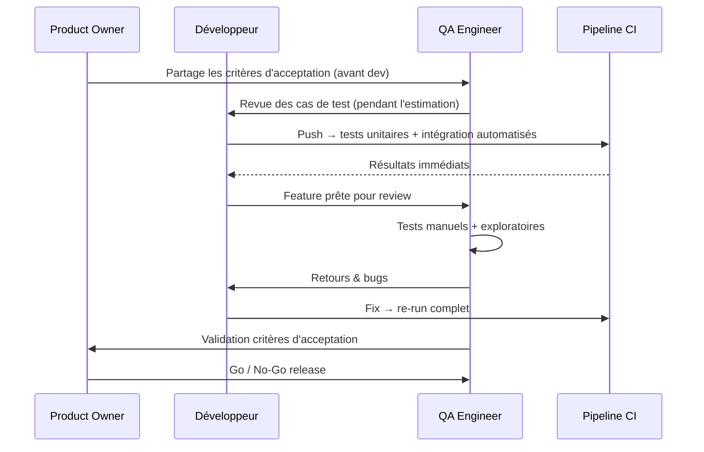
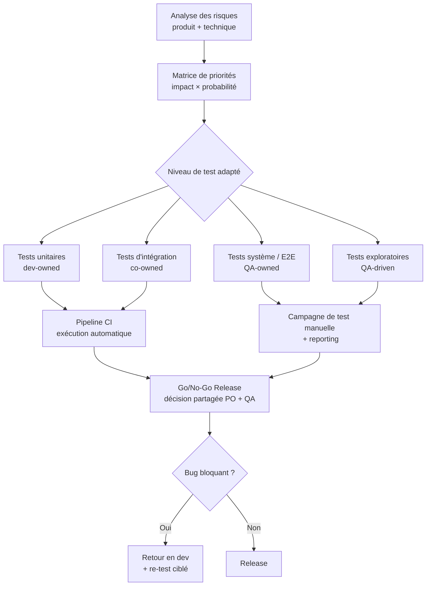

# Stratégie de test en équipe

## Objectifs pédagogiques

À la fin de ce module, vous serez capable de :

- **Décrire** les composants d'une stratégie de test cohérente à l'échelle d'une équipe
- **Distinguer** les responsabilités de chaque rôle dans une organisation QA
- **Concevoir** un plan de couverture en fonction des risques et des priorités métier
- **Identifier** les points de friction classiques dans la collaboration dev/QA et proposer des arbitrages concrets
- **Évaluer** la maturité d'une stratégie de test existante et formuler des axes d'amélioration

---

## Mise en situation

Vous rejoignez une startup de 20 personnes qui livre une application SaaS de gestion RH. L'équipe technique compte 4 développeurs, 1 QA, et 1 Product Owner. Les releases se font toutes les deux semaines.

Chaque développeur teste sa propre feature avant de merger. Le QA fait une passe manuelle la veille de la release. Les bugs en production sont fréquents — surtout sur les fonctionnalités qui se croisent : la gestion des droits affecte à la fois le module congés, la paie et les exports. Tout le monde teste, mais personne ne teste la même chose, au même moment, avec les mêmes critères.

Ce n'est pas un problème de compétence. C'est un problème de stratégie.

---

## Ce que ça veut dire, concrètement

Une **stratégie de test en équipe** est un accord explicite sur *qui teste quoi, quand, avec quels objectifs, et selon quels critères*. Ce n'est pas un document qu'on rédige une fois et qu'on range — c'est un cadre vivant qui structure les décisions quotidiennes.

Sans ce cadre, l'effort de test se répartit au hasard. Les zones risquées sont oubliées ou testées plusieurs fois par des personnes différentes sans coordination. Les critères de "ça passe / ça ne passe pas" varient d'une personne à l'autre. Et quand un bug arrive en prod, personne ne sait exactement *pourquoi* il n'a pas été détecté.

🧠 La stratégie de test répond à une question simple mais rarement posée explicitement : *quelle est notre vision collective de ce que signifie "assez testé" ?* Tout le reste découle de là.

L'idée n'est pas d'ajouter de la bureaucratie. C'est de transformer un travail éparpillé en quelque chose de coordonné, traçable, et améliorable.

---

## Les quatre questions qui structurent une stratégie

Répondre à ces quatre questions, même sommairement, c'est déjà avoir une stratégie. Chacune correspond à une décision concrète que l'équipe doit prendre ensemble.

### Quoi tester — la couverture par le risque

Tout ne mérite pas le même niveau d'attention. La couverture doit être **proportionnelle au risque**, pas à la complexité technique ou à la préférence du développeur qui vient de finir sa feature.

Pour prioriser, on croise deux axes : la **probabilité de régression** (cette zone change-t-elle souvent ? est-elle couplée à beaucoup d'autres ?) et l'**impact métier en cas de bug** (perte de données, indisponibilité, erreur silencieuse ?).

| Zone fonctionnelle | Probabilité de régression | Impact métier | Priorité |
|---|---|---|---|
| Authentification / droits | Faible | Critique | 🔴 Haute |
| Calcul de paie | Moyenne | Critique | 🔴 Haute |
| Export CSV | Haute | Modéré | 🟡 Moyenne |
| Page "À propos" | Faible | Faible | 🟢 Basse |

⚠️ Beaucoup d'équipes testent en priorité ce qu'elles viennent de développer, pas ce qui risque de casser. Un nouveau composant peut avoir 90 % de coverage et un module critique non touché depuis six mois, sans aucun test de régression. La priorité doit suivre le risque, pas l'activité récente.

<!-- snippet
id: qa_strategie_priorite_risque
type: concept
tech: qa
level: intermediate
importance: high
format: knowledge
tags: stratégie,couverture,risque,priorité,qa
title: Prioriser les tests par risque, pas par activité récente
content: La couverture de test doit croiser deux axes : probabilité de régression (zone souvent modifiée, fortement couplée) × impact métier en cas de bug. Une zone critique non touchée depuis 6 mois avec 0 test de régression est plus dangereuse qu'une nouvelle feature avec 90% de coverage unitaire.
description: Tester ce qui vient d'être dev en priorité est un biais naturel — la stratégie saine suit le risque, pas l'activité récente.
-->

<!-- snippet
id: qa_coverage_code_vs_fonctionnel
type: warning
tech: qa
level: intermediate
importance: high
format: knowledge
tags: coverage,tests-unitaires,fonctionnel,métier,qualité
title: 90% de coverage de code ≠ 90% de couverture fonctionnelle
content: Piège : confondre couverture de code (lignes exécutées par les tests) et couverture fonctionnelle (scénarios métier couverts). Cause : les tests unitaires couvrent des chemins techniques, pas des parcours utilisateur. Conséquence : score de coverage élevé mais bugs métier non détectés. Correction : compléter la couverture de code avec une matrice de cas d'usage critiques explicitement tracés.
description: Le coverage de code mesure ce que le code fait — pas ce que le produit est censé faire pour ses utilisateurs.
-->

### Qui teste — la répartition des responsabilités

Dans une équipe mixte dev/QA, les zones de responsabilité doivent être claires sans être rigides. Le QA n'est pas là pour vérifier le travail du dev — il apporte un regard différent, centré sur le comportement du système et les cas d'usage réels. Les développeurs qui "ne testent pas parce que c'est le boulot du QA" créent un goulot d'étranglement structurel.

| Niveau de test | Responsable principal | Rôle secondaire |
|---|---|---|
| Tests unitaires | Développeur | QA peut indiquer les cas limites |
| Tests d'intégration | Développeur + QA | Revue croisée |
| Tests système / E2E | QA | Dev accessible pour debug |
| Tests d'acceptation | QA + Product Owner | Dev en support |
| Tests exploratoires | QA | Optionnel : dev en pairing |

💡 Dans les équipes agiles matures, on parle de **"whole team quality"** : la qualité est une responsabilité partagée. Le QA est un facilitateur et un expert, pas un filtre en fin de chaîne.

<!-- snippet
id: qa_responsabilites_niveaux_test
type: concept
tech: qa
level: intermediate
importance: medium
format: knowledge
tags: équipe,responsabilité,dev,qa,organisation
title: Répartition des responsabilités par niveau de test
content: Tests unitaires → dev (QA peut indiquer cas limites). Tests d'intégration → co-ownership dev+QA. Tests système/E2E → QA principal, dev en support debug. Tests d'acceptation → QA + PO. Tests exploratoires → QA. Le QA n'est pas un filtre en bout de chaîne mais un expert du comportement système — les devs qui délèguent tout créent un goulot d'étranglement structurel.
description: La qualité est une responsabilité partagée — définir qui est propriétaire de chaque niveau évite les zones grises et les duplications.
-->

### Quand tester — intégration dans le cycle, pas en bout de chaîne

L'erreur classique est de réserver les tests à la fin du sprint ou juste avant la release. C'est trop tard pour agir sans pression. Une stratégie saine répartit les tests tout au long du cycle — et le QA intervient *avant* le développement, pas seulement après.



Ce diagramme montre une chose essentielle : le QA n'est pas en attente à la fin. Il contribue à clarifier les critères avant que le code n'existe, ce qui réduit les allers-retours sous pression en fin de sprint.

<!-- snippet
id: qa_shift_left_principe
type: concept
tech: qa
level: intermediate
importance: medium
format: knowledge
tags: shift-left,qa,collaboration,grooming,prévention
title: Shift-left : le QA intervient avant le développement, pas après
content: Le shift-left consiste à impliquer le QA dès l'estimation et le grooming : revue des critères d'acceptation, identification des cas limites, questions sur les zones de régression. Résultat concret : les ambiguïtés sont résolues avant le code, pas en fin de sprint sous pression. Le coût de correction d'un bug identifié en grooming est 10x inférieur à celui d'un bug trouvé en prod.
description: Intégrer le QA en amont (grooming, estimation) divise le coût de détection des bugs et réduit la pression en fin de sprint.
-->

<!-- snippet
id: qa_question_regression_planning
type: tip
tech: qa
level: intermediate
importance: medium
format: knowledge
tags: régression,planning,sprint,réflexe,couverture
title: Poser "qu'est-ce qui peut casser ?" à chaque story en planning
content: Pendant le sprint planning, poser systématiquement : "qu'est-ce qui peut casser dans les autres modules à cause de cette story ?" (pas seulement "qu'est-ce qu'on va tester dans cette story"). Ce réflexe prend 2 minutes et identifie les zones de régression avant que le dev ne commence — sans processus supplémentaire.
description: Changer la question du "quoi tester" au "quoi casser" oriente immédiatement l'attention vers les risques de régression réels.
-->

### Comment décider — la définition of done comme contrat partagé

La **Definition of Done** (DoD) est l'outil le plus simple pour aligner une équipe sur ce que signifie "testé". Elle est rédigée collectivement, affichée, et appliquée à chaque story — pas cochée à la va-vite avant le merge.

Un exemple concret pour une feature standard :

```
✅ Cas de test nominaux documentés et exécutés
✅ Cas limites identifiés lors de la revue d'estimation
✅ Tests de régression sur les zones impactées
✅ Aucun bug critique ou bloquant ouvert
✅ Critères d'acceptation validés avec le PO
✅ Tests automatisés ajoutés si flow critique
```

⚠️ Une DoD qui n'est pas vérifiée à la sprint review perd tout son sens en quelques semaines. Elle doit être un vrai checkpoint, pas une liste de cases cochées en avance pour avoir l'air propre.

<!-- snippet
id: qa_dod_definition_done
type: concept
tech: qa
level: intermediate
importance: high
format: knowledge
tags: dod,definition-of-done,équipe,qualité,process
title: La Definition of Done comme contrat de qualité partagé
content: La DoD est une liste de conditions vérifiées à chaque story avant merge : cas nominaux documentés, cas limites identifiés, régression sur zones impactées, aucun bug bloquant ouvert, critères d'acceptation validés. Elle doit être vérifiée en sprint review — une DoD non appliquée devient décorative en 2 sprints.
description: La DoD transforme "assez testé" d'une opinion individuelle en un critère collectif et vérifiable.
-->

---

## Comment les couches s'articulent

Voici comment les décisions prises sur ces quatre questions se traduisent dans un système cohérent, du risque à la release.



Ce qui compte ici : chaque type de test a un propriétaire, un déclencheur, et alimente une décision. Il n'y a pas de trou entre les niveaux — et la décision finale est partagée, pas unilatérale.

---

## Cas réel — réorganisation QA dans une équipe produit

**Contexte** : une équipe de 6 devs + 1 QA livre une application de gestion documentaire. Les bugs en prod représentent 30 % du volume de tickets. Le QA est débordé avant chaque release, et la qualité est perçue comme un problème "QA" par le reste de l'équipe.

L'intervention s'est déroulée en quatre temps.

**Atelier "cartographie des risques"** (2h avec toute l'équipe) : identification des 5 zones critiques du produit, classées par impact. Résultat : un consensus sur ce qui *doit* être couvert à chaque release — sans que ce soit le QA seul qui le décide.

**Révision de la DoD** : ajout de la case "cas de test nominaux documentés dans Jira avant merge". Les devs renseignent eux-mêmes leurs cas de test dans le ticket, ce qui rend la couverture visible sans réunion supplémentaire.

**Automatisation des smoke tests** (2 semaines d'effort QA + 1 dev) : couverture des 8 parcours critiques en E2E avec Cypress, exécution automatique sur chaque push en main.

**Shift-left** : le QA est invité aux grooming sessions pour commenter les critères d'acceptation en amont. Les ambiguïtés sont résolues avant que le code n'existe.

Résultats mesurés après 2 sprints :
- Volume de bugs en prod : **-45 %**
- Temps de validation avant release : de **2 jours à 4h**
- Temps QA consacré aux tests exploratoires : de **0 % à 40 %**

Ce n'est pas la quantité de tests qui a changé. C'est leur organisation.

---

## Ce qui fait échouer une stratégie — et comment l'éviter

**Le testing theater** est le piège le plus insidieux : des milliers de tests automatisés qui n'ont pas échoué depuis des mois, jamais mis à jour, avec des assertions trop larges pour détecter quoi que ce soit. Ils donnent une fausse confiance et laissent passer des régressions réelles. Un test qui ne peut pas échouer dans les conditions normales d'utilisation est un test inutile. Planifier une revue périodique de la valeur des tests existants, surtout sur les suites E2E anciennes.

<!-- snippet
id: qa_testing_theater_warning
type: warning
tech: qa
level: intermediate
importance: high
format: knowledge
tags: automatisation,qualité,régression,maintenance,piège
title: Tests qui passent toujours = tests qui ne détectent plus rien
content: Piège : des milliers de tests automatisés qui n'ont pas échoué depuis des mois. Cause : tests jamais mis à jour, scénarios trop superficiels, assertions trop larges. Conséquence : fausse confiance, bugs en prod non détectés. Correction : revue périodique des tests automatisés — si un test ne peut pas échouer dans les conditions normales, il ne vaut rien.
description: Un test automatisé qui ne peut pas échouer est un test inutile. La valeur d'un test se mesure à sa capacité à détecter une régression réelle.
-->

**Laisser le QA seul décider de la stratégie** est une autre erreur structurelle. La stratégie de test touche au risque produit — c'est une décision partagée avec le PO et les tech leads. Un QA qui définit seul les priorités finit par tester ce qu'il peut, pas ce qui importe vraiment pour le produit et pour les utilisateurs.

🧠 Une bonne stratégie de test est un outil de communication autant qu'un outil de qualité. Elle rend visible ce qui est testé, ce qui ne l'est pas, et pourquoi. C'est cette visibilité qui permet de prendre des décisions éclairées sur la release — pas un sentiment diffus que "ça devrait aller".

**Imposer une pyramide de tests complète à une équipe immature** produit de la résistance, pas de la qualité. Une équipe qui ne fait aucun test structuré n'a pas besoin d'implémenter unit/intégration/E2E dès le départ. Commencer par la DoD + la matrice de risques suffit à transformer le quotidien — et c'est depuis cette base solide qu'on construit l'automatisation.

<!-- snippet
id: qa_strategie_maturite_equipe
type: tip
tech: qa
level: intermediate
importance: medium
format: knowledge
tags: maturité,stratégie,démarrage,pragmatisme,équipe
title: Commencer par DoD + matrice de risques, pas par la pyramide de tests
content: Une équipe sans tests structurés n'a pas besoin d'implémenter la pyramide de tests complète dès le départ. Étape 1 : définir une DoD collective (2h d'atelier). Étape 2 : identifier les 5 zones critiques du produit via une matrice risque/impact. Ces deux outils seuls réduisent significativement les bugs en prod avant d'investir dans l'automatisation.
description: La stratégie de test doit suivre la maturité de l'équipe — imposer une architecture complète à une équipe immature produit de la résistance, pas de la qualité.
-->

---

## Résumé

Une stratégie de test en équipe, c'est la réponse collective à une question rarement posée explicitement : *qu'est-ce qu'on considère comme "assez testé" ?* Elle repose sur quatre piliers — ce qu'on teste (couverture par le risque), qui teste quoi (responsabilités claires sans être rigides), quand (intégration dans le cycle, pas en bout de chaîne), et selon quels critères (définition of done vérifiée, pas décorative).

Sans ce cadre, les efforts s'éparpillent : certaines zones sont testées dix fois, d'autres jamais. Le QA devient un filtre saturé plutôt qu'un acteur de qualité. Et les bugs en production arrivent non pas parce que personne ne testait, mais parce que personne ne testait ce qui comptait vraiment.

La stratégie ne se décrète pas — elle se construit avec l'équipe, s'adapte au produit, et s'évalue sur ses résultats. C'est depuis ce socle que le prochain module aborde la mesure et l'amélioration de la maturité QA d'une organisation.
